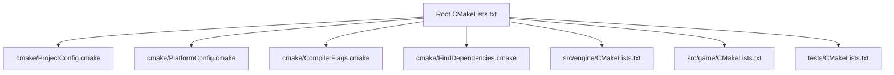
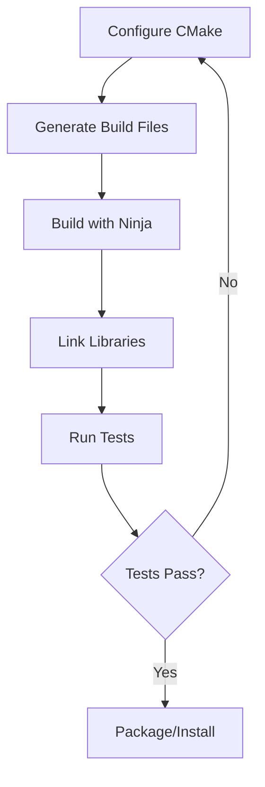

This guide covers CMake configuration, dependency management, and cross-platform build practices for the OmniCpp Template project.

## Why Build System Best Practices Matter

A well-structured build system ensures reproducible builds, fast compilation times, and correct dependency management across Windows, Linux, and WASM platforms. Poor build configuration leads to fragile builds, hard-to-debug errors, and platform-specific bugs.

## CMake Version and Requirements

The project requires **CMake 4.0+** as specified in the root [`CMakeLists.txt`](../../CMakeLists.txt:9). Always use modern CMake features instead of legacy patterns.

### Minimum Version

```cmake
# From CMakeLists.txt
cmake_minimum_required(VERSION 4.0)
set(CMAKE_POLICY_VERSION_MINIMUM 3.5)
project(OmniCppTemplate
    VERSION 1.0.0
    DESCRIPTION "OmniCpp Template Project"
    LANGUAGES CXX
)
```

### Project Structure

Organize CMakeLists.txt files hierarchically to maintain modularity.



## Target-Centric Design

Modern CMake is target-centric. All properties should be attached to targets, not set globally.

### Defining Targets

Use appropriate target types for different build artifacts.

```cmake
# Executable - produces binary
add_executable(OmniCppGame main.cpp)

# Static library - produces .a or .lib
add_library(Engine STATIC src/engine.cpp)

# Shared library - produces .so, .dylib, or .dll
add_library(Engine SHARED src/engine.cpp)

# Interface library - header-only or properties collection
add_library(EngineInterface INTERFACE)
target_include_directories(EngineInterface INTERFACE include)
```

### Transitive Usage Requirements

Use PRIVATE, PUBLIC, and INTERFACE scopes correctly to control dependency propagation.

| Scope | Definition | Use Case |
|--------|-------------|-----------|
| **PRIVATE** | Build requirement only | Internal implementation details |
| **INTERFACE** | Usage requirement only | Header-only libraries, public headers |
| **PUBLIC** | Both build and usage | Public API headers |

```cmake
add_library(Engine src/engine.cpp)
add_library(Graphics src/graphics.cpp)

# Engine exposes Graphics in its public headers
target_link_libraries(Engine PUBLIC Graphics)

# Engine uses Utils internally only
target_link_libraries(Engine PRIVATE Utils)

# EngineInterface provides headers but no implementation
target_include_directories(EngineInterface INTERFACE include)
```

### Target Properties

Configure target properties instead of modifying global flags.

```cmake
# Set C++ standard per target
target_compile_features(Engine PUBLIC cxx_std_23)

# Configure compiler warnings
target_compile_options(Engine PRIVATE
    $<$<CXX_COMPILER_ID:MSVC>:/W4 /WX>
    $<$<NOT:$<CXX_COMPILER_ID:MSVC>>:-Wall -Wextra -Werror>
)

# Position independent code for shared libraries
set_target_properties(Engine PROPERTIES
    CXX_STANDARD 23
    CXX_STANDARD_REQUIRED ON
    CXX_EXTENSIONS OFF
    POSITION_INDEPENDENT_CODE ON
)
```

## Generator Expressions

Generator expressions enable conditional logic based on build configuration, platform, or compiler.

### Configuration-Specific Flags

Apply different flags for Debug and Release builds.

```cmake
target_compile_options(Engine PRIVATE
    $<$<CONFIG:Debug>:-g -O0 -DDEBUG>
    $<$<CONFIG:Release>:-O3 -DNDEBUG>
    $<$<CONFIG:RelWithDebInfo>:-O2 -g>
    $<$<CONFIG:MinSizeRel>:-Os>
)
```

### Compiler-Specific Flags

Handle differences between MSVC, Clang, and GCC.

```cmake
target_compile_options(Engine PRIVATE
    # MSVC specific
    $<$<CXX_COMPILER_ID:MSVC>:/W4 /permissive- /Zc:__cplusplus>
    # Clang specific
    $<$<CXX_COMPILER_ID:Clang>:-Wall -Wextra -Wpedantic>
    # GCC specific
    $<$<CXX_COMPILER_ID:GNU>:-Wall -Wextra -Wpedantic>
)
```

### Platform-Specific Logic

Conditionally include files or set options based on platform.

```cmake
if(WIN32)
    target_sources(Engine PRIVATE src/platform/windows.cpp)
elseif(UNIX)
    target_sources(Engine PRIVATE src/platform/unix.cpp)
endif()

# Using generator expressions
target_sources(Engine PRIVATE
    $<$<PLATFORM_ID:Windows>:src/platform/windows.cpp>
    $<$<PLATFORM_ID:Linux>:src/platform/linux.cpp>
)
```

## Dependency Management

The project supports multiple package managers: CPM (default), Conan, and vcpkg.

### CPM (CMake Package Manager)

CPM is the default package manager for header-only libraries.

```cmake
# From CMakeLists.txt
include(cmake/CPM.cmake)

# Add dependencies
CPMAddPackage(
    NAME glm
    VERSION 0.9.9
    GITHUB_REPOSITORY g-truc/glm
    OPTIONS "GLM_ENABLE_EXPERIMENTAL"
)

CPMAddPackage(
    NAME spdlog
    VERSION 1.12.0
    GITHUB_REPOSITORY gabime/spdlog
)

# Link to CPM packages
target_link_libraries(Engine PUBLIC
    glm::glm
    spdlog::spdlog
)
```

### Conan Integration

Conan is used for binary dependencies and complex package management.

```cmake
include(cmake/ConanIntegration.cmake)

# Find Conan packages
find_package(fmt REQUIRED)
find_package(OpenSSL REQUIRED)

# Link to Conan packages
target_link_libraries(Engine PUBLIC
    fmt::fmt
    OpenSSL::SSL
    OpenSSL::Crypto
)
```

### Vcpkg Integration

Vcpkg provides pre-built binaries for Windows platforms.

```cmake
include(cmake/VcpkgIntegration.cmake)

# Find vcpkg packages
find_package(vulkan CONFIG REQUIRED)
find_package(stb CONFIG REQUIRED)

# Link to vcpkg packages
target_link_libraries(Engine PUBLIC
    Vulkan::Vulkan
    stb::stb_image
)
```

## Cross-Platform Builds

### Output Directories

Configure output directories consistently across platforms.

```cmake
# From CMakeLists.txt
set(CMAKE_RUNTIME_OUTPUT_DIRECTORY ${CMAKE_BINARY_DIR}/bin)
set(CMAKE_LIBRARY_OUTPUT_DIRECTORY ${CMAKE_BINARY_DIR}/lib)
set(CMAKE_ARCHIVE_OUTPUT_DIRECTORY ${CMAKE_BINARY_DIR}/lib)

# Multi-config generators (MSVC, Xcode)
foreach(CONFIG ${CMAKE_CONFIGURATION_TYPES})
    string(TOUPPER ${CONFIG} CONFIG)
    set(CMAKE_RUNTIME_OUTPUT_DIRECTORY_${CONFIG} ${CMAKE_BINARY_DIR}/bin/${CONFIG})
    set(CMAKE_LIBRARY_OUTPUT_DIRECTORY_${CONFIG} ${CMAKE_BINARY_DIR}/lib/${CONFIG})
endforeach()
```

### Toolchain Files

Use toolchain files for cross-compilation.

```cmake
# Emscripten toolchain for WASM
cmake -S . -B build-wasm \
    -DCMAKE_TOOLCHAIN_FILE=cmake/toolchains/emscripten.cmake \
    -DCMAKE_BUILD_TYPE=Release

# ARM64 Linux toolchain
cmake -S . -B build-arm64 \
    -DCMAKE_TOOLCHAIN_FILE=cmake/toolchains/arm64-linux-gnu.cmake \
    -DCMAKE_BUILD_TYPE=Release
```

### CMake Presets

Use CMake presets for reproducible builds.

```json
// From CMakePresets.json
{
  "version": 3,
  "configurePresets": [
    {
      "name": "default",
      "displayName": "Default Config",
      "binaryDir": "${sourceDir}/build",
      "cacheVariables": {
        "CMAKE_BUILD_TYPE": "Release",
        "OMNICPP_BUILD_ENGINE": "ON",
        "OMNICPP_BUILD_GAME": "ON"
      }
    },
    {
      "name": "wasm-debug",
      "displayName": "WASM Debug",
      "binaryDir": "${sourceDir}/build-wasm",
      "toolchainFile": "cmake/toolchains/emscripten.cmake",
      "cacheVariables": {
        "CMAKE_BUILD_TYPE": "Debug"
      }
    }
  ]
}
```

## Build Optimization

### Parallel Builds

Use Ninja for fast parallel builds.

```cmake
# Use Ninja generator for faster builds
cmake -G Ninja -S . -B build

# Or use CMake presets with Ninja
cmake --preset default --generator Ninja
```

### Unity Builds

Enable unity builds to reduce compilation time.

```cmake
# Enable unity builds for faster compilation
set_target_properties(Engine PROPERTIES
    UNITY_BUILD ON
    UNITY_BUILD_BATCH_SIZE 8
)
```

### Precompiled Headers

Use precompiled headers to speed up large projects.

```cmake
# Enable precompiled headers
target_precompile_headers(Engine
    <engine_pch.hpp>
)

# Use precompiled header in sources
target_sources(Engine PRIVATE
    $<$<COMPILE_LANGUAGE:CXX>:src/engine.cpp>
)
```

## Installation Rules

Configure installation rules for library distribution.

```cmake
include(cmake/InstallRules.cmake)

# Install library
install(TARGETS Engine
    LIBRARY DESTINATION ${CMAKE_INSTALL_LIBDIR}
    ARCHIVE DESTINATION ${CMAKE_INSTALL_LIBDIR}
)

# Install headers
install(DIRECTORY include/
    DESTINATION ${CMAKE_INSTALL_INCLUDEDIR}
    FILES_MATCHING PATTERN "*.hpp"
)

# Install CMake config
install(FILES cmake/OmniCppEngineConfig.cmake.in
    DESTINATION ${CMAKE_INSTALL_LIBDIR}/cmake/OmniCppEngine
)
```

## Testing Integration

### Test Targets

Define test targets using CTest.

```cmake
enable_testing()
add_subdirectory(tests)

# Add test executable
add_executable(EngineTests test/engine_tests.cpp)
target_link_libraries(EngineTests PRIVATE Engine)

# Register test with CTest
add_test(NAME EngineTests COMMAND EngineTests)
```

### Coverage

Enable code coverage for test builds.

```cmake
include(cmake/Coverage.cmake)

if(OMNICPP_ENABLE_COVERAGE)
    target_compile_options(Engine PRIVATE
        --coverage
        -fprofile-arcs
        -ftest-coverage
    )
    target_link_options(Engine PRIVATE
        --coverage
    )
endif()
```

## Build System Flow



## Common Pitfalls

### Global State Pollution

Avoid modifying global variables that affect all targets.

```cmake
# Bad: affects all targets
set(CMAKE_CXX_FLAGS "-Wall -Wextra")

# Good: target-specific
target_compile_options(Engine PRIVATE -Wall -Wextra)
```

### Hardcoded Paths

Never hardcode absolute paths in CMakeLists.txt.

```cmake
# Bad: hardcoded path
include_directories(/usr/local/include)

# Good: use CMake variables
include_directories(${CMAKE_INSTALL_PREFIX}/include)
```

### Missing Dependencies

Always check for required dependencies before using them.

```cmake
# Bad: assumes dependency exists
target_link_libraries(Engine PUBLIC Vulkan::Vulkan)

# Good: check first
find_package(Vulkan CONFIG REQUIRED)
if(Vulkan_FOUND)
    target_link_libraries(Engine PUBLIC Vulkan::Vulkan)
else()
    message(FATAL_ERROR "Vulkan not found")
endif()
```

## Related Documentation

- [C++ Best Practices](cpp-best-practices.md) - C++ coding standards
- [Python Best Practices](python-best-practices.md) - Build controller patterns
- [CMake Targets and Properties](../../practices/1_enviroment_and_toolchain/2_build_system/1_cmake_targets_properties_generator.md) - Target-centric design
- [Ninja and Parallelism](../../practices/1_enviroment_and_toolchain/2_build_system/2_ninja_and_parallelism.md) - Build optimization
- [CMake Presets](../../practices/1_enviroment_and_toolchain/2_build_system/3_cmake_presets_and_toolchain_files.md) - Preset configuration
- [Dependency Management](../../practices/1_enviroment_and_toolchain/3_dependency_management/) - Package managers

## Enforcement

Build system best practices are enforced through:

- **CMake presets** - Standardized build configurations
- **CI/CD pipelines** - Automated builds on all platforms
- **Pre-commit hooks** - Format and lint before commit
- **Build validation** - Verify all targets build correctly
