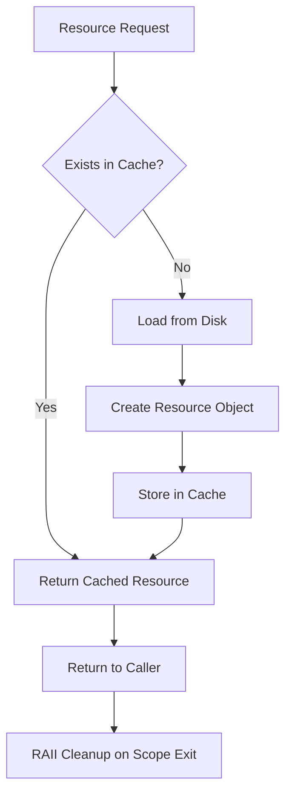

This guide covers C++23 coding standards, memory management patterns, and idiomatic practices for the OmniCpp Template project.

## Why C++ Best Practices Matter

C++ provides powerful features but also introduces complex failure modes: memory leaks, undefined behavior, and resource management errors. Following these practices ensures code is safe, performant, and maintainable across all supported platforms.

## C++23 Features

The project targets **C++23** as specified in [`.clang-tidy`](../../.clang-tidy:98). Use modern features to write cleaner, safer code.

### Designated Initializers

Use designated initializers for struct initialization to improve readability and avoid order dependencies.

```cpp
// From include/engine/IEngine.hpp
struct EngineConfig {
    IRenderer* renderer;
    IInputManager* input_manager;
    IAudioManager* audio_manager;
    IPhysicsEngine* physics_engine;
    IResourceManager* resource_manager;
    ILogger* logger;
    IPlatform* platform;
};

// C++20/23 designated initializer - clear field assignment
EngineConfig config{
    .renderer = vulkan_renderer,
    .input_manager = input_manager,
    .audio_manager = audio_manager
};
```

### std::expected

Use `std::expected` for error handling instead of exceptions or error codes.

```cpp
#include <expected>

std::expected<Texture*, std::string> load_texture(const std::string& path) {
    auto texture = resource_manager->load(path);
    if (!texture) {
        return std::unexpected("Failed to load texture: " + path);
    }
    return texture;
}

// Usage
auto result = load_texture("player.png");
if (result) {
    Texture* tex = *result;
    // Use texture
} else {
    std::cerr << "Error: " << result.error() << "\n";
}
```

### std::span

Use `std::span` for non-owning views into contiguous memory to avoid unnecessary copies.

```cpp
#include <span>

void process_vertices(const std::vector<Vec3>& vertices) {
    // No copy - just a view into the vector's data
    process_vertex_span(std::span<const Vec3>(vertices));
}

void process_vertex_span(std::span<const Vec3> vertices) {
    for (const auto& vertex : vertices) {
        // Process each vertex
    }
}
```

### Concepts

Use concepts to constrain template parameters and improve error messages.

```cpp
#include <concepts>

template<typename T>
concept Renderer = requires(T t) {
    { t.initialize() } -> std::same_as<bool>;
    { t.render() } -> std::same_as<void>;
};

template<Renderer R>
void render_scene(R& renderer) {
    renderer.render();
}
```

## Memory Management

### RAII (Resource Acquisition Is Initialization)

RAII is the foundation of safe C++ code. Resources are acquired in constructors and released in destructors automatically.

```cpp
class VulkanBuffer {
public:
    VulkanBuffer(VkDevice device, VkDeviceSize size) {
        // Acquire resource in constructor
        vkCreateBuffer(device, &create_info, nullptr, &buffer);
    }

    // Copy constructor - handle ownership transfer
    VulkanBuffer(VulkanBuffer&& other) noexcept
        : buffer(other.buffer), device(other.device) {
        other.buffer = VK_NULL_HANDLE;
    }

    // Destructor - release resource automatically
    ~VulkanBuffer() {
        if (buffer != VK_NULL_HANDLE) {
            vkDestroyBuffer(device, buffer, nullptr);
        }
    }

    // Delete copy constructor to prevent double-free
    VulkanBuffer(const VulkanBuffer&) = delete;
    VulkanBuffer& operator=(const VulkanBuffer&) = delete;

private:
    VkBuffer buffer;
    VkDevice device;
};
```

### Smart Pointers

Use smart pointers to manage ownership and prevent memory leaks.

```cpp
#include <memory>

class Engine {
public:
    Engine() = default;

    void set_renderer(std::unique_ptr<IRenderer> renderer) {
        // Transfer ownership - no manual delete needed
        m_renderer = std::move(renderer);
    }

private:
    std::unique_ptr<IRenderer> m_renderer;
    std::shared_ptr<ILogger> m_logger;  // Shared ownership
};

// Factory function returning unique_ptr
std::unique_ptr<IInputManager> create_input_manager() {
    return std::make_unique<InputManager>();
}
```

### Move Semantics

Implement move constructors and move assignment operators for efficient resource transfer.

```cpp
class Texture {
public:
    // Move constructor - steal resources from other
    Texture(Texture&& other) noexcept
        : m_id(other.m_id), m_width(other.m_width) {
        other.m_id = 0;  // Nullify source
    }

    // Move assignment
    Texture& operator=(Texture&& other) noexcept {
        if (this != &other) {
            cleanup();  // Release current resources
            m_id = other.m_id;
            m_width = other.m_width;
            other.m_id = 0;  // Nullify source
        }
        return *this;
    }

private:
    unsigned int m_id;
    int m_width;
};
```

## Naming Conventions

Follow the naming conventions enforced by [`.clang-tidy`](../../.clang-tidy:49-72).

| Type | Convention | Example |
|-------|-------------|----------|
| **Classes/Structs** | CamelCase | `EngineConfig`, `VulkanRenderer` |
| **Functions/Methods** | camelBack | `create_engine()`, `process_events()` |
| **Variables** | camelBack | `delta_time`, `vertex_count` |
| **Member Variables** | camelBack with `m_` prefix | `m_renderer`, `m_initialized` |
| **Constants** | UPPER_CASE | `MAX_ENTITIES`, `DEFAULT_FPS` |
| **Private Members** | camelBack with `m_` prefix | `m_buffer`, `m_device` |

```cpp
class VulkanRenderer {
public:
    void initialize();  // camelBack

private:
    VkDevice m_device;  // m_ prefix for members
    static constexpr int MAX_FRAMES_IN_FLIGHT = 2;  // UPPER_CASE for constants
};
```

## Const Correctness

Use `const` and `constexpr` to express immutability and enable compiler optimizations.

```cpp
class MathUtils {
public:
    // constexpr - computed at compile time
    static constexpr float PI = 3.14159265359f;

    // const method - doesn't modify object
    float distance(const Vec3& a, const Vec3& b) const {
        return (a - b).length();
    }

    // const reference - no copy, no modification
    void process_vertices(const std::span<const Vec3>& vertices) const;
};
```

## Error Handling

### Use [[nodiscard]]

Mark functions that return values that must not be ignored.

```cpp
// From include/engine/IEngine.hpp
[[nodiscard]] bool initialize(const EngineConfig& config);
[[nodiscard]] const char* engine_get_version();

// Compiler will warn if return value is ignored
auto engine = create_engine(config);
// engine->initialize(config);  // Warning: ignoring return value
if (!engine->initialize(config)) {
    return -1;
}
```

### Exception Safety

Write exception-safe code using RAII and smart pointers.

```cpp
class ResourceManager {
public:
    std::expected<Texture*, std::string> load_texture(const std::string& path) {
        // RAII ensures cleanup even if exception thrown
        auto file = std::make_unique<File>(path);

        if (!file->is_valid()) {
            return std::unexpected("Invalid file: " + path);
        }

        // Exception-safe allocation
        auto texture = std::make_unique<Texture>();
        texture->load_from_file(*file);

        return texture.release();  // Transfer ownership to caller
    }
};
```

## Performance Best Practices

### Pass by Reference

Avoid unnecessary copies by passing large objects by reference.

```cpp
// Bad: copies the entire vector
void process_vertices(std::vector<Vec3> vertices);

// Good: no copy, just a reference
void process_vertices(const std::vector<Vec3>& vertices);

// Best: span for non-owning view
void process_vertices(std::span<const Vec3> vertices);
```

### Reserve Capacity

Pre-allocate vector capacity when size is known to avoid reallocations.

```cpp
std::vector<Entity> entities;
entities.reserve(1000);  // Pre-allocate for 1000 entities

for (int i = 0; i < 1000; ++i) {
    entities.emplace_back(create_entity(i));  // No reallocations
}
```

### constexpr Evaluation

Use `constexpr` for compile-time computations.

```cpp
constexpr int calculate_max_entities() {
    return 1000 * 10;  // Computed at compile time
}

// Used as array size
std::array<Entity, calculate_max_entities()> entity_pool;
```

## Code Style

### Formatting

Code is automatically formatted via [`.clang-format`](../../.clang-format:1) with GNU style and 100-character column limit.

```bash
# Format all C++ files
python OmniCppController.py format

# Check formatting without modifying
python OmniCppController.py format --check
```

### Linting

Static analysis is enforced via [`.clang-tidy`](../../.clang-tidy:1) with warnings treated as errors.

```bash
# Run clang-tidy
python OmniCppController.py lint --cpp-only

# Apply automatic fixes
python OmniCppController.py lint --cpp-only --fix
```

## Common Pitfalls

### Undefined Behavior

Avoid operations that cause undefined behavior.

```cpp
// Bad: uninitialized variable
int value;
std::cout << value;  // Undefined behavior

// Good: always initialize
int value = 0;
std::cout << value;

// Bad: signed integer overflow
int a = INT_MAX;
int b = a + 1;  // Undefined behavior

// Good: use unsigned or check for overflow
unsigned int a = UINT_MAX;
if (a < UINT_MAX) {
    unsigned int b = a + 1;
}
```

### Memory Leaks

Use RAII and smart pointers to prevent memory leaks.

```cpp
// Bad: manual memory management
void* buffer = malloc(1024);
// ... use buffer
free(buffer);  // Easy to forget or skip on early return

// Good: RAII
std::vector<char> buffer(1024);
// ... use buffer
// Automatic cleanup when buffer goes out of scope
```

### Dangling References

Avoid returning references to temporary objects.

```cpp
// Bad: returns reference to temporary
const std::string& get_name() {
    std::string temp = "Player";
    return temp;  // Dangling reference!
}

// Good: return by value (move semantics)
std::string get_name() {
    return "Player";  // Move or copy elision
}

// Good: return reference to member
const std::string& get_name() const {
    return m_name;  // Safe if member outlives object
}
```

## Resource Management Flow



## Related Documentation

- [Build System Best Practices](build-system-best-practices.md) - CMake integration
- [Engine Best Practices](engine-best-practices.md) - Engine-specific patterns
- [Testing Best Practices](testing-best-practices.md) - Testing C++ code
- [C++23 Modules](../../practices/2_compilation_model/2_modules/1_cpp_23.md) - Module system
- [Symbol Visibility](../../practices/2_compilation_model/1_translation/2_symbol_visibility.md) - Exporting symbols

## Enforcement

C++ best practices are enforced through:

- **clang-format** - Automatic code formatting
- **clang-tidy** - Static analysis with warnings as errors
- **Pre-commit hooks** - Format and lint before commit
- **CI/CD** - Automated checks on all platforms
