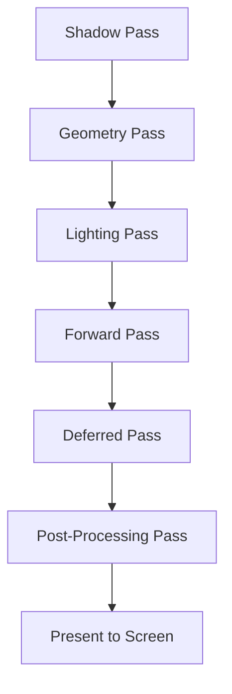
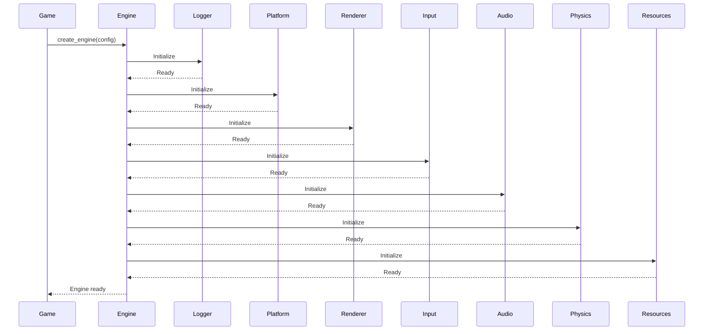
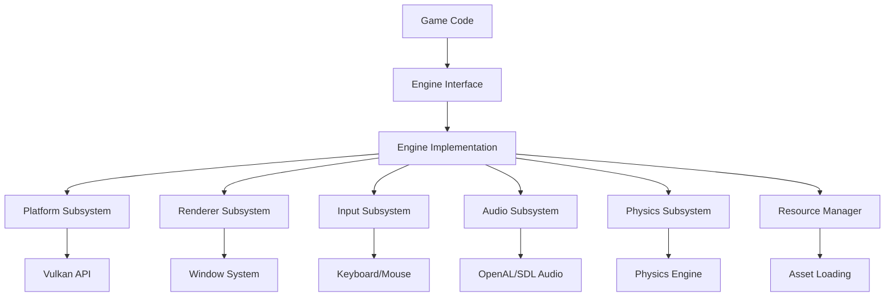

This guide covers engine architecture patterns, ECS design, resource management, and rendering best practices for the OmniCpp Template.

## Why Engine Best Practices Matter

Game engines are complex systems with many moving parts. Following these practices ensures the engine is performant, maintainable, and extensible across different platforms and use cases.

## ECS Architecture

Entity Component System (ECS) is the core architectural pattern for the engine.

### Component Design

Components should be plain data structures without logic.

```cpp
// From include/engine/ecs/TransformComponent.hpp
namespace omnicpp {
namespace ecs {

struct TransformComponent {
    float x;
    float y;
    float z;
    float rotation_x;
    float rotation_y;
    float rotation_z;
    float scale_x;
    float scale_y;
    float scale_z;
};

struct MeshComponent {
    std::vector<Vec3> vertices;
    std::vector<uint32_t> indices;
    std::string mesh_path;
};

struct CameraComponent {
    float fov;
    float near_plane;
    float far_plane;
    Vec3 position;
    Vec3 target;
};

} // namespace omnicpp::ecs
```

### System Design

Systems should contain logic and operate on components.

```cpp
// From src/engine/ecs/TransformSystem.cpp
#include "engine/ecs/TransformComponent.hpp"
#include "engine/ecs/Entity.hpp"

namespace omnicpp {
namespace ecs {

class TransformSystem {
public:
    void update(float delta_time, EntityManager& entity_manager) {
        // Get all entities with TransformComponent
        auto entities = entity_manager.get_entities_with_component<TransformComponent>();

        for (auto entity : entities) {
            auto* transform = entity_manager.get_component<TransformComponent>(entity);
            if (transform) {
                // Update transform based on velocity
                transform->x += transform->velocity_x * delta_time;
                transform->y += transform->velocity_y * delta_time;
                transform->z += transform->velocity_z * delta_time;
            }
        }
    }
};

} // namespace omnicpp::ecs
```

### Entity Management

Use entity IDs instead of pointers for stable references.

```cpp
// From include/engine/ecs/Entity.hpp
namespace omnicpp {
namespace ecs {

using EntityID = uint64_t;
constexpr EntityID INVALID_ENTITY = 0;

class EntityManager {
public:
    EntityID create_entity() {
        if (m_next_id >= MAX_ENTITIES) {
            return INVALID_ENTITY;
        }
        EntityID id = m_next_id++;
        m_entity_count++;
        return id;
    }

    void destroy_entity(EntityID id) {
        if (id == INVALID_ENTITY || id >= m_next_id) {
            return;
        }
        // Remove all components
        remove_all_components(id);
        m_entity_count--;
    }

private:
    static constexpr EntityID MAX_ENTITIES = 10000;
    EntityID m_next_id = 1;
    size_t m_entity_count = 0;
};

} // namespace omnicpp::ecs
```

## Resource Management

### RAII Resource Handles

Use RAII for automatic resource cleanup.

```cpp
// From include/engine/resources/ResourceManager.hpp
namespace omnicpp {
namespace resources {

class TextureHandle {
public:
    TextureHandle(VkDevice device, VkImage image, VkImageView view)
        : m_device(device), m_image(image), m_view(view) {
        // Create sampler
        VkSamplerCreateInfo sampler_info{};
        vkCreateSampler(device, &sampler_info, nullptr, &m_sampler);
    }

    ~TextureHandle() {
        if (m_sampler != VK_NULL_HANDLE) {
            vkDestroySampler(m_device, m_sampler, nullptr);
        }
        if (m_view != VK_NULL_HANDLE) {
            vkDestroyImageView(m_device, m_view, nullptr);
        }
        if (m_image != VK_NULL_HANDLE) {
            vkDestroyImage(m_device, m_image, nullptr);
        }
    }

    // Delete copy operations
    TextureHandle(const TextureHandle&) = delete;
    TextureHandle& operator=(const TextureHandle&) = delete;

    // Move operations
    TextureHandle(TextureHandle&& other) noexcept;
    TextureHandle& operator=(TextureHandle&& other) noexcept;

private:
    VkDevice m_device;
    VkImage m_image;
    VkImageView m_view;
    VkSampler m_sampler;
};

} // namespace omnicpp::resources
```

### Resource Caching

Cache frequently used resources to avoid redundant loading.

```cpp
// From src/engine/resources/resource_manager.cpp
#include <unordered_map>
#include <memory>

namespace omnicpp {
namespace resources {

class ResourceManager {
public:
    std::expected<Texture*, std::string> load_texture(const std::string& path) {
        // Check cache first
        auto it = m_texture_cache.find(path);
        if (it != m_texture_cache.end()) {
            return it->second.get();  // Return cached texture
        }

        // Load from disk
        auto texture = load_texture_from_disk(path);
        if (!texture) {
            return std::unexpected("Failed to load texture: " + path);
        }

        // Add to cache
        m_texture_cache[path] = std::unique_ptr<Texture>(texture);
        return texture;
    }

    void unload_unused_resources() {
        // Remove resources with reference count of 0
        for (auto it = m_texture_cache.begin(); it != m_texture_cache.end();) {
            if (it->second.use_count() == 0) {
                it = m_texture_cache.erase(it);
            } else {
                ++it;
            }
        }
    }

private:
    std::unordered_map<std::string, std::unique_ptr<Texture>> m_texture_cache;
};

} // namespace omnicpp::resources
```

## Rendering Pipeline

### Frame Graph

Organize rendering passes into a dependency graph.



### Command Buffers

Use command buffers for efficient rendering.

```cpp
// From include/engine/render/VulkanRenderer.hpp
namespace omnicpp {
namespace render {

class VulkanRenderer {
public:
    void record_command_buffer(VkCommandBuffer cmd_buffer) {
        vkBeginCommandBuffer(cmd_buffer, &begin_info);

        // Begin render pass
        VkRenderPassBeginInfo render_pass_info{};
        render_pass_info.renderPass = m_render_pass;
        render_pass_info.framebuffer = m_framebuffers[m_current_frame];
        vkCmdBeginRenderPass(cmd_buffer, &render_pass_info);

        // Draw entities
        for (const auto& entity : m_visible_entities) {
            auto* mesh = entity_manager.get_component<MeshComponent>(entity);
            if (mesh) {
                draw_mesh(cmd_buffer, *mesh);
            }
        }

        vkCmdEndRenderPass(cmd_buffer);
        vkEndCommandBuffer(cmd_buffer);
    }

private:
    void draw_mesh(VkCommandBuffer cmd_buffer, const MeshComponent& mesh) {
        VkBuffer vertex_buffers[] = {mesh.vertex_buffer};
        VkDeviceSize offsets[] = {0};

        vkCmdBindVertexBuffers(cmd_buffer, mesh.pipeline, 1, vertex_buffers, offsets);
        vkCmdBindIndexBuffer(cmd_buffer, mesh.index_buffer, 0, VK_INDEX_TYPE_UINT32);
        vkCmdDrawIndexed(cmd_buffer, mesh.index_count, 1, VK_INDEX_TYPE_UINT32, 0);
    }
};

} // namespace omnicpp::render
```

### Descriptor Sets

Organize descriptor sets by update frequency.

```cpp
// Per-frame descriptor sets (updated every frame)
struct PerFrameDescriptorSets {
    VkDescriptorSet camera_set;
    VkDescriptorSet material_set;
    VkDescriptorSet lighting_set;
};

// Per-material descriptor sets (updated when material changes)
struct PerMaterialDescriptorSets {
    VkDescriptorSet texture_set;
    VkDescriptorSet sampler_set;
};

// Static descriptor sets (never change)
struct StaticDescriptorSets {
    VkDescriptorSet global_set;
};
```

## Subsystem Initialization

### Initialization Order

Initialize subsystems in dependency order to ensure all dependencies are ready.



### Dependency Validation

Validate subsystem dependencies before initialization.

```cpp
// From src/engine/Engine.cpp
bool Engine::initialize(const EngineConfig& config) {
    // Validate required subsystems
    if (!config.renderer) {
        m_logger->error("Renderer is required");
        return false;
    }
    if (!config.input_manager) {
        m_logger->error("Input manager is required");
        return false;
    }

    // Initialize in dependency order
    if (!m_logger->initialize()) {
        return false;
    }

    if (!m_platform->initialize()) {
        m_logger->error("Platform initialization failed");
        return false;
    }

    if (!config.renderer->initialize()) {
        m_logger->error("Renderer initialization failed");
        return false;
    }

    if (!config.input_manager->initialize()) {
        m_logger->error("Input manager initialization failed");
        return false;
    }

    m_initialized = true;
    return true;
}
```

## Performance

### Object Pooling

Use object pools to avoid runtime allocations.

```cpp
// From include/engine/ecs/Entity.hpp
namespace omnicpp {
namespace ecs {

template<typename T, size_t N>
class ObjectPool {
public:
    ObjectPool() {
        for (size_t i = 0; i < N; ++i) {
            m_free_indices.push(i);
        }
    }

    T* allocate() {
        if (m_free_indices.empty()) {
            return nullptr;
        }
        size_t index = m_free_indices.back();
        m_free_indices.pop_back();
        return &m_objects[index];
    }

    void deallocate(T* object) {
        size_t index = object - &m_objects[0];
        m_free_indices.push_back(index);
    }

private:
    std::array<T, N> m_objects;
    std::vector<size_t> m_free_indices;
};

} // namespace omnicpp::ecs
```

### Frame Budgeting

Track frame time to maintain consistent frame rates.

```cpp
// From src/engine/Engine.cpp
void Engine::update(float delta_time) {
    if (!m_initialized) return;

    // Accumulate frame time
    m_frame_time_accumulator += delta_time;

    // Update subsystems
    if (m_input_manager) {
        m_input_manager->process_events(delta_time);
    }
    if (m_physics_engine) {
        m_physics_engine->update(delta_time);
    }

    // Cap frame time to target FPS
    if (m_frame_time_accumulator >= m_target_frame_time) {
        m_frame_time_accumulator -= m_target_frame_time;
        render();
    }
}

void Engine::set_target_fps(float fps) {
    m_target_frame_time = 1.0f / fps;
}
```

## Platform Abstraction

### Interface Design

Use abstract interfaces for platform-specific implementations.

```cpp
// From include/engine/IPlatform.hpp
namespace omnicpp {

class IPlatform {
public:
    virtual ~IPlatform() = default;

    virtual bool create_window(int width, int height, const char* title) = 0;
    virtual void destroy_window() = 0;
    virtual void swap_buffers() = 0;
    virtual bool should_close() const = 0;
    virtual void poll_events() = 0;
};

} // namespace omnicpp
```

### Platform Implementations

Provide implementations for each supported platform.

```cpp
// Windows implementation
class WindowsPlatform : public IPlatform {
public:
    bool create_window(int width, int height, const char* title) override {
        // Win32 API window creation
        m_hwnd = CreateWindowEx(...);
        return m_hwnd != nullptr;
    }

    void poll_events() override {
        MSG msg;
        while (PeekMessage(&msg, nullptr, 0, 0, PM_REMOVE)) {
            TranslateMessage(&msg);
            DispatchMessage(&msg);
        }
    }
};

// Linux implementation
class LinuxPlatform : public IPlatform {
public:
    bool create_window(int width, int height, const char* title) override {
        // X11 window creation
        m_display = XOpenDisplay(nullptr);
        m_window = XCreateWindow(m_display, ...);
        return m_window != nullptr;
    }

    void poll_events() override {
        // X11 event handling
        while (XPending(m_display)) {
            XEvent event;
            XNextEvent(m_display, &event);
            // Handle event
        }
    }
};
```

## Common Pitfalls

### Tight Coupling

Avoid tight coupling between subsystems.

```cpp
// Bad: renderer directly accesses input
class VulkanRenderer {
    void render() {
        auto input = get_input_manager();  // Tight coupling!
        if (input->is_key_pressed(KEY_W)) {
            // Move camera
        }
    }
};

// Good: renderer receives input through engine
class VulkanRenderer {
    void render(const InputState& input_state) {
        if (input_state.is_key_pressed(KEY_W)) {
            // Move camera
        }
    }
};
```

### Global State

Avoid global state in subsystems.

```cpp
// Bad: global state
static IRenderer* g_renderer = nullptr;

void set_renderer(IRenderer* renderer) {
    g_renderer = renderer;  // Global state!
}

// Good: state passed through engine
class Engine {
private:
    IRenderer* m_renderer;

public:
    void set_renderer(IRenderer* renderer) {
        m_renderer = renderer;  // Encapsulated state
    }
};
```

### Resource Leaks

Always release resources in destructors.

```cpp
// Bad: manual resource management
class VulkanRenderer {
    VkBuffer m_vertex_buffer;

    void initialize() {
        vkCreateBuffer(..., &m_vertex_buffer);
    }

    // Forgot to destroy m_vertex_buffer!
};

// Good: RAII resource management
class VulkanRenderer {
    VulkanBuffer m_vertex_buffer;  // RAII wrapper

    void initialize() {
        m_vertex_buffer = VulkanBuffer(device, size);
    }

    // m_vertex_buffer destroyed automatically
};
```

## Engine Architecture Flow



## Related Documentation

- [C++ Best Practices](cpp-best-practices.md) - C++ coding standards
- [Build System Best Practices](build-system-best-practices.md) - CMake integration
- [Python Best Practices](python-best-practices.md) - Build controller patterns
- [Testing Best Practices](testing-best-practices.md) - Testing engine code
- [Engine Overview](../engine/index.md) - Engine architecture
- [ECS Architecture](../engine/ecs.md) - Entity Component System details
- [Renderer Reference](../engine/renderer.md) - Vulkan rendering API
- [Resource Manager Reference](../engine/resource-manager.md) - Asset loading API

## Enforcement

Engine best practices are enforced through:

- **Interface contracts** - Abstract interfaces for all subsystems
- **RAII patterns** - Automatic resource cleanup
- **Dependency injection** - Subsystems receive dependencies through config
- **Initialization validation** - All subsystems validated before use
- **Performance monitoring** - Frame time and memory tracking
