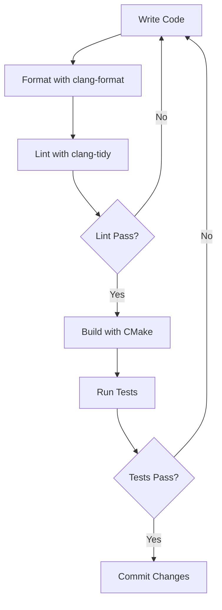

This section documents the coding standards, architectural patterns, and development workflows that ensure the OmniCpp Template produces maintainable, performant, and cross-platform software.

## Why Best Practices Matter

Following established best practices prevents common pitfalls that plague C++ projects: memory leaks, undefined behavior, build system fragility, and platform-specific bugs. These guidelines are derived from real-world production experience and the C++ Core Guidelines.

## Best Practices Categories

| Category | Description | Key Topics |
|-----------|-------------|-------------|
| **C++ Best Practices** | Language-level standards and idioms | C++23 features, RAII, memory management, naming conventions |
| **Build System** | CMake configuration and dependency management | Target-centric design, generator expressions, cross-platform builds |
| **Python Best Practices** | Build controller and tooling standards | Type hints, error handling, logging, code organization |
| **Engine Best Practices** | Game engine architecture patterns | ECS design, resource management, rendering pipeline |
| **Testing Best Practices** | Quality assurance strategies | Unit tests, integration tests, coverage goals |

## Quick Reference

### C++ Standards

The project targets **C++23** with strict compiler flags enforced via [`.clang-tidy`](../../.clang-tidy:1). All code must compile without warnings under `-Wall -Wextra -Wpedantic`.

### Code Formatting

Automated formatting is enforced via [`.clang-format`](../../.clang-format:1) using GNU style with 100-character column limit. Run formatting before committing:

```bash
python OmniCppController.py format
```

### Build System

CMake 4.0+ is required with target-centric design. See [Build System Best Practices](build-system-best-practices.md) for detailed guidance on target properties and dependency management.

### Python Standards

The build controller uses strict type hints and comprehensive error handling. See [Python Best Practices](python-best-practices.md) for logging patterns and exception handling.

## Development Workflow



## Quality Gates

Before merging code, ensure:

1. **Zero compiler warnings** - All warnings treated as errors in CI
2. **clang-tidy clean** - No modernize, bugprone, or performance warnings
3. **Tests passing** - Unit and integration tests must pass
4. **Coverage threshold** - Minimum 80% line coverage for new code

## Related Documentation

- [C++ Best Practices](cpp-best-practices.md) - Language-level guidelines
- [Build System Best Practices](build-system-best-practices.md) - CMake and dependency management
- [Python Best Practices](python-best-practices.md) - Build controller standards
- [Engine Best Practices](engine-best-practices.md) - Game engine architecture
- [Testing Best Practices](testing-best-practices.md) - Quality assurance strategies
- [Environment and Toolchain](../../practices/1_enviroment_and_toolchain/) - Compiler and build system setup
- [Compilation Model](../../practices/2_compilation_model/) - C++23 modules and translation

## Enforcement

Quality standards are enforced through:

- **Pre-commit hooks** - Automatic formatting and linting
- **CI/CD pipelines** - Automated testing on all platforms
- **Code reviews** - Peer review for architectural decisions
- **Static analysis** - clang-tidy, cppcheck, and sanitizers

## Getting Started

New contributors should read these guides in order:

1. [C++ Best Practices](cpp-best-practices.md) - Foundation for all C++ code
2. [Build System Best Practices](build-system-best-practices.md) - Understanding the build system
3. [Engine Best Practices](engine-best-practices.md) - Engine-specific patterns
4. [Testing Best Practices](testing-best-practices.md) - Writing effective tests
