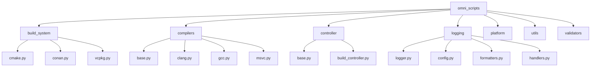
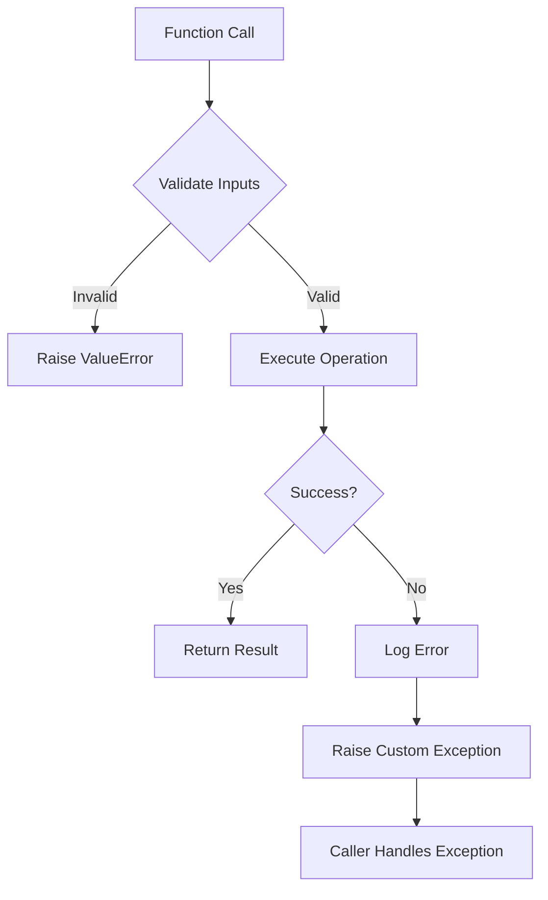

This guide covers Python coding standards, type hints, error handling, and logging practices for the OmniCpp build controller and tooling.

## Why Python Best Practices Matter

Python is used for build orchestration, testing, and tooling in this project. Following these practices ensures the build system is reliable, maintainable, and provides clear error messages when issues occur.

## Type Hints

Use strict type hints for all function signatures and class attributes.

### Function Signatures

Always annotate function parameters and return types.

```python
# From omni_scripts/build.py
from typing import Optional, List, Dict, Any
from pathlib import Path

def find_cmake_executable(project_root: Path) -> Optional[Path]:
    """Find CMake executable in system PATH.

    Args:
        project_root: Root directory of the project.

    Returns:
        Path to CMake executable if found, None otherwise.
    """
    cmake_paths = [
        project_root / "build" / "bin" / "cmake",
        project_root / "build" / "bin" / "cmake.exe",
    ]

    for path in cmake_paths:
        if path.exists():
            return path

    return None
```

### Class Attributes

Use type hints for class attributes and methods.

```python
# From omni_scripts/build_system/cmake.py
from dataclasses import dataclass
from typing import Optional

@dataclass
class CMakeConfig:
    """Configuration for CMake build system."""
    build_type: str
    generator: Optional[str] = None
    toolchain: Optional[str] = None
    preset: Optional[str] = None

    def validate(self) -> bool:
        """Validate configuration parameters."""
        valid_build_types = ["Debug", "Release", "RelWithDebInfo", "MinSizeRel"]
        return self.build_type in valid_build_types
```

### Generic Types

Use generic types for reusable components.

```python
from typing import TypeVar, Generic

T = TypeVar('T')

class Result(Generic[T]):
    """Generic result type for operations that can fail."""
    def __init__(self, value: Optional[T], error: Optional[str] = None) -> None:
        self.value = value
        self.error = error

    def is_success(self) -> bool:
        return self.error is None

    def unwrap(self) -> T:
        if self.error:
            raise ValueError(f"Cannot unwrap failed result: {self.error}")
        return self.value
```

## Error Handling

### Custom Exceptions

Define specific exception classes for different error scenarios.

```python
# From omni_scripts/exceptions.py
class BuildError(Exception):
    """Base exception for build-related errors."""
    pass

class ToolchainError(BuildError):
    """Exception raised when toolchain is not available."""
    pass

class ControllerError(Exception):
    """Base exception for controller-related errors."""
    pass

class InvalidTargetError(ControllerError):
    """Exception raised when an invalid target is specified."""
    def __init__(self, message: str, target: Optional[str] = None) -> None:
        self.target = target
        super().__init__(message)
```

### Exception Propagation

Let exceptions propagate to the top level for proper handling.

```python
# From OmniCppController.py
def build(
    self,
    target: str,
    pipeline: str,
    preset: str,
    config: str,
    compiler: Optional[str] = None,
    clean: bool = False,
) -> int:
    """Build the project.

    Raises:
        InvalidTargetError: If target is invalid.
        InvalidPipelineError: If pipeline is invalid.
        BuildError: If build process fails.
    """
    try:
        # Validate target
        if target not in ["engine", "game", "standalone", "all"]:
            raise InvalidTargetError(
                f"Invalid target: {target}",
                target=target
            )

        # Create build context
        context = BuildContext(
            product=target,
            task=pipeline,
            arch="x64",
            build_type=config,
            compiler=compiler,
            is_cross_compilation=False,
            lib_flag=target in ["engine", "all"],
            st_flag=target in ["game", "standalone", "all"],
        )

        # Execute build pipeline
        self.build_manager.run_clean_build_pipeline(context)
        return 0

    except (BuildError, ToolchainError) as e:
        self.logger.error(f"Build error: {e}")
        return 1
    except Exception as e:
        self.logger.error(f"Unexpected error: {e}")
        return 1
```

### Defensive Programming

Validate inputs and handle edge cases.

```python
def execute_command(
    command: List[str],
    cwd: Optional[Path] = None,
    timeout: int = 300,
) -> subprocess.CompletedProcess:
    """Execute command with timeout and error handling.

    Args:
        command: Command to execute as list of strings.
        cwd: Working directory for command execution.
        timeout: Maximum time to wait for command completion.

    Returns:
        CompletedProcess object with stdout, stderr, and return code.

    Raises:
        subprocess.TimeoutExpired: If command exceeds timeout.
        FileNotFoundError: If working directory doesn't exist.
    """
    if cwd and not cwd.exists():
        raise FileNotFoundError(f"Working directory not found: {cwd}")

    try:
        result = subprocess.run(
            command,
            cwd=cwd,
            timeout=timeout,
            capture_output=True,
            text=True,
            check=False,  # Don't raise on non-zero exit
        )
        return result
    except subprocess.TimeoutExpired:
        raise subprocess.TimeoutExpired(
                command,
                timeout,
                f"Command timed out after {timeout} seconds"
            )
```

## Logging

### Structured Logging

Use the custom logging system for consistent log formatting.

```python
# From omni_scripts/logging/logger.py
from omni_scripts.logging import get_logger, log_info, log_error, log_warning, log_success

logger = get_logger(__name__)

def configure_build(config: CMakeConfig) -> bool:
    """Configure build system with CMake."""
    log_info(f"Configuring build system...")
    log_info(f"Build type: {config.build_type}")

    if config.generator:
        log_info(f"Generator: {config.generator}")

    try:
        # Configuration logic
        result = run_cmake(config)
        log_success("CMake configuration completed successfully")
        return True
    except Exception as e:
        log_error(f"Configure error: {e}")
        return False
```

### Log Levels

Use appropriate log levels for different message types.

```python
# From omni_scripts/logging/__init__.py
from enum import Enum

class LogLevel(Enum):
    """Log level enumeration."""
    DEBUG = 10
    INFO = 20
    WARNING = 30
    ERROR = 40
    SUCCESS = 50

def log_message(level: LogLevel, message: str) -> None:
    """Log message at specified level."""
    timestamp = datetime.now().strftime("%Y-%m-%d %H:%M:%S")
    print(f"[{timestamp}] [{level.name}] {message}")
```

## Code Organization

### Module Structure

Organize code into logical modules with clear responsibilities.



### Import Organization

Use relative imports within the package and absolute imports for external dependencies.

```python
# Good: relative import within package
from .base import BuildError
from .cmake import CMakeManager

# Good: absolute import for external dependencies
from pathlib import Path
import subprocess
from typing import Optional
```

### Single Responsibility

Each module should have a single, well-defined responsibility.

```python
# omni_scripts/build_system/cmake.py - Only handles CMake operations
class CMakeManager:
    """Manager for CMake build system operations."""

    def __init__(self, build_dir: Path) -> None:
        """Initialize CMake manager."""
        self.build_dir = build_dir

    def configure(self, source_dir: Path, build_type: str) -> bool:
        """Configure CMake project."""
        pass

    def build(self, target: str) -> bool:
        """Build CMake project."""
        pass

# omni_scripts/controller/build_controller.py - Only handles build orchestration
class BuildController:
    """Controller for build operations."""

    def __init__(self, project_root: Path) -> None:
        """Initialize build controller."""
        self.cmake_manager = CMakeManager(project_root / "build")
        self.conan_manager = ConanManager(project_root / "build")
```

## Performance

### Lazy Loading

Import modules only when needed to reduce startup time.

```python
# Bad: imports all modules at startup
import omni_scripts.build
import omni_scripts.cmake
import omni_scripts.conan
import omni_scripts.vcpkg

# Good: import only when needed
def run_build():
    from omni_scripts.build import BuildManager
    manager = BuildManager(Path.cwd())
    manager.run_clean_build_pipeline(context)
```

### Caching

Cache expensive operations to avoid repeated work.

```python
from functools import lru_cache
from typing import Optional

@lru_cache(maxsize=128)
def find_compiler(platform_info: PlatformInfo) -> Optional[CompilerInfo]:
    """Find compiler with caching.

    This function is called frequently during build operations,
    so caching the result improves performance.
    """
    # Compiler detection logic
    return detected_compiler
```

## Code Style

### PEP 8 Compliance

Follow PEP 8 style guide for Python code.

```python
# Good: PEP 8 compliant
def calculate_build_time(
    start_time: float,
    end_time: float,
) -> float:
    """Calculate build time in seconds."""
    return end_time - start_time

# Bad: violates PEP 8
def calculate_build_time(start_time,end_time):
    return end_time-start_time
```

### Docstrings

Use Google-style docstrings for all functions and classes.

```python
def execute_with_terminal_setup(
    command: str,
    compiler: str,
    cwd: Optional[str] = None,
) -> int:
    """Execute command with terminal environment setup.

    This function sets up the appropriate terminal environment
    for MinGW compilers (mingw-clang, mingw-gcc) and executes
    the command within that environment.

    Args:
        command: Command to execute as string.
        compiler: Compiler identifier (e.g., "mingw-clang", "mingw-gcc").
        cwd: Optional working directory for command execution.

    Returns:
        Exit code (0 for success, non-zero for failure).

    Raises:
        FileNotFoundError: If working directory doesn't exist.
        subprocess.TimeoutExpired: If command exceeds timeout.
    """
    # Implementation
    pass
```

## Testing

### Unit Tests

Write unit tests for all utility functions.

```python
# tests/test_utils.py
import unittest
from pathlib import Path
from omni_scripts.utils.file_utils import find_file

class TestFileUtils(unittest.TestCase):
    """Test cases for file utility functions."""

    def test_find_file_exists(self):
        """Test finding existing file."""
        temp_file = Path("/tmp/test_file.txt")
        temp_file.touch()

        result = find_file(Path("/tmp"), "test_file.txt")
        self.assertIsNotNone(result)
        self.assertEqual(result, temp_file)

    def test_find_file_not_exists(self):
        """Test finding non-existent file."""
        result = find_file(Path("/tmp"), "non_existent.txt")
        self.assertIsNone(result)

if __name__ == "__main__":
    unittest.main()
```

### Mock Objects

Use mock objects for testing external dependencies.

```python
from unittest.mock import Mock, patch
import unittest

class TestBuildController(unittest.TestCase):
    """Test cases for build controller."""

    @patch('omni_scripts.build_system.cmake.CMakeManager')
    def test_build_success(self, mock_cmake):
        """Test successful build."""
        mock_cmake.return_value.configure.return_value = True
        mock_cmake.return_value.build.return_value = True

        controller = BuildController(Path.cwd())
        result = controller.build("engine", "Build Project", "default", "release")

        self.assertEqual(result, 0)
```

## Common Pitfalls

### Silent Failures

Never silently ignore exceptions without logging.

```python
# Bad: silent failure
try:
    result = subprocess.run(command, check=True)
except subprocess.CalledProcessError:
    pass  # Error is lost!

# Good: log and handle
try:
    result = subprocess.run(command, check=True)
except subprocess.CalledProcessError as e:
    log_error(f"Command failed: {e}")
    raise
```

### Type Errors

Avoid using `Any` type when specific types are known.

```python
# Bad: loses type information
def process_data(data: Any) -> Any:
    return data

# Good: preserves type information
from typing import Dict, List

def process_data(data: Dict[str, List[int]]) -> Dict[str, int]:
    return {key: sum(values) for key, values in data.items()}
```

### Mutable Defaults

Never use mutable default arguments.

```python
# Bad: mutable default argument
def append_to_list(items: List[str], new_items: List[str] = []) -> List[str]:
    items.extend(new_items)
    return items

# Good: immutable default argument
from typing import Optional

def append_to_list(
    items: List[str],
    new_items: Optional[List[str]] = None,
) -> List[str]:
    if new_items is None:
        new_items = []
    items.extend(new_items)
    return items
```

## Error Handling Flow



## Related Documentation

- [C++ Best Practices](cpp-best-practices.md) - C++ coding standards
- [Build System Best Practices](build-system-best-practices.md) - CMake integration
- [Engine Best Practices](engine-best-practices.md) - Engine-specific patterns
- [Testing Best Practices](testing-best-practices.md) - Testing strategies
- [Platform Detection](../../practices/1_enviroment_and_toolchain/4_development_enviroment_analysis/) - Development environment setup

## Enforcement

Python best practices are enforced through:

- **mypy** - Static type checking
- **pylint** - Code quality analysis
- **black** - Code formatting
- **Pre-commit hooks** - Format and lint before commit
- **CI/CD** - Automated checks on all platforms
