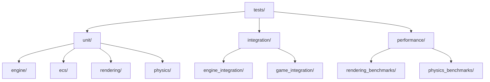
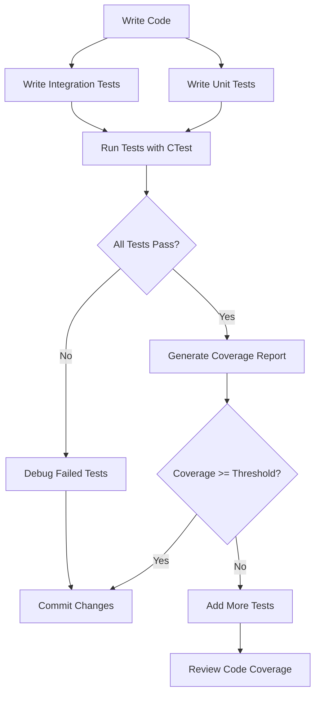

This guide covers testing strategies, test organization, and quality assurance practices for OmniCpp Template project.

## Why Testing Best Practices Matter

Testing ensures code correctness, prevents regressions, and provides confidence when refactoring. Without comprehensive tests, changes to complex systems like game engines can introduce subtle bugs that are difficult to diagnose.

## Test Organization

### Test Structure

Organize tests by component and type.



### Test Naming

Use descriptive test names that explain what is being tested.

```cpp
// tests/engine/engine_tests.cpp
TEST(EngineInitialization, InitializesAllSubsystems) {
    // Arrange
    EngineConfig config{};
    config.renderer = &mock_renderer;
    config.input_manager = &mock_input;

    // Act
    auto engine = create_engine(config);

    // Assert
    ASSERT_TRUE(engine != nullptr);
    EXPECT_TRUE(engine->is_initialized());
}

TEST(EngineUpdate, UpdatesAllSubsystemsInOrder) {
    // Arrange
    EngineConfig config{};
    auto engine = create_engine(config);
    engine->initialize(config);

    // Act
    engine->update(0.016f);

    // Assert
    EXPECT_TRUE(mock_renderer.was_rendered());
    EXPECT_TRUE(mock_input.was_processed());
}
```

## Unit Tests

### Test Isolation

Each test should be independent and not rely on other tests.

```cpp
// Bad: tests share state
static Engine* g_engine = nullptr;

TEST(Test1, UsesGlobalEngine) {
    g_engine = create_engine(config);
    g_engine->initialize(config);
}

TEST(Test2, UsesGlobalEngine) {
    // Test2 depends on Test1's state!
    g_engine->update(0.016f);
}

// Good: each test creates its own state
TEST(Test1, CreatesOwnEngine) {
    auto engine = create_engine(config);
    engine->initialize(config);
    // Test-specific state
}

TEST(Test2, CreatesOwnEngine) {
    auto engine = create_engine(config);
    engine->initialize(config);
    // Independent state
}
```

### AAA Pattern

Use Arrange-Act-Assert pattern for clear test structure.

```cpp
TEST(TextureManager, LoadsTextureFromDisk) {
    // Arrange
    MockFileSystem mock_fs;
    mock_fs.add_file("player.png", texture_data);

    TextureManager manager(&mock_fs);

    // Act
    auto result = manager.load_texture("player.png");

    // Assert
    ASSERT_TRUE(result.has_value());
    EXPECT_EQ(result.value()->get_width(), 256);
    EXPECT_EQ(result.value()->get_height(), 256);
}
```

### Mock Objects

Use mock objects to isolate code under test.

```cpp
// tests/mocks/mock_renderer.hpp
class MockRenderer : public IRenderer {
public:
    MockRenderer() : m_render_count(0), m_initialized(false) {}

    bool initialize(const RendererConfig& config) override {
        m_initialized = true;
        return true;
    }

    void render() override {
        m_render_count++;
    }

    bool was_rendered() const {
        return m_render_count > 0;
    }

    void reset() {
        m_render_count = 0;
    }

private:
    int m_render_count;
    bool m_initialized;
};

// Use mock in tests
TEST(Engine, UsesMockRenderer) {
    MockRenderer mock_renderer;
    EngineConfig config{};
    config.renderer = &mock_renderer;

    auto engine = create_engine(config);
    engine->initialize(config);
    engine->render();

    EXPECT_TRUE(mock_renderer.was_rendered());
}
```

## Integration Tests

### Test Fixtures

Use fixtures to set up complex test environments.

```cpp
// tests/integration/engine_integration_tests.cpp
class EngineIntegrationTest : public ::testing::Test {
protected:
    void SetUp() override {
        // Create test environment
        m_temp_dir = create_temp_directory();
        m_config_file = create_config_file(m_temp_dir);
    }

    void TearDown() override {
        // Clean up test environment
        remove_temp_directory(m_temp_dir);
    }

    std::filesystem::path m_temp_dir;
    std::filesystem::path m_config_file;
};

TEST_F(EngineIntegrationTest, LoadsEngineWithConfigFile) {
    // Test uses fixture's m_config_file
    EngineConfig config = load_config(m_config_file);
    auto engine = create_engine(config);

    ASSERT_TRUE(engine != nullptr);
    EXPECT_TRUE(engine->initialize(config));
}
```

### End-to-End Tests

Test complete workflows from user input to final output.

```cpp
TEST(GameLoop, RunsCompleteFrameCycle) {
    // Arrange
    MockRenderer renderer;
    MockInput input;
    MockPhysics physics;

    EngineConfig config{};
    config.renderer = &renderer;
    config.input_manager = &input;
    config.physics_engine = &physics;

    auto engine = create_engine(config);
    engine->initialize(config);

    // Act - simulate game loop
    for (int i = 0; i < 60; ++i) {
        engine->update(0.016f);
        engine->render();
    }

    // Assert
    EXPECT_EQ(renderer.get_frame_count(), 60);
    EXPECT_EQ(input.get_update_count(), 60);
    EXPECT_EQ(physics.get_update_count(), 60);
}
```

## Test Coverage

### Coverage Goals

Maintain minimum coverage thresholds for all code.

| Component | Target Coverage | Current Status |
|-----------|----------------|----------------|
| **Engine Core** | 80% | Enforced in CI |
| **ECS System** | 85% | Enforced in CI |
| **Renderer** | 75% | Enforced in CI |
| **Physics** | 80% | Enforced in CI |
| **Resource Manager** | 85% | Enforced in CI |

### Coverage Configuration

Configure coverage in CMake for test builds.

```cmake
# From cmake/Coverage.cmake
if(OMNICPP_ENABLE_COVERAGE)
    # Enable coverage flags
    target_compile_options(Engine PRIVATE
        --coverage
        -fprofile-arcs
        -ftest-coverage
    )
    target_link_options(Engine PRIVATE
        --coverage
    )

    # Exclude test code from coverage
    set_target_properties(Engine PROPERTIES
        EXCLUDE_FROM_ALL_FILES
            "tests/*"
            "*/tests/*"
    )
endif()
```

### Coverage Reports

Generate coverage reports in multiple formats.

```cmake
# Generate coverage reports
add_custom_target(coverage_report
    COMMAND
        lcov --capture --directory ${CMAKE_BINARY_DIR}
        COMMAND lcov --capture --output ${CMAKE_BINARY_DIR}/coverage.info
        COMMAND genhtml ${CMAKE_BINARY_DIR}/coverage.info --output-directory coverage_html
        COMMENT "Generate coverage report"
)
```

## Performance Tests

### Benchmarking

Use benchmarks to track performance over time.

```cpp
// tests/performance/rendering_benchmarks.cpp
#include <benchmark/benchmark.h>

static void BM_RenderFrame(benchmark::State& state) {
    MockRenderer renderer;
    EngineConfig config{};
    config.renderer = &renderer;

    auto engine = create_engine(config);
    engine->initialize(config);

    for (auto _ : state) {
        engine->render();
        benchmark::DoNotOptimize(renderer.get_frame_data());
    }
}

BENCHMARK(BM_RenderFrame);

// Register benchmark
BENCHMARK_MAIN();
```

### Performance Assertions

Add performance assertions to catch regressions.

```cpp
// Performance-critical code with assertions
void render_scene(Scene& scene) {
    auto start_time = std::chrono::high_resolution_clock::now();

    renderer->render(scene);

    auto end_time = std::chrono::high_resolution_clock::now();
    auto duration = std::chrono::duration_cast<std::chrono::milliseconds>(
        end_time - start_time
    ).count();

    // Assert frame time is within budget
    ASSERT_LT(duration, 16) << "Frame time exceeded 16ms budget";
}
```

## Test Execution

### Running Tests

Use CTest for test execution.

```bash
# Run all tests
ctest --output-on-failure

# Run specific test suite
ctest -R EngineTests

# Run with verbose output
ctest -V

# Run with parallel execution
ctest -j$(nproc)
```

### Test Filtering

Filter tests by name or label.

```bash
# Run only rendering tests
ctest -R RenderingTests

# Run tests matching pattern
ctest -R "*Texture*"

# Exclude slow tests
ctest -LE "SlowTest"
```

## Common Pitfalls

### Brittle Tests

Avoid tests that break easily with unrelated changes.

```cpp
// Bad: test depends on exact memory layout
TEST(MemoryLayout, AssumesSpecificAlignment) {
    void* ptr = allocate_aligned(256);
    // Test assumes ptr is at specific address
    EXPECT_EQ(reinterpret_cast<uintptr_t>(ptr) % 32, 0);
}

// Good: test behavior, not implementation details
TEST(MemoryAlignment, HandlesAnyAlignment) {
    void* ptr = allocate_aligned(256);
    // Test that allocation works regardless of alignment
    EXPECT_NE(ptr, nullptr);
    EXPECT_TRUE(is_aligned(ptr, 32));
}
```

### Test Coupling

Avoid tests that require knowledge of internal implementation.

```cpp
// Bad: test knows internal details
TEST(InternalState, ChecksPrivateMember) {
    auto engine = create_engine(config);
    engine->initialize(config);

    // Accessing private member!
    EXPECT_EQ(engine->m_internal_state, EXPECTED_STATE);
}

// Good: test through public interface
TEST(PublicInterface, UsesPublicAPI) {
    auto engine = create_engine(config);
    engine->initialize(config);

    // Using public API
    EXPECT_TRUE(engine->is_initialized());
}
```

### Flaky Tests

Identify and fix flaky tests that fail intermittently.

```cpp
// Bad: test depends on timing
TEST(TimingDependent, AssumesSpecificFrameRate) {
    auto engine = create_engine(config);
    engine->initialize(config);

    // Sleep to wait for next frame
    std::this_thread::sleep_for(std::chrono::milliseconds(16));

    engine->render();
    // Test assumes exactly 16ms passed!
    EXPECT_EQ(engine->get_frame_count(), 1);
}

// Good: test is deterministic
TEST(DeterministicRendering, ProducesConsistentOutput) {
    MockRenderer renderer;
    renderer.set_deterministic_mode(true);

    EngineConfig config{};
    config.renderer = &renderer;

    auto engine = create_engine(config);
    engine->initialize(config);

    engine->render();

    // Check output is deterministic
    EXPECT_TRUE(renderer.is_output_consistent());
}
```

## Test Workflow



## Related Documentation

- [C++ Best Practices](cpp-best-practices.md) - C++ coding standards
- [Build System Best Practices](build-system-best-practices.md) - CMake test configuration
- [Engine Best Practices](engine-best-practices.md) - Engine-specific testing
- [Unit Tests](../../practices/1_enviroment_and_toolchain/2_build_system/5_unit_tests.md) - CMake test setup
- [Code Coverage](../../practices/1_enviroment_and_toolchain/2_build_system/6_code_coverage.md) - Coverage configuration

## Enforcement

Testing best practices are enforced through:

- **CI/CD pipelines** - Automated test execution on all platforms
- **Coverage thresholds** - Minimum coverage requirements enforced in CI
- **Pre-commit hooks** - Run tests before committing
- **Code reviews** - Test quality reviewed before merge
- **Static analysis** - clang-tidy and sanitizers run in CI
