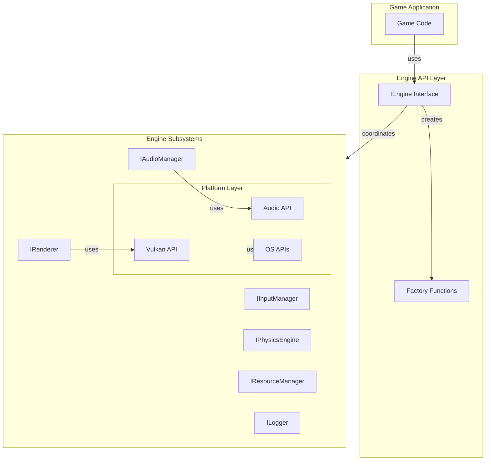

# Engine Architecture

The OmniCPP Engine follows a modular, plugin-based architecture designed for extensibility, testability, and cross-platform compatibility. This document explains the architectural patterns, design decisions, and best practices used throughout the engine.

## Core Architectural Principles

### 1. Interface-Driven Design

The engine is built around abstract interfaces that define contracts for all subsystems:

```cpp
// From include/engine/IEngine.hpp:39
class IEngine {
public:
    virtual bool initialize(const EngineConfig& config) = 0;
    virtual void shutdown() = 0;
    virtual void update(float delta_time) = 0;
    virtual void render() = 0;
    // ... getter methods for subsystems
};
```

**Benefits:**
- **Runtime extensibility**: Subsystems can be swapped without recompiling the engine
- **Platform independence**: Different implementations can be provided for Windows, Linux, and WASM
- **Testability**: Mock implementations can be injected for unit testing
- **ABI stability**: Interfaces provide stable binary compatibility

### 2. Plugin-Based Architecture

The engine is designed to be loaded dynamically at runtime using C-style factory functions:

```cpp
// From include/engine/Engine.hpp:48
extern "C" OMNICPP_EXPORT IEngine* create_engine(const EngineConfig& config);
extern "C" OMNICPP_EXPORT void destroy_engine(IEngine* engine);
extern "C" OMNICPP_EXPORT const char* engine_get_version();
```

**Benefits:**
- **Hot-swapping**: Engine implementations can be replaced at runtime
- **Version compatibility**: Version checking before loading
- **Clean separation**: Engine and game code are completely decoupled

### 3. C++23 Best Practices

The engine leverages modern C++23 features and idioms:

#### RAII (Resource Acquisition Is Initialization)

All resources are managed through RAII patterns:

```cpp
// From include/engine/memory/memory_manager.hpp:30
class MemoryManager {
public:
    MemoryManager();
    ~MemoryManager(); // Automatic cleanup

    // Delete copy operations
    MemoryManager(const MemoryManager&) = delete;
    MemoryManager& operator=(const MemoryManager&) = delete;

    // Enable move operations
    MemoryManager(MemoryManager&&) noexcept;
    MemoryManager& operator=(MemoryManager&&) noexcept;
};
```

#### Pimpl Idiom (Pointer to Implementation)

Implementation details are hidden behind `std::unique_ptr<Impl>` for ABI stability:

```cpp
// From include/engine/memory/memory_manager.hpp:81
class MemoryManager {
private:
    struct Impl;
    std::unique_ptr<Impl> m_impl; // Pimpl idiom for ABI stability
};
```

**Benefits:**
- **ABI stability**: Changes to implementation don't break binary compatibility
- **Faster compilation**: Implementation changes don't require recompiling headers
- **Encapsulation**: Implementation details are completely hidden

#### [[nodiscard]] Attribute

Functions that return values are marked with `[[nodiscard]]` to prevent ignoring return values:

```cpp
// From include/engine/memory/memory_manager.hpp:49
[[nodiscard]] void* allocate(size_t size, size_t alignment = alignof(std::max_align_t));
[[nodiscard]] const MemoryStats& get_stats() const noexcept;
[[nodiscard]] bool has_leaks() const noexcept;
```

## Architectural Layers



## Design Patterns

### 1. Factory Pattern

The engine uses the factory pattern for creating subsystems:

```cpp
// Factory function creates engine instance
IEngine* engine = create_engine(config);

// Engine creates subsystems internally
bool initialize(const EngineConfig& config) {
    m_renderer = config.renderer;
    m_input_manager = config.input_manager;
    // ...
}
```

### 2. Strategy Pattern

Different implementations of the same interface can be swapped at runtime:

```cpp
// Different renderer implementations
class VulkanRenderer : public IRenderer { /* ... */ };
class OpenGLRenderer : public IRenderer { /* ... */ };

// Different audio implementations
class OpenALAudioManager : public IAudioManager { /* ... */ };
class XAudio2AudioManager : public IAudioManager { /* ... */ };
```

### 3. Observer Pattern

Input events are dispatched to registered callbacks:

```cpp
// From include/engine/input/InputManager.hpp:182
using InputCallback = std::function<void(const InputEvent&)>;

class InputManager {
public:
    void register_callback(InputCallback callback);

private:
    std::vector<InputCallback> m_callbacks;
};
```

### 4. Singleton Pattern (Limited)

Some subsystems use a singleton-like pattern for global access:

```cpp
// Logger is often accessed globally
namespace omnicpp {
    extern ILogger* g_logger;
}
```

## Memory Management

### Allocation Strategy

The engine uses a custom memory manager with tracking and leak detection:

```cpp
// From include/engine/memory/memory_manager.hpp:17
struct MemoryStats {
    size_t total_allocated{ 0 };
    size_t total_freed{ 0 };
    size_t current_usage{ 0 };
    size_t allocation_count{ 0 };
};
```

**Features:**
- **Alignment support**: Memory can be allocated with specific alignment requirements
- **Leak detection**: Tracks allocations and deallocations to detect leaks
- **Statistics**: Provides detailed memory usage information

### Resource Ownership

Resources use unique ownership semantics:

```cpp
// From include/engine/scene/Scene.hpp:88
void add_entity(std::unique_ptr<ecs::Entity> entity);
std::unique_ptr<ecs::Entity> remove_entity(uint64_t entity_id);
```

**Benefits:**
- **Automatic cleanup**: Resources are automatically destroyed when no longer needed
- **No double-free**: Unique ownership prevents accidental double deletion
- **Clear ownership**: It's always clear who owns a resource

## Threading Model

### Current State

The engine is primarily **single-threaded** with the following characteristics:

- **Main thread**: All game logic runs on the main thread
- **Rendering**: Currently single-threaded (multi-threaded rendering planned)
- **Physics**: Single-threaded simulation
- **Audio**: Single-threaded mixing

### Planned Improvements

Future versions will support:

- **Job system**: Parallel task execution
- **Multi-threaded rendering**: Render commands generated on multiple threads
- **Async resource loading**: Load resources in background threads

## Error Handling

### Return Value Pattern

Functions return `bool` to indicate success/failure:

```cpp
// From include/engine/IEngine.hpp:48
virtual bool initialize(const EngineConfig& config) = 0;

// From include/engine/IRenderer.hpp:28
virtual bool initialize() = 0;
virtual bool begin_frame() = 0;
```

### Null Pointer Checks

Subsystem pointers are checked before use:

```cpp
// From src/engine/Engine.cpp:114
void update(float delta_time) {
    if (!m_initialized) return;

    if (m_input_manager) {
        m_input_manager->process_events(delta_time);
    }

    if (m_physics_engine) {
        m_physics_engine->update(delta_time);
    }
}
```

### Logging

All errors are logged through the logger interface:

```cpp
// From include/engine/ILogger.hpp:54
virtual void log(LogLevel level, const char* message, const char* category = nullptr) = 0;
```

## Cross-Platform Support

### Platform Detection

The engine detects the current platform at compile time:

```cpp
// From include/engine/Engine.hpp:22
#ifdef _WIN32
    #define OMNICPP_WINDOWS
    #define OMNICPP_EXPORT __declspec(dllexport)
#else
    #define OMNICPP_LINUX
    #define OMNICPP_EXPORT __attribute__((visibility("default")))
#endif
```

### Platform Abstraction

Platform-specific operations are abstracted through the [`IPlatform`](include/engine/IPlatform.hpp:41) interface:

```cpp
// From include/engine/IPlatform.hpp:19
enum class PlatformType : uint32_t {
    WINDOWS = 0,
    LINUX = 1,
    MACOS = 2,
    UNKNOWN = 0xFFFFFFFF
};
```

**Supported Platforms:**
- **Windows**: MSVC and MinGW toolchains
- **Linux**: GCC and Clang toolchains
- **WASM**: Emscripten toolchain (experimental)

## Performance Considerations

### Cache-Friendly Design

The ECS architecture is designed for cache efficiency:

- **Components of same type stored contiguously**
- **Systems process data in batches**
- **Minimizes cache misses**

### Memory Pools

Resources are allocated from pools to reduce fragmentation:

```cpp
// Planned feature
class MemoryPool {
    void* allocate(size_t size);
    void deallocate(void* ptr);
    void reset(); // Clear all allocations
};
```

### Frame Budgeting

The engine tracks frame time to maintain consistent performance:

```cpp
// From include/engine/IPlatform.hpp:87
virtual double get_time() const = 0;

// Calculate delta time
double current_time = platform->get_time();
float delta_time = current_time - last_time;
```

## Security Considerations

### Input Validation

All inputs are validated before use:

```cpp
// From include/engine/IResourceManager.hpp:54
virtual uint32_t load_resource(const char* file_path, ResourceType type) = 0;

// Implementation checks:
// - file_path is not null
// - file_path is not empty
// - file exists
// - file format is valid
```

### Buffer Overflow Prevention

String operations use safe functions:

```cpp
// Use std::string instead of char arrays
std::string path = get_executable_path();

// Use string_view for read-only strings
std::string_view message = "Hello, World!";
```

## Testing Strategy

### Unit Testing

Each subsystem can be tested independently using mock implementations:

```cpp
// Mock renderer for testing
class MockRenderer : public IRenderer {
public:
    bool initialize() override { return true; }
    void shutdown() override {}
    bool begin_frame() override { return true; }
    void end_frame() override {}
    uint32_t get_frame_number() const override { return m_frame_count; }

private:
    uint32_t m_frame_count = 0;
};
```

### Integration Testing

The engine provides integration tests for subsystem interaction:

```cpp
// Test engine initialization
TEST(EngineTest, Initialize) {
    MockRenderer renderer;
    MockInput input;
    EngineConfig config{ &renderer, &input, /* ... */ };

    IEngine* engine = create_engine(config);
    ASSERT_TRUE(engine->is_initialized());

    destroy_engine(engine);
}
```

## Future Roadmap

### Planned Features

| Feature | Status | Description |
|----------|--------|-------------|
| **Multi-threaded rendering** | Planned | Render commands generated on multiple threads |
| **Job system** | Planned | Parallel task execution |
| **Async resource loading** | Planned | Load resources in background threads |
| **OpenGL backend** | Planned | Alternative to Vulkan renderer |
| **WebGPU backend** | Planned | Modern web graphics API |
| **Lua scripting** | Planned | Embedded scripting language |
| **Networking** | Planned | Multiplayer support |
| **Physics engine integration** | Planned | Integration with Bullet/PhysX |

### Architectural Improvements

- **Data-oriented design**: Further optimization for cache efficiency
- **Component pools**: Pre-allocated component storage
- **Entity archetypes**: Optimized entity creation
- **Hot-reloading**: Reload subsystems at runtime

## Related Documentation

- [Engine Overview](index.md) - High-level engine introduction
- [Subsystems Guide](subsystems.md) - Subsystem interaction and initialization
- [ECS Architecture](ecs.md) - Entity Component System details
- [Memory Management](memory.md) - Memory allocation and tracking
- [Platform Abstraction](platform.md) - Cross-platform support

## References

- [C++23 Standard](https://en.cppreference.com/w/cpp/23)
- [Vulkan Specification](https://www.khronos.org/registry/vulkan/)
- [Game Programming Patterns](https://gameprogrammingpatterns.com/)
