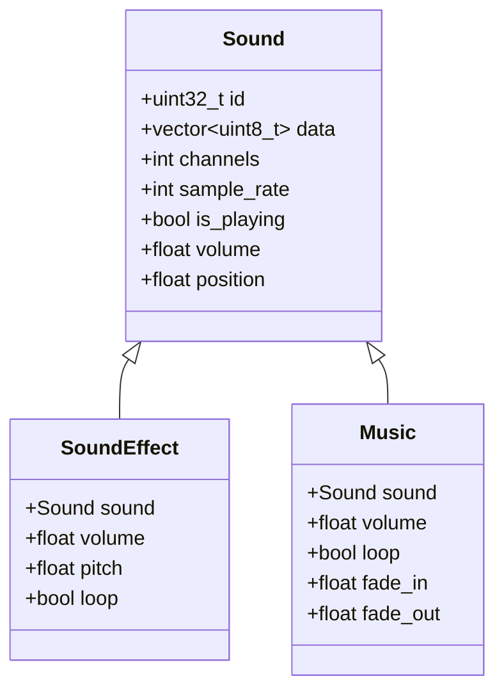
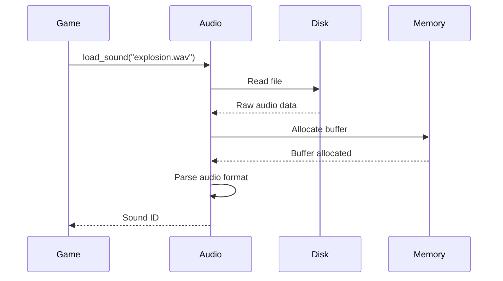
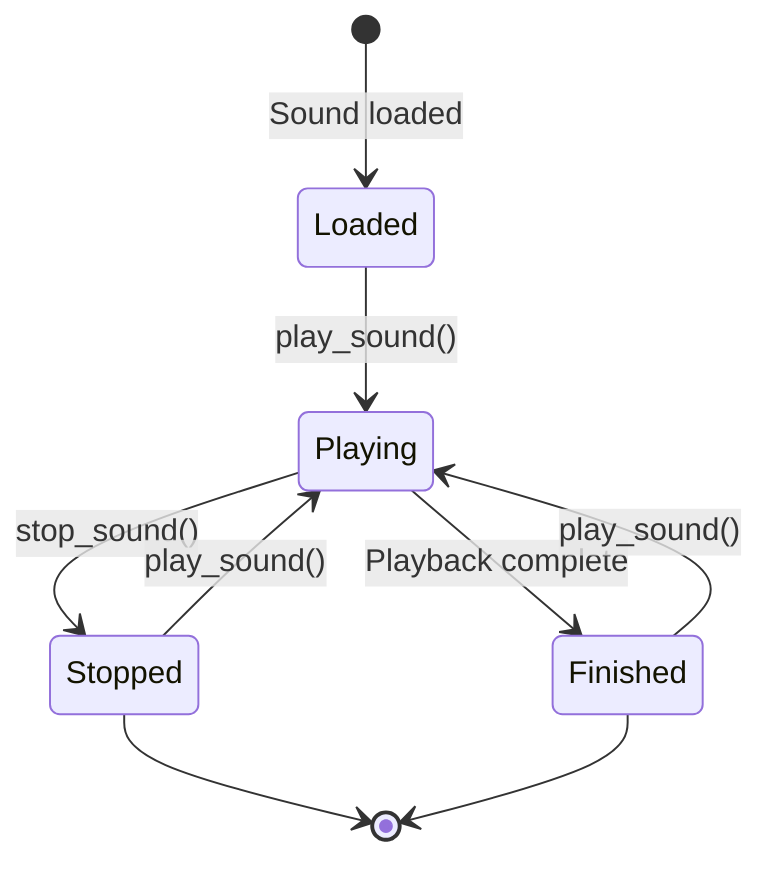
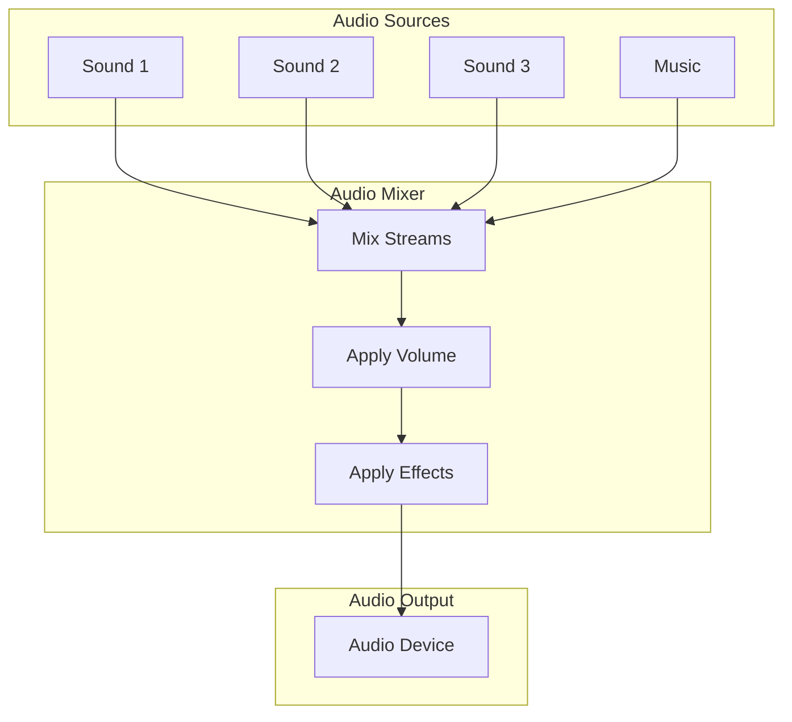

# Audio System

The audio system handles sound playback and mixing. This document explains the audio manager interface, audio concepts, and how to use the audio subsystem.

## Overview

The OmniCPP Engine provides an audio subsystem for:

- **Sound loading**: Load audio files from disk
- **Sound playback**: Play, stop, and control sounds
- **Volume control**: Master volume and per-sound volume
- **Mixing**: Combine multiple audio streams

## IAudioManager Interface

The [`IAudioManager`](include/engine/IAudioManager.hpp:19) interface defines the contract for all audio manager implementations:

```cpp
namespace omnicpp {

class IAudioManager {
public:
    virtual ~IAudioManager() = default;

    virtual bool initialize() = 0;
    virtual void shutdown() = 0;
    virtual uint32_t load_sound(const char* file_path) = 0;
    virtual bool play_sound(uint32_t sound_id) = 0;
    virtual bool stop_sound(uint32_t sound_id) = 0;
    virtual void set_master_volume(float volume) = 0;
    virtual float get_master_volume() const = 0;
    virtual void update(float delta_time) = 0;
};

} // namespace omnicpp
```

### Methods

| Method | Return Type | Description |
|--------|-------------|-------------|
| [`initialize()`](include/engine/IAudioManager.hpp:28) | `bool` | Initialize audio manager. Returns `true` on success. |
| [`shutdown()`](include/engine/IAudioManager.hpp:33) | `void` | Shutdown audio manager and release resources. |
| [`load_sound()`](include/engine/IAudioManager.hpp:41) | `uint32_t` | Load a sound file. Returns sound ID (0 on failure). |
| [`play_sound()`](include/engine/IAudioManager.hpp:49) | `bool` | Play a sound. Returns `true` on success. |
| [`stop_sound()`](include/engine/IAudioManager.hpp:57) | `bool` | Stop a sound. Returns `true` on success. |
| [`set_master_volume()`](include/engine/IAudioManager.hpp:64) | `void` | Set master volume (0.0 to 1.0). |
| [`get_master_volume()`](include/engine/IAudioManager.hpp:71) | `float` | Get current master volume. |
| [`update()`](include/engine/IAudioManager.hpp:78) | `void` | Update audio system. Called each frame. |

## AudioManager Implementation

The [`AudioManager`](include/engine/audio/AudioManager.hpp) class provides a concrete audio implementation:

```cpp
namespace omnicpp {
namespace audio {

class AudioManager {
public:
    AudioManager();
    ~AudioManager();

    bool initialize();
    void shutdown();
    uint32_t load_sound(const std::string& file_path);
    bool play_sound(uint32_t sound_id);
    bool stop_sound(uint32_t sound_id);
    void set_master_volume(float volume);
    float get_master_volume() const;
    void update(float delta_time);

private:
    struct Sound {
        uint32_t id;
        std::vector<uint8_t> data;
        int channels;
        int sample_rate;
        bool is_playing;
        float volume;
        float position;
    };

private:
    std::unordered_map<uint32_t, Sound> m_sounds;
    float m_master_volume = 1.0f;
    uint32_t m_next_sound_id = 1;
};

} // namespace audio
} // namespace omnicpp
```

## Audio Concepts

### Sound Properties



### Audio Formats

| Format | Channels | Sample Rate | Use Case |
|--------|----------|-------------|----------|
| **Mono** | 1 | 22050-48000 Hz | Sound effects |
| **Stereo** | 2 | 44100-48000 Hz | Music, ambient |

### Sample Rates

| Rate | Quality | Use Case |
|------|---------|----------|
| **22050 Hz** | Low | Voice, retro games |
| **44100 Hz** | Standard | CD quality |
| **48000 Hz** | High | Professional audio |

## Sound Loading

### Loading Pipeline



### Supported Formats

| Format | Extension | Status |
|--------|-----------|--------|
| **WAV** | `.wav` | Supported |
| **OGG** | `.ogg` | Planned |
| **MP3** | `.mp3` | Planned |
| **FLAC** | `.flac` | Planned |

### Loading Sounds

```cpp
#include "engine/Engine.hpp"
#include "engine/IAudioManager.hpp"

void load_game_sounds(omnicpp::IEngine* engine) {
    auto* audio = engine->get_audio_manager();

    // Load sound effects
    uint32_t explosion_id = audio->load_sound("sounds/explosion.wav");
    uint32_t jump_id = audio->load_sound("sounds/jump.wav");
    uint32_t shoot_id = audio->load_sound("sounds/shoot.wav");

    // Load music
    uint32_t bgm_id = audio->load_sound("music/background.wav");

    // Store IDs for later use
    sound_ids.explosion = explosion_id;
    sound_ids.jump = jump_id;
    sound_ids.shoot = shoot_id;
    sound_ids.bgm = bgm_id;
}
```

## Sound Playback

### Playback States



### Playing Sounds

```cpp
void play_explosion(omnicpp::IEngine* engine) {
    auto* audio = engine->get_audio_manager();

    // Play explosion sound
    if (!audio->play_sound(sound_ids.explosion)) {
        spdlog::error("Failed to play explosion sound");
    }
}

void play_jump(omnicpp::IEngine* engine) {
    auto* audio = engine->get_audio_manager();

    // Play jump sound
    if (!audio->play_sound(sound_ids.jump)) {
        spdlog::error("Failed to play jump sound");
    }
}
```

### Stopping Sounds

```cpp
void stop_all_sounds(omnicpp::IEngine* engine) {
    auto* audio = engine->get_audio_manager();

    // Stop all sounds
    audio->stop_sound(sound_ids.explosion);
    audio->stop_sound(sound_ids.jump);
    audio->stop_sound(sound_ids.shoot);
    audio->stop_sound(sound_ids.bgm);
}
```

## Volume Control

### Master Volume

Master volume controls overall audio output:

```cpp
void set_mute(omnicpp::IEngine* engine) {
    auto* audio = engine->get_audio_manager();

    // Mute audio
    audio->set_master_volume(0.0f);
}

void set_full_volume(omnicpp::IEngine* engine) {
    auto* audio = engine->get_audio_manager();

    // Set full volume
    audio->set_master_volume(1.0f);
}

void set_half_volume(omnicpp::IEngine* engine) {
    auto* audio = engine->get_audio_manager();

    // Set half volume
    audio->set_master_volume(0.5f);
}
```

### Volume Range

| Value | Description |
|-------|-------------|
| **0.0** | Muted |
| **0.5** | Half volume |
| **1.0** | Full volume |

### Getting Volume

```cpp
void log_volume(omnicpp::IEngine* engine) {
    auto* audio = engine->get_audio_manager();

    // Get current volume
    float volume = audio->get_master_volume();

    spdlog::info("Master volume: {:.2f}", volume);
}
```

## Audio Mixing

### Mixing Pipeline



### Mixing Process

1. **Gather**: Collect all active audio streams
2. **Mix**: Combine streams using weighted average
3. **Apply Volume**: Apply master volume
4. **Apply Effects**: Apply reverb, echo, etc.
5. **Output**: Send to audio device

## Audio Effects

### Planned Effects

| Effect | Description | Status |
|---------|-------------|--------|
| **Reverb** | Simulate room acoustics | Planned |
| **Echo** | Add echo to sound | Planned |
| **Pitch Shift** | Change sound pitch | Planned |
| **Low-pass Filter** | Remove high frequencies | Planned |
| **High-pass Filter** | Remove low frequencies | Planned |

### Effect Chain

```cpp
struct AudioEffect {
    enum class Type {
        NONE,
        REVERB,
        ECHO,
        PITCH_SHIFT,
        LOW_PASS,
        HIGH_PASS
    };

    Type type;
    float parameter1;
    float parameter2;
};

void apply_effects(Sound& sound, const std::vector<AudioEffect>& effects) {
    for (const auto& effect : effects) {
        switch (effect.type) {
            case AudioEffect::Type::REVERB:
                apply_reverb(sound, effect.parameter1);
                break;
            case AudioEffect::Type::ECHO:
                apply_echo(sound, effect.parameter1, effect.parameter2);
                break;
            // ... other effects
        }
    }
}
```

## Code Examples

### Basic Audio Setup

```cpp
#include "engine/Engine.hpp"
#include "engine/audio/AudioManager.hpp"

int main() {
    // Create audio manager
    auto audio = std::make_unique<omnicpp::audio::AudioManager>();

    // Configure engine
    omnicpp::EngineConfig config{};
    config.audio_manager = audio.get();

    // Create engine
    omnicpp::IEngine* engine = omnicpp::create_engine(config);
    if (!engine) {
        return -1;
    }

    // Load sounds
    uint32_t explosion_id = audio->load_sound("sounds/explosion.wav");
    uint32_t bgm_id = audio->load_sound("music/background.wav");

    // Game loop
    while (running) {
        float delta_time = calculate_delta_time();

        // Update game logic
        engine->update(delta_time);

        // Render
        engine->render();
    }

    // Cleanup
    omnicpp::destroy_engine(engine);
    return 0;
}
```

### Sound Event System

```cpp
struct SoundEvent {
    std::string name;
    uint32_t sound_id;
    float volume;
    bool loop;
};

class SoundEventManager {
public:
    void register_event(const std::string& name, const SoundEvent& event) {
        m_events[name] = event;
    }

    void trigger_event(const std::string& name) {
        auto it = m_events.find(name);
        if (it != m_events.end()) {
            const auto& event = it->second;
            audio->set_master_volume(event.volume);
            audio->play_sound(event.sound_id);
        }
    }

private:
    std::unordered_map<std::string, SoundEvent> m_events;
    omnicpp::IAudioManager* audio;
};

// Register sound events
sound_events.register_event("player_jump", {"jump", jump_id, 1.0f, false});
sound_events.register_event("explosion", {"explosion", explosion_id, 1.0f, false});
sound_events.register_event("bgm", {"background", bgm_id, 0.7f, true});

// Trigger events
sound_events.trigger_event("player_jump");
sound_events.trigger_event("explosion");
```

### Volume Fade

```cpp
class VolumeFader {
public:
    void fade_to(float target_volume, float duration) {
        m_target_volume = target_volume;
        m_fade_duration = duration;
        m_fade_timer = 0.0f;
        m_is_fading = true;
    }

    void update(float delta_time) {
        if (!m_is_fading) return;

        m_fade_timer += delta_time;
        float progress = m_fade_timer / m_fade_duration;

        if (progress >= 1.0f) {
            audio->set_master_volume(m_target_volume);
            m_is_fading = false;
        } else {
            float current_volume = audio->get_master_volume();
            float new_volume = current_volume +
                (m_target_volume - current_volume) * progress;
            audio->set_master_volume(new_volume);
        }
    }

private:
    float m_target_volume;
    float m_fade_duration;
    float m_fade_timer;
    bool m_is_fading;
    omnicpp::IAudioManager* audio;
};

// Fade out music
volume_fader.fade_to(0.0f, 2.0f); // Fade out over 2 seconds
```

## Performance Optimization

### Audio Streaming

Large audio files can be streamed instead of loaded entirely:

```cpp
class StreamingAudio {
public:
    void open(const std::string& file_path) {
        // Open file for streaming
        m_file.open(file_path, std::ios::binary);
        m_buffer.resize(BUFFER_SIZE);
    }

    void update(float delta_time) {
        // Read next chunk
        m_file.read(m_buffer.data(), BUFFER_SIZE);

        // Decode and play
        decode_and_play(m_buffer);
    }

private:
    std::ifstream m_file;
    std::vector<uint8_t> m_buffer;
    static constexpr size_t BUFFER_SIZE = 4096;
};
```

### Audio Pooling

Sounds can be pooled to reduce allocations:

```cpp
class SoundPool {
public:
    Sound* acquire() {
        if (!m_free_sounds.empty()) {
            // Create new sound
            return new Sound();
        }

        // Reuse existing sound
        Sound* sound = m_free_sounds.back();
        m_free_sounds.pop_back();
        return sound;
    }

    void release(Sound* sound) {
        // Reset sound
        sound->reset();

        // Return to pool
        m_free_sounds.push_back(sound);
    }

private:
    std::vector<Sound*> m_free_sounds;
};
```

## Troubleshooting

### Audio Initialization Fails

**Symptom**: [`initialize()`](include/engine/IAudioManager.hpp:28) returns `false`

**Possible causes**:
- No audio device available
- Audio device in use by another application
- Invalid audio format

**Solution**: Check audio device availability and format support.

### Sound Loading Fails

**Symptom**: [`load_sound()`](include/engine/IAudioManager.hpp:41) returns 0

**Possible causes**:
- File not found
- Invalid file format
- Insufficient memory

**Solution**: Verify file path and format.

### Sound Not Playing

**Symptom**: [`play_sound()`](include/engine/IAudioManager.hpp:49) returns `false`

**Possible causes**:
- Sound not loaded
- Audio device not initialized
- Master volume is 0

**Solution**: Ensure sound is loaded and volume is set.

### Audio Distortion

**Symptom**: Audio sounds distorted or crackling

**Possible causes**:
- Sample rate mismatch
- Buffer underrun
- Clipping (volume too high)

**Solution**: Match sample rates and check buffer sizes.

## Related Documentation

- [Engine Overview](index.md) - High-level engine architecture
- [Subsystems Guide](subsystems.md) - Subsystem interaction
- [Resource Manager Reference](resource-manager.md) - Asset loading API

## References

- [OpenAL Documentation](https://www.openal.org/documentation/)
- [Audio Programming](https://www.youtube.com/playlist?list=PLW3Zl3TIAbgu6BI6rQj5b7pZ)
- [Digital Audio](https://en.wikipedia.org/wiki/Digital_audio)
