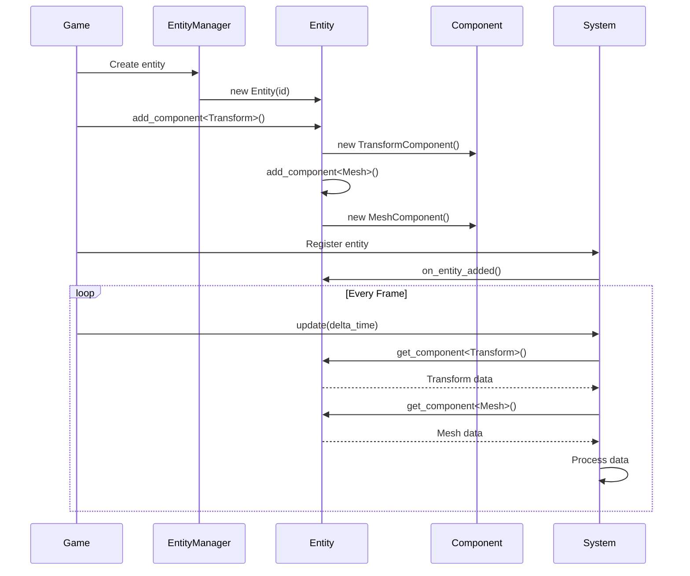

# Entity Component System (ECS)

The Entity Component System (ECS) is a data-oriented architectural pattern used throughout the OmniCpp Engine for managing game objects. This document explains **why** ECS is used, how it works, and its benefits and trade-offs.

## Why ECS?

### The Problem with Traditional OOP

Traditional game development uses object-oriented programming with deep inheritance hierarchies:

```cpp
// Traditional OOP approach
class GameObject {
    virtual void update(float delta_time) = 0;
    virtual void render() = 0;
};

class Player : public GameObject {
    void update(float delta_time) override { /* ... */ }
    void render() override { /* ... */ }
};

class Enemy : public GameObject {
    void update(float delta_time) override { /* ... */ }
    void render() override { /* ... */ }
};
```

**Problems with this approach**:
- **Cache misses**: Objects with different data layouts cause poor CPU cache utilization
- **Tight coupling**: Data and behavior are tightly coupled in the same class
- **Inflexibility**: Adding new behavior requires modifying existing classes
- **Memory fragmentation**: Objects of varying sizes scattered in memory

### The ECS Solution

ECS separates data from behavior and organizes them for optimal memory access:

```cpp
// ECS approach - Data only
class TransformComponent : public Component {
    Vec3 position;
    Vec3 rotation;
    Vec3 scale;
};

class MeshComponent : public Component {
    Mesh* mesh;
    Material* material;
};

// ECS approach - Behavior only
class RenderSystem : public System {
    void update(float delta_time) override {
        // Process all entities with Transform and Mesh components
        for (auto* entity : get_entities_with<Transform, Mesh>()) {
            auto* transform = entity->get_component<Transform>();
            auto* mesh = entity->get_component<Mesh>();
            render_mesh(mesh, transform);
        }
    }
};
```

**Benefits of ECS**:
- **Cache-friendly**: Components of same type stored contiguously in memory
- **Data-oriented**: Systems process data in batches, improving SIMD utilization
- **Flexible**: Add new components and systems without modifying existing code
- **Parallelizable**: Systems can run in parallel on different entity sets

## ECS Architecture

The OmniCpp Engine implements ECS with three core concepts:

```mermaid
classDiagram
    class Component {
        +uint64_t entity_id
        +on_attach()
        +on_detach()
        +on_update()
    }

    class Entity {
        +uint64_t id
        +string name
        +bool active
        +add_component~T~()
        +remove_component~T~()
        +get_component~T~()
        +has_component~T~()
    }

    class System {
        +int priority
        +bool enabled
        +initialize()
        +shutdown()
        +update()
        +on_entity_added()
        +on_entity_removed()
    }

    Component <|-- TransformComponent
    Component <|-- MeshComponent
    Component <|-- CameraComponent
    System <|-- RenderSystem
    System <|-- PhysicsSystem
    System <|-- InputSystem

    Entity "1" *-- "1" : TransformComponent
    Entity "1" *-- "1" : MeshComponent
    Entity "2" *-- "2" : TransformComponent
    Entity "2" *-- "2" : CameraComponent
```

### Components

Components are **pure data containers** with no logic:

```cpp
// From include/engine/ecs/Component.hpp
namespace omnicpp {
namespace ecs {

class Component {
public:
    explicit Component(uint64_t entity_id);
    virtual ~Component() = default;

    uint64_t get_entity_id() const { return m_entity_id; }

    virtual void on_attach() {}
    virtual void on_detach() {}
    virtual void on_update(float delta_time) {}

protected:
    uint64_t m_entity_id;
};

} // namespace ecs
} // namespace omnicpp
```

**Component Design Principles**:
- **Data-only**: Components should contain only data, no behavior
- **Lightweight**: Keep components small and focused
- **Composable**: Combine multiple components to create complex objects

### Built-in Components

| Component | Purpose | Location |
|-----------|---------|----------|
| [`TransformComponent`](include/engine/ecs/TransformComponent.hpp:24) | Position, rotation, scale | [`TransformComponent.hpp`](include/engine/ecs/TransformComponent.hpp) |
| [`MeshComponent`](include/engine/ecs/MeshComponent.hpp:25) | 3D geometry and material | [`MeshComponent.hpp`](include/engine/ecs/MeshComponent.hpp) |
| [`CameraComponent`](include/engine/ecs/Camera/CameraComponent.hpp) | Camera view and projection | [`CameraComponent.hpp`](include/engine/ecs/Camera/CameraComponent.hpp) |

### Entities

Entities are **lightweight identifiers** that hold components:

```cpp
// From include/engine/ecs/Entity.hpp
namespace omnicpp {
namespace ecs {

class Entity {
public:
    explicit Entity(uint64_t id, const std::string& name = "Entity");
    ~Entity();

    // Disable copying, enable moving
    Entity(const Entity&) = delete;
    Entity& operator=(const Entity&) = delete;
    Entity(Entity&&) noexcept = default;
    Entity& operator=(Entity&&) noexcept = default;

    uint64_t get_id() const { return m_id; }
    const std::string& get_name() const { return m_name; }
    void set_name(const std::string& name) { m_name = name; }
    bool is_active() const { return m_active; }
    void set_active(bool active) { m_active = active; }

    template<typename T, typename... Args>
    T* add_component(Args&&... args);

    template<typename T>
    void remove_component();

    template<typename T>
    T* get_component();

    template<typename T>
    const T* get_component() const;

    template<typename T>
    bool has_component() const;

    const std::unordered_map<std::type_index, std::unique_ptr<Component>>&
    get_components() const { return m_components; }

private:
    uint64_t m_id;
    std::string m_name;
    bool m_active;
    std::unordered_map<std::type_index, std::unique_ptr<Component>> m_components;
};

} // namespace ecs
} // namespace omnicpp
```

**Entity Design Principles**:
- **ID-based**: Entities are identified by unique IDs
- **Component container**: Entities hold references to their components
- **Active state**: Entities can be enabled/disabled without destroying them

### Systems

Systems contain **logic** that operates on entities with specific components:

```cpp
// From include/engine/ecs/System.hpp
namespace omnicpp {
namespace ecs {

class System {
public:
    System() = default;
    virtual ~System() = default;

    virtual bool initialize() { return true; }
    virtual void shutdown() {}
    virtual void update(float delta_time) = 0;

    virtual void on_entity_added(Entity* entity) {}
    virtual void on_entity_removed(Entity* entity) {}

    int get_priority() const { return m_priority; }
    void set_priority(int priority) { m_priority = priority; }
    bool is_enabled() const { return m_enabled; }
    void set_enabled(bool enabled) { m_enabled = enabled; }

protected:
    int m_priority = 0;
    bool m_enabled = true;
};

} // namespace ecs
} // namespace omnicpp
```

**System Design Principles**:
- **Query-based**: Systems query for entities with specific component types
- **Priority-ordered**: Systems update in priority order
- **Independent**: Systems should not depend on each other

## ECS Data Flow



## Code Examples

### Creating an Entity with Components

```cpp
#include "engine/ecs/Entity.hpp"
#include "engine/ecs/TransformComponent.hpp"
#include "engine/ecs/MeshComponent.hpp"

void create_player_entity() {
    // Create entity
    auto entity = std::make_unique<omnicpp::ecs::Entity>(
        1, "Player"
    );

    // Add transform component
    auto* transform = entity->add_component<omnicpp::ecs::TransformComponent>(
        omnicpp::math::Vec3{0.0f, 0.0f, 0.0f},  // position
        omnicpp::math::Vec3{0.0f, 0.0f, 0.0f},  // rotation
        omnicpp::math::Vec3{1.0f, 1.0f, 1.0f}   // scale
    );

    // Add mesh component
    auto* mesh = entity->add_component<omnicpp::ecs::MeshComponent>();
    mesh->set_mesh(load_mesh("models/player.obj"));
    mesh->set_material(load_material("materials/player.mtl"));

    // Add entity to scene
    scene->add_entity(std::move(entity));
}
```

### Creating a Custom System

```cpp
#include "engine/ecs/System.hpp"
#include "engine/ecs/Entity.hpp"
#include "engine/ecs/TransformComponent.hpp"

class MovementSystem : public omnicpp::ecs::System {
public:
    void update(float delta_time) override {
        // Query for entities with Transform component
        for (auto* entity : get_entities_with<TransformComponent>()) {
            auto* transform = entity->get_component<TransformComponent>();

            // Apply movement based on input
            if (input->is_key_pressed(KeyCode::W)) {
                transform->translate({0.0f, 0.0f, speed * delta_time});
            }
            if (input->is_key_pressed(KeyCode::S)) {
                transform->translate({0.0f, 0.0f, -speed * delta_time});
            }
        }
    }
};
```

### Querying Entities by Component Type

```cpp
#include "engine/ecs/Entity.hpp"

void render_all_meshes() {
    // Get all entities from scene
    const auto& entities = scene->get_entities();

    for (const auto& entity : entities) {
        // Check if entity has Mesh component
        if (entity->has_component<MeshComponent>()) {
            auto* mesh = entity->get_component<MeshComponent>();
            auto* transform = entity->get_component<TransformComponent>();

            if (mesh && transform) {
                render_mesh(mesh, transform);
            }
        }
    }
}
```

## Benefits and Trade-offs

### Benefits

| Benefit | Description |
|---------|-------------|
| **Cache efficiency** | Components of same type stored contiguously |
| **Data-oriented design** | Systems process data in batches |
| **Flexibility** | Add components without modifying existing code |
| **Parallelization** | Systems can run in parallel |
| **Testability** | Mock components for unit testing |
| **Memory efficiency** | Pool allocation for components |

### Trade-offs

| Trade-off | Description | Mitigation |
|-----------|-------------|------------|
| **Complexity** | More complex than simple OOP | Use helper functions and templates |
| **Debugging difficulty** | Harder to trace execution | Use entity names and logging |
| **Learning curve** | New paradigm for many developers | Provide examples and documentation |
| **Overhead** | Component lookups add overhead | Cache frequently accessed components |

## Common ECS Patterns

### Component Composition

Combine multiple components to create complex objects:

```cpp
// Player entity with multiple components
entity->add_component<TransformComponent>(...);
entity->add_component<MeshComponent>(...);
entity->add_component<PhysicsComponent>(...);
entity->add_component<AudioComponent>(...);
entity->add_component<ScriptComponent>(...);
```

### System Priority

Order system execution by priority:

```cpp
// Lower priority = executes first
input_system->set_priority(100);
physics_system->set_priority(50);
render_system->set_priority(0);
```

### Entity Filtering

Filter entities by component combinations:

```cpp
// Get entities with Transform AND Mesh
for (auto* entity : get_entities_with<Transform, Mesh>()) {
    // Process entity
}

// Get entities with Transform AND Physics
for (auto* entity : get_entities_with<Transform, Physics>()) {
    // Process entity
}
```

### Component Tags

Use components as tags for entity categorization:

```cpp
class PlayerTag : public Component {
    // Empty component used as a tag
};

class EnemyTag : public Component {
    // Empty component used as a tag
};

// Query for all players
for (auto* entity : get_entities_with<PlayerTag>()) {
    // Process player
}
```

## Troubleshooting

### Components Not Found

**Symptom**: [`get_component()`](include/engine/ecs/Entity.hpp:101) returns `nullptr`

**Possible causes**:
- Component not added to entity
- Wrong component type specified
- Entity destroyed

**Solution**: Use [`has_component()`](include/engine/ecs/Entity.hpp:117) to check before accessing.

### Memory Leaks in Components

**Symptom**: Memory usage increases over time

**Possible causes**:
- Components not removed when entity destroyed
- Circular references between components
- Unique pointers not properly managed

**Solution**: Ensure proper cleanup in entity destructor.

### System Not Updating

**Symptom**: System [`update()`](include/engine/ecs/System.hpp:52) not called

**Possible causes**:
- System not registered with entity manager
- System disabled
- System priority not set

**Solution**: Verify system registration and enabled state.

## Related Documentation

- [Engine Overview](index.md) - High-level engine architecture
- [Subsystems Guide](subsystems.md) - Subsystem interaction
- [Scene Management](scene-management.md) - Entity and scene management
