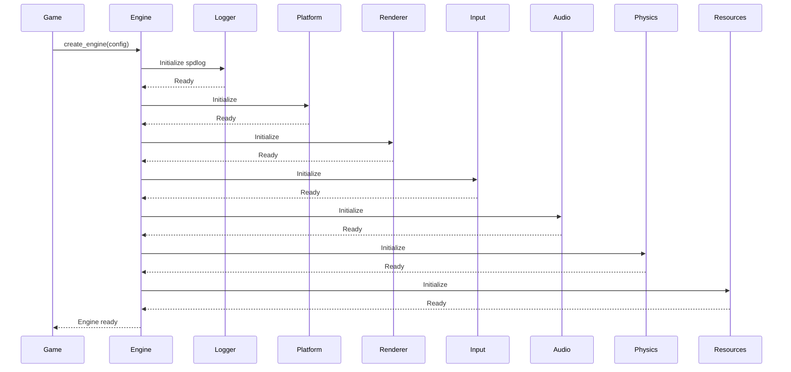

# Engine Overview

The OmniCpp Engine is a modular, plugin-based game engine built with C++23 best practices. It provides a comprehensive set of subsystems for rendering, input handling, audio, physics simulation, resource management, and scene management.

## Architecture

The engine follows a **plugin-based architecture** using abstract interfaces. This design allows for:

- **Runtime extensibility**: Subsystems can be swapped without recompiling the engine
- **Platform independence**: Different implementations can be provided for Windows, Linux, and WASM
- **Testability**: Mock implementations can be injected for unit testing

### Core Interfaces

The engine is built around the [`IEngine`](include/engine/IEngine.hpp:39) interface, which coordinates all subsystems:

```cpp
namespace omnicpp {

struct EngineConfig {
    IRenderer* renderer;
    IInputManager* input_manager;
    IAudioManager* audio_manager;
    IPhysicsEngine* physics_engine;
    IResourceManager* resource_manager;
    ILogger* logger;
    IPlatform* platform;
};

class IEngine {
public:
    virtual bool initialize(const EngineConfig& config) = 0;
    virtual void shutdown() = 0;
    virtual void update(float delta_time) = 0;
    virtual void render() = 0;
    // ... getter methods for subsystems
};

} // namespace omnicpp
```

## Key Subsystems

| Subsystem | Interface | Purpose |
|-----------|-----------|---------|
| **Renderer** | [`IRenderer`](include/engine/IRenderer.hpp:19) | Vulkan-based graphics rendering |
| **Input** | [`IInputManager`](include/engine/IInputManager.hpp:79) | Keyboard, mouse, and gamepad input |
| **Audio** | [`IAudioManager`](include/engine/IAudioManager.hpp:19) | Sound playback and mixing |
| **Physics** | [`IPhysicsEngine`](include/engine/IPhysicsEngine.hpp:19) | Rigid body simulation |
| **Resources** | [`IResourceManager`](include/engine/IResourceManager.hpp:31) | Asset loading and caching |
| **Platform** | [`IPlatform`](include/engine/IPlatform.hpp:41) | Window management and platform abstraction |
| **Logger** | [`ILogger`](include/engine/ILogger.hpp) | Logging infrastructure |

## Dynamic Loading

The engine is designed to be loaded dynamically at runtime. The [`Game`](include/game/Game.hpp:18) class loads the engine library and uses C-style factory functions:

```cpp
// From include/engine/Engine.hpp
extern "C" OMNICPP_EXPORT IEngine* create_engine(const EngineConfig& config);
extern "C" OMNICPP_EXPORT void destroy_engine(IEngine* engine);
extern "C" OMNICPP_EXPORT const char* engine_get_version();
```

This approach enables:
- Hot-swapping of engine implementations
- Version compatibility checking
- Clean separation between engine and game code

## Initialization Flow

The engine initializes subsystems in a specific order to ensure dependencies are satisfied:



## Main Loop

The engine's main loop follows a standard game loop pattern:

```cpp
// From src/engine/Engine.cpp
void update(float delta_time) {
    if (!m_initialized) return;

    // Update input
    if (m_input_manager) {
        m_input_manager->process_events(delta_time);
    }

    // Update physics
    if (m_physics_engine) {
        m_physics_engine->update(delta_time);
    }

    // Update audio
    if (m_audio_manager) {
        m_audio_manager->update(delta_time);
    }
}

void render() {
    if (!m_initialized || !m_renderer) return;

    m_renderer->begin_frame();
    // Render scene here
    m_renderer->end_frame();
}
```

## Getting Started

### Basic Setup

1. **Configure the engine** by creating an [`EngineConfig`](include/engine/IEngine.hpp:26) structure with your desired subsystems
2. **Create the engine** using [`create_engine()`](include/engine/Engine.hpp:48)
3. **Run the game loop** calling [`update()`](include/engine/IEngine.hpp:59) and [`render()`](include/engine/IEngine.hpp:64) each frame
4. **Shutdown** by calling [`destroy_engine()`](include/engine/Engine.hpp:55)

### Example: Minimal Game

```cpp
#include "engine/Engine.hpp"
#include "engine/render/VulkanRenderer.hpp"
#include "engine/input/InputManager.hpp"

int main() {
    // Create subsystems
    auto renderer = std::make_unique<omnicpp::render::VulkanRenderer>();
    auto input = std::make_unique<omnicpp::input::InputManager>();

    // Configure engine
    omnicpp::EngineConfig config{};
    config.renderer = renderer.get();
    config.input_manager = input.get();

    // Create engine
    omnicpp::IEngine* engine = omnicpp::create_engine(config);
    if (!engine) {
        return -1;
    }

    // Game loop
    while (running) {
        float delta_time = calculate_delta_time();
        engine->update(delta_time);
        engine->render();
    }

    // Cleanup
    omnicpp::destroy_engine(engine);
    return 0;
}
```

## Known Limitations

- **Vulkan-only rendering**: Currently only Vulkan is supported (OpenGL support is planned)
- **Single-threaded rendering**: The renderer runs on the main thread
- **No networking**: Network subsystem interface exists but implementation is incomplete
- **Limited physics**: Physics engine provides basic rigid body simulation only

## Related Documentation

- [Subsystems Guide](subsystems.md) - Detailed subsystem interaction and initialization
- [Renderer Reference](renderer.md) - Vulkan rendering API
- [Input Manager Reference](input-manager.md) - Input handling API
- [Resource Manager Reference](resource-manager.md) - Asset loading API
- [ECS Architecture](ecs.md) - Entity Component System explanation
- [Scene Management](scene-management.md) - Scene graph and transitions

## Troubleshooting

### Engine Fails to Initialize

**Symptom**: [`create_engine()`](include/engine/Engine.hpp:48) returns `nullptr`

**Possible causes**:
- Vulkan SDK not installed or not in PATH
- Missing dependencies (spdlog, GLM, STB)
- Invalid configuration in `config/logging_cpp.json`

**Solution**: Check build logs and ensure all dependencies are installed via CPM, Conan, or vcpkg.

### Renderer Initialization Fails

**Symptom**: Renderer initialization returns `false`

**Possible causes**:
- No Vulkan-compatible GPU available
- Validation layers not supported
- Window creation failed

**Solution**: Enable debug logging in [`VulkanRenderer`](include/engine/render/VulkanRenderer.hpp:26) and check validation layer messages.

### Input Not Responding

**Symptom**: [`is_key_pressed()`](include/engine/IInputManager.hpp:115) always returns `false`

**Possible causes**:
- Input manager not initialized
- Window not focused
- Event processing not called

**Solution**: Ensure [`process_events()`](include/engine/IInputManager.hpp:100) is called each frame in the update loop.
