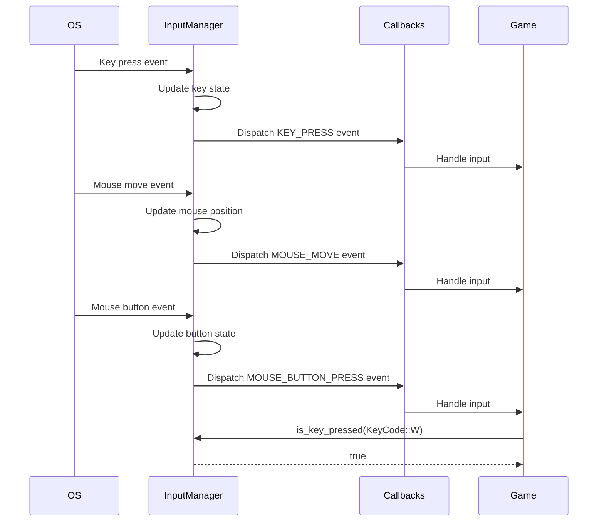
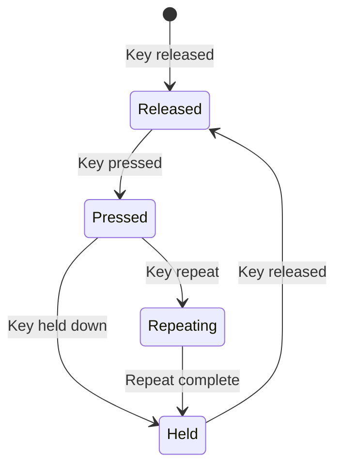

# Input System

The input system captures and processes user input from keyboard, mouse, and gamepad devices. This document explains the input manager interface, input concepts, and how to use the input subsystem.

## Overview

The OmniCPP Engine provides an input subsystem for:

- **Keyboard input**: Capture key presses and releases
- **Mouse input**: Track mouse position, buttons, and scroll
- **Gamepad input**: Support for game controllers (planned)
- **Event dispatching**: Callback-based event system

## IInputManager Interface

The [`IInputManager`](include/engine/IInputManager.hpp:79) interface defines the contract for all input manager implementations:

```cpp
namespace omnicpp {

enum class InputEventType {
    KEY_DOWN = 0,
    KEY_UP = 1,
    KEY_LEFT = 2,
    KEY_RIGHT = 3,
    KEY_W = 4,
    KEY_S = 5,
    KEY_A = 6,
    KEY_D = 7,
    KEY_ESCAPE = 8,
    KEY_F1 = 9,
    KEY_F2 = 10,
    KEY_F3 = 11,
    KEY_F4 = 12,
    KEY_F5 = 13,
    KEY_F6 = 14,
    KEY_F7 = 15,
    KEY_F8 = 16,
    KEY_F9 = 17,
    KEY_F10 = 18,
    KEY_F11 = 19,
    KEY_F12 = 20,
    MOUSE_BUTTON_LEFT = 21,
    MOUSE_BUTTON_MIDDLE = 22,
    MOUSE_BUTTON_RIGHT = 23,
    MOUSE_SCROLL_UP = 24,
    MOUSE_SCROLL_DOWN = 25,
    MOUSE_X = 26,
    MOUSE_Y = 27,
    UNKNOWN = 28
};

struct InputEvent {
    InputEventType type;
    uint32_t key_code;
    float x;
    float y;
    float scroll_x;
    float scroll_y;
    bool pressed;
};

struct InputState {
    bool keys[256];
    bool mouse_buttons[8];
    float mouse_x;
    float mouse_y;
    float mouse_scroll_x;
    float mouse_scroll_y;
};

class IInputManager {
public:
    virtual ~IInputManager() = default;

    virtual bool initialize() = 0;
    virtual void shutdown() = 0;
    virtual void process_events(float delta_time) = 0;
    virtual const InputState& get_state() const = 0;
    virtual bool is_key_pressed(uint32_t key_code) const = 0;
    virtual bool is_mouse_button_pressed(uint32_t button) const = 0;
    virtual float get_mouse_x() const = 0;
    virtual float get_mouse_y() const = 0;
    virtual float get_mouse_scroll_x() const = 0;
    virtual float get_mouse_scroll_y() const = 0;
};

} // namespace omnicpp
```

### Methods

| Method | Return Type | Description |
|--------|-------------|-------------|
| [`initialize()`](include/engine/IInputManager.hpp:88) | `bool` | Initialize input manager. Returns `true` on success. |
| [`shutdown()`](include/engine/IInputManager.hpp:93) | `void` | Shutdown input manager. |
| [`process_events()`](include/engine/IInputManager.hpp:100) | `void` | Process input events. Called each frame. |
| [`get_state()`](include/engine/IInputManager.hpp:107) | `const InputState&` | Get current input state. |
| [`is_key_pressed()`](include/engine/IInputManager.hpp:115) | `bool` | Check if a key is currently pressed. |
| [`is_mouse_button_pressed()`](include/engine/IInputManager.hpp:123) | `bool` | Check if a mouse button is currently pressed. |
| [`get_mouse_x()`](include/engine/IInputManager.hpp:130) | `float` | Get current mouse X position. |
| [`get_mouse_y()`](include/engine/IInputManager.hpp:137) | `float` | Get current mouse Y position. |
| [`get_mouse_scroll_x()`](include/engine/IInputManager.hpp:144) | `float` | Get current mouse scroll X position. |
| [`get_mouse_scroll_y()`](include/engine/IInputManager.hpp:151) | `float` | Get current mouse scroll Y position. |

## InputManager Implementation

The [`InputManager`](include/engine/input/InputManager.hpp:198) class provides a concrete input implementation:

```cpp
namespace omnicpp {
namespace input {

enum class KeyCode {
    UNKNOWN = 0,
    SPACE = 32,
    APOSTROPHE = 39,
    COMMA = 44,
    MINUS = 45,
    PERIOD = 46,
    SLASH = 47,
    KEY_0 = 48,
    KEY_1 = 49,
    // ... (full key enumeration)
    A = 65,
    B = 66,
    C = 67,
    D = 68,
    E = 69,
    F = 70,
    G = 71,
    H = 72,
    I = 73,
    J = 74,
    K = 75,
    L = 76,
    M = 77,
    N = 78,
    O = 79,
    P = 80,
    Q = 81,
    R = 82,
    S = 83,
    T = 84,
    U = 85,
    V = 86,
    W = 87,
    X = 88,
    Y = 89,
    Z = 90,
    LEFT_SHIFT = 340,
    LEFT_CONTROL = 341,
    LEFT_ALT = 342,
    RIGHT_SHIFT = 344,
    RIGHT_CONTROL = 345,
    RIGHT_ALT = 346
};

enum class MouseButton {
    LEFT = 0,
    RIGHT = 1,
    MIDDLE = 2
};

enum class Action {
    RELEASE = 0,
    PRESS = 1,
    REPEAT = 2
};

enum class EventType {
    KEY_PRESS,
    KEY_RELEASE,
    MOUSE_MOVE,
    MOUSE_BUTTON_PRESS,
    MOUSE_BUTTON_RELEASE,
    MOUSE_SCROLL
};

struct InputEvent {
    EventType type;
    KeyCode key_code;
    MouseButton mouse_button;
    Action action;
    float mouse_x;
    float mouse_y;
    float scroll_x;
    float scroll_y;
};

using InputCallback = std::function<void(const InputEvent&)>;

class InputManager {
public:
    InputManager() = default;
    ~InputManager() = default;

    bool initialize();
    void shutdown();
    void process_events();
    void register_callback(InputCallback callback);
    bool is_key_pressed(KeyCode key) const;
    bool is_mouse_button_pressed(MouseButton button) const;
    void get_mouse_position(float& x, float& y) const;
    void get_mouse_delta(float& x, float& y) const;
    void get_scroll_delta(float& x, float& y) const;

private:
    void dispatch_event(const InputEvent& event);

private:
    std::vector<InputCallback> m_callbacks;
    std::unordered_map<int, bool> m_key_states;
    std::unordered_map<int, bool> m_mouse_button_states;
    float m_mouse_x = 0.0f;
    float m_mouse_y = 0.0f;
    float m_mouse_delta_x = 0.0f;
    float m_mouse_delta_y = 0.0f;
    float m_scroll_x = 0.0f;
    float m_scroll_y = 0.0f;
};

} // namespace input
} // namespace omnicpp
```

## Input Event Flow



## Keyboard Input

### Key Codes

The engine uses platform-independent key codes:

| Key | Code | Description |
|-----|-------|-------------|
| **A-Z** | 65-90 | Letter keys |
| **0-9** | 48-57 | Number keys |
| **Space** | 32 | Space bar |
| **Escape** | 256 | Escape key |
| **Enter** | 257 | Enter key |
| **Shift** | 340/344 | Left/Right Shift |
| **Control** | 341/345 | Left/Right Control |
| **Alt** | 342/346 | Left/Right Alt |

### Key States



### Checking Key State

```cpp
void handle_movement(omnicpp::IEngine* engine) {
    auto* input = engine->get_input_manager();

    // Check for movement keys
    if (input->is_key_pressed(omnicpp::input::KeyCode::W)) {
        // Move forward
    }
    if (input->is_key_pressed(omnicpp::input::KeyCode::S)) {
        // Move backward
    }
    if (input->is_key_pressed(omnicpp::input::KeyCode::A)) {
        // Move left
    }
    if (input->is_key_pressed(omnicpp::input::KeyCode::D)) {
        // Move right
    }
}
```

## Mouse Input

### Mouse Buttons

| Button | Code | Description |
|-------|-------|-------------|
| **Left** | 0 | Primary button |
| **Right** | 1 | Secondary button |
| **Middle** | 2 | Tertiary button |

### Mouse Position

```cpp
void update_camera(omnicpp::IEngine* engine) {
    auto* input = engine->get_input_manager();

    // Get mouse position
    float mouse_x, mouse_y;
    input->get_mouse_position(mouse_x, mouse_y);

    // Get mouse delta (movement since last frame)
    float delta_x, delta_y;
    input->get_mouse_delta(delta_x, delta_y);

    // Update camera based on mouse movement
    camera.rotate(delta_x * sensitivity, delta_y * sensitivity);
}
```

### Mouse Scroll

```cpp
void handle_zoom(omnicpp::IEngine* engine) {
    auto* input = engine->get_input_manager();

    // Get scroll delta
    float scroll_x, scroll_y;
    input->get_scroll_delta(scroll_x, scroll_y);

    // Zoom camera based on scroll
    if (scroll_y > 0) {
        camera.zoom_in();
    } else if (scroll_y < 0) {
        camera.zoom_out();
    }
}
```

## Input Callbacks

### Callback Registration

```cpp
#include "engine/input/InputManager.hpp"

void on_key_press(const omnicpp::input::InputEvent& event) {
    if (event.type == omnicpp::input::EventType::KEY_PRESS) {
        if (event.key_code == omnicpp::input::KeyCode::SPACE) {
            // Handle space bar press
            player.jump();
        }
    }
}

void on_mouse_move(const omnicpp::input::InputEvent& event) {
    if (event.type == omnicpp::input::EventType::MOUSE_MOVE) {
        // Handle mouse movement
        float x = event.mouse_x;
        float y = event.mouse_y;
        update_cursor(x, y);
    }
}

int main() {
    auto input = std::make_unique<omnicpp::input::InputManager>();
    input->initialize();

    // Register callbacks
    input->register_callback(on_key_press);
    input->register_callback(on_mouse_move);

    // ... game loop ...
}
```

### Callback Priority

Callbacks are dispatched in registration order:

```cpp
class InputManager {
public:
    void register_callback(InputCallback callback) {
        m_callbacks.push_back(callback);
    }

    void dispatch_event(const InputEvent& event) {
        // Dispatch to all callbacks in order
        for (const auto& callback : m_callbacks) {
            callback(event);
        }
    }

private:
    std::vector<InputCallback> m_callbacks;
};
```

## Input Mapping

### Action Mapping

Map input events to game actions:

```cpp
enum class GameAction {
    MOVE_FORWARD,
    MOVE_BACKWARD,
    MOVE_LEFT,
    MOVE_RIGHT,
    JUMP,
    ATTACK,
    INTERACT,
    PAUSE
};

class InputMapper {
public:
    void map_key(KeyCode key, GameAction action) {
        m_key_map[key] = action;
    }

    void map_mouse_button(MouseButton button, GameAction action) {
        m_mouse_map[button] = action;
    }

    GameAction get_action(KeyCode key) const {
        auto it = m_key_map.find(key);
        return it != m_key_map.end() ? it->second : GameAction::UNKNOWN;
    }

    GameAction get_action(MouseButton button) const {
        auto it = m_mouse_map.find(button);
        return it != m_mouse_map.end() ? it->second : GameAction::UNKNOWN;
    }

private:
    std::unordered_map<KeyCode, GameAction> m_key_map;
    std::unordered_map<MouseButton, GameAction> m_mouse_map;
};

// Map keys to actions
input_mapper.map_key(KeyCode::W, GameAction::MOVE_FORWARD);
input_mapper.map_key(KeyCode::S, GameAction::MOVE_BACKWARD);
input_mapper.map_key(KeyCode::A, GameAction::MOVE_LEFT);
input_mapper.map_key(KeyCode::D, GameAction::MOVE_RIGHT);
input_mapper.map_key(KeyCode::SPACE, GameAction::JUMP);
input_mapper.map_key(KeyCode::E, GameAction::INTERACT);
input_mapper.map_key(KeyCode::ESCAPE, GameAction::PAUSE);
```

### Rebinding

Allow players to customize controls:

```cpp
void rebind_key(GameAction action, KeyCode new_key) {
    // Remove old mapping
    for (auto it = m_key_map.begin(); it != m_key_map.end(); ) {
        if (it->second == action) {
            m_key_map.erase(it);
            break;
        }
    }

    // Add new mapping
    m_key_map[new_key] = action;

    // Save to config
    save_key_bindings();
}
```

## Code Examples

### Basic Input Setup

```cpp
#include "engine/Engine.hpp"
#include "engine/input/InputManager.hpp"

int main() {
    // Create input manager
    auto input = std::make_unique<omnicpp::input::InputManager>();

    // Configure engine
    omnicpp::EngineConfig config{};
    config.input_manager = input.get();

    // Create engine
    omnicpp::IEngine* engine = omnicpp::create_engine(config);
    if (!engine) {
        return -1;
    }

    // Game loop
    while (running) {
        float delta_time = calculate_delta_time();

        // Process input
        engine->update(delta_time);

        // Handle input
        handle_input(engine);

        // Render
        engine->render();
    }

    // Cleanup
    omnicpp::destroy_engine(engine);
    return 0;
}

void handle_input(omnicpp::IEngine* engine) {
    auto* input = engine->get_input_manager();

    // Check for movement keys
    if (input->is_key_pressed(omnicpp::input::KeyCode::W)) {
        player.move_forward();
    }
    if (input->is_key_pressed(omnicpp::input::KeyCode::S)) {
        player.move_backward();
    }
    if (input->is_key_pressed(omnicpp::input::KeyCode::A)) {
        player.move_left();
    }
    if (input->is_key_pressed(omnicpp::input::KeyCode::D)) {
        player.move_right();
    }

    // Check for mouse buttons
    if (input->is_mouse_button_pressed(omnicpp::input::MouseButton::LEFT)) {
        player.attack();
    }
}
```

### Input Event System

```cpp
class InputEventSystem {
public:
    void initialize(omnicpp::input::InputManager* input) {
        // Register event handlers
        input->register_callback([this](const omnicpp::input::InputEvent& event) {
            this->on_event(event);
        });
    }

    void on_event(const omnicpp::input::InputEvent& event) {
        switch (event.type) {
            case omnicpp::input::EventType::KEY_PRESS:
                on_key_press(event);
                break;
            case omnicpp::input::EventType::KEY_RELEASE:
                on_key_release(event);
                break;
            case omnicpp::input::EventType::MOUSE_MOVE:
                on_mouse_move(event);
                break;
            case omnicpp::input::EventType::MOUSE_BUTTON_PRESS:
                on_mouse_button_press(event);
                break;
            case omnicpp::input::EventType::MOUSE_BUTTON_RELEASE:
                on_mouse_button_release(event);
                break;
            case omnicpp::input::EventType::MOUSE_SCROLL:
                on_mouse_scroll(event);
                break;
        }
    }

private:
    void on_key_press(const omnicpp::input::InputEvent& event);
    void on_key_release(const omnicpp::input::InputEvent& event);
    void on_mouse_move(const omnicpp::input::InputEvent& event);
    void on_mouse_button_press(const omnicpp::input::InputEvent& event);
    void on_mouse_button_release(const omnicpp::input::InputEvent& event);
    void on_mouse_scroll(const omnicpp::input::InputEvent& event);
};
```

## Platform-Specific Input

### Windows Input

On Windows, input is handled through:
- **Win32 API**: Direct message processing
- **Raw Input**: For high-precision mouse input
- **XInput**: For gamepad support (planned)

### Linux Input

On Linux, input is handled through:
- **X11**: Traditional X11 input
- **Wayland**: Modern Wayland input protocol
- **evdev**: Direct device access (planned)

### WASM Input

On WebAssembly, input is handled through:
- **Web APIs**: DOM event listeners
- **Gamepad API**: Browser gamepad support (planned)

## Troubleshooting

### Input Not Responding

**Symptom**: [`is_key_pressed()`](include/engine/IInputManager.hpp:115) always returns `false`

**Possible causes**:
- Input manager not initialized
- [`process_events()`](include/engine/IInputManager.hpp:100) not called each frame
- Window not focused

**Solution**: Ensure input manager is initialized and [`process_events()`](include/engine/IInputManager.hpp:100) is called in the update loop.

### Mouse Position Incorrect

**Symptom**: Mouse position values are wrong or offset

**Possible causes**:
- Window coordinate system mismatch
- DPI scaling not applied
- Mouse delta not reset

**Solution**: Check window coordinate system and apply DPI scaling if needed.

### Key Repeat Events

**Symptom**: Key press events fire repeatedly when holding a key

**Possible causes**:
- OS key repeat enabled
- No repeat filtering in input manager

**Solution**: Filter `Action::REPEAT` events if not desired.

### Callbacks Not Firing

**Symptom**: Registered callbacks are not called

**Possible causes**:
- Callback not registered
- Callback function signature mismatch
- Events not being processed

**Solution**: Verify callback registration and event processing.

## Related Documentation

- [Engine Overview](index.md) - High-level engine architecture
- [Subsystems Guide](subsystems.md) - Subsystem interaction
- [Input Manager Reference](input-manager.md) - Detailed input handling API
- [Platform Abstraction](platform.md) - Window and event handling

## References

- [Input Handling](https://www.youtube.com/playlist?list=PLW3Zl3TIAbgu6BI6rQj5b7pZ)
- [Game Input](https://www.youtube.com/playlist?list=PLW3Zl3TIAbgu6BI6rQj5b7pZ)
- [Input Systems](https://www.youtube.com/playlist?list=PLW3Zl3TIAbgu6BI6rQj5b7pZ)
