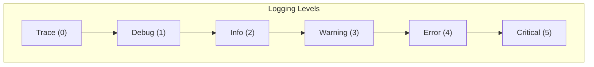

# Logging System

The logging system provides structured logging throughout the engine. This document explains the logger interface, logging concepts, and how to use the logging subsystem.

## Overview

The OmniCPP Engine provides a logging subsystem for:

- **Structured logging**: Multiple log levels (trace, debug, info, warning, error, critical)
- **Multiple outputs**: Console and file output
- **Configurable**: Log level and output format can be customized
- **Performance**: Efficient logging with minimal overhead

## ILogger Interface

The [`ILogger`](include/engine/ILogger.hpp:31) interface defines the contract for all logger implementations:

```cpp
namespace omnicpp {

enum class LogLevel : int32_t {
    TRACE = 0,
    DEBUG = 1,
    INFO = 2,
    WARNING = 3,
    ERROR = 4,
    FATAL = 5
};

class ILogger {
public:
    virtual ~ILogger() = default;

    virtual bool initialize() = 0;
    virtual void shutdown() = 0;
    virtual void log(LogLevel level, const char* message, const char* category = nullptr) = 0;
    virtual void set_log_level(LogLevel level) = 0;
    virtual LogLevel get_log_level() const = 0;
    virtual void set_console_output(bool enabled) = 0;
    virtual void set_file_output(bool enabled, const char* file_path = nullptr) = 0;
    virtual void flush() = 0;
};

} // namespace omnicpp
```

### Methods

| Method | Return Type | Description |
|--------|-------------|-------------|
| [`initialize()`](include/engine/ILogger.hpp:40) | `bool` | Initialize logger. Returns `true` on success. |
| [`shutdown()`](include/engine/ILogger.hpp:45) | `void` | Shutdown logger and release resources. |
| [`log()`](include/engine/ILogger.hpp:54) | `void` | Log a message with level and optional category. |
| [`set_log_level()`](include/engine/ILogger.hpp:61) | `void` | Set minimum log level. |
| [`get_log_level()`](include/engine/ILogger.hpp:68) | `LogLevel` | Get current log level. |
| [`set_console_output()`](include/engine/ILogger.hpp:75) | `void` | Enable/disable console output. |
| [`set_file_output()`](include/engine/ILogger.hpp:83) | `void` | Enable/disable file output with optional path. |
| [`flush()`](include/engine/ILogger.hpp:88) | `void` | Flush log buffers. |

## Logger Implementation

The [`Logger`](include/engine/logging/logger.hpp:33) class provides a concrete implementation using spdlog:

```cpp
namespace OmniCpp::Engine::Logging {

enum class LogLevel {
    Trace = SPDLOG_LEVEL_TRACE,
    Debug = SPDLOG_LEVEL_DEBUG,
    Info = SPDLOG_LEVEL_INFO,
    Warning = SPDLOG_LEVEL_WARN,
    Error = SPDLOG_LEVEL_ERROR,
    Critical = SPDLOG_LEVEL_CRITICAL,
    Off = SPDLOG_LEVEL_OFF
};

class Logger {
public:
    explicit Logger(const std::string& name);
    ~Logger();

    // Delete copy operations (C++23 best practice)
    Logger(const Logger&) = delete;
    Logger& operator=(const Logger&) = delete;

    // Enable move operations (C++23 best practice)
    Logger(Logger&&) noexcept;
    Logger& operator=(Logger&&) noexcept;

    void trace(const std::string& message);
    void debug(const std::string& message);
    void info(const std::string& message);
    void warning(const std::string& message);
    void error(const std::string& message);
    void critical(const std::string& message);

    void set_level(LogLevel level);
    [[nodiscard]] LogLevel get_level() const noexcept;
    void flush();

private:
    struct Impl;
    std::unique_ptr<Impl> m_impl; // Pimpl idiom for ABI stability
};

} // namespace OmniCpp::Engine::Logging
```

### Logger Methods

| Method | Return Type | Description |
|--------|-------------|-------------|
| [`trace()`](include/engine/logging/logger.hpp:50) | `void` | Log trace message. |
| [`debug()`](include/engine/logging/logger.hpp:56) | `void` | Log debug message. |
| [`info()`](include/engine/logging/logger.hpp:62) | `void` | Log info message. |
| [`warning()`](include/engine/logging/logger.hpp:68) | `void` | Log warning message. |
| [`error()`](include/engine/logging/logger.hpp:74) | `void` | Log error message. |
| [`critical()`](include/engine/logging/logger.hpp:80) | `void` | Log critical message. |
| [`set_level()`](include/engine/logging/logger.hpp:86) | `void` | Set log level. |
| [`get_level()`](include/engine/logging/logger.hpp:92) | `LogLevel` | Get current log level. |
| [`flush()`](include/engine/logging/logger.hpp:97) | `void` | Flush log buffers. |

## Log Levels

### Level Hierarchy



### Level Descriptions

| Level | Value | Description | Use Case |
|-------|-------|-------------|----------|
| **Trace** | 0 | Very detailed diagnostic information | Debugging, performance profiling |
| **Debug** | 1 | Detailed diagnostic information | Development, troubleshooting |
| **Info** | 2 | General informational messages | Status updates, milestones |
| **Warning** | 3 | Warning messages | Potential issues, deprecated features |
| **Error** | 4 | Error messages | Failures, exceptions |
| **Critical** | 5 | Critical error messages | Fatal errors, crashes |

### Level Filtering

Messages below the current log level are filtered out:

```cpp
void log_message(LogLevel level, const std::string& message) {
    if (level < m_current_level) {
        // Message is filtered out
        return;
    }

    // Log the message
    m_logger->log(level, message.c_str());
}
```

## Log Categories

Categories help organize and filter log messages:

```cpp
// Common categories
constexpr const char* CATEGORY_RENDERER = "RENDERER";
constexpr const char* CATEGORY_PHYSICS = "PHYSICS";
constexpr const char* CATEGORY_AUDIO = "AUDIO";
constexpr const char* CATEGORY_NETWORK = "NETWORK";
constexpr const char* CATEGORY_SCRIPT = "SCRIPT";
constexpr const char* CATEGORY_MEMORY = "MEMORY";
```

### Using Categories

```cpp
void log_render_message(const std::string& message) {
    auto* logger = engine->get_logger();
    logger->log(LogLevel::INFO, message.c_str(), CATEGORY_RENDERER);
}

void log_physics_message(const std::string& message) {
    auto* logger = engine->get_logger();
    logger->log(LogLevel::DEBUG, message.c_str(), CATEGORY_PHYSICS);
}
```

## Log Outputs

### Console Output

Logs can be written to the console:

```cpp
void enable_console_output(omnicpp::IEngine* engine) {
    auto* logger = engine->get_logger();

    // Enable console output
    logger->set_console_output(true);
}
```

### File Output

Logs can be written to files:

```cpp
void enable_file_output(omnicpp::IEngine* engine, const std::string& file_path) {
    auto* logger = engine->get_logger();

    // Enable file output
    logger->set_file_output(true, file_path.c_str());
}
```

### Output Formats

| Format | Description | Extension |
|--------|-------------|-----------|
| **Text** | Plain text logs | `.log`, `.txt` |
| **JSON** | Structured logs | `.json` |
| **CSV** | Comma-separated values | `.csv` |

## Code Examples

### Basic Logging Setup

```cpp
#include "engine/Engine.hpp"
#include "engine/ILogger.hpp"

int main() {
    // Create logger
    auto logger = std::make_unique<omnicpp::logging::Logger>("Game");

    // Configure engine
    omnicpp::EngineConfig config{};
    config.logger = logger.get();

    // Create engine
    omnicpp::IEngine* engine = omnicpp::create_engine(config);
    if (!engine) {
        return -1;
    }

    // Set log level
    logger->set_level(omnicpp::logging::LogLevel::Info);

    // Game loop
    while (running) {
        float delta_time = calculate_delta_time();

        // Update game logic
        engine->update(delta_time);

        // Render
        engine->render();
    }

    // Cleanup
    omnicpp::destroy_engine(engine);
    return 0;
}
```

### Logging with Categories

```cpp
#include "engine/logging/logger.hpp"

void log_game_events(omnicpp::logging::Logger* logger) {
    // Log renderer events
    logger->info("Texture loaded: player.png", "RENDERER");

    // Log physics events
    logger->debug("Collision detected: player vs wall", "PHYSICS");

    // Log network events
    logger->info("Player connected: 192.168.1.1", "NETWORK");

    // Log script events
    logger->warning("Script error: undefined variable", "SCRIPT");
}
```

### Conditional Logging

```cpp
void debug_log(omnicpp::logging::Logger* logger, const std::string& message) {
#ifdef DEBUG_BUILD
    // Only log in debug builds
    logger->debug(message);
#else
    // In release builds, this is a no-op
    (void)message;
#endif
}
```

### Performance Logging

```cpp
class PerformanceLogger {
public:
    void log_frame_time(float frame_time) {
        if (frame_time > 16.67f) { // > 60 FPS
            m_logger->warning("Frame time: {:.2f}ms (slow)", frame_time * 1000.0f);
        }
    }

    void log_memory_usage(size_t usage) {
        m_logger->info("Memory usage: {} MB", usage / (1024 * 1024));
    }

private:
    omnicpp::logging::Logger* m_logger;
};
```

## Log Configuration

### JSON Configuration

Logs can be configured via JSON:

```json
{
  "level": "info",
  "console": true,
  "file": {
    "enabled": true,
    "path": "logs/game.log"
  },
  "format": {
    "pattern": "[%Y-%m-%d %H:%M:%S:%S] [%n]",
    "time": true
  }
}
```

### Loading Configuration

```cpp
#include "engine/logging/logger.hpp"
#include <nlohmann/json.hpp>

void load_log_config(omnicpp::logging::Logger* logger, const std::string& config_path) {
    // Read JSON config
    std::ifstream file(config_path);
    nlohmann::json config;
    file >> config;

    // Set log level
    if (config.contains("level")) {
        std::string level_str = config["level"];
        logger->set_level(parse_log_level(level_str));
    }

    // Set console output
    if (config.contains("console")) {
        logger->set_console_output(config["console"]);
    }

    // Set file output
    if (config.contains("file")) {
        auto file_config = config["file"];
        if (file_config.contains("enabled")) {
            std::string path = file_config["path"];
            logger->set_file_output(file_config["enabled"], path.c_str());
        }
    }
}
```

## Performance Optimization

### Asynchronous Logging

Logs can be written asynchronously to avoid blocking:

```cpp
class AsyncLogger {
public:
    void log(LogLevel level, const std::string& message) {
        // Add to queue
        m_queue.push({level, message});

        // Wake up worker thread
        m_cv.notify_one();
    }

private:
    void worker_thread() {
        while (m_running) {
            std::unique_lock lock(m_mutex);

            // Wait for messages
            m_cv.wait(lock, [this] { return !m_queue.empty(); });

            // Process messages
            while (!m_queue.empty()) {
                auto [level, message] = std::move(m_queue.front());
                m_queue.pop();

                // Write to file
                m_logger->log(level, message.c_str());
            }
        }
    }

    std::queue<std::pair<LogLevel, std::string>> m_queue;
    std::mutex m_mutex;
    std::condition_variable m_cv;
    std::thread m_worker_thread;
    bool m_running = true;
};
```

### Log Buffering

Messages can be buffered to reduce I/O operations:

```cpp
class BufferedLogger {
public:
    void log(LogLevel level, const std::string& message) {
        m_buffer += format_message(level, message);

        if (m_buffer.size() >= BUFFER_SIZE) {
            flush();
        }
    }

    void flush() {
        if (!m_buffer.empty()) {
            m_logger->log(LogLevel::Info, m_buffer.c_str());
            m_buffer.clear();
        }
    }

private:
    std::string m_buffer;
    static constexpr size_t BUFFER_SIZE = 4096;
};
```

## Troubleshooting

### Logger Initialization Fails

**Symptom**: [`initialize()`](include/engine/ILogger.hpp:40) returns `false`

**Possible causes**:
- Invalid configuration
- Insufficient permissions
- Disk full
- Invalid log path

**Solution**: Check configuration, permissions, and disk space.

### Log File Not Created

**Symptom**: File output enabled but no log file created

**Possible causes**:
- Invalid file path
- No write permissions
- Directory doesn't exist

**Solution**: Verify file path and ensure directory exists.

### Messages Not Appearing

**Symptom**: Messages logged but not visible

**Possible causes**:
- Log level too high
- Console output disabled
- File output disabled

**Solution**: Check log level and output settings.

### Performance Impact

**Symptom**: Logging causes performance degradation

**Possible causes**:
- Too many log messages
- Synchronous file I/O
- Expensive formatting

**Solution**: Reduce log level, use asynchronous logging, and buffer messages.

## Related Documentation

- [Engine Overview](index.md) - High-level engine architecture
- [Subsystems Guide](subsystems.md) - Subsystem interaction
- [Platform Abstraction](platform.md) - File system operations

## References

- [spdlog Documentation](https://github.com/gabime/spdlog)
- [Logging Best Practices](https://www.youtube.com/playlist?list=PLW3Zl3TIAbgu6BI6rQj5b7pZ)
- [Structured Logging](https://www.youtube.com/playlist?list=PLW3Zl3TIAbgu6BI6rQj5b7pZ)
