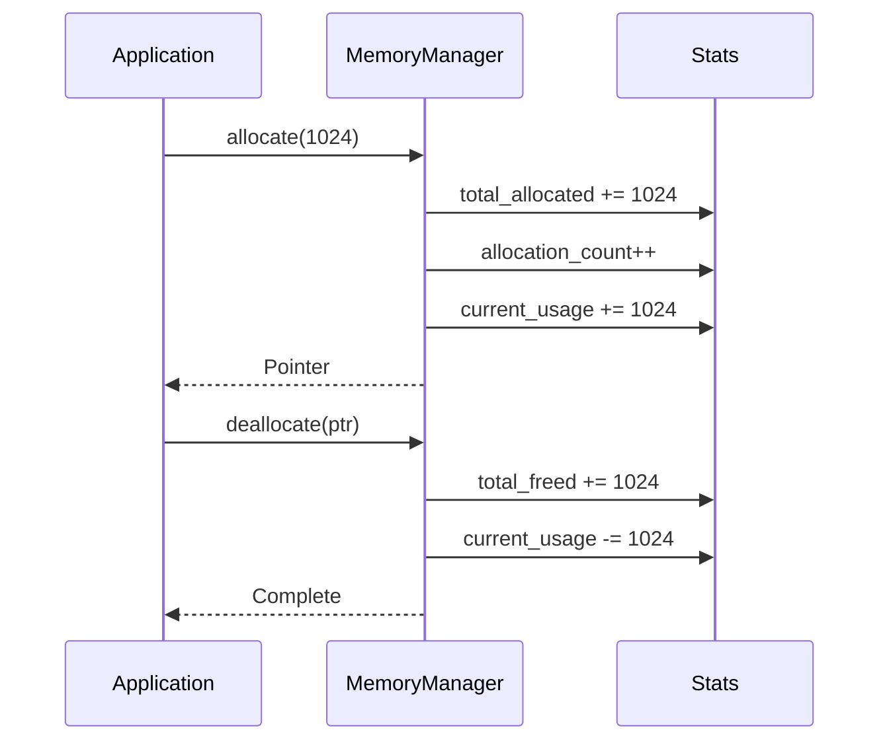
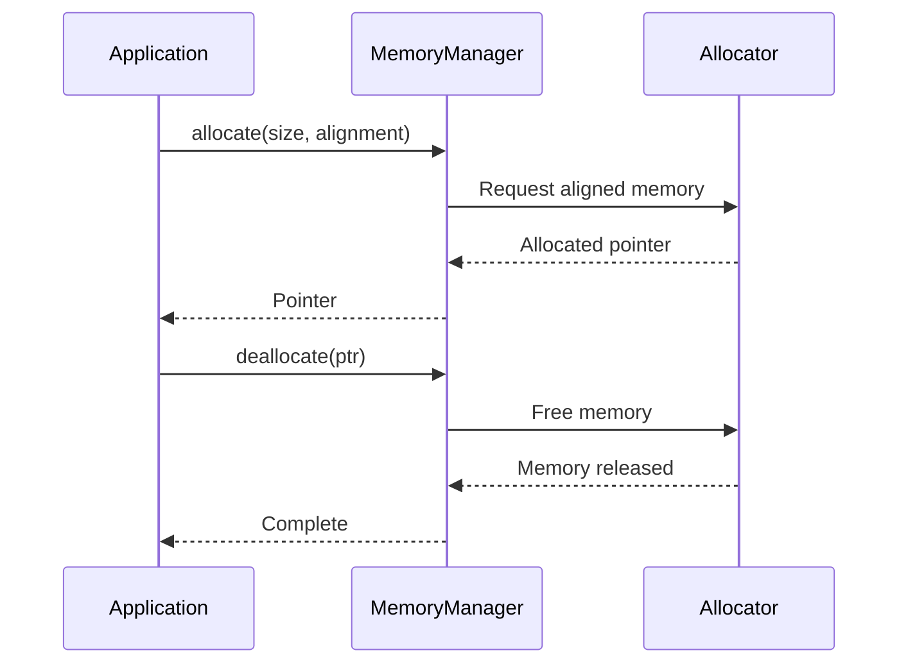

# Memory Management System

The memory management system provides custom memory allocation with tracking and leak detection. This document explains the memory manager interface, memory concepts, and best practices for memory management.

## Overview

The OmniCPP Engine provides a memory subsystem for:

- **Custom allocation**: Aligned memory allocation with tracking
- **Leak detection**: Detect memory leaks at runtime
- **Statistics**: Track memory usage for debugging
- **Pool allocation**: Efficient allocation for small objects

## MemoryManager Interface

The [`MemoryManager`](include/engine/memory/memory_manager.hpp:30) class provides memory management functionality:

```cpp
namespace OmniCpp::Engine::Memory {

struct MemoryStats {
    size_t total_allocated{ 0 };
    size_t total_freed{ 0 };
    size_t current_usage{ 0 };
    size_t allocation_count{ 0 };
};

class MemoryManager {
public:
    MemoryManager();
    ~MemoryManager();

    // Delete copy operations (C++23 best practice)
    MemoryManager(const MemoryManager&) = delete;
    MemoryManager& operator=(const MemoryManager&) = delete;

    // Enable move operations (C++23 best practice)
    MemoryManager(MemoryManager&&) noexcept;
    MemoryManager& operator=(MemoryManager&&) noexcept;

    [[nodiscard]] void* allocate(size_t size, size_t alignment = alignof(std::max_align_t));
    void deallocate(void* ptr);
    [[nodiscard]] const MemoryStats& get_stats() const noexcept;
    [[nodiscard]] bool has_leaks() const noexcept;

    bool initialize();
    void shutdown();

private:
    struct Impl;
    std::unique_ptr<Impl> m_impl; // Pimpl idiom for ABI stability
};

} // namespace OmniCpp::Engine::Memory
```

### Methods

| Method | Return Type | Description |
|--------|-------------|-------------|
| [`allocate()`](include/engine/memory/memory_manager.hpp:49) | `void*` | Allocate aligned memory. Returns `nullptr` on failure. |
| [`deallocate()`](include/engine/memory/memory_manager.hpp:55) | `void` | Deallocate memory. |
| [`get_stats()`](include/engine/memory/memory_manager.hpp:61) | `const MemoryStats&` | Get current memory statistics. |
| [`has_leaks()`](include/engine/memory/memory_manager.hpp:67) | `bool` | Check for memory leaks. |
| [`initialize()`](include/engine/memory/memory_manager.hpp:73) | `bool` | Initialize memory manager. Returns `true` on success. |
| [`shutdown()`](include/engine/memory/memory_manager.hpp:78) | `void` | Shutdown memory manager. |

## Memory Statistics

### MemoryStats Structure

```cpp
// From include/engine/memory/memory_manager.hpp:17
struct MemoryStats {
    size_t total_allocated{ 0 };    // Total bytes allocated
    size_t total_freed{ 0 };        // Total bytes freed
    size_t current_usage{ 0 };        // Current bytes in use
    size_t allocation_count{ 0 };        // Number of allocations
};
```

### Statistics Tracking



### Monitoring Memory Usage

```cpp
void log_memory_stats(omnicpp::IEngine* engine) {
    auto* memory = engine->get_memory_manager();

    // Get statistics
    const auto& stats = memory->get_stats();

    // Calculate usage in MB
    double usage_mb = stats.current_usage / (1024.0 * 1024.0);

    spdlog::info("Memory: {:.2f} MB allocated, {:.2f} MB freed, {:.2f} MB in use",
                 stats.total_allocated / (1024.0 * 1024.0),
                 stats.total_freed / (1024.0 * 1024.0),
                 usage_mb);
}
```

## Memory Allocation

### Aligned Allocation

Memory is allocated with alignment requirements:

```cpp
// From include/engine/memory/memory_manager.hpp:49
[[nodiscard]] void* allocate(size_t size, size_t alignment = alignof(std::max_align_t));
```

### Alignment Benefits

- **Performance**: Properly aligned memory is faster to access
- **SIMD**: SIMD operations require aligned memory
- **Platform compatibility**: Some platforms require specific alignment

### Alignment Values

| Type | Alignment | Use Case |
|-------|-----------|----------|
| **max_align_t** | Platform maximum | General purpose |
| **16 bytes** | SSE2 instructions | Vector operations |
| **32 bytes** | AVX instructions | Complex types |
| **64 bytes** | AVX-512 instructions | Large structures |

### Allocation Flow



## Memory Deallocation

### Tracking Deallocation

```cpp
// From src/engine/memory/memory_manager.cpp
void deallocate(void* ptr) {
    if (!ptr) return;

    // Find allocation record
    auto it = m_allocations.find(ptr);
    if (it == m_allocations.end()) {
        spdlog::warn("Attempting to deallocate unknown pointer: {}", ptr);
        return;
    }

    // Update statistics
    m_stats.total_freed += it->second.size;
    m_stats.current_usage -= it->second.size;
    m_stats.allocation_count--;

    // Remove from tracking
    m_allocations.erase(it);

    // Free memory
    ::operator delete[](static_cast<char*>(ptr));
}
```

### Safe Deallocation

```cpp
class SafeDeallocator {
public:
    void deallocate(void* ptr, size_t size) {
        // Clear memory before freeing
        std::memset(ptr, 0, size);

        // Free memory
        ::operator delete[](static_cast<char*>(ptr));
    }
};
```

## Memory Pools

### Pool Allocation

Small objects can be allocated from pools for efficiency:

```cpp
template<typename T, size_t PoolSize>
class MemoryPool {
public:
    MemoryPool() {
        // Pre-allocate pool
        m_pool = static_cast<T*>(::operator new[](sizeof(T) * PoolSize));

        // Mark all as free
        for (size_t i = 0; i < PoolSize; ++i) {
            m_free[i] = &m_pool[i];
        }
    }

    ~MemoryPool() {
        // Free entire pool
        ::operator delete[](m_pool);
    }

    T* allocate() {
        if (m_free_count == 0) {
            // Pool exhausted
            return static_cast<T*>(::operator new(sizeof(T)));
        }

        // Get next free slot
        T* ptr = m_free[--m_free_count];

        return ptr;
    }

    void deallocate(T* ptr) {
        // Mark as free
        size_t index = ptr - m_pool;
        m_free[m_free_count++] = ptr;
    }

private:
    T* m_pool;
    T* m_free[PoolSize];
    size_t m_free_count = PoolSize;
};
```

### Pool Benefits

- **Reduced fragmentation**: Contiguous memory for same type
- **Faster allocation**: No need to search for free block
- **Cache efficiency**: Better locality for same type objects
- **Deterministic**: Predictable allocation patterns

## Leak Detection

### Detecting Leaks

```cpp
// From include/engine/memory/memory_manager.hpp:67
[[nodiscard]] bool has_leaks() const noexcept;
```

### Leak Detection Algorithm

```cpp
bool has_leaks() const {
    // Check if any allocations are not freed
    for (const auto& [ptr, info] : m_allocations) {
        if (!info.freed) {
            spdlog::error("Memory leak detected: {} bytes at {}",
                         info.size, info.location);
            return true;
        }
    }

    return false;
}
```

### Allocation Tracking

```cpp
struct AllocationInfo {
    size_t size;
    std::string location;
    bool freed;
};

class MemoryTracker {
public:
    void track_allocation(void* ptr, size_t size, const std::string& location) {
        m_allocations[ptr] = {size, location, false};
    }

    void track_deallocation(void* ptr) {
        auto it = m_allocations.find(ptr);
        if (it != m_allocations.end()) {
            it->second.freed = true;
        }
    }

private:
    std::unordered_map<void*, AllocationInfo> m_allocations;
};
```

## Code Examples

### Basic Memory Usage

```cpp
#include "engine/memory/memory_manager.hpp"

void allocate_game_objects(omnicpp::IEngine* engine) {
    auto* memory = engine->get_memory_manager();

    // Allocate player object
    auto* player = memory->allocate(sizeof(Player), alignof(Player));
    new (player) Player();

    // Allocate enemy array
    size_t enemy_count = 100;
    auto* enemies = memory->allocate(sizeof(Enemy) * enemy_count, alignof(Enemy));
    for (size_t i = 0; i < enemy_count; ++i) {
        new (&enemies[i]) Enemy();
    }

    // Log memory usage
    const auto& stats = memory->get_stats();
    spdlog::info("Allocated {} bytes for game objects", stats.current_usage);
}
```

### Memory Pool Usage

```cpp
#include "engine/memory/memory_manager.hpp"

template<typename T>
class GameObjectPool {
public:
    GameObjectPool(size_t pool_size) {
        // Allocate pool
        m_pool = static_cast<T*>(::operator new[](sizeof(T) * pool_size));
    }

    T* create_object() {
        return m_pool.allocate();
    }

    void destroy_object(T* obj) {
        obj->~T();
        m_pool.deallocate(obj);
    }

private:
    MemoryPool<T, 1024> m_pool; // Pool of 1024 objects
};

// Use pool
GameObjectPool<Bullet> bullet_pool(1024);
auto* bullet = bullet_pool.create_object();
// ...
bullet_pool.destroy_object(bullet);
```

### Checking for Leaks

```cpp
#include "engine/memory/memory_manager.hpp"

void check_memory_leaks(omnicpp::IEngine* engine) {
    auto* memory = engine->get_memory_manager();

    // Check for leaks
    if (memory->has_leaks()) {
        spdlog::error("Memory leaks detected!");

        // Get statistics
        const auto& stats = memory->get_stats();

        spdlog::error("Total allocated: {} bytes", stats.total_allocated);
        spdlog::error("Total freed: {} bytes", stats.total_freed);
        spdlog::error("Current usage: {} bytes", stats.current_usage);
        spdlog::error("Allocation count: {}", stats.allocation_count);
    }
}
```

### Custom Allocator

```cpp
template<typename T>
class CustomAllocator {
public:
    T* allocate(size_t count) {
        size_t size = sizeof(T) * count;
        void* ptr = ::operator new(size);

        // Track allocation
        m_allocations[ptr] = {size, "CustomAllocator", false};

        return static_cast<T*>(ptr);
    }

    void deallocate(T* ptr) {
        auto it = m_allocations.find(ptr);
        if (it != m_allocations.end()) {
            it->second.freed = true;
            ::operator delete[](static_cast<char*>(ptr));
        }
    }

private:
    std::unordered_map<void*, AllocationInfo> m_allocations;
};
```

## Performance Optimization

### Arena Allocation

Large allocations can use arena allocation:

```cpp
class ArenaAllocator {
public:
    ArenaAllocator(size_t arena_size) {
        m_arena = ::operator new[](arena_size);
        m_offset = 0;
    }

    void* allocate(size_t size) {
        if (m_offset + size > m_arena_size) {
            // Arena exhausted
            return ::operator new(size);
        }

        void* ptr = &m_arena[m_offset];
        m_offset += size;
        return ptr;
    }

    void reset() {
        m_offset = 0;
    }

private:
    char* m_arena;
    size_t m_offset;
    size_t m_arena_size;
};
```

### Stack Allocation

Temporary allocations can use stack memory:

```cpp
void process_data() {
    // Use stack for temporary buffer
    alignas(16) char buffer[4096];

    // Process data...
    // Buffer automatically freed when function returns
}
```

### Memory Alignment

```cpp
// Aligned allocation
template<typename T>
T* aligned_allocate(size_t count) {
    size_t size = sizeof(T) * count;
    size_t alignment = alignof(T);

    // Allocate aligned memory
    void* ptr = ::operator new(size + alignment - 1);

    // Calculate aligned address
    uintptr_t aligned_ptr = reinterpret_cast<uintptr_t>(ptr);
    if (aligned_ptr % alignment != 0) {
        aligned_ptr += alignment - (aligned_ptr % alignment);
    }

    return reinterpret_cast<T*>(aligned_ptr);
}
```

## Troubleshooting

### Memory Allocation Fails

**Symptom**: [`allocate()`](include/engine/memory/memory_manager.hpp:49) returns `nullptr`

**Possible causes**:
- Insufficient memory
- Invalid alignment value
- Memory manager not initialized

**Solution**: Check available memory and alignment requirements.

### Memory Leaks Detected

**Symptom**: [`has_leaks()`](include/engine/memory/memory_manager.hpp:67) returns `true`

**Possible causes**:
- Memory not deallocated
- Circular references
- Missing deallocation

**Solution**: Review allocation/deallocation pairs and ensure proper cleanup.

### High Memory Usage

**Symptom**: Memory usage increases continuously

**Possible causes**:
- Memory leaks
- Inefficient allocation patterns
- Large allocations

**Solution**: Use memory pools, check for leaks, and optimize allocation patterns.

### Out of Memory

**Symptom**: Allocation fails with out of memory error

**Possible causes**:
- System memory exhausted
- Memory fragmentation
- Large allocation request

**Solution**: Implement memory budgeting, use streaming for large resources, and optimize memory usage.

## Related Documentation

- [Engine Overview](index.md) - High-level engine architecture
- [Subsystems Guide](subsystems.md) - Subsystem interaction
- [Resource Management](resources.md) - Asset loading and caching

## References

- [C++ Memory Management](https://www.youtube.com/playlist?list=PLW3Zl3TIAbgu6BI6rQj5b7pZ)
- [Memory Best Practices](https://www.youtube.com/playlist?list=PLW3Zl3TIAbgu6BI6rQj5b7pZ)
- [Memory Leaks](https://www.youtube.com/playlist?list=PLW3Zl3TIAbgu6BI6rQj5b7pZ)
