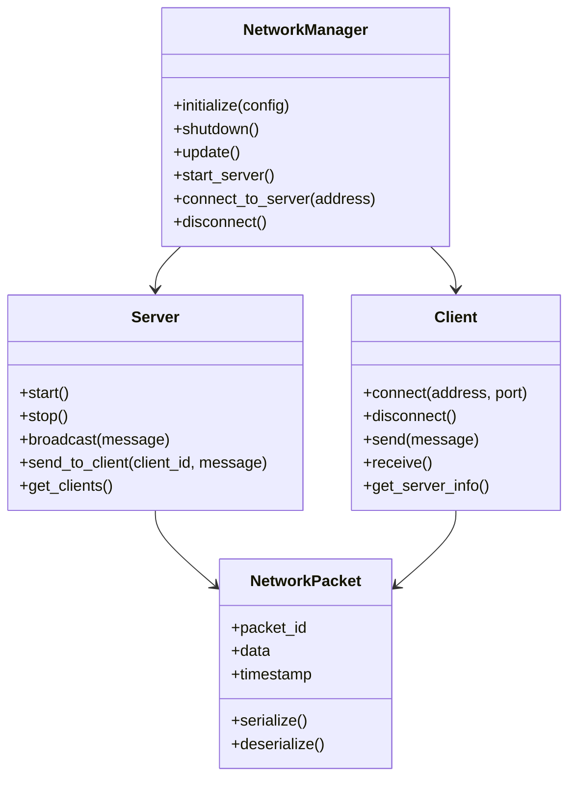
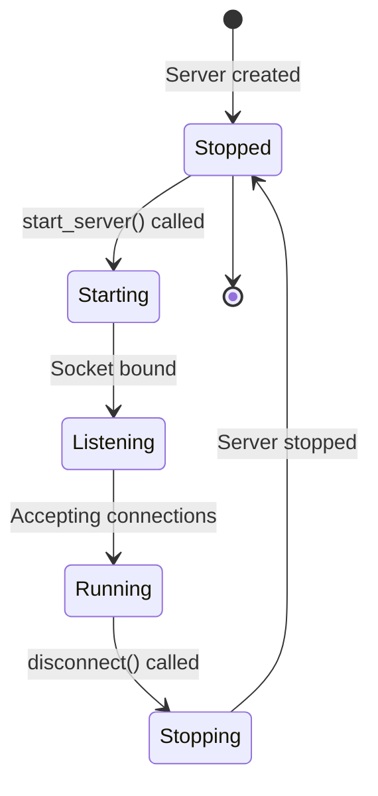
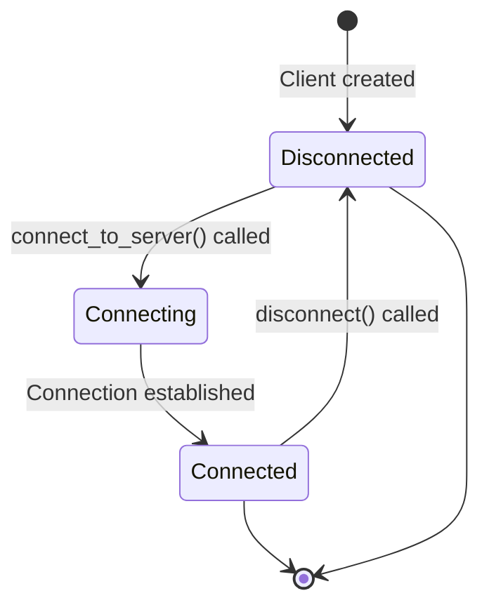
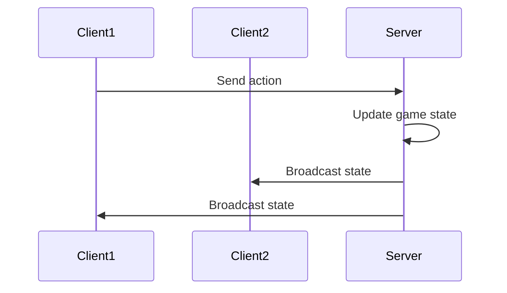

# Networking System

The networking system provides multiplayer and network communication capabilities. This document explains the network manager interface, networking concepts, and how to use the networking subsystem.

## Overview

The OmniCPP Engine provides a networking subsystem for:

- **Server hosting**: Host multiplayer games
- **Client connection**: Connect to remote servers
- **Data synchronization**: Sync game state across clients
- **Network events**: Handle network messages

## NetworkManager Interface

The [`NetworkManager`](include/engine/network/network_manager.hpp:26) class provides networking functionality:

```cpp
namespace OmniCpp::Engine::Network {

struct NetworkConfig {
    uint16_t port{ 8080 };
    bool is_server{ false };
    uint32_t max_connections{ 32 };
};

class NetworkManager {
public:
    NetworkManager();
    ~NetworkManager();

    NetworkManager(const NetworkManager&) = delete;
    NetworkManager& operator=(const NetworkManager&) = delete;

    NetworkManager(NetworkManager&&) noexcept;
    NetworkManager& operator=(NetworkManager&&) noexcept;

    bool initialize(const NetworkConfig& config);
    void shutdown();
    void update();

    bool start_server();
    bool connect_to_server(const std::string& address);
    void disconnect();

private:
    struct Impl;
    std::unique_ptr<Impl> m_impl;
};

} // namespace OmniCpp::Engine::Network
```

### Methods

| Method | Return Type | Description |
|--------|-------------|-------------|
| [`initialize()`](include/engine/network/network_manager.hpp:37) | `bool` | Initialize network manager with config. Returns `true` on success. |
| [`shutdown()`](include/engine/network/network_manager.hpp:38) | `void` | Shutdown network manager and close connections. |
| [`update()`](include/engine/network/network_manager.hpp:39) | `void` | Update network system. Called each frame. |
| [`start_server()`](include/engine/network/network_manager.hpp:41) | `bool` | Start hosting a server. Returns `true` on success. |
| [`connect_to_server()`](include/engine/network/network_manager.hpp:42) | `bool` | Connect to a remote server. Returns `true` on success. |
| [`disconnect()`](include/engine/network/network_manager.hpp:43) | `void` | Disconnect from server or stop server. |

## Network Architecture



## Network Configuration

### Server Configuration

```cpp
NetworkConfig server_config{};
server_config.port = 8080;
server_config.is_server = true;
server_config.max_connections = 32;
```

### Client Configuration

```cpp
NetworkConfig client_config{};
client_config.port = 8080;
client_config.is_server = false;
client_config.max_connections = 0; // Not used for clients
```

## Server Hosting

### Server Lifecycle



### Starting a Server

```cpp
#include "engine/network/network_manager.hpp"

void host_game(omnicpp::IEngine* engine) {
    auto* networking = engine->get_network_manager();

    // Configure server
    OmniCpp::Engine::Network::NetworkConfig config{};
    config.port = 8080;
    config.is_server = true;
    config.max_connections = 32;

    // Initialize network manager
    if (!networking->initialize(config)) {
        spdlog::error("Failed to initialize network manager");
        return;
    }

    // Start server
    if (!networking->start_server()) {
        spdlog::error("Failed to start server");
        return;
    }

    spdlog::info("Server started on port {}", config.port);
}
```

### Broadcasting Messages

```cpp
void broadcast_game_state(omnicpp::IEngine* engine) {
    auto* networking = engine->get_network_manager();

    // Create game state packet
    GameStatePacket packet{};
    packet.packet_id = PACKET_GAME_STATE;
    packet.player_count = get_player_count();
    packet.game_time = get_game_time();

    // Broadcast to all clients
    networking->broadcast(packet.serialize());
}
```

## Client Connection

### Client Lifecycle



### Connecting to a Server

```cpp
#include "engine/network/network_manager.hpp"

void join_game(omnicpp::IEngine* engine, const std::string& server_address) {
    auto* networking = engine->get_network_manager();

    // Configure client
    OmniCpp::Engine::Network::NetworkConfig config{};
    config.port = 8080;
    config.is_server = false;

    // Initialize network manager
    if (!networking->initialize(config)) {
        spdlog::error("Failed to initialize network manager");
        return;
    }

    // Connect to server
    if (!networking->connect_to_server(server_address)) {
        spdlog::error("Failed to connect to server");
        return;
    }

    spdlog::info("Connected to server: {}", server_address);
}
```

### Sending Messages

```cpp
void send_player_action(omnicpp::IEngine* engine, PlayerAction action) {
    auto* networking = engine->get_network_manager();

    // Create action packet
    PlayerActionPacket packet{};
    packet.packet_id = PACKET_PLAYER_ACTION;
    packet.player_id = get_local_player_id();
    packet.action = action;

    // Send to server
    networking->send(packet.serialize());
}
```

## Network Packets

### Packet Structure

```cpp
struct NetworkPacket {
    uint32_t packet_id;
    uint32_t timestamp;
    std::vector<uint8_t> data;

    std::vector<uint8_t> serialize() const {
        std::vector<uint8_t> buffer;
        // Serialize packet_id
        buffer.insert(buffer.end(),
                   reinterpret_cast<uint8_t*>(&packet_id),
                   sizeof(packet_id));
        // Serialize timestamp
        buffer.insert(buffer.end(),
                   reinterpret_cast<uint8_t*>(&timestamp),
                   sizeof(timestamp));
        // Serialize data
        buffer.insert(buffer.end(), data.begin(), data.end());
        return buffer;
    }

    static NetworkPacket deserialize(const std::vector<uint8_t>& buffer) {
        NetworkPacket packet{};
        size_t offset = 0;

        // Deserialize packet_id
        if (buffer.size() >= sizeof(uint32_t)) {
            packet.packet_id = *reinterpret_cast<const uint32_t*>(buffer.data() + offset);
            offset += sizeof(uint32_t);
        }

        // Deserialize timestamp
        if (buffer.size() >= offset + sizeof(uint32_t)) {
            packet.timestamp = *reinterpret_cast<const uint32_t*>(buffer.data() + offset);
            offset += sizeof(uint32_t);
        }

        // Deserialize data
        if (buffer.size() > offset) {
            packet.data.assign(buffer.begin() + offset, buffer.end());
        }

        return packet;
    }
};
```

### Packet Types

| Packet ID | Description | Direction |
|-----------|-------------|-----------|
| **PACKET_GAME_STATE** | Current game state | Server → Client |
| **PACKET_PLAYER_ACTION** | Player action | Client → Server |
| **PACKET_PLAYER_JOIN** | Player joined | Server → Client |
| **PACKET_PLAYER_LEAVE** | Player left | Server → Client |
| **PACKET_CHAT_MESSAGE** | Chat message | Both |
| **PACKET_GAME_EVENT** | Game event | Server → Client |

## Network Events

### Event System

```cpp
enum class NetworkEventType {
    PLAYER_CONNECTED,
    PLAYER_DISCONNECTED,
    PLAYER_JOINED,
    PLAYER_LEFT,
    MESSAGE_RECEIVED,
    GAME_STATE_UPDATED
};

using NetworkCallback = std::function<void(NetworkEventType, const void*)>;

class NetworkEventManager {
public:
    void register_callback(NetworkEventType event, NetworkCallback callback) {
        m_callbacks[event] = callback;
    }

    void trigger_event(NetworkEventType event, const void* data) {
        auto it = m_callbacks.find(event);
        if (it != m_callbacks.end()) {
            it->second(event, data);
        }
    }

private:
    std::unordered_map<NetworkEventType, NetworkCallback> m_callbacks;
};
```

### Handling Events

```cpp
void on_player_connected(uint32_t player_id) {
    spdlog::info("Player {} connected", player_id);

    // Create player entity
    create_player_entity(player_id);
}

void on_player_disconnected(uint32_t player_id) {
    spdlog::info("Player {} disconnected", player_id);

    // Remove player entity
    remove_player_entity(player_id);
}
```

## Code Examples

### Basic Server Setup

```cpp
#include "engine/Engine.hpp"
#include "engine/network/network_manager.hpp"

int main() {
    // Create network manager
    auto networking = std::make_unique<OmniCpp::Engine::Network::NetworkManager>();

    // Configure engine
    omnicpp::EngineConfig config{};
    config.network_manager = networking.get();

    // Create engine
    omnicpp::IEngine* engine = omnicpp::create_engine(config);
    if (!engine) {
        return -1;
    }

    // Configure and start server
    OmniCpp::Engine::Network::NetworkConfig net_config{};
    net_config.port = 8080;
    net_config.is_server = true;
    net_config.max_connections = 32;

    if (!networking->initialize(net_config)) {
        return -1;
    }

    if (!networking->start_server()) {
        return -1;
    }

    spdlog::info("Server listening on port 8080");

    // Game loop
    while (running) {
        float delta_time = calculate_delta_time();

        // Update game logic
        engine->update(delta_time);

        // Update network
        networking->update();

        // Render
        engine->render();
    }

    // Cleanup
    networking->disconnect();
    omnicpp::destroy_engine(engine);
    return 0;
}
```

### Basic Client Setup

```cpp
#include "engine/Engine.hpp"
#include "engine/network/network_manager.hpp"

int main() {
    // Create network manager
    auto networking = std::make_unique<OmniCpp::Engine::Network::NetworkManager>();

    // Configure engine
    omnicpp::EngineConfig config{};
    config.network_manager = networking.get();

    // Create engine
    omnicpp::IEngine* engine = omnicpp::create_engine(config);
    if (!engine) {
        return -1;
    }

    // Configure and connect to server
    OmniCpp::Engine::Network::NetworkConfig net_config{};
    net_config.port = 8080;
    net_config.is_server = false;

    if (!networking->initialize(net_config)) {
        return -1;
    }

    if (!networking->connect_to_server("127.0.0.1:8080")) {
        return -1;
    }

    spdlog::info("Connected to server");

    // Game loop
    while (running) {
        float delta_time = calculate_delta_time();

        // Update game logic
        engine->update(delta_time);

        // Update network
        networking->update();

        // Render
        engine->render();
    }

    // Cleanup
    networking->disconnect();
    omnicpp::destroy_engine(engine);
    return 0;
}
```

### Network Event Handling

```cpp
class GameNetworkHandler {
public:
    void initialize(omnicpp::IEngine* engine) {
        auto* networking = engine->get_network_manager();

        // Register event callbacks
        networking->on_player_connected([this](uint32_t player_id) {
            this->on_player_connected(player_id);
        });

        networking->on_player_disconnected([this](uint32_t player_id) {
            this->on_player_disconnected(player_id);
        });

        networking->on_message_received([this](const std::string& message) {
            this->on_message_received(message);
        });
    }

    void on_player_connected(uint32_t player_id) {
        spdlog::info("Player {} joined the game", player_id);
        // Spawn player entity
        spawn_player(player_id);
    }

    void on_player_disconnected(uint32_t player_id) {
        spdlog::info("Player {} left the game", player_id);
        // Remove player entity
        remove_player(player_id);
    }

    void on_message_received(const std::string& message) {
        spdlog::info("Received: {}", message);
        // Handle message
        process_chat_message(message);
    }
};
```

## Data Synchronization

### State Synchronization



### Synchronization Strategies

| Strategy | Description | Latency | Bandwidth |
|----------|-------------|----------|-----------|
| **State snapshot** | Send full game state | High | High |
| **Delta compression** | Send only changes | Low | Medium |
| **Prediction** | Client predicts actions | Very Low | Low |
| **Interpolation** | Smooth between states | Low | Low |

### Client-Side Prediction

```cpp
class ClientPredictor {
public:
    void predict_movement(const PlayerInput& input) {
        // Predict local position
        m_predicted_position = m_current_position + input.velocity * delta_time;

        // Send input to server
        send_input_to_server(input);
    }

    void apply_server_correction(const glm::vec3& server_position) {
        // Smoothly interpolate to server position
        float t = std::min(1.0f, m_correction_timer / CORRECTION_TIME);
        m_current_position = glm::mix(m_predicted_position, server_position, t);
    }

private:
    glm::vec3 m_current_position;
    glm::vec3 m_predicted_position;
    float m_correction_timer = 0.0f;
    static constexpr float CORRECTION_TIME = 0.1f;
};
```

## Performance Optimization

### Packet Batching

Multiple small packets can be combined into one larger packet:

```cpp
class PacketBatcher {
public:
    void add_packet(const NetworkPacket& packet) {
        m_batch.push_back(packet);

        if (m_batch.size() >= MAX_BATCH_SIZE) {
            flush_batch();
        }
    }

    void flush_batch() {
        if (m_batch.empty()) return;

        // Combine packets
        auto combined = combine_packets(m_batch);

        // Send combined packet
        send_to_network(combined);

        m_batch.clear();
    }

private:
    std::vector<NetworkPacket> m_batch;
    static constexpr size_t MAX_BATCH_SIZE = 16;
};
```

### Network Throttling

Limit network usage to prevent flooding:

```cpp
class NetworkThrottler {
public:
    bool can_send() {
        auto now = std::chrono::steady_clock::now();

        // Check rate limit
        if (m_packets_sent >= MAX_PACKETS_PER_SECOND) {
            auto elapsed = std::chrono::duration_cast<std::chrono::milliseconds>(
                now - m_last_reset).count();

            if (elapsed >= 1000) { // 1 second
                m_packets_sent = 0;
                m_last_reset = now;
                return true;
            }

            return false;
        }

        return true;
    }

    void on_packet_sent() {
        m_packets_sent++;
    }

private:
    uint32_t m_packets_sent = 0;
    std::chrono::steady_clock::time_point m_last_reset;
    static constexpr uint32_t MAX_PACKETS_PER_SECOND = 60;
};
```

## Security Considerations

### Packet Validation

Validate incoming packets to prevent exploits:

```cpp
bool validate_packet(const NetworkPacket& packet) {
    // Check packet size
    if (packet.data.size() > MAX_PACKET_SIZE) {
        spdlog::warn("Packet too large: {}", packet.data.size());
        return false;
    }

    // Check packet ID
    if (packet.packet_id >= PACKET_ID_MAX) {
        spdlog::warn("Invalid packet ID: {}", packet.packet_id);
        return false;
    }

    // Check timestamp (prevent replay attacks)
    auto now = std::chrono::steady_clock::now();
    auto packet_time = std::chrono::steady_clock::time_point(
        std::chrono::milliseconds(packet.timestamp));

    if (packet_time < m_last_packet_time - MAX_PACKET_AGE) {
        spdlog::warn("Old packet rejected");
        return false;
    }

    m_last_packet_time = now;
    return true;
}
```

### Authentication

Implement server authentication:

```cpp
class Authenticator {
public:
    bool authenticate(const std::string& token) {
        // Validate token
        if (!is_valid_token(token)) {
            spdlog::warn("Invalid authentication token");
            return false;
        }

        return true;
    }

private:
    bool is_valid_token(const std::string& token) {
        // Check token format and signature
        return verify_signature(token);
    }
};
```

## Troubleshooting

### Server Start Fails

**Symptom**: [`start_server()`](include/engine/network/network_manager.hpp:41) returns `false`

**Possible causes**:
- Port already in use
- Insufficient permissions
- Network interface not available
- Firewall blocking connection

**Solution**: Check port availability, permissions, and firewall settings.

### Client Connection Fails

**Symptom**: [`connect_to_server()`](include/engine/network/network_manager.hpp:42) returns `false`

**Possible causes**:
- Server not reachable
- Wrong address or port
- Server full
- Authentication failed

**Solution**: Verify server address, port, and check server logs.

### Packet Loss

**Symptom**: Packets not reaching destination

**Possible causes**:
- Network congestion
- Poor connection quality
- Firewall blocking
- Router issues

**Solution**: Implement packet acknowledgment and retransmission.

### High Latency

**Symptom**: Significant delay between client and server

**Possible causes**:
- Long physical distance
- Network routing issues
- Server overload
- Poor connection quality

**Solution**: Implement client-side prediction and server-side reconciliation.

## Related Documentation

- [Engine Overview](index.md) - High-level engine architecture
- [Subsystems Guide](subsystems.md) - Subsystem interaction
- [Platform Abstraction](platform.md) - Network and socket handling

## References

- [Network Programming](https://www.youtube.com/playlist?list=PLW3Zl3TIAbgu6BI6rQj5b7pZ)
- [Game Networking](https://www.youtube.com/playlist?list=PLW3Zl3TIAbgu6BI6rQj5b7pZ)
- [UDP vs TCP](https://www.youtube.com/playlist?list=PLW3Zl3TIAbgu6BI6rQj5b7pZ)
