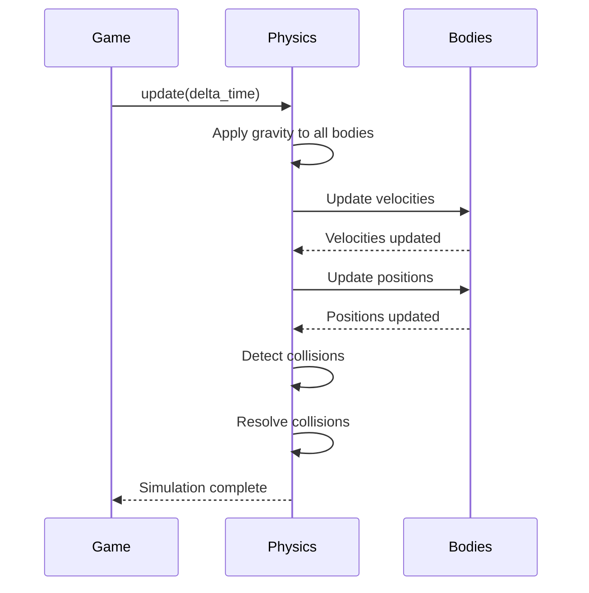
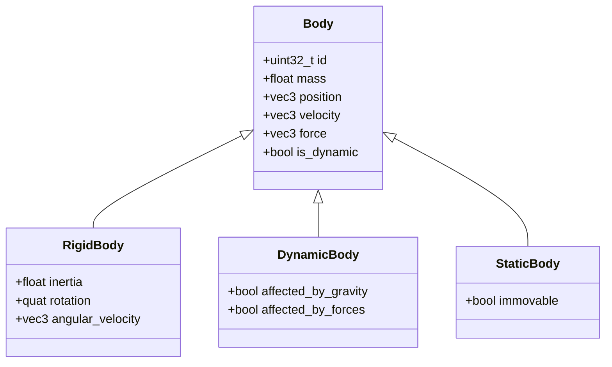
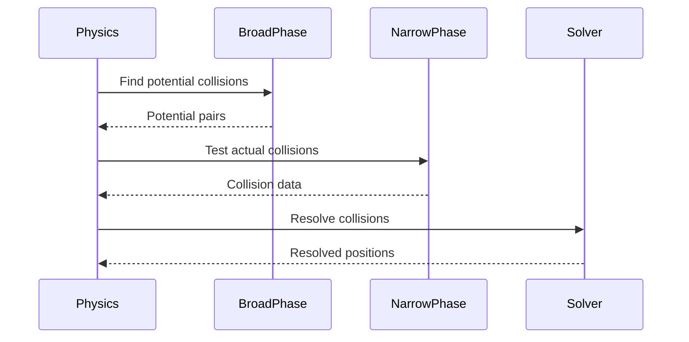
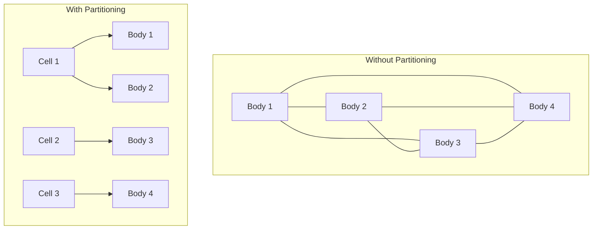

# Physics System

The physics system handles rigid body simulation and collision detection. This document explains the physics engine interface, simulation concepts, and how to use the physics subsystem.

## Overview

The OmniCPP Engine provides a physics simulation subsystem for:

- **Rigid body dynamics**: Simulate solid objects with mass and inertia
- **Force application**: Apply forces and impulses to bodies
- **Gravity simulation**: Configure and apply gravity
- **Collision detection**: Detect and resolve collisions

## IPhysicsEngine Interface

The [`IPhysicsEngine`](include/engine/IPhysicsEngine.hpp:19) interface defines the contract for all physics engine implementations:

```cpp
namespace omnicpp {

class IPhysicsEngine {
public:
    virtual ~IPhysicsEngine() = default;

    virtual bool initialize() = 0;
    virtual void shutdown() = 0;
    virtual void update(float delta_time) = 0;
    virtual uint32_t create_rigid_body(float mass, const float* position) = 0;
    virtual uint32_t create_dynamic_body(float mass, const float* position) = 0;
    virtual void destroy_body(uint32_t body_id) = 0;
    virtual void apply_force(uint32_t body_id, const float* force, float duration) = 0;
    virtual void set_gravity(const float* gravity) = 0;
    virtual void get_gravity(float* out_gravity) const = 0;
};

} // namespace omnicpp
```

### Methods

| Method | Return Type | Description |
|--------|-------------|-------------|
| [`initialize()`](include/engine/IPhysicsEngine.hpp:28) | `bool` | Initialize physics engine. Returns `true` on success. |
| [`shutdown()`](include/engine/IPhysicsEngine.hpp:33) | `void` | Shutdown physics engine and release resources. |
| [`update()`](include/engine/IPhysicsEngine.hpp:40) | `void` | Update physics simulation. |
| [`create_rigid_body()`](include/engine/IPhysicsEngine.hpp:49) | `uint32_t` | Create a rigid body. Returns body ID (0 on failure). |
| [`create_dynamic_body()`](include/engine/IPhysicsEngine.hpp:58) | `uint32_t` | Create a dynamic body. Returns body ID (0 on failure). |
| [`destroy_body()`](include/engine/IPhysicsEngine.hpp:65) | `void` | Destroy a body by ID. |
| [`apply_force()`](include/engine/IPhysicsEngine.hpp:74) | `void` | Apply force to a body. |
| [`set_gravity()`](include/engine/IPhysicsEngine.hpp:81) | `void` | Set gravity vector. |
| [`get_gravity()`](include/engine/IPhysicsEngine.hpp:88) | `void` | Get current gravity vector. |

## PhysicsEngine Implementation

The [`PhysicsEngine`](include/engine/physics/PhysicsEngine.hpp) class provides a concrete physics implementation:

```cpp
namespace omnicpp {
namespace physics {

class PhysicsEngine {
public:
    PhysicsEngine();
    ~PhysicsEngine();

    bool initialize();
    void shutdown();
    void update(float delta_time);
    uint32_t create_rigid_body(float mass, const float* position);
    uint32_t create_dynamic_body(float mass, const float* position);
    void destroy_body(uint32_t body_id);
    void apply_force(uint32_t body_id, const float* force, float duration);
    void set_gravity(const float* gravity);
    void get_gravity(float* out_gravity) const;

private:
    struct Body {
        uint32_t id;
        float mass;
        glm::vec3 position;
        glm::vec3 velocity;
        glm::vec3 force;
        bool is_dynamic;
    };

private:
    std::unordered_map<uint32_t, Body> m_bodies;
    glm::vec3 m_gravity{0.0f, -9.81f, 0.0f};
    uint32_t m_next_body_id = 1;
};

} // namespace physics
} // namespace omnicpp
```

## Physics Simulation

### Simulation Loop

The physics engine updates in discrete time steps:



### Time Integration

The engine uses semi-implicit Euler integration:

```cpp
// From src/engine/physics/physics_engine.cpp
void update(float delta_time) {
    for (auto& [id, body] : m_bodies) {
        if (!body.is_dynamic) continue;

        // Apply gravity
        body.velocity += m_gravity * delta_time;

        // Apply accumulated force
        body.velocity += (body.force / body.mass) * delta_time;

        // Update position
        body.position += body.velocity * delta_time;

        // Reset force
        body.force = glm::vec3{0.0f};
    }
}
```

### Integration Methods

| Method | Description | Stability | Performance |
|---------|-------------|-------------|
| **Euler** | Simple, fast | Low | High |
| **Semi-Implicit Euler** | Better stability | Medium | High |
| **Verlet** | Good stability | High | Medium |
| **Runge-Kutta** | Excellent stability | Very High | Low |

## Rigid Bodies

### Body Types



### Creating Bodies

```cpp
#include "engine/Engine.hpp"
#include "engine/IPhysicsEngine.hpp"

void create_player_body(omnicpp::IEngine* engine) {
    auto* physics = engine->get_physics_engine();

    // Create dynamic body for player
    float position[3] = {0.0f, 1.0f, 0.0f};
    uint32_t body_id = physics->create_dynamic_body(75.0f, position);

    if (body_id == 0) {
        spdlog::error("Failed to create player body");
        return;
    }

    // Store body ID for later use
    player_body_id = body_id;
}
```

### Destroying Bodies

```cpp
void destroy_player_body(omnicpp::IEngine* engine) {
    auto* physics = engine->get_physics_engine();

    // Destroy body by ID
    physics->destroy_body(player_body_id);

    // Clear stored ID
    player_body_id = 0;
}
```

## Forces

### Force Application

Forces can be applied to bodies in several ways:

```cpp
// Apply instantaneous force
float force[3] = {100.0f, 0.0f, 0.0f};
physics->apply_force(body_id, force, 0.0f);

// Apply force over duration
float force[3] = {100.0f, 0.0f, 0.0f};
physics->apply_force(body_id, force, 0.5f); // Apply for 0.5 seconds
```

### Force Types

| Type | Description | Use Case |
|-------|-------------|----------|
| **Instantaneous** | Applied immediately | Explosions, impacts |
| **Continuous** | Applied over time | Thrusters, gravity |
| **Impulse** | Instantaneous change in velocity | Jumps, collisions |

### Force Accumulation

Forces are accumulated each frame:

```cpp
// Apply multiple forces
physics->apply_force(body_id, force1, 0.0f);
physics->apply_force(body_id, force2, 0.0f);
physics->apply_force(body_id, force3, 0.0f);

// All forces are applied together in update()
physics->update(delta_time);
```

## Gravity

### Setting Gravity

Gravity is a global force applied to all dynamic bodies:

```cpp
#include "engine/IPhysicsEngine.hpp"

void set_zero_gravity(omnicpp::IEngine* engine) {
    auto* physics = engine->get_physics_engine();

    // Set zero gravity (space setting)
    float gravity[3] = {0.0f, 0.0f, 0.0f};
    physics->set_gravity(gravity);
}

void set_moon_gravity(omnicpp::IEngine* engine) {
    auto* physics = engine->get_physics_engine();

    // Set moon gravity (1/6 of Earth)
    float gravity[3] = {0.0f, -1.62f, 0.0f};
    physics->set_gravity(gravity);
}
```

### Getting Gravity

```cpp
void log_gravity(omnicpp::IEngine* engine) {
    auto* physics = engine->get_physics_engine();

    // Get current gravity
    float gravity[3];
    physics->get_gravity(gravity);

    spdlog::info("Gravity: ({}, {}, {})", gravity[0], gravity[1], gravity[2]);
}
```

## Collision Detection

### Collision Pipeline



### Broad Phase

The broad phase quickly eliminates non-colliding pairs:

```cpp
// Spatial partitioning for broad phase
class SpatialHash {
    std::unordered_map<uint64_t, std::vector<Body*>> m_cells;

    void insert(Body* body);
    std::vector<Body*> query(const Body* body);
};
```

### Narrow Phase

The narrow phase performs precise collision tests:

```cpp
// AABB collision test
bool test_aabb_collision(const Body& a, const Body& b) {
    return (a.min.x <= b.max.x && a.max.x >= b.min.x) &&
           (a.min.y <= b.max.y && a.max.y >= b.min.y) &&
           (a.min.z <= b.max.z && a.max.z >= b.min.z);
}
```

### Collision Resolution

Collisions are resolved by applying impulses:

```cpp
// Resolve collision between two bodies
void resolve_collision(Body& a, Body& b, const Collision& collision) {
    // Calculate relative velocity
    glm::vec3 relative_velocity = a.velocity - b.velocity;

    // Calculate impulse magnitude
    float impulse_magnitude = calculate_impulse(a, b, collision);

    // Apply impulse
    glm::vec3 impulse = collision.normal * impulse_magnitude;
    a.velocity += impulse / a.mass;
    b.velocity -= impulse / b.mass;
}
```

## Code Examples

### Basic Physics Setup

```cpp
#include "engine/Engine.hpp"
#include "engine/IPhysicsEngine.hpp"

int main() {
    // Create physics engine
    auto physics = std::make_unique<omnicpp::physics::PhysicsEngine>();

    // Configure engine
    omnicpp::EngineConfig config{};
    config.physics_engine = physics.get();

    // Create engine
    omnicpp::IEngine* engine = omnicpp::create_engine(config);
    if (!engine) {
        return -1;
    }

    // Create bodies
    float position1[3] = {0.0f, 10.0f, 0.0f};
    uint32_t body1 = physics->create_dynamic_body(10.0f, position1);

    float position2[3] = {0.0f, 0.0f, 0.0f};
    uint32_t body2 = physics->create_rigid_body(1000.0f, position2);

    // Game loop
    while (running) {
        float delta_time = calculate_delta_time();

        // Update physics
        engine->update(delta_time);

        // Render
        engine->render();
    }

    // Cleanup
    omnicpp::destroy_engine(engine);
    return 0;
}
```

### Applying Forces

```cpp
void apply_jump_force(omnicpp::IEngine* engine, uint32_t body_id) {
    auto* physics = engine->get_physics_engine();

    // Apply upward force for jump
    float force[3] = {0.0f, 500.0f, 0.0f};
    physics->apply_force(body_id, force, 0.1f); // Apply for 0.1 seconds
}

void apply_explosion_force(omnicpp::IEngine* engine, uint32_t body_id) {
    auto* physics = engine->get_physics_engine();

    // Apply explosive force
    float force[3] = {1000.0f, 500.0f, 0.0f};
    physics->apply_force(body_id, force, 0.0f); // Instantaneous
}
```

### Custom Gravity

```cpp
void setup_level_gravity(omnicpp::IEngine* engine, const std::string& level_name) {
    auto* physics = engine->get_physics_engine();

    float gravity[3];

    if (level_name == "space") {
        gravity[0] = 0.0f;
        gravity[1] = 0.0f;
        gravity[2] = 0.0f;
    } else if (level_name == "moon") {
        gravity[0] = 0.0f;
        gravity[1] = -1.62f;
        gravity[2] = 0.0f;
    } else {
        // Default Earth gravity
        gravity[0] = 0.0f;
        gravity[1] = -9.81f;
        gravity[2] = 0.0f;
    }

    physics->set_gravity(gravity);
}
```

## Performance Optimization

### Spatial Partitioning

Spatial partitioning reduces collision checks:



### Sleeping Bodies

Inactive bodies can be "put to sleep" to save CPU:

```cpp
struct Body {
    bool is_sleeping;
    float sleep_timer;

    void update(float delta_time) {
        if (is_sleeping) {
            sleep_timer += delta_time;
            if (sleep_timer > 1.0f) {
                // Wake up body
                is_sleeping = false;
                sleep_timer = 0.0f;
            }
            return;
        }

        // Update physics...
    }
};
```

## Troubleshooting

### Physics Initialization Fails

**Symptom**: [`initialize()`](include/engine/IPhysicsEngine.hpp:28) returns `false`

**Possible causes**:
- Invalid configuration
- Insufficient memory
- Missing dependencies

**Solution**: Check configuration and ensure all dependencies are installed.

### Body Creation Fails

**Symptom**: [`create_rigid_body()`](include/engine/IPhysicsEngine.hpp:49) returns 0

**Possible causes**:
- Invalid mass value
- Invalid position
- Maximum body count reached

**Solution**: Validate input parameters and check body count.

### Forces Not Applied

**Symptom**: Bodies don't move when force is applied

**Possible causes**:
- Body is static (not dynamic)
- Force is too small
- Gravity counteracting force

**Solution**: Ensure body is dynamic and force is sufficient.

### Bodies Fall Through Floor

**Symptom**: Bodies pass through static geometry

**Possible causes**:
- Time step too large
- Collision detection disabled
- Incorrect collision shapes

**Solution**: Reduce time step and enable collision detection.

## Related Documentation

- [Engine Overview](index.md) - High-level engine architecture
- [Subsystems Guide](subsystems.md) - Subsystem interaction
- [ECS Architecture](ecs.md) - Entity Component System details
- [Scene Management](scene-management.md) - Entity and scene management

## References

- [Game Physics](https://gamedevelopment.tutsplus.com/tutorials/physics/)
- [Collision Detection](https://www.youtube.com/playlist?list=PLW3Zl3TIAbgu6BI6rQj5b7pZ)
- [Physics Engines](https://en.wikipedia.org/wiki/Physics_engine)
