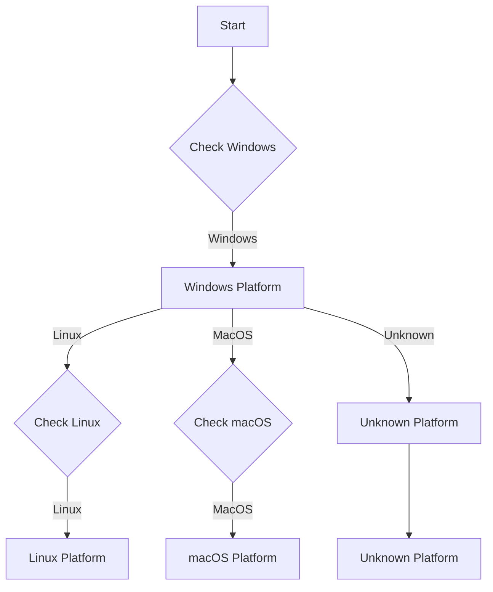
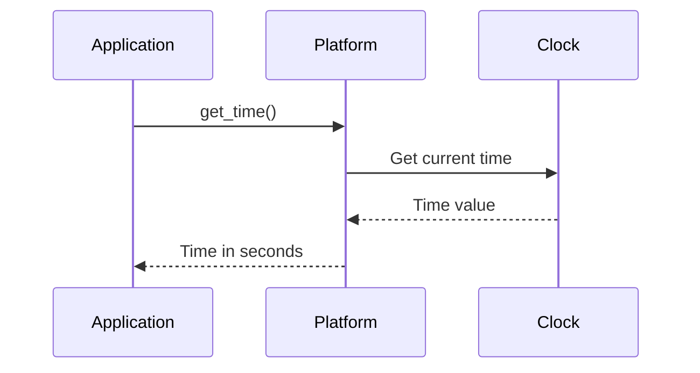

# Platform Abstraction

The platform subsystem provides cross-platform abstraction for window management, time, and file system operations. This document explains the platform interface, platform concepts, and how to use the platform subsystem.

## Overview

The OmniCPP Engine provides a platform subsystem for:

- **Window management**: Create and manage application windows
- **Time management**: High-precision timing for game loops
- **File system operations**: Cross-platform file access
- **Platform detection**: Identify current platform at runtime

## IPlatform Interface

The [`IPlatform`](include/engine/IPlatform.hpp:41) interface defines the contract for all platform implementations:

```cpp
namespace omnicpp {

enum class PlatformType : uint32_t {
    WINDOWS = 0,
    LINUX = 1,
    MACOS = 2,
    UNKNOWN = 0xFFFFFFFF
};

struct WindowConfig {
    int width;
    int height;
    const char* title;
    bool fullscreen;
    bool resizable;
    bool vsync;
};

class IPlatform {
public:
    virtual ~IPlatform() = default;

    virtual bool initialize() = 0;
    virtual void shutdown() = 0;
    virtual void* create_window(const WindowConfig& config) = 0;
    virtual void destroy_window(void* window) = 0;
    virtual void update_window(void* window) = 0;
    virtual PlatformType get_platform_type() const = 0;
    virtual double get_time() const = 0;
    virtual void sleep(double seconds) = 0;
    virtual const char* get_executable_path() const = 0;
    virtual const char* get_working_directory() const = 0;
    virtual bool set_working_directory(const char* path) = 0;
};

} // namespace omnicpp
```

### Methods

| Method | Return Type | Description |
|--------|-------------|-------------|
| [`initialize()`](include/engine/IPlatform.hpp:50) | `bool` | Initialize platform. Returns `true` on success. |
| [`shutdown()`](include/engine/IPlatform.hpp:55) | `void` | Shutdown platform and release resources. |
| [`create_window()`](include/engine/IPlatform.hpp:63) | `void*` | Create a window. Returns window handle or `nullptr` on failure. |
| [`destroy_window()`](include/engine/IPlatform.hpp:70) | `void` | Destroy a window. |
| [`update_window()`](include/engine/IPlatform.hpp:77) | `void` | Update window (process events). |
| [`get_platform_type()`](include/engine/IPlatform.hpp:84) | `PlatformType` | Get current platform type. |
| [`get_time()`](include/engine/IPlatform.hpp:91) | `double` | Get time since initialization in seconds. |
| [`sleep()`](include/engine/IPlatform.hpp:98) | `void` | Sleep for specified duration. |
| [`get_executable_path()`](include/engine/IPlatform.hpp:105) | `const char*` | Get path to executable. |
| [`get_working_directory()`](include/engine/IPlatform.hpp:112) | `const char*` | Get current working directory. |
| [`set_working_directory()`](include/engine/IPlatform.hpp:120) | `bool` | Set working directory. Returns `true` on success. |

## Platform Implementation

The [`Platform`](include/engine/platform/platform.hpp) class provides a concrete platform implementation:

```cpp
namespace omnicpp {
namespace platform {

class Platform {
public:
    Platform();
    ~Platform();

    bool initialize();
    void shutdown();
    void* create_window(const WindowConfig& config);
    void destroy_window(void* window);
    void update_window(void* window);
    PlatformType get_platform_type() const;
    double get_time() const;
    void sleep(double seconds);
    const char* get_executable_path() const;
    const char* get_working_directory() const;
    bool set_working_directory(const char* path);

private:
    void* m_window = nullptr;
    PlatformType m_platform_type = PlatformType::UNKNOWN;
    double m_start_time = 0.0;

#ifdef _WIN32
    HWND m_hwnd = nullptr;
    HDC m_hdc = nullptr;
#elif defined(__linux__)
    Display* m_display = nullptr;
    Window m_x11_window = nullptr;
#elif defined(__APPLE__)
    void* m_ns_window = nullptr;
#endif
};

} // namespace omnicpp
} // namespace omnicpp
```

### Platform Methods

| Method | Return Type | Description |
|--------|-------------|-------------|
| [`initialize()`](include/engine/platform/platform.hpp) | `bool` | Initialize platform. |
| [`shutdown()`](include/engine/platform/platform.hpp) | `void` | Shutdown platform. |
| [`create_window()`](include/engine/platform/platform.hpp) | `void*` | Create a window. |
| [`destroy_window()`](include/engine/platform/platform.hpp) | `void` | Destroy a window. |
| [`update_window()`](include/engine/platform/platform.hpp) | `void` | Update window. |
| [`get_platform_type()`](include/engine/platform/platform.hpp) | `PlatformType` | Get platform type. |
| [`get_time()`](include/engine/platform/platform.hpp) | `double` | Get time. |
| [`sleep()`](include/engine/platform/platform.hpp) | `void` | Sleep for duration. |
| [`get_executable_path()`](include/engine/platform/platform.hpp) | `const char*` | Get executable path. |
| [`get_working_directory()`](include/engine/platform/platform.hpp) | `const char*` | Get working directory. |
| [`set_working_directory()`](include/engine/platform/platform.hpp) | `bool` | Set working directory. |

## Platform Types

### Platform Detection



### PlatformType Enum

| Value | Platform | Description |
|-------|----------|-------------|
| **0** | Windows | Microsoft Windows OS |
| **1** | Linux | Linux distributions |
| **2** | macOS | Apple macOS |
| **0xFFFFFFFF** | Unknown | Unrecognized platform |

## Window Management

### Window Configuration

```cpp
// From include/engine/IPlatform.hpp:29
struct WindowConfig {
    int width;           // Window width in pixels
    int height;          // Window height in pixels
    const char* title;    // Window title
    bool fullscreen;     // Fullscreen mode
    bool resizable;      // Window is resizable
    bool vsync;          // Vertical sync
};
```

### Creating a Window

```cpp
#include "engine/IPlatform.hpp"

void create_game_window(omnicpp::IPlatform* platform) {
    // Configure window
    omnicpp::WindowConfig config{};
    config.width = 1920;
    config.height = 1080;
    config.title = "My Game";
    config.fullscreen = false;
    config.resizable = true;
    config.vsync = true;

    // Create window
    void* window = platform->create_window(config);
    if (!window) {
        spdlog::error("Failed to create window");
        return;
    }

    spdlog::info("Window created: {}x{}", config.width, config.height);
}
```

### Updating a Window

```cpp
void game_loop(omnicpp::IPlatform* platform, void* window) {
    while (running) {
        // Update window (process events)
        platform->update_window(window);

        // Get input events
        process_input();

        // Render frame
        render_frame();

        // Sleep to limit FPS
        platform->sleep(1.0 / 60.0); // 60 FPS
    }
}
```

## Time Management

### High-Precision Timing

```cpp
// From include/engine/platform/platform.hpp
virtual double get_time() const = 0;
```

### Time Calculation



### Delta Time

```cpp
void game_loop(omnicpp::IPlatform* platform) {
    double last_time = platform->get_time();

    while (running) {
        double current_time = platform->get_time();
        float delta_time = static_cast<float>(current_time - last_time);
        last_time = current_time;

        // Update game logic with delta time
        update_game(delta_time);
    }
}
```

## File System Operations

### Executable Path

```cpp
void log_executable_location(omnicpp::IPlatform* platform) {
    const char* path = platform->get_executable_path();
    spdlog::info("Executable path: {}", path);
}
```

### Working Directory

```cpp
void setup_data_directory(omnicpp::IPlatform* platform) {
    // Get current working directory
    const char* cwd = platform->get_working_directory();
    spdlog::info("Working directory: {}", cwd);

    // Set new working directory
    if (!platform->set_working_directory("data")) {
        spdlog::error("Failed to set working directory");
        return;
    }

    // Now relative paths will be resolved from "data/"
}
```

### Path Operations

```cpp
std::string resolve_path(omnicpp::IPlatform* platform, const std::string& relative_path) {
    const char* cwd = platform->get_working_directory();

    // Combine working directory with relative path
    std::string full_path = std::string(cwd) + "/" + relative_path;

    // Normalize path separators
    std::replace(full_path.begin(), full_path.end(), '\\', '/');

    return full_path;
}
```

## Platform-Specific Implementation

### Windows Platform

On Windows, the platform uses Win32 API:

```cpp
#ifdef _WIN32
    // Win32 window handle
    HWND m_hwnd;
    HDC m_hdc;

    // Create window using Win32
    void* create_window(const WindowConfig& config) {
        // Register window class
        WNDCLASSEXW wc = {};
        wc.lpfnWndProc = window_proc;
        wc.hInstance = GetModuleHandle(nullptr);
        wc.lpszClassName = "OmniCppWindow";
        wc.hbrBackground = (HBRUSH)(COLOR_WINDOW + 1);
        wc.hCursor = LoadCursor(nullptr, IDC_ARROW);

        RegisterClassEx(nullptr, "OmniCppWindow", wc);

        // Create window
        m_hwnd = CreateWindowEx(
            "OmniCppWindow",
            config.title,
            WS_OVERLAPPEDWINDOW,
            CW_USEDEFAULTSTYLE,
            config.x, config.y, config.width, config.height,
            nullptr, nullptr, GetModuleHandle(nullptr),
            nullptr
        );

        return m_hwnd;
    }
#endif
```

### Linux Platform

On Linux, the platform uses X11:

```cpp
#if defined(__linux__)
    // X11 display and window
    Display* m_display;
    Window m_x11_window;

    // Create window using X11
    void* create_window(const WindowConfig& config) {
        // Open display
        m_display = XOpenDisplay(nullptr);

        // Create window
        XSetWindowAttributes swa = {};
        swa.background_pixel = WhitePixel(m_display);
        swa.border_pixel = BlackPixel(m_display);
        swa.event_mask = ExposureMask | KeyPressMask | ButtonPressMask;

        m_x11_window = XCreateWindow(
            m_display,
            DefaultRootWindow(m_display),
            config.title,
            config.x, config.y, config.width, config.height,
            0, 0, swa.border_pixel, swa.event_mask,
            CWColormap
        );

        return m_x11_window;
    }
#endif
```

### macOS Platform

On macOS, the platform uses Cocoa:

```cpp
#if defined(__APPLE__)
    // Cocoa window
    void* m_ns_window;

    // Create window using Cocoa
    void* create_window(const WindowConfig& config) {
        // Create NSWindow
        NSRect frame = NSMakeRect(
            0, 0,
            config.width,
            config.height
        );

        NSWindow* window = [[NSWindow alloc]
            initWithContentRect:frame
            styleMask:NSBorderlessWindowMask
            backing:NSBackingStoreBuffered
            defer:NO
        ];

        [window setTitle:[NSString stringWithUTF8String:config.title]];
        [window center];

        return (__bridge void*)window;
    }
#endif
```

## Code Examples

### Basic Platform Setup

```cpp
#include "engine/Engine.hpp"
#include "engine/IPlatform.hpp"

int main() {
    // Create platform
    auto platform = std::make_unique<omnicpp::platform::Platform>();

    // Configure engine
    omnicpp::EngineConfig config{};
    config.platform = platform.get();

    // Create engine
    omnicpp::IEngine* engine = omnicpp::create_engine(config);
    if (!engine) {
        return -1;
    }

    // Create window
    omnicpp::WindowConfig window_config{};
    window_config.width = 1280;
    window_config.height = 720;
    window_config.title = "OmniCpp Game";
    window_config.fullscreen = false;
    window_config.resizable = true;
    window_config.vsync = true;

    void* window = platform->create_window(window_config);
    if (!window) {
        spdlog::error("Failed to create window");
        return -1;
    }

    // Game loop
    while (running) {
        // Update window (process events)
        platform->update_window(window);

        // Calculate delta time
        double current_time = platform->get_time();
        float delta_time = static_cast<float>(current_time - last_time);
        last_time = current_time;

        // Update game logic
        engine->update(delta_time);

        // Render
        engine->render();
    }

    // Cleanup
    platform->destroy_window(window);
    omnicpp::destroy_engine(engine);
    return 0;
}
```

### Platform Detection

```cpp
void log_platform_info(omnicpp::IPlatform* platform) {
    omnicpp::PlatformType type = platform->get_platform_type();

    switch (type) {
        case omnicpp::PlatformType::WINDOWS:
            spdlog::info("Platform: Windows");
            break;
        case omnicpp::PlatformType::LINUX:
            spdlog::info("Platform: Linux");
            break;
        case omnicpp::PlatformType::MACOS:
            spdlog::info("Platform: macOS");
            break;
        default:
            spdlog::warn("Platform: Unknown");
            break;
    }
}
```

### File Path Resolution

```cpp
std::string get_asset_path(omnicpp::IPlatform* platform, const std::string& asset_name) {
    // Get executable directory
    const char* exe_path = platform->get_executable_path();
    std::string exe_dir(exe_path);

    // Remove executable name
    size_t last_slash = exe_dir.find_last_of("\\/");
    if (last_slash != std::string::npos) {
        exe_dir = exe_dir.substr(0, last_slash + 1);
    }

    // Combine with assets directory
    return exe_dir + "/assets/" + asset_name;
}
```

### Time-Based Game Loop

```cpp
void fixed_timestep_loop(omnicpp::IPlatform* platform) {
    const float TARGET_FPS = 60.0f;
    const float FRAME_TIME = 1.0f / TARGET_FPS;

    while (running) {
        auto start_time = std::chrono::high_resolution_clock::now();

        // Update game logic
        update_game();

        // Render
        render_frame();

        // Calculate elapsed time
        auto end_time = std::chrono::high_resolution_clock::now();
        auto elapsed = std::chrono::duration<float, std::milli>(
            end_time - start_time
        ).count();

        // Sleep remaining time
        if (elapsed.count() < FRAME_TIME) {
            platform->sleep(FRAME_TIME - elapsed.count());
        }
    }
}
```

## Performance Optimization

### Event Batching

Window events can be batched for efficiency:

```cpp
class EventBatcher {
public:
    void add_event(const WindowEvent& event) {
        m_batch.push_back(event);

        if (m_batch.size() >= MAX_BATCH_SIZE) {
            flush_batch();
        }
    }

    void flush_batch() {
        // Process all events
        for (const auto& event : m_batch) {
            process_event(event);
        }

        m_batch.clear();
    }

private:
    std::vector<WindowEvent> m_batch;
    static constexpr size_t MAX_BATCH_SIZE = 64;
};
```

### Double Buffering

Reduce flicker by using double buffering:

```cpp
class DoubleBufferedRenderer {
public:
    void render() {
        // Render to back buffer
        render_to_buffer(m_back_buffer);

        // Swap buffers
        swap_buffers();

        // Render to front buffer
        render_to_buffer(m_front_buffer);
    }

private:
    void swap_buffers() {
        // Swap back and front buffers
        std::swap(m_back_buffer, m_front_buffer);
    }
};
```

## Troubleshooting

### Window Creation Fails

**Symptom**: [`create_window()`](include/engine/IPlatform.hpp:63) returns `nullptr`

**Possible causes**:
- Invalid window configuration
- Insufficient video memory
- Graphics driver issues
- Platform not initialized

**Solution**: Check window configuration, verify graphics drivers, and ensure platform is initialized.

### Window Not Updating

**Symptom**: Window events not being processed

**Possible causes**:
- [`update_window()`](include/engine/IPlatform.hpp:77) not called
- Window handle is invalid
- Event loop not running

**Solution**: Ensure [`update_window()`](include/engine/IPlatform.hpp:77) is called in the game loop.

### Time Inaccurate

**Symptom**: Delta time is inconsistent or incorrect

**Possible causes**:
- [`get_time()`](include/engine/IPlatform.hpp:91) not monotonic
- Time source has low resolution
- System time adjustments

**Solution**: Use high-resolution timer and verify time source.

### File Path Issues

**Symptom**: File paths not resolving correctly

**Possible causes**:
- Working directory not set correctly
- Path separator mismatch
- Relative vs absolute path confusion

**Solution**: Use [`get_working_directory()`](include/engine/IPlatform.hpp:112) and normalize path separators.

## Related Documentation

- [Engine Overview](index.md) - High-level engine architecture
- [Subsystems Guide](subsystems.md) - Subsystem interaction
- [Window Management](window_manager.md) - Window and event handling

## References

- [Win32 API](https://docs.microsoft.com/en-us/windows/win32/)
- [X11 Protocol](https://www.x.org/releases/current/doc/xproto/x11proto.html)
- [Cocoa Framework](https://developer.apple.com/documentation/appkit/cocoa)
- [Cross-Platform Development](https://www.youtube.com/playlist?list=PLW3Zl3TIAbgu6BI6rQj5b7pZ)
