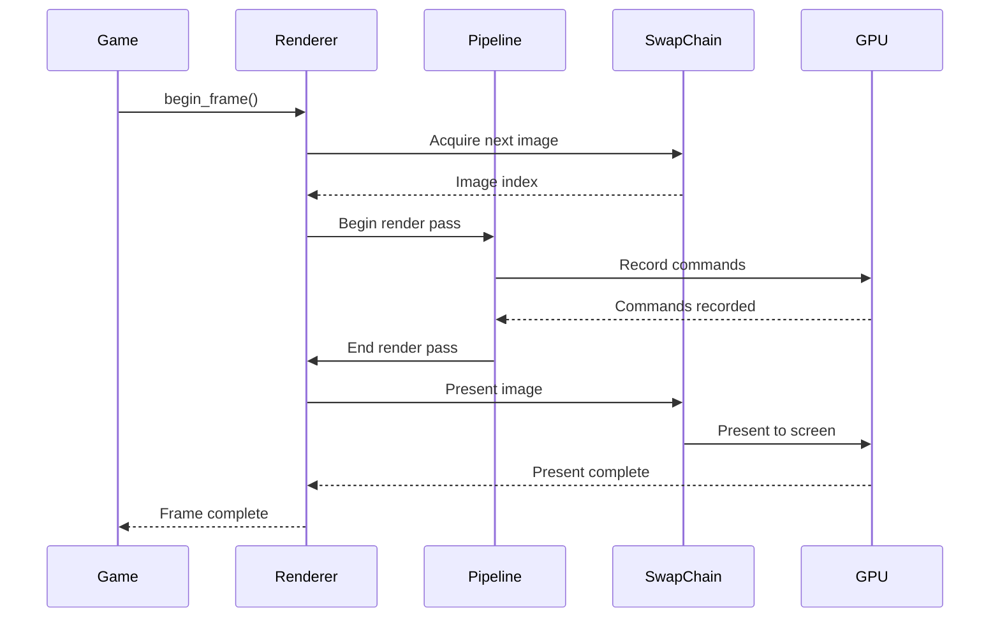
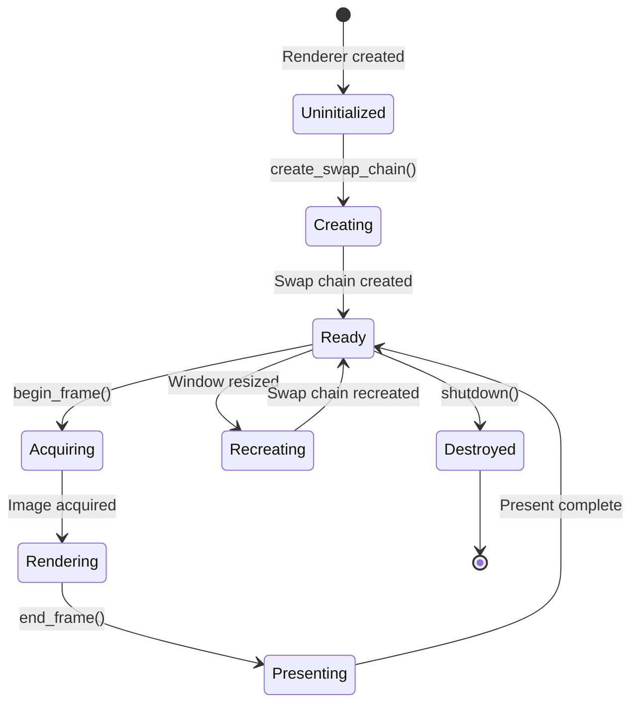
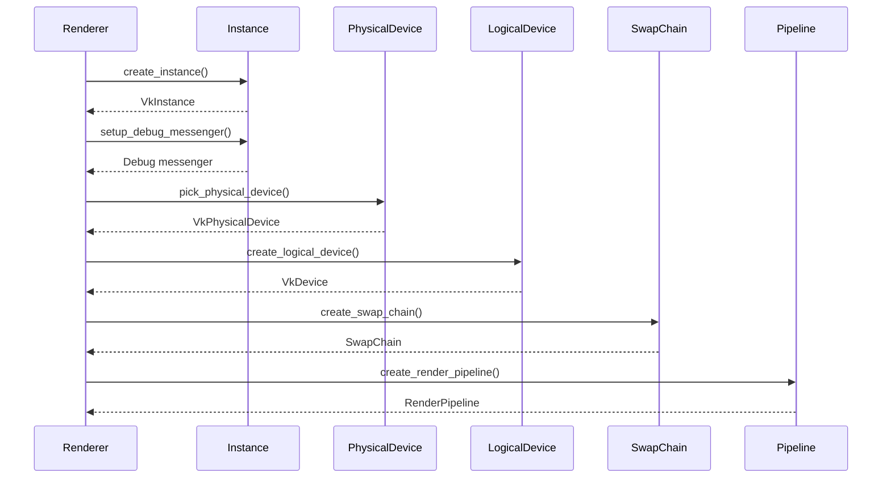
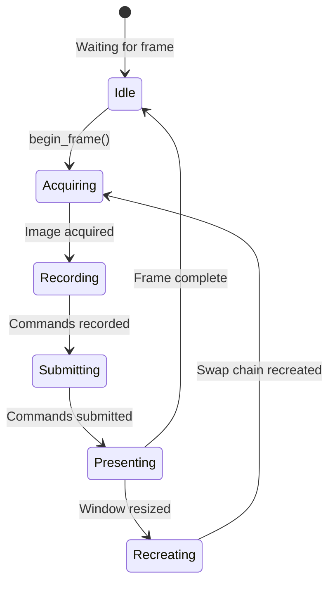

# Rendering System

The rendering system handles all graphics operations using the Vulkan API. This document explains the rendering pipeline, graphics concepts, and how to use the renderer subsystem.

## Overview

The OmniCPP Engine uses **Vulkan** as its primary graphics API. Vulkan provides:

- **Low-level control**: Direct access to GPU resources
- **Explicit synchronization**: Fine-grained control over GPU operations
- **Multi-threading**: Better support for parallel rendering
- **Cross-platform**: Support for Windows, Linux, and WASM

## IRenderer Interface

The [`IRenderer`](include/engine/IRenderer.hpp:19) interface defines the contract for all renderer implementations:

```cpp
namespace omnicpp {

class IRenderer {
public:
    virtual ~IRenderer() = default;

    virtual bool initialize() = 0;
    virtual void shutdown() = 0;
    virtual bool begin_frame() = 0;
    virtual void end_frame() = 0;
    virtual uint32_t get_frame_number() const = 0;
};

} // namespace omnicpp
```

### Methods

| Method | Return Type | Description |
|--------|-------------|-------------|
| [`initialize()`](include/engine/IRenderer.hpp:28) | `bool` | Initialize the renderer. Returns `true` on success. |
| [`shutdown()`](include/engine/IRenderer.hpp:33) | `void` | Shutdown the renderer and release resources. |
| [`begin_frame()`](include/engine/IRenderer.hpp:40) | `bool` | Begin a new frame. Returns `true` on success. |
| [`end_frame()`](include/engine/IRenderer.hpp:45) | `void` | End the current frame and present to screen. |
| [`get_frame_number()`](include/engine/IRenderer.hpp:52) | `uint32_t` | Get the current frame number. |

## VulkanRenderer Implementation

The [`VulkanRenderer`](include/engine/render/VulkanRenderer.hpp:26) class provides a Vulkan-based renderer implementation:

```cpp
namespace omnicpp {
namespace render {

class VulkanRenderer : public IRenderer {
public:
    VulkanRenderer();
    ~VulkanRenderer() override;

    bool initialize() override;
    void shutdown() override;
    bool begin_frame() override;
    void end_frame() override;
    uint32_t get_frame_number() const override;

    // Vulkan-specific accessors
    VkInstance get_instance() const;
    VkPhysicalDevice get_physical_device() const;
    VkDevice get_device() const;
    VkQueue get_graphics_queue() const;
    VkQueue get_present_queue() const;
    VkCommandPool get_command_pool() const;
    RenderPipeline* get_render_pipeline() const;
    ShaderManager* get_shader_manager() const;
    SwapChain* get_swap_chain() const;
    bool is_initialized() const;

private:
    bool create_instance();
    bool setup_debug_messenger();
    bool pick_physical_device();
    bool create_logical_device();
    bool create_swap_chain();
    bool create_command_pool();
    bool create_render_pipeline();
    bool create_shader_manager();

private:
    VkInstance m_instance = VK_NULL_HANDLE;
    VkDebugUtilsMessengerEXT m_debug_messenger = VK_NULL_HANDLE;
    VkPhysicalDevice m_physical_device = VK_NULL_HANDLE;
    VkDevice m_device = VK_NULL_HANDLE;
    VkQueue m_graphics_queue = VK_NULL_HANDLE;
    VkQueue m_present_queue = VK_NULL_HANDLE;
    VkCommandPool m_command_pool = VK_NULL_HANDLE;

    std::unique_ptr<RenderPipeline> m_render_pipeline;
    std::unique_ptr<ShaderManager> m_shader_manager;
    std::unique_ptr<SwapChain> m_swap_chain;

    bool m_initialized = false;
    bool m_enable_validation_layers = true;
};

} // namespace render
} // namespace omnicpp
```

## Rendering Pipeline

The rendering pipeline follows this sequence:



### Pipeline Stages

1. **Frame Acquisition**: Acquire next image from swap chain
2. **Command Recording**: Record rendering commands
3. **Submission**: Submit commands to GPU
4. **Presentation**: Present rendered image to screen

## RenderPipeline

The [`RenderPipeline`](include/engine/render/RenderPipeline.hpp:24) class manages the graphics pipeline state:

```cpp
namespace omnicpp {
namespace render {

class RenderPipeline {
public:
    RenderPipeline(VkDevice device,
                 VkExtent2D swap_chain_extent,
                 ShaderManager* shader_manager);
    ~RenderPipeline();

    VkPipelineLayout get_pipeline_layout() const;
    VkPipeline get_pipeline() const;
    VkRenderPass get_render_pass() const;
    void recreate(VkExtent2D new_extent);

private:
    bool create_render_pass();
    bool create_pipeline_layout();
    bool create_graphics_pipeline();
    void cleanup();

private:
    VkDevice m_device = VK_NULL_HANDLE;
    VkExtent2D m_swap_chain_extent;
    ShaderManager* m_shader_manager = nullptr;

    VkPipelineLayout m_pipeline_layout = VK_NULL_HANDLE;
    VkPipeline m_pipeline = VK_NULL_HANDLE;
    VkRenderPass m_render_pass = VK_NULL_HANDLE;
};

} // namespace render
} // namespace omnicpp
```

### Pipeline Components

| Component | Description |
|-----------|-------------|
| **Render Pass** | Describes how render targets are used |
| **Pipeline Layout** | Describes descriptor sets and push constants |
| **Graphics Pipeline** | Describes the complete graphics pipeline state |
| **Shader Stages** | Vertex and fragment shader stages |

## ShaderManager

The [`ShaderManager`](include/engine/render/ShaderManager.hpp:30) class handles shader loading and management:

```cpp
namespace omnicpp {
namespace render {

struct ShaderModule {
    VkShaderModule module = VK_NULL_HANDLE;
    std::string entry_point = "main";
};

class ShaderManager {
public:
    explicit ShaderManager(VkDevice device);
    ~ShaderManager();

    ShaderModule load_shader(const std::string& filename,
                        const std::string& entry_point = "main");
    VkPipelineShaderStageCreateInfo create_shader_stage_info(
        const ShaderModule& module,
        VkShaderStageFlagBits stage);
    VkDevice get_device() const;

private:
    std::vector<char> read_shader_file(const std::string& filename);
    VkShaderModule create_shader_module(const std::vector<char>& code);

private:
    VkDevice m_device = VK_NULL_HANDLE;
    std::unordered_map<std::string, ShaderModule> m_shaders;
};

} // namespace render
} // namespace omnicpp
```

### Shader Loading

Shaders are loaded from SPIR-V bytecode files:

```cpp
// Load vertex shader
auto vertex_shader = shader_manager->load_shader(
    "shaders/vert.spv",
    "main"
);

// Load fragment shader
auto fragment_shader = shader_manager->load_shader(
    "shaders/frag.spv",
    "main"
);

// Create shader stage info
auto vertex_stage = shader_manager->create_shader_stage_info(
    vertex_shader,
    VK_SHADER_STAGE_VERTEX_BIT
);

auto fragment_stage = shader_manager->create_shader_stage_info(
    fragment_shader,
    VK_SHADER_STAGE_FRAGMENT_BIT
);
```

## Swap Chain

The swap chain manages the presentation of rendered images:



### Swap Chain Operations

| Operation | Description |
|-----------|-------------|
| **Acquire** | Get next image from swap chain |
| **Present** | Present rendered image to screen |
| **Recreate** | Recreate swap chain after window resize |

## Vulkan Initialization

The Vulkan renderer initializes in this order:



### Initialization Steps

1. **Create Instance**: Initialize Vulkan library
2. **Setup Debug Messenger**: Enable validation layers
3. **Pick Physical Device**: Select suitable GPU
4. **Create Logical Device**: Create device and queues
5. **Create Swap Chain**: Set up presentation
6. **Create Render Pipeline**: Set up graphics pipeline

## Frame Rendering

### Frame Lifecycle



### Frame Budgeting

The engine tracks frame time to maintain consistent performance:

```cpp
// Calculate delta time
double current_time = platform->get_time();
float delta_time = current_time - last_time;

// Update game logic
engine->update(delta_time);

// Render frame
engine->render();

// Update last time
last_time = current_time;
```

## Graphics Concepts

### Vertex Input

Vertices are the basic building blocks of 3D graphics:

```cpp
struct Vertex {
    glm::vec3 position;  // 3D position
    glm::vec3 normal;    // Surface normal
    glm::vec2 tex_coord; // Texture coordinates
};
```

### Uniform Buffers

Uniform buffers pass data to shaders:

```cpp
struct UniformBufferObject {
    glm::mat4 model;       // Model matrix
    glm::mat4 view;        // View matrix
    glm::mat4 projection;  // Projection matrix
};
```

### Descriptor Sets

Descriptor sets bind resources to shaders:

```cpp
// Create descriptor set layout
VkDescriptorSetLayoutBinding uboLayoutBinding{};
uboLayoutBinding.binding = 0;
uboLayoutBinding.descriptorType = VK_DESCRIPTOR_TYPE_UNIFORM_BUFFER;
uboLayoutBinding.descriptorCount = 1;
uboLayoutBinding.stageFlags = VK_SHADER_STAGE_VERTEX_BIT;
```

## Code Examples

### Basic Rendering Setup

```cpp
#include "engine/Engine.hpp"
#include "engine/render/VulkanRenderer.hpp"

int main() {
    // Create renderer
    auto renderer = std::make_unique<omnicpp::render::VulkanRenderer>();

    // Configure engine
    omnicpp::EngineConfig config{};
    config.renderer = renderer.get();

    // Create engine
    omnicpp::IEngine* engine = omnicpp::create_engine(config);
    if (!engine) {
        return -1;
    }

    // Game loop
    while (running) {
        float delta_time = calculate_delta_time();

        // Update game logic
        engine->update(delta_time);

        // Render frame
        engine->render();
    }

    // Cleanup
    omnicpp::destroy_engine(engine);
    return 0;
}
```

### Loading a Custom Shader

```cpp
#include "engine/render/VulkanRenderer.hpp"
#include "engine/render/ShaderManager.hpp"

void load_custom_shader(omnicpp::render::VulkanRenderer* renderer) {
    auto* shader_manager = renderer->get_shader_manager();

    // Load vertex shader
    auto vertex_shader = shader_manager->load_shader(
        "shaders/vert.spv",
        "main"
    );

    // Load fragment shader
    auto fragment_shader = shader_manager->load_shader(
        "shaders/frag.spv",
        "main"
    );

    // Create shader stage info
    auto vertex_stage = shader_manager->create_shader_stage_info(
        vertex_shader,
        VK_SHADER_STAGE_VERTEX_BIT
    );

    auto fragment_stage = shader_manager->create_shader_stage_info(
        fragment_shader,
        VK_SHADER_STAGE_FRAGMENT_BIT
    );

    // Use stages in pipeline creation...
}
```

### Handling Window Resize

```cpp
#include "engine/render/VulkanRenderer.hpp"

void on_window_resize(omnicpp::render::VulkanRenderer* renderer,
                 int width, int height) {
    auto* pipeline = renderer->get_render_pipeline();

    // Recreate pipeline with new extent
    VkExtent2D new_extent{static_cast<uint32_t>(width),
                           static_cast<uint32_t>(height)};
    pipeline->recreate(new_extent);
}
```

## Vulkan Requirements

### Minimum Requirements

- **Vulkan SDK**: Version 1.3 or higher
- **GPU**: Vulkan-compatible graphics card
- **Validation Layers**: VK_LAYER_KHRONOS_validation (optional but recommended)
- **Extensions**: VK_KHR_swapchain, VK_KHR_surface

### Platform-Specific Requirements

| Platform | Additional Requirements |
|----------|----------------------|
| **Windows** | Vulkan SDK for Windows |
| **Linux** | Vulkan SDK for Linux, X11 or Wayland |
| **WASM** | WebGPU backend (experimental) |

### Build Configuration

Enable Vulkan support in CMake:

```cmake
# From CMakeLists.txt
option(OMNICPP_USE_VULKAN "Use Vulkan graphics API" ON)

if(OMNICPP_USE_VULKAN)
    find_package(Vulkan)

    if(NOT Vulkan_FOUND)
        message(WARNING "Vulkan not found, Vulkan support disabled")
        set(OMNICPP_USE_VULKAN OFF)
    endif()
endif()
```

## Performance Optimization

### Command Buffers

Command buffers are pre-recorded for efficiency:

```cpp
// Record command buffer once
VkCommandBuffer command_buffer = begin_command_buffer();

// Record rendering commands
vkCmdDrawIndexed(command_buffer, /* ... */);

// End command buffer
end_command_buffer(command_buffer);

// Submit command buffer each frame
submit_command_buffer(command_buffer);
```

### Descriptor Pooling

Descriptor sets are allocated from pools:

```cpp
// Create descriptor pool
VkDescriptorPoolSize pool_sizes[] = {
    {VK_DESCRIPTOR_TYPE_UNIFORM_BUFFER, 100},
    {VK_DESCRIPTOR_TYPE_COMBINED_IMAGE_SAMPLER, 100}
};

VkDescriptorPoolCreateInfo pool_info{};
pool_info.maxSets = 100;
pool_info.poolSizeCount = 2;
pool_info.pPoolSizes = pool_sizes;

vkCreateDescriptorPool(device, &pool_info, nullptr, &descriptor_pool);
```

### Memory Allocation

Memory is allocated efficiently:

```cpp
// Find memory type
uint32_t memory_type_index = find_memory_type(
    memory_requirements.memoryTypeBits,
    VK_MEMORY_PROPERTY_DEVICE_LOCAL_BIT
);

// Allocate memory
VkMemoryAllocateInfo alloc_info{};
alloc_info.allocationSize = memory_requirements.size;
alloc_info.memoryTypeIndex = memory_type_index;

vkAllocateMemory(device, &alloc_info, nullptr, &device_memory);
```

## Troubleshooting

### Vulkan Instance Creation Fails

**Symptom**: [`create_instance()`](include/engine/render/VulkanRenderer.hpp:132) returns `false`

**Possible causes**:
- Vulkan SDK not installed
- Vulkan loader not found
- Missing required extensions

**Solution**: Install Vulkan SDK and verify `VK_LAYER_PATH` environment variable.

### Physical Device Selection Fails

**Symptom**: [`pick_physical_device()`](include/engine/render/VulkanRenderer.hpp:144) returns `false`

**Possible causes**:
- No Vulkan-compatible GPU
- GPU doesn't support required features
- GPU doesn't support required extensions

**Solution**: Check GPU compatibility and ensure drivers are up to date.

### Swap Chain Creation Fails

**Symptom**: [`create_swap_chain()`](include/engine/render/VulkanRenderer.hpp:156) returns `false`

**Possible causes**:
- Invalid surface format
- Insufficient memory
- Window not properly created

**Solution**: Check window creation and surface format support.

### Shader Loading Fails

**Symptom**: [`load_shader()`](include/engine/render/ShaderManager.hpp:57) returns invalid module

**Possible causes**:
- Shader file not found
- Invalid SPIR-V bytecode
- Wrong entry point name

**Solution**: Verify shader compilation and file paths.

## Related Documentation

- [Engine Overview](index.md) - High-level engine architecture
- [Subsystems Guide](subsystems.md) - Subsystem interaction
- [Renderer Reference](renderer.md) - Detailed renderer API
- [Resource Manager Reference](resource-manager.md) - Asset loading API
- [Platform Abstraction](platform.md) - Window and surface management

## References

- [Vulkan Specification](https://www.khronos.org/registry/vulkan/)
- [Vulkan Tutorial](https://vulkan-tutorial.com/)
- [SPIR-V Registry](https://www.khronos.org/registry/spir-v/)
