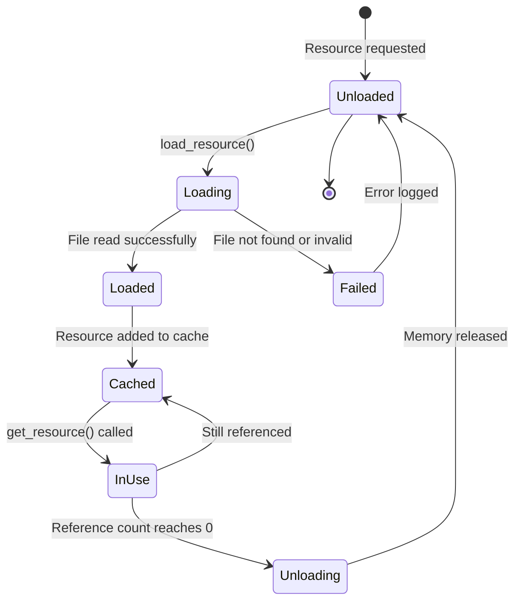
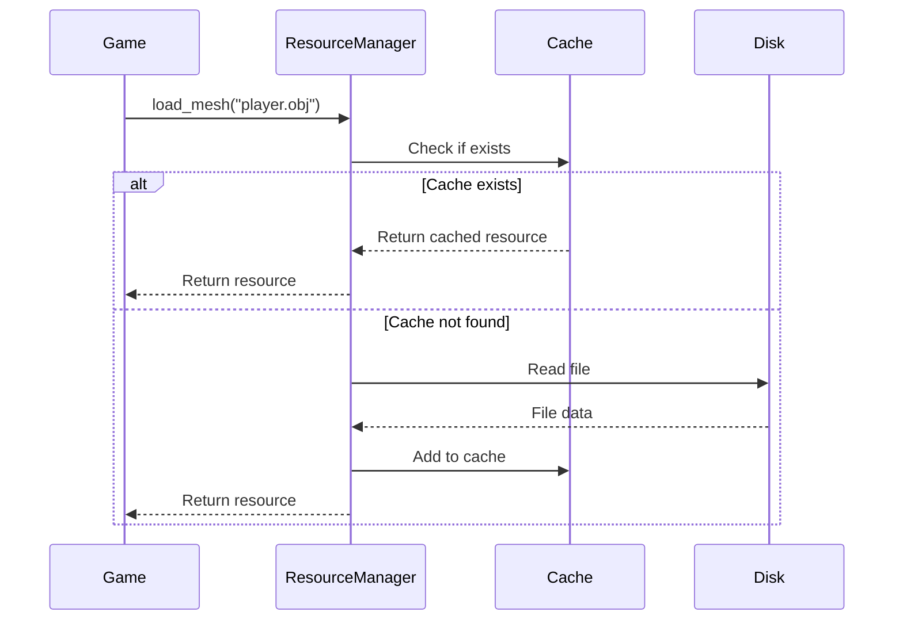

# Resource Manager Reference

The resource manager subsystem handles loading, caching, and lifecycle management of game assets. This reference documents the [`IResourceManager`](include/engine/IResourceManager.hpp:31) interface and [`ResourceManager`](include/engine/resources/ResourceManager.hpp:54) implementation.

## IResourceManager Interface

The [`IResourceManager`](include/engine/IResourceManager.hpp:31) interface defines the contract for all resource manager implementations:

```cpp
namespace omnicpp {

enum class ResourceType : uint32_t {
    TEXTURE = 0,
    MESH = 1,
    SHADER = 2,
    AUDIO = 3,
    MATERIAL = 4,
    UNKNOWN = 0xFFFFFFFF
};

class IResourceManager {
public:
    virtual ~IResourceManager() = default;

    virtual bool initialize() = 0;
    virtual void shutdown() = 0;
    virtual uint32_t load_resource(const char* file_path, ResourceType type) = 0;
    virtual void unload_resource(uint32_t resource_id) = 0;
    virtual void* get_resource(uint32_t resource_id) = 0;
    virtual bool reload_resource(uint32_t resource_id) = 0;
    virtual void set_search_path(const char* path) = 0;
    virtual const char* get_search_path() const = 0;
    virtual ResourceType get_resource_type(uint32_t resource_id) const = 0;
};

} // namespace omnicpp
```

### Methods

| Method | Return Type | Description |
|--------|-------------|-------------|
| [`initialize()`](include/engine/IResourceManager.hpp:40) | `bool` | Initialize resource manager. Returns `true` on success. |
| [`shutdown()`](include/engine/IResourceManager.hpp:45) | `void` | Shutdown resource manager and unload all resources. |
| [`load_resource()`](include/engine/IResourceManager.hpp:54) | `uint32_t` | Load a resource from file. Returns resource ID (0 on failure). |
| [`unload_resource()`](include/engine/IResourceManager.hpp:61) | `void` | Unload a resource by ID. |
| [`get_resource()`](include/engine/IResourceManager.hpp:69) | `void*` | Get a resource by ID. Returns `nullptr` if not found. |
| [`reload_resource()`](include/engine/IResourceManager.hpp:77) | `bool` | Reload a resource from disk. Returns `true` on success. |
| [`set_search_path()`](include/engine/IResourceManager.hpp:84) | `void` | Set the directory to search for resources. |
| [`get_search_path()`](include/engine/IResourceManager.hpp:91) | `const char*` | Get the current search path. |
| [`get_resource_type()`](include/engine/IResourceManager.hpp:99) | `ResourceType` | Get the type of a resource by ID. |

## ResourceManager Implementation

The [`ResourceManager`](include/engine/resources/ResourceManager.hpp:54) class provides a concrete implementation with caching and reference counting:

```cpp
namespace omnicpp {
namespace resources {

enum class ResourceType {
    MESH,
    MATERIAL,
    TEXTURE,
    SHADER,
    AUDIO,
    SCRIPT
};

class Resource {
public:
    virtual ~Resource() = default;
    virtual ResourceType get_type() const = 0;
    virtual const std::string& get_path() const = 0;
    virtual uint32_t get_ref_count() const = 0;
    virtual void add_ref() = 0;
    virtual void release() = 0;
};

class ResourceManager {
public:
    ResourceManager() = default;
    ~ResourceManager();

    bool initialize();
    void shutdown();
    Mesh* load_mesh(const std::string& path);
    Material* load_material(const std::string& path);
    Texture* load_texture(const std::string& path);
    Shader* load_shader(const std::string& path);
    void unload_resource(const std::string& path);
    void unload_all();
    Resource* get_resource(const std::string& path) const;
    size_t get_resource_count() const;
    size_t get_memory_usage() const;

private:
    void add_resource(const std::string& path, Resource* resource);
    void remove_resource(const std::string& path);

private:
    std::unordered_map<std::string, std::unique_ptr<Resource>> m_resources;
    size_t m_memory_usage = 0;
};

} // namespace resources
} // namespace omnicpp
```

### ResourceManager Methods

| Method | Return Type | Description |
|--------|-------------|-------------|
| [`initialize()`](include/engine/resources/ResourceManager.hpp:78) | `bool` | Initialize resource manager. |
| [`shutdown()`](include/engine/resources/ResourceManager.hpp:83) | `void` | Shutdown resource manager and unload all resources. |
| [`load_mesh()`](include/engine/resources/ResourceManager.hpp:90) | `Mesh*` | Load a mesh from file. Returns `nullptr` on failure. |
| [`load_material()`](include/engine/resources/ResourceManager.hpp:97) | `Material*` | Load a material from file. Returns `nullptr` on failure. |
| [`load_texture()`](include/engine/resources/ResourceManager.hpp:104) | `Texture*` | Load a texture from file. Returns `nullptr` on failure. |
| [`load_shader()`](include/engine/resources/ResourceManager.hpp:111) | `Shader*` | Load a shader from file. Returns `nullptr` on failure. |
| [`unload_resource()`](include/engine/resources/ResourceManager.hpp:117) | `void` | Unload a resource by path. |
| [`unload_all()`](include/engine/resources/ResourceManager.hpp:122) | `void` | Unload all resources. |
| [`get_resource()`](include/engine/resources/ResourceManager.hpp:129) | `Resource*` | Get a resource by path. Returns `nullptr` if not found. |
| [`get_resource_count()`](include/engine/resources/ResourceManager.hpp:135) | `size_t` | Get the number of loaded resources. |
| [`get_memory_usage()`](include/engine/resources/ResourceManager.hpp:141) | `size_t` | Get the total memory usage in bytes. |

## Resource Types

| Type | Description | File Extensions |
|------|-------------|-----------------|
| **MESH** | 3D geometry data | `.obj`, `.gltf`, `.glb` |
| **MATERIAL** | Surface properties | `.mtl`, `.json` |
| **TEXTURE** | Image data | `.png`, `.jpg`, `.tga`, `.dds` |
| **SHADER** | GPU programs | `.spv` (SPIR-V), `.vert`, `.frag` |
| **AUDIO** | Sound data | `.wav`, `.ogg`, `.mp3` |
| **SCRIPT** | Game logic | `.lua`, `.py`, `.js` |

## Resource Lifecycle



## Resource Caching

The resource manager uses a cache to avoid loading the same resource multiple times:

```cpp
// From include/engine/resources/ResourceManager.hpp:158
std::unordered_map<std::string, std::unique_ptr<Resource>> m_resources;
```

### Cache Behavior

- **First load**: Resource is loaded from disk and cached
- **Subsequent loads**: Resource is retrieved from cache
- **Reference counting**: Resources are unloaded when reference count reaches 0
- **Memory tracking**: Total memory usage is tracked for debugging

### Cache Lookup Flow



## Code Examples

### Loading a Mesh

```cpp
#include "engine/Engine.hpp"
#include "engine/resources/ResourceManager.hpp"

void load_player_model(omnicpp::IEngine* engine) {
    auto* resources = engine->get_resource_manager();

    // Load mesh from file
    auto* mesh = resources->load_mesh("models/player.obj");
    if (!mesh) {
        spdlog::error("Failed to load player mesh");
        return;
    }

    // Use mesh for rendering
    // ...
}
```

### Loading a Texture

```cpp
#include "engine/Engine.hpp"
#include "engine/resources/ResourceManager.hpp"

void load_player_texture(omnicpp::IEngine* engine) {
    auto* resources = engine->get_resource_manager();

    // Load texture from file
    auto* texture = resources->load_texture("textures/player.png");
    if (!texture) {
        spdlog::error("Failed to load player texture");
        return;
    }

    // Use texture for rendering
    // ...
}
```

### Setting Search Path

```cpp
#include "engine/Engine.hpp"
#include "engine/resources/ResourceManager.hpp"

void setup_resource_paths(omnicpp::IEngine* engine) {
    auto* resources = engine->get_resource_manager();

    // Set base search path
    resources->set_search_path("assets/");

    // Now resources can be loaded with relative paths
    auto* mesh = resources->load_mesh("models/player.obj");
    // This will load from "assets/models/player.obj"
}
```

### Unloading Resources

```cpp
#include "engine/Engine.hpp"
#include "engine/resources/ResourceManager.hpp"

void cleanup_level(omnicpp::IEngine* engine) {
    auto* resources = engine->get_resource_manager();

    // Unload specific resources
    resources->unload_resource("models/level1.obj");
    resources->unload_resource("textures/level1.png");

    // Or unload all resources
    resources->unload_all();
}
```

### Monitoring Memory Usage

```cpp
#include "engine/Engine.hpp"
#include "engine/resources/ResourceManager.hpp"

void log_memory_usage(omnicpp::IEngine* engine) {
    auto* resources = engine->get_resource_manager();

    size_t count = resources->get_resource_count();
    size_t memory = resources->get_memory_usage();

    spdlog::info("Loaded {} resources using {} MB of memory",
                 count, memory / (1024 * 1024));
}
```

## Asynchronous Loading

The current implementation uses synchronous loading. Asynchronous loading is planned for future versions:

### Planned Features

- **Background loading**: Load resources in separate threads
- **Progress callbacks**: Report loading progress
- **Priority queues**: Load critical resources first
- **Streaming**: Stream large resources (e.g., video)

### Current Workaround

For now, load resources during level loading screens:

```cpp
void load_level_async(const std::string& level_name) {
    // Show loading screen
    show_loading_screen();

    // Load all resources synchronously
    load_level_resources(level_name);

    // Hide loading screen
    hide_loading_screen();
}
```

## Resource Hot-Reloading

The resource manager supports hot-reloading resources at runtime:

```cpp
#include "engine/Engine.hpp"
#include "engine/resources/ResourceManager.hpp"

void reload_assets(omnicpp::IEngine* engine) {
    auto* resources = engine->get_resource_manager();

    // Reload a specific resource
    uint32_t texture_id = get_texture_id("player.png");
    if (resources->reload_resource(texture_id)) {
        spdlog::info("Player texture reloaded successfully");
    }
}
```

### Use Cases

- **Development**: Reload assets without restarting the game
- **Modding**: Allow users to replace assets
- **Localization**: Reload language-specific resources

## Troubleshooting

### Resource Loading Fails

**Symptom**: [`load_mesh()`](include/engine/resources/ResourceManager.hpp:90) returns `nullptr`

**Possible causes**:
- File not found in search path
- Invalid file format
- Insufficient memory
- Missing dependencies

**Solution**: Check file paths, verify file format, and ensure sufficient memory.

### Memory Leaks

**Symptom**: Memory usage increases over time

**Possible causes**:
- Resources not unloaded when no longer needed
- Circular references between resources
- Reference counting bug

**Solution**: Ensure proper resource cleanup and check reference counts.

### Cache Misses

**Symptom**: Resources are loaded multiple times

**Possible causes**:
- Different file paths for same resource
- Cache not being checked
- Case-sensitive path issues

**Solution**: Use consistent file paths and verify cache lookup logic.

## Related Documentation

- [Engine Overview](index.md) - High-level engine architecture
- [Subsystems Guide](subsystems.md) - Subsystem interaction
- [Renderer Reference](renderer.md) - Graphics rendering API
- [Input Manager Reference](input-manager.md) - Input handling API
