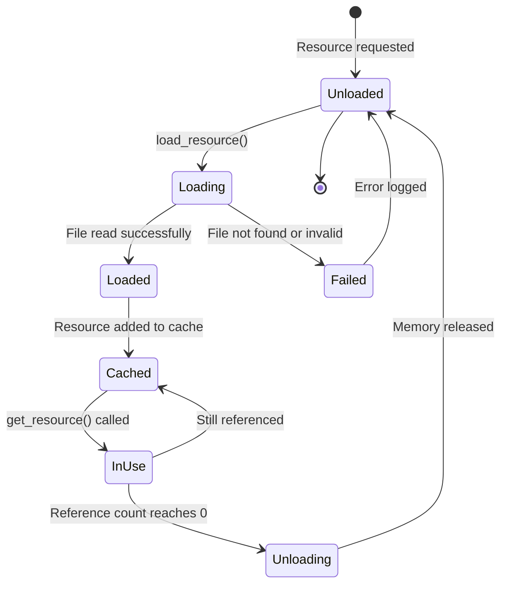
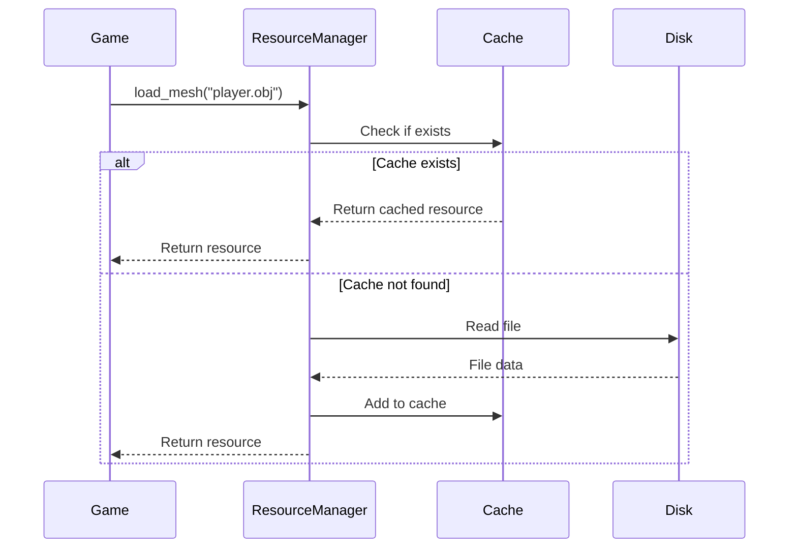
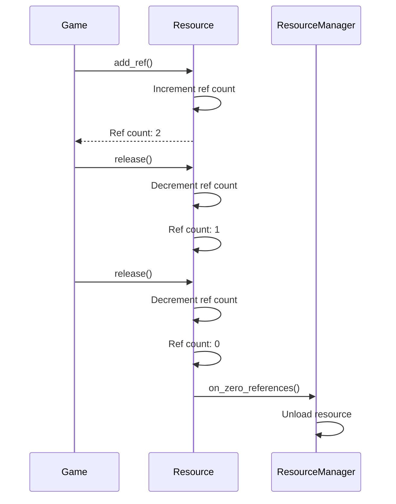

# Resource Management System

The resource management system handles loading, caching, and lifecycle management of game assets. This document explains the resource manager interface, resource concepts, and best practices for asset management.

## Overview

The OmniCPP Engine provides a resource subsystem for:

- **Asset loading**: Load meshes, textures, materials, shaders, and audio
- **Resource caching**: Avoid loading the same resource multiple times
- **Reference counting**: Automatic cleanup when resources are no longer needed
- **Memory tracking**: Monitor memory usage for debugging

## IResourceManager Interface

The [`IResourceManager`](include/engine/IResourceManager.hpp:31) interface defines the contract for all resource manager implementations:

```cpp
namespace omnicpp {

enum class ResourceType : uint32_t {
    TEXTURE = 0,
    MESH = 1,
    SHADER = 2,
    AUDIO = 3,
    MATERIAL = 4,
    UNKNOWN = 0xFFFFFFFF
};

class IResourceManager {
public:
    virtual ~IResourceManager() = default;

    virtual bool initialize() = 0;
    virtual void shutdown() = 0;
    virtual uint32_t load_resource(const char* file_path, ResourceType type) = 0;
    virtual void unload_resource(uint32_t resource_id) = 0;
    virtual void* get_resource(uint32_t resource_id) = 0;
    virtual bool reload_resource(uint32_t resource_id) = 0;
    virtual void set_search_path(const char* path) = 0;
    virtual const char* get_search_path() const = 0;
    virtual ResourceType get_resource_type(uint32_t resource_id) const = 0;
};

} // namespace omnicpp
```

### Methods

| Method | Return Type | Description |
|--------|-------------|-------------|
| [`initialize()`](include/engine/IResourceManager.hpp:40) | `bool` | Initialize resource manager. Returns `true` on success. |
| [`shutdown()`](include/engine/IResourceManager.hpp:45) | `void` | Shutdown resource manager and unload all resources. |
| [`load_resource()`](include/engine/IResourceManager.hpp:54) | `uint32_t` | Load a resource from file. Returns resource ID (0 on failure). |
| [`unload_resource()`](include/engine/IResourceManager.hpp:61) | `void` | Unload a resource by ID. |
| [`get_resource()`](include/engine/IResourceManager.hpp:69) | `void*` | Get a resource by ID. Returns `nullptr` if not found. |
| [`reload_resource()`](include/engine/IResourceManager.hpp:77) | `bool` | Reload a resource from disk. Returns `true` on success. |
| [`set_search_path()`](include/engine/IResourceManager.hpp:84) | `void` | Set the directory to search for resources. |
| [`get_search_path()`](include/engine/IResourceManager.hpp:91) | `const char*` | Get the current search path. |
| [`get_resource_type()`](include/engine/IResourceManager.hpp:99) | `ResourceType` | Get the type of a resource by ID. |

## ResourceManager Implementation

The [`ResourceManager`](include/engine/resources/ResourceManager.hpp:54) class provides a concrete implementation with caching and reference counting:

```cpp
namespace omnicpp {
namespace resources {

enum class ResourceType {
    MESH,
    MATERIAL,
    TEXTURE,
    SHADER,
    AUDIO,
    SCRIPT
};

class Resource {
public:
    virtual ~Resource() = default;

    virtual ResourceType get_type() const = 0;
    virtual const std::string& get_path() const = 0;
    virtual uint32_t get_ref_count() const = 0;
    virtual void add_ref() = 0;
    virtual void release() = 0;
};

class ResourceManager {
public:
    ResourceManager() = default;
    ~ResourceManager();

    bool initialize();
    void shutdown();
    Mesh* load_mesh(const std::string& path);
    Material* load_material(const std::string& path);
    Texture* load_texture(const std::string& path);
    Shader* load_shader(const std::string& path);
    void unload_resource(const std::string& path);
    void unload_all();
    Resource* get_resource(const std::string& path) const;
    size_t get_resource_count() const;
    size_t get_memory_usage() const;

private:
    void add_resource(const std::string& path, Resource* resource);
    void remove_resource(const std::string& path);

private:
    std::unordered_map<std::string, std::unique_ptr<Resource>> m_resources;
    size_t m_memory_usage = 0;
};

} // namespace resources
} // namespace omnicpp
```

## Resource Types

| Type | Description | File Extensions |
|------|-------------|-----------------|
| **MESH** | 3D geometry data | `.obj`, `.gltf`, `.glb` |
| **MATERIAL** | Surface properties | `.mtl`, `.json` |
| **TEXTURE** | Image data | `.png`, `.jpg`, `.tga`, `.dds` |
| **SHADER** | GPU programs | `.spv` (SPIR-V), `.vert`, `.frag` |
| **AUDIO** | Sound data | `.wav`, `.ogg`, `.mp3` |
| **SCRIPT** | Game logic | `.lua`, `.py`, `.js` |

## Resource Lifecycle



### Resource States

| State | Description |
|-------|-------------|
| **Unloaded** | Resource exists but not loaded |
| **Loading** | Resource is being loaded (file reading) |
| **Loaded** | Resource is loaded but not cached |
| **Cached** | Resource is loaded and cached |
| **InUse** | Resource is currently being used |
| **Unloading** | Resource is being unloaded (reference count 0) |
| **Failed** | Resource failed to load |

## Resource Caching

The resource manager uses a cache to avoid loading the same resource multiple times:

```cpp
// From include/engine/resources/ResourceManager.hpp:102
std::unordered_map<std::string, std::unique_ptr<Resource>> m_resources;
```

### Cache Behavior

- **First load**: Resource is loaded from disk and cached
- **Subsequent loads**: Resource is retrieved from cache
- **Reference counting**: Resources are unloaded when reference count reaches 0
- **Memory tracking**: Total memory usage is tracked for debugging

### Cache Lookup Flow



### Cache Eviction

Resources can be evicted from cache when:

- **Memory limit reached**: Total memory usage exceeds threshold
- **Least Recently Used**: Resources not accessed recently are evicted first
- **Manual unload**: Explicitly unload resources

```cpp
class ResourceManager {
public:
    void unload_least_recently_used() {
        // Find least recently used resource
        Resource* lru = find_lru_resource();

        // Unload it
        unload_resource(lru->get_path());
    }

private:
    Resource* find_lru_resource() {
        Resource* lru = nullptr;
        uint64_t oldest_access = UINT64_MAX;

        for (const auto& [path, resource] : m_resources) {
            if (resource->get_last_access() < oldest_access) {
                oldest_access = resource->get_last_access();
                lru = resource.get();
            }
        }

        return lru;
    }
};
```

## Reference Counting

Resources use reference counting for automatic cleanup:

```cpp
class Resource {
public:
    void add_ref() {
        m_ref_count++;
    }

    void release() {
        m_ref_count--;
        if (m_ref_count == 0) {
            // Trigger cleanup
            on_zero_references();
        }
    }

    uint32_t get_ref_count() const {
        return m_ref_count;
    }

private:
    uint32_t m_ref_count = 0;
};
```

### Reference Counting Flow



## Code Examples

### Loading a Mesh

```cpp
#include "engine/Engine.hpp"
#include "engine/resources/ResourceManager.hpp"

void load_player_model(omnicpp::IEngine* engine) {
    auto* resources = engine->get_resource_manager();

    // Load mesh from file
    auto* mesh = resources->load_mesh("models/player.obj");
    if (!mesh) {
        spdlog::error("Failed to load player mesh");
        return;
    }

    // Use mesh for rendering
    renderer->draw_mesh(mesh);
}
```

### Loading a Texture

```cpp
void load_player_texture(omnicpp::IEngine* engine) {
    auto* resources = engine->get_resource_manager();

    // Load texture from file
    auto* texture = resources->load_texture("textures/player.png");
    if (!texture) {
        spdlog::error("Failed to load player texture");
        return;
    }

    // Use texture for rendering
    renderer->bind_texture(texture);
}
```

### Setting Search Path

```cpp
void setup_resource_paths(omnicpp::IEngine* engine) {
    auto* resources = engine->get_resource_manager();

    // Set base search path
    resources->set_search_path("assets/");

    // Now resources can be loaded with relative paths
    auto* mesh = resources->load_mesh("models/player.obj");
    // This will load from "assets/models/player.obj"
}
```

### Unloading Resources

```cpp
void cleanup_level(omnicpp::IEngine* engine) {
    auto* resources = engine->get_resource_manager();

    // Unload specific resources
    resources->unload_resource("models/level1.obj");
    resources->unload_resource("textures/level1.png");

    // Or unload all resources
    resources->unload_all();
}
```

### Monitoring Memory Usage

```cpp
void log_memory_usage(omnicpp::IEngine* engine) {
    auto* resources = engine->get_resource_manager();

    size_t count = resources->get_resource_count();
    size_t memory = resources->get_memory_usage();

    spdlog::info("Loaded {} resources using {} MB of memory",
                 count, memory / (1024 * 1024));
}
```

## Asynchronous Loading

The current implementation uses synchronous loading. Asynchronous loading is planned for future versions:

### Planned Features

- **Background loading**: Load resources in separate threads
- **Progress callbacks**: Report loading progress
- **Priority queues**: Load critical resources first
- **Streaming**: Stream large resources (e.g., video)

### Current Workaround

For now, load resources during level loading screens:

```cpp
void load_level_async(const std::string& level_name) {
    // Show loading screen
    show_loading_screen();

    // Load all resources synchronously
    load_level_resources(level_name);

    // Hide loading screen
    hide_loading_screen();
}
```

## Resource Hot-Reloading

The resource manager supports hot-reloading resources at runtime:

```cpp
#include "engine/Engine.hpp"
#include "engine/IResourceManager.hpp"

void reload_assets(omnicpp::IEngine* engine) {
    auto* resources = engine->get_resource_manager();

    // Reload a specific resource
    uint32_t texture_id = get_texture_id("player.png");
    if (resources->reload_resource(texture_id)) {
        spdlog::info("Player texture reloaded successfully");
    }
}
```

### Use Cases

- **Development**: Reload assets without restarting the game
- **Modding**: Allow users to replace assets
- **Localization**: Reload language-specific resources

## Resource Bundles

Resources can be bundled together for efficient loading:

```cpp
struct ResourceBundle {
    std::string name;
    std::vector<std::string> meshes;
    std::vector<std::string> textures;
    std::vector<std::string> materials;
};

class ResourceManager {
public:
    bool load_bundle(const ResourceBundle& bundle) {
        // Load all resources in bundle
        for (const auto& mesh : bundle.meshes) {
            if (!load_mesh(mesh)) {
                return false;
            }
        }

        for (const auto& texture : bundle.textures) {
            if (!load_texture(texture)) {
                return false;
            }
        }

        return true;
    }
};
```

## Performance Optimization

### Memory Pooling

Resources of the same type can be allocated from pools:

```cpp
template<typename T>
class ResourcePool {
public:
    T* allocate() {
        if (!m_free_resources.empty()) {
            // Create new resource
            return new T();
        }

        // Reuse existing resource
        T* resource = m_free_resources.back();
        m_free_resources.pop_back();
        return resource;
    }

    void deallocate(T* resource) {
        // Reset resource
        resource->reset();

        // Return to pool
        m_free_resources.push_back(resource);
    }

private:
    std::vector<T*> m_free_resources;
};
```

### Texture Compression

Textures can be compressed to reduce memory usage:

| Format | Compression | Quality | Memory Usage |
|--------|-------------|---------|---------------|
| **BC1** | Block Compression | Low | 1/4 of uncompressed |
| **BC3** | Block Compression | Medium | 1/6 of uncompressed |
| **BC7** | Block Compression | High | 1/8 of uncompressed |
| **ETC2** | Ericsson Texture Compression | Medium | 1/6 of uncompressed |

### Mesh Optimization

Meshes can be optimized for better performance:

```cpp
struct OptimizedMesh {
    std::vector<Vertex> vertices;
    std::vector<uint32_t> indices;

    // Vertex buffer object
    uint32_t vbo;
    // Index buffer object
    uint32_t ibo;
    // Vertex array object
    uint32_t vao;
};

void optimize_mesh(Mesh& mesh) {
    // Remove duplicate vertices
    remove_duplicate_vertices(mesh);

    // Optimize index order for cache
    optimize_for_cache(mesh);

    // Generate GPU buffers
    generate_gpu_buffers(mesh);
}
```

## Troubleshooting

### Resource Loading Fails

**Symptom**: [`load_mesh()`](include/engine/resources/ResourceManager.hpp:90) returns `nullptr`

**Possible causes**:
- File not found in search path
- Invalid file format
- Insufficient memory
- Missing dependencies

**Solution**: Check file paths, verify file format, and ensure sufficient memory.

### Memory Leaks

**Symptom**: Memory usage increases over time

**Possible causes**:
- Resources not unloaded when no longer needed
- Circular references between resources
- Reference counting bug

**Solution**: Ensure proper resource cleanup and check reference counts.

### Cache Misses

**Symptom**: Resources are loaded multiple times

**Possible causes**:
- Different file paths for same resource
- Cache not being checked
- Case-sensitive path issues

**Solution**: Use consistent file paths and verify cache lookup logic.

### Hot-Reload Fails

**Symptom**: [`reload_resource()`](include/engine/IResourceManager.hpp:77) returns `false`

**Possible causes**:
- File not found
- Invalid file format
- Resource still in use

**Solution**: Verify file exists and resource is not locked.

## Related Documentation

- [Engine Overview](index.md) - High-level engine architecture
- [Subsystems Guide](subsystems.md) - Subsystem interaction
- [Renderer Reference](renderer.md) - Graphics rendering API
- [Resource Manager Reference](resource-manager.md) - Detailed resource loading API

## References

- [Asset Management](https://www.youtube.com/playlist?list=PLW3Zl3TIAbgu6BI6rQj5b7pZ)
- [Texture Compression](https://www.khronos.org/opengl/wiki/Texture_Compression)
- [Mesh Optimization](https://www.youtube.com/playlist?list=PLW3Zl3TIAbgu6BI6rQj5b7pZ)
