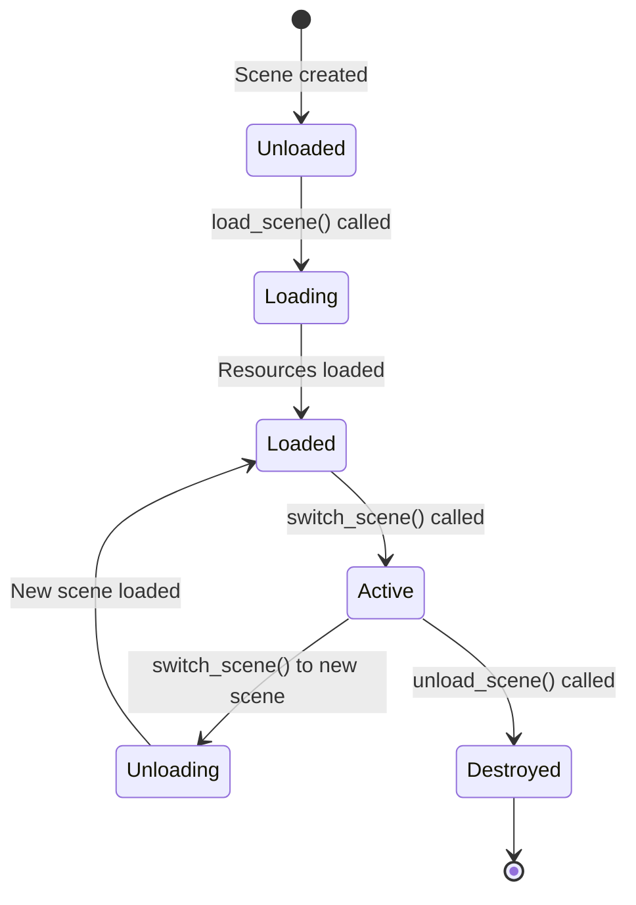
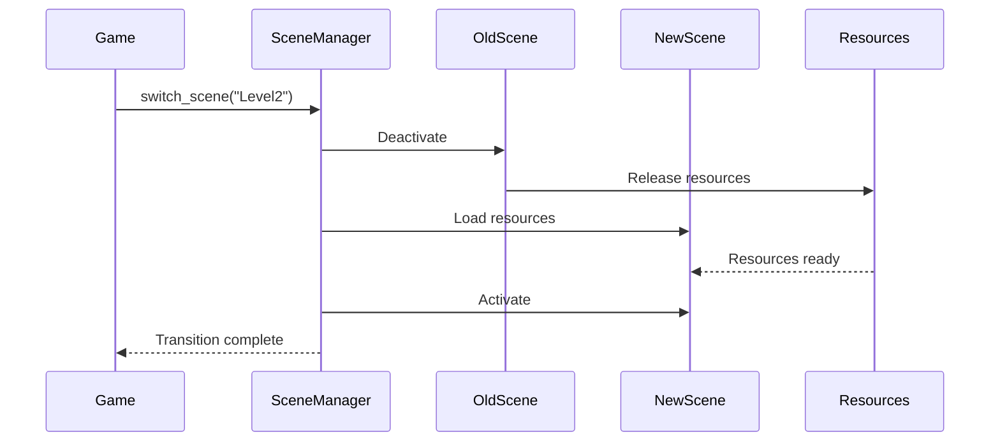

# Scene Management System

The scene management system provides a hierarchical structure for organizing game objects and managing scene transitions. This document explains the scene architecture, scene graph, and how to use the scene subsystem.

## Overview

The OmniCPP Engine provides a scene management subsystem for:

- **Scene organization**: Hierarchical scene graph for game objects
- **Scene transitions**: Smooth transitions between game states
- **Entity management**: Add, remove, and query entities
- **Camera management**: Active camera per scene

## Scene Architecture

The scene system uses a tree-based scene graph:

```mermaid
classDiagram
    class Scene {
        +string name
        +SceneNode* root_node
        +Camera* active_camera
        +vector~Entity~* entities
        +map~uint64_t,Entity*~ entity_map
        +bool active
        +add_entity()
        +remove_entity()
        +get_entity()
        +update()
        +render()
    }

    class SceneNode {
        +string name
        +SceneNode* parent
        +vector~SceneNode*~ children
        +Entity* entity
        +bool active
        +add_child()
        +remove_child()
        +get_child()
        +update()
    }

    class SceneManager {
        +vector~Scene*~ scenes
        +map~string,Scene*~ scene_map
        +Scene* active_scene
        +add_scene()
        +remove_scene()
        +get_scene()
        +load_scene()
        +unload_scene()
        +switch_scene()
        +update()
        +render()
    }

    Scene "1" *-- "1" : SceneNode
    SceneNode "1" *-- "2" : SceneNode
    SceneNode "2" *-- "3" : SceneNode
    SceneNode "3" *-- "4" : SceneNode
    Scene "1" --> Entity "1"
    Scene "1" --> Entity "2"
    SceneNode "2" --> Entity "3"
    SceneManager --> Scene "1"
    SceneManager --> Scene "2"
```

## Scene Class

The [`Scene`](include/engine/scene/Scene.hpp:27) class represents a single game scene:

```cpp
namespace omnicpp {
namespace scene {

class Scene {
public:
    explicit Scene(const std::string& name = "Scene");
    ~Scene();

    // Disable copying, enable moving
    Scene(const Scene&) = delete;
    Scene& operator=(const Scene&) = delete;
    Scene(Scene&&) noexcept = default;
    Scene& operator=(Scene&&) noexcept = default;

    const std::string& get_name() const { return m_name; }
    void set_name(const std::string& name) { m_name = name; }

    SceneNode* get_root_node() const { return m_root_node.get(); }
    Camera* get_active_camera() const { return m_active_camera; }
    void set_active_camera(Camera* camera) { m_active_camera = camera; }

    void add_entity(std::unique_ptr<ecs::Entity> entity);
    std::unique_ptr<ecs::Entity> remove_entity(uint64_t entity_id);
    ecs::Entity* get_entity(uint64_t entity_id) const;
    const std::vector<std::unique_ptr<ecs::Entity>>& get_entities() const {
        return m_entities;
    }

    void update(float delta_time);
    void render();

    bool is_active() const { return m_active; }
    void set_active(bool active) { m_active = active; }

private:
    std::string m_name;
    std::unique_ptr<SceneNode> m_root_node;
    std::vector<std::unique_ptr<ecs::Entity>> m_entities;
    std::unordered_map<uint64_t, ecs::Entity*> m_entity_map;
    Camera* m_active_camera = nullptr;
    bool m_active = true;
};

} // namespace scene
} // namespace omnicpp
```

### Scene Methods

| Method | Return Type | Description |
|--------|-------------|-------------|
| [`get_name()`](include/engine/scene/Scene.hpp:52) | `const string&` | Get scene name. |
| [`set_name()`](include/engine/scene/Scene.hpp:58) | `void` | Set scene name. |
| [`get_root_node()`](include/engine/scene/Scene.hpp:64) | `SceneNode*` | Get root scene node. |
| [`get_active_camera()`](include/engine/scene/Scene.hpp:70) | `Camera*` | Get active camera. |
| [`set_active_camera()`](include/engine/scene/Scene.hpp:76) | `void` | Set active camera. |
| [`add_entity()`](include/engine/scene/Scene.hpp:82) | `void` | Add entity to scene (takes ownership). |
| [`remove_entity()`](include/engine/scene/Scene.hpp:89) | `unique_ptr<Entity>` | Remove entity from scene. |
| [`get_entity()`](include/engine/scene/Scene.hpp:96) | `Entity*` | Get entity by ID. |
| [`get_entities()`](include/engine/scene/Scene.hpp:102) | `const vector&` | Get all entities in scene. |
| [`update()`](include/engine/scene/Scene.hpp:108) | `void` | Update scene and all entities. |
| [`render()`](include/engine/scene/Scene.hpp:113) | `void` | Render scene. |
| [`is_active()`](include/engine/scene/Scene.hpp:119) | `bool` | Check if scene is active. |
| [`set_active()`](include/engine/scene/Scene.hpp:125) | `void` | Set scene active state. |

## SceneNode Class

The [`SceneNode`](include/engine/scene/SceneNode.hpp:26) class represents a node in the scene graph hierarchy:

```cpp
namespace omnicpp {
namespace scene {

class SceneNode {
public:
    explicit SceneNode(const std::string& name = "SceneNode");
    ~SceneNode();

    // Disable copying, enable moving
    SceneNode(const SceneNode&) = delete;
    SceneNode& operator=(const SceneNode&) = delete;
    SceneNode(SceneNode&&) noexcept = default;
    SceneNode& operator=(SceneNode&&) noexcept = default;

    const std::string& get_name() const { return m_name; }
    void set_name(const std::string& name) { m_name = name; }

    SceneNode* get_parent() const { return m_parent; }
    const std::vector<std::unique_ptr<SceneNode>>& get_children() const {
        return m_children;
    }
    ecs::Entity* get_entity() const { return m_entity; }
    void set_entity(ecs::Entity* entity) { m_entity = entity; }

    void add_child(std::unique_ptr<SceneNode> child);
    std::unique_ptr<SceneNode> remove_child(SceneNode* child);
    SceneNode* get_child(size_t index) const;
    size_t get_child_count() const { return m_children.size(); }

    void update(float delta_time);
    bool is_active() const { return m_active; }
    void set_active(bool active) { m_active = active; }

private:
    std::string m_name;
    SceneNode* m_parent = nullptr;
    std::vector<std::unique_ptr<SceneNode>> m_children;
    ecs::Entity* m_entity = nullptr;
    bool m_active = true;
};

} // namespace scene
} // namespace omnicpp
```

### SceneNode Methods

| Method | Return Type | Description |
|--------|-------------|-------------|
| [`get_name()`](include/engine/scene/SceneNode.hpp:51) | `const string&` | Get node name. |
| [`set_name()`](include/engine/scene/SceneNode.hpp:57) | `void` | Set node name. |
| [`get_parent()`](include/engine/scene/SceneNode.hpp:63) | `SceneNode*` | Get parent node. |
| [`get_children()`](include/engine/scene/SceneNode.hpp:69) | `const vector&` | Get child nodes. |
| [`get_entity()`](include/engine/scene/SceneNode.hpp:75) | `Entity*` | Get entity attached to node. |
| [`set_entity()`](include/engine/scene/SceneNode.hpp:81) | `void` | Set entity for this node. |
| [`add_child()`](include/engine/scene/SceneNode.hpp:87) | `void` | Add child node (takes ownership). |
| [`remove_child()`](include/engine/scene/SceneNode.hpp:94) | `unique_ptr<SceneNode>` | Remove child node. |
| [`get_child()`](include/engine/scene/SceneNode.hpp:101) | `SceneNode*` | Get child by index. |
| [`get_child_count()`](include/engine/scene/SceneNode.hpp:107) | `size_t` | Get number of children. |
| [`update()`](include/engine/scene/SceneNode.hpp:113) | `void` | Update node and all children. |
| [`is_active()`](include/engine/scene/SceneNode.hpp:119) | `bool` | Check if node is active. |
| [`set_active()`](include/engine/scene/SceneNode.hpp:125) | `void` | Set node active state. |

## SceneManager Class

The [`SceneManager`](include/engine/scene/SceneManager.hpp:23) class manages multiple scenes and transitions:

```cpp
namespace omnicpp {
namespace scene {

class SceneManager {
public:
    SceneManager() = default;
    ~SceneManager() = default;

    // Disable copying, enable moving
    SceneManager(const SceneManager&) = delete;
    SceneManager& operator=(const SceneManager&) = delete;
    SceneManager(SceneManager&&) noexcept = default;
    SceneManager& operator=(SceneManager&&) noexcept = default;

    void add_scene(std::unique_ptr<Scene> scene);
    std::unique_ptr<Scene> remove_scene(const std::string& name);
    Scene* get_scene(const std::string& name) const;
    const std::vector<std::unique_ptr<Scene>>& get_scenes() const {
        return m_scenes;
    }

    Scene* get_active_scene() const { return m_active_scene; }

    bool load_scene(const std::string& name);
    void unload_scene();
    bool switch_scene(const std::string& name);

    void update(float delta_time);
    void render();

private:
    std::vector<std::unique_ptr<Scene>> m_scenes;
    std::unordered_map<std::string, Scene*> m_scene_map;
    Scene* m_active_scene = nullptr;
};

} // namespace scene
} // namespace omnicpp
```

### SceneManager Methods

| Method | Return Type | Description |
|--------|-------------|-------------|
| [`add_scene()`](include/engine/scene/SceneManager.hpp:47) | `void` | Add scene to manager (takes ownership). |
| [`remove_scene()`](include/engine/scene/SceneManager.hpp:54) | `unique_ptr<Scene>` | Remove scene from manager. |
| [`get_scene()`](include/engine/scene/SceneManager.hpp:61) | `Scene*` | Get scene by name. |
| [`get_scenes()`](include/engine/scene/SceneManager.hpp:67) | `const vector&` | Get all scenes. |
| [`get_active_scene()`](include/engine/scene/SceneManager.hpp:73) | `Scene*` | Get active scene. |
| [`load_scene()`](include/engine/scene/SceneManager.hpp:80) | `bool` | Load a scene by name. |
| [`unload_scene()`](include/engine/scene/SceneManager.hpp:85) | `void` | Unload active scene. |
| [`switch_scene()`](include/engine/scene/SceneManager.hpp:92) | `bool` | Switch to a different scene. |
| [`update()`](include/engine/scene/SceneManager.hpp:98) | `void` | Update active scene. |
| [`render()`](include/engine/scene/SceneManager.hpp:103) | `void` | Render active scene. |

## Scene Lifecycle



### Scene States

| State | Description |
|-------|-------------|
| **Unloaded** | Scene exists but not loaded |
| **Loading** | Scene is being loaded (resources loading) |
| **Loaded** | Scene is loaded but not active |
| **Active** | Scene is currently being updated/rendered |
| **Unloading** | Scene is being unloaded (resources releasing) |
| **Destroyed** | Scene has been destroyed |

## Scene Transitions



### Transition Types

| Type | Description | Use Case |
|------|-------------|----------|
| **Immediate** | Instant switch, no transition effect | Menu navigation |
| **Fade** | Old scene fades out, new scene fades in | Level transitions |
| **Slide** | Old scene slides out, new scene slides in | Cutscenes |
| **Async** | New scene loads in background | Large levels |

## Code Examples

### Creating a Scene

```cpp
#include "engine/scene/Scene.hpp"
#include "engine/scene/SceneNode.hpp"
#include "engine/ecs/Entity.hpp"

void create_main_menu_scene() {
    // Create scene
    auto scene = std::make_unique<omnicpp::scene::Scene>("MainMenu");

    // Get root node
    auto* root = scene->get_root_node();

    // Create menu entities
    auto play_button = std::make_unique<omnicpp::ecs::Entity>(1, "PlayButton");
    auto* transform = play_button->add_component<omnicpp::ecs::TransformComponent>();
    transform->set_position({0.0f, 1.0f, 0.0f});

    auto* mesh = play_button->add_component<omnicpp::ecs::MeshComponent>();
    mesh->set_mesh(load_mesh("ui/button.obj"));
    mesh->set_material(load_material("ui/button.mtl"));

    // Add entity to scene
    scene->add_entity(std::move(play_button));

    return scene;
}
```

### Creating a Scene Graph

```cpp
#include "engine/scene/Scene.hpp"
#include "engine/scene/SceneNode.hpp"

void create_level_scene() {
    auto scene = std::make_unique<omnicpp::scene::Scene>("Level1");

    // Get root node
    auto* root = scene->get_root_node();

    // Create hierarchy
    auto* level_node = new omnicpp::scene::SceneNode("Level");
    auto* room1_node = new omnicpp::scene::SceneNode("Room1");
    auto* room2_node = new omnicpp::scene::SceneNode("Room2");

    // Build tree
    root->add_child(std::unique_ptr<omnicpp::scene::SceneNode>(level_node));
    level_node->add_child(std::unique_ptr<omnicpp::scene::SceneNode>(room1_node));
    level_node->add_child(std::unique_ptr<omnicpp::scene::SceneNode>(room2_node));

    return scene;
}
```

### Switching Scenes

```cpp
#include "engine/scene/SceneManager.hpp"

void on_level_complete(omnicpp::scene::SceneManager* scene_manager) {
    // Switch to next level
    if (!scene_manager->switch_scene("Level2")) {
        spdlog::error("Failed to switch to Level2");
        return;
    }

    // Load level resources
    load_level_resources("Level2");
}
```

### Scene Update Loop

```cpp
#include "engine/scene/SceneManager.hpp"

void game_loop(omnicpp::scene::SceneManager* scene_manager) {
    while (running) {
        float delta_time = calculate_delta_time();

        // Update active scene
        scene_manager->update(delta_time);

        // Render active scene
        scene_manager->render();

        // Present frame
        present_frame();
    }
}
```

### Hierarchical Transforms

```cpp
#include "engine/scene/SceneNode.hpp"

void update_hierarchical_transforms(omnicpp::scene::SceneNode* node) {
    // Get entity transform
    auto* entity = node->get_entity();
    if (!entity) return;

    auto* transform = entity->get_component<omnicpp::ecs::TransformComponent>();
    if (!transform) return;

    // Apply parent transform
    auto* parent = node->get_parent();
    if (parent) {
        auto* parent_entity = parent->get_entity();
        if (parent_entity) {
            auto* parent_transform = parent_entity->get_component<omnicpp::ecs::TransformComponent>();
            if (parent_transform) {
                // Combine transforms
                transform->set_position(
                    transform->get_position() + parent_transform->get_position()
                );
            }
        }
    }

    // Update children
    for (size_t i = 0; i < node->get_child_count(); ++i) {
        update_hierarchical_transforms(node->get_child(i));
    }
}
```

## Scene Graph Traversal

### Depth-First Traversal

```cpp
void traverse_depth_first(omnicpp::scene::SceneNode* node) {
    // Process current node
    process_node(node);

    // Process children
    for (size_t i = 0; i < node->get_child_count(); ++i) {
        traverse_depth_first(node->get_child(i));
    }
}
```

### Breadth-First Traversal

```cpp
void traverse_breadth_first(omnicpp::scene::SceneNode* root) {
    std::queue<omnicpp::scene::SceneNode*> queue;
    queue.push(root);

    while (!queue.empty()) {
        auto* node = queue.front();
        queue.pop();

        // Process current node
        process_node(node);

        // Add children to queue
        for (size_t i = 0; i < node->get_child_count(); ++i) {
            queue.push(node->get_child(i));
        }
    }
}
```

## Scene Querying

### Finding Entities by Name

```cpp
ecs::Entity* find_entity_by_name(omnicpp::scene::Scene* scene,
                                   const std::string& name) {
    const auto& entities = scene->get_entities();

    for (const auto& entity : entities) {
        if (entity->get_name() == name) {
            return entity.get();
        }
    }

    return nullptr;
}
```

### Finding Entities by Component

```cpp
template<typename T>
std::vector<ecs::Entity*> find_entities_with_component(omnicpp::scene::Scene* scene) {
    std::vector<ecs::Entity*> result;

    const auto& entities = scene->get_entities();
    for (const auto& entity : entities) {
        if (entity->has_component<T>()) {
            result.push_back(entity.get());
        }
    }

    return result;
}

// Find all entities with Transform component
auto entities = find_entities_with_component<omnicpp::ecs::TransformComponent>(scene);
```

## Performance Optimization

### Spatial Partitioning

Scene graphs can use spatial partitioning for efficient queries:

```cpp
class SpatialHash {
public:
    void insert(omnicpp::scene::SceneNode* node) {
        // Calculate cell hash
        uint64_t hash = calculate_cell_hash(node->get_position());

        // Add to cell
        m_cells[hash].push_back(node);
    }

    std::vector<omnicpp::scene::SceneNode*> query(const glm::vec3& position,
                                                      float radius) {
        std::vector<omnicpp::scene::SceneNode*> result;

        // Calculate cells to check
        auto cells = get_cells_in_radius(position, radius);

        // Collect nodes from cells
        for (auto cell : cells) {
            result.insert(result.end(), cell.begin(), cell.end());
        }

        return result;
    }

private:
    std::unordered_map<uint64_t, std::vector<omnicpp::scene::SceneNode*>> m_cells;
};
```

### Frustum Culling

Only render entities visible to the camera:

```cpp
class FrustumCuller {
public:
    void cull(const std::vector<ecs::Entity*>& entities,
              const Camera& camera) {
        // Calculate frustum planes
        auto frustum = calculate_frustum(camera);

        // Test each entity
        for (auto* entity : entities) {
            auto* transform = entity->get_component<TransformComponent>();
            if (transform && is_in_frustum(transform->get_position(), frustum)) {
                entity->set_visible(true);
            } else {
                entity->set_visible(false);
            }
        }
    }
};
```

## Troubleshooting

### Scene Not Loading

**Symptom**: [`load_scene()`](include/engine/scene/SceneManager.hpp:80) returns `false`

**Possible causes**:
- Scene not added to manager
- Scene name doesn't match
- Resources failed to load

**Solution**: Verify scene is registered and check resource loading logs.

### Entities Not Rendering

**Symptom**: Entities added to scene but not visible

**Possible causes**:
- Entity not active
- Scene not active
- No mesh component attached
- Camera not set

**Solution**: Check entity active state, scene active state, and camera configuration.

### Scene Graph Issues

**Symptom**: Hierarchical transforms not working correctly

**Possible causes**:
- Parent-child relationships not set correctly
- Transform update order incorrect
- Circular references in scene graph

**Solution**: Verify scene graph structure and update order.

### Memory Leaks on Scene Switch

**Symptom**: Memory increases with each scene switch

**Possible causes**:
- Old scene not properly unloaded
- Resources not released
- Entities not destroyed

**Solution**: Ensure proper scene unloading and resource cleanup.

## Related Documentation

- [Engine Overview](index.md) - High-level engine architecture
- [Subsystems Guide](subsystems.md) - Subsystem interaction
- [ECS Architecture](ecs.md) - Entity Component System details
- [Renderer Reference](renderer.md) - Graphics rendering API

## References

- [Scene Graphs](https://www.youtube.com/playlist?list=PLW3Zl3TIAbgu6BI6rQj5b7pZ)
- [Spatial Partitioning](https://www.youtube.com/playlist?list=PLW3Zl3TIAbgu6BI6rQj5b7pZ)
- [Game Architecture](https://www.youtube.com/playlist?list=PLW3Zl3TIAbgu6BI6rQj5b7pZ)
