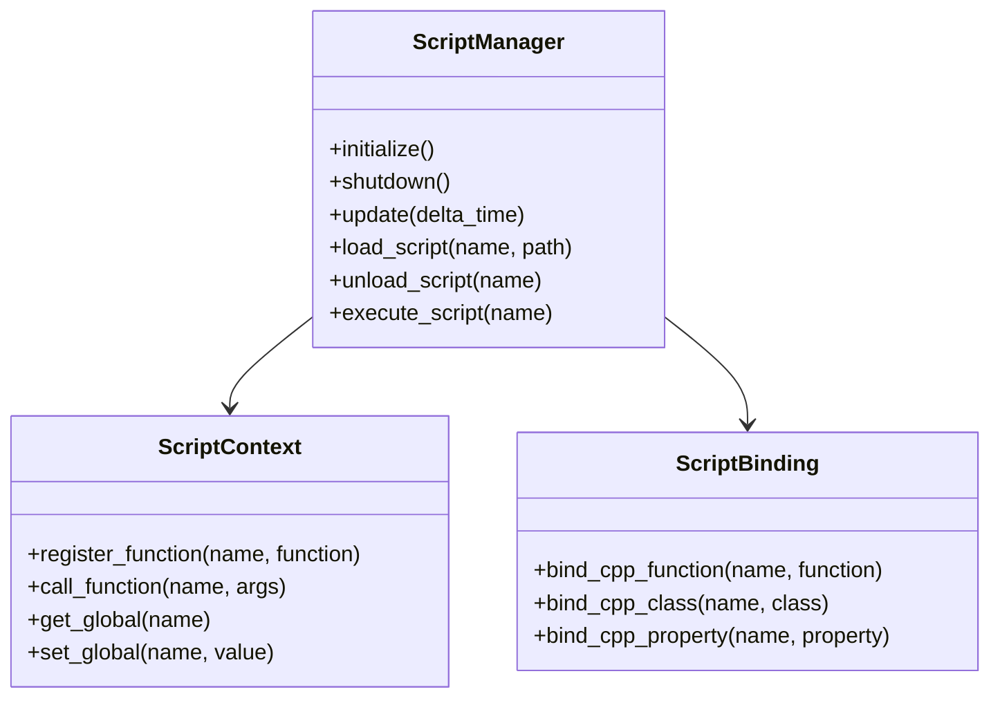
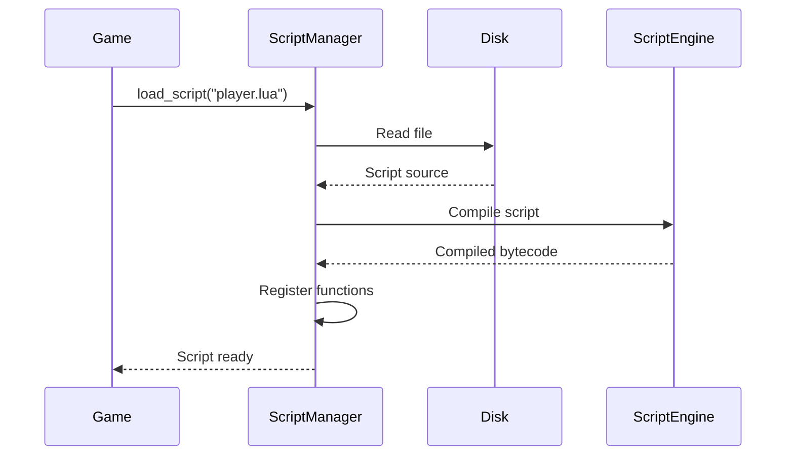

# Scripting System

The scripting system provides integration with scripting languages for game logic. This document explains the script manager interface, scripting concepts, and how to use the scripting subsystem.

## Overview

The OmniCPP Engine provides a scripting subsystem for:

- **Script loading**: Load script files from disk
- **Script execution**: Execute scripts and call functions
- **C++ binding**: Expose C++ functions to scripts
- **Hot-reloading**: Reload scripts at runtime

## ScriptManager Interface

The [`ScriptManager`](include/engine/scripting/script_manager.hpp:17) class provides scripting functionality:

```cpp
namespace OmniCpp::Engine::Scripting {

class ScriptManager {
public:
    ScriptManager();
    ~ScriptManager();

    ScriptManager(const ScriptManager&) = delete;
    ScriptManager& operator=(const ScriptManager&) = delete;

    ScriptManager(ScriptManager&&) noexcept;
    ScriptManager& operator=(ScriptManager&&) noexcept;

    bool initialize();
    void shutdown();
    void update(float delta_time);

    bool load_script(const std::string& name, const std::string& path);
    bool unload_script(const std::string& name);
    bool execute_script(const std::string& name);

private:
    struct Impl;
    std::unique_ptr<Impl> m_impl;
};

} // namespace OmniCpp::Engine::Scripting
```

### Methods

| Method | Return Type | Description |
|--------|-------------|-------------|
| [`initialize()`](include/engine/scripting/script_manager.hpp:28) | `bool` | Initialize script manager. Returns `true` on success. |
| [`shutdown()`](include/engine/scripting/script_manager.hpp:29) | `void` | Shutdown script manager and unload all scripts. |
| [`update()`](include/engine/scripting/script_manager.hpp:30) | `void` | Update script system. Called each frame. |
| [`load_script()`](include/engine/scripting/script_manager.hpp:32) | `bool` | Load a script file. Returns `true` on success. |
| [`unload_script()`](include/engine/scripting/script_manager.hpp:33) | `bool` | Unload a script by name. Returns `true` on success. |
| [`execute_script()`](include/engine/scripting/script_manager.hpp:34) | `bool` | Execute a script. Returns `true` on success. |

## Scripting Languages

### Supported Languages

| Language | Status | File Extensions | Use Case |
|----------|--------|-----------------|----------|
| **Lua** | Planned | `.lua` | Game logic, AI |
| **Python** | Planned | `.py` | Game logic, tools |
| **JavaScript** | Planned | `.js` | UI, web integration |

### Language Comparison

| Feature | Lua | Python | JavaScript |
|----------|-----|--------|------------|
| **Embedding** | Easy | Medium | Easy |
| **Performance** | High | Medium | High |
| **C++ Binding** | Easy | Medium | Easy |
| **Community** | Large | Very Large | Very Large |
| **Learning Curve** | Low | Medium | Low |

## Script Architecture



## Script Loading

### Loading Pipeline



### Loading Scripts

```cpp
#include "engine/scripting/script_manager.hpp"

void load_game_scripts(omnicpp::IEngine* engine) {
    auto* scripting = engine->get_script_manager();

    // Load player script
    if (!scripting->load_script("player", "scripts/player.lua")) {
        spdlog::error("Failed to load player script");
        return;
    }

    // Load enemy AI script
    if (!scripting->load_script("enemy_ai", "scripts/enemy_ai.lua")) {
        spdlog::error("Failed to load enemy AI script");
        return;
    }

    // Load UI script
    if (!scripting->load_script("ui", "scripts/ui.lua")) {
        spdlog::error("Failed to load UI script");
        return;
    }
}
```

## Script Execution

### Execution Flow

```mermaid
sequenceDiagram
    participant Game
    participant ScriptManager
    participant Script
    participant C++Code

    Game->>ScriptManager: execute_script("player")
    ScriptManager->>Script: Call update function
    Script->>C++Code: Get player position
    C++Code-->>Script: Position data
    Script->>C++Code: Move player
    C++Code-->>Script: Move complete
    Script-->>ScriptManager: Execution complete
    ScriptManager-->>Game: Result
```

### Executing Scripts

```cpp
void update_player(omnicpp::IEngine* engine) {
    auto* scripting = engine->get_script_manager();

    // Execute player script
    if (!scripting->execute_script("player")) {
        spdlog::error("Failed to execute player script");
        return;
    }
}
```

## C++ Binding

### Binding Functions

Expose C++ functions to scripts:

```cpp
// C++ function to bind
void player_jump() {
    spdlog::info("Player jumped!");
    // Jump logic...
}

// Bind function to script
script_manager->bind_function("player_jump", player_jump);
```

### Binding Classes

Expose C++ classes to scripts:

```cpp
// C++ class to bind
class Player {
public:
    void move(float x, float y, float z);
    void attack();
    void jump();
};

// Bind class to script
script_manager->bind_class("Player", player_class);
```

### Binding Properties

Expose C++ properties to scripts:

```cpp
// Bind property
script_manager->bind_property("player.health", &player_health);
script_manager->bind_property("player.position", &player_position);
```

## Script Context

### Global Variables

Scripts can access global variables:

```cpp
// Set global variable
script_manager->set_global("game_time", 0.0f);

// Get global variable
float time = script_manager->get_global("game_time");
```

### Script State

Scripts maintain state between executions:

```lua
-- player.lua
local health = 100
local position = {x = 0, y = 0, z = 0}

function update(delta_time)
    -- Update player logic
    position.x = position.x + velocity.x * delta_time
    position.y = position.y + velocity.y * delta_time
end

function take_damage(amount)
    health = health - amount
    if health <= 0 then
        die()
    end
end
```

## Code Examples

### Basic Script Setup

```cpp
#include "engine/Engine.hpp"
#include "engine/scripting/script_manager.hpp"

int main() {
    // Create script manager
    auto scripting = std::make_unique<omnicpp::scripting::ScriptManager>();

    // Configure engine
    omnicpp::EngineConfig config{};
    config.script_manager = scripting.get();

    // Create engine
    omnicpp::IEngine* engine = omnicpp::create_engine(config);
    if (!engine) {
        return -1;
    }

    // Load scripts
    scripting->load_script("game", "scripts/game.lua");
    scripting->load_script("player", "scripts/player.lua");
    scripting->load_script("enemy", "scripts/enemy.lua");

    // Bind C++ functions
    scripting->bind_function("log_message", [](const std::string& msg) {
        spdlog::info("Script: {}", msg);
    });

    // Game loop
    while (running) {
        float delta_time = calculate_delta_time();

        // Update game logic
        engine->update(delta_time);

        // Render
        engine->render();
    }

    // Cleanup
    omnicpp::destroy_engine(engine);
    return 0;
}
```

### Script Event System

```cpp
class ScriptEventManager {
public:
    void register_event(const std::string& name) {
        // Create event in script
        scripting->execute_string(
            "game_events['" + name + "'] = function() end"
        );
    }

    void trigger_event(const std::string& name, const std::vector<ScriptArg>& args) {
        // Call event in script
        std::string call = "game_events['" + name + "'](";
        for (const auto& arg : args) {
            call += arg.to_string() + ", ";
        }
        call += ")";

        scripting->execute_string(call);
    }
};
```

### Script Hot-Reloading

```cpp
void reload_scripts(omnicpp::IEngine* engine) {
    auto* scripting = engine->get_script_manager();

    // Reload specific script
    scripting->unload_script("player");
    scripting->load_script("player", "scripts/player.lua");

    // Reload all scripts
    scripting->unload_all();
    scripting->load_script("game", "scripts/game.lua");
    scripting->load_script("player", "scripts/player.lua");
    scripting->load_script("enemy", "scripts/enemy.lua");
}
```

## Script Debugging

### Error Handling

Scripts can handle errors gracefully:

```lua
-- player.lua
function safe_call(func, ...)
    local status, err = pcall(func, ...)

    if not status then
        log_error("Error in " .. func .. ": " .. err)
        return nil
    else
        return err
    end
end

-- Use safe call
local result = safe_call(dangerous_function, arg1, arg2)
if result then
    -- Handle result
end
```

### Logging

Scripts can log to engine logger:

```cpp
// Bind logging function
script_manager->bind_function("log", [](const std::string& message) {
    spdlog::info("Script: {}", message);
});

// Use in script
log("Player spawned at position: " .. position.x .. ", " .. position.y .. ", " .. position.z)
```

## Performance Optimization

### Script Caching

Compiled scripts can be cached:

```cpp
class ScriptCache {
public:
    Script* get_or_compile(const std::string& path) {
        auto it = m_cache.find(path);
        if (it != m_cache.end()) {
            return it->second.get();
        }

        // Compile and cache
        auto* script = compile_script(path);
        m_cache[path] = std::make_unique<Script>(script);
        return script;
    }

private:
    std::unordered_map<std::string, std::unique_ptr<Script>> m_cache;
};
```

### Just-In-Time Compilation

Scripts can be compiled at runtime:

```cpp
class JITCompiler {
public:
    Script* compile_and_execute(const std::string& source) {
        // Compile to bytecode
        auto* bytecode = compile_to_bytecode(source);

        // Execute bytecode
        return execute_bytecode(bytecode);
    }
};
```

## Security Considerations

### Sandboxing

Scripts can be restricted for security:

```cpp
class ScriptSandbox {
public:
    void set_allowed_functions(const std::vector<std::string>& functions) {
        m_allowed_functions = functions;
    }

    bool is_function_allowed(const std::string& name) {
        return std::find(m_allowed_functions.begin(),
                       m_allowed_functions.end(),
                       name) != m_allowed_functions.end();
    }

private:
    std::vector<std::string> m_allowed_functions;
};
```

### Resource Limits

Scripts can be limited in resource usage:

```cpp
class ScriptResourceLimiter {
public:
    void set_max_memory(size_t max_memory) {
        m_max_memory = max_memory;
    }

    void set_max_execution_time(float max_time) {
        m_max_execution_time = max_time;
    }

    bool check_limits() {
        return (m_current_memory < m_max_memory) &&
               (m_execution_time < m_max_execution_time);
    }

private:
    size_t m_current_memory = 0;
    size_t m_max_memory = 1024 * 1024; // 1MB
    float m_execution_time = 0.0f;
    float m_max_execution_time = 0.1f; // 100ms
};
```

## Troubleshooting

### Script Loading Fails

**Symptom**: [`load_script()`](include/engine/scripting/script_manager.hpp:32) returns `false`

**Possible causes**:
- File not found
- Invalid script syntax
- Missing dependencies
- Insufficient memory

**Solution**: Check file path, verify script syntax, and ensure dependencies are available.

### Script Execution Fails

**Symptom**: [`execute_script()`](include/engine/scripting/script_manager.hpp:34) returns `false`

**Possible causes**:
- Script not loaded
- Function not found
- Runtime error in script
- Security violation

**Solution**: Ensure script is loaded, function exists, and check error logs.

### Script Not Updating

**Symptom**: Script [`update()`](include/engine/scripting/script_manager.hpp:30) not called

**Possible causes**:
- Script manager not initialized
- Update loop not calling script manager
- Script disabled

**Solution**: Ensure script manager is initialized and [`update()`](include/engine/scripting/script_manager.hpp:30) is called in the game loop.

### Hot-Reload Fails

**Symptom**: Script fails to reload

**Possible causes**:
- Script still in use
- File locked
- Invalid new script

**Solution**: Ensure script is not in use and file is accessible.

## Related Documentation

- [Engine Overview](index.md) - High-level engine architecture
- [Subsystems Guide](subsystems.md) - Subsystem interaction
- [ECS Architecture](ecs.md) - Entity Component System details

## References

- [Lua Documentation](https://www.lua.org/manual/)
- [Python Documentation](https://docs.python.org/3/)
- [JavaScript Documentation](https://developer.mozilla.org/en-US/docs/Web/JavaScript)
- [Scripting Best Practices](https://www.youtube.com/playlist?list=PLW3Zl3TIAbgu6BI6rQj5b7pZ)
