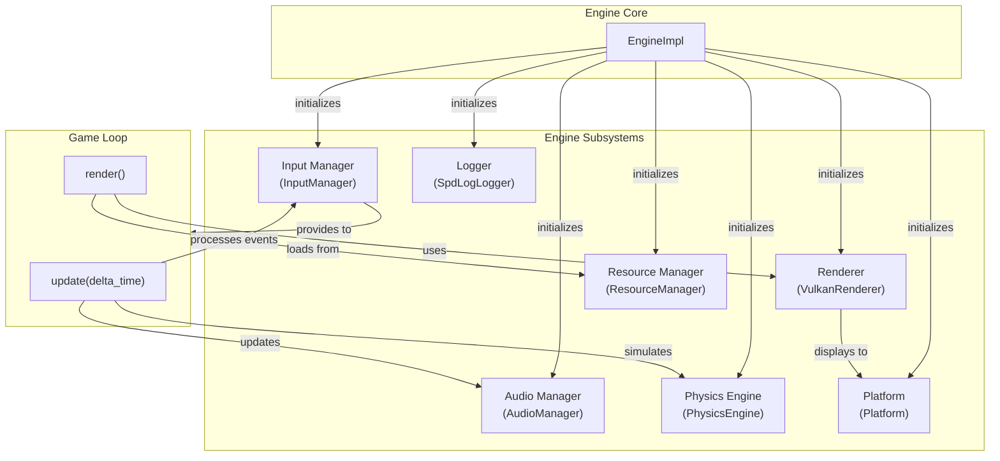
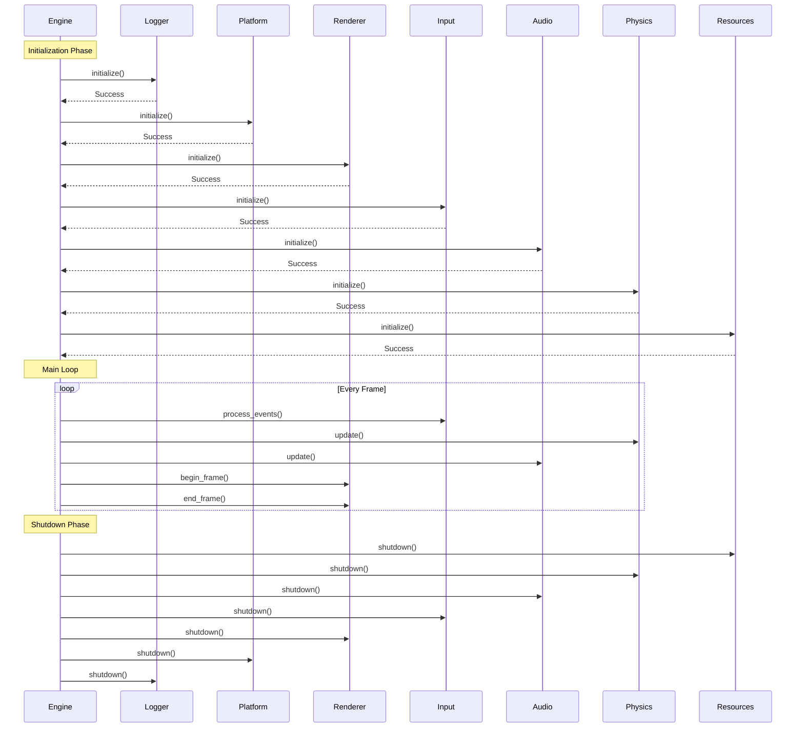

# Engine Subsystems

The OmniCpp Engine is composed of several independent subsystems that work together to provide a complete game development framework. Each subsystem is defined by an abstract interface, allowing for different implementations and easy testing.

## Subsystem Overview

| Subsystem | Interface | Header File | Status |
|-----------|-----------|-------------|--------|
| **Renderer** | [`IRenderer`](include/engine/IRenderer.hpp:19) | [`IRenderer.hpp`](include/engine/IRenderer.hpp) |
| **Input** | [`IInputManager`](include/engine/IInputManager.hpp:79) | [`IInputManager.hpp`](include/engine/IInputManager.hpp) |
| **Audio** | [`IAudioManager`](include/engine/IAudioManager.hpp:19) | [`IAudioManager.hpp`](include/engine/IAudioManager.hpp) |
| **Physics** | [`IPhysicsEngine`](include/engine/IPhysicsEngine.hpp:19) | [`IPhysicsEngine.hpp`](include/engine/IPhysicsEngine.hpp) |
| **Resources** | [`IResourceManager`](include/engine/IResourceManager.hpp:31) | [`IResourceManager.hpp`](include/engine/IResourceManager.hpp) |
| **Platform** | [`IPlatform`](include/engine/IPlatform.hpp:41) | [`IPlatform.hpp`](include/engine/IPlatform.hpp) |
| **Logger** | [`ILogger`](include/engine/ILogger.hpp) | [`ILogger.hpp`](include/engine/ILogger.hpp) |

## Subsystem Interaction

The subsystems interact through the central [`EngineImpl`](src/engine/Engine.cpp:28) class, which coordinates their initialization, updates, and shutdown:



## Initialization Order

Subsystems must be initialized in a specific order to satisfy dependencies:



### Initialization Order Rationale

1. **Logger** - Must be first to capture initialization logs from other subsystems
2. **Platform** - Creates the window and rendering surface needed by the renderer
3. **Renderer** - Depends on platform's window/surface
4. **Input** - Can be initialized after renderer (may need window handle)
5. **Audio** - Independent of other subsystems
6. **Physics** - Independent of other subsystems
7. **Resources** - Initialized last as it may depend on renderer for texture loading

### Shutdown Order

Shutdown occurs in **reverse order** of initialization to ensure proper cleanup:

```cpp
// From src/engine/Engine.cpp:109
void shutdown() override {
    if (!m_initialized) return;

    spdlog::info("Engine shutdown started");

    // Shutdown in reverse order
    if (m_resource_manager) {
        m_resource_manager->shutdown();
    }
    if (m_physics_engine) {
        m_physics_engine->shutdown();
    }
    if (m_audio_manager) {
        m_audio_manager->shutdown();
    }
    if (m_input_manager) {
        m_input_manager->shutdown();
    }
    if (m_renderer) {
        m_renderer->shutdown();
    }
    if (m_platform) {
        m_platform->shutdown();
    }

    spdlog::info("Engine shutdown complete");
    spdlog::shutdown();
}
```

## Subsystem Details

### Renderer Subsystem

The renderer handles all graphics operations using Vulkan:

- **Implementation**: [`VulkanRenderer`](include/engine/render/VulkanRenderer.hpp:26)
- **Dependencies**: Platform (for window/surface), Resources (for assets)
- **Key Components**:
  - [`RenderPipeline`](include/engine/render/RenderPipeline.hpp:24) - Graphics pipeline state
  - [`ShaderManager`](include/engine/render/ShaderManager.hpp:30) - Shader loading and management
  - SwapChain - Framebuffer management

### Input Subsystem

The input manager captures and processes user input:

- **Implementation**: [`InputManager`](include/engine/input/InputManager.hpp:198)
- **Dependencies**: Platform (for window events)
- **Features**:
  - Keyboard state tracking
  - Mouse position and button tracking
  - Scroll wheel support
  - Callback-based event dispatching

### Audio Subsystem

The audio manager handles sound playback and mixing:

- **Implementation**: [`AudioManager`](include/engine/audio/AudioManager.hpp)
- **Dependencies**: None (independent)
- **Features**:
  - Sound loading from files
  - Playback control (play/stop)
  - Master volume control
  - Per-frame updates

### Physics Subsystem

The physics engine simulates rigid body dynamics:

- **Implementation**: [`PhysicsEngine`](include/engine/physics/PhysicsEngine.hpp)
- **Dependencies**: None (independent)
- **Features**:
  - Rigid body creation
  - Force application
  - Gravity configuration
  - Per-frame simulation

### Resource Subsystem

The resource manager handles asset loading and caching:

- **Implementation**: [`ResourceManager`](include/engine/resources/ResourceManager.hpp:54)
- **Dependencies**: Renderer (for texture loading)
- **Features**:
  - Mesh loading
  - Texture loading
  - Material loading
  - Shader loading
  - Reference counting
  - Memory usage tracking

### Platform Subsystem

The platform subsystem abstracts OS-specific functionality:

- **Implementation**: [`Platform`](include/engine/platform/platform.hpp)
- **Dependencies**: None (lowest level)
- **Features**:
  - Window creation and management
  - Time management
  - File system operations
  - Platform detection (Windows/Linux/macOS)

### Logger Subsystem

The logger provides structured logging throughout the engine:

- **Implementation**: [`SpdLogLogger`](include/engine/logging/SpdLogLogger.hpp)
- **Dependencies**: None (lowest level)
- **Features**:
  - Multiple log levels (trace, debug, info, warning, error)
  - File and console output
  - Configuration via JSON

## Creating Custom Subsystems

To create a custom subsystem implementation:

1. **Inherit from the appropriate interface**
2. **Implement all virtual methods**
3. **Register with the engine** via [`EngineConfig`](include/engine/IEngine.hpp:26)

### Example: Custom Renderer

```cpp
#include "engine/IRenderer.hpp"

namespace myengine {

class CustomRenderer : public omnicpp::IRenderer {
public:
    bool initialize() override {
        // Your initialization code
        return true;
    }

    void shutdown() override {
        // Your cleanup code
    }

    bool begin_frame() override {
        // Begin frame
        return true;
    }

    void end_frame() override {
        // End frame
    }

    uint32_t get_frame_number() const override {
        return m_frame_number;
    }

private:
    uint32_t m_frame_number = 0;
};

} // namespace myengine
```

### Registering Custom Subsystem

```cpp
#include "engine/Engine.hpp"

int main() {
    // Create custom renderer
    auto custom_renderer = std::make_unique<myengine::CustomRenderer>();

    // Configure engine with custom subsystem
    omnicpp::EngineConfig config{};
    config.renderer = custom_renderer.get();

    // Create engine
    omnicpp::IEngine* engine = omnicpp::create_engine(config);

    // ... game loop ...

    omnicpp::destroy_engine(engine);
    return 0;
}
```

## Troubleshooting

### Subsystem Initialization Fails

**Symptom**: Engine initialization returns `false` with error in logs

**Possible causes**:
- Subsystem dependency not satisfied
- Missing required libraries
- Invalid configuration

**Solution**: Check initialization order and ensure all dependencies are available.

### Subsystem Not Updating

**Symptom**: Subsystem methods called but no effect visible

**Possible causes**:
- Subsystem pointer is `nullptr`
- Update method not called in main loop
- Subsystem disabled

**Solution**: Verify subsystem is properly initialized and update loop is calling the correct methods.

### Memory Leaks on Shutdown

**Symptom**: Memory not released after engine shutdown

**Possible causes**:
- Subsystem not properly cleaned up
- Circular references between subsystems
- Resources not unloaded

**Solution**: Ensure shutdown order is correct and all resources are released.

## Related Documentation

- [Engine Overview](index.md) - High-level engine architecture
- [Renderer Reference](renderer.md) - Detailed renderer API
- [Input Manager Reference](input-manager.md) - Input handling API
- [Resource Manager Reference](resource-manager.md) - Resource loading API
