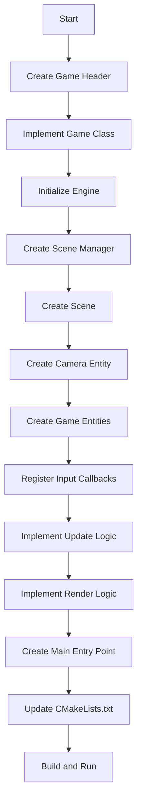

# Creating Games Tutorial

This tutorial walks you through creating a new game from scratch using the OmniCPP-template engine. You'll learn how to set up a game class, initialize engine subsystems, implement the game loop, handle input, and add game objects.

## Prerequisites

Before starting this tutorial, ensure you have:

- **Engine built**: Run `python OmniCppController.py build` to build the engine library
- **CMake configured**: Project uses CMake for build configuration
- **Dependencies installed**: Vulkan SDK, spdlog, GLM, STB
- **C++23 compiler**: GCC 13+, Clang 16+, or MSVC 2022+

## Tutorial Overview

You will create a simple game with:
- A 3D scene with a camera
- A rotating cube entity
- Keyboard input for camera movement
- Basic game loop with update and render phases

## Step 1: Create Game Class Header

Create a new header file for your game class:

```cpp
// include/game/MyGame.hpp
#pragma once

#include "engine/IEngine.hpp"
#include "engine/scene/Scene.hpp"
#include "engine/scene/SceneManager.hpp"
#include "engine/ecs/Entity.hpp"
#include "engine/ecs/Camera/CameraComponent.hpp"
#include <memory>

namespace omnicpp {
namespace game {

class MyGame {
public:
    explicit MyGame(IEngine* engine);
    ~MyGame();

    // Disable copying
    MyGame(const MyGame&) = delete;
    MyGame& operator=(const MyGame&) = delete;

    // Enable moving
    MyGame(MyGame&&) noexcept = default;
    MyGame& operator=(MyGame&&) noexcept = default;

    bool initialize();
    void shutdown();
    void update(float delta_time);
    void render();
    int run();

private:
    void handle_input(const input::InputEvent& event);
    void update_camera(float delta_time);

private:
    IEngine* m_engine = nullptr;
    std::unique_ptr<scene::SceneManager> m_scene_manager;
    scene::Scene* m_scene = nullptr;
    std::unique_ptr<ecs::Entity> m_camera_entity;
    std::unique_ptr<ecs::Entity> m_cube_entity;
    bool m_initialized = false;
    bool m_running = false;
};

} // namespace game
} // namespace omnicpp
```

## Step 2: Implement Game Class

Create the implementation file:

```cpp
// src/game/MyGame.cpp
#include "game/MyGame.hpp"
#include "engine/ecs/Entity.hpp"
#include "engine/ecs/TransformComponent.hpp"
#include "engine/ecs/MeshComponent.hpp"
#include "engine/ecs/Camera/CameraComponent.hpp"
#include "engine/scene/Scene.hpp"
#include "engine/scene/SceneManager.hpp"
#include "engine/input/InputManager.hpp"
#include "engine/IRenderer.hpp"
#include "engine/IEngine.hpp"
#include <iostream>
#include <cmath>

namespace omnicpp {
namespace game {

MyGame::MyGame(IEngine* engine)
    : m_engine(engine) {
}

MyGame::~MyGame() {
    shutdown();
}

bool MyGame::initialize() {
    std::cout << "Initializing my game..." << std::endl;

    // Get engine subsystems
    auto renderer = m_engine->get_renderer();
    auto input_manager = m_engine->get_input_manager();
    auto resource_manager = m_engine->get_resource_manager();

    if (!renderer || !input_manager || !resource_manager) {
        std::cerr << "Failed to get engine subsystems" << std::endl;
        return false;
    }

    // Create scene manager
    m_scene_manager = std::make_unique<SceneManager>();

    // Create main scene
    m_scene = new Scene("MainScene");
    m_scene_manager->add_scene(std::unique_ptr<scene::Scene>(m_scene));
    m_scene_manager->load_scene("MainScene");

    // Create camera entity
    m_camera_entity = std::make_unique<Entity>(1, "MainCamera");
    auto camera_component = m_camera_entity->add_component<CameraComponent>(
        CameraType::PERSPECTIVE,
        60.0f,  // FOV
        0.1f,   // Near plane
        100.0f   // Far plane
    );
    auto camera_transform = m_camera_entity->add_component<TransformComponent>();
    camera_transform->set_position(Vec3{0.0f, 2.0f, 5.0f});
    camera_transform->set_rotation(Vec3{0.0f, 0.0f, 0.0f});

    m_scene->add_entity(std::move(m_camera_entity));
    m_scene->set_active_camera(camera_component);

    // Create cube entity
    m_cube_entity = std::make_unique<Entity>(2, "Cube");
    auto cube_transform = m_cube_entity->add_component<TransformComponent>();
    cube_transform->set_position(Vec3{0.0f, 0.0f, 0.0f});
    cube_transform->set_rotation(Vec3{0.0f, 0.0f, 0.0f});
    cube_transform->set_scale(Vec3{1.0f, 1.0f, 1.0f});

    // Note: Mesh component would be added when mesh loading is implemented
    // For now, we just have the transform

    m_scene->add_entity(std::move(m_cube_entity));

    // Register input callback
    input_manager->register_callback([this](const input::InputEvent& event) {
        this->handle_input(event);
    });

    m_initialized = true;
    std::cout << "My game initialized successfully" << std::endl;
    return true;
}

void MyGame::shutdown() {
    if (!m_initialized) {
        return;
    }

    std::cout << "Shutting down my game..." << std::endl;

    m_scene_manager->unload_scene();
    m_scene_manager.reset();
    m_camera_entity.reset();
    m_cube_entity.reset();

    m_initialized = false;
}

void MyGame::update(float delta_time) {
    if (!m_initialized) {
        return;
    }

    // Update scene
    m_scene_manager->update(delta_time);

    // Update camera based on input
    update_camera(delta_time);

    // Rotate cube
    auto cube_transform = m_cube_entity->get_component<TransformComponent>();
    if (cube_transform) {
        Vec3 rotation = cube_transform->get_rotation();
        rotation.y += 30.0f * delta_time;  // Rotate 30 degrees per second
        cube_transform->set_rotation(rotation);
    }
}

void MyGame::render() {
    if (!m_initialized) {
        return;
    }

    // Render scene
    m_scene_manager->render();
}

void MyGame::handle_input(const input::InputEvent& event) {
    if (event.type == input::EventType::KEY_PRESS) {
        if (event.key_code == input::KeyCode::ESCAPE) {
            spdlog::info("MyGame: ESCAPE pressed, stopping game");
            m_running = false;
        }
    }
}

void MyGame::update_camera(float delta_time) {
    auto camera_transform = m_camera_entity->get_component<TransformComponent>();
    if (!camera_transform) {
        return;
    }

    Vec3 position = camera_transform->get_position();
    Vec3 rotation = camera_transform->get_rotation();

    // Camera movement speed
    const float move_speed = 5.0f;
    const float rotate_speed = 90.0f;

    // Get input manager
    auto input_manager = m_engine->get_input_manager();

    // Forward/Backward (W/S)
    if (input_manager->is_key_pressed(input::KeyCode::W)) {
        position.z -= move_speed * delta_time;
    }
    if (input_manager->is_key_pressed(input::KeyCode::S)) {
        position.z += move_speed * delta_time;
    }

    // Left/Right (A/D)
    if (input_manager->is_key_pressed(input::KeyCode::A)) {
        position.x -= move_speed * delta_time;
    }
    if (input_manager->is_key_pressed(input::KeyCode::D)) {
        position.x += move_speed * delta_time;
    }

    // Up/Down (Space/Shift)
    if (input_manager->is_key_pressed(input::KeyCode::SPACE)) {
        position.y += move_speed * delta_time;
    }
    if (input_manager->is_key_pressed(input::KeyCode::LEFT_SHIFT)) {
        position.y -= move_speed * delta_time;
    }

    // Mouse rotation
    float mouse_delta_x, mouse_delta_y;
    input_manager->get_mouse_delta(mouse_delta_x, mouse_delta_y);

    rotation.y += mouse_delta_x * rotate_speed * delta_time;
    rotation.x += mouse_delta_y * rotate_speed * delta_time;

    // Clamp rotation
    rotation.x = std::max(-89.0f, std::min(89.0f, rotation.x));

    camera_transform->set_position(position);
    camera_transform->set_rotation(rotation);
}

int MyGame::run() {
    if (!m_initialized) {
        spdlog::error("MyGame: Game not initialized");
        return 1;
    }

    spdlog::info("MyGame: Starting game loop...");
    spdlog::info("MyGame: Controls:");
    spdlog::info("MyGame:   W/S - Move Forward/Backward");
    spdlog::info("MyGame:   A/D - Move Left/Right");
    spdlog::info("MyGame:   Space/Shift - Move Up/Down");
    spdlog::info("MyGame:   Mouse - Look around");
    spdlog::info("MyGame:   ESC - Exit");

    m_running = true;

    // Simple game loop
    while (m_running) {
        float delta_time = 0.016f;  // 60 FPS

        // Process input
        auto input_manager = m_engine->get_input_manager();
        input_manager->process_events();

        // Update game
        update(delta_time);

        // Render
        render();

        // Update engine
        m_engine->update(delta_time);
    }

    spdlog::info("MyGame: Game loop ended");
    return 0;
}

} // namespace game
} // namespace omnicpp
```

## Step 3: Create Main Entry Point

Create a main.cpp file to run your game:

```cpp
// src/game/MyMain.cpp
#include "game/MyGame.hpp"
#include "engine/Engine.hpp"
#include <iostream>

int main(int argc, char* argv[]) {
    (void)argc;
    (void)argv;

    std::cout << "=== My Game ===" << std::endl;

    // Create engine configuration
    omnicpp::EngineConfig config;
    config.renderer = nullptr;  // Use default renderer
    config.input_manager = nullptr;  // Use default input manager
    config.audio_manager = nullptr;  // Use default audio manager
    config.physics_engine = nullptr;  // Use default physics engine
    config.resource_manager = nullptr;  // Use default resource manager
    config.logger = nullptr;  // Use default logger
    config.platform = nullptr;  // Use default platform

    // Create engine
    omnicpp::IEngine* engine = omnicpp::create_engine(config);
    if (!engine) {
        std::cerr << "Failed to create engine!" << std::endl;
        return 1;
    }

    std::cout << "Engine created successfully!" << std::endl;
    std::cout << "Engine version: " << omnicpp::engine_get_version() << std::endl;

    // Create and run game
    omnicpp::game::MyGame game(engine);

    if (!game.initialize()) {
        std::cerr << "Failed to initialize game!" << std::endl;
        omnicpp::destroy_engine(engine);
        return 1;
    }

    int exit_code = game.run();
    game.shutdown();

    // Cleanup
    engine->shutdown();
    omnicpp::destroy_engine(engine);

    std::cout << "=== Game Complete ===" << std::endl;
    return exit_code;
}
```

## Step 4: Update CMakeLists.txt

Add your game to the build system:

```cmake
# Add to src/game/CMakeLists.txt
add_executable(my_game
    MyGame.cpp
    MyMain.cpp
)

target_link_libraries(my_game
    PRIVATE
    omnicpp_engine
    omnicpp_ecs
    omnicpp_scene
    omnicpp_input
)
```

## Game Creation Flow



## Step 5: Build and Run

Build your game using the OmniCppController:

```bash
# Build the game
python OmniCppController.py build --target my_game

# Run the game
python OmniCppController.py run --target my_game
```

## Adding Game Objects

To add more game objects, create entities with components:

```cpp
// Create a new entity
auto entity = std::make_unique<Entity>(3, "Player");

// Add transform component
auto transform = entity->add_component<TransformComponent>();
transform->set_position(Vec3{0.0f, 1.0f, 0.0f});

// Add mesh component (when implemented)
auto mesh = entity->add_component<MeshComponent>();
mesh->set_mesh("player_mesh.obj");

// Add to scene
m_scene->add_entity(std::move(entity));
```

## Handling Input

The engine provides two ways to handle input:

### Event-Driven Input

Register callbacks for specific events:

```cpp
input_manager->register_callback([this](const input::InputEvent& event) {
    if (event.type == input::EventType::KEY_PRESS) {
        if (event.key_code == input::KeyCode::SPACE) {
            // Handle space key press
        }
    }
});
```

### Polling Input

Check key state each frame:

```cpp
if (input_manager->is_key_pressed(input::KeyCode::W)) {
    // Move forward
}
```

## Implementing Game Logic

Your game logic goes in the `update()` method:

```cpp
void MyGame::update(float delta_time) {
    // Update all game entities
    for (auto& entity : m_entities) {
        entity->update(delta_time);
    }

    // Check collisions
    check_collisions();

    // Update game state
    update_game_state(delta_time);
}
```

## Common Issues and Solutions

### Engine Not Found

**Problem**: `Failed to create engine!` error

**Solution**: Ensure engine library is built before running game:

```bash
python OmniCppController.py build
```

### Input Not Working

**Problem**: Keyboard input not responding

**Solution**: Ensure `process_events()` is called each frame:

```cpp
auto input_manager = m_engine->get_input_manager();
input_manager->process_events();
```

### Entities Not Visible

**Problem**: Entities created but not rendering

**Solution**: Check that:
1. Entity is added to scene: `m_scene->add_entity(std::move(entity))`
2. Camera is set: `m_scene->set_active_camera(camera_component)`
3. Transform component has valid position

### Build Errors

**Problem**: CMake configuration fails

**Solution**: Check that:
1. All required headers are included
2. CMakeLists.txt is updated with new source files
3. Dependencies are linked correctly

## Next Steps

- [ ] Add mesh loading for 3D models
- [ ] Implement physics for collision detection
- [ ] Add audio for sound effects
- [ ] Create multiple scenes for game states
- [ ] Add UI overlay for score and HUD

## Related Documentation

- [Game Lifecycle Guide](game-lifecycle.md) - Understanding game phases
- [Examples Reference](examples.md) - Available game examples
- [Engine Overview](../engine/index.md) - Engine subsystems
- [ECS Architecture](../engine/ecs.md) - Entity Component System
- [Input Manager Reference](../engine/input-manager.md) - Input handling API
