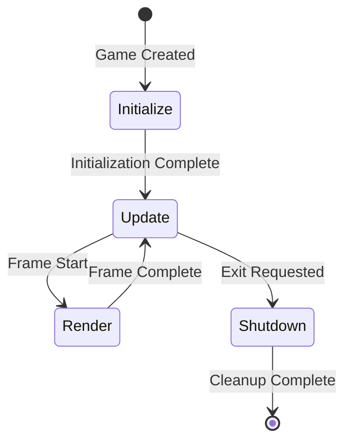
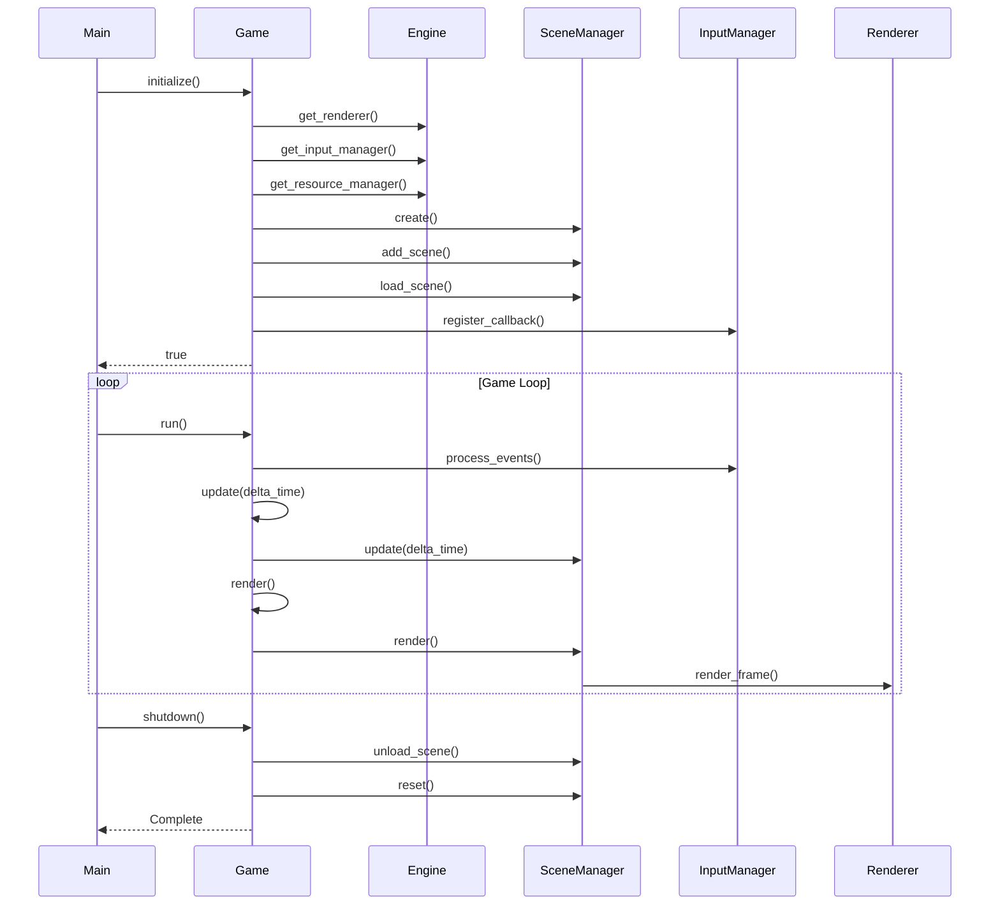

# Game Lifecycle Guide

Understanding the game lifecycle is essential for building robust, maintainable games. This guide explains the four main phases of a game's lifecycle: Initialize, Update, Render, and Shutdown.

## Overview

Every game in OmniCPP-template follows a consistent lifecycle pattern:



## Initialize Phase

The initialize phase sets up all game resources and subsystems. This happens once when the game starts.

### Purpose

- Create and configure engine subsystems
- Set up scene manager and scenes
- Create initial entities and components
- Register input callbacks
- Load initial resources

### Implementation

From [`DemoGame::initialize()`](include/game/DemoGame.hpp:64):

```cpp
bool DemoGame::initialize() {
    std::cout << "Initializing demo game..." << std::endl;

    // Get engine subsystems
    auto renderer = m_engine->get_renderer();
    auto input_manager = m_engine->get_input_manager();
    auto resource_manager = m_engine->get_resource_manager();

    if (!renderer || !input_manager || !resource_manager) {
        std::cerr << "Failed to get engine subsystems" << std::endl;
        return false;
    }

    // Create scene manager
    m_scene_manager = std::make_unique<SceneManager>();

    // Create main scene
    m_scene = std::make_unique<Scene>("MainScene");
    m_scene_manager->add_scene(std::move(m_scene));
    m_scene_manager->load_scene("MainScene");

    // Create camera entity
    m_camera_entity = std::make_unique<Entity>(1, "MainCamera");
    auto camera_component = m_camera_entity->add_component<CameraComponent>(
        CameraType::PERSPECTIVE, 60.0f, 0.1f, 100.0f
    );
    auto camera_transform = m_camera_entity->add_component<TransformComponent>();
    camera_transform->set_position(Vec3{0.0f, 2.0f, 5.0f});

    m_scene->add_entity(std::move(m_camera_entity));
    m_scene->set_active_camera(camera_component);

    // Create game entities
    m_cube_entity = std::make_unique<Entity>(2, "Cube");
    auto cube_transform = m_cube_entity->add_component<TransformComponent>();
    cube_transform->set_position(Vec3{0.0f, 0.0f, 0.0f});
    m_scene->add_entity(std::move(m_cube_entity));

    // Register input callback
    input_manager->register_callback([this](const input::InputEvent& event) {
        this->handle_input(event);
    });

    m_initialized = true;
    return true;
}
```

### Best Practices

**Do:**
- Validate all subsystem pointers before use
- Set up scene manager before creating entities
- Register input callbacks early
- Set active camera before rendering
- Return `false` on initialization failure

**Don't:**
- Assume subsystems are available without checking
- Create entities without adding them to scenes
- Forget to set the initialization flag

### Common Issues

| Issue | Cause | Solution |
|--------|--------|----------|
| Null pointer crash | Subsystem not initialized | Check return values from `get_*()` methods |
| Entities not visible | Not added to scene | Call `scene->add_entity()` after creation |
| Input not working | Callback not registered | Call `register_callback()` in initialize |

## Update Phase

The update phase runs every frame and handles all game logic, physics, and state changes.

### Purpose

- Process input events
- Update entity positions and rotations
- Run physics simulation
- Check collisions
- Update game state (score, health, etc.)

### Implementation

From [`DemoGame::update()`](include/game/DemoGame.hpp:75):

```cpp
void DemoGame::update(float delta_time) {
    if (!m_initialized) {
        return;
    }

    // Update scene
    m_scene_manager->update(delta_time);

    // Update camera based on input
    update_camera(delta_time);

    // Rotate cube
    auto cube_transform = m_cube_entity->get_component<TransformComponent>();
    if (cube_transform) {
        Vec3 rotation = cube_transform->get_rotation();
        rotation.y += 30.0f * delta_time;  // Rotate 30 degrees per second
        cube_transform->set_rotation(rotation);
    }
}
```

### Delta Time

Delta time is the time elapsed since the last frame, measured in seconds. It ensures consistent game speed regardless of frame rate:

```cpp
// Good: Frame-rate independent movement
position.x += speed * delta_time;

// Bad: Frame-rate dependent movement
position.x += speed;  // Will run faster at higher FPS
```

### Best Practices

**Do:**
- Use delta time for all movement and animations
- Check initialization flag before updating
- Update scene manager before individual entities
- Clamp values to prevent overflow
- Use fixed time steps for physics

**Don't:**
- Hardcode movement values without delta time
- Skip initialization checks
- Update entities that don't exist
- Mix update logic with rendering

### Common Issues

| Issue | Cause | Solution |
|--------|--------|----------|
| Game runs too fast/slow | Not using delta time | Multiply all movement by `delta_time` |
| Physics jitter | Variable delta time | Use fixed time step for physics |
| Entities not moving | Update not called | Ensure `update()` is called in game loop |

## Render Phase

The render phase draws the current state of the game to the screen.

### Purpose

- Clear the screen
- Render all visible entities
- Apply shaders and effects
- Present the final frame

### Implementation

From [`DemoGame::render()`](include/game/DemoGame.hpp:80):

```cpp
void DemoGame::render() {
    if (!m_initialized) {
        return;
    }

    // Render scene
    m_scene_manager->render();
}
```

The scene manager handles:
- Setting up the render pipeline
- Sorting entities by depth
- Applying camera transforms
- Rendering each entity's mesh
- Presenting the frame

### Best Practices

**Do:**
- Check initialization flag before rendering
- Let scene manager handle entity rendering
- Ensure camera is set before rendering
- Use efficient rendering techniques (culling, batching)

**Don't:**
- Render entities individually without scene manager
- Mix rendering logic with game logic
- Render without clearing the screen

### Common Issues

| Issue | Cause | Solution |
|--------|--------|----------|
| Black screen | Camera not set | Call `scene->set_active_camera()` |
| Entities not visible | Not in active scene | Ensure scene is loaded with `load_scene()` |
| Flickering | Double buffering issue | Check renderer configuration |

## Shutdown Phase

The shutdown phase cleans up all resources when the game exits.

### Purpose

- Unload scenes and entities
- Release engine resources
- Unregister input callbacks
- Clean up memory

### Implementation

From [`DemoGame::shutdown()`](include/game/DemoGame.hpp:69):

```cpp
void DemoGame::shutdown() {
    if (!m_initialized) {
        return;
    }

    std::cout << "Shutting down demo game..." << std::endl;

    m_scene_manager->unload_scene();
    m_scene_manager.reset();
    m_camera_entity.reset();
    m_cube_entity.reset();

    m_initialized = false;
}
```

### Best Practices

**Do:**
- Check initialization flag before shutdown
- Unload scenes before destroying scene manager
- Reset smart pointers to release memory
- Set initialization flag to false

**Don't:**
- Shutdown without checking if initialized
- Forget to unload scenes
- Leave dangling pointers

### Common Issues

| Issue | Cause | Solution |
|--------|--------|----------|
| Memory leak | Not resetting smart pointers | Use `.reset()` on unique_ptr |
| Crash on exit | Double shutdown | Check initialization flag first |

## Complete Lifecycle Flow



## Game Loop Implementation

The main loop ties all phases together:

```cpp
int MyGame::run() {
    if (!m_initialized) {
        spdlog::error("Game not initialized");
        return 1;
    }

    m_running = true;

    // Game loop
    while (m_running) {
        float delta_time = 0.016f;  // 60 FPS

        // Process input
        auto input_manager = m_engine->get_input_manager();
        input_manager->process_events();

        // Update game
        update(delta_time);

        // Render
        render();

        // Update engine
        m_engine->update(delta_time);
    }

    return 0;
}
```

## Phase-Specific Considerations

### Initialize Phase

- **Performance**: Load resources asynchronously when possible
- **Memory**: Pre-allocate frequently used objects
- **Error Handling**: Return early on failure, don't continue

### Update Phase

- **Performance**: Use spatial partitioning for many entities
- **Determinism**: Use fixed time steps for physics
- **Thread Safety**: Avoid race conditions in multi-threaded updates

### Render Phase

- **Performance**: Minimize draw calls with batching
- **Quality**: Use anti-aliasing and proper filtering
- **Optimization**: Implement frustum culling

### Shutdown Phase

- **Safety**: Handle shutdown gracefully even if crashed
- **Cleanup**: Release all resources in reverse order of creation
- **Validation**: Check for memory leaks with tools

## Troubleshooting

### Initialization Fails

**Symptom**: [`initialize()`](include/game/Game.hpp:28) returns `false`

**Debug steps**:
1. Check engine subsystem pointers are not null
2. Verify Vulkan SDK is installed
3. Check log files for specific errors
4. Ensure all dependencies are linked

### Update Loop Hangs

**Symptom**: Game freezes during update

**Debug steps**:
1. Check for infinite loops
2. Verify delta time is not zero
3. Look for division by zero
4. Check for deadlocks in multi-threaded code

### Render Fails

**Symptom**: Nothing appears on screen

**Debug steps**:
1. Verify camera is set and positioned
2. Check entities are in active scene
3. Enable debug rendering to see what's drawn
4. Check renderer initialization

### Shutdown Crashes

**Symptom**: Application crashes on exit

**Debug steps**:
1. Check for double-free of resources
2. Verify smart pointers are used correctly
3. Ensure callbacks are unregistered
4. Run with memory leak detector

## Related Documentation

- [Creating Games Tutorial](creating-games.md) - Step-by-step game creation
- [Examples Reference](examples.md) - Available game examples
- [Engine Overview](../engine/index.md) - Engine subsystems
- [Scene Management](../engine/scene-management.md) - Scene graph details
- [Renderer Reference](../engine/renderer.md) - Rendering API
