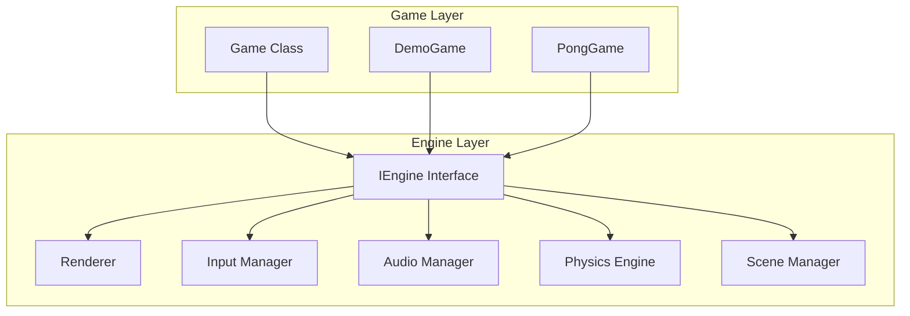
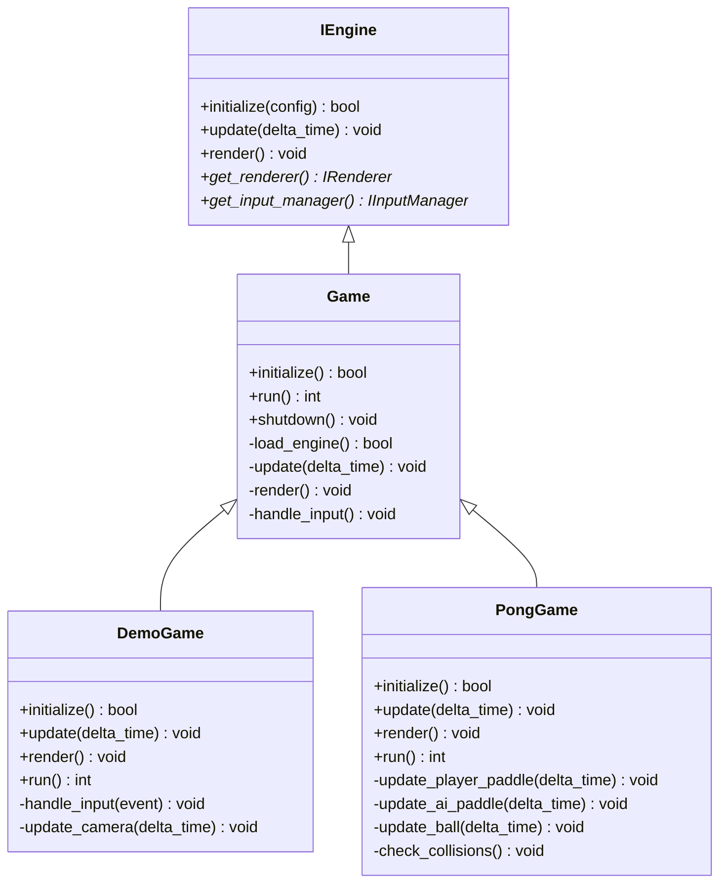
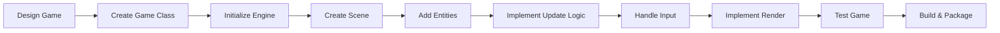

# Game Development Overview

Game development with OmniCPP-template follows a modular architecture where games are built on top of the engine subsystems. The engine provides rendering, input handling, physics, audio, and resource management, while your game code focuses on gameplay logic and entity management.

## Architecture

The game development architecture separates concerns between the **engine** (platform-independent subsystems) and **game** (gameplay-specific logic):



### Key Components

| Component | Location | Purpose |
|-----------|-----------|---------|
| **Game Base** | [`include/game/Game.hpp`](include/game/Game.hpp:18) | Base game class with dynamic engine loading |
| **DemoGame** | [`include/game/DemoGame.hpp`](include/game/DemoGame.hpp:39) | Simple 3D scene with rotating cube |
| **PongGame** | [`include/game/PongGame.hpp`](include/game/PongGame.hpp:43) | Complete 3D Pong game with AI |
| **Game Utils** | [`include/game/utils/`](include/game/utils/) | Game-specific utilities |

## Game Class Hierarchy

The project provides multiple game implementations demonstrating different complexity levels:



## Integration with Engine Subsystems

Games interact with engine subsystems through the [`IEngine`](include/engine/IEngine.hpp:39) interface:

### Renderer
Access via [`get_renderer()`](include/engine/IEngine.hpp:70) to handle graphics rendering. The renderer supports Vulkan-based rendering with scene graph integration.

### Input Manager
Access via [`get_input_manager()`](include/engine/IEngine.hpp:76) to handle keyboard, mouse, and gamepad input. Register callbacks for event-driven input handling.

### Scene Manager
Games use the [`SceneManager`](include/engine/scene/SceneManager.hpp) to manage multiple scenes and entities. Each scene contains entities with components.

### Physics Engine
Access via [`get_physics_engine()`](include/engine/IEngine.hpp:88) for rigid body simulation and collision detection.

### Resource Manager
Access via [`get_resource_manager()`](include/engine/IEngine.hpp:94) to load and cache assets like meshes, textures, and audio files.

## Getting Started with Game Development

### Prerequisites

Before creating a game, ensure you have:

- **Engine built**: Run `python OmniCppController.py build` to build the engine library
- **Dependencies installed**: Vulkan SDK, spdlog, GLM, STB
- **CMake configured**: Project uses CMake for build configuration

### Quick Start

1. **Choose a base class**: Start with [`Game`](include/game/Game.hpp:18) for dynamic loading or create a custom game class
2. **Initialize engine**: Create [`EngineConfig`](include/engine/IEngine.hpp:26) and call [`create_engine()`](include/engine/Engine.hpp:48)
3. **Implement game loop**: Override [`update()`](include/game/Game.hpp:60) and [`render()`](include/game/Game.hpp:65) methods
4. **Handle input**: Register input callbacks with the input manager
5. **Add entities**: Create entities with components for your game objects

## Dynamic Loading Architecture

The [`Game`](include/game/Game.hpp:18) class demonstrates dynamic engine loading:

```cpp
// From include/game/Game.hpp
class Game {
private:
    void* m_engine_handle = nullptr;
    IEngine* m_engine = nullptr;
    
    using CreateEngineFunc = IEngine*(*)(const EngineConfig&);
    using DestroyEngineFunc = void(*)(IEngine*);
    using GetVersionFunc = const char* (*)();
    
    CreateEngineFunc m_create_engine = nullptr;
    DestroyEngineFunc m_destroy_engine = nullptr;
    GetVersionFunc m_get_version = nullptr;
};
```

This enables:
- **Hot-swapping** of engine implementations without recompiling game code
- **Version checking** at runtime
- **Plugin architecture** for extending engine functionality

## Game Development Workflow



## Common Patterns

### Entity-Component System

Games use the ECS pattern for flexible entity management:

```cpp
// Create entity
auto entity = std::make_unique<Entity>(1, "Player");

// Add components
auto transform = entity->add_component<TransformComponent>();
auto mesh = entity->add_component<MeshComponent>();

// Add to scene
scene->add_entity(std::move(entity));
```

### Input Handling

Register callbacks for event-driven input:

```cpp
input_manager->register_callback([this](const input::InputEvent& event) {
    this->handle_input(event);
});
```

### Scene Management

Use scene manager for multiple game states:

```cpp
m_scene_manager = std::make_unique<SceneManager>();
m_scene = std::make_unique<Scene>("MainMenu");
m_scene_manager->add_scene(std::move(m_scene));
m_scene_manager->load_scene("MainMenu");
```

## Known Limitations

- **Single-threaded game loop**: Game logic runs on main thread
- **Limited networking**: Network subsystem interface exists but implementation is incomplete
- **No scripting support**: Script manager interface exists but Lua/Python integration is not implemented
- **Basic physics**: Physics engine provides only rigid body simulation

## Related Documentation

- [Creating Games Tutorial](creating-games.md) - Step-by-step game creation guide
- [Game Lifecycle Guide](game-lifecycle.md) - Understanding game phases
- [Examples Reference](examples.md) - Available game examples
- [Engine Overview](../engine/index.md) - Engine subsystems and architecture
- [ECS Architecture](../engine/ecs.md) - Entity Component System details
- [Scene Management](../engine/scene-management.md) - Scene graph and transitions

## Troubleshooting

### Game Fails to Initialize

**Symptom**: [`initialize()`](include/game/Game.hpp:28) returns `false`

**Possible causes**:
- Engine library not found in expected path
- Vulkan SDK not installed
- Missing dependencies

**Solution**: Check build logs and ensure engine library is built before running game.

### Input Not Responding

**Symptom**: Input callbacks not firing

**Possible causes**:
- Input manager not initialized
- Callback not registered
- Event processing not called

**Solution**: Ensure [`process_events()`](include/engine/IInputManager.hpp:100) is called each frame.

### Entities Not Rendering

**Symptom**: Entities created but not visible

**Possible causes**:
- Entity not added to scene
- Transform component not set
- Camera not positioned correctly
- Mesh component not added

**Solution**: Verify entity is added to active scene and camera is set.
