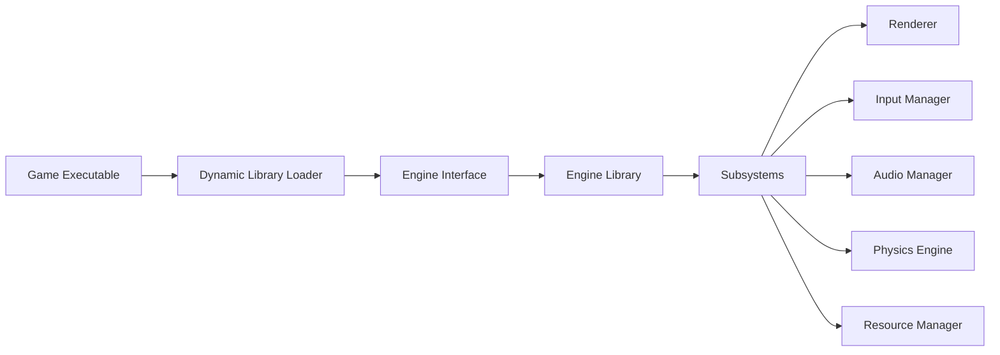

# Getting Started

Welcome to OmniCPP-template, a production-ready C++23 game engine template designed for modern cross-platform development.

## What is OmniCPP-template?

OmniCPP-template is a comprehensive C++23 best practice template that provides a complete game engine framework with dynamic linking architecture. The project enables you to build games and applications using modern C++ standards while supporting multiple compilers, platforms, and package managers.

## Architecture Overview

The template follows a **dynamic linking architecture** where game executable dynamically loads engine library at runtime:

**Key architectural benefits:**
- **Modular design** - Engine and game are separate, enabling independent updates
- **Plugin-based extensibility** - Load different engine implementations at runtime
- **Cross-platform compatibility** - Same codebase works on Windows, Linux, and WebAssembly

## What You Can Build

With OmniCPP-template, you can create:

- **2D and 3D games** using Vulkan or OpenGL rendering
- **Interactive applications** with Qt6 UI framework
- **Cross-platform applications** targeting desktop and web
- **Game engines** by extending the provided engine framework
- **Standalone libraries** using the included utility components

## Estimated Time to Get Started

| Task | Estimated Time |
|-------|---------------|
| Prerequisites setup | 15-30 minutes |
| Installation | 10-15 minutes |
| First build | 5-10 minutes |
| **Total** | **30-60 minutes** |

## Next Steps

1. **[Prerequisites](prerequisites.md)** - Verify your system meets requirements
2. **[Installation](installation.md)** - Set up your development environment
3. **[Quick Start](quick-start.md)** - Build and run your first project

## Additional Resources

- [Architecture Documentation](../architecture/overview.md)
- [API Reference](../api/overview.md)
- [User Guides](../user-guide-build-system.md)
- [Troubleshooting](../troubleshooting.md)
