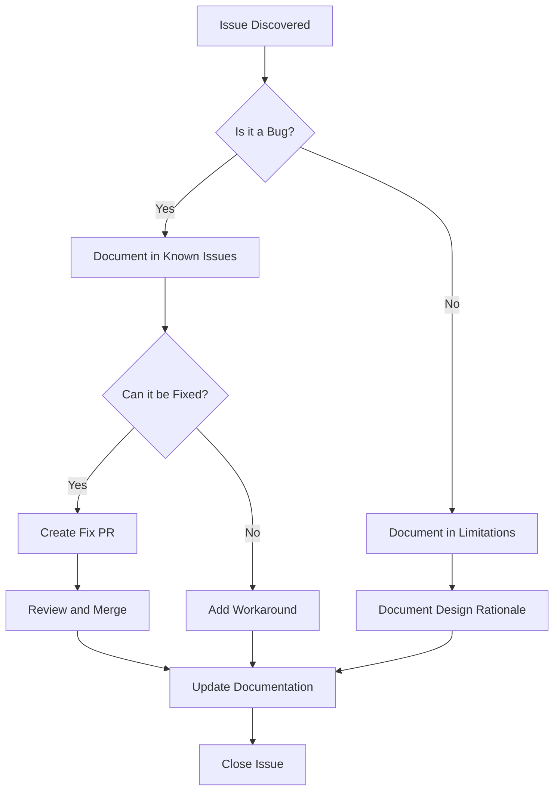

# Known Issues

> **TL;DR:** This page documents all known bugs and defects in the OmniCpp template that have been identified but not yet fixed.

## Overview

This page lists all known bugs and defects in the OmniCpp template. These are issues that are not working as intended and should be fixed in future releases.

## Critical Issues

### OmniCppController.py Line 1292: Logger Error

**Severity:** Medium  
**Status:** Open  
**Location:** [`OmniCppController.py:1292`](../../OmniCppController.py:1292)

**Description:**
The `main()` function uses `self.logger.error` but `self` doesn't exist in the function context. This will cause a `NameError` when the code reaches this line.

**Code:**
```python
def main():
    # ... other code ...
    self.logger.error("Error message")  # BUG: self doesn't exist here
```

**Workaround:**
Use a module-level logger instead of `self.logger`:
```python
import logging

logger = logging.getLogger(__name__)

def main():
    logger.error("Error message")  # This works
```

**Related:** [Configuration](../configuration/index.md)

---

## High Priority Issues

### Test Execution Not Implemented

**Severity:** Low  
**Status:** Open  
**Location:** [`OmniCppController.py:462-464`](../../OmniCppController.py:462)

**Description:**
The test execution functionality is not yet implemented. The controller just logs a warning and returns 0 without actually running any tests.

**Code:**
```python
def execute_tests(self, args: argparse.Namespace) -> int:
    self.logger.warning("Test execution not yet implemented")
    return 0
```

**Workaround:**
Run tests manually using CMake:
```bash
cmake --build build --target test
ctest --test-dir build
```

**Related:** [Testing](../testing/index.md)

---

### Packaging Not Implemented

**Severity:** Low  
**Status:** Open  
**Location:** [`OmniCppController.py:490-492`](../../OmniCppController.py:490)

**Description:**
The packaging functionality is not yet implemented. The controller just logs a warning and returns 0 without actually creating any packages.

**Code:**
```python
def package_project(self, args: argparse.Namespace) -> int:
    self.logger.warning("Packaging not yet implemented")
    return 0
```

**Workaround:**
Use CPack directly:
```bash
cpack --config build/CPackConfig.cmake
```

**Related:** [Configuration](../configuration/index.md)

---

## Medium Priority Issues

### Python Executable Detection Logic is Fragile

**Severity:** Medium  
**Status:** Open  
**Location:** [`OmniCppController.py:284-297`](../../OmniCppController.py:284)

**Description:**
The Python executable detection logic only checks the user's local bin directory and falls back to "python". This can fail in many environments where Python is installed in non-standard locations.

**Code:**
```python
def find_python_executable(self) -> str:
    # Only checks user's local bin directory
    user_bin = os.path.expanduser("~/bin")
    if os.path.exists(os.path.join(user_bin, "python")):
        return os.path.join(user_bin, "python")
    # Falls back to "python" which may not exist
    return "python"
```

**Workaround:**
Set the `PYTHON` environment variable:
```bash
export PYTHON=/path/to/your/python
python OmniCppController.py build
```

**Related:** [Configuration](../configuration/index.md)

---

### MinGW Build Pipeline Uses Complex Inline Python Code

**Severity:** Medium  
**Status:** Open  
**Location:** [`OmniCppController.py:276-329`](../../OmniCppController.py:276)

**Description:**
The MinGW build pipeline uses complex inline Python code execution which is error-prone and hard to debug. This makes the build process fragile and difficult to maintain.

**Code:**
```python
# Complex inline Python code for MinGW setup
python_code = """
import sys
import os
# ... many lines of inline code ...
"""
exec(python_code)
```

**Workaround:**
Use MSVC or GCC instead of MinGW when possible.

**Related:** [Build System](../build-system/index.md)

---

### Compiler Name Transformation Logic is Fragile

**Severity:** Low  
**Status:** Open  
**Location:** [`OmniCppController.py:251`](../../OmniCppController.py:251)

**Description:**
The compiler name transformation logic uses `.lower().replace(" ", "-").lower()` which is redundant and may not handle all compiler names correctly.

**Code:**
```python
compiler_name = compiler_name.lower().replace(" ", "-").lower()
```

**Workaround:**
Ensure compiler names in configuration files use lowercase and hyphens.

**Related:** [Configuration](../configuration/index.md)

---

## Low Priority Issues

### MSYS2 UCRT64 Prompt Issues

**Severity:** Low  
**Status:** Open  
**Location:** [`omni_scripts/terminal_utils.py`](../../omni_scripts/terminal_utils.py)

**Description:**
The terminal utilities file has extensive workarounds for MSYS2 UCRT64 prompt issues. This indicates that the MSYS2 environment has compatibility problems that are being worked around rather than fixed.

**Workaround:**
Use a different terminal or shell when working with MSYS2.

**Related:** [Build System](../build-system/index.md)

---

### Deprecated Targets Still Referenced

**Severity:** Low  
**Status:** Open  
**Location:** [`omni_scripts/cmake.py:604-617`](../../omni_scripts/cmake.py:604)

**Description:**
Deprecated targets (`targets/qt-vulkan/library` and `targets/qt-vulkan/standalone`) are still referenced in the code, which may cause confusion.

**Code:**
```python
# Deprecated targets still referenced
deprecated_targets = [
    "targets/qt-vulkan/library",
    "targets/qt-vulkan/standalone"
]
```

**Workaround:**
Use the current target names instead of the deprecated ones.

**Related:** [Build System](../build-system/index.md)

---

### Conan Validation May Fail Despite Successful Installation

**Severity:** Low  
**Status:** Open  
**Location:** [`omni_scripts/conan.py:236-251`](../../omni_scripts/conan.py:236)

**Description:**
Conan validation may fail even when installation succeeds. The validation logic treats `vcvars.bat` warnings as errors, even though they don't affect the actual installation.

**Code:**
```python
# Validation treats warnings as errors
if "warning" in output.lower():
    return False
```

**Workaround:**
Ignore validation warnings if the installation appears to work correctly.

**Related:** [Build System](../build-system/index.md)

---

### Typo in Configuration Validation

**Severity:** Low  
**Status:** Open  
**Location:** [`omni_scripts/config_manager.py:133`](../../omni_scripts/config_manager.py:133)

**Description:**
There is a typo in the validation logic that uses single quotes instead of double quotes, which may cause validation to fail in some cases.

**Code:**
```python
# Typo: single quotes instead of double quotes
if value == 'expected_value':  # Should be "expected_value"
    return True
```

**Workaround:**
Ensure configuration values use the correct quote style.

**Related:** [Configuration](../configuration/index.md)

---

## Issue Tracking Flow



## Reporting New Issues

If you discover a new issue that is not documented here:

1. **Search existing issues** to avoid duplicates
2. **Check the [Troubleshooting Guide](../troubleshooting/index.md)** for common problems
3. **Create a new issue** with:
   - Clear title and description
   - Steps to reproduce
   - Expected vs actual behavior
   - Environment details (OS, compiler, Python version)
   - Relevant code snippets or logs

## Contributing Fixes

We welcome contributions to fix known issues. Please see the [Developer Guide](../developer/index.md) for information on how to contribute.

## Related Documentation

- [Limitations](./limitations.md)
- [Troubleshooting](../troubleshooting/index.md)
- [Developer Guide](../developer/index.md)
- [Configuration](../configuration/index.md)
