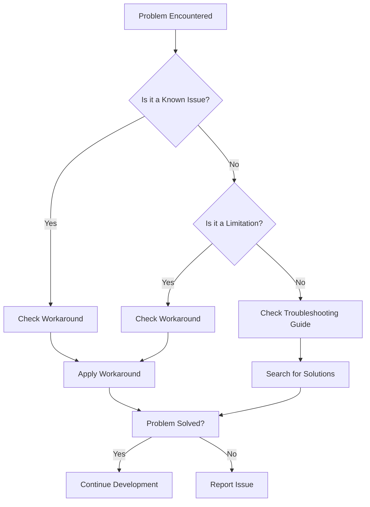

# Known Limitations

> **TL;DR:** This page provides a comprehensive overview of all known issues and limitations in the OmniCpp template, organized by category for quick reference.

## Overview

This page combines both known bugs/defects and design constraints into a single reference. Use this page to quickly identify potential problems and their workarounds.

## Quick Reference Table

| Category | Issue | Severity | Status | Workaround |
|----------|-------|----------|--------|------------|
| **Python** | OmniCppController.py logger error | Medium | Open | Use module-level logger |
| **Python** | Test execution not implemented | Low | Open | Run tests manually with CMake |
| **Python** | Packaging not implemented | Low | Open | Use CPack directly |
| **Python** | Python executable detection fragile | Medium | Open | Set PYTHON environment variable |
| **Python** | MinGW build pipeline complex | Medium | Open | Use MSVC or GCC instead |
| **Python** | Compiler name transformation fragile | Low | Open | Use lowercase hyphenated names |
| **Python** | MSYS2 UCRT64 prompt issues | Low | Open | Use different terminal |
| **Python** | Deprecated targets referenced | Low | Open | Use current target names |
| **Python** | Conan validation false positives | Low | Open | Ignore validation warnings |
| **Python** | Config validation typo | Low | Open | Use correct quote style |
| **Platform** | Only Windows/Linux supported | Medium | By Design | Modify for macOS |
| **Platform** | Limited compiler support | Medium | By Design | Add compiler detection |
| **C++** | C++23 requires specific versions | High | By Design | Use C++20/17 or upgrade compiler |
| **C++** | ABI compatibility issues | Medium | By Design | Use same compiler for all components |
| **Build** | No parallel build support | Medium | Open | Use CMake --parallel |
| **Build** | No build caching | Medium | Open | Use ccache or sccache |
| **Build** | Limited cross-compilation | Medium | Open | Use CMake toolchain files |
| **Engine** | Vulkan-only rendering | Medium | By Design | Implement OpenGL renderer |
| **Engine** | Single-threaded rendering | Medium | By Design | Implement command buffer system |
| **Engine** | No networking implementation | Low | Open | Implement network manager |
| **Engine** | Limited physics engine | Low | By Design | Integrate Bullet/PhysX |
| **Controller** | Limited error recovery | Medium | Open | Add try-catch blocks |

## By Category

### C++ Problems

#### C++23 Compiler Requirements

**Problem:** Full C++23 support requires MSVC 19.35+, GCC 13+, or Clang 16+. Older compilers may not support all C++23 features.

**Impact:** Cannot use the template with older compilers without modifications.

**Workaround:**
```cmake
# Downgrade to C++20 if needed
set(CMAKE_CXX_STANDARD 20 CACHE STRING "C++ standard")
```

**Related:** [Build System](../build-system/index.md)

---

#### ABI Compatibility Issues

**Problem:** Different compilers may have incompatible ABIs. Code compiled with one compiler may not be compatible with code compiled with another compiler.

**Impact:** Cannot mix libraries compiled with different compilers.

**Workaround:**
```bash
# Always use the same compiler
export CC=gcc
export CXX=g++
cmake --build build
```

**Related:** [Build System](../build-system/index.md)

---

### Build System Problems

#### No Parallel Build Support

**Problem:** The build system does not support parallel compilation. All builds are sequential.

**Impact:** Slow builds for large projects.

**Workaround:**
```bash
# Use CMake's parallel build support
cmake --build build --parallel $(nproc)  # Linux
cmake --build build --parallel %NUMBER_OF_PROCESSORS%  # Windows
```

**Related:** [Build System](../build-system/index.md)

---

#### No Build Caching

**Problem:** The build system does not implement build caching. Unchanged files are recompiled on every build.

**Impact:** Slow rebuilds for large projects.

**Workaround:**
```bash
# Use ccache
export CC="ccache gcc"
export CXX="ccache g++"
cmake --build build
```

**Related:** [Build System](../build-system/index.md)

---

#### Limited Cross-Compilation Support

**Problem:** Cross-compilation is not fully supported. The `is_cross_compilation` flag is always `False` in most places.

**Impact:** Cannot easily build for different target platforms.

**Workaround:**
```bash
# Use CMake toolchain files
cmake -B build -DCMAKE_TOOLCHAIN_FILE=cmake/toolchains/arm64-linux-gnu.cmake
cmake --build build
```

**Related:** [Build System](../build-system/index.md)

---

### Python Problems

#### OmniCppController.py Logger Error

**Problem:** The `main()` function uses `self.logger.error` but `self` doesn't exist in the function context.

**Impact:** Will cause a `NameError` when the code reaches this line.

**Workaround:**
```python
import logging

logger = logging.getLogger(__name__)

def main():
    logger.error("Error message")  # This works
```

**Related:** [Configuration](../configuration/index.md)

---

#### Test Execution Not Implemented

**Problem:** The test execution functionality is not yet implemented. The controller just logs a warning and returns 0.

**Impact:** Cannot run tests through the Python controller.

**Workaround:**
```bash
# Run tests manually using CMake
cmake --build build --target test
ctest --test-dir build
```

**Related:** [Testing](../testing/index.md)

---

#### Packaging Not Implemented

**Problem:** The packaging functionality is not yet implemented. The controller just logs a warning and returns 0.

**Impact:** Cannot create packages through the Python controller.

**Workaround:**
```bash
# Use CPack directly
cpack --config build/CPackConfig.cmake
```

**Related:** [Configuration](../configuration/index.md)

---

#### Python Executable Detection Fragile

**Problem:** The Python executable detection logic only checks the user's local bin directory and falls back to "python".

**Impact:** May fail to find Python in non-standard installations.

**Workaround:**
```bash
# Set the PYTHON environment variable
export PYTHON=/path/to/your/python
python OmniCppController.py build
```

**Related:** [Configuration](../configuration/index.md)

---

#### MinGW Build Pipeline Complex

**Problem:** The MinGW build pipeline uses complex inline Python code execution which is error-prone and hard to debug.

**Impact:** MinGW builds may fail unexpectedly.

**Workaround:**
```bash
# Use MSVC or GCC instead of MinGW
python OmniCppController.py configure --compiler msvc
```

**Related:** [Build System](../build-system/index.md)

---

#### Compiler Name Transformation Fragile

**Problem:** The compiler name transformation logic uses `.lower().replace(" ", "-").lower()` which is redundant.

**Impact:** May not handle all compiler names correctly.

**Workaround:**
```json
// Use lowercase and hyphens in config
{
  "compiler": "msvc-clang"
}
```

**Related:** [Configuration](../configuration/index.md)

---

#### MSYS2 UCRT64 Prompt Issues

**Problem:** The terminal utilities file has extensive workarounds for MSYS2 UCRT64 prompt issues.

**Impact:** MSYS2 environment may have compatibility problems.

**Workaround:**
```bash
# Use a different terminal or shell
# PowerShell, cmd.exe, or bash (not MSYS2)
```

**Related:** [Build System](../build-system/index.md)

---

#### Deprecated Targets Still Referenced

**Problem:** Deprecated targets (`targets/qt-vulkan/library` and `targets/qt-vulkan/standalone`) are still referenced.

**Impact:** May cause confusion when selecting build targets.

**Workaround:**
```bash
# Use current target names
python OmniCppController.py configure --target standalone
```

**Related:** [Build System](../build-system/index.md)

---

#### Conan Validation False Positives

**Problem:** Conan validation may fail even when installation succeeds. The validation logic treats `vcvars.bat` warnings as errors.

**Impact:** May incorrectly report Conan installation failures.

**Workaround:**
```bash
# Ignore validation warnings if installation works
python OmniCppController.py install --package-manager conan
# Check if installation succeeded despite warnings
```

**Related:** [Build System](../build-system/index.md)

---

#### Config Validation Typo

**Problem:** There is a typo in the validation logic that uses single quotes instead of double quotes.

**Impact:** May cause validation to fail in some cases.

**Workaround:**
```json
// Use double quotes in config
{
  "key": "value"
}
```

**Related:** [Configuration](../configuration/index.md)

---

### Game Engine Problems

#### Vulkan-Only Rendering

**Problem:** Only Vulkan is supported for rendering. OpenGL is not supported.

**Impact:** Cannot use OpenGL for rendering.

**Workaround:**
```cpp
// Implement an OpenGL renderer based on the Vulkan renderer
// Or use a third-party graphics abstraction layer
```

**Related:** [Engine](../engine/index.md)

---

#### Single-Threaded Rendering

**Problem:** The renderer runs on the main thread. There is no multi-threaded rendering support.

**Impact:** Rendering performance may be limited.

**Workaround:**
```cpp
// Implement a command buffer system
// Or use a job system for parallel rendering tasks
```

**Related:** [Engine](../engine/index.md)

---

#### No Networking Implementation

**Problem:** The network subsystem interface exists but the implementation is incomplete.

**Impact:** Networking functionality is not available.

**Workaround:**
```cpp
// Implement the network manager interface
// Or use a third-party networking library (e.g., Boost.Asio, ENet)
```

**Related:** [Engine](../engine/index.md)

---

#### Limited Physics Engine

**Problem:** The physics engine provides basic rigid body simulation only.

**Impact:** Advanced physics features are not available.

**Workaround:**
```cpp
// Integrate a third-party physics engine (e.g., Bullet, PhysX, Box2D)
// Or implement additional physics features yourself
```

**Related:** [Engine](../engine/index.md)

---

## Limitations by Severity

### High Severity

| Issue | Impact | Workaround |
|-------|--------|------------|
| C++23 requires specific versions | Cannot use older compilers | Downgrade to C++20/17 or upgrade compiler |

### Medium Severity

| Issue | Impact | Workaround |
|-------|--------|------------|
| OmniCppController.py logger error | Will cause NameError | Use module-level logger |
| Python executable detection fragile | May fail to find Python | Set PYTHON environment variable |
| MinGW build pipeline complex | MinGW builds may fail | Use MSVC or GCC instead |
| Only Windows/Linux supported | Cannot use on macOS | Modify for macOS |
| Limited compiler support | Cannot use other compilers | Add compiler detection |
| ABI compatibility issues | Cannot mix compilers | Use same compiler for all components |
| No parallel build support | Slow builds | Use CMake --parallel |
| No build caching | Slow rebuilds | Use ccache or sccache |
| Limited cross-compilation | Cannot build for other platforms | Use CMake toolchain files |
| Vulkan-only rendering | Cannot use OpenGL | Implement OpenGL renderer |
| Single-threaded rendering | Limited performance | Implement command buffer system |
| Limited error recovery | Poor error handling | Add try-catch blocks |

### Low Severity

| Issue | Impact | Workaround |
|-------|--------|------------|
| Test execution not implemented | Cannot run tests via controller | Run tests manually with CMake |
| Packaging not implemented | Cannot create packages via controller | Use CPack directly |
| Compiler name transformation fragile | May not handle all names | Use lowercase hyphenated names |
| MSYS2 UCRT64 prompt issues | MSYS2 compatibility problems | Use different terminal |
| Deprecated targets referenced | May cause confusion | Use current target names |
| Conan validation false positives | May report false failures | Ignore validation warnings |
| Config validation typo | May cause validation failures | Use correct quote style |
| No networking implementation | No networking | Implement network manager |
| Limited physics engine | No advanced physics | Integrate Bullet/PhysX |

## Troubleshooting Flow



## Reporting New Issues

If you encounter a problem that is not documented here:

1. **Search existing issues** to avoid duplicates
2. **Check the [Troubleshooting Guide](../troubleshooting/index.md)** for common problems
3. **Create a new issue** with:
   - Clear title and description
   - Steps to reproduce
   - Expected vs actual behavior
   - Environment details (OS, compiler, Python version)
   - Relevant code snippets or logs

## Contributing Fixes

We welcome contributions to fix known issues. Please see the [Developer Guide](../developer/index.md) for information on how to contribute.

## Related Documentation

- [Known Issues](./known-issues.md)
- [Limitations](./limitations.md)
- [Troubleshooting](../troubleshooting/index.md)
- [Developer Guide](../developer/index.md)
- [Configuration](../configuration/index.md)
