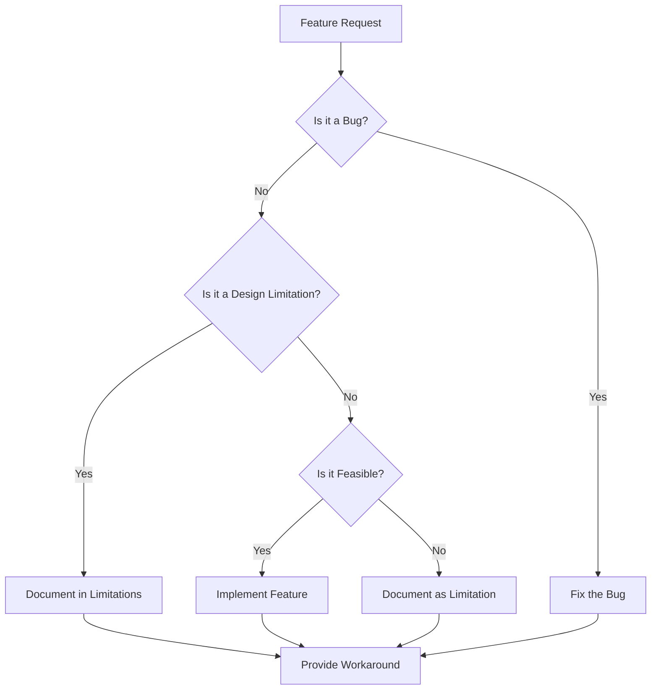

# Limitations

> **TL;DR:** This page documents all design constraints and intentional limitations of the OmniCpp template. These are not bugs, but rather architectural decisions that define the scope of the project.

## Overview

This page lists all limitations of the OmniCpp template. These are design constraints and intentional limitations that define the scope of the project. Understanding these limitations helps you make informed decisions about using this template for your projects.

## Platform Limitations

### Limited Platform Support

**Severity:** Medium  
**Status:** By Design  
**Location:** [`OmniCppController.py:1056-1065`](../../OmniCppController.py:1056)

**Description:**
Only Windows and Linux are supported. macOS is not officially supported, though it may work with some modifications.

**Supported Platforms:**
- Windows 10/11
- Linux (Ubuntu 20.04+, Debian 11+, Fedora 35+, Arch Linux)

**Unsupported Platforms:**
- macOS (not officially supported)
- BSD variants
- Other Unix-like systems

**Rationale:**
The project focuses on Windows and Linux as these are the most common platforms for game development. macOS support would require significant additional testing and maintenance effort.

**Workaround:**
For macOS development, you may need to:
1. Modify the build scripts to support macOS
2. Test all functionality on macOS
3. Handle platform-specific differences (e.g., different compiler flags, libraries)

**Related:** [Build System](../build-system/index.md)

---

### Limited Compiler Support

**Severity:** Medium  
**Status:** By Design  
**Location:** [`config/compilers.json`](../../config/compilers.json)

**Description:**
Only specific compilers are supported on each platform.

**Windows Compilers:**
- MSVC (Microsoft Visual C++)
- MSVC-Clang (Clang with MSVC ABI)
- MinGW-GCC (GCC with MinGW)
- MinGW-Clang (Clang with MinGW)

**Linux Compilers:**
- GCC (GNU Compiler Collection)
- Clang (LLVM Clang)

**Unsupported Compilers:**
- Intel C++ Compiler
- IBM XL C/C++
- Other proprietary compilers

**Rationale:**
The project focuses on the most commonly used open-source and mainstream compilers. Supporting additional compilers would require significant testing and maintenance effort.

**Workaround:**
If you need to use a different compiler, you may need to:
1. Add compiler detection logic to [`omni_scripts/compilers/`](../../omni_scripts/compilers/)
2. Create appropriate CMake toolchain files
3. Test all functionality with the new compiler

**Related:** [Build System](../build-system/index.md)

---

## C++ Language Limitations

### C++23 Compiler Requirements

**Severity:** High  
**Status:** By Design  
**Location:** [`CMakeLists.txt`](../../CMakeLists.txt)

**Description:**
Full C++23 support requires specific compiler versions. Older compilers may not support all C++23 features.

**Minimum Compiler Versions:**
- MSVC 19.35+ (Visual Studio 2022 17.5+)
- GCC 13+
- Clang 16+

**Unsupported C++23 Features on Older Compilers:**
- Standard library modules
- `std::print` and `std::println`
- `std::generator`
- `std::expected`
- `std::flat_map` and `std::flat_set`
- Various other C++23 features

**Rationale:**
The project aims to use modern C++23 features to demonstrate best practices. Supporting older compilers would require either:
1. Not using C++23 features (defeating the purpose of the template)
2. Providing fallback implementations (increasing complexity)

**Workaround:**
If you need to support older compilers, you can:
1. Modify the CMakeLists.txt to use C++20 or C++17
2. Replace C++23 features with C++20/17 equivalents
3. Use conditional compilation to provide fallbacks

**Code Example:**
```cmake
# In CMakeLists.txt
set(CMAKE_CXX_STANDARD 23 CACHE STRING "C++ standard")
set(CMAKE_CXX_STANDARD_REQUIRED ON)
set(CMAKE_CXX_EXTENSIONS OFF)
```

**Related:** [Build System](../build-system/index.md)

---

### ABI Compatibility Issues

**Severity:** Medium  
**Status:** By Design  
**Location:** [`practices/1_enviroment_and_toolchain/1_compiler_and_standards/2_language_standard_and_abi_compatibility.md`](../../practices/1_enviroment_and_toolchain/1_compiler_and_standards/2_language_standard_and_abi_compatibility.md)

**Description:**
Different compilers may have incompatible ABIs (Application Binary Interfaces). This means that code compiled with one compiler may not be compatible with code compiled with another compiler.

**ABI Incompatibility Examples:**
- MSVC and GCC have different ABIs
- Different versions of the same compiler may have different ABIs
- Different standard library implementations may have different ABIs

**Rationale:**
ABI compatibility is a complex issue that affects all C++ projects. The template documents these issues but does not attempt to solve them, as there is no universal solution.

**Workaround:**
To avoid ABI issues:
1. Use the same compiler for all components of your project
2. Use the same compiler version for all components
3. Use the same standard library implementation for all components
4. Be careful when mixing pre-built libraries with your own code

**Related:** [Build System](../build-system/index.md)

---

## Build System Limitations

### No Parallel Build Support

**Severity:** Medium  
**Status:** Open  
**Location:** [`omni_scripts/build_system/`](../../omni_scripts/build_system/)

**Description:**
The build system does not support parallel compilation. All builds are sequential, which can be slow for large projects.

**Rationale:**
Parallel builds would require significant additional complexity in the build scripts. The current implementation prioritizes simplicity over performance.

**Workaround:**
You can use CMake's built-in parallel build support:
```bash
cmake --build build --parallel $(nproc)  # Linux
cmake --build build --parallel %NUMBER_OF_PROCESSORS%  # Windows
```

**Related:** [Build System](../build-system/index.md)

---

### No Build Caching

**Severity:** Medium  
**Status:** Open  
**Location:** [`omni_scripts/build_system/`](../../omni_scripts/build_system/)

**Description:**
The build system does not implement build caching. This means that unchanged files are recompiled on every build, which can be slow for large projects.

**Rationale:**
Build caching would require significant additional complexity in the build scripts. The current implementation prioritizes simplicity over performance.

**Workaround:**
You can use external build caching tools:
- **ccache**: A compiler cache for C/C++
- **sccache**: A distributed compiler cache
- **BuildKit**: A build cache for Docker

**Code Example:**
```bash
# Using ccache
export CC="ccache gcc"
export CXX="ccache g++"
cmake --build build
```

**Related:** [Build System](../build-system/index.md)

---

### Limited Cross-Compilation Support

**Severity:** Medium  
**Status:** Open  
**Location:** [`omni_scripts/`](../../omni_scripts/)

**Description:**
Cross-compilation is not fully supported. The `is_cross_compilation` flag is always `False` in most places, which means that cross-compilation scenarios are not properly handled.

**Rationale:**
Cross-compilation is a complex topic that requires significant additional testing and infrastructure. The current implementation focuses on native builds.

**Workaround:**
For cross-compilation, you can:
1. Use CMake toolchain files (see [`cmake/toolchains/`](../../cmake/toolchains/))
2. Manually set cross-compilation flags
3. Use Docker or virtual machines for target platforms

**Code Example:**
```bash
# Cross-compiling for ARM64 Linux
cmake -B build -DCMAKE_TOOLCHAIN_FILE=cmake/toolchains/arm64-linux-gnu.cmake
cmake --build build
```

**Related:** [Build System](../build-system/index.md)

---

## Game Engine Limitations

### Vulkan-Only Rendering

**Severity:** Medium  
**Status:** By Design  
**Location:** [`include/engine/render/VulkanRenderer.hpp`](../../include/engine/render/VulkanRenderer.hpp)

**Description:**
Only Vulkan is supported for rendering. OpenGL is not supported.

**Rationale:**
Vulkan is a modern, low-level graphics API that provides better performance and more control than OpenGL. The template focuses on Vulkan to demonstrate modern graphics programming.

**Workaround:**
If you need OpenGL support, you can:
1. Implement an OpenGL renderer based on the Vulkan renderer
2. Use a third-party graphics abstraction layer (e.g., bgfx, bgfx-rs)
3. Use a game engine that supports multiple graphics APIs

**Related:** [Engine](../engine/index.md)

---

### Single-Threaded Rendering

**Severity:** Medium  
**Status:** By Design  
**Location:** [`src/engine/graphics/renderer.cpp`](../../src/engine/graphics/renderer.cpp)

**Description:**
The renderer runs on the main thread. There is no multi-threaded rendering support.

**Rationale:**
Multi-threaded rendering is a complex topic that requires significant additional infrastructure. The current implementation prioritizes simplicity over performance.

**Workaround:**
For multi-threaded rendering, you can:
1. Implement a command buffer system
2. Use a job system for parallel rendering tasks
3. Use a third-party rendering framework that supports multi-threading

**Related:** [Engine](../engine/index.md)

---

### No Networking Implementation

**Severity:** Low  
**Status:** Open  
**Location:** [`include/engine/network/network_manager.hpp`](../../include/engine/network/network_manager.hpp)

**Description:**
The network subsystem interface exists but the implementation is incomplete. Networking functionality is not available.

**Rationale:**
Networking is a complex topic that requires significant additional infrastructure. The current implementation focuses on core engine functionality.

**Workaround:**
For networking, you can:
1. Implement the network manager interface
2. Use a third-party networking library (e.g., Boost.Asio, ENet)
3. Use a game engine that includes networking

**Related:** [Engine](../engine/index.md)

---

### Limited Physics Engine

**Severity:** Low  
**Status:** By Design  
**Location:** [`include/engine/physics/physics_engine.hpp`](../../include/engine/physics/physics_engine.hpp)

**Description:**
The physics engine provides basic rigid body simulation only. Advanced physics features are not available.

**Supported Features:**
- Basic rigid body dynamics
- Simple collision detection
- Basic gravity

**Unsupported Features:**
- Soft body physics
- Fluid simulation
- Cloth simulation
- Advanced collision detection (e.g., continuous collision detection)
- Physics-based animation

**Rationale:**
The physics engine is designed to be a simple demonstration of physics integration. Advanced physics features would require significant additional complexity.

**Workaround:**
For advanced physics, you can:
1. Integrate a third-party physics engine (e.g., Bullet, PhysX, Box2D)
2. Implement additional physics features yourself
3. Use a game engine that includes advanced physics

**Related:** [Engine](../engine/index.md)

---

## Python Controller Limitations

### Limited Error Recovery

**Severity:** Medium  
**Status:** Open  
**Location:** [`OmniCppController.py`](../../OmniCppController.py)

**Description:**
Error recovery is limited. Most errors just return 1 without detailed messages or recovery attempts.

**Rationale:**
Comprehensive error recovery would require significant additional complexity. The current implementation prioritizes simplicity over robustness.

**Workaround:**
For better error handling, you can:
1. Add try-catch blocks around critical operations
2. Implement retry logic for transient errors
3. Provide more detailed error messages
4. Implement automatic recovery for common errors

**Related:** [Configuration](../configuration/index.md)

---

## Limitations Decision Flow



## Requesting Features

If you need a feature that is currently limited or not available:

1. **Check the [Known Issues](./known-issues.md)** to see if it's a bug
2. **Check this page** to see if it's a documented limitation
3. **Search existing issues** to avoid duplicates
4. **Create a feature request** with:
   - Clear description of the feature
   - Use case and motivation
   - Proposed implementation (if known)
   - Potential impact on existing functionality

## Contributing Features

We welcome contributions to add new features. Please see the [Developer Guide](../developer/index.md) for information on how to contribute.

## Related Documentation

- [Known Issues](./known-issues.md)
- [Troubleshooting](../troubleshooting/index.md)
- [Developer Guide](../developer/index.md)
- [Architecture](../architecture/index.md)
