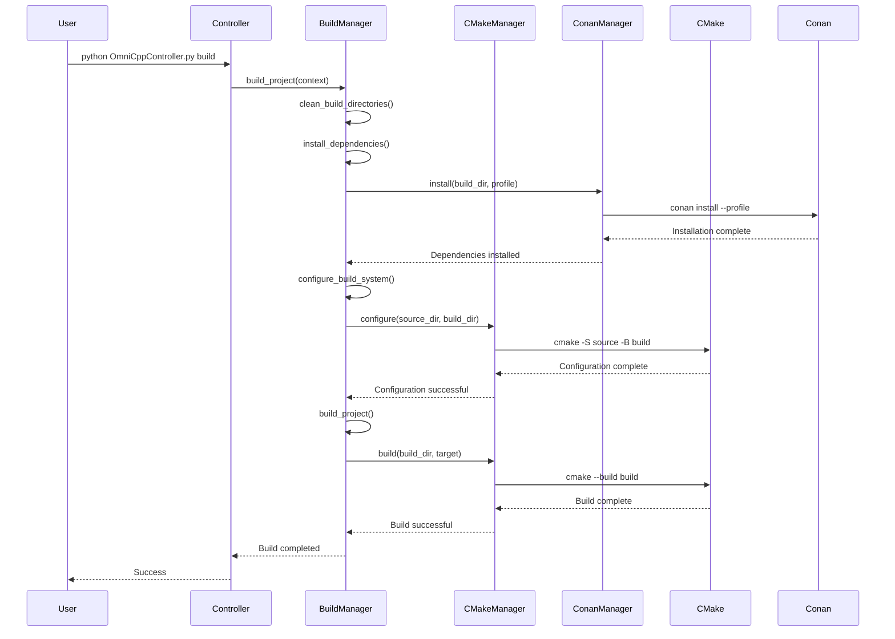

# Build Issues

This guide covers common build-related issues encountered when working with the OmniCpp template, including CMake configuration, Conan dependency management, and compiler-specific problems.

## Why Build Issues Occur

The OmniCpp template uses a complex build system involving multiple components:

- **CMake**: Build system configuration and generation
- **Conan**: Dependency management and package installation
- **Multiple Compilers**: MSVC, MSVC-Clang, MinGW-GCC, MinGW-Clang, GCC, Clang
- **Cross-Compilation**: Building for different target architectures

Issues can arise from misconfigurations, missing dependencies, or incompatibilities between these components.

## Build System Flow



## CMake Configuration Issues

### CMake Not Found

**Symptom**: `'cmake' is not recognized as an internal or external command`

**Cause**: CMake is not installed or not in PATH

**Solution**:

```bash
# Check if CMake is installed
cmake --version

# Expected output: cmake version 3.31.0 or higher
```

If CMake is not found:

1. **Windows**: Install via Visual Studio Installer or download from [cmake.org](https://cmake.org/download/)
2. **Linux**: `sudo apt install cmake` (Ubuntu/Debian) or `sudo dnf install cmake` (Fedora)
3. **macOS**: `brew install cmake`

### CMake Configuration Fails

**Symptom**: CMake configuration fails with errors about missing packages or invalid options

**Cause**: Missing dependencies, incorrect paths, or invalid CMake arguments

**Solution**:

```bash
# Clean build directory first
rm -rf build/

# Reconfigure with verbose output
cmake -S . -B build -DCMAKE_BUILD_TYPE=Debug --verbose
```

Check [`omni_scripts/cmake.py`](../../omni_scripts/cmake.py:141) for CMake configuration logic.

### CMake Generator Not Found

**Symptom**: `Could not find generator "Visual Studio 17 2022"`

**Cause**: Specified compiler requires a generator that is not available

**Solution**:

```bash
# Check available generators
cmake --help

# Verify Visual Studio installation
# Windows: Check Visual Studio Installer
# Linux: Verify compiler is installed
```

See [`config/compilers.json`](../../config/compilers.json) for supported compiler configurations.

### CMake Prefix Path Issues

**Symptom**: Qt6 or Vulkan SDK not found during CMake configuration

**Cause**: CMAKE_PREFIX_PATH not set or SDKs installed in non-standard locations

**Solution**:

```bash
# Set Qt6 path (Windows)
set Qt6_PATH=C:\Qt\6.5.0\msvc2019_64

# Set Vulkan SDK path (Windows)
set VULKAN_SDK=C:\VulkanSDK\1.3.261.1

# Set CMAKE_PREFIX_PATH
set CMAKE_PREFIX_PATH=%Qt6_PATH%;%VULKAN_SDK%

# Reconfigure
cmake -S . -B build -DCMAKE_BUILD_TYPE=Debug
```

The CMake manager in [`omni_scripts/cmake.py`](../../omni_scripts/cmake.py:192) automatically searches for Qt6 and Vulkan SDK paths.

## Conan Dependency Issues

### Conan Not Found

**Symptom**: `'conan' is not recognized as an internal or external command`

**Cause**: Conan is not installed or not in PATH

**Solution**:

```bash
# Check if Conan is installed
conan --version

# Expected output: Conan version 2.0 or higher
```

If Conan is not found:

1. **Install via pip**: `pip install conan`
2. **Verify installation**: Check PATH includes Conan directory

### Conan Profile Not Found

**Symptom**: `ConanProfileError: Conan profile not found: conan/profiles/msvc-debug`

**Cause**: Profile file does not exist in [`conan/profiles/`](../../conan/profiles/) directory

**Solution**:

```bash
# List available profiles
ls conan/profiles/

# Verify profile exists
cat conan/profiles/msvc-debug
```

Available profiles (from [`omni_scripts/conan.py`](../../omni_scripts/conan.py:299)):
- `msvc-debug`, `msvc-release`
- `clang-msvc-debug`, `clang-msvc-release`
- `mingw-clang-debug`, `mingw-clang-release`
- `mingw-gcc-debug`, `mingw-gcc-release`

### Conan Installation Fails

**Symptom**: `ConanInstallError: Failed to install Conan dependencies`

**Cause**: Network issues, package conflicts, or missing system dependencies

**Solution**:

```bash
# Clear Conan cache
conan remove "*" -c
conan cache clean

# Reinstall dependencies
conan install . --build=missing --profile:host conan/profiles/msvc-debug
```

The Conan manager in [`omni_scripts/conan.py`](../../omni_scripts/conan.py:130) validates installation by checking for:
- `conan_toolchain.cmake`
- `conanbuild.sh` or `conanbuild.bat`
- `CMakePresets.json`

### Conan Package Conflicts

**Symptom**: Dependency resolution fails with version conflicts

**Cause**: Incompatible package versions in [`conan/conanfile.py`](../../conan/conanfile.py)

**Solution**:

```bash
# Check package versions
conan list

# Update specific package
conan install <package_name>/<version>

# Or update all
conan update
```

## Compiler-Specific Issues

### MSVC Not Found

**Symptom**: `'cl' is not recognized as an internal or external command`

**Cause**: MSVC compiler not in PATH or Visual Studio not installed

**Solution**:

```bash
# Open Developer Command Prompt for VS
# Or add MSVC to PATH manually
# Path: C:\Program Files\Microsoft Visual Studio\2022\Community\VC\Tools\MSVC\14.xx\bin\Hostx64\x64

# Verify installation
cl --version
```

See [`config/compilers.json`](../../config/compilers.json:2) for MSVC configuration.

### MSVC-Clang Not Found

**Symptom**: `'clang-cl' is not recognized as an internal or external command`

**Cause**: LLVM/Clang not installed or not in PATH

**Solution**:

```bash
# Install LLVM via Visual Studio Installer
# Or download from https://llvm.org/

# Verify installation
clang-cl --version
```

See [`config/compilers.json`](../../config/compilers.json:10) for MSVC-Clang configuration.

### MinGW Not Found

**Symptom**: `'g++' is not recognized as an internal or external command` (MinGW-GCC)

**Cause**: MinGW not installed or not in PATH

**Solution**:

```bash
# Install MinGW via MSYS2
# Download from https://www.msys2.org/

# Verify installation
g++ --version
```

For MinGW-Clang, verify `clang++` is available.

### Cross-Compilation Issues

### Toolchain Not Found

**Symptom**: `ToolchainError: Unknown compiler: arm64-linux-gnu`

**Cause**: Cross-compilation toolchain not installed

**Solution**:

```bash
# Install ARM64 toolchain (Ubuntu/Debian)
sudo apt install gcc-aarch64-linux-gnu g++-aarch64-linux-gnu

# Verify installation
aarch64-linux-gnu-gcc --version
```

Available toolchains in [`cmake/toolchains/`](../../cmake/toolchains/):
- `arm64-linux-gnu.cmake`
- `arm64-windows-msvc.cmake`
- `emscripten.cmake`
- `x86-linux-gnu.cmake`

### Cross-Compilation Build Fails

**Symptom**: Cross-compiled binary fails to run on target system

**Cause**: Missing runtime libraries or ABI incompatibility

**Solution**:

```bash
# Check binary dependencies
ldd ./build/debug/game

# Verify target architecture
file ./build/debug/game

# Use readelf for Linux binaries
readelf -h ./build/debug/game
```

## Build Pipeline Issues

### Clean Build Pipeline Fails

**Symptom**: `BuildError: Clean Build Pipeline failed`

**Cause**: One of the pipeline steps failed (clean, install, configure, build)

**Solution**:

```bash
# Run individual pipeline steps to isolate failure
python OmniCppController.py build standalone "Clean Build Directory" default Debug
python OmniCppController.py build standalone "Conan install" default Debug
python OmniCppController.py build standalone "Configure Build System" default Debug
python OmniCppController.py build standalone "Build Project" default Debug
```

The clean build pipeline in [`omni_scripts/build.py`](../../omni_scripts/build.py:520) executes:
1. Clean build directories
2. Install dependencies
3. Configure build system
4. Build project

### Build Directory Permission Errors

**Symptom**: `PermissionError: Permission denied removing build directory`

**Cause**: Build directory locked by running process or insufficient permissions

**Solution**:

```bash
# Windows: Check for running processes
tasklist | findstr game.exe

# Kill running process
taskkill /F /IM game.exe

# Linux/macOS: Check for running processes
ps aux | grep game

# Kill running process
killall game

# Retry clean
rm -rf build/
```

### Build Artifacts Not Created

**Symptom**: Build completes but no executable or library files found

**Cause**: Build target not specified or build configuration incorrect

**Solution**:

```bash
# Check build directory contents
ls -la build/debug/

# Verify CMake targets
cmake --build build --target help

# Rebuild with correct target
python OmniCppController.py build standalone "Build Project" default Debug
```

The CMake manager in [`omni_scripts/cmake.py`](../../omni_scripts/cmake.py:625) validates installation by checking for:
- `CMakeCache.txt`
- Build files (`.vcxproj`, `Makefile`)
- Executable (`.exe` on Windows, binary on Linux)
- Library (`.dll` on Windows, `.so` on Linux)

## Common Error Messages

| Error Message | Source | Likely Cause | Solution |
|--------------|--------|--------------|----------|
| `CMake Error: Could not find CMAKE_CXX_COMPILER` | [`omni_scripts/cmake.py`](../../omni_scripts/cmake.py:141) | Compiler not in PATH | Install compiler |
| `ConanProfileError: Conan profile not found` | [`omni_scripts/conan.py`](../../omni_scripts/conan.py:163) | Profile missing | Create profile in [`conan/profiles/`](../../conan/profiles/) |
| `ToolchainError: Unknown compiler` | [`omni_scripts/build.py`](../../omni_scripts/build.py:733) | Invalid compiler name | Use valid compiler from [`config/compilers.json`](../../config/compilers.json) |
| `BuildError: Failed to clean build directory` | [`omni_scripts/build.py`](../../omni_scripts/build.py:244) | Permission denied | Close running processes |
| `CMakeConfigurationError: Source directory not found` | [`omni_scripts/cmake.py`](../../omni_scripts/cmake.py:176) | Invalid path | Verify source directory exists |

## Debugging Build Issues

### Enable Verbose Output

```bash
# CMake verbose configuration
cmake -S . -B build --verbose --trace

# CMake verbose build
cmake --build build --verbose

# Conan verbose install
conan install . --verbose
```

### Check Build Logs

```bash
# CMake output log
cat build/CMakeFiles/CMakeOutput.log

# CMake error log
cat build/CMakeFiles/CMakeError.log

# Controller log
cat OmniCppController.log
```

### Validate Build Configuration

```bash
# Check CMake cache
cat build/CMakeCache.txt | grep CMAKE_BUILD_TYPE

# Verify Conan installation
ls build/conan_toolchain.cmake

# Check build targets
cmake --build build --target help
```

## Related Documentation

- [Troubleshooting Overview](index.md)
- [Configuration Issues](configuration-issues.md)
- [Runtime Issues](runtime-issues.md)
- [Performance Issues](performance-issues.md)
- [Debugging Guide](debugging-guide.md)
- [Build System Guide](../../docs/user-guide-build-system.md)
- [Compiler Detection](../../docs/compiler-detection.md)
