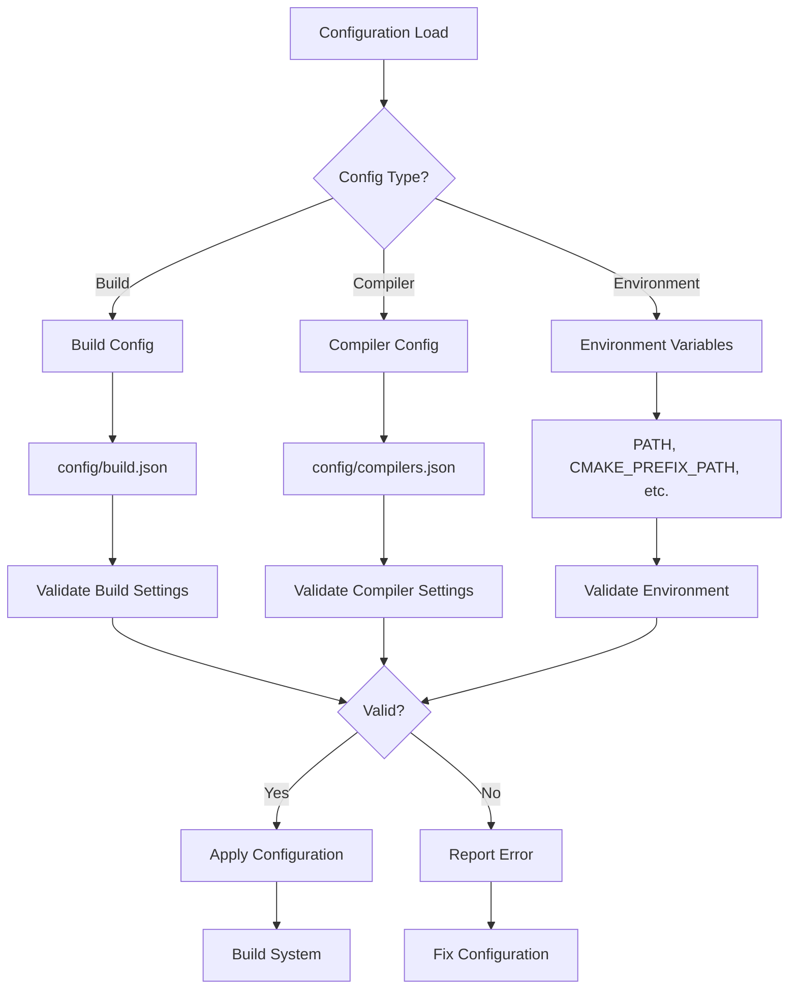

# Configuration Issues

This guide covers common configuration-related issues encountered when working with the OmniCpp template, including build configuration, compiler profiles, and environment variable problems.

## Why Configuration Issues Occur

The OmniCpp template uses a multi-layered configuration system:

- **Build Configuration**: [`config/build.json`](../../config/build.json) for default build settings
- **Compiler Configuration**: [`config/compilers.json`](../../config/compilers.json) for compiler-specific settings
- **CMake Presets**: [`CMakePresets.json`](../../CMakePresets.json) for build configurations
- **Conan Profiles**: [`conan/profiles/`](../../conan/profiles/) for dependency management
- **Environment Variables**: PATH, CMAKE_PREFIX_PATH, VULKAN_SDK, Qt6_PATH

Issues can arise from misconfigurations, invalid values, or missing configuration files.

## Configuration System Flow



## Build Configuration Issues

### Invalid Build Configuration

**Symptom**: `ConfigurationError: Invalid build configuration`

**Cause**: Invalid values in [`config/build.json`](../../config/build.json)

**Solution**:

```json
{
  "default_compiler": "auto",
  "default_target": "windows",
  "default_build_type": "Release",
  "build_directory": "build",
  "install_directory": "install",
  "parallel_jobs": 4
}
```

Valid values:
- `default_compiler`: `"auto"`, `"msvc"`, `"clang-msvc"`, `"mingw-clang"`, `"mingw-gcc"`, `"gcc"`, `"clang"`
- `default_target`: `"windows"`, `"linux"`, `"macos"`
- `default_build_type`: `"Debug"`, `"Release"`, `"RelWithDebInfo"`, `"MinSizeRel"`
- `parallel_jobs`: Integer from 1 to number of CPU cores

### Missing Build Configuration

**Symptom**: Build system fails to find configuration file

**Cause**: [`config/build.json`](../../config/build.json) does not exist or is malformed

**Solution**:

```bash
# Check if configuration file exists
ls config/build.json

# Validate JSON syntax
python -m json.tool config/build.json

# Recreate default configuration if needed
cat > config/build.json << 'EOF'
{
  "default_compiler": "auto",
  "default_target": "windows",
  "default_build_type": "Release",
  "build_directory": "build",
  "install_directory": "install",
  "parallel_jobs": 4
}
EOF
```

## Compiler Configuration Issues

### Invalid Compiler Name

**Symptom**: `ToolchainError: Unknown compiler: invalid-compiler`

**Cause**: Compiler name not recognized in [`config/compilers.json`](../../config/compilers.json)

**Solution**:

```json
{
  "msvc": {
    "name": "MSVC",
    "executable": "cl.exe",
    "flags": {
      "debug": "/Od /Zi /RTC1",
      "release": "/O2 /GL /DNDEBUG"
    }
  },
  "msvc_clang": {
    "name": "MSVC-Clang",
    "executable": "clang-cl.exe",
    "flags": {
      "debug": "-O0 -g",
      "release": "-O3 -DNDEBUG"
    }
  },
  "mingw_gcc": {
    "name": "MinGW-GCC",
    "executable": "g++.exe",
    "flags": {
      "debug": "-O0 -g",
      "release": "-O3 -DNDEBUG"
    }
  },
  "mingw_clang": {
    "name": "MinGW-Clang",
    "executable": "clang++.exe",
    "flags": {
      "debug": "-O0 -g",
      "release": "-O3 -DNDEBUG"
    }
  },
  "gcc": {
    "name": "GCC",
    "executable": "g++",
    "flags": {
      "debug": "-O0 -g",
      "release": "-O3 -DNDEBUG"
    }
  },
  "clang": {
    "name": "Clang",
    "executable": "clang++",
    "flags": {
      "debug": "-O0 -g",
      "release": "-O3 -DNDEBUG"
    }
  }
}
```

Valid compiler names (from [`omni_scripts/build.py`](../../omni_scripts/build.py:706)):
- `msvc`, `clang-msvc`, `mingw-clang`, `mingw-gcc`, `gcc`, `clang`

### Missing Compiler Executable

**Symptom**: `ToolchainError: Compiler executable not found`

**Cause**: Compiler executable path incorrect or not installed

**Solution**:

```bash
# Verify compiler executable exists
# Windows
where cl.exe
where clang-cl.exe
where g++.exe

# Linux/macOS
which g++
which clang++

# Check compiler version
cl --version
g++ --version
clang++ --version
```

### Invalid Compiler Flags

**Symptom**: Build fails with invalid compiler flags

**Cause**: Incorrect flag syntax or unsupported flags in [`config/compilers.json`](../../config/compilers.json)

**Solution**:

```json
{
  "msvc": {
    "name": "MSVC",
    "executable": "cl.exe",
    "flags": {
      "debug": "/Od /Zi /RTC1",
      "release": "/O2 /GL /DNDEBUG"
    }
  }
}
```

Common flag issues:
- Missing quotes around paths
- Incorrect flag syntax (e.g., `/O2` instead of `-O2` for GCC)
- Incompatible flags for compiler version

## Conan Configuration Issues

### Missing Conan Profile

**Symptom**: `ConanProfileError: Conan profile not found`

**Cause**: Profile file missing from [`conan/profiles/`](../../conan/profiles/) directory

**Solution**:

```bash
# List available profiles
ls conan/profiles/

# Create missing profile
cat > conan/profiles/custom-debug << 'EOF'
[settings]
os=Windows
arch=x86_64
compiler=Visual Studio
build_type=Debug
[buildenv]
CC=cl.exe
CXX=cl.exe
[conf]
tools.build:jobs=4
EOF
```

Available profiles (from [`omni_scripts/conan.py`](../../omni_scripts/conan.py:299)):
- `msvc-debug`, `msvc-release`
- `clang-msvc-debug`, `clang-msvc-release`
- `mingw-clang-debug`, `mingw-clang-release`
- `mingw-gcc-debug`, `mingw-gcc-release`

### Invalid Conan Profile

**Symptom**: `ConanProfileError: Invalid Conan profile`

**Cause**: Malformed profile file or invalid settings

**Solution**:

```ini
[settings]
os=Windows
arch=x86_64
compiler=Visual Studio
build_type=Debug

[buildenv]
CC=cl.exe
CXX=cl.exe

[conf]
tools.build:jobs=4
```

Valid profile sections:
- `[settings]`: OS, architecture, compiler, build type
- `[buildenv]`: Compiler executables (CC, CXX)
- `[conf]`: Build configuration options

## CMake Configuration Issues

### Missing CMake Presets

**Symptom**: `CMakeConfigurationError: CMake preset not found`

**Cause**: [`CMakePresets.json`](../../CMakePresets.json) missing or invalid

**Solution**:

```json
{
  "version": 3,
  "vendor": {
    "omnicpp": {
      "displayName": "OmniCpp Configuration"
    }
  },
  "configurePresets": [
    {
      "name": "default-debug",
      "displayName": "Default Debug",
      "binaryDir": "${sourceDir}/build/debug",
      "cacheVariables": {
        "CMAKE_BUILD_TYPE": "Debug",
        "CMAKE_CXX_STANDARD": "20"
      }
    },
    {
      "name": "default-release",
      "displayName": "Default Release",
      "binaryDir": "${sourceDir}/build/release",
      "cacheVariables": {
        "CMAKE_BUILD_TYPE": "Release",
        "CMAKE_CXX_STANDARD": "20"
      }
    }
  ],
  "buildPresets": [
    {
      "name": "default-debug",
      "configurePreset": "default-debug",
      "buildType": "Debug"
    },
    {
      "name": "default-release",
      "configurePreset": "default-release",
      "buildType": "Release"
    }
  ]
}
```

### Invalid CMake Generator

**Symptom**: `CMakeConfigurationError: Could not find generator`

**Cause**: Generator not available or incorrectly specified

**Solution**:

```bash
# List available generators
cmake --help

# Common generators:
# Windows: "Visual Studio 17 2022", "Ninja"
# Linux: "Unix Makefiles", "Ninja"
# macOS: "Xcode", "Unix Makefiles"
```

Generator mapping (from [`omni_scripts/cmake.py`](../../omni_scripts/cmake.py:502)):
- `msvc`, `clang-msvc` → `"Visual Studio 17 2022"`
- `mingw-clang`, `mingw-gcc` → `"Ninja"`
- `gcc`, `clang` → `None` (use default)

## Environment Variable Issues

### PATH Not Set

**Symptom**: `'command' is not recognized as an internal or external command`

**Cause**: Required tool not in PATH environment variable

**Solution**:

```bash
# Windows
set PATH=C:\Program Files\CMake\bin;%PATH%
set PATH=C:\Qt\6.5.0\msvc2019_64\bin;%PATH%
set PATH=C:\VulkanSDK\1.3.261.1\bin;%PATH%

# Linux/macOS
export PATH=/usr/local/bin:$PATH
export PATH=/opt/Qt/6.5.0/gcc_64/bin:$PATH

# Verify PATH
echo $PATH  # Linux/macOS
echo %PATH%  # Windows
```

### CMAKE_PREFIX_PATH Not Set

**Symptom**: Qt6 or Vulkan SDK not found during CMake configuration

**Cause**: CMAKE_PREFIX_PATH environment variable not set

**Solution**:

```bash
# Windows
set CMAKE_PREFIX_PATH=C:\Qt\6.5.0\msvc2019_64;C:\VulkanSDK\1.3.261.1

# Linux/macOS
export CMAKE_PREFIX_PATH=/usr/local/Qt/6.5.0:/usr/local/VulkanSDK

# Reconfigure
cmake -S . -B build -DCMAKE_BUILD_TYPE=Debug
```

The CMake manager in [`omni_scripts/cmake.py`](../../omni_scripts/cmake.py:192) automatically searches for Qt6 and Vulkan SDK paths.

### VULKAN_SDK Not Set

**Symptom**: `Failed to find Vulkan` or `VK_NO_PROTOTYPES` errors

**Cause**: Vulkan SDK not installed or VULKAN_SDK not set

**Solution**:

```bash
# Windows
set VULKAN_SDK=C:\VulkanSDK\1.3.261.1
set PATH=%VULKAN_SDK%\bin;%PATH%

# Linux/macOS
export VULKAN_SDK=/usr/local/VulkanSDK
export PATH=$VULKAN_SDK/bin:$PATH

# Verify installation
vulkaninfo
```

### Qt6_PATH Not Set

**Symptom**: `Could not find Qt6` or `Qt6::Core` not found

**Cause**: Qt not installed or Qt6_PATH not set

**Solution**:

```bash
# Windows
set Qt6_PATH=C:\Qt\6.5.0\msvc2019_64
set PATH=%Qt6_PATH%\bin;%PATH%

# Linux/macOS
export Qt6_PATH=/usr/local/Qt/6.5.0/gcc_64
export PATH=$Qt6_PATH/bin:$PATH

# Verify installation
qmake --version
```

## Common Configuration Error Messages

| Error Message | Source | Likely Cause | Solution |
|--------------|--------|--------------|----------|
| `ConfigurationError: Invalid build configuration` | [`config/build.json`](../../config/build.json) | Invalid JSON | Validate JSON syntax |
| `ToolchainError: Unknown compiler` | [`config/compilers.json`](../../config/compilers.json) | Invalid compiler name | Use valid compiler |
| `ConanProfileError: Profile not found` | [`conan/profiles/`](../../conan/profiles/) | Missing profile | Create profile |
| `CMakeConfigurationError: Generator not found` | [`omni_scripts/cmake.py`](../../omni_scripts/cmake.py:502) | Invalid generator | Check available generators |
| `Command not found` | Environment variables | PATH not set | Add tool to PATH |
| `Failed to find Qt6` | Environment variables | Qt6_PATH not set | Set Qt6_PATH |
| `Failed to find Vulkan` | Environment variables | VULKAN_SDK not set | Set VULKAN_SDK |

## Debugging Configuration Issues

### Validate Configuration Files

```bash
# Validate build configuration
python -c "import json; json.load(open('config/build.json'))"

# Validate compiler configuration
python -c "import json; json.load(open('config/compilers.json'))"

# Validate CMake presets
python -c "import json; json.load(open('CMakePresets.json'))"

# Validate Conan profiles
ls conan/profiles/
```

### Check Environment Variables

```bash
# Windows
echo %PATH%
echo %CMAKE_PREFIX_PATH%
echo %VULKAN_SDK%
echo %Qt6_PATH%

# Linux/macOS
echo $PATH
echo $CMAKE_PREFIX_PATH
echo $VULKAN_SDK
echo $Qt6_PATH
```

### Test Configuration

```bash
# Test build with specific configuration
python OmniCppController.py build standalone "Build Project" default Debug --compiler msvc

# Test with different compiler
python OmniCppController.py build standalone "Build Project" default Debug --compiler mingw-gcc

# Test cross-compilation
python OmniCppController.py build standalone "Build Project" arm64-linux-gnu Debug
```

## Related Documentation

- [Troubleshooting Overview](index.md)
- [Build Issues](build-issues.md)
- [Runtime Issues](runtime-issues.md)
- [Performance Issues](performance-issues.md)
- [Debugging Guide](debugging-guide.md)
- [Build System Guide](../../docs/user-guide-build-system.md)
- [Compiler Detection](../../docs/compiler-detection.md)
