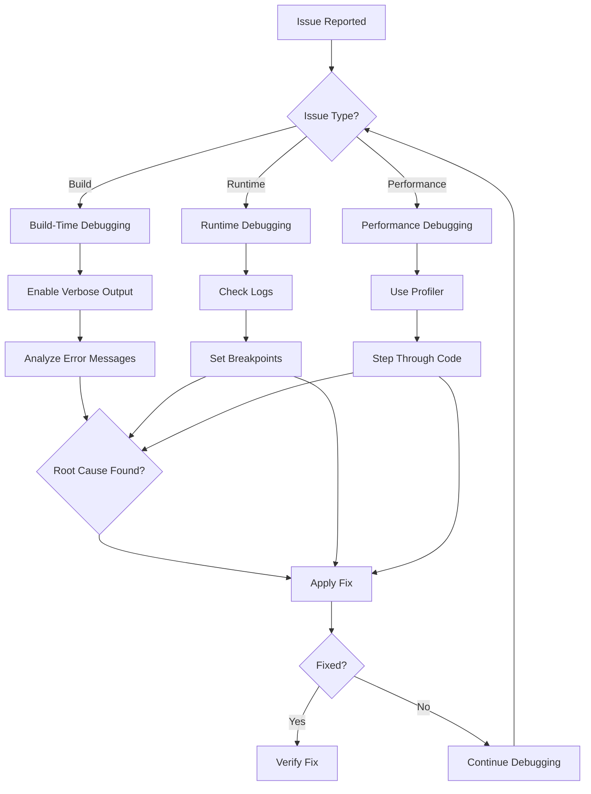
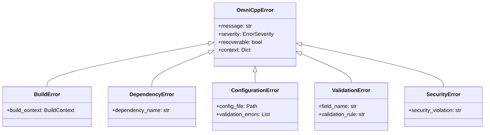

# Debugging Guide

This guide covers debugging techniques and tools for OmniCpp template project, including logging, breakpoints, profilers, and error handling strategies.

## Why Debugging Matters

Effective debugging is essential for:

- **Rapid Problem Resolution**: Identify and fix issues quickly
- **Understanding System Behavior**: Trace execution flow and state changes
- **Performance Optimization**: Identify bottlenecks and optimize code
- **Code Quality**: Prevent bugs through systematic testing

The OmniCpp project includes built-in debugging support through its logging system and error handling framework.

## Debugging Workflow



## Logging System

### Log Levels

The OmniCpp project uses a structured logging system with multiple severity levels:

```cpp
#include <engine/logging/Logger.hpp>

void setup_logging() {
    auto logger = omnicpp::create_console_logger();
    
    // Set appropriate log level
    // Debug: Detailed information for debugging
    logger->set_level(omnicpp::LogLevel::Debug);
    
    // Info: General information
    // logger->set_level(omnicpp::LogLevel::Info);
    
    // Warning: Warning messages
    // logger->set_level(omnicpp::LogLevel::Warning);
    
    // Error: Error messages
    // logger->set_level(omnicpp::LogLevel::Error);
}
```

### Log Locations

| Log Type | Location | Purpose |
|-----------|-----------|---------|
| Controller logs | `OmniCppController.log` | Main controller execution |
| Engine logs | `logs/omnicpp.log` | Runtime engine logs |
| Build logs | `build/*/CMakeFiles/CMakeOutput.log` | CMake configuration output |
| Build errors | `build/*/CMakeFiles/CMakeError.log` | CMake configuration errors |

### Enabling Debug Logging

```bash
# Set log level via environment variable
export OMNICPP_LOG_LEVEL=Debug

# Or modify config/logging_cpp.json
{
  "level": "debug",
  "file": "logs/omnicpp.log",
  "format": "text"
}
```

### Log Message Format

```cpp
// Good: Structured logging with context
logger->log_info("Initializing renderer", {
    "renderer_type": "Vulkan",
    "gpu_vendor": "NVIDIA",
    "api_version": "1.3"
});

// Bad: Unstructured logging
logger->log_info("Initializing renderer");
logger->log_info("GPU vendor: NVIDIA");
logger->log_info("API version: 1.3");
```

## Error Handling System

The OmniCpp project includes a comprehensive error handling system in [`omni_scripts/error_handler.py`](../../omni_scripts/error_handler.py).

### Exception Hierarchy



### Using Error Handler

```cpp
#include <omni_scripts/error_handler.hpp>

void safe_operation() {
    try {
        // Operation that might fail
        perform_risky_operation();
        
    } catch (const omnicpp::OmniCppError& e) {
        // Log error with context
        logger->log_error(std::string("Operation failed: ") + e.message, {
            "context": e.context
        });
        
        // Attempt recovery
        if (error_handler.attempt_recovery(e)) {
            logger->log_info("Recovery successful");
        } else {
            // Re-raise if not recoverable
            throw;
        }
    }
}
```

### Retry Mechanism

```cpp
#include <omni_scripts/error_handler.hpp>

@retry_on_failure(RetryConfig(
    max_attempts=3,
    initial_delay=1.0,
    backoff_factor=2.0,
    max_delay=60.0
))
void network_operation() {
    // Automatically retries with exponential backoff
    fetch_remote_data();
}
```

## Build-Time Debugging

### Verbose CMake Output

```bash
# Enable verbose CMake output
cmake -S . -B build --verbose --trace

# Check CMake cache
cat build/CMakeCache.txt | grep CMAKE_BUILD_TYPE

# Check CMake files
cat build/CMakeFiles/CMakeOutput.log
```

### Conan Debug Output

```bash
# Enable verbose Conan output
conan install . --verbose

# Check Conan cache
conan cache list

# Inspect Conan graph
conan graph . --format=html
```

## Runtime Debugging

### Breakpoint Debugging

#### Setting Breakpoints in VSCode

```json
// .vscode/launch.json
{
  "version": "0.2.0",
  "configurations": [
    {
      "name": "Debug",
      "type": "cppdbg",
      "request": "launch",
      "program": "${workspaceFolder}/build/debug/omnicpp",
      "args": [],
      "stopAtEntry": false,
      "cwd": "${workspaceFolder}",
      "environment": [],
      "externalConsole": false,
      "MIMode": "gdb",
      "setupCommands": [
        {
          "description": "Enable pretty-printing for gdb",
          "text": "-enable-pretty-printing",
          "ignoreFailures": true
        }
      ]
    }
  ]
}
```

#### Setting Breakpoints in GDB

```bash
# Start GDB with breakpoints
gdb ./build/debug/omnicpp

# Set breakpoint at line
(gdb) break main.cpp:42

# Set conditional breakpoint
(gdb) break main.cpp:42 if entity_count > 100

# Set watchpoint
(gdb) watch entity_count

# Continue execution
(gdb) continue

# Print backtrace
(gdb) bt

# Print local variables
(gdb) info locals
```

#### Setting Breakpoints in LLDB (macOS)

```bash
# Start LLDB with breakpoints
lldb ./build/debug/omnicpp

# Set breakpoint at line
(lldb) breakpoint set --file main.cpp --line 42

# Set conditional breakpoint
(lldb) breakpoint set --condition entity_count > 100

# Set watchpoint
(lldb) watchpoint set variable entity_count

# Continue execution
(lldb) continue

# Print backtrace
(lldb) bt

# Print local variables
(lldb) frame variable
```

### Conditional Breakpoints

```cpp
// Use conditional breakpoints for complex scenarios
void update_entities() {
    for (auto& entity : entities) {
        // Breakpoint only when entity_count > 1000
        if (entity_count > 1000) {
            // Set breakpoint here in debugger
            logger->log_debug("Entity count: " + std::to_string(entity_count));
        }
        
        entity->update();
    }
}
```

### Watchpoints

```bash
# Watch variable changes in GDB
(gdb) watch entity_count

# Watch memory location
(gdb) watch *0x7fff1234

# Watch expression
(gdb) watch entity_count > 1000
```

## Performance Profiling

### Built-in Profiler

```cpp
#include <engine/utils/profiler.hpp>

void profile_game_loop() {
    Profiler profiler("Game Loop");
    
    // Profile entire frame
    profiler.start();
    
    update_physics();
    profiler.stop("Physics");
    
    update_ai();
    profiler.stop("AI");
    
    render_scene();
    profiler.stop("Rendering");
    
    // Log results
    profiler.log();
    
    // Output:
    // Game Loop: 16.7ms
    //   - Physics: 2.3ms
    //   - AI: 8.4ms
    //   - Rendering: 6.0ms
}
```

### Frame Time Analysis

```cpp
class FrameTimeTracker {
    std::array<float, 60> frame_times;
    size_t index = 0;
    
public:
    void add_frame_time(float time) {
        frame_times[index] = time;
        index = (index + 1) % frame_times.size();
    }
    
    void analyze() {
        float avg = 0.0f;
        float max = 0.0f;
        float min = std::numeric_limits<float>::max();
        
        for (float time : frame_times) {
            avg += time;
            max = std::max(max, time);
            min = std::min(min, time);
        }
        
        avg /= frame_times.size();
        
        logger->log_info("Frame time - Avg: " + std::to_string(avg * 1000.0f) + 
                         "ms, Min: " + std::to_string(min * 1000.0f) + 
                         "ms, Max: " + std::to_string(max * 1000.0f) + "ms");
    }
};
```

### Memory Profiling

```bash
# Linux with valgrind
valgrind --tool=massif --leak-check=full ./build/debug/omnicpp

# Windows with Dr. Memory
drmemory ./build/debug/omnicpp.exe

# macOS with Instruments
instruments -t "Allocations" -D "omnicpp" ./build/release/omnicpp.app
```

### GPU Profiling

```bash
# Use RenderDoc for GPU profiling
# 1. Install RenderDoc from https://renderdoc.org/
# 2. Launch application through RenderDoc
# 3. Capture frames during execution
# 4. Analyze draw calls, API usage, and performance

# Use NVIDIA Nsight for NVIDIA GPUs
# 1. Install Nsight Systems
# 2. Profile application
# 3. Analyze GPU usage and bottlenecks

# Use AMD Radeon GPU Profiler for AMD GPUs
# 1. Install Radeon GPU Profiler
# 2. Profile application
# 3. Analyze GPU performance
```

## Common Debugging Scenarios

### Engine Initialization Fails

**Symptom**: `create_engine()` returns `nullptr`

**Debugging Steps**:

1. Enable debug logging
2. Check [`OmniCppController.log`](../../OmniCppController.log) for initialization errors
3. Verify subsystem creation in debugger
4. Check Vulkan/Qt installation

```cpp
// Add debug logging
auto logger = omnicpp::create_console_logger();
logger->set_level(omnicpp::LogLevel::Debug);

// Create engine with error handling
try {
    auto engine = omnicpp::create_engine(config);
    
    if (!engine) {
        logger->log_error("Failed to create engine");
        logger->log_error("Check Vulkan installation");
        logger->log_error("Check Qt installation");
        return 1;
    }
    
    // Set breakpoint here
    engine->run();
    
} catch (const std::exception& e) {
    logger->log_error(std::string("Exception: ") + e.what());
    return 1;
}
```

### Entity Creation Fails

**Symptom**: `create_entity()` returns invalid entity

**Debugging Steps**:

1. Check entity pool size
2. Verify scene initialization
3. Set breakpoint at entity creation
4. Inspect entity state in debugger

```cpp
void debug_entity_creation(Scene& scene) {
    logger->log_info("Entity count: " + std::to_string(scene.get_entity_count()));
    logger->log_info("Max entities: " + std::to_string(kMaxEntities));
    
    // Set breakpoint here
    auto entity = scene.create_entity();
    
    if (!entity.is_valid()) {
        logger->log_error("Entity creation failed");
        logger->log_error("Entity ID: " + std::to_string(entity.get_id()));
        
        // Inspect entity in debugger
        // Check entity pool state
        // Verify scene initialization
    }
}
```

### Resource Loading Fails

**Symptom**: `load_model()` returns `nullptr`

**Debugging Steps**:

1. Check file path
2. Verify file exists
3. Check file format
4. Set breakpoint at resource loading

```cpp
void debug_resource_loading(ResourceManager& manager) {
    std::string path = "assets/models/cube.obj";
    
    // Check file path
    logger->log_info("Loading: " + path);
    logger->log_info("Exists: " + std::to_string(std::filesystem::exists(path)));
    
    // Set breakpoint here
    auto model = manager.load_model(path);
    
    if (!model) {
        logger->log_error("Failed to load model");
        logger->log_error("Path: " + path);
        logger->log_error("Working directory: " + std::filesystem::current_path().string());
        
        // Inspect in debugger
        // Check file permissions
        // Verify file format
    }
}
```

### Performance Issues

**Symptom**: Low frame rate or high memory usage

**Debugging Steps**:

1. Enable performance logging
2. Use built-in profiler
3. Profile specific functions
4. Analyze profiler output

```cpp
void debug_performance(Engine& engine) {
    // Enable performance logging
    logger->set_performance_logging(true);
    
    // Profile game loop
    Profiler profiler("Game Loop");
    profiler.start();
    
    engine->update();
    profiler.stop("Update");
    
    engine->render();
    profiler.stop("Render");
    
    profiler.log();
    
    // Analyze output
    // Look for functions taking >5ms
    // Check memory allocations
    // Identify draw call count
}
```

## Debugging Tools

### VSCode Debugging

**Features**:
- Integrated debugger with GDB/LLDB support
- Breakpoint management
- Variable inspection
- Call stack viewing
- Watchpoints and conditional breakpoints

**Setup**:

1. Install C/C++ extension
2. Configure [`launch.json`](../../.vscode/launch.json)
3. Set breakpoints in source files
4. Press F5 to start debugging

### GDB Commands

| Command | Description |
|---------|-------------|
| `break <file>:<line>` | Set breakpoint at line |
| `break <function>` | Set breakpoint at function |
| `condition <expression>` | Set conditional breakpoint |
| `watch <variable>` | Watch variable for changes |
| `continue` | Continue execution |
| `step` | Step to next line |
| `next` | Step over function call |
| `finish` | Execute until current function returns |
| `bt` | Print backtrace |
| `info locals` | Print local variables |
| `info args` | Print function arguments |

### LLDB Commands

| Command | Description |
|---------|-------------|
| `breakpoint set --file <file> --line <line>` | Set breakpoint |
| `breakpoint set --condition <expression>` | Set conditional breakpoint |
| `watchpoint set variable <variable>` | Watch variable |
| `continue` | Continue execution |
| `step` | Step to next line |
| `next` | Step over function call |
| `finish` | Execute until current function returns |
| `bt` | Print backtrace |
| `frame variable` | Print local variables |

## Debugging Best Practices

### 1. Start with Verbose Logging

```cpp
// Always enable debug logging first
logger->set_level(LogLevel::Debug);
logger->set_verbose(true);
```

### 2. Use Structured Logging

```cpp
// Good: Structured logging with context
logger->log_info("Loading texture", {
    "path": texture_path,
    "size": texture_size,
    "format": texture_format
});

// Bad: Unstructured logging
logger->log_info("Loading texture: " + texture_path);
logger->log_info("Size: " + std::to_string(texture_size));
```

### 3. Set Meaningful Breakpoints

```cpp
// Set breakpoints at critical decision points
void critical_function() {
    // Breakpoint here to inspect state
    auto result = make_decision();
    
    // Breakpoint here to verify result
    process_result(result);
}
```

### 4. Use Watchpoints for State Changes

```bash
# Watch for state changes
(gdb) watch game_state

# Watch for memory changes
(gdb) watch *entity_ptr
```

### 5. Profile Before Optimizing

```cpp
// Always profile before optimizing
Profiler profiler("Function to optimize");
profiler.start();

function_to_optimize();

profiler.stop();
profiler.log();

// Analyze results before making changes
```

### 6. Check Error Context

```cpp
catch (const OmniCppError& e) {
    // Log full error context
    logger->log_error(e.message, e.context);
    
    // Check specific context fields
    if (e.context.count("build_context")) {
        logger->log_info("Build context: " + e.context.at("build_context"));
    }
}
```

## Common Debugging Patterns

### Pattern 1: Binary Search Debugging

**Problem**: Narrow down issue location by dividing search space

**Solution**:

```cpp
// Use binary search to find problematic code
void debug_with_binary_search() {
    // Comment out half the code
    // If issue persists, uncomment and comment other half
    // Repeat until issue is isolated
}
```

### Pattern 2: Minimal Reproduction

**Problem**: Complex scenarios make debugging difficult

**Solution**:

```cpp
// Create minimal test case
void minimal_test() {
    // Only include essential code
    auto entity = scene.create_entity();
    entity.add_component<TransformComponent>({});
    
    // Test in isolation
    entity.update();
}
```

### Pattern 3: Assertion Debugging

**Problem**: Silent failures without error messages

**Solution**:

```cpp
// Use assertions to catch invalid states
void update_entity(Entity& entity) {
    // Assert preconditions
    assert(entity.is_valid() && "Entity must be valid");
    assert(entity.has_component<TransformComponent>() && "Entity must have transform");
    
    // Safe to proceed
    entity.update();
}
```

## Related Documentation

- [Troubleshooting Overview](index.md)
- [Build Issues](build-issues.md)
- [Runtime Issues](runtime-issues.md)
- [Configuration Issues](configuration-issues.md)
- [Performance Issues](performance-issues.md)
- [Error Handler](../../omni_scripts/error_handler.py)
- [Logging System](../engine/logging.md)
