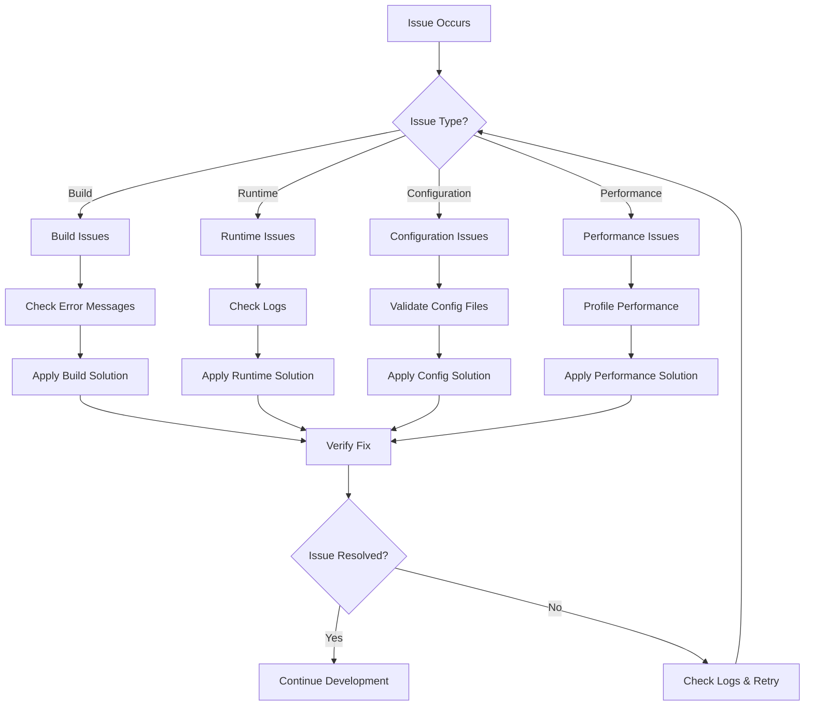
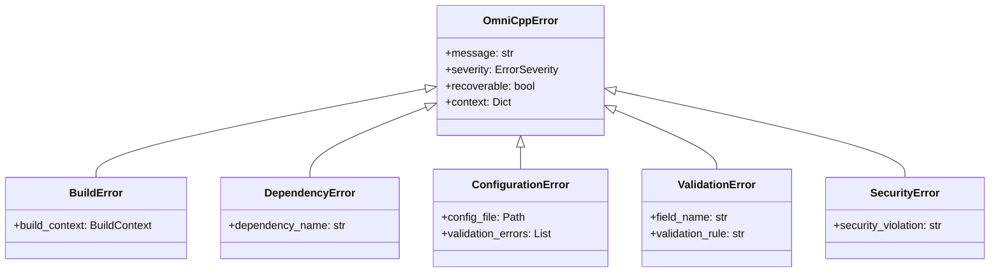

# Troubleshooting Overview

This section provides comprehensive troubleshooting guidance for the OmniCpp template project. It covers common issues encountered during development, building, and runtime execution.

## Why Troubleshooting Matters

Building a C++ game engine with multiple compilers, toolchains, and platforms inevitably leads to issues. The OmniCpp template uses a complex build system involving CMake, Conan, and multiple compiler configurations (MSVC, MSVC-Clang, MinGW-GCC, MinGW-Clang, GCC, Clang).

Understanding how to diagnose and resolve issues efficiently saves development time and reduces frustration.

## Troubleshooting Philosophy

The OmniCpp project follows a systematic approach to troubleshooting:

1. **Identify the Problem Category**: Build, Runtime, Configuration, or Performance
2. **Check Error Messages**: Read the full error output, not just the last line
3. **Follow the Flow**: Use the provided diagrams to understand the execution path
4. **Apply Targeted Solutions**: Use the specific solution for your issue type
5. **Verify the Fix**: Confirm the issue is resolved before moving on

## Troubleshooting Flow

## Quick Reference

### Common Error Types

| Error Type | Typical Cause | First Action |
|------------|----------------|--------------|
| `CMakeConfigurationError` | Missing dependencies or invalid paths | Check [`config/build.json`](../../config/build.json) |
| `ConanInstallError` | Network issues or package conflicts | Clear Conan cache and retry |
| `ToolchainError` | Compiler not found or misconfigured | Verify compiler installation |
| `BuildError` | Compilation failures or linker errors | Check compiler output for specific errors |
| `ConfigurationError` | Invalid configuration parameters | Validate config files |

### Log Locations

| Log Type | Location | Purpose |
|-----------|-----------|---------|
| Build logs | `build/*/CMakeFiles/CMakeOutput.log` | CMake configuration output |
| Build errors | `build/*/CMakeFiles/CMakeError.log` | CMake configuration errors |
| Controller logs | `OmniCppController.log` | Main controller execution |
| Engine logs | `logs/` directory | Runtime engine logs |

## Getting Started

Choose the appropriate troubleshooting guide based on your issue:

- **Build Issues**: See [`build-issues.md`](build-issues.md) for CMake, Conan, and compiler problems
- **Runtime Issues**: See [`runtime-issues.md`](runtime-issues.md) for engine initialization, entity creation, and resource loading
- **Configuration Issues**: See [`configuration-issues.md`](configuration-issues.md) for profiles, toolchains, and environment variables
- **Performance Issues**: See [`performance-issues.md`](performance-issues.md) for frame rate, memory usage, and stuttering
- **Debugging Guide**: See [`debugging-guide.md`](debugging-guide.md) for logging, breakpoints, and profiling techniques

## Error Handling System

The OmniCpp project includes a comprehensive error handling system in [`omni_scripts/error_handler.py`](../../omni_scripts/error_handler.py). This system provides:

- **Structured Exception Hierarchy**: Custom exceptions for different error types
- **Retry Mechanisms**: Automatic retry with exponential backoff
- **Recovery Actions**: Registered recovery procedures for common errors
- **Error Logging**: Centralized logging with severity levels

### Exception Hierarchy

## Related Documentation

- [Getting Started Guide](../getting-started/index.md)
- [Build System Guide](../../docs/user-guide-build-system.md)
- [Compiler Detection](../../docs/compiler-detection.md)
- [Platform-Specific Builds](../../docs/linux-builds.md), [../../docs/msvc-builds.md), [../../docs/mingw-builds.md)
