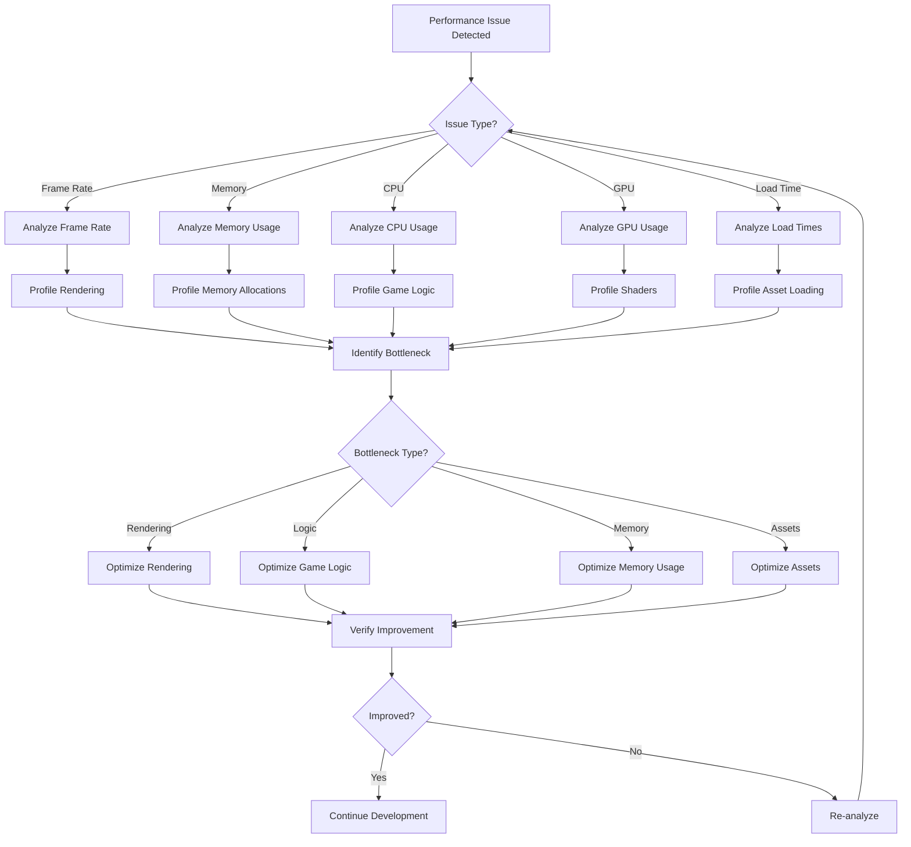

# Performance Issues

This guide covers common performance-related issues encountered when developing and running OmniCpp engine and games, including frame rate problems, memory usage, and optimization strategies.

## Why Performance Issues Occur

Performance issues can significantly impact user experience and development productivity:

- **Low Frame Rate**: Application runs below target FPS (typically 60 FPS)
- **High Memory Usage**: Excessive memory consumption causing crashes or slowdowns
- **Stuttering**: Inconsistent frame times causing janky gameplay
- **Long Load Times**: Assets or scenes taking too long to load
- **CPU Bottlenecks**: Excessive CPU usage limiting performance
- **GPU Bottlenecks**: Graphics operations overwhelming the GPU

Understanding and addressing these issues early prevents them from becoming critical problems later in development.

## Performance Analysis Flow



## Frame Rate Issues

### Low Frame Rate

**Symptom**: FPS below 60 at 1080p resolution

**Cause**: Too many draw calls, expensive shaders, or CPU bottleneck

**Solution**:

```cpp
#include <engine/render/RenderPipeline.hpp>
#include <engine/scene/Scene.hpp>

void optimize_rendering(omnicpp::IRenderer* renderer, omnicpp::Scene& scene) {
    // Bad: Individual draw calls
    // for (auto& entity : scene.get_entities()) {
    //     renderer->draw(entity);
    // }
    
    // Good: Batched draw calls
    renderer->begin_batch();
    for (auto& entity : scene.get_entities()) {
        renderer->add_to_batch(entity);
    }
    renderer->end_batch();
}
```

### Frame Time Spikes

**Symptom**: Inconsistent frame times causing stuttering

**Cause**: Garbage collection, asset loading, or shader compilation

**Solution**:

```cpp
#include <chrono>

void game_loop() {
    const float kFixedDeltaTime = 1.0f / 60.0f;
    float accumulator = 0.0f;
    
    while (is_running) {
        float frame_time = timer.get_delta_time();
        accumulator += frame_time;
        
        // Fixed timestep for consistent physics
        while (accumulator >= kFixedDeltaTime) {
            update(kFixedDeltaTime);
            accumulator -= kFixedDeltaTime;
        }
        
        render();
    }
}
```

### Too Many Draw Calls

**Symptom**: GPU overwhelmed by individual draw calls

**Cause**: Rendering each entity separately without batching

**Solution**:

```cpp
// Implement frustum culling
void Scene::render(IRenderer* renderer, const Camera& camera) {
    Frustum frustum = camera.get_frustum();
    
    for (auto& entity : entities) {
        if (frustum.contains(entity.get_bounds())) {
            renderer->draw(entity);
        }
    }
}

// Implement instanced rendering
void render_instanced_meshes(const std::vector<Mesh>& meshes) {
    renderer->draw_instanced(meshes.data(), meshes.size());
}
```

## Memory Issues

### High Memory Usage

**Symptom**: Application uses excessive memory (>2GB for typical game)

**Cause**: Memory leaks, large textures, or uncached resources

**Solution**:

```cpp
#include <engine/memory/memory_manager.hpp>

void optimize_memory_usage() {
    // Use texture compression
    TextureLoader loader;
    loader.set_compression(TextureCompression::ASTC);
    
    // Implement resource pooling
    class TexturePool {
        std::vector<Texture*> pool;
        size_t max_size = 100;
        
    public:
        Texture* acquire() {
            for (auto& texture : pool) {
                if (!texture->in_use) {
                    texture->in_use = true;
                    return texture;
                }
            }
            return nullptr;
        }
        
        void release(Texture* texture) {
            texture->in_use = false;
        }
    };
    
    // Use texture atlases
    TextureAtlas atlas;
    atlas.pack_textures(textures);
}
```

### Memory Leaks

**Symptom**: Memory usage increases over time without releasing

**Cause**: Not releasing resources or circular references

**Solution**:

```cpp
#include <memory>
#include <engine/resources/ResourceManager.hpp>

class ScopedResource {
    std::unique_ptr<Resource> resource;
    
public:
    ScopedResource(Resource* res) : resource(res) {}
    ~ScopedResource() {
        // Automatically release when out of scope
        resource->release();
    }
};

void use_resources_safely() {
    {
        // Resource automatically released at end of scope
        ScopedResource texture(resource_manager.load_texture("diffuse.png"));
        
        // Use texture
        texture->bind();
        texture->upload_data();
        
    } // Texture released here
}
```

### Out of Memory Crashes

**Symptom**: Application crashes with "out of memory" error

**Cause**: Loading too many resources or large assets

**Solution**:

```cpp
#include <engine/memory/memory_manager.hpp>

void load_with_memory_check(ResourceManager& manager, const std::string& path) {
    size_t available_memory = get_available_memory();
    size_t required_memory = estimate_resource_size(path);
    
    if (available_memory < required_memory) {
        logger->log_warning("Insufficient memory for: " + path);
        logger->log_info("Available: " + std::to_string(available_memory) + 
                         " Required: " + std::to_string(required_memory));
        
        // Unload unused resources
        manager.unload_unused_resources();
        
        // Retry loading
        if (get_available_memory() >= required_memory) {
            manager.load_resource(path);
        } else {
            logger->log_error("Still insufficient memory after cleanup");
        }
    } else {
        manager.load_resource(path);
    }
}
```

## Asset Loading Issues

### Long Load Times

**Symptom**: Assets or scenes taking >5 seconds to load

**Cause**: Synchronous loading, unoptimized assets, or slow storage

**Solution**:

```cpp
#include <thread>
#include <future>

class AsyncLoader {
    std::thread loading_thread;
    std::queue<std::string> load_queue;
    
public:
    void load_async(const std::string& path) {
        load_queue.push(path);
    }
    
    void update() {
        while (!load_queue.empty()) {
            std::string path = load_queue.front();
            load_queue.pop();
            
            // Load in background thread
            auto future = std::async(std::launch::async, [this, path]() {
                return resource_manager.load(path);
            });
            
            // Check completion
            if (future.wait_for(std::chrono::milliseconds(16)) == 
                std::future_status::ready) {
                    logger->log_info("Loaded: " + path);
                }
        }
    }
};
```

### Unoptimized Assets

**Symptom**: Assets load slowly or use excessive memory

**Cause**: Large textures, uncompressed formats, or inefficient meshes

**Solution**:

```bash
# Compress textures
astcenc -c input.png -o output.astc

# Optimize meshes
meshoptimizer -i input.obj -o output.obj -simplify

# Convert to efficient formats
gltf-pipeline -i input.fbx -o output.gltf --draco-compression
```

## CPU Bottlenecks

### Excessive Physics Calculations

**Symptom**: CPU usage high during physics simulation

**Cause**: Too many physics objects or inefficient collision detection

**Solution**:

```cpp
// Implement spatial partitioning
class SpatialHash {
    std::vector<std::vector<Entity*>> buckets;
    size_t bucket_size = 100;
    
public:
    void update(Entity* entity) {
        size_t bucket_index = hash_position(entity->get_position()) % bucket_size;
        buckets[bucket_index].push_back(entity);
    }
    
    std::vector<Entity*> get_nearby(const Vec3& position, float radius) {
        size_t bucket_index = hash_position(position) % bucket_size;
        return buckets[bucket_index];
    }
};

// Use broad phase collision detection
void physics_update() {
    // Broad phase: find potential collisions
    auto potential_collisions = spatial_hash.get_nearby(entity->get_position(), radius);
    
    // Narrow phase: precise collision detection
    for (auto& other : potential_collisions) {
        if (check_collision(entity, other)) {
            resolve_collision(entity, other);
        }
    }
}
```

### Inefficient Game Logic

**Symptom**: CPU usage high during game logic updates

**Cause**: O(n²) algorithms or unnecessary calculations

**Solution**:

```cpp
// Use efficient data structures
#include <unordered_map>

// Bad: Linear search
Entity* find_entity_linear(const std::string& name) {
    for (auto& entity : entities) {
        if (entity->get_name() == name) {
            return entity;
        }
    }
    return nullptr;
}

// Good: Hash map lookup
std::unordered_map<std::string, Entity*> entity_map;

Entity* find_entity_hash(const std::string& name) {
    auto it = entity_map.find(name);
    if (it != entity_map.end()) {
        return it->second;
    }
    return nullptr;
}

// Cache frequently used values
class TransformCache {
    std::unordered_map<size_t, Matrix4> cache;
    
public:
    const Matrix4& get_world_matrix(size_t entity_id) {
        auto it = cache.find(entity_id);
        if (it != cache.end()) {
            Matrix4 matrix = calculate_world_matrix(entity_id);
            cache[entity_id] = matrix;
            return matrix;
        }
        return it->second;
    }
};
```

## GPU Bottlenecks

### Expensive Shaders

**Symptom**: GPU usage high during rendering

**Cause**: Complex shaders or too many shader variants

**Solution**:

```glsl
// Bad: Complex calculations in fragment shader
#version 450
layout(location = 0) in vec3 fragColor;
layout(location = 1) in vec3 fragNormal;
layout(location = 2) in vec2 fragTexCoord;

void main() {
    vec3 normal = normalize(fragNormal);
    vec3 light_dir = normalize(light_position - frag_position);
    float diff = max(dot(normal, light_dir), 0.0);
    vec3 diffuse = diff * light_color;
    vec3 view_dir = normalize(view_position - frag_position);
    float spec = pow(max(dot(view_dir, reflect(-light_dir, normal)), 0.0), 32.0);
    fragColor = (ambient + diffuse) * texture_color + spec * light_specular;
}

// Good: Precompute lighting
#version 450
layout(location = 0) in vec3 fragColor;
layout(location = 1) in vec3 fragNormal;
layout(location = 2) in vec2 fragTexCoord;
layout(location = 3) in sampler2D textureSampler;

uniform sampler2D textureSampler;
uniform vec3 light_positions[4];
uniform vec3 light_colors[4];

void main() {
    vec3 normal = normalize(fragNormal);
    vec3 result = vec3(0.0);
    
    // Precomputed lighting (much faster)
    for (int i = 0; i < 4; ++i) {
        vec3 light_dir = normalize(light_positions[i] - frag_position);
        float diff = max(dot(normal, light_dir), 0.0);
        result += diff * light_colors[i];
    }
    
    fragColor = result * texture(textureSampler, fragTexCoord);
}
```

### Too Many State Changes

**Symptom**: GPU pipeline stalls from frequent state changes

**Cause**: Changing render state for each draw call

**Solution**:

```cpp
// Minimize state changes
void render_sorted(Scene& scene) {
    // Sort by material to minimize state changes
    auto sorted_entities = scene.get_entities_sorted_by_material();
    
    Material* current_material = nullptr;
    
    for (auto& entity : sorted_entities) {
        auto* material = entity->get_material();
        
        if (material != current_material) {
            renderer->set_material(material);
            current_material = material;
        }
        
        renderer->draw(entity);
    }
}
```

## Profiling Techniques

### Built-in Profiler

```cpp
#include <engine/utils/profiler.hpp>

void profile_function() {
    Profiler profiler("Render Scene");
    profiler.start();
    
    renderer->render_scene(scene);
    
    profiler.stop();
    profiler.log();
    
    // Output:
    // Render Scene: 15.3ms
    //   - Update Scene: 2.1ms
    //   - Draw Entities: 12.8ms
    //   - Post-Processing: 0.4ms
}
```

### Frame Time Analysis

```cpp
class FrameTimeAnalyzer {
    std::array<float, 60> frame_times;
    size_t index = 0;
    
public:
    void add_frame_time(float time) {
        frame_times[index] = time;
        index = (index + 1) % frame_times.size();
    }
    
    void analyze() {
        float avg = 0.0f;
        float max = 0.0f;
        
        for (float time : frame_times) {
            avg += time;
            max = std::max(max, time);
        }
        
        avg /= frame_times.size();
        
        logger->log_info("Frame time - Avg: " + std::to_string(avg * 1000.0f) + 
                         "ms, Max: " + std::to_string(max * 1000.0f) + "ms");
    }
};
```

### Memory Profiling

```bash
# Linux with valgrind
valgrind --leak-check=full --show-leak-kinds=all ./build/debug/omnicpp

# Windows with Dr. Memory
drmemory -- ./build/debug/omnicpp.exe

# macOS with Instruments
instruments -t "Time Profiler" ./build/release/omnicpp.app
```

## Optimization Strategies

### Level of Detail (LOD)

```cpp
class LODManager {
    std::vector<Mesh*> lod_meshes;
    
public:
    Mesh* get_mesh(float distance) {
        if (distance < 50.0f) {
            return lod_meshes[0];  // High detail
        } else if (distance < 100.0f) {
            return lod_meshes[1];  // Medium detail
        } else {
            return lod_meshes[2];  // Low detail
        }
    }
};
```

### Object Pooling

```cpp
template<typename T, size_t PoolSize>
class ObjectPool {
    std::array<T, PoolSize> pool;
    std::array<bool, PoolSize> used;
    
public:
    T* acquire() {
        for (size_t i = 0; i < PoolSize; ++i) {
            if (!used[i]) {
                used[i] = true;
                return &pool[i];
            }
        }
        return nullptr;
    }
    
    void release(T* object) {
        size_t index = object - &pool[0];
        used[index] = false;
    }
};
```

## Common Performance Metrics

| Metric | Target | Acceptable | Action |
|--------|--------|-----------|--------|
| Frame Rate | 60 FPS at 1080p | >55 FPS | Profile rendering |
| Frame Time | <16.6ms (60 FPS) | <20ms | Optimize game logic |
| Memory Usage | <2GB for typical game | <1.5GB | Implement pooling |
| Draw Calls | <1000 per frame | <500 | Implement batching |
| Load Time | <3 seconds | <1 second | Use async loading |
| GPU Usage | <80% | <90% | Optimize shaders |

## Debugging Performance Issues

### Enable Performance Logging

```cpp
// Set log level to capture performance data
logger->set_level(LogLevel::Info);
logger->set_performance_logging(true);

// Log frame times
logger->log_performance("Frame time: " + std::to_string(frame_time) + "ms");
logger->log_performance("Draw calls: " + std::to_string(draw_count));
logger->log_performance("Memory usage: " + std::to_string(memory_usage) + "MB");
```

### Use Performance Counters

```cpp
#include <engine/utils/performance_counters.hpp>

class PerformanceCounters {
    size_t draw_calls = 0;
    size_t triangle_count = 0;
    size_t texture_bindings = 0;
    
public:
    void reset() {
        draw_calls = 0;
        triangle_count = 0;
        texture_bindings = 0;
    }
    
    void log_frame() {
        logger->log_info("Frame stats - Draws: " + std::to_string(draw_calls) + 
                         ", Tris: " + std::to_string(triangle_count) + 
                         ", Tex Binds: " + std::to_string(texture_bindings));
    }
};
```

## Related Documentation

- [Troubleshooting Overview](index.md)
- [Build Issues](build-issues.md)
- [Runtime Issues](runtime-issues.md)
- [Configuration Issues](configuration-issues.md)
- [Debugging Guide](debugging-guide.md)
- [Renderer Documentation](../engine/renderer.md)
- [Resource Manager](../engine/resource-manager.md)
- [Memory Management](../engine/memory.md)
