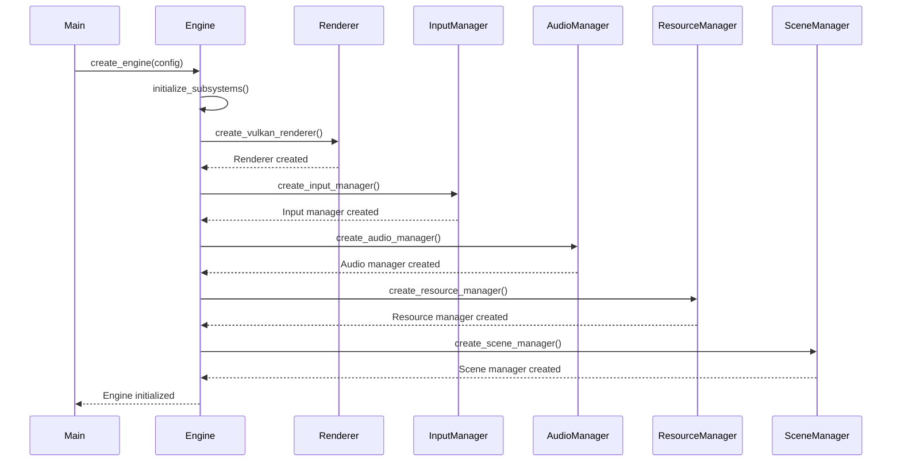

# Runtime Issues

This guide covers common runtime issues encountered when running OmniCpp engine and games, including engine initialization, entity management, resource loading, and platform-specific problems.

## Why Runtime Issues Occur

Runtime issues occur when the application is executing, as opposed to build-time issues. These can be caused by:

- **Missing Resources**: Assets or libraries not found at runtime
- **Invalid Configuration**: Engine or subsystems misconfigured
- **Platform-Specific Issues**: Vulkan, Qt, or OS-specific problems
- **Memory Issues**: Leaks, insufficient memory, or access violations
- **Logic Errors**: Incorrect entity/component usage

## Runtime Initialization Flow



## Engine Initialization Issues

### Engine Creation Fails

**Symptom**: `create_engine()` returns `nullptr` or throws exception

**Cause**: Missing subsystems or invalid configuration

**Solution**:

```cpp
#include <engine/Engine.hpp>
#include <engine/logging/Logger.hpp>

int main() {
    // Create logger first to capture initialization errors
    auto logger = omnicpp::create_console_logger();
    logger->set_level(omnicpp::LogLevel::Debug);
    
    // Create engine configuration
    omnicpp::EngineConfig config;
    config.renderer = nullptr;  // Use default renderer
    config.logger = logger.get();  // Use our logger
    
    try {
        // Create engine with error handling
        auto engine = omnicpp::create_engine(config);
        
        if (!engine) {
            logger->log_error("Failed to create engine");
            return 1;
        }
        
        // Run engine
        engine->run();
        
    } catch (const std::exception& e) {
        logger->log_error(std::string("Exception: ") + e.what());
        return 1;
    }
    
    return 0;
}
```

Check [`include/engine/Engine.hpp`](../../include/engine/Engine.hpp) for engine interface.

### Subsystem Initialization Fails

**Symptom**: Specific subsystem (renderer, input, audio) fails to initialize

**Cause**: Missing dependencies or invalid configuration

**Solution**:

```cpp
// Test each subsystem individually
auto renderer = omnicpp::create_vulkan_renderer();
if (!renderer) {
    logger->log_error("Failed to create renderer");
    // Check Vulkan installation
}

auto input = omnicpp::create_input_manager();
if (!input) {
    logger->log_error("Failed to create input manager");
    // Check input system
}

auto audio = omnicpp::create_audio_manager();
if (!audio) {
    logger->log_error("Failed to create audio manager");
    // Check audio system
}
```

## Entity-Component System Issues

### Entity Creation Fails

**Symptom**: `create_entity()` returns invalid entity or throws exception

**Cause**: Entity pool exhausted or scene not initialized

**Solution**:

```cpp
#include <engine/ecs/Entity.hpp>
#include <engine/scene/Scene.hpp>

void create_entities(omnicpp::Scene& scene) {
    // Check entity pool size
    const size_t kMaxEntities = 10000;
    if (scene.get_entity_count() >= kMaxEntities) {
        logger->log_warning("Entity pool exhausted");
        return;
    }
    
    // Initialize scene before creating entities
    if (!scene.is_initialized()) {
        logger->log_error("Scene not initialized");
        scene.initialize();
    }
    
    // Create entity
    auto entity = scene.create_entity();
    if (!entity.is_valid()) {
        logger->log_error("Failed to create entity");
        return;
    }
    
    // Add components
    entity.add_component<omnicpp::TransformComponent>({});
    entity.add_component<omnicpp::MeshComponent>({});
}
```

See [`include/engine/ecs/Entity.hpp`](../../include/engine/ecs/Entity.hpp) for entity interface.

### Component Access Fails

**Symptom**: `get_component()` returns `nullptr` or throws exception

**Cause**: Component not added or wrong component type

**Solution**:

```cpp
#include <engine/ecs/Entity.hpp>
#include <engine/ecs/TransformComponent.hpp>
#include <engine/ecs/MeshComponent.hpp>

void access_components(omnicpp::Entity& entity) {
    // Verify component was added
    if (!entity.has_component<omnicpp::TransformComponent>()) {
        logger->log_error("TransformComponent not added to entity");
        return;
    }
    
    // Use correct component type
    // Wrong: auto* mesh = entity.get_component<omnicpp::MeshComponent>();
    // Correct: auto& mesh = entity.get_component<omnicpp::MeshComponent>();
    
    auto& transform = entity.get_component<omnicpp::TransformComponent>();
    auto& mesh = entity.get_component<omnicpp::MeshComponent>();
    
    // Access component data
    transform.position = {0.0f, 0.0f, 0.0f};
    mesh.mesh_id = 123;
}
```

## Resource Loading Issues

### Resource Not Found

**Symptom**: `load_model()` returns `nullptr` or throws exception

**Cause**: File not found, unsupported format, or incorrect path

**Solution**:

```cpp
#include <engine/resources/ResourceManager.hpp>
#include <filesystem>

void load_resources(omnicpp::ResourceManager& manager) {
    std::string path = "assets/models/cube.obj";
    
    // Check file path
    if (!std::filesystem::exists(path)) {
        logger->log_error("File not found: " + path);
        return;
    }
    
    // Verify file format
    std::string extension = std::filesystem::path(path).extension();
    if (extension != ".obj" && extension != ".gltf") {
        logger->log_error("Unsupported file format: " + extension);
        return;
    }
    
    // Load resource
    auto model = manager.load_model(path);
    if (!model) {
        logger->log_error("Failed to load model: " + path);
        return;
    }
    
    logger->log_success("Model loaded: " + path);
}
```

See [`include/engine/resources/ResourceManager.hpp`](../../include/engine/resources/ResourceManager.hpp) for resource manager interface.

### Out of Memory

**Symptom**: Application crashes with "out of memory" error

**Cause**: Loading too many resources or large textures

**Solution**:

```cpp
#include <engine/memory/memory_manager.hpp>

void load_with_memory_check(omnicpp::ResourceManager& manager) {
    size_t available_memory = omnicpp::get_available_memory();
    size_t required_memory = estimate_model_size(path);
    
    if (available_memory < required_memory) {
        logger->log_warning("Insufficient memory for model");
        logger->log_info("Available: " + std::to_string(available_memory) + 
                         " Required: " + std::to_string(required_memory));
        return;
    }
    
    // Load resource
    auto model = manager.load_model(path);
}
```

## Vulkan-Specific Issues

### Vulkan Not Found

**Symptom**: `Failed to find Vulkan` or `VK_NO_PROTOTYPES` errors

**Cause**: Vulkan SDK not installed or not in PATH

**Solution**:

```bash
# Check Vulkan installation
vulkaninfo

# Set Vulkan SDK path (Windows)
set VULKAN_SDK=C:\VulkanSDK\1.3.261.1

# Set PATH
set PATH=%PATH%;%VULKAN_SDK%\bin

# Rebuild
cmake --build build --config Debug
```

See [`build-issues.md`](build-issues.md) for CMake configuration issues.

### Vulkan Validation Errors

**Symptom**: `VK_ERROR_VALIDATION_FAILED` or validation layer errors

**Cause**: Incorrect Vulkan API usage

**Solution**:

```cpp
#ifdef _DEBUG
    const char* validation_layers[] = {
        "VK_LAYER_KHRONOS_validation"
    };
    
    VkInstanceCreateInfo create_info{};
    create_info.enabledLayerCount = 1;
    create_info.ppEnabledLayerNames = validation_layers;
    
    VkInstance instance;
    VkResult result = vkCreateInstance(&create_info, nullptr, &instance);
    
    if (result != VK_SUCCESS) {
        logger->log_error("Failed to create Vulkan instance: " + std::to_string(result));
        return false;
    }
#endif
```

Use RenderDoc to debug Vulkan issues:
1. Install RenderDoc from [renderdoc.org](https://renderdoc.org/)
2. Capture frames during execution
3. Analyze draw calls and API usage

### Vulkan Device Creation Fails

**Symptom**: `vkCreateDevice` returns `VK_ERROR_INITIALIZATION_FAILED`

**Cause**: No suitable GPU or missing features

**Solution**:

```cpp
// Check available GPUs
uint32_t device_count = 0;
vkEnumeratePhysicalDevices(instance, &device_count, nullptr);

if (device_count == 0) {
    logger->log_error("No Vulkan-compatible GPU found");
    return false;
}

std::vector<VkPhysicalDevice> devices(device_count);
vkEnumeratePhysicalDevices(instance, &device_count, devices.data());

// Select first device (usually integrated)
VkPhysicalDevice selected_device = devices[0];

// Request fewer features
VkPhysicalDeviceFeatures features{};
features.samplerAnisotropy = VK_TRUE;  // Only request needed features

VkDeviceCreateInfo device_info{};
device_info.pEnabledFeatures = &features;

VkResult result = vkCreateDevice(selected_device, &device_info, nullptr, &device);
```

## Qt-Specific Issues

### Qt Not Found

**Symptom**: `Could not find Qt6` or `Qt6::Core` not found

**Cause**: Qt not installed or CMAKE_PREFIX_PATH not set

**Solution**:

```bash
# Check Qt installation
qmake --version

# Set CMAKE_PREFIX_PATH
cmake -S . -B build -DCMAKE_PREFIX_PATH=/path/to/Qt/6.5.0/gcc_64

# Or install Qt via vcpkg
vcpkg install qt6-base qt6-widgets
```

### Qt Plugin Loading Fails

**Symptom**: `Failed to load Qt platform plugin`

**Cause**: Missing Qt platform plugins or incorrect paths

**Solution**:

```bash
# Set QT_PLUGIN_PATH
export QT_PLUGIN_PATH=/path/to/Qt/plugins

# Copy plugins to executable directory
cp -r $QT_PLUGIN_PATH/platforms ./build/debug/

# Set QT_QPA_PLATFORM
export QT_QPA_PLATFORM=windows  # Windows
export QT_QPA_PLATFORM=xcb      # Linux
export QT_QPA_PLATFORM=cocoa     # macOS
```

## Platform-Specific Issues

### Windows DLL Not Found

**Symptom**: `The code execution cannot proceed because X.dll was not found`

**Cause**: Missing DLL in PATH or incorrect deployment

**Solution**:

```bash
# Copy required DLLs to executable directory
cp vcpkg_installed/x64-windows/bin/*.dll build/debug/

# Use static linking
cmake -DOMNICPP_USE_STATIC_RUNTIME=ON ..

# Or add DLL directory to PATH
set PATH=%PATH%;build/debug
```

### Linux Library Path Issues

**Symptom**: `error while loading shared libraries: libX.so: cannot open shared object file`

**Cause**: Library not in LD_LIBRARY_PATH

**Solution**:

```bash
# Set LD_LIBRARY_PATH
export LD_LIBRARY_PATH=/usr/local/lib:$LD_LIBRARY_PATH

# Use RPATH in CMake
set_target_properties(omnicpp PROPERTIES
    INSTALL_RPATH "$ORIGIN/../lib"
)
```

### macOS Code Signing Issues

**Symptom**: Application blocked by Gatekeeper

**Cause**: Unsigned application

**Solution**:

```bash
# Sign application
codesign --deep --force --verify --verbose --sign "Developer ID Application" ./build/release/omnicpp.app

# Disable Gatekeeper (development only)
sudo spctl --master-disable
```

## Common Runtime Error Messages

| Error Message | Source | Likely Cause | Solution |
|--------------|--------|--------------|----------|
| `Failed to create engine` | [`include/engine/Engine.hpp`](../../include/engine/Engine.hpp) | Missing subsystems | Check subsystem initialization |
| `Entity pool exhausted` | [`include/engine/ecs/Entity.hpp`](../../include/engine/ecs/Entity.hpp) | Too many entities | Increase pool size or reuse entities |
| `Component not found` | [`include/engine/ecs/Component.hpp`](../../include/engine/ecs/Component.hpp) | Wrong component type | Verify component was added |
| `Resource not found` | [`include/engine/resources/ResourceManager.hpp`](../../include/engine/resources/ResourceManager.hpp) | File path error | Check file exists and path |
| `VK_ERROR_VALIDATION_FAILED` | Vulkan API | Incorrect API usage | Enable validation layers and use RenderDoc |
| `Failed to load Qt plugin` | Qt platform | Missing plugins | Set QT_PLUGIN_PATH |
| `DLL not found` | Windows runtime | Missing dependencies | Copy DLLs to executable directory |

## Debugging Runtime Issues

### Enable Debug Logging

```cpp
// Set log level to Debug
logger->set_level(omnicpp::LogLevel::Debug);

// Enable verbose logging
logger->set_verbose(true);

// Log all subsystems
logger->log_info("Initializing renderer...");
logger->log_info("Initializing input...");
logger->log_info("Initializing audio...");
```

### Check Runtime Logs

```bash
# Engine logs
cat logs/omnicpp.log

# Platform-specific logs
# Windows: Event Viewer
# Linux: journalctl -u omnicpp
# macOS: Console.app
```

### Use Debuggers

```bash
# Windows with Visual Studio
devenv /debugexe omnicpp.exe

# Linux with GDB
gdb ./build/debug/omnicpp

# macOS with LLDB
lldb ./build/release/omnicpp
```

## Related Documentation

- [Troubleshooting Overview](index.md)
- [Build Issues](build-issues.md)
- [Configuration Issues](configuration-issues.md)
- [Performance Issues](performance-issues.md)
- [Debugging Guide](debugging-guide.md)
- [Engine Architecture](../engine/architecture.md)
- [Renderer Documentation](../engine/renderer.md)
- [Resource Manager](../engine/resource-manager.md)
