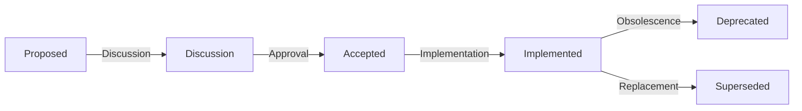

# ADR-0000: Architecture Decision Records Index

**Status:** Active
**Date:** 2026-01-27
**Context:** Master Index of All Architecture Decision Records

---

## Overview

This document serves as the master index for all Architecture Decision Records (ADRs) in the OmniCPP Template project. It provides a comprehensive overview of all architectural decisions, their status, and relationships.

## ADR Summary

### Statistics

- **Total ADRs:** 36
- **Accepted:** 36
- **Proposed:** 0
- **Deprecated:** 0
- **Superseded:** 0

### ADRs by Category

| Category | Count | ADRs |
|----------|-------|------|
| Package Management | 3 | ADR-001, ADR-002, ADR-003 |
| Build System | 3 | ADR-004, ADR-005, ADR-006 |
| Python Architecture | 3 | ADR-007, ADR-008, ADR-009 |
| Cross-Platform Compilation | 3 | ADR-010, ADR-011, ADR-012 |
| Logging | 3 | ADR-013, ADR-014, ADR-015 |
| C++ Standards | 3 | ADR-016, ADR-017, ADR-018 |
| Security | 3 | ADR-019, ADR-020, ADR-021 |
| Testing | 3 | ADR-022, ADR-023, ADR-024 |
| VSCode Integration | 2 | ADR-025, ADR-026 |
| Linux Support | 10 | ADR-027, ADR-028, ADR-029, ADR-030, ADR-031, ADR-032, ADR-033, ADR-034, ADR-035, ADR-036 |

## ADR Relationships

### Dependency Graph

```mermaid
graph TD
    ADR001[ADR-001: Multi-Package Manager Strategy] --> ADR002[ADR-002: Priority-Based Selection]
    ADR001 --> ADR003[ADR-003: Package Security Verification]
    ADR001 --> ADR031[ADR-031: Linux Multi-Package Manager Strategy]

    ADR004[ADR-004: CMake 4 + Ninja] --> ADR005[ADR-005: CMake Presets]
    ADR005 --> ADR036[ADR-036: CMake Preset Expansion]

    ADR007[ADR-007: Python Scripts Consolidation] --> ADR008[ADR-008: Modular Controller Pattern]
    ADR008 --> ADR009[ADR-009: Type Hints Enforcement]
    ADR008 --> ADR025[ADR-025: OmniCppController Entry Point]
    ADR008 --> ADR030[ADR-030: Enhanced Controller Architecture]

    ADR010[ADR-010: Terminal Invocation Patterns] --> ADR011[ADR-011: Compiler Detection]
    ADR011 --> ADR012[ADR-012: Cross-Platform Build Configuration]

    ADR013[ADR-013: Dual Logging System] --> ADR014[ADR-014: File Rotation]
    ADR013 --> ADR015[ADR-015: Structured Logging Format]

    ADR016[ADR-016: C++23 Without Modules] --> ADR017[ADR-017: Modern C++ Features]
    ADR016 --> ADR018[ADR-018: Memory Management]

    ADR019[ADR-019: Security-First Build] --> ADR020[ADR-020: Dependency Integrity]
    ADR019 --> ADR021[ADR-021: Secure Terminal Invocation]

    ADR022[ADR-022: Google Test] --> ADR023[ADR-023: pytest]
    ADR022 --> ADR024[ADR-024: Code Coverage Requirements]

    ADR025 --> ADR026[ADR-026: VSCode Tasks/Launch]
    ADR026 --> ADR032[ADR-032: VSCode Platform-Specific Tasks]

    ADR027[ADR-027: Nix Package Manager] --> ADR028[ADR-028: CachyOS Primary Target]
    ADR027 --> ADR029[ADR-029: Direnv Environment Management]
    ADR027 --> ADR031
    ADR028 --> ADR030
    ADR028 --> ADR034[ADR-034: Conan Profile Expansion]
    ADR028 --> ADR036
    ADR029 --> ADR030
    ADR030 --> ADR031
    ADR030 --> ADR032
    ADR031 --> ADR034
    ADR031 --> ADR035[ADR-035: Linux Setup Scripts]
    ADR033[ADR-033: Repository Cleanup] --> ADR035
```

### Key Relationships

1. **Package Management Ecosystem:**
   - [`ADR-001`](ADR-001-multi-package-manager-strategy.md) establishes multi-package manager strategy
   - [`ADR-031`](ADR-031-linux-multi-package-manager-strategy.md) extends this for Linux
   - [`ADR-034`](ADR-034-conan-profile-expansion.md) expands Conan profiles for Linux

2. **Build System Ecosystem:**
   - [`ADR-004`](ADR-004-cmake-4-ninja-default-generator.md) establishes CMake 4 + Ninja
   - [`ADR-005`](ADR-005-cmake-presets-cross-platform-configuration.md) establishes CMake presets
   - [`ADR-036`](ADR-036-cmake-preset-expansion.md) expands presets for Linux

3. **Controller Architecture:**
   - [`ADR-008`](ADR-008-modular-controller-pattern.md) establishes modular controller pattern
   - [`ADR-025`](ADR-025-omnicppcontroller-single-entry-point.md) establishes single entry point
   - [`ADR-030`](ADR-030-enhanced-omnicppcontroller-architecture.md) enhances controller for Linux

4. **Linux Support Ecosystem:**
   - [`ADR-027`](ADR-027-nix-package-manager-integration.md) establishes Nix integration
   - [`ADR-028`](ADR-028-cachyos-primary-linux-target.md) establishes CachyOS as primary target
   - [`ADR-029`](ADR-029-direnv-environment-management.md) establishes direnv integration
   - All Linux ADRs (ADR-027 through ADR-036) work together

## ADR Details

### Package Management

| ADR | Title | Status | Date | Summary |
|------|-------|--------|------|---------|
| [ADR-001](ADR-001-multi-package-manager-strategy.md) | Multi-package manager strategy | Accepted | 2026-01-07 | Use Conan, vcpkg, and CPM.cmake with priority-based selection |
| [ADR-002](ADR-002-priority-based-package-manager-selection.md) | Priority-based package manager selection | Accepted | 2026-01-07 | Select package manager based on priority and availability |
| [ADR-003](ADR-003-package-security-verification-approach.md) | Package security verification approach | Accepted | 2026-01-07 | Verify package signatures and integrity |

### Build System

| ADR | Title | Status | Date | Summary |
|------|-------|--------|------|---------|
| [ADR-004](ADR-004-cmake-4-ninja-default-generator.md) | CMake 4 with Ninja as default generator | Accepted | 2026-01-07 | Use CMake 4.0+ with Ninja as default build generator |
| [ADR-005](ADR-005-cmake-presets-cross-platform-configuration.md) | CMake Presets for cross-platform configuration | Accepted | 2026-01-07 | Use CMake presets for cross-platform build configuration |
| [ADR-006](ADR-006-toolchain-file-organization.md) | Toolchain file organization | Accepted | 2026-01-07 | Organize CMake toolchain files by platform and compiler |

### Python Architecture

| ADR | Title | Status | Date | Summary |
|------|-------|--------|------|---------|
| [ADR-007](ADR-007-python-scripts-consolidation.md) | Consolidation of Python scripts into omni_scripts/ | Accepted | 2026-01-07 | Consolidate all Python scripts into omni_scripts/ directory |
| [ADR-008](ADR-008-modular-controller-pattern.md) | Modular controller pattern for build operations | Accepted | 2026-01-07 | Use modular controller pattern for build operations |
| [ADR-009](ADR-009-type-hints-enforcement.md) | Type hints enforcement for zero pylance errors | Accepted | 2026-01-07 | Enforce type hints for zero Pylance errors |

### Cross-Platform Compilation

| ADR | Title | Status | Date | Summary |
|------|-------|--------|------|---------|
| [ADR-010](ADR-010-terminal-invocation-patterns.md) | Terminal invocation patterns for different compilers | Accepted | 2026-01-07 | Define terminal invocation patterns for different compilers |
| [ADR-011](ADR-011-compiler-detection-selection.md) | Compiler detection and selection strategy | Accepted | 2026-01-07 | Detect and select compilers automatically |
| [ADR-012](ADR-012-cross-platform-build-configuration.md) | Cross-platform build configuration | Accepted | 2026-01-07 | Configure builds for multiple platforms |

### Logging

| ADR | Title | Status | Date | Summary |
|------|-------|--------|------|---------|
| [ADR-013](ADR-013-dual-logging-system.md) | Dual logging system (spdlog for C++, custom for Python) | Accepted | 2026-01-07 | Use spdlog for C++ and custom logging for Python |
| [ADR-014](ADR-014-file-rotation-retention.md) | File rotation and log retention policy | Accepted | 2026-01-07 | Implement log file rotation and retention policy |
| [ADR-015](ADR-015-structured-logging-format.md) | Structured logging format | Accepted | 2026-01-07 | Use structured logging format (JSON) |

### C++ Standards

| ADR | Title | Status | Date | Summary |
|------|-------|--------|------|---------|
| [ADR-016](ADR-016-cpp23-without-modules.md) | C++23 without modules | Accepted | 2026-01-07 | Use C++23 without C++ modules |
| [ADR-017](ADR-017-modern-cpp-features.md) | Modern C++ features adoption strategy | Accepted | 2026-01-07 | Adopt modern C++ features systematically |
| [ADR-018](ADR-018-memory-management.md) | Memory management approach (RAII, smart pointers) | Accepted | 2026-01-07 | Use RAII and smart pointers for memory management |

### Security

| ADR | Title | Status | Date | Summary |
|------|-------|--------|------|---------|
| [ADR-019](ADR-019-security-first-build-configuration.md) | Security-first build configuration | Accepted | 2026-01-07 | Configure builds with security-first approach |
| [ADR-020](ADR-020-dependency-integrity-verification.md) | Dependency integrity verification | Accepted | 2026-01-07 | Verify dependency integrity before use |
| [ADR-021](ADR-021-secure-terminal-invocation.md) | Secure terminal invocation | Accepted | 2026-01-07 | Secure terminal invocation to prevent injection |

### Testing

| ADR | Title | Status | Date | Summary |
|------|-------|--------|------|---------|
| [ADR-022](ADR-022-google-test-cpp-unit-tests.md) | Google Test for C++ unit tests | Accepted | 2026-01-07 | Use Google Test for C++ unit tests |
| [ADR-023](ADR-023-pytest-python-tests.md) | pytest for Python tests | Accepted | 2026-01-07 | Use pytest for Python tests |
| [ADR-024](ADR-024-code-coverage-requirements.md) | Code coverage requirements (80%) | Accepted | 2026-01-07 | Require 80% code coverage |

### VSCode Integration

| ADR | Title | Status | Date | Summary |
|------|-------|--------|------|---------|
| [ADR-025](ADR-025-omnicppcontroller-single-entry-point.md) | OmniCppController.py as single entry point | Accepted | 2026-01-07 | Use OmniCppController.py as single entry point |
| [ADR-026](ADR-026-vscode-tasks-launch-configuration.md) | VSCode tasks.json and launch.json configuration | Accepted | 2026-01-07 | Configure VSCode tasks and launch |

### Linux Support

| ADR | Title | Status | Date | Summary |
|------|-------|--------|------|---------|
| [ADR-027](ADR-027-nix-package-manager-integration.md) | Nix Package Manager Integration | Accepted | 2026-01-27 | Use Nix flakes for reproducible Linux builds |
| [ADR-028](ADR-028-cachyos-primary-linux-target.md) | CachyOS as Primary Linux Target | Accepted | 2026-01-27 | Optimize for CachyOS first, general Linux second |
| [ADR-029](ADR-029-direnv-environment-management.md) | Direnv for Environment Management | Accepted | 2026-01-27 | Use direnv with .envrc for automatic environment loading |
| [ADR-030](ADR-030-enhanced-omnicppcontroller-architecture.md) | Enhanced OmniCppController.py Architecture | Accepted | 2026-01-27 | Extend controller with Linux detection and Nix integration |
| [ADR-031](ADR-031-linux-multi-package-manager-strategy.md) | Linux-Specific Multi-Package Manager Strategy | Accepted | 2026-01-27 | Add Nix as fourth package manager for Linux |
| [ADR-032](ADR-032-vscode-platform-specific-tasks.md) | VSCode Platform-Specific Tasks | Accepted | 2026-01-27 | Add Linux build/debug configurations alongside Windows tasks |
| [ADR-033](ADR-033-repository-cleanup-strategy.md) | Repository Cleanup Strategy | Accepted | 2026-01-27 | Archive Windows-specific scripts, reorganize tests |
| [ADR-034](ADR-034-conan-profile-expansion.md) | Conan Profile Expansion | Accepted | 2026-01-27 | Add 7 new Linux profiles (GCC/Clang, CachyOS) |
| [ADR-035](ADR-035-linux-setup-script-architecture.md) | Linux Setup Script Architecture | Accepted | 2026-01-27 | Create 6 new Linux setup scripts |
| [ADR-036](ADR-036-cmake-preset-expansion.md) | CMake Preset Expansion | Accepted | 2026-01-27 | Add Nix-aware CMake presets |

## ADR Lifecycle

### Status Definitions

- **Proposed:** ADR is proposed for discussion
- **Accepted:** ADR is accepted and implemented
- **Deprecated:** ADR is no longer relevant
- **Superseded:** ADR is replaced by a new ADR

### Lifecycle Flow

## Recent Changes

### 2026-01-27: Linux Support Expansion

Added 10 new ADRs for comprehensive Linux support:

1. **ADR-027:** Nix Package Manager Integration
2. **ADR-028:** CachyOS as Primary Linux Target
3. **ADR-029:** Direnv for Environment Management
4. **ADR-030:** Enhanced OmniCppController.py Architecture
5. **ADR-031:** Linux-Specific Multi-Package Manager Strategy
6. **ADR-032:** VSCode Platform-Specific Tasks
7. **ADR-033:** Repository Cleanup Strategy
8. **ADR-034:** Conan Profile Expansion
9. **ADR-035:** Linux Setup Script Architecture
10. **ADR-036:** CMake Preset Expansion

## Threat Model Integration

All ADRs reference relevant threats from the threat model ([`.specs/03_threat_model/analysis.md`](../03_threat_model/analysis.md)):

- **TM-001:** Malicious Package Injection (Conan)
- **TM-002:** Malicious Package Injection (vcpkg)
- **TM-003:** CPM.cmake Dependency Hijacking
- **TM-004:** Dependency Confusion Attack
- **TM-LX-001:** Nix Package Manager Security Risks
- **TM-LX-002:** Distribution-Specific Vulnerabilities
- **TM-LX-003:** Direnv Security Risks
- **TM-LX-004:** Controller Security Risks
- **TM-LX-005:** VSCode Configuration Security
- **TM-LX-006:** Repository Security
- **TM-LX-007:** Setup Script Security
- **TM-LX-008:** CMake Configuration Security

## References

- [ADR Template](https://adr.github.io/)
- [Architecture Decision Records](https://www.thoughtworks.com/radar/techniques/lightweight-architecture-decision-records)
- [Coding Standards](../01_standards/coding_standards.md)
- [Current State](../00_current_state/manifest.md)
- [Future State](../04_future_state/manifest.md)
- [Threat Model](../03_threat_model/analysis.md)
- [Linux Expansion Manifest](../04_future_state/linux_expansion_manifest.md)

## Document Control

| Version | Date | Author | Changes |
|---------|------|---------|---------|
| 1.0 | 2026-01-27 | System Architect | Initial version with Linux support ADRs |
