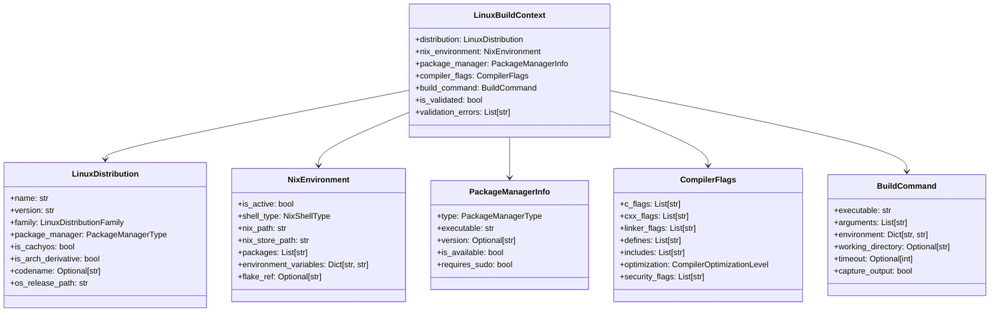

# DESIGN-040: OmniCppController.py Linux Extensions

## Overview

Defines the extensions to OmniCppController.py for comprehensive Linux support, including platform detection, CachyOS detection, Nix environment detection, package manager detection, compiler flags, and build command generation interfaces.

## Purpose and Scope

This design document defines the interfaces, classes, and data structures required to extend OmniCppController.py with full Linux support. It covers:

- Linux distribution detection (CachyOS, Arch, Ubuntu, Fedora, etc.)
- Nix environment detection and integration
- Package manager detection (pacman, apt, dnf, etc.)
- Compiler flag generation for different distributions
- Build command generation with platform-specific optimizations
- Environment validation and setup

## Data Structures

### Enums

```python
from enum import Enum

class LinuxDistributionFamily(Enum):
    """Linux distribution family classification."""
    ARCH = "arch"
    DEBIAN = "debian"
    FEDORA = "fedora"
    SUSE = "suse"
    UNKNOWN = "unknown"

class PackageManagerType(Enum):
    """System package manager types."""
    PACMAN = "pacman"
    APT = "apt"
    DNF = "dnf"
    ZYPPER = "zypper"
    UNKNOWN = "unknown"

class NixShellType(Enum):
    """Nix shell types."""
    FLAKE = "flake"
    IMPURE = "impure"
    PURE = "pure"
    NONE = "none"

class CompilerOptimizationLevel(Enum):
    """Compiler optimization levels."""
    DEBUG = "debug"
    RELEASE = "release"
    RELWITHDEBINFO = "relwithdebinfo"
    MINSIZEREL = "minsizerel"
```

### Data Classes

```python
from dataclasses import dataclass, field
from typing import Optional, List, Dict, Any

@dataclass
class LinuxDistribution:
    """Linux distribution information."""
    name: str  # e.g., "CachyOS", "Arch Linux", "Ubuntu"
    version: str  # e.g., "2023.12.01", "22.04", "38"
    family: LinuxDistributionFamily
    package_manager: PackageManagerType
    is_cachyos: bool = False
    is_arch_derivative: bool = False
    codename: Optional[str] = None  # e.g., "jammy", "focal"
    os_release_path: str = "/etc/os-release"

@dataclass
class NixEnvironment:
    """Nix environment information."""
    is_active: bool
    shell_type: NixShellType
    nix_path: str
    nix_store_path: str
    packages: List[str] = field(default_factory=list)
    environment_variables: Dict[str, str] = field(default_factory=dict)
    flake_ref: Optional[str] = None

@dataclass
class PackageManagerInfo:
    """Package manager information."""
    type: PackageManagerType
    executable: str  # e.g., "pacman", "apt-get"
    version: Optional[str] = None
    is_available: bool = True
    requires_sudo: bool = True

@dataclass
class CompilerFlags:
    """Compiler flags for a specific configuration."""
    c_flags: List[str] = field(default_factory=list)
    cxx_flags: List[str] = field(default_factory=list)
    linker_flags: List[str] = field(default_factory=list)
    defines: List[str] = field(default_factory=list)
    includes: List[str] = field(default_factory=list)
    optimization: CompilerOptimizationLevel = CompilerOptimizationLevel.RELEASE
    security_flags: List[str] = field(default_factory=list)

@dataclass
class BuildCommand:
    """Build command specification."""
    executable: str
    arguments: List[str] = field(default_factory=list)
    environment: Dict[str, str] = field(default_factory=dict)
    working_directory: Optional[str] = None
    timeout: Optional[int] = None
    capture_output: bool = True

@dataclass
class LinuxBuildContext:
    """Linux-specific build context."""
    distribution: LinuxDistribution
    nix_environment: NixEnvironment
    package_manager: PackageManagerInfo
    compiler_flags: CompilerFlags
    build_command: BuildCommand
    is_validated: bool = False
    validation_errors: List[str] = field(default_factory=list)
```

## Interface Definitions

### IPlatformDetector

```python
from abc import ABC, abstractmethod
from typing import Optional

class IPlatformDetector(ABC):
    """Interface for platform detection."""

    @abstractmethod
    def detect_linux_distribution(self) -> LinuxDistribution:
        """Detect the Linux distribution.

        Returns:
            LinuxDistribution: Detected distribution information.

        Raises:
            PlatformDetectionError: If detection fails.
        """
        pass

    @abstractmethod
    def is_cachyos(self) -> bool:
        """Check if running on CachyOS.

        Returns:
            bool: True if CachyOS detected.
        """
        pass

    @abstractmethod
    def is_arch_derivative(self) -> bool:
        """Check if running on Arch Linux derivative.

        Returns:
            bool: True if Arch derivative detected.
        """
        pass

    @abstractmethod
    def get_distribution_family(self) -> LinuxDistributionFamily:
        """Get the distribution family.

        Returns:
            LinuxDistributionFamily: Distribution family.
        """
        pass
```

### INixDetector

```python
class INixDetector(ABC):
    """Interface for Nix environment detection."""

    @abstractmethod
    def is_nix_environment(self) -> bool:
        """Check if running in Nix shell.

        Returns:
            bool: True if Nix environment detected.
        """
        pass

    @abstractmethod
    def get_nix_environment(self) -> NixEnvironment:
        """Get detailed Nix environment information.

        Returns:
            NixEnvironment: Nix environment details.

        Raises:
            NixDetectionError: If detection fails.
        """
        pass

    @abstractmethod
    def get_nix_shell_type(self) -> NixShellType:
        """Get the Nix shell type.

        Returns:
            NixShellType: Type of Nix shell.
        """
        pass

    @abstractmethod
    def validate_nix_environment(self) -> bool:
        """Validate Nix environment is properly configured.

        Returns:
            bool: True if environment is valid.

        Raises:
            NixValidationError: If validation fails.
        """
        pass
```

### IPackageManagerDetector

```python
class IPackageManagerDetector(ABC):
    """Interface for package manager detection."""

    @abstractmethod
    def detect_package_manager(self) -> PackageManagerInfo:
        """Detect the system package manager.

        Returns:
            PackageManagerInfo: Package manager information.
        """
        pass

    @abstractmethod
    def get_package_manager_version(self) -> Optional[str]:
        """Get the package manager version.

        Returns:
            Optional[str]: Package manager version, or None if not available.
        """
        pass

    @abstractmethod
    def is_package_available(self, package_name: str) -> bool:
        """Check if a package is available.

        Args:
            package_name: Name of the package to check.

        Returns:
            bool: True if package is available.
        """
        pass

    @abstractmethod
    def install_package(self, package_name: str, use_sudo: bool = True) -> bool:
        """Install a package.

        Args:
            package_name: Name of the package to install.
            use_sudo: Whether to use sudo for installation.

        Returns:
            bool: True if installation successful.

        Raises:
            PackageManagerError: If installation fails.
        """
        pass
```

### ICompilerFlagGenerator

```python
class ICompilerFlagGenerator(ABC):
    """Interface for compiler flag generation."""

    @abstractmethod
    def generate_cachyos_flags(
        self,
        compiler: str,
        build_type: str
    ) -> CompilerFlags:
        """Generate CachyOS-specific compiler flags.

        Args:
            compiler: Compiler name (gcc, clang).
            build_type: Build type (debug, release, etc.).

        Returns:
            CompilerFlags: Generated compiler flags.

        Raises:
            CompilerFlagError: If flag generation fails.
        """
        pass

    @abstractmethod
    def generate_linux_flags(
        self,
        distribution: LinuxDistribution,
        compiler: str,
        build_type: str
    ) -> CompilerFlags:
        """Generate Linux distribution-specific compiler flags.

        Args:
            distribution: Linux distribution information.
            compiler: Compiler name (gcc, clang).
            build_type: Build type (debug, release, etc.).

        Returns:
            CompilerFlags: Generated compiler flags.

        Raises:
            CompilerFlagError: If flag generation fails.
        """
        pass

    @abstractmethod
    def generate_nix_flags(
        self,
        nix_env: NixEnvironment,
        compiler: str,
        build_type: str
    ) -> CompilerFlags:
        """Generate Nix-aware compiler flags.

        Args:
            nix_env: Nix environment information.
            compiler: Compiler name (gcc, clang).
            build_type: Build type (debug, release, etc.).

        Returns:
            CompilerFlags: Generated compiler flags.

        Raises:
            CompilerFlagError: If flag generation fails.
        """
        pass
```

### IBuildCommandGenerator

```python
class IBuildCommandGenerator(ABC):
    """Interface for build command generation."""

    @abstractmethod
    def generate_cmake_configure_command(
        self,
        build_context: LinuxBuildContext,
        generator: str = "Ninja"
    ) -> BuildCommand:
        """Generate CMake configure command.

        Args:
            build_context: Linux build context.
            generator: CMake generator (Ninja, Unix Makefiles, etc.).

        Returns:
            BuildCommand: Generated build command.

        Raises:
            BuildCommandError: If command generation fails.
        """
        pass

    @abstractmethod
    def generate_cmake_build_command(
        self,
        build_context: LinuxBuildContext,
        target: Optional[str] = None
    ) -> BuildCommand:
        """Generate CMake build command.

        Args:
            build_context: Linux build context.
            target: Optional target to build.

        Returns:
            BuildCommand: Generated build command.

        Raises:
            BuildCommandError: If command generation fails.
        """
        pass

    @abstractmethod
    def generate_conan_install_command(
        self,
        build_context: LinuxBuildContext,
        profile: str
    ) -> BuildCommand:
        """Generate Conan install command.

        Args:
            build_context: Linux build context.
            profile: Conan profile name.

        Returns:
            BuildCommand: Generated build command.

        Raises:
            BuildCommandError: If command generation fails.
        """
        pass
```

### IEnvironmentValidator

```python
class IEnvironmentValidator(ABC):
    """Interface for environment validation."""

    @abstractmethod
    def validate_linux_environment(self) -> tuple[bool, List[str]]:
        """Validate Linux build environment.

        Returns:
            tuple[bool, List[str]]: (is_valid, list of errors).

        Raises:
            EnvironmentValidationError: If validation fails catastrophically.
        """
        pass

    @abstractmethod
    def validate_compiler_availability(
        self,
        compiler: str
    ) -> tuple[bool, Optional[str]]:
        """Validate compiler availability.

        Args:
            compiler: Compiler name (gcc, clang).

        Returns:
            tuple[bool, Optional[str]]: (is_available, version).

        Raises:
            CompilerValidationError: If validation fails.
        """
        pass

    @abstractmethod
    def validate_tool_availability(self, tool: str) -> bool:
        """Validate tool availability.

        Args:
            tool: Tool name (cmake, ninja, etc.).

        Returns:
            bool: True if tool is available.
        """
        pass

    @abstractmethod
    def validate_nix_environment(self) -> tuple[bool, List[str]]:
        """Validate Nix environment.

        Returns:
            tuple[bool, List[str]]: (is_valid, list of errors).

        Raises:
            NixValidationError: If validation fails.
        """
        pass
```

## Class Definitions

### LinuxPlatformDetector

```python
import os
import shutil
from pathlib import Path
from typing import Optional

class LinuxPlatformDetector(IPlatformDetector):
    """Implementation of Linux platform detection."""

    def __init__(self) -> None:
        """Initialize the detector."""
        self._cached_distribution: Optional[LinuxDistribution] = None

    def detect_linux_distribution(self) -> LinuxDistribution:
        """Detect the Linux distribution."""
        if self._cached_distribution:
            return self._cached_distribution

        os_release_path = Path("/etc/os-release")
        if not os_release_path.exists():
            return self._create_unknown_distribution()

        content = os_release_path.read_text()
        distribution = self._parse_os_release(content)
        self._cached_distribution = distribution
        return distribution

    def is_cachyos(self) -> bool:
        """Check if running on CachyOS."""
        distro = self.detect_linux_distribution()
        return distro.is_cachyos

    def is_arch_derivative(self) -> bool:
        """Check if running on Arch Linux derivative."""
        distro = self.detect_linux_distribution()
        return distro.is_arch_derivative

    def get_distribution_family(self) -> LinuxDistributionFamily:
        """Get the distribution family."""
        distro = self.detect_linux_distribution()
        return distro.family

    def _parse_os_release(self, content: str) -> LinuxDistribution:
        """Parse /etc/os-release content.

        Args:
            content: Content of /etc/os-release.

        Returns:
            LinuxDistribution: Parsed distribution information.
        """
        fields = self._parse_os_release_fields(content)

        # Check for CachyOS
        if fields.get("ID") == "cachyos":
            return LinuxDistribution(
                name="CachyOS",
                version=fields.get("VERSION", ""),
                family=LinuxDistributionFamily.ARCH,
                package_manager=PackageManagerType.PACMAN,
                is_cachyos=True,
                is_arch_derivative=True,
                codename=fields.get("VERSION_CODENAME")
            )

        # Check for Arch Linux
        if fields.get("ID") == "arch":
            return LinuxDistribution(
                name="Arch Linux",
                version=fields.get("VERSION", ""),
                family=LinuxDistributionFamily.ARCH,
                package_manager=PackageManagerType.PACMAN,
                is_cachyos=False,
                is_arch_derivative=True
            )

        # Check for Ubuntu
        if fields.get("ID") == "ubuntu":
            return LinuxDistribution(
                name="Ubuntu",
                version=fields.get("VERSION_ID", ""),
                family=LinuxDistributionFamily.DEBIAN,
                package_manager=PackageManagerType.APT,
                is_cachyos=False,
                is_arch_derivative=False,
                codename=fields.get("VERSION_CODENAME")
            )

        # Check for Fedora
        if fields.get("ID") == "fedora":
            return LinuxDistribution(
                name="Fedora",
                version=fields.get("VERSION_ID", ""),
                family=LinuxDistributionFamily.FEDORA,
                package_manager=PackageManagerType.DNF,
                is_cachyos=False,
                is_arch_derivative=False
            )

        # Default to unknown
        return self._create_unknown_distribution()

    def _parse_os_release_fields(self, content: str) -> Dict[str, str]:
        """Parse key-value pairs from os-release.

        Args:
            content: Content of /etc/os-release.

        Returns:
            Dict[str, str]: Parsed fields.
        """
        fields = {}
        for line in content.splitlines():
            line = line.strip()
            if not line or line.startswith("#"):
                continue
            if "=" in line:
                key, value = line.split("=", 1)
                # Remove quotes if present
                value = value.strip('"\'')
                fields[key.strip()] = value
        return fields

    def _create_unknown_distribution(self) -> LinuxDistribution:
        """Create unknown distribution info.

        Returns:
            LinuxDistribution: Unknown distribution.
        """
        return LinuxDistribution(
            name="Unknown",
            version="",
            family=LinuxDistributionFamily.UNKNOWN,
            package_manager=PackageManagerType.UNKNOWN,
            is_cachyos=False,
            is_arch_derivative=False
        )
```

### NixDetector

```python
import os
import shutil
from typing import List

class NixDetector(INixDetector):
    """Implementation of Nix environment detection."""

    def __init__(self) -> None:
        """Initialize the detector."""
        self._cached_environment: Optional[NixEnvironment] = None

    def is_nix_environment(self) -> bool:
        """Check if running in Nix shell."""
        return os.environ.get('IN_NIX_SHELL') == '1'

    def get_nix_environment(self) -> NixEnvironment:
        """Get detailed Nix environment information."""
        if self._cached_environment:
            return self._cached_environment

        if not self.is_nix_environment():
            return NixEnvironment(
                is_active=False,
                shell_type=NixShellType.NONE,
                nix_path="",
                nix_store_path=""
            )

        # Determine shell type
        shell_type = self._get_nix_shell_type()

        # Get Nix paths
        nix_path = os.environ.get('NIX_PATH', '')
        nix_store_path = os.environ.get('NIX_STORE', '/nix/store')

        # Get available packages
        packages = self._get_nix_packages()

        # Get environment variables
        env_vars = self._get_nix_environment_variables()

        # Get flake ref if available
        flake_ref = os.environ.get('FLAKE_REF')

        environment = NixEnvironment(
            is_active=True,
            shell_type=shell_type,
            nix_path=nix_path,
            nix_store_path=nix_store_path,
            packages=packages,
            environment_variables=env_vars,
            flake_ref=flake_ref
        )

        self._cached_environment = environment
        return environment

    def get_nix_shell_type(self) -> NixShellType:
        """Get the Nix shell type."""
        if not self.is_nix_environment():
            return NixShellType.NONE

        # Check if it's a flake shell
        if os.environ.get('IN_NIX_SHELL') == 'impure':
            return NixShellType.IMPURE

        if os.environ.get('FLAKE') or os.environ.get('FLAKE_REF'):
            return NixShellType.FLAKE

        return NixShellType.PURE

    def validate_nix_environment(self) -> bool:
        """Validate Nix environment is properly configured."""
        if not self.is_nix_environment():
            return True  # Not using Nix, so valid

        # Check for required tools
        required_tools = ['gcc', 'clang', 'cmake', 'ninja']
        for tool in required_tools:
            if not shutil.which(tool):
                return False

        # Check Nix store is accessible
        nix_store = os.environ.get('NIX_STORE', '/nix/store')
        if not os.path.exists(nix_store):
            return False

        return True

    def _get_nix_packages(self) -> List[str]:
        """Get list of packages available in Nix environment.

        Returns:
            List[str]: List of package names.
        """
        packages = []
        path = os.environ.get('PATH', '')

        # Parse PATH for Nix store paths
        for p in path.split(':'):
            if '/nix/store' in p:
                # Extract package name from path
                parts = p.split('/')
                if len(parts) > 5:
                    package_name = parts[5].split('-')[0]
                    if package_name not in packages:
                        packages.append(package_name)

        return packages

    def _get_nix_environment_variables(self) -> Dict[str, str]:
        """Get Nix-specific environment variables.

        Returns:
            Dict[str, str]: Environment variables.
        """
        nix_vars = {}
        nix_prefixes = ['NIX_', 'IN_NIX_SHELL', 'FLAKE']

        for key, value in os.environ.items():
            for prefix in nix_prefixes:
                if key.startswith(prefix):
                    nix_vars[key] = value
                    break

        return nix_vars
```

### PackageManagerDetector

```python
import subprocess
from typing import Optional

class PackageManagerDetector(IPackageManagerDetector):
    """Implementation of package manager detection."""

    def __init__(self) -> None:
        """Initialize the detector."""
        self._cached_info: Optional[PackageManagerInfo] = None

    def detect_package_manager(self) -> PackageManagerInfo:
        """Detect the system package manager."""
        if self._cached_info:
            return self._cached_info

        # Check for pacman
        if shutil.which("pacman"):
            version = self._get_package_manager_version("pacman", "--version")
            self._cached_info = PackageManagerInfo(
                type=PackageManagerType.PACMAN,
                executable="pacman",
                version=version,
                is_available=True,
                requires_sudo=True
            )
            return self._cached_info

        # Check for apt
        if shutil.which("apt-get"):
            version = self._get_package_manager_version("apt-get", "--version")
            self._cached_info = PackageManagerInfo(
                type=PackageManagerType.APT,
                executable="apt-get",
                version=version,
                is_available=True,
                requires_sudo=True
            )
            return self._cached_info

        # Check for dnf
        if shutil.which("dnf"):
            version = self._get_package_manager_version("dnf", "--version")
            self._cached_info = PackageManagerInfo(
                type=PackageManagerType.DNF,
                executable="dnf",
                version=version,
                is_available=True,
                requires_sudo=True
            )
            return self._cached_info

        # Check for zypper
        if shutil.which("zypper"):
            version = self._get_package_manager_version("zypper", "--version")
            self._cached_info = PackageManagerInfo(
                type=PackageManagerType.ZYPPER,
                executable="zypper",
                version=version,
                is_available=True,
                requires_sudo=True
            )
            return self._cached_info

        # No package manager found
        self._cached_info = PackageManagerInfo(
            type=PackageManagerType.UNKNOWN,
            executable="",
            version=None,
            is_available=False,
            requires_sudo=False
        )
        return self._cached_info

    def get_package_manager_version(self) -> Optional[str]:
        """Get the package manager version."""
        info = self.detect_package_manager()
        return info.version

    def is_package_available(self, package_name: str) -> bool:
        """Check if a package is available."""
        info = self.detect_package_manager()

        if not info.is_available:
            return False

        try:
            if info.type == PackageManagerType.PACMAN:
                result = subprocess.run(
                    ["pacman", "-Si", package_name],
                    capture_output=True,
                    text=True
                )
                return result.returncode == 0

            elif info.type == PackageManagerType.APT:
                result = subprocess.run(
                    ["apt-cache", "show", package_name],
                    capture_output=True,
                    text=True
                )
                return result.returncode == 0

            elif info.type == PackageManagerType.DNF:
                result = subprocess.run(
                    ["dnf", "info", package_name],
                    capture_output=True,
                    text=True
                )
                return result.returncode == 0

            elif info.type == PackageManagerType.ZYPPER:
                result = subprocess.run(
                    ["zypper", "info", package_name],
                    capture_output=True,
                    text=True
                )
                return result.returncode == 0

        except (subprocess.SubprocessError, FileNotFoundError):
            pass

        return False

    def install_package(self, package_name: str, use_sudo: bool = True) -> bool:
        """Install a package."""
        info = self.detect_package_manager()

        if not info.is_available:
            return False

        command = []
        if use_sudo and info.requires_sudo:
            command.append("sudo")

        if info.type == PackageManagerType.PACMAN:
            command.extend(["pacman", "-S", "--noconfirm", package_name])

        elif info.type == PackageManagerType.APT:
            command.extend(["apt-get", "install", "-y", package_name])

        elif info.type == PackageManagerType.DNF:
            command.extend(["dnf", "install", "-y", package_name])

        elif info.type == PackageManagerType.ZYPPER:
            command.extend(["zypper", "install", "-y", package_name])

        else:
            return False

        try:
            result = subprocess.run(
                command,
                capture_output=True,
                text=True
            )
            return result.returncode == 0

        except (subprocess.SubprocessError, FileNotFoundError):
            return False

    def _get_package_manager_version(
        self,
        executable: str,
        version_flag: str
    ) -> Optional[str]:
        """Get package manager version.

        Args:
            executable: Package manager executable.
            version_flag: Version flag to use.

        Returns:
            Optional[str]: Version string, or None if unavailable.
        """
        try:
            result = subprocess.run(
                [executable, version_flag],
                capture_output=True,
                text=True
            )
            if result.returncode == 0:
                # Extract version from output
                lines = result.stdout.splitlines()
                if lines:
                    return lines[0].strip()
        except (subprocess.SubprocessError, FileNotFoundError):
            pass

        return None
```

### CompilerFlagGenerator

```python
class CompilerFlagGenerator(ICompilerFlagGenerator):
    """Implementation of compiler flag generation."""

    def generate_cachyos_flags(
        self,
        compiler: str,
        build_type: str
    ) -> CompilerFlags:
        """Generate CachyOS-specific compiler flags."""
        flags = CompilerFlags()

        # Set optimization level
        if build_type.lower() == "debug":
            flags.optimization = CompilerOptimizationLevel.DEBUG
            flags.c_flags.extend(["-g", "-O0"])
            flags.cxx_flags.extend(["-g", "-O0"])
            flags.defines.append("DEBUG")
        elif build_type.lower() == "release":
            flags.optimization = CompilerOptimizationLevel.RELEASE
            flags.c_flags.extend(["-O3", "-DNDEBUG"])
            flags.cxx_flags.extend(["-O3", "-DNDEBUG"])
        elif build_type.lower() == "relwithdebinfo":
            flags.optimization = CompilerOptimizationLevel.RELWITHDEBINFO
            flags.c_flags.extend(["-O2", "-g", "-DNDEBUG"])
            flags.cxx_flags.extend(["-O2", "-g", "-DNDEBUG"])
        elif build_type.lower() == "minsizerel":
            flags.optimization = CompilerOptimizationLevel.MINSIZEREL
            flags.c_flags.extend(["-Os", "-DNDEBUG"])
            flags.cxx_flags.extend(["-Os", "-DNDEBUG"])

        # CachyOS performance optimizations
        if flags.optimization != CompilerOptimizationLevel.DEBUG:
            flags.c_flags.append("-march=native")
            flags.cxx_flags.append("-march=native")
            flags.c_flags.append("-flto")
            flags.cxx_flags.append("-flto")

        # CachyOS security flags
        if compiler.lower() == "gcc":
            flags.security_flags.extend([
                "-fstack-protector-strong",
                "-D_FORTIFY_SOURCE=2"
            ])
        elif compiler.lower() == "clang":
            flags.security_flags.extend([
                "-fstack-protector-strong",
                "-D_FORTIFY_SOURCE=2"
            ])

        # Linker flags
        flags.linker_flags.extend([
            "-Wl,--as-needed",
            "-Wl,--no-undefined"
        ])

        return flags

    def generate_linux_flags(
        self,
        distribution: LinuxDistribution,
        compiler: str,
        build_type: str
    ) -> CompilerFlags:
        """Generate Linux distribution-specific compiler flags."""
        # Use CachyOS flags if applicable
        if distribution.is_cachyos:
            return self.generate_cachyos_flags(compiler, build_type)

        flags = CompilerFlags()

        # Set optimization level
        if build_type.lower() == "debug":
            flags.optimization = CompilerOptimizationLevel.DEBUG
            flags.c_flags.extend(["-g", "-O0"])
            flags.cxx_flags.extend(["-g", "-O0"])
            flags.defines.append("DEBUG")
        elif build_type.lower() == "release":
            flags.optimization = CompilerOptimizationLevel.RELEASE
            flags.c_flags.extend(["-O2", "-DNDEBUG"])
            flags.cxx_flags.extend(["-O2", "-DNDEBUG"])

        # Distribution-specific flags
        if distribution.family == LinuxDistributionFamily.ARCH:
            # Arch Linux and derivatives
            if flags.optimization != CompilerOptimizationLevel.DEBUG:
                flags.c_flags.append("-march=x86-64-v3")
                flags.cxx_flags.append("-march=x86-64-v3")

        elif distribution.family == LinuxDistributionFamily.DEBIAN:
            # Debian and derivatives
            flags.security_flags.extend([
                "-fstack-protector-strong",
                "-D_FORTIFY_SOURCE=2"
            ])

        elif distribution.family == LinuxDistributionFamily.FEDORA:
            # Fedora and derivatives
            flags.security_flags.extend([
                "-fstack-protector-strong",
                "-D_FORTIFY_SOURCE=2"
            ])

        # Compiler-specific flags
        if compiler.lower() == "gcc":
            flags.c_flags.append("-Wall")
            flags.cxx_flags.extend(["-Wall", "-Wextra"])
        elif compiler.lower() == "clang":
            flags.c_flags.append("-Wall")
            flags.cxx_flags.extend(["-Wall", "-Wextra"])

        return flags

    def generate_nix_flags(
        self,
        nix_env: NixEnvironment,
        compiler: str,
        build_type: str
    ) -> CompilerFlags:
        """Generate Nix-aware compiler flags."""
        flags = CompilerFlags()

        # Set optimization level
        if build_type.lower() == "debug":
            flags.optimization = CompilerOptimizationLevel.DEBUG
            flags.c_flags.extend(["-g", "-O0"])
            flags.cxx_flags.extend(["-g", "-O0"])
            flags.defines.append("DEBUG")
        elif build_type.lower() == "release":
            flags.optimization = CompilerOptimizationLevel.RELEASE
            flags.c_flags.extend(["-O2", "-DNDEBUG"])
            flags.cxx_flags.extend(["-O2", "-DNDEBUG"])

        # Add Nix store paths to includes
        for package in nix_env.packages:
            # This would typically be resolved via Nix's build environment
            pass

        # Compiler-specific flags
        if compiler.lower() == "gcc":
            flags.c_flags.append("-Wall")
            flags.cxx_flags.extend(["-Wall", "-Wextra"])
        elif compiler.lower() == "clang":
            flags.c_flags.append("-Wall")
            flags.cxx_flags.extend(["-Wall", "-Wextra"])

        return flags
```

### BuildCommandGenerator

```python
import os
from pathlib import Path

class BuildCommandGenerator(IBuildCommandGenerator):
    """Implementation of build command generation."""

    def __init__(self, project_root: str) -> None:
        """Initialize the generator.

        Args:
            project_root: Root directory of the project.
        """
        self.project_root = Path(project_root)

    def generate_cmake_configure_command(
        self,
        build_context: LinuxBuildContext,
        generator: str = "Ninja"
    ) -> BuildCommand:
        """Generate CMake configure command."""
        command = BuildCommand(
            executable="cmake",
            arguments=[],
            environment={},
            working_directory=str(self.project_root)
        )

        # Add generator
        command.arguments.extend(["-G", generator])

        # Add build directory
        build_dir = self.project_root / "build"
        command.arguments.append(f"-B{build_dir}")

        # Add source directory
        command.arguments.append(f"-S{self.project_root}")

        # Add compiler flags
        if build_context.compiler_flags.c_flags:
            c_flags = " ".join(build_context.compiler_flags.c_flags)
            command.arguments.append(f"-DCMAKE_C_FLAGS={c_flags}")

        if build_context.compiler_flags.cxx_flags:
            cxx_flags = " ".join(build_context.compiler_flags.cxx_flags)
            command.arguments.append(f"-DCMAKE_CXX_FLAGS={cxx_flags}")

        # Add defines
        for define in build_context.compiler_flags.defines:
            command.arguments.append(f"-D{define}")

        # Add compiler environment variables
        if build_context.nix_environment.is_active:
            # Use Nix-provided compiler
            pass
        else:
            # Use system compiler
            pass

        return command

    def generate_cmake_build_command(
        self,
        build_context: LinuxBuildContext,
        target: Optional[str] = None
    ) -> BuildCommand:
        """Generate CMake build command."""
        command = BuildCommand(
            executable="cmake",
            arguments=["--build", "build"],
            environment={},
            working_directory=str(self.project_root)
        )

        # Add parallel jobs
        command.arguments.extend(["--parallel", str(os.cpu_count())])

        # Add target if specified
        if target:
            command.arguments.extend(["--target", target])

        return command

    def generate_conan_install_command(
        self,
        build_context: LinuxBuildContext,
        profile: str
    ) -> BuildCommand:
        """Generate Conan install command."""
        command = BuildCommand(
            executable="conan",
            arguments=["install", "."],
            environment={},
            working_directory=str(self.project_root)
        )

        # Add profile
        command.arguments.extend(["--profile:build", profile])
        command.arguments.extend(["--profile:host", profile])

        # Add build type
        build_type = build_context.compiler_flags.optimization.value
        command.arguments.extend(["--settings", f"build_type={build_type}"])

        # Add output folder
        command.arguments.extend(["--output-folder", "build"])

        return command
```

### EnvironmentValidator

```python
import shutil
from typing import List, Optional

class EnvironmentValidator(IEnvironmentValidator):
    """Implementation of environment validation."""

    def __init__(
        self,
        platform_detector: IPlatformDetector,
        nix_detector: INixDetector
    ) -> None:
        """Initialize the validator.

        Args:
            platform_detector: Platform detector instance.
            nix_detector: Nix detector instance.
        """
        self.platform_detector = platform_detector
        self.nix_detector = nix_detector

    def validate_linux_environment(self) -> tuple[bool, List[str]]:
        """Validate Linux build environment."""
        errors = []

        # Check if on Linux
        if not self.platform_detector.is_cachyos():
            distro = self.platform_detector.detect_linux_distribution()
            if distro.family == LinuxDistributionFamily.UNKNOWN:
                errors.append("Unknown Linux distribution")

        # Check compiler availability
        gcc_available, gcc_version = self.validate_compiler_availability("gcc")
        if not gcc_available:
            errors.append("GCC compiler not found")

        clang_available, clang_version = self.validate_compiler_availability("clang")
        if not clang_available:
            errors.append("Clang compiler not found")

        if not gcc_available and not clang_available:
            errors.append("No compiler available (GCC or Clang required)")

        # Check CMake availability
        if not self.validate_tool_availability("cmake"):
            errors.append("CMake not found")

        # Check Ninja availability
        if not self.validate_tool_availability("ninja"):
            errors.append("Ninja not found")

        # Check Conan availability
        if not self.validate_tool_availability("conan"):
            errors.append("Conan not found (package management may be limited)")

        # Validate Nix environment if active
        if self.nix_detector.is_nix_environment():
            is_valid, nix_errors = self.validate_nix_environment()
            if not is_valid:
                errors.extend(nix_errors)

        return (len(errors) == 0, errors)

    def validate_compiler_availability(
        self,
        compiler: str
    ) -> tuple[bool, Optional[str]]:
        """Validate compiler availability."""
        compiler_path = shutil.which(compiler)
        if not compiler_path:
            return (False, None)

        try:
            result = subprocess.run(
                [compiler, "--version"],
                capture_output=True,
                text=True
            )
            if result.returncode == 0:
                # Extract version
                lines = result.stdout.splitlines()
                if lines:
                    version_line = lines[0]
                    # Parse version (simplified)
                    version = version_line.split()[-1]
                    return (True, version)
        except (subprocess.SubprocessError, FileNotFoundError):
            pass

        return (False, None)

    def validate_tool_availability(self, tool: str) -> bool:
        """Validate tool availability."""
        return shutil.which(tool) is not None

    def validate_nix_environment(self) -> tuple[bool, List[str]]:
        """Validate Nix environment."""
        errors = []

        if not self.nix_detector.is_nix_environment():
            return (True, errors)

        # Check for required tools
        required_tools = ['gcc', 'clang', 'cmake', 'ninja']
        for tool in required_tools:
            if not self.validate_tool_availability(tool):
                errors.append(f"Required tool not found in Nix environment: {tool}")

        # Check Nix store
        nix_env = self.nix_detector.get_nix_environment()
        if not os.path.exists(nix_env.nix_store_path):
            errors.append(f"Nix store not accessible: {nix_env.nix_store_path}")

        return (len(errors) == 0, errors)
```

## Relationships

### Class Hierarchy

```mermaid
classDiagram
    class IPlatformDetector {
        <<interface>>
        +detect_linux_distribution() LinuxDistribution
        +is_cachyos() bool
        +is_arch_derivative() bool
        +get_distribution_family() LinuxDistributionFamily
    }

    class INixDetector {
        <<interface>>
        +is_nix_environment() bool
        +get_nix_environment() NixEnvironment
        +get_nix_shell_type() NixShellType
        +validate_nix_environment() bool
    }

    class IPackageManagerDetector {
        <<interface>>
        +detect_package_manager() PackageManagerInfo
        +get_package_manager_version() Optional[str]
        +is_package_available(package_name: str) bool
        +install_package(package_name: str, use_sudo: bool) bool
    }

    class ICompilerFlagGenerator {
        <<interface>>
        +generate_cachyos_flags(compiler: str, build_type: str) CompilerFlags
        +generate_linux_flags(distribution: LinuxDistribution, compiler: str, build_type: str) CompilerFlags
        +generate_nix_flags(nix_env: NixEnvironment, compiler: str, build_type: str) CompilerFlags
    }

    class IBuildCommandGenerator {
        <<interface>>
        +generate_cmake_configure_command(build_context: LinuxBuildContext, generator: str) BuildCommand
        +generate_cmake_build_command(build_context: LinuxBuildContext, target: Optional[str]) BuildCommand
        +generate_conan_install_command(build_context: LinuxBuildContext, profile: str) BuildCommand
    }

    class IEnvironmentValidator {
        <<interface>>
        +validate_linux_environment() tuple[bool, List[str]]
        +validate_compiler_availability(compiler: str) tuple[bool, Optional[str]]
        +validate_tool_availability(tool: str) bool
        +validate_nix_environment() tuple[bool, List[str]]
    }

    class LinuxPlatformDetector {
        -_cached_distribution: Optional[LinuxDistribution]
        +detect_linux_distribution() LinuxDistribution
        +is_cachyos() bool
        +is_arch_derivative() bool
        +get_distribution_family() LinuxDistributionFamily
        -_parse_os_release(content: str) LinuxDistribution
        -_parse_os_release_fields(content: str) Dict[str, str]
        -_create_unknown_distribution() LinuxDistribution
    }

    class NixDetector {
        -_cached_environment: Optional[NixEnvironment]
        +is_nix_environment() bool
        +get_nix_environment() NixEnvironment
        +get_nix_shell_type() NixShellType
        +validate_nix_environment() bool
        -_get_nix_packages() List[str]
        -_get_nix_environment_variables() Dict[str, str]
    }

    class PackageManagerDetector {
        -_cached_info: Optional[PackageManagerInfo]
        +detect_package_manager() PackageManagerInfo
        +get_package_manager_version() Optional[str]
        +is_package_available(package_name: str) bool
        +install_package(package_name: str, use_sudo: bool) bool
        -_get_package_manager_version(executable: str, version_flag: str) Optional[str]
    }

    class CompilerFlagGenerator {
        +generate_cachyos_flags(compiler: str, build_type: str) CompilerFlags
        +generate_linux_flags(distribution: LinuxDistribution, compiler: str, build_type: str) CompilerFlags
        +generate_nix_flags(nix_env: NixEnvironment, compiler: str, build_type: str) CompilerFlags
    }

    class BuildCommandGenerator {
        -project_root: Path
        +generate_cmake_configure_command(build_context: LinuxBuildContext, generator: str) BuildCommand
        +generate_cmake_build_command(build_context: LinuxBuildContext, target: Optional[str]) BuildCommand
        +generate_conan_install_command(build_context: LinuxBuildContext, profile: str) BuildCommand
    }

    class EnvironmentValidator {
        -platform_detector: IPlatformDetector
        -nix_detector: INixDetector
        +validate_linux_environment() tuple[bool, List[str]]
        +validate_compiler_availability(compiler: str) tuple[bool, Optional[str]]
        +validate_tool_availability(tool: str) bool
        +validate_nix_environment() tuple[bool, List[str]]
    }

    LinuxPlatformDetector ..|> IPlatformDetector
    NixDetector ..|> INixDetector
    PackageManagerDetector ..|> IPackageManagerDetector
    CompilerFlagGenerator ..|> ICompilerFlagGenerator
    BuildCommandGenerator ..|> IBuildCommandGenerator
    EnvironmentValidator ..|> IEnvironmentValidator
    EnvironmentValidator --> IPlatformDetector
    EnvironmentValidator --> INixDetector
```



### Data Structure Relationships



## Exception Hierarchy

```python
class LinuxExtensionError(Exception):
    """Base exception for Linux extension errors."""

    def __init__(
        self,
        message: str,
        details: Optional[Dict[str, Any]] = None
    ) -> None:
        """Initialize the exception.

        Args:
            message: Error message.
            details: Optional additional details.
        """
        self.message = message
        self.details = details or {}
        super().__init__(message)

class PlatformDetectionError(LinuxExtensionError):
    """Exception raised when platform detection fails."""
    pass

class NixDetectionError(LinuxExtensionError):
    """Exception raised when Nix detection fails."""
    pass

class NixValidationError(LinuxExtensionError):
    """Exception raised when Nix validation fails."""
    pass

class PackageManagerError(LinuxExtensionError):
    """Exception raised when package manager operation fails."""
    pass

class CompilerFlagError(LinuxExtensionError):
    """Exception raised when compiler flag generation fails."""
    pass

class BuildCommandError(LinuxExtensionError):
    """Exception raised when build command generation fails."""
    pass

class EnvironmentValidationError(LinuxExtensionError):
    """Exception raised when environment validation fails."""
    pass

class CompilerValidationError(LinuxExtensionError):
    """Exception raised when compiler validation fails."""
    pass
```

## Pseudocode Examples

### Example 1: Detect Platform and Generate Flags

```python
# Initialize detectors
platform_detector = LinuxPlatformDetector()
nix_detector = NixDetector()
flag_generator = CompilerFlagGenerator()

# Detect platform
distribution = platform_detector.detect_linux_distribution()
print(f"Detected: {distribution.name} {distribution.version}")

# Check Nix
if nix_detector.is_nix_environment():
    nix_env = nix_detector.get_nix_environment()
    print(f"Nix environment: {nix_env.shell_type.value}")

# Generate flags
if distribution.is_cachyos:
    flags = flag_generator.generate_cachyos_flags("gcc", "release")
elif nix_detector.is_nix_environment():
    flags = flag_generator.generate_nix_flags(nix_env, "gcc", "release")
else:
    flags = flag_generator.generate_linux_flags(distribution, "gcc", "release")

print(f"C flags: {' '.join(flags.c_flags)}")
print(f"CXX flags: {' '.join(flags.cxx_flags)}")
```

### Example 2: Validate Environment

```python
# Initialize validator
platform_detector = LinuxPlatformDetector()
nix_detector = NixDetector()
validator = EnvironmentValidator(platform_detector, nix_detector)

# Validate environment
is_valid, errors = validator.validate_linux_environment()

if is_valid:
    print("Environment is valid!")
else:
    print("Environment validation failed:")
    for error in errors:
        print(f"  - {error}")
```

### Example 3: Generate Build Commands

```python
# Create build context
platform_detector = LinuxPlatformDetector()
nix_detector = NixDetector()
flag_generator = CompilerFlagGenerator()
command_generator = BuildCommandGenerator("/path/to/project")

distribution = platform_detector.detect_linux_distribution()
nix_env = nix_detector.get_nix_environment()
flags = flag_generator.generate_linux_flags(distribution, "gcc", "release")

build_context = LinuxBuildContext(
    distribution=distribution,
    nix_environment=nix_env,
    package_manager=PackageManagerDetector().detect_package_manager(),
    compiler_flags=flags,
    build_command=BuildCommand(executable="")
)

# Generate configure command
configure_cmd = command_generator.generate_cmake_configure_command(
    build_context,
    generator="Ninja"
)

# Generate build command
build_cmd = command_generator.generate_cmake_build_command(
    build_context,
    target="engine"
)

print(f"Configure: {configure_cmd.executable} {' '.join(configure_cmd.arguments)}")
print(f"Build: {build_cmd.executable} {' '.join(build_cmd.arguments)}")
```

## Related Requirements

- REQ-009: Platform Detection
- REQ-010: Compiler Detection
- REQ-016: Conan Integration
- REQ-017: Vcpkg Integration
- REQ-018: CPM CMake Integration
- REQ-019: Priority-Based Package Manager Selection
- REQ-022: CMake 4 Configuration
- REQ-023: Ninja Generator Default
- REQ-024: CMake Presets Cross-Platform
- REQ-025: Toolchain File Organization

## Related ADRs

- ADR-027: Nix Package Manager Integration
- ADR-028: CachyOS as Primary Linux Target
- ADR-029: Direnv for Environment Management
- ADR-030: Enhanced OmniCppController.py Architecture
- ADR-031: Linux-Specific Multi-Package Manager Strategy
- ADR-032: VSCode Platform-Specific Tasks

## Implementation Notes

### Initialization Order

1. Detect Linux distribution
2. Detect Nix environment
3. Detect package manager
4. Validate environment
5. Generate compiler flags
6. Generate build commands

### Error Handling

- All methods should raise appropriate exceptions from the exception hierarchy
- Log errors before raising exceptions
- Provide meaningful error messages with details
- Use custom exceptions for domain-specific errors

### Caching

- Platform detection results should be cached
- Nix environment detection should be cached
- Package manager detection should be cached
- Cache invalidation should be considered for long-running processes

### Thread Safety

- Detectors are not thread-safe by default
- Each instance should be used by a single thread
- Shared state should be protected with locks if needed

### Performance Considerations

- Minimize filesystem operations
- Cache results where appropriate
- Use subprocess efficiently
- Avoid redundant detections

## Testing Considerations

- Mock filesystem operations for testing
- Test with various /etc/os-release contents
- Test Nix environment detection with different configurations
- Test package manager detection with different systems
- Test compiler flag generation with different combinations
- Test build command generation with various scenarios
- Test environment validation with missing tools
- Test error handling and exception raising

---

## Document Control

| Version | Date | Author | Changes |
|---------|------|---------|---------|
| 1.0 | 2026-01-27 | System Architect | Initial version |
