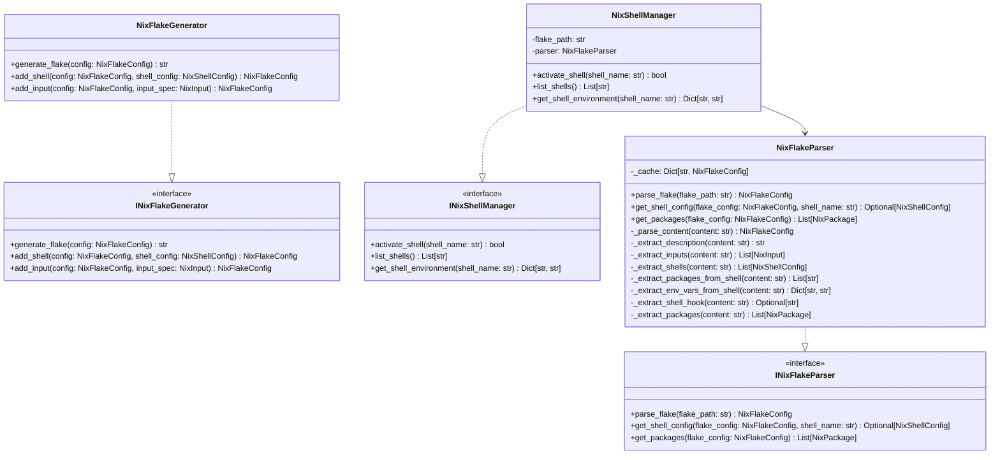
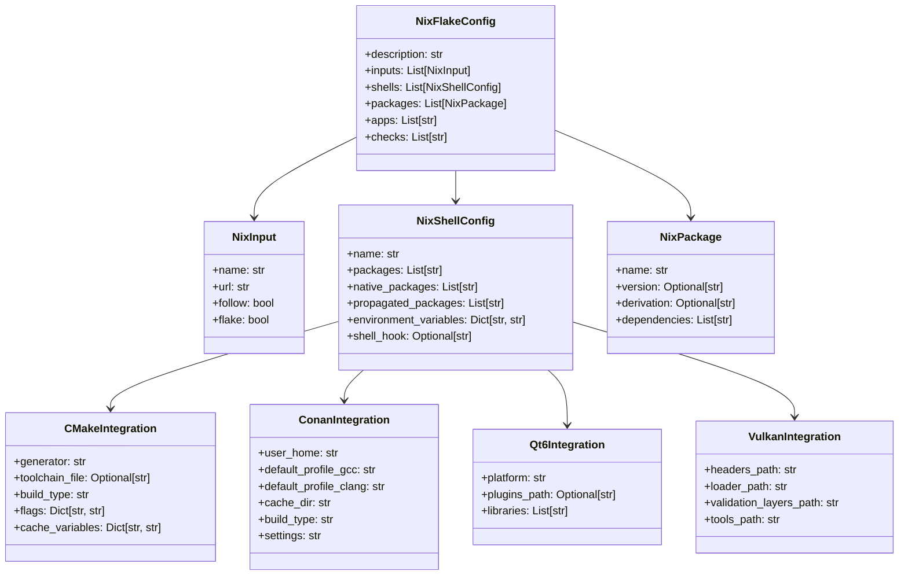

# DESIGN-041: flake.nix Schema

## Overview

Defines the schema and structure for the Nix flake configuration file, including package definitions, shell environment configuration, CMake integration, and Conan integration for the OmniCPP-template project.

## Purpose and Scope

This design document defines the complete schema for [`flake.nix`](../../flake.nix:1), which provides reproducible development environments for Linux builds. It covers:

- Nix package schema and dependency management
- Shell environment configuration with multiple variants
- CMake integration for build system
- Conan integration for package management
- Multi-toolchain support (GCC, Clang)
- Platform-specific configurations (CachyOS, Arch, etc.)

## Nix Flake Schema

### Top-Level Structure

```nix
{
  description = "C++ Dev Environment with Qt6, Vulkan, GCC, and Clang";

  inputs = {
    # Input definitions
  };

  outputs = { self, nixpkgs, ... }:
    let
      # Local definitions
    in
    {
      # Output definitions
    };
}
```

### Input Schema

```nix
inputs = {
  # Nixpkgs input
  nixpkgs.url = "github:nixos/nixpkgs/nixos-unstable";

  # Optional: Flake-utils for cross-platform support
  flake-utils.url = "github:numtide/flake-utils";

  # Optional: Rust toolchain for tools
  rust-overlay.url = "github:oxalica/rust-overlay";

  # Optional: Pre-commit hooks
  pre-commit-hooks.url = "github:cachix/pre-commit-hooks.nix";

  # Optional: Poetry for Python dependencies
  poetry2nix.url = "github:nix-community/poetry2nix";
};
```

### Output Schema

```nix
outputs = { self, nixpkgs, ... }:
    let
      system = "x86_64-linux";
      pkgs = nixpkgs.legacyPackages.${system};
    in
    {
      # Development shells
      devShells.${system} = {
        default = pkgs.mkShell { ... };
        gcc = pkgs.mkShell { ... };
        clang = pkgs.mkShell { ... };
        cachyos-gcc = pkgs.mkShell { ... };
        cachyos-clang = pkgs.mkShell { ... };
      };

      # Packages
      packages.${system} = {
        default = pkgs.stdenv.mkDerivation { ... };
      };

      # Apps
      apps.${system} = {
        build = {
          type = "app";
          program = "...";
        };
      };

      # Checks (CI)
      checks.${system} = {
        formatting = ...;
        linting = ...;
      };
    };
```

## Data Structures

### Nix Package Schema

```nix
# Compiler packages
{
  # GCC
  gcc = pkgs.gcc13;
  gcc12 = pkgs.gcc12;
  gcc11 = pkgs.gcc11;

  # Clang
  clang = pkgs.clang_19;
  clang18 = pkgs.clang_18;
  clang17 = pkgs.clang_17;

  # LLVM toolchain
  llvm = pkgs.llvmPackages_19;
  llvm18 = pkgs.llvmPackages_18;
}
```

### Build System Packages Schema

```nix
{
  # Build system
  cmake = pkgs.cmake;
  ninja = pkgs.ninja;
  ccache = pkgs.ccache;
  meson = pkgs.meson;

  # CMake tools
  cmake-format = pkgs.cmake-format;
  cmake-language-server = pkgs.cmake-language-server;
}
```

### Graphics Library Packages Schema

```nix
{
  # Qt6
  qt6 = {
    base = pkgs.qt6.qtbase;
    wayland = pkgs.qt6.qtwayland;
    declarative = pkgs.qt6.qtdeclarative;
    svg = pkgs.qt6.qtsvg;
    imageformats = pkgs.qt6.qtimageformats;
    tools = pkgs.qt6.qttools;
  };

  # Vulkan
  vulkan = {
    headers = pkgs.vulkan-headers;
    loader = pkgs.vulkan-loader;
    validation-layers = pkgs.vulkan-validation-layers;
    tools = pkgs.vulkan-tools;
  };

  # OpenGL
  opengl = pkgs.libGL;
  glew = pkgs.glew;
  glfw = pkgs.glfw3;
}
```

### Development Tools Packages Schema

```nix
{
  # Compilers and analysis
  clang-tools = pkgs.clang-tools;
  gcc-tools = pkgs.gcc;

  # Formatting
  clang-format = pkgs.clang-format;
  black = pkgs.python3Packages.black;

  # Linting
  clang-tidy = pkgs.clang-tools;
  pylint = pkgs.python3Packages.pylint;
  mypy = pkgs.python3Packages.mypy;

  # Documentation
  doxygen = pkgs.doxygen;
  graphviz = pkgs.graphviz;

  # Debugging
  gdb = pkgs.gdb;
  lldb = pkgs.lldb;
  valgrind = pkgs.valgrind;

  # Profiling
  perf = pkgs.linuxPackages.perf;
  hotspot = pkgs.hotspot;
}
```

### Python Packages Schema

```nix
{
  # Python
  python3 = pkgs.python3;
  python3Packages = pkgs.python3Packages;

  # Python build tools
  pip = pkgs.python3Packages.pip;
  setuptools = pkgs.python3Packages.setuptools;
  wheel = pkgs.python3Packages.wheel;

  # Python testing
  pytest = pkgs.python3Packages.pytest;
  pytest-cov = pkgs.python3Packages.pytest-cov;

  # Python development
  black = pkgs.python3Packages.black;
  mypy = pkgs.python3Packages.mypy;
  pylint = pkgs.python3Packages.pylint;

  # Python packaging
  build = pkgs.python3Packages.build;
  twine = pkgs.python3Packages.twine;
}
```

### Package Manager Packages Schema

```nix
{
  # Conan
  conan = pkgs.conan;

  # vcpkg (via nixpkgs)
  vcpkg = pkgs.vcpkg;

  # CPM (included in project)
  # CPM is managed via CMake, not Nix
}
```

## Shell Environment Schema

### Default Shell Schema

```nix
devShells.${system}.default = pkgs.mkShell {
  # Build inputs (packages)
  buildInputs = with pkgs; [
    # Compilers
    gcc
    clang

    # Build system
    cmake
    ninja
    ccache

    # Graphics
    qt6.qtbase
    qt6.qtwayland
    vulkan-headers
    vulkan-loader
    vulkan-validation-layers

    # Tools
    clang-tools
    doxygen
  ];

  # Native build inputs (host-only packages)
  nativeBuildInputs = with pkgs; [
    pkg-config
  ];

  # Propagated build inputs (transitive dependencies)
  propagatedBuildInputs = with pkgs; [
    # Libraries that need to be available to dependents
  ];

  # Shell hook (environment setup)
  shellHook = ''
    echo ">> Loaded OmniCPP C++ Development Environment"
    export QT_QPA_PLATFORM=wayland
    export CMAKE_GENERATOR="Ninja"
  '';

  # Environment variables
  env = {
    QT_QPA_PLATFORM = "wayland";
    CMAKE_GENERATOR = "Ninja";
  };

  # Shell-specific settings
  shell = pkgs.bash;
};
```

### GCC-Specific Shell Schema

```nix
devShells.${system}.gcc = pkgs.mkShell {
  buildInputs = with pkgs; [
    # GCC compiler
    gcc13

    # Build system
    cmake
    ninja
    ccache

    # Graphics
    qt6.qtbase
    vulkan-loader
  ];

  shellHook = ''
    echo ">> Loaded GCC Development Environment"

    # Set GCC as default compiler
    export CC=gcc
    export CXX=g++

    # GCC-specific flags
    export CFLAGS="-march=native -O2"
    export CXXFLAGS="-march=native -O2"

    # CMake configuration
    export CMAKE_GENERATOR="Ninja"
    export CMAKE_C_COMPILER=gcc
    export CMAKE_CXX_COMPILER=g++
  '';

  env = {
    CC = "gcc";
    CXX = "g++";
    CMAKE_GENERATOR = "Ninja";
    CMAKE_C_COMPILER = "gcc";
    CMAKE_CXX_COMPILER = "g++";
  };
};
```

### Clang-Specific Shell Schema

```nix
devShells.${system}.clang = pkgs.mkShell {
  buildInputs = with pkgs; [
    # Clang compiler
    llvmPackages_19.clang
    llvmPackages_19.bintools

    # Build system
    cmake
    ninja
    ccache

    # Graphics
    qt6.qtbase
    vulkan-loader
  ];

  shellHook = ''
    echo ">> Loaded Clang Development Environment"

    # Set Clang as default compiler
    export CC=clang
    export CXX=clang++

    # Clang-specific flags
    export CFLAGS="-march=native -O2"
    export CXXFLAGS="-march=native -O2"

    # CMake configuration
    export CMAKE_GENERATOR="Ninja"
    export CMAKE_C_COMPILER=clang
    export CMAKE_CXX_COMPILER=clang++
  '';

  env = {
    CC = "clang";
    CXX = "clang++";
    CMAKE_GENERATOR = "Ninja";
    CMAKE_C_COMPILER = "clang";
    CMAKE_CXX_COMPILER = "clang++";
  };
};
```

### CachyOS GCC Shell Schema

```nix
devShells.${system}.cachyos-gcc = pkgs.mkShell {
  buildInputs = with pkgs; [
    # GCC compiler
    gcc13

    # Build system
    cmake
    ninja
    ccache

    # Graphics
    qt6.qtbase
    qt6.qtwayland
    vulkan-headers
    vulkan-loader
    vulkan-validation-layers

    # Tools
    clang-tools
    doxygen
  ];

  shellHook = ''
    echo ">> Loaded CachyOS GCC Development Environment"

    # Set GCC as default compiler
    export CC=gcc
    export CXX=g++

    # CachyOS-specific optimizations
    export CFLAGS="-march=native -O3 -flto -DNDEBUG"
    export CXXFLAGS="-march=native -O3 -flto -DNDEBUG"

    # CachyOS security flags
    export CFLAGS="$CFLAGS -fstack-protector-strong -D_FORTIFY_SOURCE=2"
    export CXXFLAGS="$CXXFLAGS -fstack-protector-strong -D_FORTIFY_SOURCE=2"

    # Linker flags
    export LDFLAGS="-Wl,--as-needed -Wl,--no-undefined"

    # CMake configuration
    export CMAKE_GENERATOR="Ninja"
    export CMAKE_C_COMPILER=gcc
    export CMAKE_CXX_COMPILER=g++

    # Qt6 configuration
    export QT_QPA_PLATFORM=wayland
  '';

  env = {
    CC = "gcc";
    CXX = "g++";
    CMAKE_GENERATOR = "Ninja";
    CMAKE_C_COMPILER = "gcc";
    CMAKE_CXX_COMPILER = "g++";
    QT_QPA_PLATFORM = "wayland";
  };
};
```

### CachyOS Clang Shell Schema

```nix
devShells.${system}.cachyos-clang = pkgs.mkShell {
  buildInputs = with pkgs; [
    # Clang compiler
    llvmPackages_19.clang
    llvmPackages_19.bintools

    # Build system
    cmake
    ninja
    ccache

    # Graphics
    qt6.qtbase
    qt6.qtwayland
    vulkan-headers
    vulkan-loader
    vulkan-validation-layers

    # Tools
    clang-tools
    doxygen
  ];

  shellHook = ''
    echo ">> Loaded CachyOS Clang Development Environment"

    # Set Clang as default compiler
    export CC=clang
    export CXX=clang++

    # CachyOS-specific optimizations
    export CFLAGS="-march=native -O3 -flto -DNDEBUG"
    export CXXFLAGS="-march=native -O3 -flto -DNDEBUG"

    # CachyOS security flags
    export CFLAGS="$CFLAGS -fstack-protector-strong -D_FORTIFY_SOURCE=2"
    export CXXFLAGS="$CXXFLAGS -fstack-protector-strong -D_FORTIFY_SOURCE=2"

    # Linker flags
    export LDFLAGS="-Wl,--as-needed -Wl,--no-undefined"

    # CMake configuration
    export CMAKE_GENERATOR="Ninja"
    export CMAKE_C_COMPILER=clang
    export CMAKE_CXX_COMPILER=clang++

    # Qt6 configuration
    export QT_QPA_PLATFORM=wayland
  '';

  env = {
    CC = "clang";
    CXX = "clang++";
    CMAKE_GENERATOR = "Ninja";
    CMAKE_C_COMPILER = "clang";
    CMAKE_CXX_COMPILER = "clang++";
    QT_QPA_PLATFORM = "wayland";
  };
};
```

## CMake Integration Schema

### CMake Configuration

```nix
# CMake integration in shellHook
shellHook = ''
  # CMake generator
  export CMAKE_GENERATOR="Ninja"

  # CMake toolchain
  export CMAKE_TOOLCHAIN_FILE="${self}/cmake/toolchains/nix.cmake"

  # CMake build type
  export CMAKE_BUILD_TYPE="Release"

  # CMake flags
  export CMAKE_EXPORT_COMPILE_COMMANDS="ON"
  export CMAKE_CXX_STANDARD="23"
  export CMAKE_CXX_STANDARD_REQUIRED="ON"

  # CMake cache
  export CMAKE_CACHEFILE_DIR=".cmake-cache"
'';
```

### CMake Toolchain File Schema

```nix
# CMake toolchain file for Nix
{
  # This would be a separate file: cmake/toolchains/nix.cmake
  # Generated by Nix and referenced in CMake
}
```

## Conan Integration Schema

### Conan Configuration

```nix
# Conan integration in shellHook
shellHook = ''
  # Conan home directory
  export CONAN_USER_HOME="${HOME}/.conan2"

  # Conan profiles
  export CONAN_DEFAULT_PROFILE_LINUX="${self}/conan/profiles/nix-gcc"
  export CONAN_DEFAULT_PROFILE_CLANG="${self}/conan/profiles/nix-clang"

  # Conan cache
  export CONAN_CACHE_DIR="${CONAN_USER_HOME}/cache"

  # Conan build type
  export CONAN_BUILD_TYPE="Release"

  # Conan settings
  export CONAN_SETTINGS="os=Linux arch=x86_64 compiler=gcc compiler.version=13 compiler.libcxx=libstdc++11 build_type=Release"
'';
```

### Conan Profile Generation

```nix
# Conan profile for Nix GCC
{
  # This would be a separate file: conan/profiles/nix-gcc
  # Generated or configured by Nix
}
```

## Python Data Structures

### Python Data Classes for Flake Configuration

```python
from dataclasses import dataclass, field
from typing import List, Dict, Optional, Any

@dataclass
class NixPackage:
    """Nix package specification."""
    name: str
    version: Optional[str] = None
    derivation: Optional[str] = None
    dependencies: List[str] = field(default_factory=list)

@dataclass
class NixInput:
    """Nix flake input specification."""
    name: str
    url: str
    follow: bool = False
    flake: bool = True

@dataclass
class NixShellConfig:
    """Nix shell configuration."""
    name: str
    packages: List[str] = field(default_factory=list)
    native_packages: List[str] = field(default_factory=list)
    propagated_packages: List[str] = field(default_factory=list)
    environment_variables: Dict[str, str] = field(default_factory=dict)
    shell_hook: Optional[str] = None

@dataclass
class NixFlakeConfig:
    """Complete Nix flake configuration."""
    description: str
    inputs: List[NixInput] = field(default_factory=list)
    shells: List[NixShellConfig] = field(default_factory=list)
    packages: List[NixPackage] = field(default_factory=list)
    apps: List[str] = field(default_factory=list)
    checks: List[str] = field(default_factory=list)

@dataclass
class CMakeIntegration:
    """CMake integration configuration."""
    generator: str = "Ninja"
    toolchain_file: Optional[str] = None
    build_type: str = "Release"
    flags: Dict[str, str] = field(default_factory=dict)
    cache_variables: Dict[str, str] = field(default_factory=dict)

@dataclass
class ConanIntegration:
    """Conan integration configuration."""
    user_home: str = "${HOME}/.conan2"
    default_profile_gcc: str = "nix-gcc"
    default_profile_clang: str = "nix-clang"
    cache_dir: str = "${CONAN_USER_HOME}/cache"
    build_type: str = "Release"
    settings: str = ""

@dataclass
class Qt6Integration:
    """Qt6 integration configuration."""
    platform: str = "wayland"
    plugins_path: Optional[str] = None
    libraries: List[str] = field(default_factory=list)

@dataclass
class VulkanIntegration:
    """Vulkan integration configuration."""
    headers_path: str = ""
    loader_path: str = ""
    validation_layers_path: str = ""
    tools_path: str = ""
```

## Interfaces

### INixFlakeParser

```python
from abc import ABC, abstractmethod

class INixFlakeParser(ABC):
    """Interface for parsing Nix flake files."""

    @abstractmethod
    def parse_flake(self, flake_path: str) -> NixFlakeConfig:
        """Parse a Nix flake file.

        Args:
            flake_path: Path to flake.nix file.

        Returns:
            NixFlakeConfig: Parsed flake configuration.

        Raises:
            NixParseError: If parsing fails.
        """
        pass

    @abstractmethod
    def get_shell_config(
        self,
        flake_config: NixFlakeConfig,
        shell_name: str
    ) -> Optional[NixShellConfig]:
        """Get a specific shell configuration.

        Args:
            flake_config: Parsed flake configuration.
            shell_name: Name of the shell (default, gcc, clang, etc.).

        Returns:
            Optional[NixShellConfig]: Shell configuration, or None if not found.
        """
        pass

    @abstractmethod
    def get_packages(
        self,
        flake_config: NixFlakeConfig
    ) -> List[NixPackage]:
        """Get all packages from flake configuration.

        Args:
            flake_config: Parsed flake configuration.

        Returns:
            List[NixPackage]: List of packages.
        """
        pass
```

### INixFlakeGenerator

```python
class INixFlakeGenerator(ABC):
    """Interface for generating Nix flake files."""

    @abstractmethod
    def generate_flake(
        self,
        config: NixFlakeConfig
    ) -> str:
        """Generate Nix flake content.

        Args:
            config: Flake configuration.

        Returns:
            str: Generated Nix flake content.

        Raises:
            NixGenerationError: If generation fails.
        """
        pass

    @abstractmethod
    def add_shell(
        self,
        config: NixFlakeConfig,
        shell_config: NixShellConfig
    ) -> NixFlakeConfig:
        """Add a shell configuration.

        Args:
            config: Flake configuration.
            shell_config: Shell configuration to add.

        Returns:
            NixFlakeConfig: Updated flake configuration.
        """
        pass

    @abstractmethod
    def add_input(
        self,
        config: NixFlakeConfig,
        input_spec: NixInput
    ) -> NixFlakeConfig:
        """Add a flake input.

        Args:
            config: Flake configuration.
            input_spec: Input specification to add.

        Returns:
            NixFlakeConfig: Updated flake configuration.
        """
        pass
```

### INixShellManager

```python
class INixShellManager(ABC):
    """Interface for managing Nix shells."""

    @abstractmethod
    def activate_shell(
        self,
        shell_name: str = "default"
    ) -> bool:
        """Activate a Nix shell.

        Args:
            shell_name: Name of the shell to activate.

        Returns:
            bool: True if activation successful.

        Raises:
            NixShellError: If activation fails.
        """
        pass

    @abstractmethod
    def list_shells(self) -> List[str]:
        """List available Nix shells.

        Returns:
            List[str]: List of shell names.
        """
        pass

    @abstractmethod
    def get_shell_environment(
        self,
        shell_name: str
    ) -> Dict[str, str]:
        """Get environment variables for a shell.

        Args:
            shell_name: Name of the shell.

        Returns:
            Dict[str, str]: Environment variables.

        Raises:
            NixShellError: If shell not found.
        """
        pass
```

## Class Definitions

### NixFlakeParser

```python
import re
from pathlib import Path

class NixFlakeParser(INixFlakeParser):
    """Parser for Nix flake files."""

    def __init__(self) -> None:
        """Initialize the parser."""
        self._cache: Dict[str, NixFlakeConfig] = {}

    def parse_flake(self, flake_path: str) -> NixFlakeConfig:
        """Parse a Nix flake file."""
        if flake_path in self._cache:
            return self._cache[flake_path]

        flake_file = Path(flake_path)
        if not flake_file.exists():
            raise NixParseError(f"Flake file not found: {flake_path}")

        content = flake_file.read_text()
        config = self._parse_content(content)
        self._cache[flake_path] = config
        return config

    def get_shell_config(
        self,
        flake_config: NixFlakeConfig,
        shell_name: str
    ) -> Optional[NixShellConfig]:
        """Get a specific shell configuration."""
        for shell in flake_config.shells:
            if shell.name == shell_name:
                return shell
        return None

    def get_packages(
        self,
        flake_config: NixFlakeConfig
    ) -> List[NixPackage]:
        """Get all packages from flake configuration."""
        return flake_config.packages

    def _parse_content(self, content: str) -> NixFlakeConfig:
        """Parse Nix flake content.

        Args:
            content: Flake file content.

        Returns:
            NixFlakeConfig: Parsed configuration.
        """
        # Extract description
        description = self._extract_description(content)

        # Extract inputs
        inputs = self._extract_inputs(content)

        # Extract shells
        shells = self._extract_shells(content)

        # Extract packages
        packages = self._extract_packages(content)

        return NixFlakeConfig(
            description=description,
            inputs=inputs,
            shells=shells,
            packages=packages
        )

    def _extract_description(self, content: str) -> str:
        """Extract description from flake content.

        Args:
            content: Flake file content.

        Returns:
            str: Description.
        """
        match = re.search(r'description\s*=\s*"([^"]+)"', content)
        if match:
            return match.group(1)
        return ""

    def _extract_inputs(self, content: str) -> List[NixInput]:
        """Extract inputs from flake content.

        Args:
            content: Flake file content.

        Returns:
            List[NixInput]: List of inputs.
        """
        inputs = []
        # Simplified parsing - real implementation would be more robust
        input_matches = re.finditer(
            r'(\w+)\s*=\s*\{\s*url\s*=\s*"([^"]+)"',
            content
        )
        for match in input_matches:
            inputs.append(NixInput(
                name=match.group(1),
                url=match.group(2)
            ))
        return inputs

    def _extract_shells(self, content: str) -> List[NixShellConfig]:
        """Extract shells from flake content.

        Args:
            content: Flake file content.

        Returns:
            List[NixShellConfig]: List of shell configurations.
        """
        shells = []
        # Simplified parsing
        shell_matches = re.finditer(
            r'(\w+)\s*=\s*pkgs\.mkShell\s*\{([^}]+)\}',
            content,
            re.DOTALL
        )
        for match in shell_matches:
            shell_name = match.group(1)
            shell_content = match.group(2)

            # Extract packages
            packages = self._extract_packages_from_shell(shell_content)

            # Extract environment variables
            env_vars = self._extract_env_vars_from_shell(shell_content)

            # Extract shell hook
            shell_hook = self._extract_shell_hook(shell_content)

            shells.append(NixShellConfig(
                name=shell_name,
                packages=packages,
                environment_variables=env_vars,
                shell_hook=shell_hook
            ))
        return shells

    def _extract_packages_from_shell(self, content: str) -> List[str]:
        """Extract packages from shell content.

        Args:
            content: Shell content.

        Returns:
            List[str]: List of package names.
        """
        packages = []
        # Match buildInputs entries
        matches = re.findall(r'(\w+(?:\.\w+)*)', content)
        # Filter out common Nix keywords
        keywords = {'pkgs', 'with', 'buildInputs', 'nativeBuildInputs',
                   'shellHook', 'env', 'echo', 'export'}
        for match in matches:
            if match not in keywords and not match.startswith('_'):
                packages.append(match)
        return packages

    def _extract_env_vars_from_shell(self, content: str) -> Dict[str, str]:
        """Extract environment variables from shell content.

        Args:
            content: Shell content.

        Returns:
            Dict[str, str]: Environment variables.
        """
        env_vars = {}
        # Match export statements
        matches = re.findall(r'export\s+(\w+)\s*=\s*"?([^"\n]+)"?', content)
        for key, value in matches:
            env_vars[key] = value
        return env_vars

    def _extract_shell_hook(self, content: str) -> Optional[str]:
        """Extract shell hook from shell content.

        Args:
            content: Shell content.

        Returns:
            Optional[str]: Shell hook content.
        """
        match = re.search(r'shellHook\s*=\s*\'\'\'([^\'\']+)\'\'\'', content, re.DOTALL)
        if match:
            return match.group(1).strip()
        return None

    def _extract_packages(self, content: str) -> List[NixPackage]:
        """Extract packages from flake content.

        Args:
            content: Flake file content.

        Returns:
            List[NixPackage]: List of packages.
        """
        packages = []
        # Simplified extraction
        matches = re.findall(r'(\w+)\s*=\s*pkgs\.(\w+)', content)
        for name, pkg in matches:
            packages.append(NixPackage(name=name, derivation=pkg))
        return packages
```

### NixFlakeGenerator

```python
class NixFlakeGenerator(INixFlakeGenerator):
    """Generator for Nix flake files."""

    def __init__(self) -> None:
        """Initialize the generator."""

    def generate_flake(
        self,
        config: NixFlakeConfig
    ) -> str:
        """Generate Nix flake content."""
        lines = []

        # Header
        lines.append("{")
        lines.append(f'  description = "{config.description}";')
        lines.append("")

        # Inputs
        lines.append("  inputs = {")
        for input_spec in config.inputs:
            lines.append(f'    {input_spec.name}.url = "{input_spec.url}";')
        lines.append("  };")
        lines.append("")

        # Outputs
        lines.append("  outputs = { self, nixpkgs, ... }:")
        lines.append("    let")
        lines.append('      system = "x86_64-linux";')
        lines.append("      pkgs = nixpkgs.legacyPackages.${system};")
        lines.append("    in")
        lines.append("    {")

        # Shells
        lines.append("      devShells.${system} = {")
        for shell_config in config.shells:
            lines.append(f"        {shell_config.name} = pkgs.mkShell {{")
            lines.append(f"          buildInputs = with pkgs; [")
            for pkg in shell_config.packages:
                lines.append(f"            {pkg}")
            lines.append("          ];")
            if shell_config.shell_hook:
                lines.append("          shellHook = ''")
                for line in shell_config.shell_hook.split('\n'):
                    lines.append(f"            {line}")
                lines.append("          '';")
            lines.append("        };")
        lines.append("      };")
        lines.append("    };")
        lines.append("}")

        return '\n'.join(lines)

    def add_shell(
        self,
        config: NixFlakeConfig,
        shell_config: NixShellConfig
    ) -> NixFlakeConfig:
        """Add a shell configuration."""
        # Remove existing shell with same name
        config.shells = [s for s in config.shells if s.name != shell_config.name]
        config.shells.append(shell_config)
        return config

    def add_input(
        self,
        config: NixFlakeConfig,
        input_spec: NixInput
    ) -> NixFlakeConfig:
        """Add a flake input."""
        # Remove existing input with same name
        config.inputs = [i for i in config.inputs if i.name != input_spec.name]
        config.inputs.append(input_spec)
        return config
```

### NixShellManager

```python
import subprocess
import os

class NixShellManager(INixShellManager):
    """Manager for Nix shells."""

    def __init__(self, flake_path: str) -> None:
        """Initialize the manager.

        Args:
            flake_path: Path to flake.nix file.
        """
        self.flake_path = flake_path
        self.parser = NixFlakeParser()

    def activate_shell(
        self,
        shell_name: str = "default"
    ) -> bool:
        """Activate a Nix shell."""
        try:
            # Use nix develop command
            result = subprocess.run(
                ["nix", "develop", f".#{shell_name}"],
                cwd=os.path.dirname(self.flake_path),
                capture_output=True,
                text=True
            )
            return result.returncode == 0
        except (subprocess.SubprocessError, FileNotFoundError):
            return False

    def list_shells(self) -> List[str]:
        """List available Nix shells."""
        config = self.parser.parse_flake(self.flake_path)
        return [shell.name for shell in config.shells]

    def get_shell_environment(
        self,
        shell_name: str
    ) -> Dict[str, str]:
        """Get environment variables for a shell."""
        config = self.parser.parse_flake(self.flake_path)
        shell_config = self.parser.get_shell_config(config, shell_name)

        if not shell_config:
            raise NixShellError(f"Shell not found: {shell_name}")

        return shell_config.environment_variables
```

## Relationships

### Class Hierarchy



### Data Structure Relationships



## Exception Hierarchy

```python
class NixFlakeError(Exception):
    """Base exception for Nix flake errors."""

    def __init__(
        self,
        message: str,
        details: Optional[Dict[str, Any]] = None
    ) -> None:
        """Initialize exception.

        Args:
            message: Error message.
            details: Optional additional details.
        """
        self.message = message
        self.details = details or {}
        super().__init__(message)

class NixParseError(NixFlakeError):
    """Exception raised when flake parsing fails."""
    pass

class NixGenerationError(NixFlakeError):
    """Exception raised when flake generation fails."""
    pass

class NixShellError(NixFlakeError):
    """Exception raised when shell operation fails."""
    pass

class NixValidationError(NixFlakeError):
    """Exception raised when flake validation fails."""
    pass
```

## Pseudocode Examples

### Example 1: Parse Existing Flake

```python
# Initialize parser
parser = NixFlakeParser()

# Parse flake
flake_config = parser.parse_flake("flake.nix")

# Print description
print(f"Description: {flake_config.description}")

# List shells
shells = parser.get_shell_config(flake_config, "default")
if shells:
    print(f"Default shell packages: {', '.join(shells.packages)}")
```

### Example 2: Generate New Flake

```python
# Initialize generator
generator = NixFlakeGenerator()

# Create configuration
config = NixFlakeConfig(
    description="C++ Dev Environment",
    inputs=[
        NixInput(name="nixpkgs", url="github:nixos/nixpkgs/nixos-unstable")
    ],
    shells=[
        NixShellConfig(
            name="default",
            packages=["gcc", "cmake", "ninja"],
            environment_variables={"CC": "gcc", "CXX": "g++"}
        )
    ]
)

# Generate flake content
flake_content = generator.generate_flake(config)
print(flake_content)
```

### Example 3: Manage Shells

```python
# Initialize manager
manager = NixShellManager("flake.nix")

# List available shells
shells = manager.list_shells()
print(f"Available shells: {', '.join(shells)}")

# Get shell environment
env = manager.get_shell_environment("gcc")
print(f"GCC shell environment: {env}")

# Activate shell
success = manager.activate_shell("gcc")
if success:
    print("Shell activated successfully!")
```

## Related Requirements

- REQ-009: Platform Detection
- REQ-016: Conan Integration
- REQ-018: CPM CMake Integration
- REQ-019: Priority-Based Package Manager Selection
- REQ-022: CMake 4 Configuration
- REQ-023: Ninja Generator Default
- REQ-024: CMake Presets Cross-Platform

## Related ADRs

- ADR-027: Nix Package Manager Integration
- ADR-029: Direnv for Environment Management
- ADR-030: Enhanced OmniCppController.py Architecture
- ADR-031: Linux-Specific Multi-Package Manager Strategy

## Implementation Notes

### Flake Structure

- Use standard Nix flake structure
- Support multiple shell variants (default, gcc, clang, cachyos-gcc, cachyos-clang)
- Include all necessary packages for C++ development
- Configure environment variables in shellHook

### Package Management

- Use nixpkgs-unstable for latest packages
- Pin package versions via flake.lock
- Use buildInputs for runtime dependencies
- Use nativeBuildInputs for build-time dependencies
- Use propagatedBuildInputs for transitive dependencies

### CMake Integration

- Set CMAKE_GENERATOR to "Ninja"
- Configure compiler paths via environment variables
- Set CMAKE_CXX_STANDARD to "23"
- Enable CMAKE_EXPORT_COMPILE_COMMANDS

### Conan Integration

- Set CONAN_USER_HOME to user's home directory
- Configure default profiles for GCC and Clang
- Set CONAN_BUILD_TYPE to match build configuration
- Configure Conan settings for Linux x86_64

### Qt6 Integration

- Set QT_QPA_PLATFORM to "wayland" for CachyOS
- Include all necessary Qt6 modules
- Configure Qt6 plugin paths if needed

### Vulkan Integration

- Include Vulkan headers for development
- Include Vulkan loader for runtime
- Include validation layers for debugging
- Include Vulkan tools for development

### Performance Considerations

- Use ccache for faster rebuilds
- Enable compiler optimizations for CachyOS
- Use Ninja for faster builds
- Configure parallel build jobs

### Security Considerations

- Enable stack protection flags
- Enable FORTIFY_SOURCE
- Use secure linker flags
- Validate package integrity

## Testing Considerations

- Test flake parsing with various configurations
- Test flake generation with different shells
- Test shell activation and deactivation
- Test environment variable configuration
- Test package dependency resolution
- Test CMake integration
- Test Conan integration
- Test Qt6 and Vulkan integration
- Test with different Nix versions
- Test with different nixpkgs channels

---

## Document Control

| Version | Date | Author | Changes |
|---------|------|---------|---------|
| 1.0 | 2026-01-27 | System Architect | Initial version |
