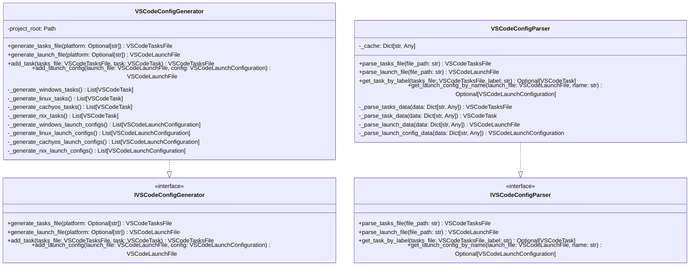
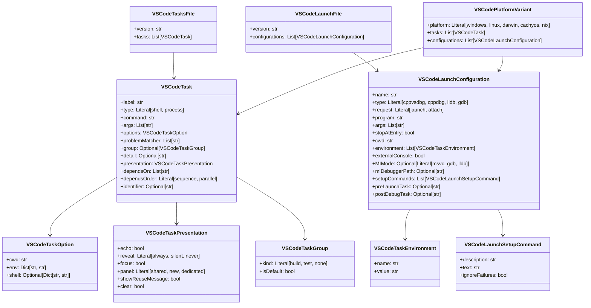

# DESIGN-042: VSCode Configuration Schema

## Overview

Defines the schema and structure for VSCode configuration files ([`tasks.json`](../../.vscode/tasks.json:1) and [`launch.json`](../../.vscode/launch.json:1)) with comprehensive Linux support, including platform-specific variants, Nix environment integration, and CachyOS optimizations.

## Purpose and Scope

This design document defines the complete schema for VSCode configuration files, covering:

- Task configuration schema for build, test, and development tasks
- Launch configuration schema for debugging C++ applications
- Platform-specific variants (Windows, Linux, macOS, CachyOS)
- Nix environment integration
- CachyOS-specific optimizations
- Multi-compiler support (GCC, Clang, MSVC)
- CMake preset integration

## Task Configuration Schema

### Top-Level Structure

```json
{
  "version": "2.0.0",
  "tasks": [
    // Task definitions
  ]
}
```

### Task Schema

```json
{
  "label": "Task Label",
  "type": "shell" | "process",
  "command": "command executable",
  "args": ["arg1", "arg2"],
  "options": {
    "cwd": "${workspaceFolder}",
    "env": {
      "VAR": "value"
    }
  },
  "problemMatcher": [],
  "group": {
    "kind": "build" | "test" | "none",
    "isDefault": true | false
  },
  "detail": "Task description",
  "presentation": {
    "echo": true,
    "reveal": "always" | "silent" | "never",
    "focus": false,
    "panel": "shared" | "new" | "dedicated",
    "showReuseMessage": true,
    "clear": false
  },
  "dependsOn": ["Other Task"],
  "dependsOrder": "sequence" | "parallel",
  "identifier": "task-identifier"
}
```

### Configure Tasks Schema

#### Windows MSVC Configure Task

```json
{
  "label": "Configure Build (Windows MSVC - Debug)",
  "type": "shell",
  "command": "python",
  "args": [
    "OmniCppController.py",
    "configure",
    "--compiler",
    "msvc",
    "--build-type",
    "Debug"
  ],
  "options": {
    "cwd": "${workspaceFolder}",
    "env": {
      "VSCMD_ARG_TGT_ARCH": "x64"
    }
  },
  "problemMatcher": [],
  "group": {
    "kind": "build",
    "isDefault": false
  },
  "detail": "Configure CMake project for Windows MSVC Debug build",
  "presentation": {
    "echo": true,
    "reveal": "always",
    "focus": false,
    "panel": "shared"
  }
}
```

#### Linux GCC Configure Task

```json
{
  "label": "Configure Build (Linux GCC - Debug)",
  "type": "shell",
  "command": "python",
  "args": [
    "OmniCppController.py",
    "configure",
    "--compiler",
    "gcc",
    "--build-type",
    "Debug"
  ],
  "options": {
    "cwd": "${workspaceFolder}",
    "env": {
      "CC": "gcc",
      "CXX": "g++",
      "CMAKE_GENERATOR": "Ninja"
    }
  },
  "problemMatcher": [],
  "group": {
    "kind": "build",
    "isDefault": false
  },
  "detail": "Configure CMake project for Linux GCC Debug build",
  "presentation": {
    "echo": true,
    "reveal": "always",
    "focus": false,
    "panel": "shared"
  }
}
```

#### Linux Clang Configure Task

```json
{
  "label": "Configure Build (Linux Clang - Debug)",
  "type": "shell",
  "command": "python",
  "args": [
    "OmniCppController.py",
    "configure",
    "--compiler",
    "clang",
    "--build-type",
    "Debug"
  ],
  "options": {
    "cwd": "${workspaceFolder}",
    "env": {
      "CC": "clang",
      "CXX": "clang++",
      "CMAKE_GENERATOR": "Ninja"
    }
  },
  "problemMatcher": [],
  "group": {
    "kind": "build",
    "isDefault": false
  },
  "detail": "Configure CMake project for Linux Clang Debug build",
  "presentation": {
    "echo": true,
    "reveal": "always",
    "focus": false,
    "panel": "shared"
  }
}
```

#### CachyOS GCC Configure Task

```json
{
  "label": "Configure Build (CachyOS GCC - Debug)",
  "type": "shell",
  "command": "python",
  "args": [
    "OmniCppController.py",
    "configure",
    "--compiler",
    "gcc",
    "--build-type",
    "Debug",
    "--platform",
    "cachyos"
  ],
  "options": {
    "cwd": "${workspaceFolder}",
    "env": {
      "CC": "gcc",
      "CXX": "g++",
      "CMAKE_GENERATOR": "Ninja",
      "CMAKE_C_FLAGS": "-march=native -g -O0",
      "CMAKE_CXX_FLAGS": "-march=native -g -O0",
      "QT_QPA_PLATFORM": "wayland"
    }
  },
  "problemMatcher": [],
  "group": {
    "kind": "build",
    "isDefault": false
  },
  "detail": "Configure CMake project for CachyOS GCC Debug build with optimizations",
  "presentation": {
    "echo": true,
    "reveal": "always",
    "focus": false,
    "panel": "shared"
  }
}
```

#### Nix GCC Configure Task

```json
{
  "label": "Configure Build (Nix GCC - Debug)",
  "type": "shell",
  "command": "nix",
  "args": [
    "develop",
    ".#gcc",
    "--command",
    "python",
    "OmniCppController.py",
    "configure",
    "--compiler",
    "gcc",
    "--build-type",
    "Debug"
  ],
  "options": {
    "cwd": "${workspaceFolder}",
    "env": {
      "IN_NIX_SHELL": "1"
    }
  },
  "problemMatcher": [],
  "group": {
    "kind": "build",
    "isDefault": false
  },
  "detail": "Configure CMake project for Nix GCC Debug build",
  "presentation": {
    "echo": true,
    "reveal": "always",
    "focus": false,
    "panel": "shared"
  }
}
```

### Build Tasks Schema

#### Windows MSVC Build Task

```json
{
  "label": "Build Engine (Windows MSVC - Debug)",
  "type": "shell",
  "command": "python",
  "args": [
    "OmniCppController.py",
    "build",
    "engine",
    "Clean Build Pipeline",
    "default",
    "debug",
    "--compiler",
    "msvc"
  ],
  "options": {
    "cwd": "${workspaceFolder}"
  },
  "problemMatcher": "$msCompile",
  "group": {
    "kind": "build",
    "isDefault": false
  },
  "detail": "Build Engine target with Windows MSVC Debug configuration",
  "dependsOn": [
    "Configure Build (Windows MSVC - Debug)"
  ],
  "presentation": {
    "echo": true,
    "reveal": "always",
    "focus": false,
    "panel": "shared"
  }
}
```

#### Linux GCC Build Task

```json
{
  "label": "Build Engine (Linux GCC - Debug)",
  "type": "shell",
  "command": "python",
  "args": [
    "OmniCppController.py",
    "build",
    "engine",
    "Clean Build Pipeline",
    "default",
    "debug",
    "--compiler",
    "gcc"
  ],
  "options": {
    "cwd": "${workspaceFolder}"
  },
  "problemMatcher": "$gcc",
  "group": {
    "kind": "build",
    "isDefault": false
  },
  "detail": "Build Engine target with Linux GCC Debug configuration",
  "dependsOn": [
    "Configure Build (Linux GCC - Debug)"
  ],
  "presentation": {
    "echo": true,
    "reveal": "always",
    "focus": false,
    "panel": "shared"
  }
}
```

#### CachyOS GCC Build Task

```json
{
  "label": "Build Engine (CachyOS GCC - Debug)",
  "type": "shell",
  "command": "python",
  "args": [
    "OmniCppController.py",
    "build",
    "engine",
    "Clean Build Pipeline",
    "default",
    "debug",
    "--compiler",
    "gcc",
    "--platform",
    "cachyos"
  ],
  "options": {
    "cwd": "${workspaceFolder}"
  },
  "problemMatcher": "$gcc",
  "group": {
    "kind": "build",
    "isDefault": false
  },
  "detail": "Build Engine target with CachyOS GCC Debug configuration",
  "dependsOn": [
    "Configure Build (CachyOS GCC - Debug)"
  ],
  "presentation": {
    "echo": true,
    "reveal": "always",
    "focus": false,
    "panel": "shared"
  }
}
```

### Test Tasks Schema

#### Run Tests Task

```json
{
  "label": "Run Tests (Linux GCC)",
  "type": "shell",
  "command": "python",
  "args": [
    "OmniCppController.py",
    "test",
    "--compiler",
    "gcc"
  ],
  "options": {
    "cwd": "${workspaceFolder}"
  },
  "problemMatcher": [],
  "group": {
    "kind": "test",
    "isDefault": false
  },
  "detail": "Run all tests with Linux GCC configuration",
  "presentation": {
    "echo": true,
    "reveal": "always",
    "focus": false,
    "panel": "shared"
  }
}
```

#### Run Tests with Coverage Task

```json
{
  "label": "Run Tests with Coverage (Linux GCC)",
  "type": "shell",
  "command": "python",
  "args": [
    "OmniCppController.py",
    "test",
    "--compiler",
    "gcc",
    "--coverage"
  ],
  "options": {
    "cwd": "${workspaceFolder}"
  },
  "problemMatcher": [],
  "group": {
    "kind": "test",
    "isDefault": false
  },
  "detail": "Run tests with coverage analysis",
  "presentation": {
    "echo": true,
    "reveal": "always",
    "focus": false,
    "panel": "shared"
  }
}
```

### Format and Lint Tasks Schema

#### Format Code Task

```json
{
  "label": "Format Code",
  "type": "shell",
  "command": "python",
  "args": [
    "OmniCppController.py",
    "format"
  ],
  "options": {
    "cwd": "${workspaceFolder}"
  },
  "problemMatcher": [],
  "group": {
    "kind": "none",
    "isDefault": false
  },
  "detail": "Format C++ and Python code using clang-format and black",
  "presentation": {
    "echo": true,
    "reveal": "always",
    "focus": false,
    "panel": "shared"
  }
}
```

#### Lint Code Task

```json
{
  "label": "Lint Code",
  "type": "shell",
  "command": "python",
  "args": [
    "OmniCppController.py",
    "lint"
  ],
  "options": {
    "cwd": "${workspaceFolder}"
  },
  "problemMatcher": [],
  "group": {
    "kind": "none",
    "isDefault": false
  },
  "detail": "Run static analysis using clang-tidy, pylint, and mypy",
  "presentation": {
    "echo": true,
    "reveal": "always",
    "focus": false,
    "panel": "shared"
  }
}
```

### Clean Tasks Schema

#### Clean Build Task

```json
{
  "label": "Clean Build",
  "type": "shell",
  "command": "python",
  "args": [
    "OmniCppController.py",
    "clean"
  ],
  "options": {
    "cwd": "${workspaceFolder}"
  },
  "problemMatcher": [],
  "group": {
    "kind": "build",
    "isDefault": false
  },
  "detail": "Clean all build artifacts",
  "presentation": {
    "echo": true,
    "reveal": "always",
    "focus": false,
    "panel": "shared"
  }
}
```

## Launch Configuration Schema

### Top-Level Structure

```json
{
  "version": "0.2.0",
  "configurations": [
    // Launch configuration definitions
  ]
}
```

### Launch Configuration Schema

```json
{
  "name": "Configuration Name",
  "type": "cppvsdbg" | "cppdbg" | "lldb" | "gdb",
  "request": "launch" | "attach",
  "program": "${workspaceFolder}/path/to/executable",
  "args": [],
  "stopAtEntry": false,
  "cwd": "${workspaceFolder}",
  "environment": [
    {
      "name": "VAR",
      "value": "value"
    }
  ],
  "externalConsole": false,
  "MIMode": "msvc" | "gdb" | "lldb",
  "miDebuggerPath": "path/to/debugger",
  "setupCommands": [
    {
      "description": "Description",
      "text": "command",
      "ignoreFailures": true
    }
  ],
  "preLaunchTask": "Task Label",
  "postDebugTask": "Task Label",
  "internalConsoleOptions": "openOnSessionStart",
  "sourceFileMap": {},
  "logging": {
    "engineLogging": false
  }
}
```

### Windows Launch Configurations

#### Windows MSVC Debug Launch

```json
{
  "name": "Debug Engine (Windows MSVC - Debug)",
  "type": "cppvsdbg",
  "request": "launch",
  "program": "${workspaceFolder}/build/bin/Debug/OmniCppEngine.exe",
  "args": [],
  "stopAtEntry": false,
  "cwd": "${workspaceFolder}",
  "environment": [],
  "externalConsole": false,
  "MIMode": "msvc",
  "preLaunchTask": "Build Engine (Windows MSVC - Debug)",
  "setupCommands": [
    {
      "description": "Enable pretty-printing",
      "text": "-enable-pretty-printing",
      "ignoreFailures": true
    }
  ]
}
```

### Linux Launch Configurations

#### Linux GCC Debug Launch

```json
{
  "name": "Debug Engine (Linux GCC - Debug)",
  "type": "cppdbg",
  "request": "launch",
  "program": "${workspaceFolder}/build/bin/Debug/OmniCppEngine",
  "args": [],
  "stopAtEntry": false,
  "cwd": "${workspaceFolder}",
  "environment": [
    {
      "name": "LD_LIBRARY_PATH",
      "value": "${workspaceFolder}/build/lib/Debug:${env:LD_LIBRARY_PATH}"
    }
  ],
  "externalConsole": false,
  "MIMode": "gdb",
  "miDebuggerPath": "/usr/bin/gdb",
  "setupCommands": [
    {
      "description": "Enable pretty-printing",
      "text": "-enable-pretty-printing",
      "ignoreFailures": true
    },
    {
      "description": "Set disassembly flavor to Intel",
      "text": "-gdb-set disassembly-flavor intel",
      "ignoreFailures": true
    }
  ],
  "preLaunchTask": "Build Engine (Linux GCC - Debug)"
}
```

#### Linux Clang Debug Launch

```json
{
  "name": "Debug Engine (Linux Clang - Debug)",
  "type": "cppdbg",
  "request": "launch",
  "program": "${workspaceFolder}/build/bin/Debug/OmniCppEngine",
  "args": [],
  "stopAtEntry": false,
  "cwd": "${workspaceFolder}",
  "environment": [
    {
      "name": "LD_LIBRARY_PATH",
      "value": "${workspaceFolder}/build/lib/Debug:${env:LD_LIBRARY_PATH}"
    }
  ],
  "externalConsole": false,
  "MIMode": "lldb",
  "miDebuggerPath": "/usr/bin/lldb",
  "setupCommands": [
    {
      "description": "Enable pretty-printing",
      "text": "-enable-pretty-printing",
      "ignoreFailures": true
    }
  ],
  "preLaunchTask": "Build Engine (Linux Clang - Debug)"
}
```

### CachyOS Launch Configurations

#### CachyOS GCC Debug Launch

```json
{
  "name": "Debug Engine (CachyOS GCC - Debug)",
  "type": "cppdbg",
  "request": "launch",
  "program": "${workspaceFolder}/build/bin/Debug/OmniCppEngine",
  "args": [],
  "stopAtEntry": false,
  "cwd": "${workspaceFolder}",
  "environment": [
    {
      "name": "LD_LIBRARY_PATH",
      "value": "${workspaceFolder}/build/lib/Debug:${env:LD_LIBRARY_PATH}"
    },
    {
      "name": "QT_QPA_PLATFORM",
      "value": "wayland"
    }
  ],
  "externalConsole": false,
  "MIMode": "gdb",
  "miDebuggerPath": "/usr/bin/gdb",
  "setupCommands": [
    {
      "description": "Enable pretty-printing",
      "text": "-enable-pretty-printing",
      "ignoreFailures": true
    },
    {
      "description": "Set disassembly flavor to Intel",
      "text": "-gdb-set disassembly-flavor intel",
      "ignoreFailures": true
    }
  ],
  "preLaunchTask": "Build Engine (CachyOS GCC - Debug)"
}
```

### Nix Launch Configurations

#### Nix GCC Debug Launch

```json
{
  "name": "Debug Engine (Nix GCC - Debug)",
  "type": "cppdbg",
  "request": "launch",
  "program": "${workspaceFolder}/build/bin/Debug/OmniCppEngine",
  "args": [],
  "stopAtEntry": false,
  "cwd": "${workspaceFolder}",
  "environment": [
    {
      "name": "LD_LIBRARY_PATH",
      "value": "${workspaceFolder}/build/lib/Debug:${env:LD_LIBRARY_PATH}"
    },
    {
      "name": "IN_NIX_SHELL",
      "value": "1"
    }
  ],
  "externalConsole": false,
  "MIMode": "gdb",
  "miDebuggerPath": "gdb",
  "setupCommands": [
    {
      "description": "Enable pretty-printing",
      "text": "-enable-pretty-printing",
      "ignoreFailures": true
    }
  ],
  "preLaunchTask": "Build Engine (Nix GCC - Debug)"
}
```

## Platform-Specific Variants Schema

### Variant Selection Strategy

VSCode supports platform-specific task and launch variants through:

1. **File-based variants**: Separate files for each platform
   - `tasks.json` (shared)
   - `tasks-linux.json` (Linux-specific)
   - `tasks-windows.json` (Windows-specific)
   - `tasks-macos.json` (macOS-specific)

2. **Condition-based variants**: Using `when` clause in tasks
   - `"when": "os == 'linux'"`
   - `"when": "os == 'windows'"`
   - `"when": "os == 'darwin'"`

3. **Environment-based variants**: Detecting environment at runtime
   - Check for Nix environment
   - Check for CachyOS distribution

### Linux-Specific Tasks File Schema

```json
{
  "version": "2.0.0",
  "tasks": [
    {
      "label": "Configure Build (Linux GCC - Debug)",
      "type": "shell",
      "command": "python",
      "args": [
        "OmniCppController.py",
        "configure",
        "--compiler",
        "gcc",
        "--build-type",
        "Debug"
      ],
      "options": {
        "cwd": "${workspaceFolder}",
        "env": {
          "CC": "gcc",
          "CXX": "g++",
          "CMAKE_GENERATOR": "Ninja"
        }
      },
      "problemMatcher": [],
      "group": {
        "kind": "build",
        "isDefault": true
      },
      "detail": "Configure CMake project for Linux GCC Debug build"
    },
    {
      "label": "Configure Build (Linux Clang - Debug)",
      "type": "shell",
      "command": "python",
      "args": [
        "OmniCppController.py",
        "configure",
        "--compiler",
        "clang",
        "--build-type",
        "Debug"
      ],
      "options": {
        "cwd": "${workspaceFolder}",
        "env": {
          "CC": "clang",
          "CXX": "clang++",
          "CMAKE_GENERATOR": "Ninja"
        }
      },
      "problemMatcher": [],
      "group": {
        "kind": "build",
        "isDefault": false
      },
      "detail": "Configure CMake project for Linux Clang Debug build"
    }
  ]
}
```

### CachyOS-Specific Tasks File Schema

```json
{
  "version": "2.0.0",
  "tasks": [
    {
      "label": "Configure Build (CachyOS GCC - Debug)",
      "type": "shell",
      "command": "python",
      "args": [
        "OmniCppController.py",
        "configure",
        "--compiler",
        "gcc",
        "--build-type",
        "Debug",
        "--platform",
        "cachyos"
      ],
      "options": {
        "cwd": "${workspaceFolder}",
        "env": {
          "CC": "gcc",
          "CXX": "g++",
          "CMAKE_GENERATOR": "Ninja",
          "CMAKE_C_FLAGS": "-march=native -g -O0",
          "CMAKE_CXX_FLAGS": "-march=native -g -O0",
          "QT_QPA_PLATFORM": "wayland"
        }
      },
      "problemMatcher": [],
      "group": {
        "kind": "build",
        "isDefault": true
      },
      "detail": "Configure CMake project for CachyOS GCC Debug build with optimizations"
    }
  ]
}
```

## Python Data Structures

### Task Configuration Data Classes

```python
from dataclasses import dataclass, field
from typing import List, Dict, Optional, Any, Literal

@dataclass
class VSCodeTaskOption:
    """VSCode task options."""
    cwd: str = "${workspaceFolder}"
    env: Dict[str, str] = field(default_factory=dict)
    shell: Optional[Dict[str, str]] = None

@dataclass
class VSCodeTaskPresentation:
    """VSCode task presentation options."""
    echo: bool = True
    reveal: Literal["always", "silent", "never"] = "always"
    focus: bool = False
    panel: Literal["shared", "new", "dedicated"] = "shared"
    showReuseMessage: bool = True
    clear: bool = False

@dataclass
class VSCodeTaskGroup:
    """VSCode task group."""
    kind: Literal["build", "test", "none"]
    isDefault: bool = False

@dataclass
class VSCodeTask:
    """VSCode task definition."""
    label: str
    type: Literal["shell", "process"]
    command: str
    args: List[str] = field(default_factory=list)
    options: VSCodeTaskOption = field(default_factory=VSCodeTaskOption)
    problemMatcher: List[str] = field(default_factory=list)
    group: Optional[VSCodeTaskGroup] = None
    detail: Optional[str] = None
    presentation: VSCodeTaskPresentation = field(default_factory=VSCodeTaskPresentation)
    dependsOn: List[str] = field(default_factory=list)
    dependsOrder: Literal["sequence", "parallel"] = "sequence"
    identifier: Optional[str] = None

@dataclass
class VSCodeTaskEnvironment:
    """VSCode task environment variable."""
    name: str
    value: str

@dataclass
class VSCodeLaunchSetupCommand:
    """VSCode launch setup command."""
    description: str
    text: str
    ignoreFailures: bool = True

@dataclass
class VSCodeLaunchConfiguration:
    """VSCode launch configuration."""
    name: str
    type: Literal["cppvsdbg", "cppdbg", "lldb", "gdb"]
    request: Literal["launch", "attach"]
    program: str
    args: List[str] = field(default_factory=list)
    stopAtEntry: bool = False
    cwd: str = "${workspaceFolder}"
    environment: List[VSCodeTaskEnvironment] = field(default_factory=list)
    externalConsole: bool = False
    MIMode: Optional[Literal["msvc", "gdb", "lldb"]] = None
    miDebuggerPath: Optional[str] = None
    setupCommands: List[VSCodeLaunchSetupCommand] = field(default_factory=list)
    preLaunchTask: Optional[str] = None
    postDebugTask: Optional[str] = None
    internalConsoleOptions: Optional[str] = None
    sourceFileMap: Dict[str, str] = field(default_factory=dict)
    logging: Optional[Dict[str, bool]] = None

@dataclass
class VSCodeTasksFile:
    """VSCode tasks.json file."""
    version: str = "2.0.0"
    tasks: List[VSCodeTask] = field(default_factory=list)

@dataclass
class VSCodeLaunchFile:
    """VSCode launch.json file."""
    version: str = "0.2.0"
    configurations: List[VSCodeLaunchConfiguration] = field(default_factory=list)

@dataclass
class VSCodePlatformVariant:
    """Platform-specific variant."""
    platform: Literal["windows", "linux", "darwin", "cachyos", "nix"]
    tasks: List[VSCodeTask] = field(default_factory=list)
    configurations: List[VSCodeLaunchConfiguration] = field(default_factory=list)
```

## Interfaces

### IVSCodeConfigGenerator

```python
from abc import ABC, abstractmethod

class IVSCodeConfigGenerator(ABC):
    """Interface for generating VSCode configurations."""

    @abstractmethod
    def generate_tasks_file(
        self,
        platform: Optional[str] = None
    ) -> VSCodeTasksFile:
        """Generate tasks.json file.

        Args:
            platform: Optional platform filter (windows, linux, darwin, cachyos, nix).

        Returns:
            VSCodeTasksFile: Generated tasks file.

        Raises:
            VSCodeConfigError: If generation fails.
        """
        pass

    @abstractmethod
    def generate_launch_file(
        self,
        platform: Optional[str] = None
    ) -> VSCodeLaunchFile:
        """Generate launch.json file.

        Args:
            platform: Optional platform filter (windows, linux, darwin, cachyos, nix).

        Returns:
            VSCodeLaunchFile: Generated launch file.

        Raises:
            VSCodeConfigError: If generation fails.
        """
        pass

    @abstractmethod
    def add_task(
        self,
        tasks_file: VSCodeTasksFile,
        task: VSCodeTask
    ) -> VSCodeTasksFile:
        """Add a task to tasks file.

        Args:
            tasks_file: Tasks file to modify.
            task: Task to add.

        Returns:
            VSCodeTasksFile: Modified tasks file.
        """
        pass

    @abstractmethod
    def add_launch_config(
        self,
        launch_file: VSCodeLaunchFile,
        config: VSCodeLaunchConfiguration
    ) -> VSCodeLaunchFile:
        """Add a launch configuration.

        Args:
            launch_file: Launch file to modify.
            config: Launch configuration to add.

        Returns:
            VSCodeLaunchFile: Modified launch file.
        """
        pass
```

### IVSCodeConfigParser

```python
class IVSCodeConfigParser(ABC):
    """Interface for parsing VSCode configurations."""

    @abstractmethod
    def parse_tasks_file(
        self,
        file_path: str
    ) -> VSCodeTasksFile:
        """Parse tasks.json file.

        Args:
            file_path: Path to tasks.json file.

        Returns:
            VSCodeTasksFile: Parsed tasks file.

        Raises:
            VSCodeConfigError: If parsing fails.
        """
        pass

    @abstractmethod
    def parse_launch_file(
        self,
        file_path: str
    ) -> VSCodeLaunchFile:
        """Parse launch.json file.

        Args:
            file_path: Path to launch.json file.

        Returns:
            VSCodeLaunchFile: Parsed launch file.

        Raises:
            VSCodeConfigError: If parsing fails.
        """
        pass

    @abstractmethod
    def get_task_by_label(
        self,
        tasks_file: VSCodeTasksFile,
        label: str
    ) -> Optional[VSCodeTask]:
        """Get a task by label.

        Args:
            tasks_file: Tasks file to search.
            label: Task label to find.

        Returns:
            Optional[VSCodeTask]: Task if found, None otherwise.
        """
        pass

    @abstractmethod
    def get_launch_config_by_name(
        self,
        launch_file: VSCodeLaunchFile,
        name: str
    ) -> Optional[VSCodeLaunchConfiguration]:
        """Get a launch configuration by name.

        Args:
            launch_file: Launch file to search.
            name: Launch configuration name to find.

        Returns:
            Optional[VSCodeLaunchConfiguration]: Launch config if found, None otherwise.
        """
        pass
```

## Class Definitions

### VSCodeConfigGenerator

```python
import json
from pathlib import Path

class VSCodeConfigGenerator(IVSCodeConfigGenerator):
    """Generator for VSCode configuration files."""

    def __init__(self, project_root: str) -> None:
        """Initialize the generator.

        Args:
            project_root: Root directory of the project.
        """
        self.project_root = Path(project_root)

    def generate_tasks_file(
        self,
        platform: Optional[str] = None
    ) -> VSCodeTasksFile:
        """Generate tasks.json file."""
        tasks_file = VSCodeTasksFile()

        # Generate platform-specific tasks
        if platform is None or platform == "windows":
            tasks_file.tasks.extend(self._generate_windows_tasks())

        if platform is None or platform == "linux":
            tasks_file.tasks.extend(self._generate_linux_tasks())

        if platform is None or platform == "cachyos":
            tasks_file.tasks.extend(self._generate_cachyos_tasks())

        if platform is None or platform == "nix":
            tasks_file.tasks.extend(self._generate_nix_tasks())

        return tasks_file

    def generate_launch_file(
        self,
        platform: Optional[str] = None
    ) -> VSCodeLaunchFile:
        """Generate launch.json file."""
        launch_file = VSCodeLaunchFile()

        # Generate platform-specific launch configs
        if platform is None or platform == "windows":
            launch_file.configurations.extend(self._generate_windows_launch_configs())

        if platform is None or platform == "linux":
            launch_file.configurations.extend(self._generate_linux_launch_configs())

        if platform is None or platform == "cachyos":
            launch_file.configurations.extend(self._generate_cachyos_launch_configs())

        if platform is None or platform == "nix":
            launch_file.configurations.extend(self._generate_nix_launch_configs())

        return launch_file

    def add_task(
        self,
        tasks_file: VSCodeTasksFile,
        task: VSCodeTask
    ) -> VSCodeTasksFile:
        """Add a task to tasks file."""
        # Remove existing task with same label
        tasks_file.tasks = [t for t in tasks_file.tasks if t.label != task.label]
        tasks_file.tasks.append(task)
        return tasks_file

    def add_launch_config(
        self,
        launch_file: VSCodeLaunchFile,
        config: VSCodeLaunchConfiguration
    ) -> VSCodeLaunchFile:
        """Add a launch configuration."""
        # Remove existing config with same name
        launch_file.configurations = [
            c for c in launch_file.configurations if c.name != config.name
        ]
        launch_file.configurations.append(config)
        return launch_file

    def _generate_windows_tasks(self) -> List[VSCodeTask]:
        """Generate Windows-specific tasks."""
        tasks = []

        # Configure task
        tasks.append(VSCodeTask(
            label="Configure Build (Windows MSVC - Debug)",
            type="shell",
            command="python",
            args=[
                "OmniCppController.py",
                "configure",
                "--compiler",
                "msvc",
                "--build-type",
                "Debug"
            ],
            options=VSCodeTaskOption(
                cwd="${workspaceFolder}",
                env={"VSCMD_ARG_TGT_ARCH": "x64"}
            ),
            group=VSCodeTaskGroup(kind="build", isDefault=False),
            detail="Configure CMake project for Windows MSVC Debug build"
        ))

        return tasks

    def _generate_linux_tasks(self) -> List[VSCodeTask]:
        """Generate Linux-specific tasks."""
        tasks = []

        # GCC configure task
        tasks.append(VSCodeTask(
            label="Configure Build (Linux GCC - Debug)",
            type="shell",
            command="python",
            args=[
                "OmniCppController.py",
                "configure",
                "--compiler",
                "gcc",
                "--build-type",
                "Debug"
            ],
            options=VSCodeTaskOption(
                cwd="${workspaceFolder}",
                env={
                    "CC": "gcc",
                    "CXX": "g++",
                    "CMAKE_GENERATOR": "Ninja"
                }
            ),
            group=VSCodeTaskGroup(kind="build", isDefault=False),
            detail="Configure CMake project for Linux GCC Debug build"
        ))

        # Clang configure task
        tasks.append(VSCodeTask(
            label="Configure Build (Linux Clang - Debug)",
            type="shell",
            command="python",
            args=[
                "OmniCppController.py",
                "configure",
                "--compiler",
                "clang",
                "--build-type",
                "Debug"
            ],
            options=VSCodeTaskOption(
                cwd="${workspaceFolder}",
                env={
                    "CC": "clang",
                    "CXX": "clang++",
                    "CMAKE_GENERATOR": "Ninja"
                }
            ),
            group=VSCodeTaskGroup(kind="build", isDefault=False),
            detail="Configure CMake project for Linux Clang Debug build"
        ))

        return tasks

    def _generate_cachyos_tasks(self) -> List[VSCodeTask]:
        """Generate CachyOS-specific tasks."""
        tasks = []

        # GCC configure task with CachyOS optimizations
        tasks.append(VSCodeTask(
            label="Configure Build (CachyOS GCC - Debug)",
            type="shell",
            command="python",
            args=[
                "OmniCppController.py",
                "configure",
                "--compiler",
                "gcc",
                "--build-type",
                "Debug",
                "--platform",
                "cachyos"
            ],
            options=VSCodeTaskOption(
                cwd="${workspaceFolder}",
                env={
                    "CC": "gcc",
                    "CXX": "g++",
                    "CMAKE_GENERATOR": "Ninja",
                    "CMAKE_C_FLAGS": "-march=native -g -O0",
                    "CMAKE_CXX_FLAGS": "-march=native -g -O0",
                    "QT_QPA_PLATFORM": "wayland"
                }
            ),
            group=VSCodeTaskGroup(kind="build", isDefault=True),
            detail="Configure CMake project for CachyOS GCC Debug build with optimizations"
        ))

        return tasks

    def _generate_nix_tasks(self) -> List[VSCodeTask]:
        """Generate Nix-specific tasks."""
        tasks = []

        # GCC configure task in Nix shell
        tasks.append(VSCodeTask(
            label="Configure Build (Nix GCC - Debug)",
            type="shell",
            command="nix",
            args=[
                "develop",
                ".#gcc",
                "--command",
                "python",
                "OmniCppController.py",
                "configure",
                "--compiler",
                "gcc",
                "--build-type",
                "Debug"
            ],
            options=VSCodeTaskOption(
                cwd="${workspaceFolder}",
                env={"IN_NIX_SHELL": "1"}
            ),
            group=VSCodeTaskGroup(kind="build", isDefault=False),
            detail="Configure CMake project for Nix GCC Debug build"
        ))

        return tasks

    def _generate_windows_launch_configs(self) -> List[VSCodeLaunchConfiguration]:
        """Generate Windows-specific launch configurations."""
        configs = []

        # MSVC debug launch
        configs.append(VSCodeLaunchConfiguration(
            name="Debug Engine (Windows MSVC - Debug)",
            type="cppvsdbg",
            request="launch",
            program="${workspaceFolder}/build/bin/Debug/OmniCppEngine.exe",
            cwd="${workspaceFolder}",
            environment=[],
            externalConsole=False,
            MIMode="msvc",
            preLaunchTask="Build Engine (Windows MSVC - Debug)",
            setupCommands=[
                VSCodeLaunchSetupCommand(
                    description="Enable pretty-printing",
                    text="-enable-pretty-printing"
                )
            ]
        ))

        return configs

    def _generate_linux_launch_configs(self) -> List[VSCodeLaunchConfiguration]:
        """Generate Linux-specific launch configurations."""
        configs = []

        # GCC debug launch
        configs.append(VSCodeLaunchConfiguration(
            name="Debug Engine (Linux GCC - Debug)",
            type="cppdbg",
            request="launch",
            program="${workspaceFolder}/build/bin/Debug/OmniCppEngine",
            cwd="${workspaceFolder}",
            environment=[
                VSCodeTaskEnvironment(
                    name="LD_LIBRARY_PATH",
                    value="${workspaceFolder}/build/lib/Debug:${env:LD_LIBRARY_PATH}"
                )
            ],
            externalConsole=False,
            MIMode="gdb",
            miDebuggerPath="/usr/bin/gdb",
            preLaunchTask="Build Engine (Linux GCC - Debug)",
            setupCommands=[
                VSCodeLaunchSetupCommand(
                    description="Enable pretty-printing",
                    text="-enable-pretty-printing"
                ),
                VSCodeLaunchSetupCommand(
                    description="Set disassembly flavor to Intel",
                    text="-gdb-set disassembly-flavor intel"
                )
            ]
        ))

        # Clang debug launch
        configs.append(VSCodeLaunchConfiguration(
            name="Debug Engine (Linux Clang - Debug)",
            type="cppdbg",
            request="launch",
            program="${workspaceFolder}/build/bin/Debug/OmniCppEngine",
            cwd="${workspaceFolder}",
            environment=[
                VSCodeTaskEnvironment(
                    name="LD_LIBRARY_PATH",
                    value="${workspaceFolder}/build/lib/Debug:${env:LD_LIBRARY_PATH}"
                )
            ],
            externalConsole=False,
            MIMode="lldb",
            miDebuggerPath="/usr/bin/lldb",
            preLaunchTask="Build Engine (Linux Clang - Debug)",
            setupCommands=[
                VSCodeLaunchSetupCommand(
                    description="Enable pretty-printing",
                    text="-enable-pretty-printing"
                )
            ]
        ))

        return configs

    def _generate_cachyos_launch_configs(self) -> List[VSCodeLaunchConfiguration]:
        """Generate CachyOS-specific launch configurations."""
        configs = []

        # GCC debug launch with Wayland
        configs.append(VSCodeLaunchConfiguration(
            name="Debug Engine (CachyOS GCC - Debug)",
            type="cppdbg",
            request="launch",
            program="${workspaceFolder}/build/bin/Debug/OmniCppEngine",
            cwd="${workspaceFolder}",
            environment=[
                VSCodeTaskEnvironment(
                    name="LD_LIBRARY_PATH",
                    value="${workspaceFolder}/build/lib/Debug:${env:LD_LIBRARY_PATH}"
                ),
                VSCodeTaskEnvironment(
                    name="QT_QPA_PLATFORM",
                    value="wayland"
                )
            ],
            externalConsole=False,
            MIMode="gdb",
            miDebuggerPath="/usr/bin/gdb",
            preLaunchTask="Build Engine (CachyOS GCC - Debug)",
            setupCommands=[
                VSCodeLaunchSetupCommand(
                    description="Enable pretty-printing",
                    text="-enable-pretty-printing"
                ),
                VSCodeLaunchSetupCommand(
                    description="Set disassembly flavor to Intel",
                    text="-gdb-set disassembly-flavor intel"
                )
            ]
        ))

        return configs

    def _generate_nix_launch_configs(self) -> List[VSCodeLaunchConfiguration]:
        """Generate Nix-specific launch configurations."""
        configs = []

        # GCC debug launch in Nix
        configs.append(VSCodeLaunchConfiguration(
            name="Debug Engine (Nix GCC - Debug)",
            type="cppdbg",
            request="launch",
            program="${workspaceFolder}/build/bin/Debug/OmniCppEngine",
            cwd="${workspaceFolder}",
            environment=[
                VSCodeTaskEnvironment(
                    name="LD_LIBRARY_PATH",
                    value="${workspaceFolder}/build/lib/Debug:${env:LD_LIBRARY_PATH}"
                ),
                VSCodeTaskEnvironment(
                    name="IN_NIX_SHELL",
                    value="1"
                )
            ],
            externalConsole=False,
            MIMode="gdb",
            miDebuggerPath="gdb",
            preLaunchTask="Build Engine (Nix GCC - Debug)",
            setupCommands=[
                VSCodeLaunchSetupCommand(
                    description="Enable pretty-printing",
                    text="-enable-pretty-printing"
                )
            ]
        ))

        return configs
```

### VSCodeConfigParser

```python
import json
from pathlib import Path

class VSCodeConfigParser(IVSCodeConfigParser):
    """Parser for VSCode configuration files."""

    def __init__(self) -> None:
        """Initialize the parser."""
        self._cache: Dict[str, Any] = {}

    def parse_tasks_file(
        self,
        file_path: str
    ) -> VSCodeTasksFile:
        """Parse tasks.json file."""
        if file_path in self._cache:
            return self._cache[file_path]

        path = Path(file_path)
        if not path.exists():
            raise VSCodeConfigError(f"Tasks file not found: {file_path}")

        with open(path, 'r') as f:
            data = json.load(f)

        tasks_file = self._parse_tasks_data(data)
        self._cache[file_path] = tasks_file
        return tasks_file

    def parse_launch_file(
        self,
        file_path: str
    ) -> VSCodeLaunchFile:
        """Parse launch.json file."""
        if file_path in self._cache:
            return self._cache[file_path]

        path = Path(file_path)
        if not path.exists():
            raise VSCodeConfigError(f"Launch file not found: {file_path}")

        with open(path, 'r') as f:
            data = json.load(f)

        launch_file = self._parse_launch_data(data)
        self._cache[file_path] = launch_file
        return launch_file

    def get_task_by_label(
        self,
        tasks_file: VSCodeTasksFile,
        label: str
    ) -> Optional[VSCodeTask]:
        """Get a task by label."""
        for task in tasks_file.tasks:
            if task.label == label:
                return task
        return None

    def get_launch_config_by_name(
        self,
        launch_file: VSCodeLaunchFile,
        name: str
    ) -> Optional[VSCodeLaunchConfiguration]:
        """Get a launch configuration by name."""
        for config in launch_file.configurations:
            if config.name == name:
                return config
        return None

    def _parse_tasks_data(self, data: Dict[str, Any]) -> VSCodeTasksFile:
        """Parse tasks data from JSON.

        Args:
            data: Parsed JSON data.

        Returns:
            VSCodeTasksFile: Tasks file.
        """
        tasks_file = VSCodeTasksFile(
            version=data.get("version", "2.0.0")
        )

        for task_data in data.get("tasks", []):
            task = self._parse_task_data(task_data)
            tasks_file.tasks.append(task)

        return tasks_file

    def _parse_task_data(self, data: Dict[str, Any]) -> VSCodeTask:
        """Parse task data from JSON.

        Args:
            data: Parsed JSON data.

        Returns:
            VSCodeTask: Task.
        """
        # Parse options
        options_data = data.get("options", {})
        options = VSCodeTaskOption(
            cwd=options_data.get("cwd", "${workspaceFolder}"),
            env=options_data.get("env", {})
        )

        # Parse presentation
        presentation_data = data.get("presentation", {})
        presentation = VSCodeTaskPresentation(
            echo=presentation_data.get("echo", True),
            reveal=presentation_data.get("reveal", "always"),
            focus=presentation_data.get("focus", False),
            panel=presentation_data.get("panel", "shared")
        )

        # Parse group
        group_data = data.get("group", {})
        group = VSCodeTaskGroup(
            kind=group_data.get("kind", "none"),
            isDefault=group_data.get("isDefault", False)
        )

        # Parse environment
        environment = [
            VSCodeTaskEnvironment(name=env["name"], value=env["value"])
            for env in data.get("environment", [])
        ]

        return VSCodeTask(
            label=data["label"],
            type=data["type"],
            command=data["command"],
            args=data.get("args", []),
            options=options,
            problemMatcher=data.get("problemMatcher", []),
            group=group,
            detail=data.get("detail"),
            presentation=presentation,
            dependsOn=data.get("dependsOn", []),
            dependsOrder=data.get("dependsOrder", "sequence"),
            identifier=data.get("identifier")
        )

    def _parse_launch_data(self, data: Dict[str, Any]) -> VSCodeLaunchFile:
        """Parse launch data from JSON.

        Args:
            data: Parsed JSON data.

        Returns:
            VSCodeLaunchFile: Launch file.
        """
        launch_file = VSCodeLaunchFile(
            version=data.get("version", "0.2.0")
        )

        for config_data in data.get("configurations", []):
            config = self._parse_launch_config_data(config_data)
            launch_file.configurations.append(config)

        return launch_file

    def _parse_launch_config_data(
        self,
        data: Dict[str, Any]
    ) -> VSCodeLaunchConfiguration:
        """Parse launch configuration data from JSON.

        Args:
            data: Parsed JSON data.

        Returns:
            VSCodeLaunchConfiguration: Launch configuration.
        """
        # Parse environment
        environment = [
            VSCodeTaskEnvironment(name=env["name"], value=env["value"])
            for env in data.get("environment", [])
        ]

        # Parse setup commands
        setup_commands = [
            VSCodeLaunchSetupCommand(
                description=cmd.get("description", ""),
                text=cmd["text"],
                ignoreFailures=cmd.get("ignoreFailures", True)
            )
            for cmd in data.get("setupCommands", [])
        ]

        return VSCodeLaunchConfiguration(
            name=data["name"],
            type=data["type"],
            request=data["request"],
            program=data["program"],
            args=data.get("args", []),
            stopAtEntry=data.get("stopAtEntry", False),
            cwd=data.get("cwd", "${workspaceFolder}"),
            environment=environment,
            externalConsole=data.get("externalConsole", False),
            MIMode=data.get("MIMode"),
            miDebuggerPath=data.get("miDebuggerPath"),
            setupCommands=setup_commands,
            preLaunchTask=data.get("preLaunchTask"),
            postDebugTask=data.get("postDebugTask"),
            internalConsoleOptions=data.get("internalConsoleOptions"),
            sourceFileMap=data.get("sourceFileMap", {}),
            logging=data.get("logging")
        )
```

## Relationships

### Class Hierarchy



### Data Structure Relationships



## Exception Hierarchy

```python
class VSCodeConfigError(Exception):
    """Base exception for VSCode configuration errors."""

    def __init__(
        self,
        message: str,
        details: Optional[Dict[str, Any]] = None
    ) -> None:
        """Initialize exception.

        Args:
            message: Error message.
            details: Optional additional details.
        """
        self.message = message
        self.details = details or {}
        super().__init__(message)

class VSCodeParseError(VSCodeConfigError):
    """Exception raised when VSCode config parsing fails."""
    pass

class VSCodeGenerationError(VSCodeConfigError):
    """Exception raised when VSCode config generation fails."""
    pass

class VSCodeValidationError(VSCodeConfigError):
    """Exception raised when VSCode config validation fails."""
    pass
```

## Pseudocode Examples

### Example 1: Generate Tasks for Linux

```python
# Initialize generator
generator = VSCodeConfigGenerator("/path/to/project")

# Generate Linux tasks
tasks_file = generator.generate_tasks_file(platform="linux")

# Print tasks
for task in tasks_file.tasks:
    print(f"Task: {task.label}")
    print(f"  Command: {task.command}")
    print(f"  Args: {' '.join(task.args)}")
```

### Example 2: Generate Launch Config for CachyOS

```python
# Initialize generator
generator = VSCodeConfigGenerator("/path/to/project")

# Generate CachyOS launch configs
launch_file = generator.generate_launch_file(platform="cachyos")

# Print launch configs
for config in launch_file.configurations:
    print(f"Launch Config: {config.name}")
    print(f"  Program: {config.program}")
    print(f"  Debugger: {config.MIMode}")
```

### Example 3: Parse Existing Tasks File

```python
# Initialize parser
parser = VSCodeConfigParser()

# Parse tasks file
tasks_file = parser.parse_tasks_file(".vscode/tasks.json")

# Get specific task
task = parser.get_task_by_label(tasks_file, "Configure Build (Linux GCC - Debug)")
if task:
    print(f"Found task: {task.label}")
    print(f"  Command: {task.command}")
```

## Related Requirements

- REQ-009: Platform Detection
- REQ-010: Compiler Detection
- REQ-016: Conan Integration
- REQ-022: CMake 4 Configuration
- REQ-023: Ninja Generator Default
- REQ-024: CMake Presets Cross-Platform
- REQ-048: VSCode Tasks Configuration
- REQ-049: VSCode Launch Configuration

## Related ADRs

- ADR-026: VSCode Tasks and Launch Configuration
- ADR-030: Enhanced OmniCppController.py Architecture
- ADR-032: VSCode Platform-Specific Tasks

## Implementation Notes

### File Organization

- Use shared [`tasks.json`](../../.vscode/tasks.json:1) for common tasks
- Use platform-specific files for platform-specific tasks
- Use [`launch.json`](../../.vscode/launch.json:1) for launch configurations
- Use [`launch-windows.json`](../../.vscode/launch-windows.json:1) for Windows-specific configs
- Use [`launch-linux.json`](../../.vscode/launch-linux.json:1) for Linux-specific configs

### Platform Detection

- Detect platform at runtime using VSCode variables
- Use `${env:IN_NIX_SHELL}` to detect Nix environment
- Use `${env:DISTRO_ID}` to detect Linux distribution
- Provide fallback configurations for unknown platforms

### Task Dependencies

- Use `dependsOn` to specify task dependencies
- Use `dependsOrder` to control execution order
- Ensure configure tasks run before build tasks
- Ensure build tasks run before launch tasks

### Environment Variables

- Set compiler paths via environment variables
- Set library paths via `LD_LIBRARY_PATH` on Linux
- Set Qt platform via `QT_QPA_PLATFORM` on CachyOS
- Set Nix environment via `IN_NIX_SHELL`

### Debugging Configuration

- Use `cppvsdbg` for Windows MSVC
- Use `cppdbg` with `gdb` for Linux GCC
- Use `cppdbg` with `lldb` for Linux Clang
- Enable pretty-printing for better debugging experience

### Performance Considerations

- Use Ninja for faster builds
- Enable parallel builds via `--parallel` flag
- Use ccache for faster rebuilds
- Minimize task dependencies for parallel execution

### Security Considerations

- Validate executable paths
- Sanitize environment variables
- Use absolute paths where possible
- Validate task inputs

## Testing Considerations

- Test task generation for all platforms
- Test launch configuration generation for all platforms
- Test parsing of existing configuration files
- Test platform detection logic
- Test environment variable configuration
- Test task dependencies
- Test debugging configurations
- Test with different VSCode versions
- Test with different debugger versions
- Test error handling and validation

---

## Document Control

| Version | Date | Author | Changes |
|---------|------|---------|---------|
| 1.0 | 2026-01-27 | System Architect | Initial version |
