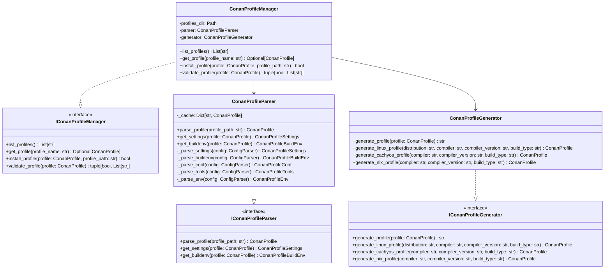

# DESIGN-043: Conan Profile Schema

## Overview

Defines the schema and structure for Conan profile files, including Linux, CachyOS, GCC, and Clang profiles with support for Nix environments and CachyOS-specific optimizations.

## Purpose and Scope

This design document defines the complete schema for Conan profile files, covering:

- Linux profile schema with distribution detection
- CachyOS profile schema with performance optimizations
- GCC profile schema with version-specific configurations
- Clang profile schema with version-specific configurations
- Nix environment integration
- CMake toolchain integration
- Cross-compilation support
- Build type variants (Debug, Release, RelWithDebInfo, MinSizeRel)

## Conan Profile Structure

### Profile File Format

```ini
[settings]
# Compiler and platform settings

[buildenv]
# Build environment variables

[conf]
# Conan configuration

[tools]
# Tool-specific settings

[env]
# Environment variables

[buildenv_info]
# Build environment information
```

## Linux Profile Schema

### Generic Linux Profile

```ini
[settings]
os=Linux
arch=x86_64
compiler=gcc
compiler.version=13
compiler.libcxx=libstdc++11
build_type=Release

[buildenv]
CC=gcc
CXX=g++
CFLAGS=-march=x86-64-v3
CXXFLAGS=-march=x86-64-v3

[conf]
tools.cmake.cmaketoolchain:generator=Ninja
tools.build:compiler_executables={"c": "gcc", "cpp": "g++}

[tools]
cmake:cmake_executable=cmake
ninja:ninja_executable=ninja
```

### Arch Linux Profile

```ini
[settings]
os=Linux
arch=x86_64
compiler=gcc
compiler.version=13
compiler.libcxx=libstdc++11
build_type=Release

[buildenv]
CC=gcc
CXX=g++
CFLAGS=-march=x86-64-v3 -O2
CXXFLAGS=-march=x86-64-v3 -O2

[conf]
tools.cmake.cmaketoolchain:generator=Ninja
tools.build:compiler_executables={"c": "gcc", "cpp": "g++}

[tools]
cmake:cmake_executable=cmake
ninja:ninja_executable=ninja
```

### Ubuntu Profile

```ini
[settings]
os=Linux
arch=x86_64
compiler=gcc
compiler.version=11
compiler.libcxx=libstdc++11
build_type=Release

[buildenv]
CC=gcc-11
CXX=g++-11
CFLAGS=-march=x86-64 -O2
CXXFLAGS=-march=x86-64 -O2

[conf]
tools.cmake.cmaketoolchain:generator=Ninja
tools.build:compiler_executables={"c": "gcc-11", "cpp": "g++-11"}

[tools]
cmake:cmake_executable=cmake
ninja:ninja_executable=ninja
```

### Fedora Profile

```ini
[settings]
os=Linux
arch=x86_64
compiler=gcc
compiler.version=13
compiler.libcxx=libstdc++11
build_type=Release

[buildenv]
CC=gcc
CXX=g++
CFLAGS=-march=x86-64-v3 -O2
CXXFLAGS=-march=x86-64-v3 -O2

[conf]
tools.cmake.cmaketoolchain:generator=Ninja
tools.build:compiler_executables={"c": "gcc", "cpp": "g++}

[tools]
cmake:cmake_executable=cmake
ninja:ninja_executable=ninja
```

## CachyOS Profile Schema

### CachyOS GCC Profile (Debug)

```ini
[settings]
os=Linux
arch=x86_64
compiler=gcc
compiler.version=13
compiler.libcxx=libstdc++11
build_type=Debug

[buildenv]
CC=gcc
CXX=g++
CFLAGS=-march=native -g -O0
CXXFLAGS=-march=native -g -O0
LDFLAGS=-Wl,--as-needed -Wl,--no-undefined

[conf]
tools.cmake.cmaketoolchain:generator=Ninja
tools.build:compiler_executables={"c": "gcc", "cpp": "g++}

[tools]
cmake:cmake_executable=cmake
ninja:ninja_executable=ninja

[env]
QT_QPA_PLATFORM=wayland
```

### CachyOS GCC Profile (Release)

```ini
[settings]
os=Linux
arch=x86_64
compiler=gcc
compiler.version=13
compiler.libcxx=libstdc++11
build_type=Release

[buildenv]
CC=gcc
CXX=g++
CFLAGS=-march=native -O3 -flto -DNDEBUG -fstack-protector-strong -D_FORTIFY_SOURCE=2
CXXFLAGS=-march=native -O3 -flto -DNDEBUG -fstack-protector-strong -D_FORTIFY_SOURCE=2
LDFLAGS=-Wl,--as-needed -Wl,--no-undefined -flto

[conf]
tools.cmake.cmaketoolchain:generator=Ninja
tools.build:compiler_executables={"c": "gcc", "cpp": "g++}

[tools]
cmake:cmake_executable=cmake
ninja:ninja_executable=ninja

[env]
QT_QPA_PLATFORM=wayland
```

### CachyOS GCC Profile (RelWithDebInfo)

```ini
[settings]
os=Linux
arch=x86_64
compiler=gcc
compiler.version=13
compiler.libcxx=libstdc++11
build_type=RelWithDebInfo

[buildenv]
CC=gcc
CXX=g++
CFLAGS=-march=native -O2 -g -DNDEBUG -fstack-protector-strong -D_FORTIFY_SOURCE=2
CXXFLAGS=-march=native -O2 -g -DNDEBUG -fstack-protector-strong -D_FORTIFY_SOURCE=2
LDFLAGS=-Wl,--as-needed -Wl,--no-undefined

[conf]
tools.cmake.cmaketoolchain:generator=Ninja
tools.build:compiler_executables={"c": "gcc", "cpp": "g++}

[tools]
cmake:cmake_executable=cmake
ninja:ninja_executable=ninja

[env]
QT_QPA_PLATFORM=wayland
```

### CachyOS Clang Profile (Debug)

```ini
[settings]
os=Linux
arch=x86_64
compiler=clang
compiler.version=19
compiler.libcxx=libc++
build_type=Debug

[buildenv]
CC=clang
CXX=clang++
CFLAGS=-march=native -g -O0
CXXFLAGS=-march=native -g -O0
LDFLAGS=-Wl,--as-needed -Wl,--no-undefined

[conf]
tools.cmake.cmaketoolchain:generator=Ninja
tools.build:compiler_executables={"c": "clang", "cpp": "clang++"}

[tools]
cmake:cmake_executable=cmake
ninja:ninja_executable=ninja

[env]
QT_QPA_PLATFORM=wayland
```

### CachyOS Clang Profile (Release)

```ini
[settings]
os=Linux
arch=x86_64
compiler=clang
compiler.version=19
compiler.libcxx=libc++
build_type=Release

[buildenv]
CC=clang
CXX=clang++
CFLAGS=-march=native -O3 -flto -DNDEBUG -fstack-protector-strong -D_FORTIFY_SOURCE=2
CXXFLAGS=-march=native -O3 -flto -DNDEBUG -fstack-protector-strong -D_FORTIFY_SOURCE=2
LDFLAGS=-Wl,--as-needed -Wl,--no-undefined -flto

[conf]
tools.cmake.cmaketoolchain:generator=Ninja
tools.build:compiler_executables={"c": "clang", "cpp": "clang++"}

[tools]
cmake:cmake_executable=cmake
ninja:ninja_executable=ninja

[env]
QT_QPA_PLATFORM=wayland
```

## GCC Profile Schema

### GCC 13 Profile (Debug)

```ini
[settings]
os=Linux
arch=x86_64
compiler=gcc
compiler.version=13
compiler.libcxx=libstdc++11
build_type=Debug

[buildenv]
CC=gcc
CXX=g++
CFLAGS=-g -O0
CXXFLAGS=-g -O0

[conf]
tools.cmake.cmaketoolchain:generator=Ninja
tools.build:compiler_executables={"c": "gcc", "cpp": "g++}

[tools]
cmake:cmake_executable=cmake
ninja:ninja_executable=ninja
```

### GCC 13 Profile (Release)

```ini
[settings]
os=Linux
arch=x86_64
compiler=gcc
compiler.version=13
compiler.libcxx=libstdc++11
build_type=Release

[buildenv]
CC=gcc
CXX=g++
CFLAGS=-O2 -DNDEBUG
CXXFLAGS=-O2 -DNDEBUG

[conf]
tools.cmake.cmaketoolchain:generator=Ninja
tools.build:compiler_executables={"c": "gcc", "cpp": "g++}

[tools]
cmake:cmake_executable=cmake
ninja:ninja_executable=ninja
```

### GCC 12 Profile

```ini
[settings]
os=Linux
arch=x86_64
compiler=gcc
compiler.version=12
compiler.libcxx=libstdc++11
build_type=Release

[buildenv]
CC=gcc-12
CXX=g++-12
CFLAGS=-O2 -DNDEBUG
CXXFLAGS=-O2 -DNDEBUG

[conf]
tools.cmake.cmaketoolchain:generator=Ninja
tools.build:compiler_executables={"c": "gcc-12", "cpp": "g++-12"}

[tools]
cmake:cmake_executable=cmake
ninja:ninja_executable=ninja
```

### GCC 11 Profile

```ini
[settings]
os=Linux
arch=x86_64
compiler=gcc
compiler.version=11
compiler.libcxx=libstdc++11
build_type=Release

[buildenv]
CC=gcc-11
CXX=g++-11
CFLAGS=-O2 -DNDEBUG
CXXFLAGS=-O2 -DNDEBUG

[conf]
tools.cmake.cmaketoolchain:generator=Ninja
tools.build:compiler_executables={"c": "gcc-11", "cpp": "g++-11"}

[tools]
cmake:cmake_executable=cmake
ninja:ninja_executable=ninja
```

## Clang Profile Schema

### Clang 19 Profile (Debug)

```ini
[settings]
os=Linux
arch=x86_64
compiler=clang
compiler.version=19
compiler.libcxx=libc++
build_type=Debug

[buildenv]
CC=clang
CXX=clang++
CFLAGS=-g -O0
CXXFLAGS=-g -O0

[conf]
tools.cmake.cmaketoolchain:generator=Ninja
tools.build:compiler_executables={"c": "clang", "cpp": "clang++"}

[tools]
cmake:cmake_executable=cmake
ninja:ninja_executable=ninja
```

### Clang 19 Profile (Release)

```ini
[settings]
os=Linux
arch=x86_64
compiler=clang
compiler.version=19
compiler.libcxx=libc++
build_type=Release

[buildenv]
CC=clang
CXX=clang++
CFLAGS=-O2 -DNDEBUG
CXXFLAGS=-O2 -DNDEBUG

[conf]
tools.cmake.cmaketoolchain:generator=Ninja
tools.build:compiler_executables={"c": "clang", "cpp": "clang++"}

[tools]
cmake:cmake_executable=cmake
ninja:ninja_executable=ninja
```

### Clang 18 Profile

```ini
[settings]
os=Linux
arch=x86_64
compiler=clang
compiler.version=18
compiler.libcxx=libc++
build_type=Release

[buildenv]
CC=clang-18
CXX=clang++-18
CFLAGS=-O2 -DNDEBUG
CXXFLAGS=-O2 -DNDEBUG

[conf]
tools.cmake.cmaketoolchain:generator=Ninja
tools.build:compiler_executables={"c": "clang-18", "cpp": "clang++-18"}

[tools]
cmake:cmake_executable=cmake
ninja:ninja_executable=ninja
```

### Clang 17 Profile

```ini
[settings]
os=Linux
arch=x86_64
compiler=clang
compiler.version=17
compiler.libcxx=libc++
build_type=Release

[buildenv]
CC=clang-17
CXX=clang++-17
CFLAGS=-O2 -DNDEBUG
CXXFLAGS=-O2 -DNDEBUG

[conf]
tools.cmake.cmaketoolchain:generator=Ninja
tools.build:compiler_executables={"c": "clang-17", "cpp": "clang++-17"}

[tools]
cmake:cmake_executable=cmake
ninja:ninja_executable=ninja
```

## Nix Profile Schema

### Nix GCC Profile (Debug)

```ini
[settings]
os=Linux
arch=x86_64
compiler=gcc
compiler.version=13
compiler.libcxx=libstdc++11
build_type=Debug

[buildenv]
CC=gcc
CXX=g++
CFLAGS=-g -O0
CXXFLAGS=-g -O0

[conf]
tools.cmake.cmaketoolchain:generator=Ninja
tools.build:compiler_executables={"c": "gcc", "cpp": "g++}

[tools]
cmake:cmake_executable=cmake
ninja:ninja_executable=ninja

[env]
IN_NIX_SHELL=1
```

### Nix GCC Profile (Release)

```ini
[settings]
os=Linux
arch=x86_64
compiler=gcc
compiler.version=13
compiler.libcxx=libstdc++11
build_type=Release

[buildenv]
CC=gcc
CXX=g++
CFLAGS=-O2 -DNDEBUG
CXXFLAGS=-O2 -DNDEBUG

[conf]
tools.cmake.cmaketoolchain:generator=Ninja
tools.build:compiler_executables={"c": "gcc", "cpp": "g++}

[tools]
cmake:cmake_executable=cmake
ninja:ninja_executable=ninja

[env]
IN_NIX_SHELL=1
```

### Nix Clang Profile (Debug)

```ini
[settings]
os=Linux
arch=x86_64
compiler=clang
compiler.version=19
compiler.libcxx=libc++
build_type=Debug

[buildenv]
CC=clang
CXX=clang++
CFLAGS=-g -O0
CXXFLAGS=-g -O0

[conf]
tools.cmake.cmaketoolchain:generator=Ninja
tools.build:compiler_executables={"c": "clang", "cpp": "clang++"}

[tools]
cmake:cmake_executable=cmake
ninja:ninja_executable=ninja

[env]
IN_NIX_SHELL=1
```

### Nix Clang Profile (Release)

```ini
[settings]
os=Linux
arch=x86_64
compiler=clang
compiler.version=19
compiler.libcxx=libc++
build_type=Release

[buildenv]
CC=clang
CXX=clang++
CFLAGS=-O2 -DNDEBUG
CXXFLAGS=-O2 -DNDEBUG

[conf]
tools.cmake.cmaketoolchain:generator=Ninja
tools.build:compiler_executables={"c": "clang", "cpp": "clang++"}

[tools]
cmake:cmake_executable=cmake
ninja:ninja_executable=ninja

[env]
IN_NIX_SHELL=1
```

## Python Data Structures

### Conan Profile Data Classes

```python
from dataclasses import dataclass, field
from typing import Dict, List, Optional, Any, Literal

@dataclass
class ConanProfileSettings:
    """Conan profile settings section."""
    os: str
    arch: str
    compiler: str
    compiler_version: str
    compiler_libcxx: str
    build_type: Literal["Debug", "Release", "RelWithDebInfo", "MinSizeRel"]

@dataclass
class ConanProfileBuildEnv:
    """Conan profile buildenv section."""
    CC: Optional[str] = None
    CXX: Optional[str] = None
    CFLAGS: Optional[str] = None
    CXXFLAGS: Optional[str] = None
    LDFLAGS: Optional[str] = None
    AR: Optional[str] = None
    RANLIB: Optional[str] = None

@dataclass
class ConanProfileConf:
    """Conan profile conf section."""
    cmake_generator: str = "Ninja"
    compiler_executables: Dict[str, str] = field(default_factory=dict)
    cmake_cxx_standard: str = "23"
    cmake_toolchain_file: Optional[str] = None

@dataclass
class ConanProfileTools:
    """Conan profile tools section."""
    cmake_executable: str = "cmake"
    ninja_executable: str = "ninja"
    ccache_executable: Optional[str] = None

@dataclass
class ConanProfileEnv:
    """Conan profile env section."""
    variables: Dict[str, str] = field(default_factory=dict)

@dataclass
class ConanProfile:
    """Complete Conan profile."""
    name: str
    settings: ConanProfileSettings
    buildenv: ConanProfileBuildEnv = field(default_factory=ConanProfileBuildEnv)
    conf: ConanProfileConf = field(default_factory=ConanProfileConf)
    tools: ConanProfileTools = field(default_factory=ConanProfileTools)
    env: ConanProfileEnv = field(default_factory=ConanProfileEnv)

@dataclass
class ConanProfileVariant:
    """Conan profile variant."""
    name: str
    base_profile: ConanProfile
    build_type: Literal["Debug", "Release", "RelWithDebInfo", "MinSizeRel"]
    cflags: Optional[str] = None
    cxxflags: Optional[str] = None
    ldflags: Optional[str] = None
    environment_variables: Dict[str, str] = field(default_factory=dict)
```

## Interfaces

### IConanProfileGenerator

```python
from abc import ABC, abstractmethod

class IConanProfileGenerator(ABC):
    """Interface for generating Conan profiles."""

    @abstractmethod
    def generate_profile(
        self,
        profile: ConanProfile
    ) -> str:
        """Generate Conan profile content.

        Args:
            profile: Conan profile specification.

        Returns:
            str: Generated profile content.

        Raises:
            ConanProfileError: If generation fails.
        """
        pass

    @abstractmethod
    def generate_linux_profile(
        self,
        distribution: str,
        compiler: str,
        compiler_version: str,
        build_type: str
    ) -> ConanProfile:
        """Generate Linux profile.

        Args:
            distribution: Linux distribution (arch, ubuntu, fedora, etc.).
            compiler: Compiler name (gcc, clang).
            compiler_version: Compiler version.
            build_type: Build type (Debug, Release, etc.).

        Returns:
            ConanProfile: Generated profile.

        Raises:
            ConanProfileError: If generation fails.
        """
        pass

    @abstractmethod
    def generate_cachyos_profile(
        self,
        compiler: str,
        compiler_version: str,
        build_type: str
    ) -> ConanProfile:
        """Generate CachyOS profile.

        Args:
            compiler: Compiler name (gcc, clang).
            compiler_version: Compiler version.
            build_type: Build type (Debug, Release, etc.).

        Returns:
            ConanProfile: Generated profile.

        Raises:
            ConanProfileError: If generation fails.
        """
        pass

    @abstractmethod
    def generate_nix_profile(
        self,
        compiler: str,
        compiler_version: str,
        build_type: str
    ) -> ConanProfile:
        """Generate Nix profile.

        Args:
            compiler: Compiler name (gcc, clang).
            compiler_version: Compiler version.
            build_type: Build type (Debug, Release, etc.).

        Returns:
            ConanProfile: Generated profile.

        Raises:
            ConanProfileError: If generation fails.
        """
        pass
```

### IConanProfileParser

```python
class IConanProfileParser(ABC):
    """Interface for parsing Conan profiles."""

    @abstractmethod
    def parse_profile(
        self,
        profile_path: str
    ) -> ConanProfile:
        """Parse Conan profile file.

        Args:
            profile_path: Path to profile file.

        Returns:
            ConanProfile: Parsed profile.

        Raises:
            ConanProfileError: If parsing fails.
        """
        pass

    @abstractmethod
    def get_settings(
        self,
        profile: ConanProfile
    ) -> ConanProfileSettings:
        """Get settings from profile.

        Args:
            profile: Conan profile.

        Returns:
            ConanProfileSettings: Profile settings.
        """
        pass

    @abstractmethod
    def get_buildenv(
        self,
        profile: ConanProfile
    ) -> ConanProfileBuildEnv:
        """Get buildenv from profile.

        Args:
            profile: Conan profile.

        Returns:
            ConanProfileBuildEnv: Profile buildenv.
        """
        pass
```

### IConanProfileManager

```python
class IConanProfileManager(ABC):
    """Interface for managing Conan profiles."""

    @abstractmethod
    def list_profiles(self) -> List[str]:
        """List available Conan profiles.

        Returns:
            List[str]: List of profile names.
        """
        pass

    @abstractmethod
    def get_profile(
        self,
        profile_name: str
    ) -> Optional[ConanProfile]:
        """Get a Conan profile by name.

        Args:
            profile_name: Name of the profile.

        Returns:
            Optional[ConanProfile]: Profile if found, None otherwise.
        """
        pass

    @abstractmethod
    def install_profile(
        self,
        profile: ConanProfile,
        profile_path: str
    ) -> bool:
        """Install a Conan profile.

        Args:
            profile: Profile to install.
            profile_path: Path to install profile.

        Returns:
            bool: True if installation successful.

        Raises:
            ConanProfileError: If installation fails.
        """
        pass

    @abstractmethod
    def validate_profile(
        self,
        profile: ConanProfile
    ) -> tuple[bool, List[str]]:
        """Validate a Conan profile.

        Args:
            profile: Profile to validate.

        Returns:
            tuple[bool, List[str]]: (is_valid, list of errors).

        Raises:
            ConanProfileError: If validation fails catastrophically.
        """
        pass
```

## Class Definitions

### ConanProfileGenerator

```python
import configparser
from typing import Dict

class ConanProfileGenerator(IConanProfileGenerator):
    """Generator for Conan profiles."""

    def __init__(self) -> None:
        """Initialize generator."""

    def generate_profile(
        self,
        profile: ConanProfile
    ) -> str:
        """Generate Conan profile content."""
        config = configparser.ConfigParser()

        # Add settings
        config['settings'] = {
            'os': profile.settings.os,
            'arch': profile.settings.arch,
            'compiler': profile.settings.compiler,
            'compiler.version': profile.settings.compiler_version,
            'compiler.libcxx': profile.settings.compiler_libcxx,
            'build_type': profile.settings.build_type
        }

        # Add buildenv
        buildenv_dict = {}
        if profile.buildenv.CC:
            buildenv_dict['CC'] = profile.buildenv.CC
        if profile.buildenv.CXX:
            buildenv_dict['CXX'] = profile.buildenv.CXX
        if profile.buildenv.CFLAGS:
            buildenv_dict['CFLAGS'] = profile.buildenv.CFLAGS
        if profile.buildenv.CXXFLAGS:
            buildenv_dict['CXXFLAGS'] = profile.buildenv.CXXFLAGS
        if profile.buildenv.LDFLAGS:
            buildenv_dict['LDFLAGS'] = profile.buildenv.LDFLAGS

        if buildenv_dict:
            config['buildenv'] = buildenv_dict

        # Add conf
        conf_dict = {}
        conf_dict['tools.cmake.cmaketoolchain:generator'] = profile.conf.cmake_generator
        conf_dict['tools.build:compiler_executables'] = str(profile.conf.compiler_executables)
        conf_dict['tools.cmake.cmaketoolchain:cmake_cxx_standard'] = profile.conf.cmake_cxx_standard

        if profile.conf.cmake_toolchain_file:
            conf_dict['tools.cmake.cmaketoolchain:toolchain_file'] = profile.conf.cmake_toolchain_file

        config['conf'] = conf_dict

        # Add tools
        config['tools'] = {
            'cmake:cmake_executable': profile.tools.cmake_executable,
            'ninja:ninja_executable': profile.tools.ninja_executable
        }

        if profile.tools.ccache_executable:
            config['tools']['ccache:ccache_executable'] = profile.tools.ccache_executable

        # Add env
        if profile.env.variables:
            config['env'] = profile.env.variables

        # Generate content
        content = []
        for section in config.sections():
            content.append(f'[{section}]')
            for key, value in config[section].items():
                content.append(f'{key}={value}')
            content.append('')

        return '\n'.join(content)

    def generate_linux_profile(
        self,
        distribution: str,
        compiler: str,
        compiler_version: str,
        build_type: str
    ) -> ConanProfile:
        """Generate Linux profile."""
        # Determine compiler libcxx
        if compiler == 'gcc':
            compiler_libcxx = 'libstdc++11'
        elif compiler == 'clang':
            compiler_libcxx = 'libc++'
        else:
            compiler_libcxx = 'libstdc++11'

        # Determine architecture flags
        if distribution == 'arch':
            cflags = '-march=x86-64-v3 -O2'
            cxxflags = '-march=x86-64-v3 -O2'
        elif distribution == 'ubuntu':
            cflags = '-march=x86-64 -O2'
            cxxflags = '-march=x86-64 -O2'
        elif distribution == 'fedora':
            cflags = '-march=x86-64-v3 -O2'
            cxxflags = '-march=x86-64-v3 -O2'
        else:
            cflags = '-march=x86-64 -O2'
            cxxflags = '-march=x86-64 -O2'

        # Add build type flags
        if build_type == 'Debug':
            cflags = '-g -O0'
            cxxflags = '-g -O0'
        elif build_type == 'Release':
            cflags = f'{cflags} -DNDEBUG'
            cxxflags = f'{cxxflags} -DNDEBUG'

        return ConanProfile(
            name=f"linux-{distribution}-{compiler}",
            settings=ConanProfileSettings(
                os='Linux',
                arch='x86_64',
                compiler=compiler,
                compiler_version=compiler_version,
                compiler_libcxx=compiler_libcxx,
                build_type=build_type
            ),
            buildenv=ConanProfileBuildEnv(
                CC=compiler,
                CXX=f'{compiler}++' if compiler == 'gcc' else 'clang++',
                CFLAGS=cflags,
                CXXFLAGS=cxxflags
            ),
            conf=ConanProfileConf(
                cmake_generator='Ninja',
                compiler_executables={
                    'c': compiler,
                    'cpp': f'{compiler}++' if compiler == 'gcc' else 'clang++'
                }
            )
        )

    def generate_cachyos_profile(
        self,
        compiler: str,
        compiler_version: str,
        build_type: str
    ) -> ConanProfile:
        """Generate CachyOS profile."""
        # Determine compiler libcxx
        if compiler == 'gcc':
            compiler_libcxx = 'libstdc++11'
        elif compiler == 'clang':
            compiler_libcxx = 'libc++'
        else:
            compiler_libcxx = 'libstdc++11'

        # Determine flags based on build type
        if build_type == 'Debug':
            cflags = '-march=native -g -O0'
            cxxflags = '-march=native -g -O0'
            ldflags = '-Wl,--as-needed -Wl,--no-undefined'
        elif build_type == 'Release':
            cflags = '-march=native -O3 -flto -DNDEBUG -fstack-protector-strong -D_FORTIFY_SOURCE=2'
            cxxflags = '-march=native -O3 -flto -DNDEBUG -fstack-protector-strong -D_FORTIFY_SOURCE=2'
            ldflags = '-Wl,--as-needed -Wl,--no-undefined -flto'
        elif build_type == 'RelWithDebInfo':
            cflags = '-march=native -O2 -g -DNDEBUG -fstack-protector-strong -D_FORTIFY_SOURCE=2'
            cxxflags = '-march=native -O2 -g -DNDEBUG -fstack-protector-strong -D_FORTIFY_SOURCE=2'
            ldflags = '-Wl,--as-needed -Wl,--no-undefined'
        else:
            cflags = '-march=native -Os -DNDEBUG'
            cxxflags = '-march=native -Os -DNDEBUG'
            ldflags = '-Wl,--as-needed -Wl,--no-undefined'

        return ConanProfile(
            name=f"cachyos-{compiler}",
            settings=ConanProfileSettings(
                os='Linux',
                arch='x86_64',
                compiler=compiler,
                compiler_version=compiler_version,
                compiler_libcxx=compiler_libcxx,
                build_type=build_type
            ),
            buildenv=ConanProfileBuildEnv(
                CC=compiler,
                CXX=f'{compiler}++' if compiler == 'gcc' else 'clang++',
                CFLAGS=cflags,
                CXXFLAGS=cxxflags,
                LDFLAGS=ldflags
            ),
            conf=ConanProfileConf(
                cmake_generator='Ninja',
                compiler_executables={
                    'c': compiler,
                    'cpp': f'{compiler}++' if compiler == 'gcc' else 'clang++'
                }
            ),
            env=ConanProfileEnv(
                variables={'QT_QPA_PLATFORM': 'wayland'}
            )
        )

    def generate_nix_profile(
        self,
        compiler: str,
        compiler_version: str,
        build_type: str
    ) -> ConanProfile:
        """Generate Nix profile."""
        # Determine compiler libcxx
        if compiler == 'gcc':
            compiler_libcxx = 'libstdc++11'
        elif compiler == 'clang':
            compiler_libcxx = 'libc++'
        else:
            compiler_libcxx = 'libstdc++11'

        # Determine flags based on build type
        if build_type == 'Debug':
            cflags = '-g -O0'
            cxxflags = '-g -O0'
        elif build_type == 'Release':
            cflags = '-O2 -DNDEBUG'
            cxxflags = '-O2 -DNDEBUG'
        elif build_type == 'RelWithDebInfo':
            cflags = '-O2 -g -DNDEBUG'
            cxxflags = '-O2 -g -DNDEBUG'
        else:
            cflags = '-Os -DNDEBUG'
            cxxflags = '-Os -DNDEBUG'

        return ConanProfile(
            name=f"nix-{compiler}",
            settings=ConanProfileSettings(
                os='Linux',
                arch='x86_64',
                compiler=compiler,
                compiler_version=compiler_version,
                compiler_libcxx=compiler_libcxx,
                build_type=build_type
            ),
            buildenv=ConanProfileBuildEnv(
                CC=compiler,
                CXX=f'{compiler}++' if compiler == 'gcc' else 'clang++',
                CFLAGS=cflags,
                CXXFLAGS=cxxflags
            ),
            conf=ConanProfileConf(
                cmake_generator='Ninja',
                compiler_executables={
                    'c': compiler,
                    'cpp': f'{compiler}++' if compiler == 'gcc' else 'clang++'
                }
            ),
            env=ConanProfileEnv(
                variables={'IN_NIX_SHELL': '1'}
            )
        )
```

### ConanProfileParser

```python
import configparser
from pathlib import Path

class ConanProfileParser(IConanProfileParser):
    """Parser for Conan profiles."""

    def __init__(self) -> None:
        """Initialize parser."""
        self._cache: Dict[str, ConanProfile] = {}

    def parse_profile(
        self,
        profile_path: str
    ) -> ConanProfile:
        """Parse Conan profile file."""
        if profile_path in self._cache:
            return self._cache[profile_path]

        path = Path(profile_path)
        if not path.exists():
            raise ConanProfileError(f"Profile file not found: {profile_path}")

        config = configparser.ConfigParser()
        config.read(path)

        # Parse settings
        settings = self._parse_settings(config)

        # Parse buildenv
        buildenv = self._parse_buildenv(config)

        # Parse conf
        conf = self._parse_conf(config)

        # Parse tools
        tools = self._parse_tools(config)

        # Parse env
        env = self._parse_env(config)

        profile = ConanProfile(
            name=path.stem,
            settings=settings,
            buildenv=buildenv,
            conf=conf,
            tools=tools,
            env=env
        )

        self._cache[profile_path] = profile
        return profile

    def get_settings(
        self,
        profile: ConanProfile
    ) -> ConanProfileSettings:
        """Get settings from profile."""
        return profile.settings

    def get_buildenv(
        self,
        profile: ConanProfile
    ) -> ConanProfileBuildEnv:
        """Get buildenv from profile."""
        return profile.buildenv

    def _parse_settings(
        self,
        config: configparser.ConfigParser
    ) -> ConanProfileSettings:
        """Parse settings section.

        Args:
            config: Config parser.

        Returns:
            ConanProfileSettings: Settings.
        """
        if 'settings' not in config:
            raise ConanProfileError("Missing [settings] section")

        settings = config['settings']

        return ConanProfileSettings(
            os=settings.get('os', 'Linux'),
            arch=settings.get('arch', 'x86_64'),
            compiler=settings.get('compiler', 'gcc'),
            compiler_version=settings.get('compiler.version', '13'),
            compiler_libcxx=settings.get('compiler.libcxx', 'libstdc++11'),
            build_type=settings.get('build_type', 'Release')
        )

    def _parse_buildenv(
        self,
        config: configparser.ConfigParser
    ) -> ConanProfileBuildEnv:
        """Parse buildenv section.

        Args:
            config: Config parser.

        Returns:
            ConanProfileBuildEnv: Buildenv.
        """
        buildenv = ConanProfileBuildEnv()

        if 'buildenv' in config:
            section = config['buildenv']
            buildenv.CC = section.get('CC')
            buildenv.CXX = section.get('CXX')
            buildenv.CFLAGS = section.get('CFLAGS')
            buildenv.CXXFLAGS = section.get('CXXFLAGS')
            buildenv.LDFLAGS = section.get('LDFLAGS')
            buildenv.AR = section.get('AR')
            buildenv.RANLIB = section.get('RANLIB')

        return buildenv

    def _parse_conf(
        self,
        config: configparser.ConfigParser
    ) -> ConanProfileConf:
        """Parse conf section.

        Args:
            config: Config parser.

        Returns:
            ConanProfileConf: Conf.
        """
        conf = ConanProfileConf()

        if 'conf' in config:
            section = config['conf']
            conf.cmake_generator = section.get(
                'tools.cmake.cmaketoolchain:generator',
                'Ninja'
            )

            # Parse compiler executables
            compiler_executables_str = section.get(
                'tools.build:compiler_executables',
                '{}'
            )
            try:
                conf.compiler_executables = eval(compiler_executables_str)
            except:
                conf.compiler_executables = {}

            conf.cmake_cxx_standard = section.get(
                'tools.cmake.cmaketoolchain:cmake_cxx_standard',
                '23'
            )
            conf.cmake_toolchain_file = section.get(
                'tools.cmake.cmaketoolchain:toolchain_file'
            )

        return conf

    def _parse_tools(
        self,
        config: configparser.ConfigParser
    ) -> ConanProfileTools:
        """Parse tools section.

        Args:
            config: Config parser.

        Returns:
            ConanProfileTools: Tools.
        """
        tools = ConanProfileTools()

        if 'tools' in config:
            section = config['tools']
            tools.cmake_executable = section.get(
                'cmake:cmake_executable',
                'cmake'
            )
            tools.ninja_executable = section.get(
                'ninja:ninja_executable',
                'ninja'
            )
            tools.ccache_executable = section.get(
                'ccache:ccache_executable'
            )

        return tools

    def _parse_env(
        self,
        config: configparser.ConfigParser
    ) -> ConanProfileEnv:
        """Parse env section.

        Args:
            config: Config parser.

        Returns:
            ConanProfileEnv: Env.
        """
        env = ConanProfileEnv()

        if 'env' in config:
            section = config['env']
            env.variables = dict(section.items())

        return env
```

### ConanProfileManager

```python
from pathlib import Path

class ConanProfileManager(IConanProfileManager):
    """Manager for Conan profiles."""

    def __init__(self, profiles_dir: str) -> None:
        """Initialize manager.

        Args:
            profiles_dir: Directory containing Conan profiles.
        """
        self.profiles_dir = Path(profiles_dir)
        self.parser = ConanProfileParser()
        self.generator = ConanProfileGenerator()

    def list_profiles(self) -> List[str]:
        """List available Conan profiles."""
        if not self.profiles_dir.exists():
            return []

        profiles = []
        for profile_file in self.profiles_dir.glob('*.ini'):
            profiles.append(profile_file.stem)

        return sorted(profiles)

    def get_profile(
        self,
        profile_name: str
    ) -> Optional[ConanProfile]:
        """Get a Conan profile by name."""
        profile_path = self.profiles_dir / f'{profile_name}.ini'

        if not profile_path.exists():
            return None

        return self.parser.parse_profile(str(profile_path))

    def install_profile(
        self,
        profile: ConanProfile,
        profile_path: str
    ) -> bool:
        """Install a Conan profile."""
        path = Path(profile_path)

        try:
            content = self.generator.generate_profile(profile)
            path.write_text(content)
            return True
        except (IOError, OSError):
            return False

    def validate_profile(
        self,
        profile: ConanProfile
    ) -> tuple[bool, List[str]]:
        """Validate a Conan profile."""
        errors = []

        # Validate settings
        if not profile.settings.os:
            errors.append("Missing OS setting")
        if not profile.settings.arch:
            errors.append("Missing architecture setting")
        if not profile.settings.compiler:
            errors.append("Missing compiler setting")
        if not profile.settings.compiler_version:
            errors.append("Missing compiler version setting")
        if not profile.settings.compiler_libcxx:
            errors.append("Missing compiler libcxx setting")
        if not profile.settings.build_type:
            errors.append("Missing build type setting")

        # Validate buildenv
        if not profile.buildenv.CC and not profile.buildenv.CXX:
            errors.append("Missing CC or CXX in buildenv")

        # Validate conf
        if not profile.conf.cmake_generator:
            errors.append("Missing CMake generator in conf")

        # Validate tools
        if not profile.tools.cmake_executable:
            errors.append("Missing CMake executable in tools")
        if not profile.tools.ninja_executable:
            errors.append("Missing Ninja executable in tools")

        return (len(errors) == 0, errors)
```

## Relationships

### Class Hierarchy



### Data Structure Relationships


## Exception Hierarchy

```python
class ConanProfileError(Exception):
    """Base exception for Conan profile errors."""

    def __init__(
        self,
        message: str,
        details: Optional[Dict[str, Any]] = None
    ) -> None:
        """Initialize exception.

        Args:
            message: Error message.
            details: Optional additional details.
        """
        self.message = message
        self.details = details or {}
        super().__init__(message)

class ConanProfileParseError(ConanProfileError):
    """Exception raised when profile parsing fails."""
    pass

class ConanProfileGenerationError(ConanProfileError):
    """Exception raised when profile generation fails."""
    pass

class ConanProfileValidationError(ConanProfileError):
    """Exception raised when profile validation fails."""
    pass
```

## Pseudocode Examples

### Example 1: Generate CachyOS Profile

```python
# Initialize generator
generator = ConanProfileGenerator()

# Generate CachyOS GCC Release profile
profile = generator.generate_cachyos_profile(
    compiler="gcc",
    compiler_version="13",
    build_type="Release"
)

# Generate profile content
content = generator.generate_profile(profile)
print(content)
```

### Example 2: Parse Existing Profile

```python
# Initialize parser
parser = ConanProfileParser()

# Parse profile
profile = parser.parse_profile("conan/profiles/cachyos-gcc.ini")

# Print settings
print(f"OS: {profile.settings.os}")
print(f"Compiler: {profile.settings.compiler} {profile.settings.compiler_version}")
print(f"Build Type: {profile.settings.build_type}")

# Print flags
print(f"CFLAGS: {profile.buildenv.CFLAGS}")
print(f"CXXFLAGS: {profile.buildenv.CXXFLAGS}")
```

### Example 3: Manage Profiles

```python
# Initialize manager
manager = ConanProfileManager("conan/profiles")

# List profiles
profiles = manager.list_profiles()
print(f"Available profiles: {', '.join(profiles)}")

# Get profile
profile = manager.get_profile("cachyos-gcc")
if profile:
    print(f"Found profile: {profile.name}")

# Validate profile
is_valid, errors = manager.validate_profile(profile)
if is_valid:
    print("Profile is valid!")
else:
    print("Profile validation failed:")
    for error in errors:
        print(f"  - {error}")
```

## Related Requirements

- REQ-009: Platform Detection
- REQ-010: Compiler Detection
- REQ-016: Conan Integration
- REQ-019: Priority-Based Package Manager Selection
- REQ-022: CMake 4 Configuration
- REQ-023: Ninja Generator Default
- REQ-024: CMake Presets Cross-Platform

## Related ADRs

- ADR-027: Nix Package Manager Integration
- ADR-028: CachyOS as Primary Linux Target
- ADR-030: Enhanced OmniCppController.py Architecture
- ADR-031: Linux-Specific Multi-Package Manager Strategy
- ADR-034: Conan Profile Expansion

## Implementation Notes

### Profile Organization

- Use separate profile files for each configuration
- Name profiles descriptively (e.g., `cachyos-gcc-release.ini`)
- Organize profiles by platform and compiler
- Include build type in profile name

### Compiler Detection

- Detect compiler version at profile generation time
- Use appropriate compiler libcxx setting
- Configure compiler executables in buildenv
- Set compiler flags based on build type

### CachyOS Optimizations

- Use `-march=native` for CachyOS builds
- Enable LTO for release builds
- Add security flags (`-fstack-protector-strong`, `-D_FORTIFY_SOURCE=2`)
- Set QT_QPA_PLATFORM to wayland

### Nix Integration

- Set IN_NIX_SHELL environment variable
- Use Nix-provided compiler paths
- Configure toolchain for Nix environment
- Avoid system package conflicts

### CMake Integration

- Set CMake generator to Ninja
- Configure CMake C++ standard to 23
- Set compiler executables for CMake
- Optionally use CMake toolchain file

### Build Type Variants

- Debug: `-g -O0`
- Release: `-O2 -DNDEBUG` (or `-O3 -flto` for CachyOS)
- RelWithDebInfo: `-O2 -g -DNDEBUG`
- MinSizeRel: `-Os -DNDEBUG`

### Performance Considerations

- Use ccache for faster rebuilds
- Enable parallel builds
- Use Ninja for faster builds
- Optimize flags for target platform

### Security Considerations

- Enable stack protection
- Enable FORTIFY_SOURCE
- Use secure linker flags
- Validate profile settings

## Testing Considerations

- Test profile generation for all platforms
- Test profile parsing of existing profiles
- Test profile validation
- Test profile installation
- Test with different compiler versions
- Test with different build types
- Test CachyOS-specific optimizations
- Test Nix environment integration
- Test CMake integration
- Test error handling and validation

---

## Document Control

| Version | Date | Author | Changes |
|---------|------|---------|---------|
| 1.0 | 2026-01-27 | System Architect | Initial version |
