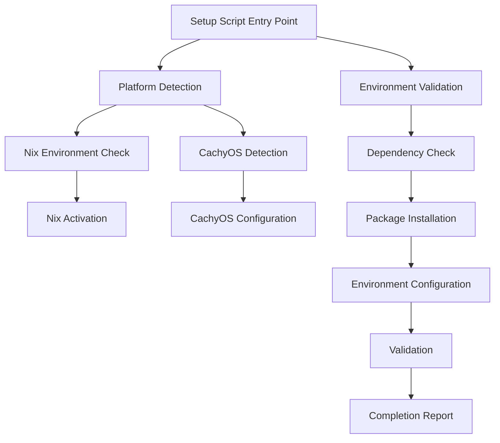
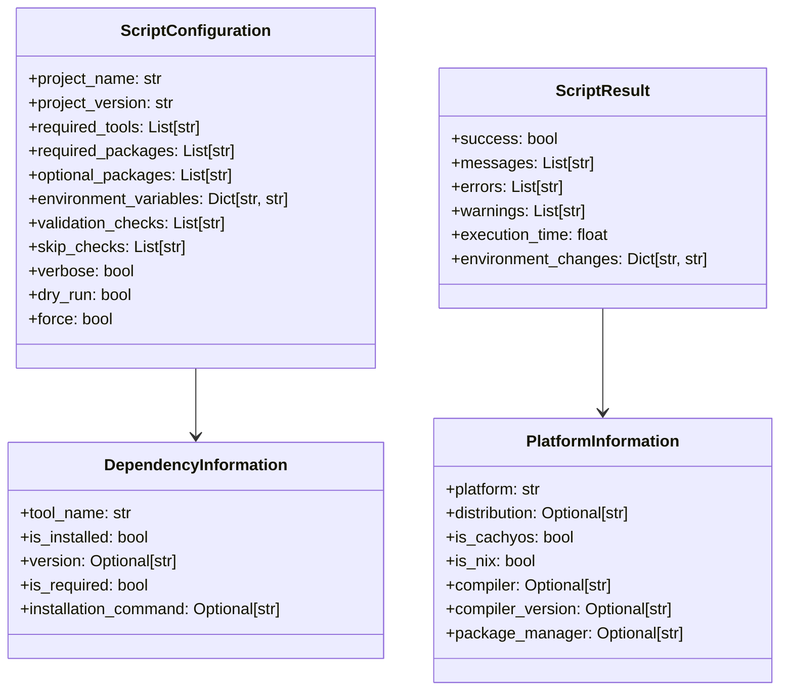

# DESIGN-044: Setup Script Architecture

## Overview

Defines the architecture and interfaces for setup scripts that handle Linux environment configuration, Nix environment activation, CachyOS optimization setup, and development environment validation.

## Purpose and Scope

This design document defines the complete architecture for setup scripts, covering:

- Script interface contracts and execution flow
- Platform detection and validation
- Nix environment setup and activation
- CachyOS-specific configuration
- Package manager integration
- Dependency installation and validation
- Environment variable configuration
- Error handling and reporting
- Script validation interfaces

## Script Architecture

### High-Level Architecture



## Script Interfaces

### ISetupScript

```python
from abc import ABC, abstractmethod
from typing import Dict, List, Optional, Tuple

class ISetupScript(ABC):
    """Interface for setup scripts."""

    @abstractmethod
    def execute(self) -> Tuple[bool, List[str]]:
        """Execute the setup script.

        Returns:
            Tuple[bool, List[str]]: (success, list of messages).

        Raises:
            SetupScriptError: If execution fails catastrophically.
        """
        pass

    @abstractmethod
    def validate_prerequisites(self) -> Tuple[bool, List[str]]:
        """Validate script prerequisites.

        Returns:
            Tuple[bool, List[str]]: (is_valid, list of errors).

        Raises:
            SetupScriptError: If validation fails catastrophically.
        """
        pass

    @abstractmethod
    def get_description(self) -> str:
        """Get script description.

        Returns:
            str: Script description.
        """
        pass

    @abstractmethod
    def get_version(self) -> str:
        """Get script version.

        Returns:
            str: Script version.
        """
        pass
```

### IPlatformDetector

```python
class IPlatformDetector(ABC):
    """Interface for platform detection in setup scripts."""

    @abstractmethod
    def detect_platform(self) -> str:
        """Detect the current platform.

        Returns:
            str: Platform name (windows, linux, darwin).

        Raises:
            PlatformDetectionError: If detection fails.
        """
        pass

    @abstractmethod
    def detect_linux_distribution(self) -> Optional[str]:
        """Detect Linux distribution.

        Returns:
            Optional[str]: Distribution name (cachyos, arch, ubuntu, etc.), or None.

        Raises:
            PlatformDetectionError: If detection fails.
        """
        pass

    @abstractmethod
    def is_cachyos(self) -> bool:
        """Check if running on CachyOS.

        Returns:
            bool: True if CachyOS detected.
        """
        pass

    @abstractmethod
    def is_nix_environment(self) -> bool:
        """Check if running in Nix environment.

        Returns:
            bool: True if Nix environment detected.
        """
        pass
```

### IEnvironmentValidator

```python
class IEnvironmentValidator(ABC):
    """Interface for environment validation."""

    @abstractmethod
    def validate_environment(self) -> Tuple[bool, List[str]]:
        """Validate the build environment.

        Returns:
            Tuple[bool, List[str]]: (is_valid, list of errors).

        Raises:
            EnvironmentValidationError: If validation fails catastrophically.
        """
        pass

    @abstractmethod
    def validate_compiler(self, compiler: str) -> Tuple[bool, Optional[str]]:
        """Validate compiler availability.

        Args:
            compiler: Compiler name (gcc, clang).

        Returns:
            Tuple[bool, Optional[str]]: (is_available, version).

        Raises:
            CompilerValidationError: If validation fails catastrophically.
        """
        pass

    @abstractmethod
    def validate_tool(self, tool: str) -> bool:
        """Validate tool availability.

        Args:
            tool: Tool name (cmake, ninja, etc.).

        Returns:
            bool: True if tool is available.
        """
        pass
```

### IPackageInstaller

```python
class IPackageInstaller(ABC):
    """Interface for package installation."""

    @abstractmethod
    def install_package(self, package_name: str) -> bool:
        """Install a package.

        Args:
            package_name: Name of the package to install.

        Returns:
            bool: True if installation successful.

        Raises:
            PackageInstallationError: If installation fails catastrophically.
        """
        pass

    @abstractmethod
    def install_packages(self, package_names: List[str]) -> Tuple[bool, List[str]]:
        """Install multiple packages.

        Args:
            package_names: List of package names to install.

        Returns:
            Tuple[bool, List[str]]: (success, list of failed packages).

        Raises:
            PackageInstallationError: If installation fails catastrophically.
        """
        pass

    @abstractmethod
    def check_package(self, package_name: str) -> bool:
        """Check if a package is installed.

        Args:
            package_name: Name of the package to check.

        Returns:
            bool: True if package is installed.
        """
        pass
```

### IEnvironmentConfigurer

```python
class IEnvironmentConfigurer(ABC):
    """Interface for environment configuration."""

    @abstractmethod
    def configure_environment(self) -> bool:
        """Configure the environment variables.

        Returns:
            bool: True if configuration successful.

        Raises:
            EnvironmentConfigurationError: If configuration fails catastrophically.
        """
        pass

    @abstractmethod
    def set_environment_variable(
        self,
        name: str,
        value: str
    ) -> bool:
        """Set an environment variable.

        Args:
            name: Variable name.
            value: Variable value.

        Returns:
            bool: True if variable set successfully.
        """
        pass

    @abstractmethod
    def get_environment_variable(self, name: str) -> Optional[str]:
        """Get an environment variable.

        Args:
            name: Variable name.

        Returns:
            Optional[str]: Variable value, or None if not set.
        """
        pass
```

### IScriptReporter

```python
class IScriptReporter(ABC):
    """Interface for script reporting."""

    @abstractmethod
    def report_success(self, message: str) -> None:
        """Report a success message.

        Args:
            message: Success message to report.
        """
        pass

    @abstractmethod
    def report_warning(self, message: str) -> None:
        """Report a warning message.

        Args:
            message: Warning message to report.
        """
        pass

    @abstractmethod
    def report_error(self, message: str) -> None:
        """Report an error message.

        Args:
            message: Error message to report.
        """
        pass

    @abstractmethod
    def report_info(self, message: str) -> None:
        """Report an informational message.

        Args:
            message: Info message to report.
        """
        pass

    @abstractmethod
    def report_progress(self, message: str) -> None:
        """Report progress.

        Args:
            message: Progress message to report.
        """
        pass
```

## Data Structures

### Script Configuration

```python
from dataclasses import dataclass, field
from typing import List, Dict, Optional, Any

@dataclass
class ScriptConfiguration:
    """Configuration for setup scripts."""
    project_name: str
    project_version: str
    required_tools: List[str] = field(default_factory=list)
    required_packages: List[str] = field(default_factory=list)
    optional_packages: List[str] = field(default_factory=list)
    environment_variables: Dict[str, str] = field(default_factory=dict)
    validation_checks: List[str] = field(default_factory=list)
    skip_checks: List[str] = field(default_factory=list)
    verbose: bool = False
    dry_run: bool = False
    force: bool = False
```

### Script Result

```python
@dataclass
class ScriptResult:
    """Result of script execution."""
    success: bool
    messages: List[str] = field(default_factory=list)
    errors: List[str] = field(default_factory=list)
    warnings: List[str] = field(default_factory=list)
    execution_time: float = 0.0
    environment_changes: Dict[str, str] = field(default_factory=dict)
```

### Platform Information

```python
@dataclass
class PlatformInformation:
    """Information about the current platform."""
    platform: str  # windows, linux, darwin
    distribution: Optional[str] = None  # cachyos, arch, ubuntu, etc.
    is_cachyos: bool = False
    is_nix: bool = False
    compiler: Optional[str] = None  # gcc, clang
    compiler_version: Optional[str] = None
    package_manager: Optional[str] = None  # pacman, apt, dnf
```

### Dependency Information

```python
@dataclass
class DependencyInformation:
    """Information about dependencies."""
    tool_name: str
    is_installed: bool = False
    version: Optional[str] = None
    is_required: bool = True
    installation_command: Optional[str] = None
```

## Class Definitions

### SetupScriptBase

```python
import os
import sys
import time
from typing import List, Tuple

class SetupScriptBase(ISetupScript):
    """Base class for setup scripts."""

    def __init__(
        self,
        config: ScriptConfiguration,
        reporter: IScriptReporter
    ) -> None:
        """Initialize the setup script.

        Args:
            config: Script configuration.
            reporter: Script reporter instance.
        """
        self._config = config
        self._reporter = reporter
        self._platform_detector: Optional[IPlatformDetector] = None
        self._environment_validator: Optional[IEnvironmentValidator] = None
        self._package_installer: Optional[IPackageInstaller] = None
        self._environment_configurer: Optional[IEnvironmentConfigurer] = None

    def execute(self) -> Tuple[bool, List[str]]:
        """Execute the setup script."""
        start_time = time.time()
        messages = []

        try:
            # Report start
            self._reporter.report_info(
                f"Starting setup for {self._config.project_name} v{self._config.project_version}"
            )

            # Validate prerequisites
            self._reporter.report_progress("Validating prerequisites...")
            is_valid, errors = self.validate_prerequisites()
            if not is_valid:
                for error in errors:
                    self._reporter.report_error(error)
                return (False, messages + errors)

            # Detect platform
            self._reporter.report_progress("Detecting platform...")
            platform_info = self._detect_platform()
            messages.append(f"Detected platform: {platform_info.platform}")

            # Validate environment
            self._reporter.report_progress("Validating environment...")
            is_valid, errors = self._validate_environment()
            if not is_valid:
                for error in errors:
                    self._reporter.report_error(error)
                return (False, messages + errors)

            # Install dependencies
            self._reporter.report_progress("Installing dependencies...")
            success, failed = self._install_dependencies()
            if not success:
                for package in failed:
                    self._reporter.report_error(f"Failed to install: {package}")
                return (False, messages + failed)

            # Configure environment
            self._reporter.report_progress("Configuring environment...")
            if not self._configure_environment():
                return (False, messages + ["Environment configuration failed"])

            # Validate final state
            self._reporter.report_progress("Validating final state...")
            is_valid, errors = self._validate_final_state()
            if not is_valid:
                for error in errors:
                    self._reporter.report_error(error)
                return (False, messages + errors)

            # Success
            execution_time = time.time() - start_time
            self._reporter.report_success(
                f"Setup completed successfully in {execution_time:.2f} seconds"
            )
            return (True, messages)

        except Exception as e:
            execution_time = time.time() - start_time
            error_message = f"Setup failed: {str(e)}"
            self._reporter.report_error(error_message)
            return (False, messages + [error_message])

    def validate_prerequisites(self) -> Tuple[bool, List[str]]:
        """Validate script prerequisites."""
        errors = []

        # Check Python version
        if sys.version_info < (3, 8):
            errors.append("Python 3.8 or higher required")

        # Check if running as root (for Linux)
        if os.name == 'posix' and os.geteuid() == 0:
            self._reporter.report_warning("Running as root")

        # Check for required tools
        for tool in self._config.required_tools:
            if not shutil.which(tool):
                errors.append(f"Required tool not found: {tool}")

        return (len(errors) == 0, errors)

    def get_description(self) -> str:
        """Get script description."""
        return f"Setup script for {self._config.project_name}"

    def get_version(self) -> str:
        """Get script version."""
        return self._config.project_version

    def _detect_platform(self) -> PlatformInformation:
        """Detect the current platform."""
        if not self._platform_detector:
            raise SetupScriptError("Platform detector not initialized")

        platform = self._platform_detector.detect_platform()
        distribution = self._platform_detector.detect_linux_distribution()
        is_cachyos = self._platform_detector.is_cachyos()
        is_nix = self._platform_detector.is_nix_environment()

        return PlatformInformation(
            platform=platform,
            distribution=distribution,
            is_cachyos=is_cachyos,
            is_nix=is_nix
        )

    def _validate_environment(self) -> Tuple[bool, List[str]]:
        """Validate the build environment."""
        if not self._environment_validator:
            raise SetupScriptError("Environment validator not initialized")

        return self._environment_validator.validate_environment()

    def _install_dependencies(self) -> Tuple[bool, List[str]]:
        """Install dependencies."""
        if not self._package_installer:
            raise SetupScriptError("Package installer not initialized")

        return self._package_installer.install_packages(
            self._config.required_packages
        )

    def _configure_environment(self) -> bool:
        """Configure the environment."""
        if not self._environment_configurer:
            raise SetupScriptError("Environment configurer not initialized")

        # Set environment variables
        for name, value in self._config.environment_variables.items():
            if not self._environment_configurer.set_environment_variable(name, value):
                self._reporter.report_warning(f"Failed to set {name}={value}")

        return True

    def _validate_final_state(self) -> Tuple[bool, List[str]]:
        """Validate the final state."""
        errors = []

        # Validate required tools
        for tool in self._config.required_tools:
            if not shutil.which(tool):
                errors.append(f"Required tool still missing: {tool}")

        # Validate required packages
        for package in self._config.required_packages:
            if not self._package_installer.check_package(package):
                errors.append(f"Required package still missing: {package}")

        return (len(errors) == 0, errors)
```

### LinuxSetupScript

```python
import shutil
from typing import Optional

class LinuxSetupScript(SetupScriptBase):
    """Setup script for Linux platforms."""

    def __init__(
        self,
        config: ScriptConfiguration,
        reporter: IScriptReporter
    ) -> None:
        """Initialize the Linux setup script."""
        super().__init__(config, reporter)
        self._platform_detector = LinuxPlatformDetector()
        self._environment_validator = LinuxEnvironmentValidator()
        self._package_installer = LinuxPackageInstaller(reporter)
        self._environment_configurer = LinuxEnvironmentConfigurer(reporter)

    def execute(self) -> Tuple[bool, List[str]]:
        """Execute the Linux setup script."""
        # Detect platform
        platform_info = self._detect_platform()

        # Check for Nix environment
        if platform_info.is_nix:
            self._reporter.report_info("Nix environment detected")
            return self._execute_nix_setup()

        # Check for CachyOS
        if platform_info.is_cachyos:
            self._reporter.report_info("CachyOS detected")
            return self._execute_cachyos_setup()

        # Generic Linux setup
        self._reporter.report_info("Generic Linux setup")
        return super().execute()

    def _execute_nix_setup(self) -> Tuple[bool, List[str]]:
        """Execute Nix-specific setup."""
        messages = []

        # Activate Nix shell
        self._reporter.report_progress("Activating Nix shell...")
        if not self._activate_nix_shell():
            messages.append("Failed to activate Nix shell")
            return (False, messages)

        # Validate Nix environment
        self._reporter.report_progress("Validating Nix environment...")
        is_valid, errors = self._validate_nix_environment()
        if not is_valid:
            messages.extend(errors)
            return (False, messages)

        # Continue with standard setup
        return super().execute()

    def _execute_cachyos_setup(self) -> Tuple[bool, List[str]]:
        """Execute CachyOS-specific setup."""
        messages = []

        # Apply CachyOS optimizations
        self._reporter.report_progress("Applying CachyOS optimizations...")
        if not self._apply_cachyos_optimizations():
            messages.append("Failed to apply CachyOS optimizations")
            return (False, messages)

        # Continue with standard setup
        return super().execute()

    def _activate_nix_shell(self) -> bool:
        """Activate Nix shell."""
        try:
            result = subprocess.run(
                ["nix", "develop"],
                capture_output=True,
                text=True
            )
            return result.returncode == 0
        except (subprocess.SubprocessError, FileNotFoundError):
            return False

    def _validate_nix_environment(self) -> Tuple[bool, List[str]]:
        """Validate Nix environment."""
        errors = []

        # Check for Nix environment variable
        if not os.environ.get('IN_NIX_SHELL'):
            errors.append("Not running in Nix shell")

        # Check for required tools in Nix
        required_tools = ['gcc', 'clang', 'cmake', 'ninja']
        for tool in required_tools:
            if not shutil.which(tool):
                errors.append(f"Required tool not found in Nix: {tool}")

        return (len(errors) == 0, errors)

    def _apply_cachyos_optimizations(self) -> bool:
        """Apply CachyOS-specific optimizations."""
        # Set CachyOS-specific environment variables
        cachyos_vars = {
            'CMAKE_C_FLAGS': '-march=native -O3 -flto',
            'CMAKE_CXX_FLAGS': '-march=native -O3 -flto',
            'QT_QPA_PLATFORM': 'wayland'
        }

        for name, value in cachyos_vars.items():
            if not self._environment_configurer.set_environment_variable(name, value):
                return False

        return True
```

### LinuxPlatformDetector

```python
import os
from pathlib import Path

class LinuxPlatformDetector(IPlatformDetector):
    """Platform detector for Linux systems."""

    def detect_platform(self) -> str:
        """Detect the current platform."""
        return "linux"

    def detect_linux_distribution(self) -> Optional[str]:
        """Detect Linux distribution."""
        os_release_path = Path("/etc/os-release")
        if not os_release_path.exists():
            return None

        content = os_release_path.read_text()

        # Check for CachyOS
        if "ID=cachyos" in content:
            return "cachyos"

        # Check for Arch Linux
        if "ID=arch" in content:
            return "arch"

        # Check for Ubuntu
        if "ID=ubuntu" in content:
            return "ubuntu"

        # Check for Fedora
        if "ID=fedora" in content:
            return "fedora"

        return None

    def is_cachyos(self) -> bool:
        """Check if running on CachyOS."""
        distribution = self.detect_linux_distribution()
        return distribution == "cachyos"

    def is_nix_environment(self) -> bool:
        """Check if running in Nix environment."""
        return os.environ.get('IN_NIX_SHELL') == '1'
```

### LinuxEnvironmentValidator

```python
import shutil
import subprocess
from typing import Tuple, Optional

class LinuxEnvironmentValidator(IEnvironmentValidator):
    """Environment validator for Linux systems."""

    def validate_environment(self) -> Tuple[bool, List[str]]:
        """Validate the build environment."""
        errors = []

        # Check for compiler
        gcc_available, gcc_version = self.validate_compiler("gcc")
        if not gcc_available:
            errors.append("GCC compiler not found")

        clang_available, clang_version = self.validate_compiler("clang")
        if not clang_available:
            errors.append("Clang compiler not found")

        if not gcc_available and not clang_available:
            errors.append("No compiler available (GCC or Clang required)")

        # Check for CMake
        if not self.validate_tool("cmake"):
            errors.append("CMake not found")

        # Check for Ninja
        if not self.validate_tool("ninja"):
            errors.append("Ninja not found")

        # Check for Conan
        if not self.validate_tool("conan"):
            errors.append("Conan not found (package management may be limited)")

        return (len(errors) == 0, errors)

    def validate_compiler(self, compiler: str) -> Tuple[bool, Optional[str]]:
        """Validate compiler availability."""
        compiler_path = shutil.which(compiler)
        if not compiler_path:
            return (False, None)

        try:
            result = subprocess.run(
                [compiler, "--version"],
                capture_output=True,
                text=True
            )
            if result.returncode == 0:
                # Extract version
                lines = result.stdout.splitlines()
                if lines:
                    version_line = lines[0]
                    version = version_line.split()[-1]
                    return (True, version)
        except (subprocess.SubprocessError, FileNotFoundError):
            pass

        return (False, None)

    def validate_tool(self, tool: str) -> bool:
        """Validate tool availability."""
        return shutil.which(tool) is not None
```

### LinuxPackageInstaller

```python
import shutil
import subprocess
from typing import List, Tuple

class LinuxPackageInstaller(IPackageInstaller):
    """Package installer for Linux systems."""

    def __init__(self, reporter: IScriptReporter) -> None:
        """Initialize the package installer."""
        self._reporter = reporter
        self._package_manager = self._detect_package_manager()

    def install_package(self, package_name: str) -> bool:
        """Install a package."""
        if not self._package_manager:
            self._reporter.report_error("No package manager detected")
            return False

        command = self._build_install_command(package_name)

        try:
            result = subprocess.run(
                command,
                capture_output=True,
                text=True
            )
            if result.returncode == 0:
                self._reporter.report_success(f"Installed: {package_name}")
                return True
            else:
                self._reporter.report_error(
                    f"Failed to install {package_name}: {result.stderr}"
                )
                return False
        except (subprocess.SubprocessError, FileNotFoundError) as e:
            self._reporter.report_error(f"Installation error: {str(e)}")
            return False

    def install_packages(self, package_names: List[str]) -> Tuple[bool, List[str]]:
        """Install multiple packages."""
        failed = []

        for package_name in package_names:
            if not self.install_package(package_name):
                failed.append(package_name)

        return (len(failed) == 0, failed)

    def check_package(self, package_name: str) -> bool:
        """Check if a package is installed."""
        # Check if package is available via package manager
        if self._package_manager == "pacman":
            result = subprocess.run(
                ["pacman", "-Q", package_name],
                capture_output=True
            )
            return result.returncode == 0
        elif self._package_manager == "apt":
            result = subprocess.run(
                ["dpkg", "-l", package_name],
                capture_output=True
            )
            return result.returncode == 0
        elif self._package_manager == "dnf":
            result = subprocess.run(
                ["rpm", "-q", package_name],
                capture_output=True
            )
            return result.returncode == 0

        return False

    def _detect_package_manager(self) -> Optional[str]:
        """Detect the system package manager."""
        if shutil.which("pacman"):
            return "pacman"
        elif shutil.which("apt-get"):
            return "apt"
        elif shutil.which("dnf"):
            return "dnf"
        elif shutil.which("zypper"):
            return "zypper"

        return None

    def _build_install_command(self, package_name: str) -> List[str]:
        """Build install command for a package."""
        if self._package_manager == "pacman":
            return ["sudo", "pacman", "-S", "--noconfirm", package_name]
        elif self._package_manager == "apt":
            return ["sudo", "apt-get", "install", "-y", package_name]
        elif self._package_manager == "dnf":
            return ["sudo", "dnf", "install", "-y", package_name]
        elif self._package_manager == "zypper":
            return ["sudo", "zypper", "install", "-y", package_name]

        return []
```

### LinuxEnvironmentConfigurer

```python
import os

class LinuxEnvironmentConfigurer(IEnvironmentConfigurer):
    """Environment configurer for Linux systems."""

    def __init__(self, reporter: IScriptReporter) -> None:
        """Initialize the environment configurer."""
        self._reporter = reporter

    def configure_environment(self) -> bool:
        """Configure the environment variables."""
        # Set common environment variables
        common_vars = {
            'CMAKE_GENERATOR': 'Ninja',
            'CMAKE_CXX_STANDARD': '23',
            'CMAKE_CXX_STANDARD_REQUIRED': 'ON',
            'CMAKE_EXPORT_COMPILE_COMMANDS': 'ON'
        }

        for name, value in common_vars.items():
            if not self.set_environment_variable(name, value):
                self._reporter.report_warning(f"Failed to set {name}={value}")

        return True

    def set_environment_variable(
        self,
        name: str,
        value: str
    ) -> bool:
        """Set an environment variable."""
        try:
            os.environ[name] = value
            self._reporter.report_info(f"Set {name}={value}")
            return True
        except Exception as e:
            self._reporter.report_error(f"Failed to set {name}: {str(e)}")
            return False

    def get_environment_variable(self, name: str) -> Optional[str]:
        """Get an environment variable."""
        return os.environ.get(name)
```

### ConsoleScriptReporter

```python
from typing import List

class ConsoleScriptReporter(IScriptReporter):
    """Console-based script reporter."""

    def __init__(self, verbose: bool = False) -> None:
        """Initialize the console reporter.

        Args:
            verbose: Whether to print verbose output.
        """
        self._verbose = verbose
        self._messages: List[str] = []

    def report_success(self, message: str) -> None:
        """Report a success message."""
        formatted = f"✓ {message}"
        print(formatted)
        self._messages.append(formatted)

    def report_warning(self, message: str) -> None:
        """Report a warning message."""
        formatted = f"⚠ {message}"
        print(formatted)
        self._messages.append(formatted)

    def report_error(self, message: str) -> None:
        """Report an error message."""
        formatted = f"✗ {message}"
        print(formatted)
        self._messages.append(formatted)

    def report_info(self, message: str) -> None:
        """Report an informational message."""
        formatted = f"ℹ {message}"
        print(formatted)
        self._messages.append(formatted)

    def report_progress(self, message: str) -> None:
        """Report progress."""
        formatted = f"→ {message}"
        print(formatted)
        self._messages.append(formatted)

    def get_messages(self) -> List[str]:
        """Get all reported messages."""
        return self._messages.copy()
```

## Relationships

### Class Hierarchy

```mermaid
classDiagram
    class ISetupScript {
        <<interface>>
        +execute() Tuple[bool, List[str]]
        +validate_prerequisites() Tuple[bool, List[str]]
        +get_description() str
        +get_version() str
    }

    class IPlatformDetector {
        <<interface>>
        +detect_platform() str
        +detect_linux_distribution() Optional[str]
        +is_cachyos() bool
        +is_nix_environment() bool
    }

    class IEnvironmentValidator {
        <<interface>>
        +validate_environment() Tuple[bool, List[str]]
        +validate_compiler(compiler: str) Tuple[bool, Optional[str]]
        +validate_tool(tool: str) bool
    }

    class IPackageInstaller {
        <<interface>>
        +install_package(package_name: str) bool
        +install_packages(package_names: List[str]) Tuple[bool, List[str]]
        +check_package(package_name: str) bool
    }

    class IEnvironmentConfigurer {
        <<interface>>
        +configure_environment() bool
        +set_environment_variable(name: str, value: str) bool
        +get_environment_variable(name: str) Optional[str]
    }

    class IScriptReporter {
        <<interface>>
        +report_success(message: str) None
        +report_warning(message: str) None
        +report_error(message: str) None
        +report_info(message: str) None
        +report_progress(message: str) None
    }

    class SetupScriptBase {
        -_config: ScriptConfiguration
        -_reporter: IScriptReporter
        -_platform_detector: Optional[IPlatformDetector]
        -_environment_validator: Optional[IEnvironmentValidator]
        -_package_installer: Optional[IPackageInstaller]
        -_environment_configurer: Optional[IEnvironmentConfigurer]
        +execute() Tuple[bool, List[str]]
        +validate_prerequisites() Tuple[bool, List[str]]
        +get_description() str
        +get_version() str
        -_detect_platform() PlatformInformation
        -_validate_environment() Tuple[bool, List[str]]
        -_install_dependencies() Tuple[bool, List[str]]
        -_configure_environment() bool
        -_validate_final_state() Tuple[bool, List[str]]
    }

    class LinuxSetupScript {
        +execute() Tuple[bool, List[str]]
        -_execute_nix_setup() Tuple[bool, List[str]]
        -_execute_cachyos_setup() Tuple[bool, List[str]]
        -_activate_nix_shell() bool
        -_validate_nix_environment() Tuple[bool, List[str]]
        -_apply_cachyos_optimizations() bool
    }

    class LinuxPlatformDetector {
        +detect_platform() str
        +detect_linux_distribution() Optional[str]
        +is_cachyos() bool
        +is_nix_environment() bool
    }

    class LinuxEnvironmentValidator {
        +validate_environment() Tuple[bool, List[str]]
        +validate_compiler(compiler: str) Tuple[bool, Optional[str]]
        +validate_tool(tool: str) bool
    }

    class LinuxPackageInstaller {
        -_reporter: IScriptReporter
        -_package_manager: Optional[str]
        +install_package(package_name: str) bool
        +install_packages(package_names: List[str]) Tuple[bool, List[str]]
        +check_package(package_name: str) bool
        -_detect_package_manager() Optional[str]
        -_build_install_command(package_name: str) List[str]
    }

    class LinuxEnvironmentConfigurer {
        -_reporter: IScriptReporter
        +configure_environment() bool
        +set_environment_variable(name: str, value: str) bool
        +get_environment_variable(name: str) Optional[str]
    }

    class ConsoleScriptReporter {
        -_verbose: bool
        -_messages: List[str]
        +report_success(message: str) None
        +report_warning(message: str) None
        +report_error(message: str) None
        +report_info(message: str) None
        +report_progress(message: str) None
        +get_messages() List[str]
    }

    SetupScriptBase ..|> ISetupScript
    LinuxSetupScript --|> SetupScriptBase
    LinuxPlatformDetector ..|> IPlatformDetector
    LinuxEnvironmentValidator ..|> IEnvironmentValidator
    LinuxPackageInstaller ..|> IPackageInstaller
    LinuxEnvironmentConfigurer ..|> IEnvironmentConfigurer
    ConsoleScriptReporter ..|> IScriptReporter
    LinuxSetupScript --> LinuxPlatformDetector
    LinuxSetupScript --> LinuxEnvironmentValidator
    LinuxSetupScript --> LinuxPackageInstaller
    LinuxSetupScript --> LinuxEnvironmentConfigurer
    LinuxSetupScript --> ConsoleScriptReporter
    LinuxPackageInstaller --> ConsoleScriptReporter
    LinuxEnvironmentConfigurer --> ConsoleScriptReporter
```



### Data Structure Relationships



## Exception Hierarchy

```python
class SetupScriptError(Exception):
    """Base exception for setup script errors."""

    def __init__(
        self,
        message: str,
        details: Optional[Dict[str, Any]] = None
    ) -> None:
        """Initialize exception.

        Args:
            message: Error message.
            details: Optional additional details.
        """
        self.message = message
        self.details = details or {}
        super().__init__(message)

class PlatformDetectionError(SetupScriptError):
    """Exception raised when platform detection fails."""
    pass

class EnvironmentValidationError(SetupScriptError):
    """Exception raised when environment validation fails."""
    pass

class PackageInstallationError(SetupScriptError):
    """Exception raised when package installation fails."""
    pass

class EnvironmentConfigurationError(SetupScriptError):
    """Exception raised when environment configuration fails."""
    pass

class CompilerValidationError(SetupScriptError):
    """Exception raised when compiler validation fails."""
    pass
```

## Pseudocode Examples

### Example 1: Execute Linux Setup

```python
# Create configuration
config = ScriptConfiguration(
    project_name="OmniCpp-template",
    project_version="1.0.0",
    required_tools=["gcc", "clang", "cmake", "ninja"],
    required_packages=["conan"],
    environment_variables={
        "CMAKE_GENERATOR": "Ninja",
        "CMAKE_CXX_STANDARD": "23"
    },
    verbose=True
)

# Create reporter
reporter = ConsoleScriptReporter(verbose=True)

# Create and execute script
script = LinuxSetupScript(config, reporter)
success, messages = script.execute()

if success:
    print("Setup completed successfully!")
else:
    print("Setup failed:")
    for message in messages:
        print(f"  - {message}")
```

### Example 2: Validate Environment

```python
# Create validator
validator = LinuxEnvironmentValidator()

# Validate environment
is_valid, errors = validator.validate_environment()

if is_valid:
    print("Environment is valid!")
else:
    print("Environment validation failed:")
    for error in errors:
        print(f"  - {error}")
```

### Example 3: Install Packages

```python
# Create reporter
reporter = ConsoleScriptReporter(verbose=True)

# Create installer
installer = LinuxPackageInstaller(reporter)

# Install packages
success, failed = installer.install_packages([
    "cmake",
    "ninja",
    "conan"
])

if success:
    print("All packages installed successfully!")
else:
    print(f"Failed to install: {', '.join(failed)}")
```

## Related Requirements

- REQ-009: Platform Detection
- REQ-010: Compiler Detection
- REQ-016: Conan Integration
- REQ-019: Priority-Based Package Manager Selection
- REQ-022: CMake 4 Configuration
- REQ-023: Ninja Generator Default

## Related ADRs

- ADR-027: Nix Package Manager Integration
- ADR-028: CachyOS as Primary Linux Target
- ADR-029: Direnv for Environment Management
- ADR-030: Enhanced OmniCppController.py Architecture

## Implementation Notes

### Script Execution Flow

1. Validate prerequisites
2. Detect platform
3. Validate environment
4. Install dependencies
5. Configure environment
6. Validate final state
7. Report completion

### Error Handling

- All methods should raise appropriate exceptions
- Use custom exception hierarchy
- Log errors before raising
- Provide meaningful error messages
- Continue execution on non-critical errors

### Dry Run Mode

- Skip actual installations
- Validate configuration only
- Report what would be done
- Useful for testing

### Force Mode

- Skip validation checks
- Force installation
- Override existing configurations
- Useful for recovery

### Verbose Mode

- Print detailed progress
- Show all environment changes
- Display package installation details
- Useful for debugging

### Security Considerations

- Validate package sources
- Check package integrity
- Use secure installation methods
- Validate environment changes

### Performance Considerations

- Parallel package installation
- Cache package information
- Minimize filesystem operations
- Use efficient validation methods

## Testing Considerations

- Test script execution on all platforms
- Test with different Linux distributions
- Test Nix environment setup
- Test CachyOS configuration
- Test error handling
- Test dry run mode
- Test force mode
- Test verbose mode
- Test with missing dependencies
- Test with invalid configurations

---

## Document Control

| Version | Date | Author | Changes |
|---------|------|---------|---------|
| 1.0 | 2026-01-27 | System Architect | Initial version |
