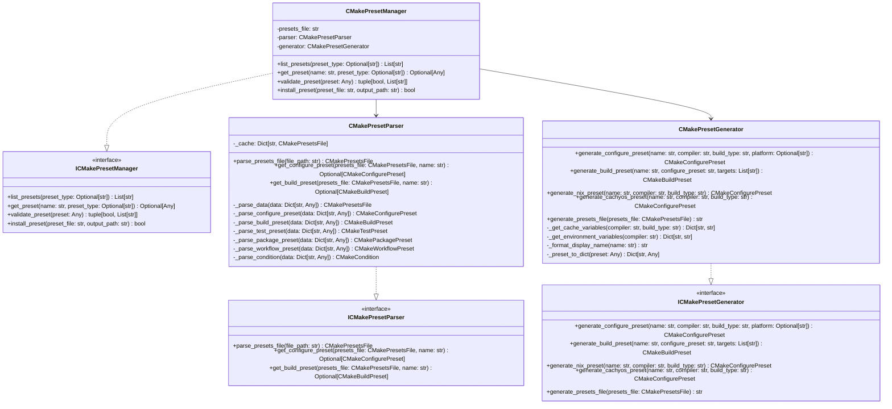
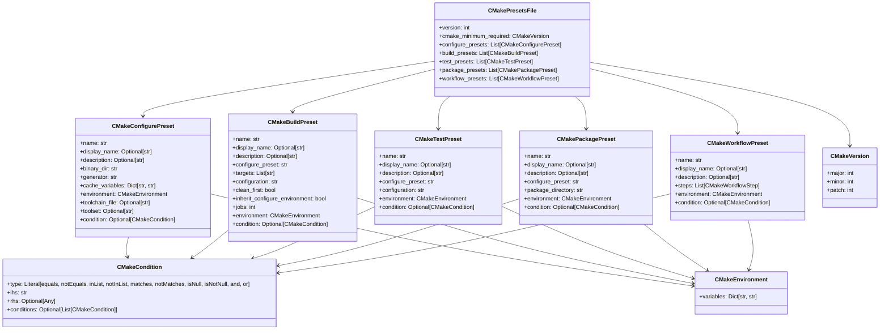

# DESIGN-045: CMake Preset Schema

## Overview

Defines the schema and structure for CMake preset files, including Nix-aware presets, CachyOS presets, and platform detection enhancement schemas.

## Purpose and Scope

This design document defines the complete schema for CMake preset files, covering:

- Nix-aware preset schema with environment detection
- CachyOS preset schema with performance optimizations
- Platform detection enhancement schema
- Multi-compiler support (GCC, Clang, MSVC)
- Build type variants (Debug, Release, RelWithDebInfo, MinSizeRel)
- Cross-compilation support
- Conan integration presets
- Toolchain integration

## CMake Preset File Structure

### Top-Level Structure

```json
{
  "version": 3,
  "cmakeMinimumRequired": {
    "major": 4,
    "minor": 0,
    "patch": 0
  },
  "configurePresets": [
    // Configure preset definitions
  ],
  "buildPresets": [
    // Build preset definitions
  ],
  "testPresets": [
    // Test preset definitions
  ],
  "packagePresets": [
    // Package preset definitions
  ],
  "workflowPresets": [
    // Workflow preset definitions
  ]
}
```

## Configure Preset Schema

### Generic Configure Preset

```json
{
  "name": "preset-name",
  "displayName": "Preset Display Name",
  "description": "Preset description",
  "binaryDir": "${sourceDir}/build/${presetName}",
  "generator": "Ninja",
  "cacheVariables": {
    "CMAKE_BUILD_TYPE": "Debug",
    "CMAKE_CXX_STANDARD": "23",
    "CMAKE_CXX_STANDARD_REQUIRED": "ON"
  },
  "environment": {
    "VAR": "value"
  },
  "toolchainFile": "${sourceDir}/cmake/toolchains/toolchain.cmake",
  "toolset": "toolset-name",
  "condition": {
    "type": "equals",
    "lhs": "${hostSystemName}",
    "rhs": "Linux"
  }
}
```

### Nix-Aware Configure Preset

```json
{
  "name": "nix-gcc-debug",
  "displayName": "Nix GCC Debug",
  "description": "Nix environment with GCC compiler in Debug mode",
  "binaryDir": "${sourceDir}/build/nix-gcc-debug",
  "generator": "Ninja",
  "cacheVariables": {
    "CMAKE_BUILD_TYPE": "Debug",
    "CMAKE_CXX_STANDARD": "23",
    "CMAKE_CXX_STANDARD_REQUIRED": "ON",
    "CMAKE_EXPORT_COMPILE_COMMANDS": "ON"
  },
  "environment": {
    "IN_NIX_SHELL": "1",
    "CC": "gcc",
    "CXX": "g++"
  },
  "condition": {
    "type": "equals",
    "lhs": "$penv{IN_NIX_SHELL}",
    "rhs": "1"
  }
}
```

### CachyOS Configure Preset

```json
{
  "name": "cachyos-gcc-debug",
  "displayName": "CachyOS GCC Debug",
  "description": "CachyOS with GCC compiler and performance optimizations in Debug mode",
  "binaryDir": "${sourceDir}/build/cachyos-gcc-debug",
  "generator": "Ninja",
  "cacheVariables": {
    "CMAKE_BUILD_TYPE": "Debug",
    "CMAKE_CXX_STANDARD": "23",
    "CMAKE_CXX_STANDARD_REQUIRED": "ON",
    "CMAKE_C_FLAGS": "-march=native -g -O0",
    "CMAKE_CXX_FLAGS": "-march=native -g -O0",
    "CMAKE_EXE_LINKER_FLAGS": "-Wl,--as-needed -Wl,--no-undefined",
    "CMAKE_EXPORT_COMPILE_COMMANDS": "ON"
  },
  "environment": {
    "QT_QPA_PLATFORM": "wayland"
  },
  "condition": {
    "type": "equals",
    "lhs": "${hostSystemName}",
    "rhs": "Linux"
  }
}
```

### Linux GCC Configure Preset

```json
{
  "name": "linux-gcc-debug",
  "displayName": "Linux GCC Debug",
  "description": "Linux with GCC compiler in Debug mode",
  "binaryDir": "${sourceDir}/build/linux-gcc-debug",
  "generator": "Ninja",
  "cacheVariables": {
    "CMAKE_BUILD_TYPE": "Debug",
    "CMAKE_CXX_STANDARD": "23",
    "CMAKE_CXX_STANDARD_REQUIRED": "ON",
    "CMAKE_C_FLAGS": "-march=x86-64-v3 -g -O0",
    "CMAKE_CXX_FLAGS": "-march=x86-64-v3 -g -O0",
    "CMAKE_EXPORT_COMPILE_COMMANDS": "ON"
  },
  "environment": {
    "CC": "gcc",
    "CXX": "g++"
  }
}
```

### Linux Clang Configure Preset

```json
{
  "name": "linux-clang-debug",
  "displayName": "Linux Clang Debug",
  "description": "Linux with Clang compiler in Debug mode",
  "binaryDir": "${sourceDir}/build/linux-clang-debug",
  "generator": "Ninja",
  "cacheVariables": {
    "CMAKE_BUILD_TYPE": "Debug",
    "CMAKE_CXX_STANDARD": "23",
    "CMAKE_CXX_STANDARD_REQUIRED": "ON",
    "CMAKE_C_FLAGS": "-march=x86-64-v3 -g -O0",
    "CMAKE_CXX_FLAGS": "-march=x86-64-v3 -g -O0",
    "CMAKE_EXPORT_COMPILE_COMMANDS": "ON"
  },
  "environment": {
    "CC": "clang",
    "CXX": "clang++"
  }
}
```

## Build Preset Schema

### Generic Build Preset

```json
{
  "name": "preset-name-build",
  "displayName": "Preset Display Name",
  "description": "Preset description",
  "configurePreset": "configure-preset-name",
  "targets": ["target1", "target2"],
  "configuration": "Debug",
  "cleanFirst": false,
  "inheritConfigureEnvironment": true,
  "jobs": 4,
  "environment": {
    "VAR": "value"
  },
  "condition": {
    "type": "equals",
    "lhs": "${hostSystemName}",
    "rhs": "Linux"
  }
}
```

### Nix Build Preset

```json
{
  "name": "nix-gcc-debug-build",
  "displayName": "Nix GCC Debug Build",
  "description": "Build in Nix environment with GCC Debug configuration",
  "configurePreset": "nix-gcc-debug",
  "targets": ["engine", "game", "tests"],
  "configuration": "Debug",
  "cleanFirst": false,
  "inheritConfigureEnvironment": true,
  "jobs": 4,
  "environment": {
    "IN_NIX_SHELL": "1"
  },
  "condition": {
    "type": "equals",
    "lhs": "$penv{IN_NIX_SHELL}",
    "rhs": "1"
  }
}
```

### CachyOS Build Preset

```json
{
  "name": "cachyos-gcc-debug-build",
  "displayName": "CachyOS GCC Debug Build",
  "description": "Build on CachyOS with GCC Debug configuration and optimizations",
  "configurePreset": "cachyos-gcc-debug",
  "targets": ["engine", "game", "tests"],
  "configuration": "Debug",
  "cleanFirst": false,
  "inheritConfigureEnvironment": true,
  "jobs": 4,
  "environment": {
    "QT_QPA_PLATFORM": "wayland"
  }
}
```

## Test Preset Schema

### Generic Test Preset

```json
{
  "name": "preset-name-test",
  "displayName": "Preset Display Name",
  "description": "Preset description",
  "configurePreset": "configure-preset-name",
  "configuration": "Debug",
  "environment": {
    "VAR": "value"
  },
  "condition": {
    "type": "equals",
    "lhs": "${hostSystemName}",
    "rhs": "Linux"
  }
}
```

### Nix Test Preset

```json
{
  "name": "nix-gcc-debug-test",
  "displayName": "Nix GCC Debug Test",
  "description": "Run tests in Nix environment with GCC Debug configuration",
  "configurePreset": "nix-gcc-debug",
  "configuration": "Debug",
  "environment": {
    "IN_NIX_SHELL": "1"
  },
  "condition": {
    "type": "equals",
    "lhs": "$penv{IN_NIX_SHELL}",
    "rhs": "1"
  }
}
```

### CachyOS Test Preset

```json
{
  "name": "cachyos-gcc-debug-test",
  "displayName": "CachyOS GCC Debug Test",
  "description": "Run tests on CachyOS with GCC Debug configuration",
  "configurePreset": "cachyos-gcc-debug",
  "configuration": "Debug",
  "environment": {
    "QT_QPA_PLATFORM": "wayland"
  }
}
```

## Package Preset Schema

### Generic Package Preset

```json
{
  "name": "preset-name-package",
  "displayName": "Preset Display Name",
  "description": "Preset description",
  "configurePreset": "configure-preset-name",
  "packageDirectory": "${sourceDir}/packages",
  "environment": {
    "VAR": "value"
  },
  "condition": {
    "type": "equals",
    "lhs": "${hostSystemName}",
    "rhs": "Linux"
  }
}
```

### Nix Package Preset

```json
{
  "name": "nix-gcc-release-package",
  "displayName": "Nix GCC Release Package",
  "description": "Create package in Nix environment with GCC Release configuration",
  "configurePreset": "nix-gcc-release",
  "packageDirectory": "${sourceDir}/packages/nix-gcc-release",
  "environment": {
    "IN_NIX_SHELL": "1"
  },
  "condition": {
    "type": "equals",
    "lhs": "$penv{IN_NIX_SHELL}",
    "rhs": "1"
  }
}
```

### CachyOS Package Preset

```json
{
  "name": "cachyos-gcc-release-package",
  "displayName": "CachyOS GCC Release Package",
  "description": "Create package on CachyOS with GCC Release configuration",
  "configurePreset": "cachyos-gcc-release",
  "packageDirectory": "${sourceDir}/packages/cachyos-gcc-release",
  "environment": {
    "QT_QPA_PLATFORM": "wayland"
  }
}
```

## Workflow Preset Schema

### Generic Workflow Preset

```json
{
  "name": "preset-name-workflow",
  "displayName": "Preset Display Name",
  "description": "Preset description",
  "steps": [
    {
      "type": "configure",
      "name": "configure-preset-name"
    },
    {
      "type": "build",
      "name": "build-preset-name"
    },
    {
      "type": "test",
      "name": "test-preset-name"
    }
  ],
  "environment": {
    "VAR": "value"
  },
  "condition": {
    "type": "equals",
    "lhs": "${hostSystemName}",
    "rhs": "Linux"
  }
}
```

### Nix Workflow Preset

```json
{
  "name": "nix-gcc-debug-workflow",
  "displayName": "Nix GCC Debug Workflow",
  "description": "Configure, build, and test in Nix environment with GCC Debug",
  "steps": [
    {
      "type": "configure",
      "name": "nix-gcc-debug"
    },
    {
      "type": "build",
      "name": "nix-gcc-debug-build"
    },
    {
      "type": "test",
      "name": "nix-gcc-debug-test"
    }
  ],
  "environment": {
    "IN_NIX_SHELL": "1"
  },
  "condition": {
    "type": "equals",
    "lhs": "$penv{IN_NIX_SHELL}",
    "rhs": "1"
  }
}
```

### CachyOS Workflow Preset

```json
{
  "name": "cachyos-gcc-debug-workflow",
  "displayName": "CachyOS GCC Debug Workflow",
  "description": "Configure, build, and test on CachyOS with GCC Debug",
  "steps": [
    {
      "type": "configure",
      "name": "cachyos-gcc-debug"
    },
    {
      "type": "build",
      "name": "cachyos-gcc-debug-build"
    },
    {
      "type": "test",
      "name": "cachyos-gcc-debug-test"
    }
  ],
  "environment": {
    "QT_QPA_PLATFORM": "wayland"
  }
}
```

## Platform Detection Enhancement Schema

### Condition Types

```json
{
  "condition": {
    "type": "equals",
    "lhs": "${hostSystemName}",
    "rhs": "Linux"
  }
}
```

### Condition Type: equals

```json
{
  "type": "equals",
  "lhs": "${hostSystemName}",
  "rhs": "Linux"
}
```

### Condition Type: notEquals

```json
{
  "type": "notEquals",
  "lhs": "${hostSystemName}",
  "rhs": "Windows"
}
```

### Condition Type: inList

```json
{
  "type": "inList",
  "lhs": "${hostSystemName}",
  "rhs": ["Linux", "Darwin"]
}
```

### Condition Type: notInList

```json
{
  "type": "notInList",
  "lhs": "${hostSystemName}",
  "rhs": ["Windows", "Darwin"]
}
```

### Condition Type: matches

```json
{
  "type": "matches",
  "lhs": "${hostSystemName}",
  "rhs": "Linux.*"
}
```

### Condition Type: notMatches

```json
{
  "type": "notMatches",
  "lhs": "${hostSystemName}",
  "rhs": "Windows.*"
}
```

### Condition Type: isNull

```json
{
  "type": "isNull",
  "lhs": "$penv{VARIABLE}"
}
```

### Condition Type: isNotNull

```json
{
  "type": "isNotNull",
  "lhs": "$penv{VARIABLE}"
}
```

### Condition Type: and

```json
{
  "type": "and",
  "conditions": [
    {
      "type": "equals",
      "lhs": "${hostSystemName}",
      "rhs": "Linux"
    },
    {
      "type": "equals",
      "lhs": "$penv{IN_NIX_SHELL}",
      "rhs": "1"
    }
  ]
}
```

### Condition Type: or

```json
{
  "type": "or",
  "conditions": [
    {
      "type": "equals",
      "lhs": "${hostSystemName}",
      "rhs": "Linux"
    },
    {
      "type": "equals",
      "lhs": "${hostSystemName}",
      "rhs": "Darwin"
    }
  ]
}
```

## Python Data Structures

### CMake Preset Data Classes

```python
from dataclasses import dataclass, field
from typing import Dict, List, Optional, Any, Literal

@dataclass
class CMakeVersion:
    """CMake version requirement."""
    major: int
    minor: int
    patch: int

@dataclass
class CMakeCondition:
    """CMake preset condition."""
    type: Literal[
        "equals",
        "notEquals",
        "inList",
        "notInList",
        "matches",
        "notMatches",
        "isNull",
        "isNotNull",
        "and",
        "or"
    ]
    lhs: str
    rhs: Optional[Any] = None
    conditions: Optional[List["CMakeCondition"]] = None

@dataclass
class CMakeEnvironment:
    """CMake preset environment."""
    variables: Dict[str, str] = field(default_factory=dict)

@dataclass
class CMakeConfigurePreset:
    """CMake configure preset."""
    name: str
    display_name: Optional[str] = None
    description: Optional[str] = None
    binary_dir: str = "${sourceDir}/build/${presetName}"
    generator: str = "Ninja"
    cache_variables: Dict[str, str] = field(default_factory=dict)
    environment: CMakeEnvironment = field(default_factory=CMakeEnvironment)
    toolchain_file: Optional[str] = None
    toolset: Optional[str] = None
    condition: Optional[CMakeCondition] = None

@dataclass
class CMakeBuildPreset:
    """CMake build preset."""
    name: str
    display_name: Optional[str] = None
    description: Optional[str] = None
    configure_preset: str
    targets: List[str] = field(default_factory=list)
    configuration: str = "Debug"
    clean_first: bool = False
    inherit_configure_environment: bool = True
    jobs: int = 1
    environment: CMakeEnvironment = field(default_factory=CMakeEnvironment)
    condition: Optional[CMakeCondition] = None

@dataclass
class CMakeTestPreset:
    """CMake test preset."""
    name: str
    display_name: Optional[str] = None
    description: Optional[str] = None
    configure_preset: str
    configuration: str = "Debug"
    environment: CMakeEnvironment = field(default_factory=CMakeEnvironment)
    condition: Optional[CMakeCondition] = None

@dataclass
class CMakePackagePreset:
    """CMake package preset."""
    name: str
    display_name: Optional[str] = None
    description: Optional[str] = None
    configure_preset: str
    package_directory: str = "${sourceDir}/packages"
    environment: CMakeEnvironment = field(default_factory=CMakeEnvironment)
    condition: Optional[CMakeCondition] = None

@dataclass
class CMakeWorkflowStep:
    """CMake workflow step."""
    type: Literal["configure", "build", "test", "package"]
    name: str

@dataclass
class CMakeWorkflowPreset:
    """CMake workflow preset."""
    name: str
    display_name: Optional[str] = None
    description: Optional[str] = None
    steps: List[CMakeWorkflowStep] = field(default_factory=list)
    environment: CMakeEnvironment = field(default_factory=CMakeEnvironment)
    condition: Optional[CMakeCondition] = None

@dataclass
class CMakePresetsFile:
    """Complete CMake presets file."""
    version: int = 3
    cmake_minimum_required: CMakeVersion = field(default_factory=lambda: CMakeVersion(4, 0, 0))
    configure_presets: List[CMakeConfigurePreset] = field(default_factory=list)
    build_presets: List[CMakeBuildPreset] = field(default_factory=list)
    test_presets: List[CMakeTestPreset] = field(default_factory=list)
    package_presets: List[CMakePackagePreset] = field(default_factory=list)
    workflow_presets: List[CMakeWorkflowPreset] = field(default_factory=list)
```

## Interfaces

### ICMakePresetGenerator

```python
from abc import ABC, abstractmethod

class ICMakePresetGenerator(ABC):
    """Interface for generating CMake presets."""

    @abstractmethod
    def generate_configure_preset(
        self,
        name: str,
        compiler: str,
        build_type: str,
        platform: Optional[str] = None
    ) -> CMakeConfigurePreset:
        """Generate a configure preset.

        Args:
            name: Preset name.
            compiler: Compiler name (gcc, clang, msvc).
            build_type: Build type (Debug, Release, etc.).
            platform: Optional platform (linux, windows, darwin).

        Returns:
            CMakeConfigurePreset: Generated preset.

        Raises:
            CMakePresetError: If generation fails.
        """
        pass

    @abstractmethod
    def generate_build_preset(
        self,
        name: str,
        configure_preset: str,
        targets: List[str]
    ) -> CMakeBuildPreset:
        """Generate a build preset.

        Args:
            name: Preset name.
            configure_preset: Configure preset name.
            targets: List of targets to build.

        Returns:
            CMakeBuildPreset: Generated preset.

        Raises:
            CMakePresetError: If generation fails.
        """
        pass

    @abstractmethod
    def generate_nix_preset(
        self,
        name: str,
        compiler: str,
        build_type: str
    ) -> CMakeConfigurePreset:
        """Generate a Nix-aware preset.

        Args:
            name: Preset name.
            compiler: Compiler name (gcc, clang).
            build_type: Build type (Debug, Release, etc.).

        Returns:
            CMakeConfigurePreset: Generated preset.

        Raises:
            CMakePresetError: If generation fails.
        """
        pass

    @abstractmethod
    def generate_cachyos_preset(
        self,
        name: str,
        compiler: str,
        build_type: str
    ) -> CMakeConfigurePreset:
        """Generate a CachyOS preset.

        Args:
            name: Preset name.
            compiler: Compiler name (gcc, clang).
            build_type: Build type (Debug, Release, etc.).

        Returns:
            CMakeConfigurePreset: Generated preset.

        Raises:
            CMakePresetError: If generation fails.
        """
        pass

    @abstractmethod
    def generate_presets_file(
        self,
        presets_file: CMakePresetsFile
    ) -> str:
        """Generate complete CMake presets file.

        Args:
            presets_file: CMake presets file structure.

        Returns:
            str: Generated JSON content.

        Raises:
            CMakePresetError: If generation fails.
        """
        pass
```

### ICMakePresetParser

```python
class ICMakePresetParser(ABC):
    """Interface for parsing CMake presets."""

    @abstractmethod
    def parse_presets_file(
        self,
        file_path: str
    ) -> CMakePresetsFile:
        """Parse a CMake presets file.

        Args:
            file_path: Path to CMakePresets.json file.

        Returns:
            CMakePresetsFile: Parsed presets file.

        Raises:
            CMakePresetError: If parsing fails.
        """
        pass

    @abstractmethod
    def get_configure_preset(
        self,
        presets_file: CMakePresetsFile,
        name: str
    ) -> Optional[CMakeConfigurePreset]:
        """Get a configure preset by name.

        Args:
            presets_file: CMake presets file.
            name: Preset name.

        Returns:
            Optional[CMakeConfigurePreset]: Preset if found, None otherwise.
        """
        pass

    @abstractmethod
    def get_build_preset(
        self,
        presets_file: CMakePresetsFile,
        name: str
    ) -> Optional[CMakeBuildPreset]:
        """Get a build preset by name.

        Args:
            presets_file: CMake presets file.
            name: Preset name.

        Returns:
            Optional[CMakeBuildPreset]: Preset if found, None otherwise.
        """
        pass
```

### ICMakePresetManager

```python
class ICMakePresetManager(ABC):
    """Interface for managing CMake presets."""

    @abstractmethod
    def list_presets(self, preset_type: Optional[str] = None) -> List[str]:
        """List available presets.

        Args:
            preset_type: Optional preset type filter (configure, build, test, etc.).

        Returns:
            List[str]: List of preset names.
        """
        pass

    @abstractmethod
    def get_preset(
        self,
        name: str,
        preset_type: Optional[str] = None
    ) -> Optional[Any]:
        """Get a preset by name.

        Args:
            name: Preset name.
            preset_type: Optional preset type filter.

        Returns:
            Optional[Any]: Preset if found, None otherwise.
        """
        pass

    @abstractmethod
    def validate_preset(
        self,
        preset: Any
    ) -> tuple[bool, List[str]]:
        """Validate a preset.

        Args:
            preset: Preset to validate.

        Returns:
            tuple[bool, List[str]]: (is_valid, list of errors).

        Raises:
            CMakePresetError: If validation fails catastrophically.
        """
        pass

    @abstractmethod
    def install_preset(
        self,
        preset_file: str,
        output_path: str
    ) -> bool:
        """Install a preset file.

        Args:
            preset_file: Preset file content.
            output_path: Path to output file.

        Returns:
            bool: True if installation successful.

        Raises:
            CMakePresetError: If installation fails catastrophically.
        """
        pass
```

## Class Definitions

### CMakePresetGenerator

```python
import json
from typing import List

class CMakePresetGenerator(ICMakePresetGenerator):
    """Generator for CMake presets."""

    def __init__(self) -> None:
        """Initialize generator."""

    def generate_configure_preset(
        self,
        name: str,
        compiler: str,
        build_type: str,
        platform: Optional[str] = None
    ) -> CMakeConfigurePreset:
        """Generate a configure preset."""
        # Determine cache variables based on build type
        cache_vars = self._get_cache_variables(compiler, build_type)

        # Determine environment variables
        env = CMakeEnvironment(
            variables=self._get_environment_variables(compiler)
        )

        # Create condition if platform specified
        condition = None
        if platform:
            condition = CMakeCondition(
                type="equals",
                lhs="${hostSystemName}",
                rhs=platform.capitalize()
            )

        return CMakeConfigurePreset(
            name=name,
            display_name=self._format_display_name(name),
            description=f"{compiler.capitalize()} {build_type} build",
            binary_dir="${sourceDir}/build/${presetName}",
            generator="Ninja",
            cache_variables=cache_vars,
            environment=env,
            condition=condition
        )

    def generate_build_preset(
        self,
        name: str,
        configure_preset: str,
        targets: List[str]
    ) -> CMakeBuildPreset:
        """Generate a build preset."""
        return CMakeBuildPreset(
            name=name,
            display_name=self._format_display_name(name),
            description=f"Build {', '.join(targets)}",
            configure_preset=configure_preset,
            targets=targets,
            configuration="Debug",
            clean_first=False,
            inherit_configure_environment=True,
            jobs=4
        )

    def generate_nix_preset(
        self,
        name: str,
        compiler: str,
        build_type: str
    ) -> CMakeConfigurePreset:
        """Generate a Nix-aware preset."""
        # Get base preset
        preset = self.generate_configure_preset(name, compiler, build_type, "linux")

        # Add Nix environment variables
        preset.environment.variables["IN_NIX_SHELL"] = "1"

        # Add Nix condition
        preset.condition = CMakeCondition(
            type="equals",
            lhs="$penv{IN_NIX_SHELL}",
            rhs="1"
        )

        return preset

    def generate_cachyos_preset(
        self,
        name: str,
        compiler: str,
        build_type: str
    ) -> CMakeConfigurePreset:
        """Generate a CachyOS preset."""
        # Get base preset
        preset = self.generate_configure_preset(name, compiler, build_type, "linux")

        # Add CachyOS-specific flags
        if build_type == "Debug":
            preset.cache_variables["CMAKE_C_FLAGS"] = "-march=native -g -O0"
            preset.cache_variables["CMAKE_CXX_FLAGS"] = "-march=native -g -O0"
        elif build_type == "Release":
            preset.cache_variables["CMAKE_C_FLAGS"] = "-march=native -O3 -flto -DNDEBUG"
            preset.cache_variables["CMAKE_CXX_FLAGS"] = "-march=native -O3 -flto -DNDEBUG"

        # Add CachyOS linker flags
        preset.cache_variables["CMAKE_EXE_LINKER_FLAGS"] = "-Wl,--as-needed -Wl,--no-undefined"

        # Add Wayland platform
        preset.environment.variables["QT_QPA_PLATFORM"] = "wayland"

        return preset

    def generate_presets_file(
        self,
        presets_file: CMakePresetsFile
    ) -> str:
        """Generate complete CMake presets file."""
        # Build JSON structure
        data = {
            "version": presets_file.version,
            "cmakeMinimumRequired": {
                "major": presets_file.cmake_minimum_required.major,
                "minor": presets_file.cmake_minimum_required.minor,
                "patch": presets_file.cmake_minimum_required.patch
            },
            "configurePresets": [
                self._preset_to_dict(preset)
                for preset in presets_file.configure_presets
            ],
            "buildPresets": [
                self._preset_to_dict(preset)
                for preset in presets_file.build_presets
            ],
            "testPresets": [
                self._preset_to_dict(preset)
                for preset in presets_file.test_presets
            ],
            "packagePresets": [
                self._preset_to_dict(preset)
                for preset in presets_file.package_presets
            ],
            "workflowPresets": [
                self._preset_to_dict(preset)
                for preset in presets_file.workflow_presets
            ]
        }

        return json.dumps(data, indent=2)

    def _get_cache_variables(
        self,
        compiler: str,
        build_type: str
    ) -> Dict[str, str]:
        """Get cache variables for compiler and build type.

        Args:
            compiler: Compiler name.
            build_type: Build type.

        Returns:
            Dict[str, str]: Cache variables.
        """
        vars = {
            "CMAKE_BUILD_TYPE": build_type.capitalize(),
            "CMAKE_CXX_STANDARD": "23",
            "CMAKE_CXX_STANDARD_REQUIRED": "ON",
            "CMAKE_EXPORT_COMPILE_COMMANDS": "ON"
        }

        # Add build type-specific flags
        if build_type == "Debug":
            vars["CMAKE_C_FLAGS"] = "-g -O0"
            vars["CMAKE_CXX_FLAGS"] = "-g -O0"
        elif build_type == "Release":
            vars["CMAKE_C_FLAGS"] = "-O2 -DNDEBUG"
            vars["CMAKE_CXX_FLAGS"] = "-O2 -DNDEBUG"

        return vars

    def _get_environment_variables(
        self,
        compiler: str
    ) -> Dict[str, str]:
        """Get environment variables for compiler.

        Args:
            compiler: Compiler name.

        Returns:
            Dict[str, str]: Environment variables.
        """
        vars = {}

        if compiler == "gcc":
            vars["CC"] = "gcc"
            vars["CXX"] = "g++"
        elif compiler == "clang":
            vars["CC"] = "clang"
            vars["CXX"] = "clang++"

        return vars

    def _format_display_name(self, name: str) -> str:
        """Format preset display name.

        Args:
            name: Preset name.

        Returns:
            str: Formatted display name.
        """
        # Convert kebab-case to title case
        return name.replace("-", " ").title()

    def _preset_to_dict(self, preset: Any) -> Dict[str, Any]:
        """Convert preset to dictionary.

        Args:
            preset: Preset object.

        Returns:
            Dict[str, Any]: Preset as dictionary.
        """
        if isinstance(preset, CMakeConfigurePreset):
            return {
                "name": preset.name,
                "displayName": preset.display_name,
                "description": preset.description,
                "binaryDir": preset.binary_dir,
                "generator": preset.generator,
                "cacheVariables": preset.cache_variables,
                "environment": preset.environment.variables,
                "toolchainFile": preset.toolchain_file,
                "toolset": preset.toolset
            }
        elif isinstance(preset, CMakeBuildPreset):
            return {
                "name": preset.name,
                "displayName": preset.display_name,
                "description": preset.description,
                "configurePreset": preset.configure_preset,
                "targets": preset.targets,
                "configuration": preset.configuration,
                "cleanFirst": preset.clean_first,
                "inheritConfigureEnvironment": preset.inherit_configure_environment,
                "jobs": preset.jobs,
                "environment": preset.environment.variables
            }
        elif isinstance(preset, CMakeTestPreset):
            return {
                "name": preset.name,
                "displayName": preset.display_name,
                "description": preset.description,
                "configurePreset": preset.configure_preset,
                "configuration": preset.configuration,
                "environment": preset.environment.variables
            }
        elif isinstance(preset, CMakePackagePreset):
            return {
                "name": preset.name,
                "displayName": preset.display_name,
                "description": preset.description,
                "configurePreset": preset.configure_preset,
                "packageDirectory": preset.package_directory,
                "environment": preset.environment.variables
            }
        elif isinstance(preset, CMakeWorkflowPreset):
            return {
                "name": preset.name,
                "displayName": preset.display_name,
                "description": preset.description,
                "steps": [
                    {
                        "type": step.type,
                        "name": step.name
                    }
                    for step in preset.steps
                ],
                "environment": preset.environment.variables
            }

        return {}
```

### CMakePresetParser

```python
import json
from pathlib import Path

class CMakePresetParser(ICMakePresetParser):
    """Parser for CMake presets."""

    def __init__(self) -> None:
        """Initialize parser."""
        self._cache: Dict[str, CMakePresetsFile] = {}

    def parse_presets_file(
        self,
        file_path: str
    ) -> CMakePresetsFile:
        """Parse a CMake presets file."""
        if file_path in self._cache:
            return self._cache[file_path]

        path = Path(file_path)
        if not path.exists():
            raise CMakePresetError(f"Presets file not found: {file_path}")

        with open(path, 'r') as f:
            data = json.load(f)

        presets_file = self._parse_data(data)
        self._cache[file_path] = presets_file
        return presets_file

    def get_configure_preset(
        self,
        presets_file: CMakePresetsFile,
        name: str
    ) -> Optional[CMakeConfigurePreset]:
        """Get a configure preset by name."""
        for preset in presets_file.configure_presets:
            if preset.name == name:
                return preset
        return None

    def get_build_preset(
        self,
        presets_file: CMakePresetsFile,
        name: str
    ) -> Optional[CMakeBuildPreset]:
        """Get a build preset by name."""
        for preset in presets_file.build_presets:
            if preset.name == name:
                return preset
        return None

    def _parse_data(self, data: Dict[str, Any]) -> CMakePresetsFile:
        """Parse CMake presets data.

        Args:
            data: Parsed JSON data.

        Returns:
            CMakePresetsFile: Parsed presets file.
        """
        # Parse version
        version = data.get("version", 3)

        # Parse CMake minimum required
        cmake_min_req = data.get("cmakeMinimumRequired", {})
        cmake_version = CMakeVersion(
            major=cmake_min_req.get("major", 4),
            minor=cmake_min_req.get("minor", 0),
            patch=cmake_min_req.get("patch", 0)
        )

        # Parse configure presets
        configure_presets = []
        for preset_data in data.get("configurePresets", []):
            preset = self._parse_configure_preset(preset_data)
            configure_presets.append(preset)

        # Parse build presets
        build_presets = []
        for preset_data in data.get("buildPresets", []):
            preset = self._parse_build_preset(preset_data)
            build_presets.append(preset)

        # Parse test presets
        test_presets = []
        for preset_data in data.get("testPresets", []):
            preset = self._parse_test_preset(preset_data)
            test_presets.append(preset)

        # Parse package presets
        package_presets = []
        for preset_data in data.get("packagePresets", []):
            preset = self._parse_package_preset(preset_data)
            package_presets.append(preset)

        # Parse workflow presets
        workflow_presets = []
        for preset_data in data.get("workflowPresets", []):
            preset = self._parse_workflow_preset(preset_data)
            workflow_presets.append(preset)

        return CMakePresetsFile(
            version=version,
            cmake_minimum_required=cmake_version,
            configure_presets=configure_presets,
            build_presets=build_presets,
            test_presets=test_presets,
            package_presets=package_presets,
            workflow_presets=workflow_presets
        )

    def _parse_configure_preset(
        self,
        data: Dict[str, Any]
    ) -> CMakeConfigurePreset:
        """Parse configure preset data.

        Args:
            data: Preset data.

        Returns:
            CMakeConfigurePreset: Parsed preset.
        """
        # Parse environment
        env_data = data.get("environment", {})
        env = CMakeEnvironment(variables=env_data)

        # Parse condition
        condition = None
        if "condition" in data:
            condition = self._parse_condition(data["condition"])

        return CMakeConfigurePreset(
            name=data["name"],
            display_name=data.get("displayName"),
            description=data.get("description"),
            binary_dir=data.get("binaryDir", "${sourceDir}/build/${presetName}"),
            generator=data.get("generator", "Ninja"),
            cache_variables=data.get("cacheVariables", {}),
            environment=env,
            toolchain_file=data.get("toolchainFile"),
            toolset=data.get("toolset"),
            condition=condition
        )

    def _parse_build_preset(
        self,
        data: Dict[str, Any]
    ) -> CMakeBuildPreset:
        """Parse build preset data.

        Args:
            data: Preset data.

        Returns:
            CMakeBuildPreset: Parsed preset.
        """
        # Parse environment
        env_data = data.get("environment", {})
        env = CMakeEnvironment(variables=env_data)

        # Parse condition
        condition = None
        if "condition" in data:
            condition = self._parse_condition(data["condition"])

        return CMakeBuildPreset(
            name=data["name"],
            display_name=data.get("displayName"),
            description=data.get("description"),
            configure_preset=data["configurePreset"],
            targets=data.get("targets", []),
            configuration=data.get("configuration", "Debug"),
            clean_first=data.get("cleanFirst", False),
            inherit_configure_environment=data.get("inheritConfigureEnvironment", True),
            jobs=data.get("jobs", 1),
            environment=env,
            condition=condition
        )

    def _parse_test_preset(
        self,
        data: Dict[str, Any]
    ) -> CMakeTestPreset:
        """Parse test preset data.

        Args:
            data: Preset data.

        Returns:
            CMakeTestPreset: Parsed preset.
        """
        # Parse environment
        env_data = data.get("environment", {})
        env = CMakeEnvironment(variables=env_data)

        # Parse condition
        condition = None
        if "condition" in data:
            condition = self._parse_condition(data["condition"])

        return CMakeTestPreset(
            name=data["name"],
            display_name=data.get("displayName"),
            description=data.get("description"),
            configure_preset=data["configurePreset"],
            configuration=data.get("configuration", "Debug"),
            environment=env,
            condition=condition
        )

    def _parse_package_preset(
        self,
        data: Dict[str, Any]
    ) -> CMakePackagePreset:
        """Parse package preset data.

        Args:
            data: Preset data.

        Returns:
            CMakePackagePreset: Parsed preset.
        """
        # Parse environment
        env_data = data.get("environment", {})
        env = CMakeEnvironment(variables=env_data)

        # Parse condition
        condition = None
        if "condition" in data:
            condition = self._parse_condition(data["condition"])

        return CMakePackagePreset(
            name=data["name"],
            display_name=data.get("displayName"),
            description=data.get("description"),
            configure_preset=data["configurePreset"],
            package_directory=data.get("packageDirectory", "${sourceDir}/packages"),
            environment=env,
            condition=condition
        )

    def _parse_workflow_preset(
        self,
        data: Dict[str, Any]
    ) -> CMakeWorkflowPreset:
        """Parse workflow preset data.

        Args:
            data: Preset data.

        Returns:
            CMakeWorkflowPreset: Parsed preset.
        """
        # Parse environment
        env_data = data.get("environment", {})
        env = CMakeEnvironment(variables=env_data)

        # Parse steps
        steps = []
        for step_data in data.get("steps", []):
            step = CMakeWorkflowStep(
                type=step_data["type"],
                name=step_data["name"]
            )
            steps.append(step)

        # Parse condition
        condition = None
        if "condition" in data:
            condition = self._parse_condition(data["condition"])

        return CMakeWorkflowPreset(
            name=data["name"],
            display_name=data.get("displayName"),
            description=data.get("description"),
            steps=steps,
            environment=env,
            condition=condition
        )

    def _parse_condition(
        self,
        data: Dict[str, Any]
    ) -> CMakeCondition:
        """Parse condition data.

        Args:
            data: Condition data.

        Returns:
            CMakeCondition: Parsed condition.
        """
        condition = CMakeCondition(
            type=data["type"],
            lhs=data["lhs"],
            rhs=data.get("rhs")
        )

        # Parse nested conditions for 'and' and 'or'
        if data["type"] in ["and", "or"]:
            condition.conditions = []
            for cond_data in data.get("conditions", []):
                condition.conditions.append(self._parse_condition(cond_data))

        return condition
```

### CMakePresetManager

```python
from pathlib import Path

class CMakePresetManager(ICMakePresetManager):
    """Manager for CMake presets."""

    def __init__(self, presets_file: str) -> None:
        """Initialize manager.

        Args:
            presets_file: Path to CMakePresets.json file.
        """
        self.presets_file = presets_file
        self.parser = CMakePresetParser()
        self.generator = CMakePresetGenerator()

    def list_presets(self, preset_type: Optional[str] = None) -> List[str]:
        """List available presets."""
        presets_file = self.parser.parse_presets_file(self.presets_file)

        presets = []
        if preset_type is None or preset_type == "configure":
            presets.extend([p.name for p in presets_file.configure_presets])
        if preset_type is None or preset_type == "build":
            presets.extend([p.name for p in presets_file.build_presets])
        if preset_type is None or preset_type == "test":
            presets.extend([p.name for p in presets_file.test_presets])
        if preset_type is None or preset_type == "package":
            presets.extend([p.name for p in presets_file.package_presets])
        if preset_type is None or preset_type == "workflow":
            presets.extend([p.name for p in presets_file.workflow_presets])

        return sorted(presets)

    def get_preset(
        self,
        name: str,
        preset_type: Optional[str] = None
    ) -> Optional[Any]:
        """Get a preset by name."""
        presets_file = self.parser.parse_presets_file(self.presets_file)

        if preset_type is None or preset_type == "configure":
            preset = self.parser.get_configure_preset(presets_file, name)
            if preset:
                return preset

        if preset_type is None or preset_type == "build":
            for preset in presets_file.build_presets:
                if preset.name == name:
                    return preset

        if preset_type is None or preset_type == "test":
            for preset in presets_file.test_presets:
                if preset.name == name:
                    return preset

        if preset_type is None or preset_type == "package":
            for preset in presets_file.package_presets:
                if preset.name == name:
                    return preset

        if preset_type is None or preset_type == "workflow":
            for preset in presets_file.workflow_presets:
                if preset.name == name:
                    return preset

        return None

    def validate_preset(
        self,
        preset: Any
    ) -> tuple[bool, List[str]]:
        """Validate a preset."""
        errors = []

        # Check required fields
        if not hasattr(preset, "name") or not preset.name:
            errors.append("Missing name field")

        # Validate configure preset
        if isinstance(preset, CMakeConfigurePreset):
            if not preset.generator:
                errors.append("Missing generator field")
            if not preset.binary_dir:
                errors.append("Missing binaryDir field")

        # Validate build preset
        if isinstance(preset, CMakeBuildPreset):
            if not preset.configure_preset:
                errors.append("Missing configurePreset field")

        # Validate test preset
        if isinstance(preset, CMakeTestPreset):
            if not preset.configure_preset:
                errors.append("Missing configurePreset field")

        # Validate package preset
        if isinstance(preset, CMakePackagePreset):
            if not preset.configure_preset:
                errors.append("Missing configurePreset field")

        # Validate workflow preset
        if isinstance(preset, CMakeWorkflowPreset):
            if not preset.steps:
                errors.append("Missing steps field")

        return (len(errors) == 0, errors)

    def install_preset(
        self,
        preset_file: str,
        output_path: str
    ) -> bool:
        """Install a preset file."""
        try:
            path = Path(output_path)
            path.parent.mkdir(parents=True, exist_ok=True)
            path.write_text(preset_file)
            return True
        except (IOError, OSError):
            return False
```

## Relationships

### Class Hierarchy



### Data Structure Relationships



## Exception Hierarchy

```python
class CMakePresetError(Exception):
    """Base exception for CMake preset errors."""

    def __init__(
        self,
        message: str,
        details: Optional[Dict[str, Any]] = None
    ) -> None:
        """Initialize exception.

        Args:
            message: Error message.
            details: Optional additional details.
        """
        self.message = message
        self.details = details or {}
        super().__init__(message)

class CMakePresetParseError(CMakePresetError):
    """Exception raised when preset parsing fails."""
    pass

class CMakePresetGenerationError(CMakePresetError):
    """Exception raised when preset generation fails."""
    pass

class CMakePresetValidationError(CMakePresetError):
    """Exception raised when preset validation fails."""
    pass
```

## Pseudocode Examples

### Example 1: Generate Nix Preset

```python
# Initialize generator
generator = CMakePresetGenerator()

# Generate Nix GCC Debug preset
preset = generator.generate_nix_preset(
    name="nix-gcc-debug",
    compiler="gcc",
    build_type="Debug"
)

# Print preset details
print(f"Name: {preset.name}")
print(f"Display Name: {preset.display_name}")
print(f"Binary Dir: {preset.binary_dir}")
print(f"Environment: {preset.environment.variables}")
```

### Example 2: Generate CachyOS Preset

```python
# Initialize generator
generator = CMakePresetGenerator()

# Generate CachyOS GCC Release preset
preset = generator.generate_cachyos_preset(
    name="cachyos-gcc-release",
    compiler="gcc",
    build_type="Release"
)

# Print preset details
print(f"Name: {preset.name}")
print(f"Cache Variables: {preset.cache_variables}")
print(f"Environment: {preset.environment.variables}")
```

### Example 3: Parse Existing Presets File

```python
# Initialize parser
parser = CMakePresetParser()

# Parse presets file
presets_file = parser.parse_presets_file("CMakePresets.json")

# List configure presets
print("Configure Presets:")
for preset in presets_file.configure_presets:
    print(f"  - {preset.name}: {preset.display_name}")

# List build presets
print("\nBuild Presets:")
for preset in presets_file.build_presets:
    print(f"  - {preset.name}: {preset.display_name}")
```

### Example 4: Manage Presets

```python
# Initialize manager
manager = CMakePresetManager("CMakePresets.json")

# List all presets
presets = manager.list_presets()
print(f"Available presets: {', '.join(presets)}")

# Get specific preset
preset = manager.get_preset("linux-gcc-debug")
if preset:
    print(f"Found preset: {preset.name}")

# Validate preset
is_valid, errors = manager.validate_preset(preset)
if is_valid:
    print("Preset is valid!")
else:
    print("Preset validation failed:")
    for error in errors:
        print(f"  - {error}")
```

## Related Requirements

- REQ-009: Platform Detection
- REQ-010: Compiler Detection
- REQ-016: Conan Integration
- REQ-022: CMake 4 Configuration
- REQ-023: Ninja Generator Default
- REQ-024: CMake Presets Cross-Platform
- REQ-025: Toolchain File Organization

## Related ADRs

- ADR-005: CMake 4 and Ninja Default Generator
- ADR-024: CMake Presets Cross-Platform Configuration
- ADR-025: Toolchain File Organization
- ADR-030: Enhanced OmniCppController.py Architecture

## Implementation Notes

### Preset Organization

- Use descriptive preset names (e.g., `linux-gcc-debug`)
- Use display names for user-friendly presentation
- Group presets by platform and compiler
- Use conditions for platform-specific presets

### Nix Integration

- Set `IN_NIX_SHELL` environment variable
- Use Nix-provided compiler paths
- Configure CMake for Nix environment
- Use Nix-specific cache variables

### CachyOS Optimizations

- Use `-march=native` for CachyOS builds
- Enable LTO for release builds
- Add security flags
- Set `QT_QPA_PLATFORM` to wayland

### Platform Detection

- Use `${hostSystemName}` for platform detection
- Use `$penv{VARIABLE}` for environment variable detection
- Use conditions to filter presets
- Support multiple platforms in same file

### Build Type Variants

- Debug: `-g -O0`
- Release: `-O2 -DNDEBUG` (or `-O3 -flto` for CachyOS)
- RelWithDebInfo: `-O2 -g -DNDEBUG`
- MinSizeRel: `-Os -DNDEBUG`

### Performance Considerations

- Use Ninja for faster builds
- Enable parallel builds with `jobs` setting
- Use ccache for faster rebuilds
- Minimize preset complexity

### Security Considerations

- Validate preset names and paths
- Sanitize environment variables
- Use absolute paths where possible
- Validate toolchain files

## Testing Considerations

- Test preset generation for all platforms
- Test preset parsing of existing files
- Test preset validation
- Test Nix environment detection
- Test CachyOS optimizations
- Test condition evaluation
- Test with different compilers
- Test with different build types
- Test error handling and validation

---

## Document Control

| Version | Date | Author | Changes |
|---------|------|---------|---------|
| 1.0 | 2026-01-27 | System Architect | Initial version |
