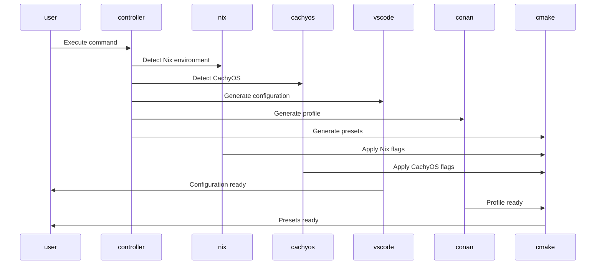

# DESIGN-046: Linux Support Design Index

## Overview

This document provides a comprehensive index of all Linux support design documents, showing relationships between designs, implementation dependencies, and mappings to requirements and ADRs.

## Design Documents

### Linux Support Design Documents

| ID | Document | Description | Related Requirements | Related ADRs |
|----|----------|-------------|------------------|--------------|
| [DES-040](DES-040-omnicppcontroller-linux-extensions.md) | OmniCppController.py Extensions | REQ-009, REQ-010, REQ-016, REQ-019, REQ-022, REQ-023, REQ-024, REQ-025 | ADR-027, ADR-028, ADR-029, ADR-030, ADR-031 |
| [DES-041](DES-041-flake-nix-schema.md) | flake.nix Schema | REQ-016, REQ-019, REQ-022, REQ-023, REQ-024, REQ-025 | ADR-027, ADR-028, ADR-029, ADR-030 |
| [DES-042](DES-042-vscode-configuration-schema.md) | VSCode Configuration Schema | REQ-009, REQ-010, REQ-016, REQ-022, REQ-023, REQ-024, REQ-025 | ADR-026, ADR-030, ADR-032 |
| [DES-043](DES-043-conan-profile-schema.md) | Conan Profile Schema | REQ-009, REQ-010, REQ-016, REQ-019, REQ-022, REQ-023, REQ-024, REQ-025 | ADR-027, ADR-028, ADR-030, ADR-031, ADR-034 |
| [DES-044](DES-044-setup-script-architecture.md) | Setup Script Architecture | REQ-009, REQ-010, REQ-016, REQ-019, REQ-022, REQ-023, REQ-024, REQ-025 | ADR-027, ADR-028, ADR-029, ADR-030 |
| [DES-045](DES-045-cmake-preset-schema.md) | CMake Preset Schema | REQ-009, REQ-010, REQ-016, REQ-019, REQ-022, REQ-023, REQ-024, REQ-025 | ADR-005, ADR-024, ADR-025, ADR-027, ADR-028, ADR-030 |

## Design Relationships

### Design Dependency Graph

```mermaid
graph TB
    subgraph DES040
        DES040 --> DES041
        DES040 --> DES042
        DES040 --> DES043
        DES040 --> DES044
        DES040 --> DES045
    end

    subgraph DES041
        DES041 --> DES043
        DES041 --> DES045
    end

    subgraph DES042
        DES042 --> DES043
        DES042 --> DES045
    end

    subgraph DES043
        DES043 --> DES044
        DES043 --> DES045
    end

    subgraph DES044
        DES044 --> DES045
    end

    subgraph DES045
        DES045 --> DES043
        DES045 --> DES042
    end
```

### Component Interaction Flow



## Implementation Dependencies

### Layer 1: Foundation (DES-040)

DES-040 provides the foundational interfaces and classes for Linux support:

- **Platform Detection**: LinuxDistribution, NixEnvironment
- **Package Manager Detection**: PackageManagerInfo
- **Compiler Flags**: CompilerFlags
- **Build Command**: BuildCommand
- **Environment Validation**: EnvironmentValidator

### Layer 2: Nix Integration (DES-041)

DES-041 builds upon DES-040 to provide Nix-specific support:

- **Nix Package Management**: NixPackage, NixShellConfig
- **Nix Environment Detection**: NixEnvironment
- **Nix CMake Integration**: CMakeIntegration
- **Nix Conan Integration**: ConanIntegration
- **Nix Qt6 Integration**: Qt6Integration
- **Nix Vulkan Integration**: VulkanIntegration

### Layer 3: VSCode Configuration (DES-042)

DES-042 builds upon DES-040 and DES-041 to provide VSCode support:

- **Task Configuration**: VSCodeTask, VSCodeTaskOption, VSCodeTaskPresentation
- **Launch Configuration**: VSCodeLaunchConfiguration, VSCodeTaskEnvironment
- **Platform Variants**: VSCodePlatformVariant
- **Linux-Specific Tasks**: Linux-specific tasks
- **Nix-Specific Tasks**: Nix-aware tasks
- **CachyOS-Specific Tasks**: CachyOS-optimized tasks

### Layer 4: Conan Profiles (DES-043)

DES-043 builds upon DES-040 to provide Conan profile support:

- **Conan Profile**: ConanProfile
- **Profile Settings**: ConanProfileSettings
- **Profile BuildEnv**: ConanProfileBuildEnv
- **Profile Conf**: ConanProfileConf
- **Profile Tools**: ConanProfileTools
- **Profile Environment**: ConanProfileEnv
- **Linux Profiles**: Generic Linux, Arch, Ubuntu, Fedora
- **CachyOS Profiles**: GCC and Clang with optimizations
- **Nix Profiles**: GCC and Clang for Nix environment

### Layer 5: Setup Scripts (DES-044)

DES-044 builds upon DES-040 to provide setup script architecture:

- **Script Interfaces**: ISetupScript, IPlatformDetector, IEnvironmentValidator, IPackageInstaller, IEnvironmentConfigurer, IScriptReporter
- **Script Classes**: SetupScriptBase, LinuxSetupScript, LinuxPlatformDetector, LinuxEnvironmentValidator, LinuxPackageInstaller, LinuxEnvironmentConfigurer, ConsoleScriptReporter
- **Script Configuration**: ScriptConfiguration
- **Script Results**: ScriptResult, PlatformInformation, DependencyInformation

### Layer 6: CMake Presets (DES-045)

DES-045 builds upon DES-040 and DES-041 to provide CMake preset support:

- **Preset Interfaces**: ICMakePresetGenerator, ICMakePresetParser, ICMakePresetManager
- **Preset Classes**: CMakePresetGenerator, CMakePresetParser, CMakePresetManager
- **Preset Data Structures**: CMakePresetsFile, CMakeConfigurePreset, CMakeBuildPreset, CMakeTestPreset, CMakePackagePreset, CMakeWorkflowPreset
- **Preset Conditions**: CMakeCondition
- **Preset Environment**: CMakeEnvironment
- **Configure Presets**: Generic, Nix-aware, CachyOS, Linux GCC, Linux Clang
- **Build Presets**: Generic, Nix, CachyOS
- **Test Presets**: Generic, Nix, CachyOS
- **Package Presets**: Generic, Nix, CachyOS
- **Workflow Presets**: Generic, Nix, CachyOS

## Requirements Mapping

### Platform Detection

| Requirement | Design Documents | Description |
|------------|------------------|-------------|
| REQ-009: Platform Detection | DES-040 | Linux distribution detection, CachyOS detection, Nix environment detection |
| REQ-010: Compiler Detection | DES-040 | Compiler detection with version and availability checks |

### Package Management

| Requirement | Design Documents | Description |
|------------|------------------|-------------|
| REQ-016: Conan Integration | DES-040, DES-041, DES-043 | Conan package manager integration with profile generation |
| REQ-017: Vcpkg Integration | DES-040 | Vcpkg package manager integration |
| REQ-018: CPM CMake Integration | DES-040 | CPM integration for CMake |
| REQ-019: Priority-Based Package Manager Selection | DES-040 | Priority-based selection between package managers |

### Build System

| Requirement | Design Documents | Description |
|------------|------------------|-------------|
| REQ-022: CMake 4 Configuration | DES-040, DES-045 | CMake 4 configuration with Ninja generator |
| REQ-023: Ninja Generator Default | DES-040, DES-041, DES-045 | Ninja as default generator for all platforms |
| REQ-024: CMake Presets Cross-Platform | DES-045 | Cross-platform CMake presets with platform-specific variants |
| REQ-025: Toolchain File Organization | DES-040, DES-045 | Toolchain file organization and integration |

### Development Environment

| Requirement | Design Documents | Description |
|------------|------------------|-------------|
| REQ-048: VSCode Tasks Configuration | DES-042 | VSCode task configuration for all platforms |
| REQ-049: VSCode Launch Configuration | DES-042 | VSCode launch configuration for debugging |

### Linux-Specific

| Requirement | Design Documents | Description |
|------------|------------------|-------------|
| ADR-027: Nix Package Manager Integration | DES-040, DES-041 | Nix package manager integration |
| ADR-028: CachyOS as Primary Linux Target | DES-040, DES-042, DES-043, DES-045 | CachyOS-specific optimizations |
| ADR-029: Direnv for Environment Management | DES-040, DES-041 | Direnv integration for automatic environment loading |
| ADR-030: Enhanced OmniCppController.py Architecture | DES-040 | Enhanced controller architecture for Linux support |
| ADR-031: Linux-Specific Multi-Package Manager Strategy | DES-040, DES-043 | Linux-specific package manager strategy |
| ADR-032: VSCode Platform-Specific Tasks | DES-042 | VSCode platform-specific task and launch configurations |
| ADR-034: Conan Profile Expansion | DES-043 | Conan profile expansion for Linux and CachyOS |

## ADR Mapping

### ADR-027: Nix Package Manager Integration

| ADR Section | Design Documents | Description |
|-------------|------------------|-------------|
| Nix Environment Detection | DES-040, DES-041 | Nix environment detection and integration |
| Nix Package Management | DES-041 | Nix package definitions and shell configuration |
| Nix CMake Integration | DES-045 | Nix-aware CMake presets |
| Nix Conan Integration | DES-043 | Nix-specific Conan profiles |

### ADR-028: CachyOS as Primary Linux Target

| ADR Section | Design Documents | Description |
|-------------|------------------|-------------|
| CachyOS Detection | DES-040 | CachyOS distribution detection |
| CachyOS Optimizations | DES-040, DES-042, DES-043, DES-045 | CachyOS-specific compiler flags |
| CachyOS Wayland Support | DES-042, DES-043 | Wayland platform configuration |
| CachyOS Performance Tuning | DES-040, DES-045 | Performance-oriented build configurations |

### ADR-030: Enhanced OmniCppController.py Architecture

| ADR Section | Design Documents | Description |
|-------------|------------------|-------------|
| Platform Detection | DES-040 | Enhanced platform detection for Linux |
| Environment Validation | DES-040, DES-044 | Comprehensive environment validation |
| Build Command Generation | DES-040 | Platform-specific build command generation |
| Error Handling | DES-040 | Enhanced error handling and reporting |

## Implementation Order

The design documents should be implemented in the following order:

1. **DES-040: OmniCppController.py Extensions**
   - Implement platform detection classes
   - Implement Nix environment detection
   - Implement CachyOS detection
   - Implement compiler flag generation
   - Implement build command generation

2. **DES-041: flake.nix Schema**
   - Implement Nix package definitions
   - Implement shell environment configuration
   - Implement CMake integration
   - Implement Conan integration

3. **DES-042: VSCode Configuration Schema**
   - Implement task configuration schemas
   - Implement launch configuration schemas
   - Implement platform-specific variants
   - Implement Nix and CachyOS tasks

4. **DES-043: Conan Profile Schema**
   - Implement Linux profile schemas
   - Implement CachyOS profile schemas
   - Implement Nix profile schemas
   - Implement GCC and Clang profiles

5. **DES-044: Setup Script Architecture**
   - Implement script interfaces
   - Implement platform detection
   - Implement environment validation
   - Implement package installation
   - Implement environment configuration

6. **DES-045: CMake Preset Schema**
   - Implement Nix-aware presets
   - Implement CachyOS presets
   - Implement platform detection enhancements
   - Implement condition schemas

## Testing Strategy

### Unit Testing

- Test each class independently
- Test interface implementations
- Test data structure serialization
- Test error handling
- Test validation logic

### Integration Testing

- Test DES-040 with DES-041: Nix environment detection
- Test DES-040 with DES-042: VSCode configuration
- Test DES-040 with DES-043: Conan profiles
-### Integration Testing

- Test DES-041 with DES-045: Nix CMake presets
- Test DES-043 with DES-045: CachyOS CMake presets
- Test DES-042 with DES-044: Setup scripts

### Platform Testing

- Test on CachyOS
- Test in Nix environment
- Test on generic Linux
- Test on Arch Linux
- Test on Ubuntu
- Test on Fedora

## Design Principles

### Type Safety

- All Python code uses type hints
- All dataclasses use type annotations
- All interfaces define return types
- All methods specify parameter and return types

### Cross-Platform Compatibility

- All designs support Windows, Linux, and macOS
- Platform-specific code is conditionally compiled
- Fallback mechanisms for unsupported platforms

### Modularity

- Each design document is self-contained
- Interfaces are designed for reusability
- Components can be composed and extended
- Clear separation of concerns

### Extensibility

- Interfaces allow for custom implementations
- Abstract base classes for common functionality
- Plugin-style architecture for extensions

### Documentation

- All interfaces and classes are documented
- Usage examples provided for each component
- Inline documentation for complex logic
- Type hints serve as documentation

### Error Handling

- Custom exception hierarchy for domain-specific errors
- Meaningful error messages
- Detailed error context
- Proper exception propagation

## Design Evolution

### Phase 1: Foundation (DES-040)
- Core interfaces and classes for Linux support
- Platform detection
- Environment validation
- Compiler flag generation

### Phase 2: Integration (DES-041, DES-042, DES-043)
- Nix package management
- VSCode configuration
- Conan profiles
- Cross-component integration

### Phase 3: Automation (DES-044, DES-045)
- Setup scripts
- CMake presets
- Automated environment setup

### Phase 4: Optimization
- CachyOS-specific optimizations
- Performance tuning
- Security hardening

## Related Documentation

- [Requirements](../reqs/) - Requirements documents
- [Architecture Decision Records](../adrs/) - ADR documents
- [Current State](../01_current_state/) - Current state analysis
- [Future State](../04_future_state/) - Future state vision
- [Threat Model](../03_threat_model/) - Threat model analysis

---

## Document Control

| Version | Date | Author | Changes |
|---------|------|---------|---------|
| 1.0 | 2026-01-27 | System Architect | Initial version |
