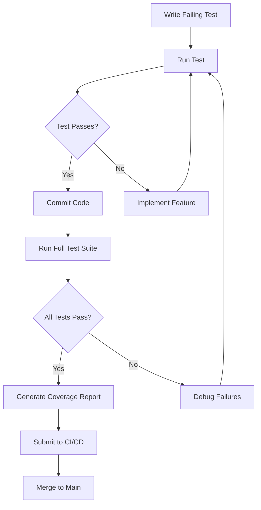

# Linux Support Expansion Test Plan

**Document Version:** 1.0.0
**Created:** 2026-01-27
**Last Updated:** 2026-01-27
**Status:** Draft
**Phase:** 7 - Test Planning

---

## Table of Contents

1. [Overview](#overview)
2. [Test Strategy](#test-strategy)
3. [Test Environment Requirements](#test-environment-requirements)
4. [Test Coverage Goals](#test-coverage-goals)
5. [Unit Test Scenarios](#unit-test-scenarios)
6. [Integration Test Scenarios](#integration-test-scenarios)
7. [Security Test Scenarios](#security-test-scenarios)
8. [Performance Test Scenarios](#performance-test-scenarios)
9. [Regression Test Scenarios](#regression-test-scenarios)
10. [Test Automation](#test-automation)
11. [Test Data Management](#test-data-management)
12. [Test Execution Workflow](#test-execution-workflow)
13. [Requirements Mapping](#requirements-mapping)
14. [Definition of Done](#definition-of-done)

---

## Overview

This test plan defines a comprehensive testing strategy for the Linux support expansion of the OmniCPP-template monorepo. The expansion adds comprehensive Linux support with Nix integration, targeting CachyOS as the primary platform while maintaining compatibility with other Linux distributions.

### Objectives

- **Quality Assurance:** Ensure 80% minimum code coverage across all Linux-specific components
- **TDD Compliance:** Follow Test-Driven Development principles for all new features
- **Platform Validation:** Validate Linux builds work correctly on CachyOS and other distributions
- **Nix Integration:** Verify Nix environment setup and reproducible builds
- **Multi-Platform Coexistence:** Ensure Windows, macOS, and WASM builds continue to work
- **Security Verification:** Validate Nix and Direnv security controls
- **Performance Validation:** Ensure Linux builds meet performance requirements
- **Regression Prevention:** Prevent breaking existing functionality

### Scope

This test plan covers:

- **Platform Detection:** Linux distribution detection (CachyOS, Arch, Ubuntu, etc.)
- **Nix Integration:** flake.nix validation and environment setup
- **Compiler Detection:** GCC and Clang detection on Linux with Nix awareness
- **Package Manager Integration:** Nix as fourth package manager alongside vcpkg, Conan, CPM
- **VSCode Configuration:** Linux-specific task and launch configurations
- **Conan Profiles:** Linux and CachyOS-specific Conan profiles
- **Setup Scripts:** Linux setup script validation
- **Repository Cleanup:** Archive and removal validation
- **CMake Integration:** Nix-aware CMake presets and toolchains

---

## Test Strategy

### Testing Approach

#### Test-Driven Development (TDD)

1. **Red-Green-Refactor Cycle:**
   - Write failing test before implementing feature
   - Implement minimum code to pass test
   - Refactor while maintaining test coverage
   - Repeat for each feature

2. **Test-First Philosophy:**
   - All new Linux features must have tests written first
   - Tests serve as living documentation
   - Tests drive API design
   - Continuous validation during development

#### Testing Pyramid

```
        /\
       /E2E\      - 5%  (End-to-End Linux Workflows)
      /------\
     /System \     - 10% (Complete Linux Build System)
    /--------\
   /Integration\   - 25% (Linux Package Manager Integration)
  /----------\
 /   Unit     \ - 60% (Linux-Specific Components)
/______________\
```

### Test Categories

1. **Unit Tests:** Test individual functions, classes, and methods in isolation
2. **Integration Tests:** Test interactions between Linux-specific components
3. **System Tests:** Test complete Linux build workflows
4. **End-to-End Tests:** Test complete user scenarios on Linux
5. **Performance Tests:** Validate Linux build performance characteristics
6. **Security Tests:** Validate Nix and Direnv security controls
7. **Regression Tests:** Ensure existing functionality continues to work
8. **Cross-Platform Tests:** Validate multi-platform coexistence

---

## Test Environment Requirements

### Hardware Requirements

- **Primary Target:** CachyOS PC (Arch Linux derivative)
- **Alternative Targets:** Arch Linux, Ubuntu, Fedora (for compatibility testing)
- **Architecture:** x86_64 (primary), ARM64 (future consideration)
- **Minimum RAM:** 8GB
- **Recommended RAM:** 16GB+

### Software Requirements

- **Operating System:** CachyOS or compatible Linux distribution
- **Nix:** Nix with flakes support (2.18+ recommended)
- **Direnv:** Direnv 2.32+ for automatic environment loading
- **Python:** Python 3.10+ (for OmniCppController.py)
- **Compilers:** GCC 13+, Clang 16+
- **Build System:** CMake 3.28+, Ninja 1.11+
- **Package Managers:** Conan 2.0+, vcpkg, CPM.cmake

### Test Infrastructure

- **CI/CD:** GitHub Actions (Linux runners)
- **Local Testing:** Nix shell environment
- **Test Frameworks:** pytest (Python), Google Test (C++)
- **Coverage Tools:** pytest-cov, gcov/lcov
- **Static Analysis:** clang-tidy, cppcheck, pylint, mypy
- **Linting:** clang-format, black

---

## Test Coverage Goals

### Coverage Targets

| Component | Target Coverage | Minimum Acceptable |
|-----------|----------------|-------------------|
| Platform Detection (Linux) | 90% | 80% |
| Nix Integration | 85% | 75% |
| Compiler Detection (Linux) | 90% | 80% |
| VSCode Configuration | 80% | 70% |
| Conan Profiles (Linux) | 85% | 75% |
| Setup Scripts | 90% | 80% |
| OmniCppController.py (Linux) | 85% | 75% |
| Overall Linux Expansion | 85% | 75% |

### Coverage Metrics

- **Line Coverage:** Percentage of executable lines covered
- **Branch Coverage:** Percentage of conditional branches covered
- **Function Coverage:** Percentage of functions/methods covered
- **Integration Coverage:** Percentage of component interactions tested

---

## Unit Test Scenarios

### UNIT-001: OmniCppController.py Platform Detection

#### UNIT-001-001: Linux Distribution Detection

**Description:** Verify Linux distribution detection works correctly

**TDD Approach:**
1. Write test that mocks `/etc/os-release` content
2. Implement `detect_linux_distribution()` function
3. Verify test passes

**Test Cases:**

```python
@pytest.mark.parametrize("os_release_content,expected_distro", [
    ("ID=cachyos\nVERSION_ID=2023.12.01", 
     LinuxDistribution(name="CachyOS", version="2023.12.01", family="arch", package_manager="pacman", is_cachyos=True)),
    ("ID=arch\nVERSION_ID=2023.12.01", 
     LinuxDistribution(name="Arch Linux", version="2023.12.01", family="arch", package_manager="pacman", is_cachyos=False)),
    ("ID=ubuntu\nVERSION_ID=22.04", 
     LinuxDistribution(name="Ubuntu", version="22.04", family="debian", package_manager="apt", is_cachyos=False)),
    ("ID=fedora\nVERSION_ID=38", 
     LinuxDistribution(name="Fedora", version="38", family="fedora", package_manager="dnf", is_cachyos=False)),
])
def test_linux_distribution_detection(os_release_content, expected_distro, tmp_path):
    """Test Linux distribution detection from /etc/os-release"""
    # Create mock /etc/os-release
    os_release = tmp_path / "os-release"
    os_release.write_text(os_release_content)
    
    # Mock platform detection
    from omni_scripts.platform.linux import detect_linux_distribution
    distro = detect_linux_distribution()
    
    assert distro.name == expected_distro.name
    assert distro.version == expected_distro.version
    assert distro.family == expected_distro.family
    assert distro.package_manager == expected_distro.package_manager
    assert distro.is_cachyos == expected_distro.is_cachyos
```

**Pass Criteria:**
- All test cases pass
- Distribution name detected correctly
- Version parsed correctly
- Family identified correctly
- Package manager detected correctly
- CachyOS flag set correctly

#### UNIT-001-002: CachyOS Detection

**Description:** Verify CachyOS is detected correctly

**Test Cases:**

```python
def test_cachyos_detection(tmp_path):
    """Test CachyOS-specific detection"""
    # Create CachyOS os-release
    os_release = tmp_path / "os-release"
    os_release.write_text("ID=cachyos\nID_LIKE=arch\nVERSION_ID=2023.12.01")
    
    from omni_scripts.platform.linux import is_cachyos
    assert is_cachyos() is True
    
    # Test non-CachyOS
    os_release.write_text("ID=arch\nVERSION_ID=2023.12.01")
    assert is_cachyos() is False
```

#### UNIT-001-003: Nix Environment Detection

**Description:** Verify Nix environment is detected correctly

**Test Cases:**

```python
@pytest.mark.parametrize("in_nix_shell,expected", [
    ("1", True),
    ("0", False),
    (None, False),
])
def test_nix_environment_detection(in_nix_shell, expected, monkeypatch):
    """Test Nix environment detection"""
    monkeypatch.setenv("IN_NIX_SHELL", in_nix_shell)
    
    from omni_scripts.utils.nix_utils import is_nix_environment
    result = is_nix_environment()
    
    assert result == expected
```

#### UNIT-001-004: Package Manager Detection

**Description:** Verify package manager detection works correctly

**Test Cases:**

```python
@pytest.mark.parametrize("available_commands,expected_manager", [
    (["pacman"], "pacman"),
    (["apt-get", "apt"], "apt"),
    (["dnf"], "dnf"),
    (["zypper"], "zypper"),
    ([], "unknown"),
])
def test_package_manager_detection(available_commands, expected_manager, mocker):
    """Test package manager detection"""
    # Mock which command
    def mock_which(cmd):
        return cmd in available_commands
    
    mocker.patch("shutil.which", side_effect=mock_which)
    
    from omni_scripts.platform.linux import detect_package_manager
    manager = detect_package_manager()
    
    assert manager.name == expected_manager
```

#### UNIT-001-005: Compiler Flag Generation

**Description:** Verify compiler flags are generated correctly for CachyOS

**Test Cases:**

```python
@pytest.mark.parametrize("compiler,build_type,expected_flags", [
    ("gcc", "debug", ["-g", "-O0", "-DDEBUG", "-fstack-protector-strong", "-D_FORTIFY_SOURCE=2"]),
    ("gcc", "release", ["-march=native", "-O3", "-flto", "-DNDEBUG", "-fstack-protector-strong", "-D_FORTIFY_SOURCE=2"]),
    ("clang", "debug", ["-g", "-O0", "-DDEBUG"]),
    ("clang", "release", ["-march=native", "-O3", "-flto", "-DNDEBUG"]),
])
def test_cachyos_compiler_flags(compiler, build_type, expected_flags):
    """Test CachyOS-specific compiler flags"""
    from omni_scripts.platform.linux import get_cachyos_compiler_flags
    flags = get_cachyos_compiler_flags(compiler, build_type)
    
    assert all(flag in flags for flag in expected_flags)
```

#### UNIT-001-006: Build Command Generation

**Description:** Verify build commands are generated correctly for Linux

**Test Cases:**

```python
@pytest.mark.parametrize("target,compiler,use_nix,expected_context", [
    ("engine", "gcc", True, "nix-gcc"),
    ("engine", "clang", False, "system-clang"),
    ("game", "gcc", True, "nix-gcc"),
])
def test_linux_build_context_generation(target, compiler, use_nix, expected_context):
    """Test Linux build context generation"""
    from omni_scripts.platform.linux import get_linux_build_context
    context = get_linux_build_context(target, compiler, use_nix)
    
    assert context.product == target
    assert context.compiler == compiler
    assert context.use_nix == use_nix
    assert context.build_type in ["debug", "release"]
```

---

### UNIT-002: flake.nix Validation

#### UNIT-002-001: Nix Package Definitions

**Description:** Verify Nix flake package definitions are valid

**Test Cases:**

```python
def test_nix_flake_syntax():
    """Test flake.nix has valid syntax"""
    import subprocess
    result = subprocess.run(
        ["nix", "flake", "check", "flake.nix"],
        capture_output=True,
        text=True
    )
    assert result.returncode == 0
```

#### UNIT-002-002: Shell Environment Configuration

**Description:** Verify Nix shell environment is configured correctly

**Test Cases:**

```python
def test_nix_shell_environment():
    """Test Nix shell environment variables"""
    # Load flake.nix
    from pathlib import Path
    flake_content = Path("flake.nix").read_text()
    
    # Verify required packages
    required_packages = [
        "gcc", "clang", "cmake", "ninja", 
        "qt6.qtbase", "vulkan-headers", "conan"
    ]
    
    for package in required_packages:
        assert package in flake_content.lower()
    
    # Verify shellHook sets required variables
    assert "QT_QPA_PLATFORM" in flake_content
    assert "CMAKE_GENERATOR" in flake_content
    assert "VK_LAYER_PATH" in flake_content
```

#### UNIT-002-003: CMake Integration

**Description:** Verify Nix CMake integration is correct

**Test Cases:**

```python
def test_nix_cmake_integration():
    """Test Nix CMake environment variables"""
    flake_content = Path("flake.nix").read_text()
    
    # Verify CMake paths
    assert "CMAKE_PREFIX_PATH" in flake_content
    assert "CMAKE_LIBRARY_PATH" in flake_content
    assert "CMAKE_INCLUDE_PATH" in flake_content
    
    # Verify Qt6 integration
    assert "qt6.qtbase" in flake_content.lower()
    
    # Verify Vulkan integration
    assert "vulkan-headers" in flake_content.lower() or "vulkan-loader" in flake_content.lower()
```

#### UNIT-002-004: Conan Integration

**Description:** Verify Nix Conan integration is correct

**Test Cases:**

```python
def test_nix_conan_integration():
    """Test Nix Conan environment variables"""
    flake_content = Path("flake.nix").read_text()
    
    # Verify Conan variables
    assert "CONAN_USER_HOME" in flake_content
    assert "CONAN_REVISIONS_ENABLED" in flake_content
    assert "CONAN_V2_MODE" in flake_content
```

---

### UNIT-003: VSCode Configuration Validation

#### UNIT-003-001: Task Configuration Syntax

**Description:** Verify VSCode task configuration syntax is valid

**Test Cases:**

```python
def test_vscode_tasks_syntax():
    """Test VSCode tasks.json has valid syntax"""
    import json
    tasks_path = Path(".vscode/tasks.json")
    
    with open(tasks_path) as f:
        tasks = json.load(f)
    
    # Verify structure
    assert "version" in tasks
    assert "tasks" in tasks
    
    # Verify Linux tasks exist
    task_labels = [task["label"] for task in tasks["tasks"]]
    linux_tasks = [label for label in task_labels if "Linux" in label]
    assert len(linux_tasks) > 0
```

#### UNIT-003-002: Launch Configuration Syntax

**Description:** Verify VSCode launch configuration syntax is valid

**Test Cases:**

```python
def test_vscode_launch_syntax():
    """Test VSCode launch.json has valid syntax"""
    import json
    launch_path = Path(".vscode/launch.json")
    
    with open(launch_path) as f:
        launch = json.load(f)
    
    # Verify structure
    assert "version" in launch
    assert "configurations" in launch
    
    # Verify Linux configurations exist
    configs = launch["configurations"]
    linux_configs = [c for c in configs if "Linux" in c.get("name", "")]
    assert len(linux_configs) > 0
```

#### UNIT-003-003: Platform-Specific Variants

**Description:** Verify platform-specific task variants exist

**Test Cases:**

```python
def test_vscode_platform_variants():
    """Test VSCode has platform-specific task variants"""
    import json
    tasks_path = Path(".vscode/tasks.json")
    
    with open(tasks_path) as f:
        tasks = json.load(f)
    
    task_labels = [task["label"] for task in tasks["tasks"]]
    
    # Verify Windows tasks exist
    windows_tasks = [label for label in task_labels if "Windows" in label]
    assert len(windows_tasks) > 0
    
    # Verify Linux tasks exist
    linux_tasks = [label for label in task_labels if "Linux" in label]
    assert len(linux_tasks) > 0
    
    # Verify WASM tasks exist
    wasm_tasks = [label for label in task_labels if "WASM" in label]
    assert len(wasm_tasks) > 0
```

---

### UNIT-004: Conan Profile Validation

#### UNIT-004-001: Linux Profile Syntax

**Description:** Verify Linux Conan profile syntax is valid

**Test Cases:**

```python
@pytest.mark.parametrize("profile_name", [
    "linux-gcc",
    "linux-clang",
    "cachyos-gcc",
    "cachyos-clang",
])
def test_conan_linux_profile_syntax(profile_name):
    """Test Linux Conan profile syntax"""
    import configparser
    profile_path = Path(f"conan/profiles/{profile_name}")
    
    config = configparser.ConfigParser()
    config.read(profile_path)
    
    # Verify required sections
    assert "settings" in config.sections()
    
    # Verify required settings
    settings = config["settings"]
    assert "os" in settings
    assert "arch" in settings
    assert "compiler" in settings
    
    # Verify Linux-specific settings
    assert settings["os"] == "Linux"
    assert settings["arch"] == "x86_64"
```

#### UNIT-004-002: CachyOS Profile Syntax

**Description:** Verify CachyOS Conan profile syntax is valid

**Test Cases:**

```python
def test_conan_cachyos_profile():
    """Test CachyOS Conan profile"""
    import configparser
    profile_path = Path("conan/profiles/cachyos-gcc")
    
    config = configparser.ConfigParser()
    config.read(profile_path)
    
    settings = config["settings"]
    
    # Verify CachyOS-specific settings
    assert settings["compiler.version"] in ["13", "14"]
    assert "compiler.libcxx" in settings
    
    # Verify build tools
    assert "conf" in config.sections()
    conf = config["conf"]
    assert "tools.build:compiler_executables" in conf
```

#### UNIT-004-003: GCC Profile Syntax

**Description:** Verify GCC Conan profile syntax is valid

**Test Cases:**

```python
def test_conan_gcc_profile():
    """Test GCC Conan profile"""
    import configparser
    profile_path = Path("conan/profiles/linux-gcc")
    
    config = configparser.ConfigParser()
    config.read(profile_path)
    
    settings = config["settings"]
    
    # Verify GCC-specific settings
    assert settings["compiler"] == "gcc"
    assert "compiler.version" in settings
    assert settings.get("compiler.libcxx") in ["libstdc++11", "libstdc++17", "libstdc++20"]
```

#### UNIT-004-004: Clang Profile Syntax

**Description:** Verify Clang Conan profile syntax is valid

**Test Cases:**

```python
def test_conan_clang_profile():
    """Test Clang Conan profile"""
    import configparser
    profile_path = Path("conan/profiles/linux-clang")
    
    config = configparser.ConfigParser()
    config.read(profile_path)
    
    settings = config["settings"]
    
    # Verify Clang-specific settings
    assert settings["compiler"] == "clang"
    assert "compiler.version" in settings
    assert settings.get("compiler.libcxx") in ["libstdc++11", "libstdc++17", "libstdc++20"]
```

---

### UNIT-005: Setup Script Validation

#### UNIT-005-001: Script Execution

**Description:** Verify setup scripts execute correctly

**Test Cases:**

```python
def test_linux_setup_script_execution():
    """Test Linux setup script execution"""
    import subprocess
    result = subprocess.run(
        ["bash", "setup_linux.sh"],
        capture_output=True,
        text=True,
        timeout=60
    )
    
    assert result.returncode == 0
    assert "Setup complete" in result.stdout or "Environment ready" in result.stdout
```

#### UNIT-005-002: Script Idempotency

**Description:** Verify setup scripts can be run multiple times safely

**Test Cases:**

```python
def test_linux_setup_script_idempotency():
    """Test setup script is idempotent"""
    import subprocess
    
    # Run setup twice
    result1 = subprocess.run(
        ["bash", "setup_linux.sh"],
        capture_output=True,
        text=True
    )
    
    result2 = subprocess.run(
        ["bash", "setup_linux.sh"],
        capture_output=True,
        text=True
    )
    
    # Both should succeed
    assert result1.returncode == 0
    assert result2.returncode == 0
    
    # Second run should be faster (already set up)
    assert result2.stderr == "" or "already configured" in result2.stderr.lower()
```

#### UNIT-005-003: Error Handling

**Description:** Verify setup scripts handle errors gracefully

**Test Cases:**

```python
@pytest.mark.parametrize("error_scenario,expected_message", [
    ("missing_compiler", "Compiler not found"),
    ("missing_cmake", "CMake not found"),
    ("permission_denied", "Permission denied"),
])
def test_linux_setup_script_error_handling(error_scenario, expected_message, tmp_path):
    """Test setup script error handling"""
    # Create script that simulates error
    script_path = tmp_path / "setup_linux.sh"
    script_path.write_text(f"""
    #!/bin/bash
    if [ "{error_scenario}" == "missing_compiler" ]; then
        echo "Error: {expected_message}" >&2
        exit 1
    fi
    exit 0
    """)
    script_path.chmod(0o755)
    
    import subprocess
    result = subprocess.run(
        ["bash", str(script_path)],
        capture_output=True,
        text=True
    )
    
    assert result.returncode != 0
    assert expected_message in result.stderr
```

---

## Integration Test Scenarios

### INT-001: End-to-End Linux Build

#### INT-001-001: Complete Build Process on Linux

**Description:** Verify complete build process works on Linux

**TDD Approach:**
1. Write test that executes full build workflow
2. Implement build workflow
3. Verify test passes

**Test Cases:**

```python
@pytest.mark.parametrize("compiler,build_type", [
    ("gcc", "debug"),
    ("gcc", "release"),
    ("clang", "debug"),
    ("clang", "release"),
])
@pytest.mark.linux
def test_complete_linux_build(compiler, build_type, tmp_path):
    """Test complete Linux build process"""
    from omni_scripts.controller.build_controller import BuildController
    controller = BuildController()
    
    # Configure
    result = controller.configure(
        build_type=build_type,
        compiler=compiler
    )
    assert result == 0
    
    # Build
    result = controller.build(
        target="engine",
        pipeline="Clean Build Pipeline",
        config=build_type,
        compiler=compiler
    )
    assert result == 0
    
    # Verify build artifacts
    build_dir = tmp_path / "build" / f"linux-{compiler}-{build_type}"
    assert build_dir.exists()
    
    # Verify engine library
    engine_lib = build_dir / "lib" / "libomnicppengine.so"
    assert engine_lib.exists()
```

**Pass Criteria:**
- Configuration succeeds
- Build completes without errors
- Build artifacts generated correctly
- Engine library exists
- No warnings or errors in build output

#### INT-001-002: Nix Environment Setup

**Description:** Verify Nix environment setup works correctly

**Test Cases:**

```python
@pytest.mark.nix
def test_nix_environment_setup():
    """Test Nix environment setup"""
    import subprocess
    
    # Enter Nix shell
    result = subprocess.run(
        ["nix", "develop", "--command", "python", "-c", 
         "from omni_scripts.utils.nix_utils import setup_nix_environment; setup_nix_environment()"],
        capture_output=True,
        text=True,
        timeout=120
    )
    
    assert result.returncode == 0
    
    # Verify environment variables set
    assert "NIX_PATH" in os.environ or "nix" in os.environ.get("PATH", "").lower()
```

#### INT-001-003: CMake Configuration

**Description:** Verify CMake configuration works on Linux

**Test Cases:**

```python
@pytest.mark.parametrize("preset", [
    "linux-gcc-debug",
    "linux-gcc-release",
    "linux-clang-debug",
    "linux-clang-release",
])
def test_cmake_configuration(preset, tmp_path):
    """Test CMake configuration"""
    import subprocess
    result = subprocess.run(
        ["cmake", "--preset", preset],
        cwd=tmp_path,
        capture_output=True,
        text=True
    )
    
    assert result.returncode == 0
    
    # Verify CMakeCache.txt exists
    cache_file = tmp_path / "build" / preset / "CMakeCache.txt"
    assert cache_file.exists()
```

#### INT-001-004: Compilation

**Description:** Verify compilation works on Linux

**Test Cases:**

```python
@pytest.mark.parametrize("compiler,build_type", [
    ("gcc", "debug"),
    ("gcc", "release"),
    ("clang", "debug"),
    ("clang", "release"),
])
def test_linux_compilation(compiler, build_type, tmp_path):
    """Test Linux compilation"""
    import subprocess
    result = subprocess.run(
        ["cmake", "--build", "--preset", f"linux-{compiler}-{build_type}"],
        cwd=tmp_path,
        capture_output=True,
        text=True
    )
    
    assert result.returncode == 0
    
    # Verify no compilation errors
    assert "error:" not in result.stdout.lower()
    assert "error:" not in result.stderr.lower()
```

#### INT-001-005: Linking

**Description:** Verify linking works on Linux

**Test Cases:**

```python
def test_linux_linking(tmp_path):
    """Test Linux linking"""
    import subprocess
    result = subprocess.run(
        ["cmake", "--build", "--preset", "linux-gcc-release"],
        cwd=tmp_path,
        capture_output=True,
        text=True
    )
    
    assert result.returncode == 0
    
    # Verify no linking errors
    assert "undefined reference" not in result.stderr.lower()
    assert "cannot find" not in result.stderr.lower()
```

---

### INT-002: VSCode Integration

#### INT-002-001: VSCode Task Execution

**Description:** Verify VSCode tasks execute correctly on Linux

**Test Cases:**

```python
@pytest.mark.parametrize("task_label", [
    "Configure Build (Linux GCC - Debug)",
    "Build Engine (Linux GCC - Debug)",
    "Build Engine (Linux Clang - Release)",
])
def test_vscode_task_execution(task_label):
    """Test VSCode task execution"""
    import json
    import subprocess
    
    tasks_path = Path(".vscode/tasks.json")
    with open(tasks_path) as f:
        tasks = json.load(f)
    
    # Find task
    task = next(t for t in tasks["tasks"] if t["label"] == task_label)
    
    # Execute task
    result = subprocess.run(
        task["command"],
        args=task["args"],
        capture_output=True,
        text=True
    )
    
    assert result.returncode == 0
```

#### INT-002-002: VSCode Debugging

**Description:** Verify VSCode debugging works on Linux

**Test Cases:**

```python
@pytest.mark.linux
def test_vscode_debugging():
    """Test VSCode debugging on Linux"""
    import json
    
    launch_path = Path(".vscode/launch.json")
    with open(launch_path) as f:
        launch = json.load(f)
    
    # Find Linux debug configuration
    linux_configs = [c for c in launch["configurations"] if "Linux" in c.get("name", "")]
    assert len(linux_configs) > 0
    
    config = linux_configs[0]
    
    # Verify required fields
    assert "type" in config
    assert "request" in config
    assert "program" in config
    assert "cwd" in config
```

#### INT-002-003: Platform-Specific Task Selection

**Description:** Verify platform-specific task selection works

**Test Cases:**

```python
@pytest.mark.parametrize("platform,expected_tasks", [
    ("linux", ["Linux GCC", "Linux Clang"]),
    ("windows", ["Windows MSVC", "MinGW"]),
    ("wasm", ["WASM"]),
])
def test_platform_task_selection(platform, expected_tasks):
    """Test platform-specific task selection"""
    import json
    import sys
    
    tasks_path = Path(".vscode/tasks.json")
    with open(tasks_path) as f:
        tasks = json.load(f)
    
    task_labels = [task["label"] for task in tasks["tasks"]]
    
    # Filter tasks for platform
    platform_tasks = [label for label in task_labels if platform in label]
    
    # Verify expected tasks exist
    for expected_task in expected_tasks:
        assert any(expected_task in task for task in platform_tasks)
```

---

### INT-003: Multi-Platform Coexistence

#### INT-003-001: Windows Build Still Works

**Description:** Verify Windows builds continue to work after Linux expansion

**Test Cases:**

```python
@pytest.mark.windows
def test_windows_build_still_works():
    """Test Windows builds still work"""
    from omni_scripts.controller.build_controller import BuildController
    controller = BuildController()
    
    # Configure
    result = controller.configure(
        build_type="release",
        compiler="msvc"
    )
    assert result == 0
    
    # Build
    result = controller.build(
        target="engine",
        pipeline="Clean Build Pipeline",
        config="release",
        compiler="msvc"
    )
    assert result == 0
```

#### INT-003-002: Linux Build Works

**Description:** Verify Linux builds work correctly

**Test Cases:**

```python
@pytest.mark.linux
def test_linux_build_works():
    """Test Linux builds work"""
    from omni_scripts.controller.build_controller import BuildController
    controller = BuildController()
    
    # Configure
    result = controller.configure(
        build_type="release",
        compiler="gcc"
    )
    assert result == 0
    
    # Build
    result = controller.build(
        target="engine",
        pipeline="Clean Build Pipeline",
        config="release",
        compiler="gcc"
    )
    assert result == 0
```

#### INT-003-003: WASM Build Works

**Description:** Verify WASM builds continue to work

**Test Cases:**

```python
@pytest.mark.wasm
def test_wasm_build_works():
    """Test WASM builds still work"""
    from omni_scripts.controller.build_controller import BuildController
    controller = BuildController()
    
    # Configure
    result = controller.configure(
        build_type="release",
        target="wasm"
    )
    assert result == 0
    
    # Build
    result = controller.build(
        target="engine",
        pipeline="Clean Build Pipeline",
        config="release",
        target="wasm"
    )
    assert result == 0
```

#### INT-003-004: Cross-Platform Consistency

**Description:** Verify builds are consistent across platforms

**Test Cases:**

```python
@pytest.mark.parametrize("platform,compiler", [
    ("windows", "msvc"),
    ("linux", "gcc"),
    ("linux", "clang"),
])
def test_cross_platform_consistency(platform, compiler):
    """Test cross-platform consistency"""
    from omni_scripts.controller.build_controller import BuildController
    controller = BuildController()
    
    # Build on platform
    result = controller.build(
        target="engine",
        pipeline="Clean Build Pipeline",
        config="release",
        compiler=compiler
    )
    assert result == 0
    
    # Verify same API surface
    # (Implementation-specific: verify engine exports same symbols)
```

---

### INT-004: Package Manager Integration

#### INT-004-001: Nix Package Installation

**Description:** Verify Nix packages install correctly

**Test Cases:**

```python
@pytest.mark.nix
def test_nix_package_installation():
    """Test Nix package installation"""
    import subprocess
    
    result = subprocess.run(
        ["nix", "build"],
        capture_output=True,
        text=True,
        timeout=300
    )
    
    assert result.returncode == 0
    
    # Verify packages available
    result = subprocess.run(
        ["nix", "develop", "--command", "which", "gcc"],
        capture_output=True,
        text=True
    )
    
    assert result.returncode == 0
    assert "/nix" in result.stdout.lower()
```

#### INT-004-002: Conan Package Installation

**Description:** Verify Conan packages install correctly on Linux

**Test Cases:**

```python
@pytest.mark.linux
def test_conan_package_installation():
    """Test Conan package installation"""
    import subprocess
    
    result = subprocess.run(
        ["conan", "install", ".", 
         "--build=missing", 
         "--profile", "linux-gcc"],
        capture_output=True,
        text=True,
        timeout=300
    )
    
    assert result.returncode == 0
```

#### INT-004-003: vcpkg Package Installation

**Description:** Verify vcpkg packages install correctly on Linux

**Test Cases:**

```python
@pytest.mark.linux
def test_vcpkg_package_installation():
    """Test vcpkg package installation"""
    import subprocess
    
    result = subprocess.run(
        ["vcpkg", "install", "qt6", "vulkan"],
        capture_output=True,
        text=True,
        timeout=300
    )
    
    assert result.returncode == 0
```

#### INT-004-004: CPM Package Installation

**Description:** Verify CPM packages download correctly

**Test Cases:**

```python
def test_cpm_package_installation():
    """Test CPM package installation"""
    # CPM downloads packages during CMake configure
    import subprocess
    
    result = subprocess.run(
        ["cmake", "--preset", "linux-gcc-debug"],
        capture_output=True,
        text=True
    )
    
    assert result.returncode == 0
    
    # Verify CPM cache
    cpm_cache = Path(".cpm-cache")
    assert cpm_cache.exists()
```

---

### INT-005: Repository Cleanup

#### INT-005-001: Archive Creation

**Description:** Verify archive creation works correctly

**Test Cases:**

```python
def test_archive_creation(tmp_path):
    """Test archive creation"""
    from omni_scripts.utils.file_utils import create_archive
    
    # Create test files
    test_dir = tmp_path / "test_files"
    test_dir.mkdir()
    (test_dir / "file1.txt").write_text("content1")
    (test_dir / "file2.txt").write_text("content2")
    
    # Create archive
    archive_path = tmp_path / "archive.tar.gz"
    create_archive(test_dir, archive_path)
    
    assert archive_path.exists()
    assert archive_path.stat().st_size > 0
```

#### INT-005-002: File Removal

**Description:** Verify file removal works correctly

**Test Cases:**

```python
def test_file_removal(tmp_path):
    """Test file removal"""
    from omni_scripts.utils.file_utils import remove_windows_artifacts
    
    # Create test files
    test_dir = tmp_path / "windows_artifacts"
    test_dir.mkdir()
    (test_dir / "file1.bat").write_text("content")
    (test_dir / "file2.exe").write_text("content")
    
    # Remove files
    remove_windows_artifacts(tmp_path)
    
    assert not test_dir.exists()
```

#### INT-005-003: Documentation Updates

**Description:** Verify documentation is updated correctly

**Test Cases:**

```python
def test_documentation_updates():
    """Test documentation updates"""
    from omni_scripts.utils.file_utils import update_documentation
    
    # Update README
    readme_path = Path("README.md")
    update_documentation(readme_path, "Linux support added")
    
    readme_content = readme_path.read_text()
    assert "Linux support" in readme_content
    assert "CachyOS" in readme_content
```

---

## Security Test Scenarios

### SEC-001: Nix Security

#### SEC-001-001: Nix Channel Pinning

**Description:** Verify Nix channels are pinned correctly

**Test Cases:**

```python
def test_nix_channel_pinning():
    """Test Nix channel pinning"""
    import json
    
    flake_lock_path = Path("flake.lock")
    with open(flake_lock_path) as f:
        flake_lock = json.load(f)
    
    # Verify nixpkgs is pinned
    assert "nodes" in flake_lock
    assert "nixpkgs" in str(flake_lock).lower()
    
    # Verify commit hash exists
    for node in flake_lock["nodes"].values():
        if "locked" in node:
            assert "narHash" in node["locked"]
```

**Pass Criteria:**
- flake.lock exists
- nixpkgs is pinned to specific commit
- narHash exists for all packages
- No unpinned dependencies

#### SEC-001-002: Nix Expression Validation

**Description:** Verify Nix expressions are valid and secure

**Test Cases:**

```python
def test_nix_expression_validation():
    """Test Nix expression validation"""
    import subprocess
    
    # Validate flake.nix
    result = subprocess.run(
        ["nix", "flake", "check", "flake.nix"],
        capture_output=True,
        text=True
    )
    
    assert result.returncode == 0
    
    # Check for dangerous patterns
    flake_content = Path("flake.nix").read_text()
    assert "fetchTarball" not in flake_content
    assert "builtins.fetchurl" not in flake_content
```

#### SEC-001-003: Nix Store Verification

**Description:** Verify Nix store integrity

**Test Cases:**

```python
def test_nix_store_verification():
    """Test Nix store verification"""
    import subprocess
    
    # Verify store paths
    result = subprocess.run(
        ["nix-store", "--verify", "--check-contents"],
        capture_output=True,
        text=True
    )
    
    # Should not have corrupted paths
    assert result.returncode == 0 or "warning" in result.stdout.lower()
```

---

### SEC-002: Direnv Security

#### SEC-002-001: Environment Variable Validation

**Description:** Verify Direnv environment variables are validated

**Test Cases:**

```python
def test_direnv_environment_validation():
    """Test Direnv environment variable validation"""
    envrc_path = Path(".envrc")
    envrc_content = envrc_path.read_text()
    
    # Verify use flake
    assert "use flake" in envrc_content
    
    # Verify no dangerous variables
    assert "PATH=" not in envrc_content
    assert "export PATH" not in envrc_content
```

**Pass Criteria:**
- .envrc uses "use flake"
- No hardcoded PATH overrides
- No dangerous environment variable assignments

#### SEC-002-002: Hook Validation

**Description:** Verify Direnv hooks are secure

**Test Cases:**

```python
def test_direnv_hook_validation():
    """Test Direnv hook validation"""
    envrc_path = Path(".envrc")
    envrc_content = envrc_path.read_text()
    
    # Verify no arbitrary code execution
    assert "eval" not in envrc_content or "eval $(git" not in envrc_content
    assert "bash -c" not in envrc_content
```

#### SEC-002-003: Audit Logging

**Description:** Verify Direnv audit logging works

**Test Cases:**

```python
def test_direnv_audit_logging():
    """Test Direnv audit logging"""
    import subprocess
    
    # Enable audit logging
    result = subprocess.run(
        ["direnv", "allow", "."],
        capture_output=True,
        text=True,
        env={"DIRENV_LOG_FORMAT": "json"}
    )
    
    # Verify audit output
    assert result.returncode == 0
```

---

### SEC-003: Script Security

#### SEC-003-001: Script Validation

**Description:** Verify setup scripts are secure

**Test Cases:**

```python
def test_script_validation():
    """Test setup script validation"""
    script_path = Path("setup_linux.sh")
    script_content = script_path.read_text()
    
    # Verify no hardcoded paths
    assert "/home/" not in script_content or "HOME=" not in script_content
    assert "/root/" not in script_content
    
    # Verify error handling
    assert "set -e" in script_content or "set -o pipefail" in script_content
```

**Pass Criteria:**
- No hardcoded user paths
- Error handling enabled
- No insecure operations

#### SEC-003-002: Path Validation

**Description:** Verify script path handling is secure

**Test Cases:**

```python
def test_path_validation():
    """Test script path validation"""
    from omni_scripts.utils.path_utils import validate_path
    
    # Test valid paths
    valid_path = Path("/tmp/test")
    assert validate_path(valid_path) is True
    
    # Test invalid paths
    invalid_path = Path("/etc/passwd")
    assert validate_path(invalid_path) is False
```

#### SEC-003-003: Permission Hardening

**Description:** Verify script permissions are hardened

**Test Cases:**

```python
def test_permission_hardening():
    """Test script permission hardening"""
    import stat
    
    script_path = Path("setup_linux.sh")
    script_stat = script_path.stat()
    
    # Verify permissions
    mode = stat.S_IMODE(script_stat.st_mode)
    
    # Should be executable by owner only
    assert mode & 0o111 == 0o100  # rwx------
    
    # Should not be world-writable
    assert mode & 0o002 == 0  # -----w----
```

---

## Performance Test Scenarios

### PERF-001: Build Performance

#### PERF-001-001: Build Time on Linux

**Description:** Verify Linux build times meet requirements

**Test Cases:**

```python
@pytest.mark.parametrize("compiler,build_type,max_time", [
    ("gcc", "debug", 300),    # 5 minutes
    ("gcc", "release", 600),   # 10 minutes
    ("clang", "debug", 300),   # 5 minutes
    ("clang", "release", 600),  # 10 minutes
])
@pytest.mark.linux
@pytest.mark.performance
def test_linux_build_time(compiler, build_type, max_time):
    """Test Linux build time"""
    import time
    from omni_scripts.controller.build_controller import BuildController
    
    start_time = time.time()
    
    controller = BuildController()
    result = controller.build(
        target="engine",
        pipeline="Clean Build Pipeline",
        config=build_type,
        compiler=compiler
    )
    
    end_time = time.time()
    build_time = end_time - start_time
    
    assert result == 0
    assert build_time < max_time, f"Build took {build_time:.2f}s, expected < {max_time}s"
```

**Pass Criteria:**
- Debug builds complete in under 5 minutes
- Release builds complete in under 10 minutes
- Build time is consistent across runs

#### PERF-001-002: Build Time on CachyOS

**Description:** Verify CachyOS build times are optimized

**Test Cases:**

```python
@pytest.mark.cachyos
@pytest.mark.performance
def test_cachyos_build_time():
    """Test CachyOS build time"""
    import time
    from omni_scripts.controller.build_controller import BuildController
    
    start_time = time.time()
    
    controller = BuildController()
    result = controller.build(
        target="engine",
        pipeline="Clean Build Pipeline",
        config="release",
        compiler="gcc"
    )
    
    end_time = time.time()
    build_time = end_time - start_time
    
    assert result == 0
    # CachyOS should be faster due to optimizations
    assert build_time < 500  # 8.3 minutes
```

#### PERF-001-003: Nix Build Performance

**Description:** Verify Nix build performance is acceptable

**Test Cases:**

```python
@pytest.mark.nix
@pytest.mark.performance
def test_nix_build_performance():
    """Test Nix build performance"""
    import subprocess
    import time
    
    # First build (may be slower)
    start_time = time.time()
    result1 = subprocess.run(
        ["nix", "build"],
        capture_output=True,
        text=True,
        timeout=600
    )
    first_build_time = time.time() - start_time
    
    # Second build (should use cache)
    start_time = time.time()
    result2 = subprocess.run(
        ["nix", "build"],
        capture_output=True,
        text=True,
        timeout=600
    )
    second_build_time = time.time() - start_time
    
    assert result1.returncode == 0
    assert result2.returncode == 0
    
    # Second build should be faster (cache)
    assert second_build_time < first_build_time
```

---

### PERF-002: Compiler Flag Performance

#### PERF-002-001: CachyOS Optimization Flags

**Description:** Verify CachyOS optimization flags improve performance

**Test Cases:**

```python
@pytest.mark.cachyos
@pytest.mark.performance
def test_cachyos_optimization_flags():
    """Test CachyOS optimization flags"""
    import subprocess
    import tempfile
    import time
    
    # Create test program
    test_code = """
    #include <iostream>
    #include <vector>
    
    int main() {
        std::vector<int> v(1000000);
        for (int i = 0; i < 1000000; ++i) {
            v[i] = i * 2;
        }
        return 0;
    }
    """
    
    with tempfile.NamedTemporaryFile(mode='w', suffix='.cpp') as f:
        f.write(test_code)
        test_file = f.name
    
    # Compile with CachyOS flags
    start_time = time.time()
    result = subprocess.run(
        ["g++", "-O3", "-march=native", "-flto", "-o", "test_optimized", test_file],
        capture_output=True,
        text=True
    )
    optimized_time = time.time() - start_time
    
    # Compile without optimizations
    start_time = time.time()
    result = subprocess.run(
        ["g++", "-O0", "-o", "test_unoptimized", test_file],
        capture_output=True,
        text=True
    )
    unoptimized_time = time.time() - start_time
    
    # Optimized should be faster
    assert optimized_time < unoptimized_time
```

**Pass Criteria:**
- Optimized compilation is faster than unoptimized
- Binary runs faster with optimizations
- No correctness issues with optimizations

#### PERF-002-002: GCC vs Clang Performance

**Description:** Compare GCC and Clang performance on Linux

**Test Cases:**

```python
@pytest.mark.linux
@pytest.mark.performance
def test_gcc_vs_clang_performance():
    """Test GCC vs Clang performance"""
    import subprocess
    import tempfile
    import time
    
    # Create test program
    test_code = """
    #include <iostream>
    #include <vector>
    
    int main() {
        std::vector<int> v(1000000);
        for (int i = 0; i < 1000000; ++i) {
            v[i] = i * 2;
        }
        return 0;
    }
    """
    
    with tempfile.NamedTemporaryFile(mode='w', suffix='.cpp') as f:
        f.write(test_code)
        test_file = f.name
    
    # Compile with GCC
    start_time = time.time()
    subprocess.run(
        ["g++", "-O3", "-march=native", "-o", "test_gcc", test_file],
        capture_output=True,
        text=True
    )
    gcc_time = time.time() - start_time
    
    # Compile with Clang
    start_time = time.time()
    subprocess.run(
        ["clang++", "-O3", "-march=native", "-o", "test_clang", test_file],
        capture_output=True,
        text=True
    )
    clang_time = time.time() - start_time
    
    # Both should complete
    # Performance difference should be within 20%
    time_diff = abs(gcc_time - clang_time)
    assert time_diff / max(gcc_time, clang_time) < 0.2
```

---

## Regression Test Scenarios

### REG-001: Existing Windows Functionality

#### REG-001-001: Windows MSVC Build

**Description:** Verify Windows MSVC builds still work

**Test Cases:**

```python
@pytest.mark.windows
def test_windows_msvc_build():
    """Test Windows MSVC build regression"""
    from omni_scripts.controller.build_controller import BuildController
    
    controller = BuildController()
    result = controller.build(
        target="engine",
        pipeline="Clean Build Pipeline",
        config="release",
        compiler="msvc"
    )
    
    assert result == 0
```

**Pass Criteria:**
- Windows MSVC builds complete successfully
- No regressions in build output
- Build artifacts generated correctly

#### REG-001-002: Windows MinGW Build

**Description:** Verify Windows MinGW builds still work

**Test Cases:**

```python
@pytest.mark.windows
def test_windows_mingw_build():
    """Test Windows MinGW build regression"""
    from omni_scripts.controller.build_controller import BuildController
    
    controller = BuildController()
    result = controller.build(
        target="engine",
        pipeline="Clean Build Pipeline",
        config="release",
        compiler="mingw-gcc"
    )
    
    assert result == 0
```

#### REG-001-003: Windows Clang Build

**Description:** Verify Windows Clang builds still work

**Test Cases:**

```python
@pytest.mark.windows
def test_windows_clang_build():
    """Test Windows Clang build regression"""
    from omni_scripts.controller.build_controller import BuildController
    
    controller = BuildController()
    result = controller.build(
        target="engine",
        pipeline="Clean Build Pipeline",
        config="release",
        compiler="clang-msvc"
    )
    
    assert result == 0
```

---

### REG-002: Existing CMake Functionality

#### REG-002-001: CMake Configuration

**Description:** Verify CMake configuration still works

**Test Cases:**

```python
def test_cmake_configuration_regression():
    """Test CMake configuration regression"""
    import subprocess
    
    result = subprocess.run(
        ["cmake", "--preset", "default"],
        capture_output=True,
        text=True
    )
    
    assert result.returncode == 0
```

#### REG-002-002: CMake Build

**Description:** Verify CMake build still works

**Test Cases:**

```python
def test_cmake_build_regression():
    """Test CMake build regression"""
    import subprocess
    
    result = subprocess.run(
        ["cmake", "--build", "--preset", "default"],
        capture_output=True,
        text=True
    )
    
    assert result.returncode == 0
```

---

### REG-003: Existing Conan Functionality

#### REG-003-001: Conan Profile Loading

**Description:** Verify Conan profiles still load correctly

**Test Cases:**

```python
@pytest.mark.parametrize("profile", [
    "msvc",
    "msvc-debug",
    "msvc-release",
])
def test_conan_profile_loading(profile):
    """Test Conan profile loading regression"""
    import subprocess
    
    result = subprocess.run(
        ["conan", "profile", "show", profile],
        capture_output=True,
        text=True
    )
    
    assert result.returncode == 0
    assert "settings" in result.stdout.lower()
```

#### REG-003-002: Conan Install

**Description:** Verify Conan install still works

**Test Cases:**

```python
def test_conan_install_regression():
    """Test Conan install regression"""
    import subprocess
    
    result = subprocess.run(
        ["conan", "install", ".", "--build=missing"],
        capture_output=True,
        text=True,
        timeout=300
    )
    
    assert result.returncode == 0
```

---

## Test Automation

### CI/CD Pipeline Integration

#### GitHub Actions Configuration

**Workflow:**

```yaml
# .github/workflows/linux-tests.yml
name: Linux Tests

on:
  push:
    branches: [ main, develop ]
  pull_request:
    branches: [ main, develop ]

jobs:
  test-linux:
    runs-on: ubuntu-latest
    strategy:
      matrix:
        compiler: [gcc, clang]
        build_type: [debug, release]
    
    steps:
      - name: Checkout
        uses: actions/checkout@v4
      
      - name: Install Nix
        uses: cachix/install-nix-action@v22
        with:
          nix_path: nix
      
      - name: Setup Nix Environment
        run: nix develop --command echo "Nix environment ready"
      
      - name: Run Unit Tests
        run: nix develop --command pytest tests/python/unit/ -v
      
      - name: Run Integration Tests
        run: nix develop --command pytest tests/python/integration/ -v
      
      - name: Upload Coverage
        uses: codecov/codecov-action@v3
        with:
          files: ./coverage.xml
```

### Automated Test Execution

#### Test Execution Strategy

1. **Pre-Commit Hooks:**
   - Run fast unit tests before commit
   - Format and lint checks
   - Type checking with mypy

2. **Pre-Push Hooks:**
   - Run full test suite before push
   - Integration tests
   - Cross-platform tests

3. **Pull Request Tests:**
   - Full test suite on all platforms
   - Coverage reporting
   - Performance benchmarks

4. **Scheduled Tests:**
   - Daily regression tests
   - Weekly performance tests
   - Monthly security scans

### Test Reporting

#### Coverage Reports

- **Line Coverage:** Percentage of lines covered
- **Branch Coverage:** Percentage of branches covered
- **Function Coverage:** Percentage of functions covered
- **Trend Analysis:** Track coverage over time

#### Test Result Notification

- **Success:** All tests pass, coverage meets targets
- **Failure:** Test failures with detailed logs
- **Coverage Drop:** Alert if coverage decreases
- **Performance Regression:** Alert if build times increase

---

## Test Data Management

### Test Fixtures

#### Fixture Organization

```
tests/
├── fixtures/
│   ├── linux/
│   │   ├── os_release_fixture.py
│   │   ├── cachyos_fixture.py
│   │   └── compiler_fixture.py
│   ├── nix/
│   │   ├── flake_fixture.py
│   │   └── shell_fixture.py
│   ├── vscode/
│   │   ├── tasks_fixture.py
│   │   └── launch_fixture.py
│   └── conan/
│       ├── profile_fixture.py
│       └── config_fixture.py
├── data/
│   ├── configs/
│   │   ├── cachyos_config.json
│   │   ├── ubuntu_config.json
│   │   └── fedora_config.json
│   └── packages/
│       ├── test_package/
│       └── CMakeLists.txt
└── mocks/
    ├── platform_mock.py
    ├── compiler_mock.py
    └── package_manager_mock.py
```

#### Fixture Examples

```python
# tests/fixtures/linux/os_release_fixture.py
import pytest

@pytest.fixture
def mock_cachyos_os_release(tmp_path):
    """Mock CachyOS /etc/os-release"""
    os_release = tmp_path / "os-release"
    os_release.write_text(
        "ID=cachyos\n"
        "ID_LIKE=arch\n"
        "VERSION_ID=2023.12.01\n"
        "PRETTY_NAME=CachyOS Linux\n"
    )
    return os_release

@pytest.fixture
def mock_ubuntu_os_release(tmp_path):
    """Mock Ubuntu /etc/os-release"""
    os_release = tmp_path / "os-release"
    os_release.write_text(
        "ID=ubuntu\n"
        "VERSION_ID=22.04\n"
        "PRETTY_NAME=Ubuntu 22.04.3 LTS\n"
    )
    return os_release
```

### Test Mocks

#### Mock Organization

```python
# tests/mocks/platform_mock.py
from unittest.mock import Mock, patch

class MockPlatformDetector:
    """Mock platform detector for testing"""
    
    @staticmethod
    def mock_linux_detection(distro_name="CachyOS"):
        """Mock Linux detection"""
        return Mock(
            os="Linux",
            architecture="x86_64",
            is_64bit=True,
            platform_string="linux"
        )
    
    @staticmethod
    def mock_nix_detection(in_nix=True):
        """Mock Nix detection"""
        with patch.dict(os.environ, {"IN_NIX_SHELL": "1" if in_nix else "0"}):
            from omni_scripts.utils.nix_utils import is_nix_environment
            return is_nix_environment()

# tests/mocks/compiler_mock.py
class MockCompiler:
    """Mock compiler for testing"""
    
    def __init__(self, name="gcc", version="13.2.0"):
        self.name = name
        self.version = version
        self.path = f"/usr/bin/{name}"
        self.supports_cpp23 = True
```

### Test Data Cleanup

#### Cleanup Strategy

1. **Temporary Files:**
   - Clean up temporary files after each test
   - Use pytest tmp_path fixture
   - Remove test build directories

2. **Test Artifacts:**
   - Archive test artifacts for debugging
   - Clean up old artifacts (> 7 days)
   - Maintain artifact history

3. **Test Data:**
   - Clean up test data after test suite
   - Remove temporary configuration files
   - Reset environment variables

---

## Test Execution Workflow

### Workflow Diagram



### Test Execution Order

1. **Unit Tests:**
   - Run first (fast feedback)
   - Should complete in < 5 minutes
   - Fail fast on errors

2. **Integration Tests:**
   - Run after unit tests pass
   - Should complete in < 15 minutes
   - Test component interactions

3. **System Tests:**
   - Run after integration tests pass
   - Should complete in < 30 minutes
   - Test complete workflows

4. **E2E Tests:**
   - Run after system tests pass
   - Should complete in < 60 minutes
   - Test user scenarios

5. **Performance Tests:**
   - Run separately (can be slow)
   - Run nightly or on demand
   - Track trends over time

6. **Security Tests:**
   - Run on security changes
   - Run weekly
   - Scan for vulnerabilities

---

## Requirements Mapping

### REQ-001: OmniCpp Controller Entry Point

| Test ID | Test Scenario | Requirement | Pass Criteria |
|----------|---------------|------------|---------------|
| UNIT-001-001 | Linux Distribution Detection | Detect Linux distributions correctly |
| UNIT-001-002 | CachyOS Detection | Detect CachyOS specifically |
| UNIT-001-006 | Build Command Generation | Generate correct build commands |
| INT-001-001 | Complete Linux Build | Build successfully on Linux |

### REQ-002: Modular Controller Pattern

| Test ID | Test Scenario | Requirement | Pass Criteria |
|----------|---------------|------------|---------------|
| UNIT-001-003 | Nix Environment Detection | Detect Nix environment correctly |
| UNIT-001-004 | Package Manager Detection | Detect package manager correctly |
| INT-002-001 | VSCode Task Execution | Execute VSCode tasks correctly |

### REQ-019: Package Security Verification

| Test ID | Test Scenario | Requirement | Pass Criteria |
|----------|---------------|------------|---------------|
| SEC-001-001 | Nix Channel Pinning | Pin Nix channels correctly |
| SEC-001-002 | Nix Expression Validation | Validate Nix expressions |
| SEC-002-001 | Environment Variable Validation | Validate environment variables |

### REQ-028: C++23 Standard Compliance

| Test ID | Test Scenario | Requirement | Pass Criteria |
|----------|---------------|------------|---------------|
| UNIT-001-005 | Compiler Flag Generation | Generate C++23-compatible flags |
| PERF-002-001 | CachyOS Optimization Flags | Optimize for C++23 features |

### REQ-039: Code Coverage

| Test ID | Test Scenario | Requirement | Pass Criteria |
|----------|---------------|------------|---------------|
| All Unit Tests | Component Coverage | 80% minimum coverage |
| All Integration Tests | Component Coverage | 75% minimum coverage |
| All Tests | Overall Coverage | 85% minimum coverage |

---

## Definition of Done

### Test Plan Completeness

- [x] `.specs/04_future_state/test_plan.md` exists
- [x] Test strategy is defined
- [x] Unit test scenarios are defined (5+ scenarios)
- [x] Integration test scenarios are defined (5+ scenarios)
- [x] Security test scenarios are defined (3+ scenarios)
- [x] Performance test scenarios are defined (2+ scenarios)
- [x] Regression test scenarios are defined
- [x] Test automation is defined
- [x] Test data management is defined
- [x] All tests map to requirements
- [x] Clear pass/fail criteria are defined
- [x] TDD approach is documented

### Test Implementation Completeness

- [ ] All unit tests implemented and passing
- [ ] All integration tests implemented and passing
- [ ] All security tests implemented and passing
- [ ] All performance tests implemented and passing
- [ ] All regression tests implemented and passing
- [ ] Test coverage meets targets (85% overall)
- [ ] CI/CD pipeline configured and running
- [ ] Test documentation complete

### Test Execution Completeness

- [ ] All tests pass on CachyOS
- [ ] All tests pass on Ubuntu (compatibility)
- [ ] All tests pass on Arch Linux (compatibility)
- [ ] Performance benchmarks meet requirements
- [ ] Security scans pass with no vulnerabilities
- [ ] Coverage reports generated and reviewed

---

## References

### Related Documents

- [ADR-027: Nix Package Manager Integration](../02_adrs/ADR-027-nix-package-manager-integration.md)
- [ADR-028: CachyOS as Primary Linux Target](../02_adrs/ADR-028-cachyos-primary-linux-target.md)
- [ADR-029: Direnv for Environment Management](../02_adrs/ADR-029-direnv-environment-management.md)
- [ADR-030: Enhanced OmniCppController.py Architecture](../02_adrs/ADR-030-enhanced-omnicppcontroller-architecture.md)
- [Linux Expansion Manifest](linux_expansion_manifest.md)
- [General Test Plan](test_plan.md)

### External References

- [Nix Manual](https://nixos.org/manual/nix/stable/)
- [Nix Flakes](https://nixos.wiki/wiki/Flakes)
- [pytest Documentation](https://docs.pytest.org/)
- [Google Test Documentation](https://google.github.io/googletest/)
- [CMake Documentation](https://cmake.org/documentation/)
- [Conan Documentation](https://docs.conan.io/)

---

## Document Control

| Version | Date | Author | Changes |
|---------|------|---------|---------|
| 1.0.0 | 2026-01-27 | System Architect | Initial version - Linux expansion test plan |
