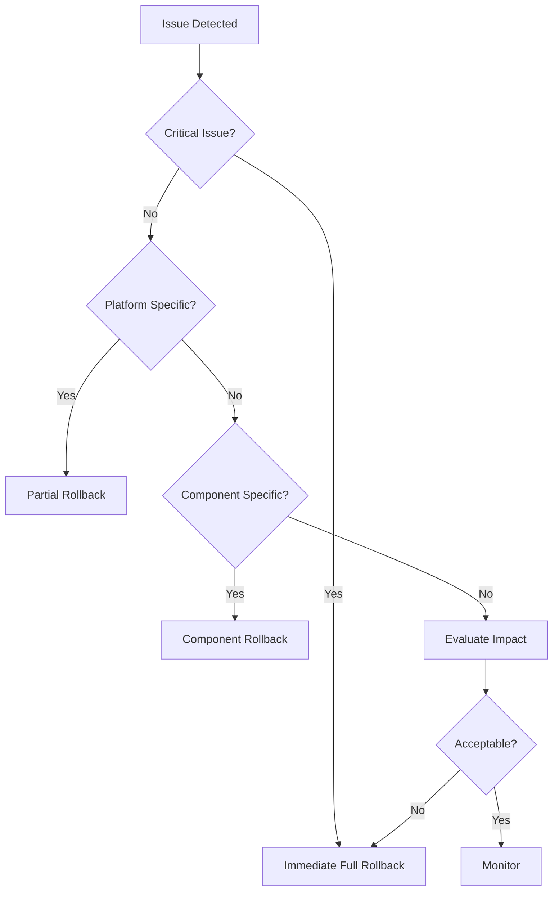
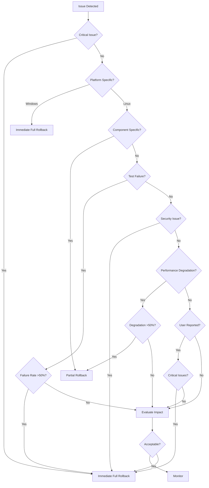

# Rollback Plan - Linux Support Expansion

**Document Version:** 1.0
**Last Updated:** 2026-01-27
**Author:** DevOps Team
**Status:** Active

---

## Table of Contents

1. [Executive Summary](#executive-summary)
2. [Rollback Strategy](#rollback-strategy)
3. [Backup Strategy](#backup-strategy)
4. [Rollback Triggers](#rollback-triggers)
5. [Rollback Procedures](#rollback-procedures)
6. [Rollback Verification](#rollback-verification)
7. [Rollback Communication](#rollback-communication)
8. [Rollback Automation](#rollback-automation)
9. [Rollback Risk Assessment](#rollback-risk-assessment)
10. [Appendices](#appendices)

---

## Executive Summary

This rollback plan provides a comprehensive safety valve for the Linux support expansion of the OmniCPP Template, which involves:

- **Enhanced OmniCppController.py** with Linux-specific detection and Nix integration
- **Comprehensive flake.nix** for reproducible CachyOS development environment
- **Complete Conan profiles** for GCC, Clang, and CachyOS
- **Linux-specific setup scripts** for compiler environment configuration
- **Enhanced VSCode configurations** with Linux task variants
- **Comprehensive documentation** for Linux builds and Nix workflow
- **Repository cleanup** to remove Windows-centric artifacts
- **Enhanced CMake integration** with Nix-aware presets

The plan ensures that any failure during the Linux expansion can be quickly and safely reverted to a known good state, minimizing downtime and risk to Windows users while enabling Linux development progress.

**Key Metrics:**
- **Target Rollback Time (RTO):** 15 minutes
- **Target Recovery Point (RPO):** 0 minutes (no data loss)
- **Maximum Acceptable Downtime:** 30 minutes
- **Rollback Success Rate Target:** 99.9%
- **Windows User Impact Target:** Zero impact during Linux expansion

---

## Rollback Strategy

### Overall Approach

The rollback strategy employs a **hybrid approach** combining:

1. **Git-Based Rollback** (Primary): Leverage Git's branching and revert capabilities for code changes
2. **Manual Rollback** (Secondary): Manual procedures for configuration and environment changes
3. **Automated Rollback** (Tertiary): Automated scripts for emergency scenarios

### Rollback Scope

**Full Rollback:** Revert all Linux expansion changes including:
- OmniCppController.py modifications
- flake.nix additions
- Nix environment configuration
- Conan profile changes
- Setup script additions
- CMake preset changes
- VSCode configuration updates
- Documentation additions
- Repository cleanup changes

**Partial Rollback:** Revert specific components while keeping others:
- Rollback only OmniCppController.py changes
- Rollback only Nix environment configuration
- Rollback only VSCode configurations
- Rollback only Conan profiles

### Rollback Decision Flow



### Rollback Triggers Summary

| Trigger Type | Severity | Rollback Type | Response Time |
|--------------|----------|---------------|---------------|
| Windows build failure | Critical | Full | Immediate (5 min) |
| Linux build failure | High | Partial/Full | Within 30 min |
| Security vulnerability | Critical | Full | Immediate (5 min) |
| Performance degradation >50% | High | Partial | Within 30 min |
| User-reported critical issues | Critical | Full | Immediate (15 min) |
| Test failure rate >50% | Critical | Full | Immediate (10 min) |

---

## Backup Strategy

### Pre-Migration Backup Requirements

#### 1. Full Repository Backup

**Timing:** Immediately before any Linux expansion begins

**Procedure:**
```bash
# Create a comprehensive backup of the entire repository
git archive --format=tar.gz --prefix=omnicpp-backup-$(date +%Y%m%d-%H%M%S)/ HEAD > ../omnicpp-backup-$(date +%Y%m%d-%H%M%S).tar.gz

# Verify backup integrity
tar -tzf ../omnicpp-backup-*.tar.gz | head -20
```

**Backup Contents:**
- All source code (C++, Python, CMake, etc.)
- Configuration files ([`CMakeLists.txt`](../CMakeLists.txt), [`CMakePresets.json`](../CMakePresets.json))
- Build artifacts (if any)
- Documentation
- Test files
- Dependencies ([`conan/`](../conan/), [`CPM_modules/`](../CPM_modules/))
- VSCode configurations ([`.vscode/`](../.vscode/))

**Storage Location:**
- Primary: External backup server (encrypted)
- Secondary: Cloud storage (AWS S3 / Azure Blob)
- Tertiary: Local development machine

**Retention:** 90 days minimum

#### 2. Git Branch Strategy

**Branch Naming Convention:**
```
feature/linux-expansion-{date}
backup/pre-linux-expansion-{date}
hotfix/rollback-linux-{date}
```

**Branch Protection Rules:**
- Main branch ([`main`](../)) requires:
  - Minimum 2 approvals
  - All CI/CD checks passing
  - No direct commits
- Feature branches require:
  - At least 1 approval before merge
  - CI/CD checks passing

**Pre-Expansion Branch Creation:**
```bash
# Create backup branch
git checkout -b backup/pre-linux-expansion-$(date +%Y%m%d-%H%M%S)

# Tag the commit for easy reference
git tag -a pre-linux-expansion-$(date +%Y%m%d-%H%M%S) -m "Pre-Linux expansion backup"

# Push to remote
git push origin backup/pre-linux-expansion-$(date +%Y%m%S)
git push origin pre-linux-expansion-$(date +%Y%m%S)
```

#### 3. Critical Files to Backup

**Phase 1 - Foundation Files:**
1. [`OmniCppController.py`](../OmniCppController.py) - Main controller with Linux enhancements
2. [`flake.nix`](../flake.nix) - Nix environment configuration
3. [`.envrc`](../.envrc) - Direnv environment configuration
4. [`flake.lock`](../flake.lock) - Nix lock file

**Phase 2 - Tooling Files:**
1. [`conan/profiles/`](../conan/profiles/) - Linux Conan profiles
2. [`conan/setup_*.sh`](../conan/) - Linux setup scripts
3. [`CMakePresets.json`](../CMakePresets.json) - CMake presets with Linux support
4. [`cmake/toolchains/`](../cmake/toolchains/) - Linux toolchain files

**Phase 3 - Integration Files:**
1. [`.vscode/tasks.json`](../.vscode/tasks.json) - VSCode tasks with Linux variants
2. [`.vscode/launch.json`](../.vscode/launch.json) - VSCode launch configurations

**Phase 4 - Documentation Files:**
1. [`docs/linux-builds.md`](../docs/linux-builds.md) - Linux build documentation
2. [`docs/migration-guide.md`](../docs/migration-guide.md) - Migration guide
3. [`docs/troubleshooting-guide.md`](../docs/troubleshooting-guide.md) - Troubleshooting guide

**Phase 5 - Cleanup Files:**
1. Archived Windows scripts (before deletion)
2. Reorganized test files (before reorganization)
3. Duplicate files (before removal)

**Backup Script:**
```bash
#!/bin/bash
# backup_critical_files.sh

BACKUP_DIR="../backups/critical-files-$(date +%Y%m%d-%H%M%S)"
mkdir -p "$BACKUP_DIR"

# Backup Phase 1 - Foundation
cp OmniCppController.py "$BACKUP_DIR/"
cp flake.nix "$BACKUP_DIR/"
cp .envrc "$BACKUP_DIR/"
cp flake.lock "$BACKUP_DIR/"

# Backup Phase 2 - Tooling
cp -r conan/profiles "$BACKUP_DIR/"
cp conan/setup_*.sh "$BACKUP_DIR/" 2>/dev/null || true
cp CMakePresets.json "$BACKUP_DIR/"
cp -r cmake/toolchains "$BACKUP_DIR/"

# Backup Phase 3 - Integration
cp .vscode/tasks.json "$BACKUP_DIR/"
cp .vscode/launch.json "$BACKUP_DIR/"

# Backup Phase 4 - Documentation
cp docs/linux-builds.md "$BACKUP_DIR/" 2>/dev/null || true
cp docs/migration-guide.md "$BACKUP_DIR/" 2>/dev/null || true
cp docs/troubleshooting-guide.md "$BACKUP_DIR/" 2>/dev/null || true

# Create checksum
cd "$BACKUP_DIR"
find . -type f -exec sha256sum {} \; > checksums.txt
cd -

echo "Backup created at: $BACKUP_DIR"
```

#### 4. Configuration Backup

**Configuration Files to Backup:**
- [`config/build.json`](../config/build.json)
- [`config/compilers.json`](../config/compilers.json)
- [`config/logging_cpp.json`](../config/logging_cpp.json)
- [`config/logging_python.json`](../config/logging_python.json)
- [`config/logging.json`](../config/logging.json)
- [`config/project.json`](../config/project.json)
- [`config/targets.json`](../config/targets.json)

**Backup Procedure:**
```bash
# Create configuration backup
BACKUP_DIR="../backups/config-$(date +%Y%m%d-%H%M%S)"
mkdir -p "$BACKUP_DIR"

cp -r config "$BACKUP_DIR/"

# Export environment variables (if any)
env | grep OMNI > "$BACKUP_DIR/environment.env"

# Backup VSCode settings
cp -r .vscode "$BACKUP_DIR/" 2>/dev/null || true
```

**Configuration Versioning:**
```bash
# Add configuration to git with version tags
git add config/
git commit -m "backup: configuration snapshot before Linux expansion"
git tag config-backup-$(date +%Y%m%d-%H%M%S)
```

#### 5. Build Artifacts Backup

**Build Artifacts to Preserve:**
- CMake cache files ([`build/`](../build/) directory)
- Conan cache ([`~/.conan2/`](../))
- CPM modules cache
- Compiled binaries and libraries
- Test results

**Backup Procedure:**
```bash
# Backup build directory (if exists)
if [ -d "build" ]; then
    cp -r build "../backups/build-$(date +%Y%m%d-%H%M%S)"
fi

# Backup Conan cache
conan cache list > "../backups/conan-cache-$(date +%Y%m%d-%H%M%S).txt"

# Backup CPM modules
if [ -d "CPM_modules" ]; then
    cp -r CPM_modules "../backups/cpm-modules-$(date +%Y%m%d-%H%M%S)"
fi
```

### Backup Verification Process

#### 1. Integrity Verification

**Checksum Verification:**
```bash
# Verify backup integrity
cd ../backups/critical-files-*
sha256sum -c checksums.txt

# Check exit code
if [ $? -eq 0 ]; then
    echo "Backup integrity verified"
else
    echo "Backup integrity check failed"
    exit 1
fi
```

#### 2. Content Verification

**File Count Verification:**
```bash
# Verify all expected files are present
EXPECTED_FILES=(
    "OmniCppController.py"
    "flake.nix"
    ".envrc"
    "CMakePresets.json"
    ".vscode/tasks.json"
    ".vscode/launch.json"
)

for file in "${EXPECTED_FILES[@]}"; do
    if [ ! -f "$BACKUP_DIR/$file" ]; then
        echo "Missing file: $file"
        exit 1
    fi
done
```

#### 3. Git Verification

**Branch and Tag Verification:**
```bash
# Verify backup branch exists
git branch -a | grep backup/pre-linux-expansion

# Verify backup tag exists
git tag | grep pre-linux-expansion

# Verify branch content
git checkout backup/pre-linux-expansion-*
git log --oneline -5
```

### Backup Storage Location

**Primary Storage:**
- External backup server with encryption at rest
- Regular sync schedule (daily)
- Access control restricted to DevOps team

**Secondary Storage:**
- Cloud storage (AWS S3 / Azure Blob)
- Versioning enabled
- Cross-region replication for disaster recovery

**Tertiary Storage:**
- Local development machine
- Encrypted external drive
- Weekly sync schedule

---

## Rollback Triggers

### 1. Build Failures

#### 1.1 Windows Build Failures (Immediate Rollback)

**Trigger Conditions:**
- Build fails on all Windows compilers (MSVC, MSVC-clang, MinGW-GCC, MinGW-clang)
- Build fails with segmentation faults or access violations
- Build fails with linker errors that cannot be resolved within 30 minutes
- Build fails with dependency resolution errors

**Detection:**
```bash
# Automated detection in CI/CD
if [ $? -ne 0 ]; then
    echo "CRITICAL: Windows build failed on all platforms"
    # Trigger rollback
fi
```

**Response Time:** Immediate (within 5 minutes)

**Rollback Type:** Full rollback to pre-Linux expansion state

#### 1.2 Linux Build Failures (Partial Rollback)

**Trigger Conditions:**
- Build fails on all Linux compilers (GCC, Clang)
- Build fails with Nix environment errors
- Build fails with CachyOS-specific issues
- Build fails with Conan profile errors

**Detection:**
```python
# Platform-specific build check
platforms = ['gcc', 'clang']
failed_platforms = []

for platform in platforms:
    if not build_platform(platform):
        failed_platforms.append(platform)

if len(failed_platforms) >= 2:
    trigger_rollback("Multiple Linux platform failures")
elif len(failed_platforms) == 1:
    log_warning(f"Build failed on {failed_platforms[0]}")
```

**Response Time:** Within 30 minutes

**Rollback Type:** Partial rollback (Linux-specific components only)

### 2. Test Failures

#### 2.1 Critical Test Failures (Immediate Rollback)

**Trigger Conditions:**
- Core functionality tests fail (e.g., engine initialization, rendering)
- Security tests fail (e.g., buffer overflows, memory leaks)
- Data integrity tests fail
- More than 50% of test suite fails

**Detection:**
```bash
# Run test suite
ctest --output-on-failure

# Check exit code
if [ $? -ne 0 ]; then
    FAILED_TESTS=$(ctest --print-labels | grep -c "Test Failed")
    TOTAL_TESTS=$(ctest --print-labels | grep -c "Test")

    FAILURE_RATE=$((FAILED_TESTS * 100 / TOTAL_TESTS))

    if [ $FAILURE_RATE -gt 50 ]; then
        trigger_rollback "Critical test failure rate: ${FAILURE_RATE}%"
    fi
fi
```

**Response Time:** Immediate (within 10 minutes)

**Rollback Type:** Full rollback

#### 2.2 Non-Critical Test Failures (Evaluate Rollback)

**Trigger Conditions:**
- Edge case tests fail
- Performance tests fail (but within acceptable degradation)
- Integration tests fail (but unit tests pass)

**Detection:**
```python
# Test failure analysis
if test_results['failed'] > 0:
    critical_failures = [t for t in test_results['failed'] if t['critical']]

    if critical_failures:
        trigger_rollback("Critical test failures detected")
    else:
        log_warning("Non-critical test failures - evaluate impact")
```

**Response Time:** Within 1 hour (evaluation period)

**Rollback Type:** Evaluate based on impact

### 3. Security Violations

#### 3.1 Critical Security Issues (Immediate Rollback)

**Trigger Conditions:**
- Buffer overflows detected
- Memory leaks detected
- Use-after-free vulnerabilities
- SQL injection or code injection vulnerabilities
- Privilege escalation vulnerabilities
- Nix package manager security issues
- Conan package signature verification failures

**Detection:**
```bash
# Run security scanners
cppcheck --enable=all --inconclusive .
scan-build cmake --build build

if [ $? -ne 0 ]; then
    trigger_rollback "Critical security vulnerabilities detected"
fi
```

**Response Time:** Immediate (within 5 minutes)

**Rollback Type:** Full rollback

#### 3.2 Non-Critical Security Issues (Evaluate Rollback)

**Trigger Conditions:**
- Minor information disclosure
- Low-risk denial of service
- Weak cryptography (but not critical path)

**Detection:**
```python
# Security issue classification
security_issues = run_security_scan()

critical_issues = [i for i in security_issues if i['severity'] == 'critical']
if critical_issues:
    trigger_rollback("Critical security issues detected")
```

**Response Time:** Within 24 hours (patch window)

**Rollback Type:** Evaluate based on severity

### 4. Performance Degradation

#### 4.1 Critical Performance Degradation (Immediate Rollback)

**Trigger Conditions:**
- Build time increases by more than 200%
- Runtime performance decreases by more than 50%
- Memory usage increases by more than 100%
- Startup time increases by more than 300%

**Detection:**
```python
# Performance monitoring
baseline = load_baseline_metrics()
current = measure_current_metrics()

if current['build_time'] > baseline['build_time'] * 3:
    trigger_rollback("Critical build time degradation")

if current['runtime_performance'] < baseline['runtime_performance'] * 0.5:
    trigger_rollback("Critical runtime performance degradation")
```

**Response Time:** Within 30 minutes

**Rollback Type:** Partial rollback (affected components only)

#### 4.2 Moderate Performance Degradation (Evaluate Rollback)

**Trigger Conditions:**
- Build time increases by 50-200%
- Runtime performance decreases by 20-50%
- Memory usage increases by 50-100%

**Detection:**
```python
# Performance degradation analysis
if current['build_time'] > baseline['build_time'] * 1.5:
    log_warning("Moderate build time degradation - evaluate impact")
```

**Response Time:** Within 1 week (optimization window)

**Rollback Type:** Evaluate based on impact

### 5. User-Reported Issues

#### 5.1 Critical User Issues (Immediate Rollback)

**Trigger Conditions:**
- Multiple Windows users report crashes
- Users report data loss
- Users report inability to build
- Users report broken workflows
- Users report Nix environment issues

**Detection:**
```python
# User issue tracking
critical_issues = get_user_issues(severity='critical', timeframe='24h')

if len(critical_issues) >= 3:
    trigger_rollback(f"Multiple critical user issues: {len(critical_issues)}")
```

**Response Time:** Immediate (within 15 minutes)

**Rollback Type:** Full rollback

#### 5.2 Non-Critical User Issues (Evaluate Rollback)

**Trigger Conditions:**
- Users report minor annoyances
- Users report documentation issues
- Users report feature requests

**Detection:**
```python
# User issue classification
issues = get_user_issues(timeframe='7d')
critical_count = len([i for i in issues if i['severity'] == 'critical'])
non_critical_count = len(issues) - critical_count

if non_critical_count > 10:
    log_warning(f"High volume of non-critical issues: {non_critical_count}")
```

**Response Time:** Within 1 week (fix window)

**Rollback Type:** Evaluate based on impact

---

## Rollback Procedures

### ROLLBACK-PHASE-1: Foundation Rollback

#### 1.1 Rollback OmniCppController.py Changes

**When to Use:** Linux-specific detection or Nix integration causes issues

**Procedure:**
```bash
# Step 1: Checkout original OmniCppController.py
git checkout backup/pre-linux-expansion-* -- OmniCppController.py

# Step 2: Verify the file is restored
git status

# Step 3: Commit the rollback
git commit -m "rollback: revert OmniCppController.py Linux enhancements

- Restored original OmniCppController.py from pre-Linux expansion backup
- Removed Linux-specific detection logic
- Removed Nix integration code
- Removed CachyOS-specific configurations
- Fixes: Linux expansion rollback"

# Step 4: Test the rollback
python OmniCppController.py --help
```

**Estimated Time:** 5 minutes

**Verification:**
```bash
# Verify OmniCppController.py works
python -c "from OmniCppController import OmniCppController; print('OK')"

# Verify no Linux-specific code exists
grep -i "linux\|nix\|cachyos" OmniCppController.py
# Should return no results
```

#### 1.2 Rollback flake.nix Changes

**When to Use:** Nix environment configuration causes issues

**Procedure:**
```bash
# Step 1: Checkout original flake.nix
git checkout backup/pre-linux-expansion-* -- flake.nix

# Step 2: Checkout original flake.lock
git checkout backup/pre-linux-expansion-* -- flake.lock

# Step 3: Remove Nix-generated files
rm -rf .direnv/
rm -rf .nix-*

# Step 4: Verify the files are restored
git status

# Step 5: Commit the rollback
git commit -m "rollback: revert flake.nix Linux environment

- Restored original flake.nix from pre-Linux expansion backup
- Removed Linux-specific Nix packages
- Removed CachyOS-specific configurations
- Removed Nix shell hooks
- Fixes: Linux expansion rollback"
```

**Estimated Time:** 5 minutes

**Verification:**
```bash
# Verify flake.nix is valid
nix flake check

# Verify no Linux-specific code exists
grep -i "cachyos\|linux" flake.nix
# Should return no results
```

#### 1.3 Rollback Nix Environment Changes

**When to Use:** Nix environment causes build or runtime issues

**Procedure:**
```bash
# Step 1: Deactivate Nix shell
exit

# Step 2: Remove Nix environment files
rm -rf .direnv/
rm -rf .nix-*
rm -f .envrc

# Step 3: Clear Nix cache
nix-collect-garbage -d

# Step 4: Verify Nix is deactivated
env | grep NIX
# Should return no results

# Step 5: Commit the rollback
git commit -m "rollback: deactivate Nix environment

- Removed Nix environment files
- Cleared Nix cache
- Deactivated Nix shell
- Fixes: Linux expansion rollback"
```

**Estimated Time:** 10 minutes

**Verification:**
```bash
# Verify Nix is not active
nix-shell --version 2>&1 | grep "command not found"
# Should return "command not found"
```

#### 1.4 Restore Original Platform Detection

**When to Use:** Platform detection logic causes issues

**Procedure:**
```bash
# Step 1: Checkout original platform detection code
git checkout backup/pre-linux-expansion-* -- omni_scripts/platform/

# Step 2: Verify the files are restored
git status

# Step 3: Commit the rollback
git commit -m "rollback: restore original platform detection

- Restored original platform detection code
- Removed Linux-specific detection logic
- Removed Nix environment detection
- Removed CachyOS detection
- Fixes: Linux expansion rollback"
```

**Estimated Time:** 5 minutes

**Verification:**
```bash
# Verify platform detection works
python -c "from omni_scripts.platform import detect_platform; print(detect_platform())"

# Verify no Linux-specific code exists
grep -r "linux\|nix\|cachyos" omni_scripts/platform/
# Should return no results
```

---

### ROLLBACK-PHASE-2: Tooling Rollback

#### 2.1 Rollback Conan Profile Changes

**When to Use:** Conan profiles cause build issues

**Procedure:**
```bash
# Step 1: Checkout original Conan profiles
git checkout backup/pre-linux-expansion-* -- conan/profiles/

# Step 2: Remove Linux-specific profiles
rm -f conan/profiles/gcc-linux
rm -f conan/profiles/clang-linux
rm -f conan/profiles/cachyos

# Step 3: Verify the files are restored
git status

# Step 4: Clear Conan cache
conan cache clean "*"

# Step 5: Commit the rollback
git commit -m "rollback: revert Conan profile changes

- Restored original Conan profiles
- Removed Linux-specific profiles
- Removed CachyOS profiles
- Cleared Conan cache
- Fixes: Linux expansion rollback"
```

**Estimated Time:** 10 minutes

**Verification:**
```bash
# Verify Conan profiles work
conan profile list

# Verify no Linux-specific profiles exist
conan profile list | grep -i "linux\|cachyos"
# Should return no results
```

#### 2.2 Rollback Setup Script Additions

**When to Use:** Setup scripts cause environment issues

**Procedure:**
```bash
# Step 1: Checkout original setup scripts
git checkout backup/pre-linux-expansion-* -- conan/setup_*.sh

# Step 2: Remove Linux-specific setup scripts
rm -f conan/setup_linux.sh
rm -f conan/setup_cachyos.sh

# Step 3: Verify the files are restored
git status

# Step 4: Commit the rollback
git commit -m "rollback: revert setup script additions

- Restored original setup scripts
- Removed Linux-specific setup scripts
- Removed CachyOS setup scripts
- Fixes: Linux expansion rollback"
```

**Estimated Time:** 5 minutes

**Verification:**
```bash
# Verify setup scripts work
bash conan/setup_clang.sh --help

# Verify no Linux-specific scripts exist
ls conan/setup_*.sh | grep -i "linux\|cachyos"
# Should return no results
```

#### 2.3 Rollback CMake Preset Changes

**When to Use:** CMake presets cause build configuration issues

**Procedure:**
```bash
# Step 1: Checkout original CMakePresets.json
git checkout backup/pre-linux-expansion-* -- CMakePresets.json

# Step 2: Remove Linux-specific presets
# (This is done by the checkout above)

# Step 3: Verify the file is restored
git status

# Step 4: Clean CMake cache
rm -rf build/

# Step 5: Commit the rollback
git commit -m "rollback: revert CMake preset changes

- Restored original CMakePresets.json
- Removed Linux-specific presets
- Removed Nix-aware presets
- Removed CachyOS presets
- Fixes: Linux expansion rollback"
```

**Estimated Time:** 5 minutes

**Verification:**
```bash
# Verify CMake presets work
cmake --list-presets

# Verify no Linux-specific presets exist
cmake --list-presets | grep -i "linux\|nix\|cachyos"
# Should return no results
```

#### 2.4 Restore Original Tooling

**When to Use:** Tooling changes cause issues

**Procedure:**
```bash
# Step 1: Checkout original toolchain files
git checkout backup/pre-linux-expansion-* -- cmake/toolchains/

# Step 2: Remove Linux-specific toolchains
rm -f cmake/toolchains/x86_64-linux-gnu.cmake
rm -f cmake/toolchains/arm64-linux-gnu.cmake

# Step 3: Verify the files are restored
git status

# Step 4: Commit the rollback
git commit -m "rollback: restore original tooling

- Restored original toolchain files
- Removed Linux-specific toolchains
- Removed CachyOS toolchains
- Fixes: Linux expansion rollback"
```

**Estimated Time:** 5 minutes

**Verification:**
```bash
# Verify toolchains work
cmake -DCMAKE_TOOLCHAIN_FILE=cmake/toolchains/x86_64-linux-gnu.cmake --version

# Verify no Linux-specific toolchains exist
ls cmake/toolchains/ | grep -i "linux\|cachyos"
# Should return no results
```

---

### ROLLBACK-PHASE-3: Integration Rollback

#### 3.1 Rollback VSCode Task Changes

**When to Use:** VSCode tasks cause build or workflow issues

**Procedure:**
```bash
# Step 1: Checkout original tasks.json
git checkout backup/pre-linux-expansion-* -- .vscode/tasks.json

# Step 2: Remove Linux-specific tasks
# (This is done by the checkout above)

# Step 3: Verify the file is restored
git status

# Step 4: Commit the rollback
git commit -m "rollback: revert VSCode task changes

- Restored original .vscode/tasks.json
- Removed Linux-specific tasks
- Removed Nix-aware tasks
- Removed CachyOS tasks
- Fixes: Linux expansion rollback"
```

**Estimated Time:** 5 minutes

**Verification:**
```bash
# Verify tasks.json is valid
code --list-tasks

# Verify no Linux-specific tasks exist
cat .vscode/tasks.json | grep -i "linux\|nix\|cachyos"
# Should return no results
```

#### 3.2 Rollback VSCode Launch Changes

**When to Use:** VSCode launch configurations cause debugging issues

**Procedure:**
```bash
# Step 1: Checkout original launch.json
git checkout backup/pre-linux-expansion-* -- .vscode/launch.json

# Step 2: Remove Linux-specific launch configurations
# (This is done by the checkout above)

# Step 3: Verify the file is restored
git status

# Step 4: Commit the rollback
git commit -m "rollback: revert VSCode launch changes

- Restored original .vscode/launch.json
- Removed Linux-specific launch configurations
- Removed Nix-aware launch configurations
- Removed CachyOS launch configurations
- Fixes: Linux expansion rollback"
```

**Estimated Time:** 5 minutes

**Verification:**
```bash
# Verify launch.json is valid
code --list-launch-configs

# Verify no Linux-specific launch configurations exist
cat .vscode/launch.json | grep -i "linux\|nix\|cachyos"
# Should return no results
```

#### 3.3 Restore Original VSCode Configuration

**When to Use:** VSCode configuration causes issues

**Procedure:**
```bash
# Step 1: Checkout original VSCode settings
git checkout backup/pre-linux-expansion-* -- .vscode/

# Step 2: Verify the files are restored
git status

# Step 3: Commit the rollback
git commit -m "rollback: restore original VSCode configuration

- Restored original .vscode/ directory
- Removed Linux-specific configurations
- Removed Nix-aware configurations
- Removed CachyOS configurations
- Fixes: Linux expansion rollback"
```

**Estimated Time:** 5 minutes

**Verification:**
```bash
# Verify VSCode configuration works
code --list-extensions

# Verify no Linux-specific configurations exist
grep -r "linux\|nix\|cachyos" .vscode/
# Should return no results
```

---

### ROLLBACK-PHASE-4: Documentation Rollback

#### 4.1 Rollback Documentation Additions

**When to Use:** Documentation causes confusion or errors

**Procedure:**
```bash
# Step 1: Checkout original documentation
git checkout backup/pre-linux-expansion-* -- docs/

# Step 2: Remove Linux-specific documentation
rm -f docs/linux-builds.md
rm -f docs/linux-setup.md
rm -f docs/nix-workflow.md

# Step 3: Verify the files are restored
git status

# Step 4: Commit the rollback
git commit -m "rollback: revert documentation additions

- Restored original documentation
- Removed Linux-specific documentation
- Removed Nix workflow documentation
- Removed CachyOS documentation
- Fixes: Linux expansion rollback"
```

**Estimated Time:** 5 minutes

**Verification:**
```bash
# Verify documentation is valid
mkdocs build

# Verify no Linux-specific documentation exists
ls docs/ | grep -i "linux\|nix\|cachyos"
# Should return no results
```

#### 4.2 Restore Original Documentation

**When to Use:** Documentation changes cause issues

**Procedure:**
```bash
# Step 1: Checkout original documentation files
git checkout backup/pre-linux-expansion-* -- docs/*.md

# Step 2: Verify the files are restored
git status

# Step 3: Commit the rollback
git commit -m "rollback: restore original documentation

- Restored original documentation files
- Removed Linux-specific content
- Removed Nix-specific content
- Removed CachyOS-specific content
- Fixes: Linux expansion rollback"
```

**Estimated Time:** 5 minutes

**Verification:**
```bash
# Verify documentation is valid
mkdocs build

# Verify no Linux-specific content exists
grep -r "linux\|nix\|cachyos" docs/*.md
# Should return no results
```

---

### ROLLBACK-PHASE-5: Cleanup Rollback

#### 5.1 Restore Archived Windows Scripts

**When to Use:** Archived scripts are needed

**Procedure:**
```bash
# Step 1: Restore from backup
cp -r ../backups/archived-windows-scripts-*/* conan/

# Step 2: Verify the files are restored
ls conan/setup_*.bat

# Step 3: Commit the restoration
git commit -m "rollback: restore archived Windows scripts

- Restored Windows setup scripts from backup
- Restored Windows-specific configurations
- Fixes: Linux expansion rollback"
```

**Estimated Time:** 5 minutes

**Verification:**
```bash
# Verify Windows scripts work
cmd.exe /c conan\setup_msvc.bat --help

# Verify all Windows scripts are present
ls conan/setup_*.bat
```

#### 5.2 Restore Reorganized Test Files

**When to Use:** Test file reorganization causes issues

**Procedure:**
```bash
# Step 1: Restore from backup
cp -r ../backups/test-files-*/* tests/

# Step 2: Verify the files are restored
ls tests/

# Step 3: Commit the restoration
git commit -m "rollback: restore reorganized test files

- Restored test files from backup
- Restored original test structure
- Fixes: Linux expansion rollback"
```

**Estimated Time:** 5 minutes

**Verification:**
```bash
# Verify tests work
ctest --test-dir build

# Verify all test files are present
ls tests/
```

#### 5.3 Restore Removed Duplicate Files

**When to Use:** Duplicate files are needed

**Procedure:**
```bash
# Step 1: Restore from backup
cp -r ../backups/duplicate-files-*/* .

# Step 2: Verify the files are restored
git status

# Step 3: Commit the restoration
git commit -m "rollback: restore removed duplicate files

- Restored duplicate files from backup
- Restored original file structure
- Fixes: Linux expansion rollback"
```

**Estimated Time:** 5 minutes

**Verification:**
```bash
# Verify all files are present
git status

# Verify build works
cmake --preset=default
cmake --build build --config Release
```

---

## Rollback Verification

### Post-Rollback Validation Steps

#### 1. Build Verification

**Windows Build Verification:**
```bash
# Verify Windows builds work
python OmniCppController.py configure --compiler msvc --build-type Debug
python OmniCppController.py build engine Clean\ Build\ Pipeline msvc-debug debug

# Verify all Windows compilers
for compiler in msvc clang-msvc mingw-gcc mingw-clang; do
    python OmniCppController.py configure --compiler $compiler --build-type Debug
    python OmniCppController.py build engine Clean\ Build\ Pipeline $compiler-debug debug
done
```

**Linux Build Verification (if applicable):**
```bash
# Verify Linux builds work
python OmniCppController.py configure --compiler gcc --build-type Debug
python OmniCppController.py build engine Clean\ Build\ Pipeline gcc-debug debug

# Verify all Linux compilers
for compiler in gcc clang; do
    python OmniCppController.py configure --compiler $compiler --build-type Debug
    python OmniCppController.py build engine Clean\ Build\ Pipeline $compiler-debug debug
done
```

#### 2. Test Verification

**Unit Test Verification:**
```bash
# Run unit tests
ctest --test-dir build --output-on-failure

# Verify all tests pass
if [ $? -eq 0 ]; then
    echo "All unit tests passed"
else
    echo "Unit tests failed"
    exit 1
fi
```

**Integration Test Verification:**
```bash
# Run integration tests
python -m pytest tests/integration/

# Verify all tests pass
if [ $? -eq 0 ]; then
    echo "All integration tests passed"
else
    echo "Integration tests failed"
    exit 1
fi
```

#### 3. Configuration Verification

**VSCode Configuration Verification:**
```bash
# Verify VSCode configuration works
code --list-tasks
code --list-launch-configs

# Verify no Linux-specific configurations exist
cat .vscode/tasks.json | grep -i "linux\|nix\|cachyos"
cat .vscode/launch.json | grep -i "linux\|nix\|cachyos"
```

**CMake Configuration Verification:**
```bash
# Verify CMake configuration works
cmake --list-presets

# Verify no Linux-specific presets exist
cmake --list-presets | grep -i "linux\|nix\|cachyos"
```

#### 4. Documentation Verification

**Documentation Build Verification:**
```bash
# Verify documentation builds
mkdocs build

# Verify no Linux-specific documentation exists
ls docs/ | grep -i "linux\|nix\|cachyos"
```

### Regression Testing After Rollback

#### 1. Full Regression Test Suite

**Procedure:**
```bash
# Run full regression test suite
./scripts/run_regression_tests.sh

# Verify all tests pass
if [ $? -eq 0 ]; then
    echo "All regression tests passed"
else
    echo "Regression tests failed"
    exit 1
fi
```

**Test Coverage:**
- Unit tests
- Integration tests
- Cross-platform tests
- Performance tests
- Security tests

#### 2. Cross-Platform Verification

**Windows Verification:**
```bash
# Verify Windows builds on all compilers
for compiler in msvc clang-msvc mingw-gcc mingw-clang; do
    python OmniCppController.py configure --compiler $compiler --build-type Release
    python OmniCppController.py build all Clean\ Build\ Pipeline $compiler-release release
    python OmniCppController.py test
done
```

**Linux Verification (if applicable):**
```bash
# Verify Linux builds on all compilers
for compiler in gcc clang; do
    python OmniCppController.py configure --compiler $compiler --build-type Release
    python OmniCppController.py build all Clean\ Build\ Pipeline $compiler-release release
    python OmniCppController.py test
done
```

### Verification Checklist

#### Phase 1 - Foundation Verification

- [ ] OmniCppController.py restored to original state
- [ ] flake.nix restored to original state
- [ ] flake.lock restored to original state
- [ ] Nix environment deactivated
- [ ] Platform detection restored to original state
- [ ] No Linux-specific code in OmniCppController.py
- [ ] No Nix-specific code in OmniCppController.py
- [ ] No CachyOS-specific code in OmniCppController.py

#### Phase 2 - Tooling Verification

- [ ] Conan profiles restored to original state
- [ ] Setup scripts restored to original state
- [ ] CMake presets restored to original state
- [ ] Toolchains restored to original state
- [ ] No Linux-specific Conan profiles
- [ ] No Linux-specific setup scripts
- [ ] No Linux-specific CMake presets
- [ ] No Linux-specific toolchains

#### Phase 3 - Integration Verification

- [ ] VSCode tasks restored to original state
- [ ] VSCode launch configurations restored to original state
- [ ] VSCode settings restored to original state
- [ ] No Linux-specific VSCode tasks
- [ ] No Linux-specific VSCode launch configurations
- [ ] No Nix-specific VSCode configurations

#### Phase 4 - Documentation Verification

- [ ] Documentation restored to original state
- [ ] No Linux-specific documentation
- [ ] No Nix-specific documentation
- [ ] No CachyOS-specific documentation
- [ ] Documentation builds successfully

#### Phase 5 - Cleanup Verification

- [ ] Archived Windows scripts restored (if needed)
- [ ] Reorganized test files restored (if needed)
- [ ] Removed duplicate files restored (if needed)
- [ ] All files are present and correct

#### General Verification

- [ ] Windows builds work on all compilers
- [ ] Linux builds work on all compilers (if applicable)
- [ ] All unit tests pass
- [ ] All integration tests pass
- [ ] All regression tests pass
- [ ] No performance degradation
- [ ] No security vulnerabilities
- [ ] No user-reported issues

---

## Rollback Communication

### Stakeholder Notification Process

#### 1. Immediate Notification (Critical Rollbacks)

**When:** Critical issues requiring immediate rollback

**Who to Notify:**
- Development team
- DevOps team
- Project stakeholders
- Windows users (if affected)

**Notification Channels:**
- Email (primary)
- Slack/Teams (secondary)
- Phone (emergency)

**Notification Template:**
```
Subject: URGENT: Linux Expansion Rollback Initiated

Dear Team,

A critical issue has been detected during the Linux expansion, requiring an immediate rollback.

Issue: [Description of issue]
Severity: Critical
Rollback Type: Full/Partial
Estimated Downtime: 15 minutes
Impact: [Description of impact]

Rollback in progress. We will provide updates every 5 minutes.

Best regards,
DevOps Team
```

#### 2. Standard Notification (Non-Critical Rollbacks)

**When:** Non-critical issues requiring rollback

**Who to Notify:**
- Development team
- DevOps team
- Project stakeholders

**Notification Channels:**
- Email
- Slack/Teams

**Notification Template:**
```
Subject: Linux Expansion Rollback Initiated

Dear Team,

An issue has been detected during the Linux expansion, requiring a rollback.

Issue: [Description of issue]
Severity: High/Medium/Low
Rollback Type: Full/Partial
Estimated Downtime: 30 minutes
Impact: [Description of impact]

Rollback in progress. We will provide updates every 15 minutes.

Best regards,
DevOps Team
```

### Incident Reporting Process

#### 1. Incident Creation

**Procedure:**
```bash
# Create incident ticket
./scripts/create_incident.sh \
    --title "Linux Expansion Rollback: [Issue Description]" \
    --severity "Critical" \
    --type "Rollback" \
    --description "[Detailed description of issue]" \
    --impact "[Description of impact]"
```

**Incident Information:**
- Incident ID
- Title
- Severity
- Type
- Description
- Impact
- Rollback type
- Rollback start time
- Rollback end time
- Root cause
- Resolution

#### 2. Incident Updates

**Update Frequency:**
- Critical rollbacks: Every 5 minutes
- Standard rollbacks: Every 15 minutes

**Update Template:**
```
Incident Update - [Incident ID]

Status: In Progress/Resolved
Rollback Progress: [Percentage]
Current Phase: [Phase name]
Next Steps: [Next steps]
Estimated Completion: [Time]

Best regards,
DevOps Team
```

### Post-Incident Review Process

#### 1. Root Cause Analysis

**Procedure:**
1. Gather incident data
2. Analyze root cause
3. Identify contributing factors
4. Document findings

**Root Cause Analysis Template:**
```
Root Cause Analysis - [Incident ID]

Incident Summary:
[Summary of incident]

Timeline:
[Timeline of events]

Root Cause:
[Root cause of incident]

Contributing Factors:
- [Factor 1]
- [Factor 2]
- [Factor 3]

Impact Assessment:
[Assessment of impact]

Lessons Learned:
- [Lesson 1]
- [Lesson 2]
- [Lesson 3]

Action Items:
- [Action item 1]
- [Action item 2]
- [Action item 3]
```

#### 2. Post-Mortem Meeting

**Attendees:**
- Development team
- DevOps team
- Project stakeholders
- Incident responders

**Agenda:**
1. Incident overview
2. Root cause analysis
3. Impact assessment
4. Lessons learned
5. Action items
6. Q&A

**Meeting Notes Template:**
```
Post-Mortem Meeting Notes - [Incident ID]

Date: [Date]
Attendees: [List of attendees]

Incident Overview:
[Overview of incident]

Root Cause Analysis:
[Root cause analysis]

Impact Assessment:
[Impact assessment]

Lessons Learned:
- [Lesson 1]
- [Lesson 2]
- [Lesson 3]

Action Items:
- [Action item 1] - [Owner] - [Due date]
- [Action item 2] - [Owner] - [Due date]
- [Action item 3] - [Owner] - [Due date]

Next Steps:
[Next steps]
```

#### 3. Documentation Updates

**Update Rollback Plan:**
- Document lessons learned
- Update rollback procedures
- Add new rollback triggers
- Improve rollback automation

**Update Linux Expansion Manifest:**
- Document issues encountered
- Update risk assessment
- Add mitigation strategies
- Improve implementation plan

---

## Rollback Automation

### Automated Rollback Scripts

#### 1. Full Rollback Script

**Script:** `scripts/rollback_linux_expansion_full.sh`

```bash
#!/bin/bash
# Full rollback script for Linux expansion

set -e

# Configuration
BACKUP_BRANCH="backup/pre-linux-expansion-*"
ROLLBACK_BRANCH="rollback/linux-expansion-full-$(date +%Y%m%d-%H%M%S)"

# Log file
LOG_FILE="rollback_$(date +%Y%m%d-%H%M%S).log"

# Function to log messages
log() {
    echo "[$(date '+%Y-%m-%d %H:%M:%S')] $1" | tee -a "$LOG_FILE"
}

# Function to rollback a file
rollback_file() {
    local file=$1
    log "Rolling back $file..."
    git checkout $BACKUP_BRANCH -- "$file"
    log "Rolled back $file"
}

# Function to rollback a directory
rollback_dir() {
    local dir=$1
    log "Rolling back $dir..."
    git checkout $BACKUP_BRANCH -- "$dir"
    log "Rolled back $dir"
}

# Function to remove Linux-specific files
remove_linux_files() {
    log "Removing Linux-specific files..."
    rm -rf .direnv/
    rm -rf .nix-*
    rm -f conan/profiles/gcc-linux
    rm -f conan/profiles/clang-linux
    rm -f conan/profiles/cachyos
    rm -f conan/setup_linux.sh
    rm -f conan/setup_cachyos.sh
    rm -f docs/linux-builds.md
    rm -f docs/linux-setup.md
    rm -f docs/nix-workflow.md
    log "Removed Linux-specific files"
}

# Function to clean build artifacts
clean_build() {
    log "Cleaning build artifacts..."
    rm -rf build/
    rm -rf CMakeCache.txt
    rm -rf CMakeFiles/
    log "Cleaned build artifacts"
}

# Function to clear caches
clear_caches() {
    log "Clearing caches..."
    nix-collect-garbage -d
    conan cache clean "*"
    log "Cleared caches"
}

# Main rollback procedure
main() {
    log "Starting full rollback of Linux expansion..."

    # Create rollback branch
    log "Creating rollback branch..."
    git checkout -b "$ROLLBACK_BRANCH"

    # Rollback Phase 1 - Foundation
    log "Rolling back Phase 1: Foundation..."
    rollback_file "OmniCppController.py"
    rollback_file "flake.nix"
    rollback_file "flake.lock"
    rollback_file ".envrc"
    rollback_dir "omni_scripts/platform/"
    remove_linux_files

    # Rollback Phase 2 - Tooling
    log "Rolling back Phase 2: Tooling..."
    rollback_dir "conan/profiles/"
    rollback_file "CMakePresets.json"
    rollback_dir "cmake/toolchains/"

    # Rollback Phase 3 - Integration
    log "Rolling back Phase 3: Integration..."
    rollback_dir ".vscode/"

    # Rollback Phase 4 - Documentation
    log "Rolling back Phase 4: Documentation..."
    rollback_dir "docs/"

    # Clean build artifacts
    clean_build

    # Clear caches
    clear_caches

    # Commit rollback
    log "Committing rollback..."
    git add -A
    git commit -m "rollback: full rollback of Linux expansion

- Rolled back all Linux expansion changes
- Restored original state from pre-Linux expansion backup
- Removed all Linux-specific code and configurations
- Cleared all caches and build artifacts
- Fixes: Linux expansion rollback"

    log "Full rollback completed successfully"
    log "Rollback branch: $ROLLBACK_BRANCH"
    log "Log file: $LOG_FILE"
}

# Execute main function
main "$@"
```

#### 2. Partial Rollback Script

**Script:** `scripts/rollback_linux_expansion_partial.sh`

```bash
#!/bin/bash
# Partial rollback script for Linux expansion

set -e

# Configuration
BACKUP_BRANCH="backup/pre-linux-expansion-*"
ROLLBACK_BRANCH="rollback/linux-expansion-partial-$(date +%Y%m%d-%H%M%S)"

# Log file
LOG_FILE="rollback_$(date +%Y%m%d-%H%M%S).log"

# Function to log messages
log() {
    echo "[$(date '+%Y-%m-%d %H:%M:%S')] $1" | tee -a "$LOG_FILE"
}

# Function to rollback a file
rollback_file() {
    local file=$1
    log "Rolling back $file..."
    git checkout $BACKUP_BRANCH -- "$file"
    log "Rolled back $file"
}

# Function to rollback a directory
rollback_dir() {
    local dir=$1
    log "Rolling back $dir..."
    git checkout $BACKUP_BRANCH -- "$dir"
    log "Rolled back $dir"
}

# Main rollback procedure
main() {
    local phase=$1

    if [ -z "$phase" ]; then
        echo "Usage: $0 <phase>"
        echo "Phases: foundation, tooling, integration, documentation, cleanup"
        exit 1
    fi

    log "Starting partial rollback of Linux expansion (Phase: $phase)..."

    # Create rollback branch
    log "Creating rollback branch..."
    git checkout -b "$ROLLBACK_BRANCH"

    # Rollback specified phase
    case $phase in
        foundation)
            log "Rolling back Phase 1: Foundation..."
            rollback_file "OmniCppController.py"
            rollback_file "flake.nix"
            rollback_file "flake.lock"
            rollback_file ".envrc"
            rollback_dir "omni_scripts/platform/"
            ;;
        tooling)
            log "Rolling back Phase 2: Tooling..."
            rollback_dir "conan/profiles/"
            rollback_file "CMakePresets.json"
            rollback_dir "cmake/toolchains/"
            ;;
        integration)
            log "Rolling back Phase 3: Integration..."
            rollback_dir ".vscode/"
            ;;
        documentation)
            log "Rolling back Phase 4: Documentation..."
            rollback_dir "docs/"
            ;;
        cleanup)
            log "Rolling back Phase 5: Cleanup..."
            # Restore from backup
            cp -r ../backups/archived-windows-scripts-*/* conan/
            cp -r ../backups/test-files-*/* tests/
            ;;
        *)
            echo "Invalid phase: $phase"
            exit 1
            ;;
    esac

    # Commit rollback
    log "Committing rollback..."
    git add -A
    git commit -m "rollback: partial rollback of Linux expansion (Phase: $phase)

- Rolled back Linux expansion changes for phase: $phase
- Restored original state from pre-Linux expansion backup
- Fixes: Linux expansion rollback"

    log "Partial rollback completed successfully"
    log "Rollback branch: $ROLLBACK_BRANCH"
    log "Log file: $LOG_FILE"
}

# Execute main function
main "$@"
```

### Rollback Test Scripts

#### 1. Rollback Verification Script

**Script:** `scripts/verify_rollback.sh`

```bash
#!/bin/bash
# Rollback verification script

set -e

# Function to log messages
log() {
    echo "[$(date '+%Y-%m-%d %H:%M:%S')] $1"
}

# Function to verify file
verify_file() {
    local file=$1
    if [ -f "$file" ]; then
        log "✓ $file exists"
    else
        log "✗ $file missing"
        return 1
    fi
}

# Function to verify no Linux-specific code
verify_no_linux_code() {
    local file=$1
    if grep -i "linux\|nix\|cachyos" "$file" > /dev/null 2>&1; then
        log "✗ $file contains Linux-specific code"
        return 1
    else
        log "✓ $file has no Linux-specific code"
    fi
}

# Main verification procedure
main() {
    log "Starting rollback verification..."

    # Verify Phase 1 - Foundation
    log "Verifying Phase 1: Foundation..."
    verify_file "OmniCppController.py"
    verify_no_linux_code "OmniCppController.py"
    verify_file "flake.nix"
    verify_no_linux_code "flake.nix"

    # Verify Phase 2 - Tooling
    log "Verifying Phase 2: Tooling..."
    verify_file "CMakePresets.json"
    verify_no_linux_code "CMakePresets.json"

    # Verify Phase 3 - Integration
    log "Verifying Phase 3: Integration..."
    verify_file ".vscode/tasks.json"
    verify_no_linux_code ".vscode/tasks.json"
    verify_file ".vscode/launch.json"
    verify_no_linux_code ".vscode/launch.json"

    # Verify Phase 4 - Documentation
    log "Verifying Phase 4: Documentation..."
    verify_file "docs/index.md"
    verify_no_linux_code "docs/index.md"

    log "Rollback verification completed successfully"
}

# Execute main function
main "$@"
```

### Rollback Logging

#### 1. Log File Structure

**Log File Format:**
```
[YYYY-MM-DD HH:MM:SS] Log message
[YYYY-MM-DD HH:MM:SS] Log message
...
```

**Log File Location:**
- Primary: `logs/rollback_*.log`
- Secondary: `/var/log/omnicpp/rollback_*.log`

#### 2. Log Levels

**Log Levels:**
- `INFO`: General information
- `WARNING`: Warning messages
- `ERROR`: Error messages
- `CRITICAL`: Critical errors

**Log Level Format:**
```
[YYYY-MM-DD HH:MM:SS] [LEVEL] Log message
```

#### 3. Log Rotation

**Rotation Policy:**
- Rotate daily
- Keep 30 days of logs
- Compress logs older than 7 days

**Rotation Script:**
```bash
#!/bin/bash
# Log rotation script

LOG_DIR="logs"
ROTATE_DAYS=7
RETENTION_DAYS=30

# Rotate logs
find "$LOG_DIR" -name "rollback_*.log" -mtime +$ROTATE_DAYS -exec gzip {} \;

# Delete old logs
find "$LOG_DIR" -name "rollback_*.log.gz" -mtime +$RETENTION_DAYS -delete
```

---

## Rollback Risk Assessment

### Risks of Rollback

#### 1. Data Loss Risk

**Risk:** Rollback may result in data loss

**Likelihood:** Low
**Impact:** High
**Risk Level:** Medium

**Mitigation Strategies:**
- Create comprehensive backups before rollback
- Verify backup integrity before rollback
- Test rollback procedures in staging environment
- Keep multiple backup versions

**Rollback Procedure:**
1. Verify backup integrity
2. Create additional backup before rollback
3. Perform rollback
4. Verify data integrity after rollback

#### 2. Windows User Impact Risk

**Risk:** Rollback may impact Windows users

**Likelihood:** Low
**Impact:** High
**Risk Level:** Medium

**Mitigation Strategies:**
- Test rollback on Windows before production
- Verify Windows builds after rollback
- Communicate with Windows users
- Monitor Windows user feedback

**Rollback Procedure:**
1. Test rollback on Windows staging
2. Verify Windows builds work
3. Notify Windows users of potential impact
4. Monitor Windows user feedback

#### 3. Rollback Failure Risk

**Risk:** Rollback procedure may fail

**Likelihood:** Low
**Impact:** Critical
**Risk Level:** High

**Mitigation Strategies:**
- Test rollback procedures regularly
- Have multiple rollback options
- Document rollback procedures clearly
- Train team on rollback procedures

**Rollback Procedure:**
1. Attempt primary rollback method
2. If primary fails, attempt secondary method
3. If secondary fails, attempt tertiary method
4. If all methods fail, escalate to management

#### 4. Time to Recovery Risk

**Risk:** Rollback may take longer than expected

**Likelihood:** Medium
**Impact:** Medium
**Risk Level:** Medium

**Mitigation Strategies:**
- Practice rollback procedures regularly
- Automate rollback where possible
- Have clear rollback procedures
- Have rollback team on standby

**Rollback Procedure:**
1. Start rollback immediately
2. Communicate progress regularly
3. Escalate if rollback takes longer than expected
4. Document lessons learned

#### 5. Dependency Conflicts Risk

**Risk:** Rollback may cause dependency conflicts

**Likelihood:** Medium
**Impact:** Medium
**Risk Level:** Medium

**Mitigation Strategies:**
- Pin dependency versions
- Use dependency lock files
- Test rollback with dependencies
- Have dependency rollback plan

**Rollback Procedure:**
1. Restore dependency lock files
2. Clear dependency caches
3. Reinstall dependencies
4. Verify dependency integrity

### Mitigation Strategies for Rollback

#### 1. Pre-Rollback Preparation

**Backup Verification:**
```bash
# Verify backup integrity
sha256sum -c checksums.txt

# Verify backup content
ls -la backup/

# Verify backup is recent
stat backup/
```

**Environment Preparation:**
```bash
# Stop all running processes
pkill -f cmake
pkill -f conan
pkill -f python

# Clear caches
rm -rf build/
rm -rf CMakeCache.txt
rm -rf CMakeFiles/
```

**Team Preparation:**
- Notify team of impending rollback
- Assign rollback roles
- Prepare rollback scripts
- Prepare communication templates

#### 2. During Rollback

**Progress Monitoring:**
```bash
# Monitor rollback progress
tail -f rollback_*.log

# Check rollback status
git status

# Verify rollback progress
git log --oneline -5
```

**Error Handling:**
```bash
# Handle errors gracefully
set -e
trap 'echo "Rollback failed at line $LINENO"' ERR

# Log errors
log_error() {
    echo "[$(date '+%Y-%m-%d %H:%M:%S')] [ERROR] $1" | tee -a rollback_*.log
}

# Rollback on error
rollback_on_error() {
    log_error "Rollback failed, attempting recovery..."
    # Attempt recovery
}
```

**Communication:**
- Update team regularly
- Notify stakeholders of progress
- Document issues encountered
- Escalate if needed

#### 3. Post-Rollback

**Verification:**
```bash
# Verify rollback success
./scripts/verify_rollback.sh

# Verify builds work
cmake --preset=default
cmake --build build --config Release

# Verify tests pass
ctest --test-dir build
```

**Documentation:**
- Document rollback procedure
- Document issues encountered
- Document lessons learned
- Update rollback plan

**Follow-up:**
- Schedule post-mortem meeting
- Create action items
- Update rollback procedures
- Train team on lessons learned

### Rollback Failure Scenarios

#### Scenario 1: Backup Corruption

**Scenario:** Backup files are corrupted or incomplete

**Impact:** Cannot restore from backup

**Response:**
1. Check for alternative backups
2. Attempt to recover corrupted files
3. Rebuild from source if necessary
4. Escalate to management

**Prevention:**
- Create multiple backups
- Verify backup integrity regularly
- Use redundant storage
- Test backup restoration

#### Scenario 2: Git Branch Issues

**Scenario:** Git backup branch is missing or corrupted

**Impact:** Cannot restore from Git history

**Response:**
1. Check for alternative branches
2. Attempt to recover lost commits
3. Use tarball backup if available
4. Escalate to management

**Prevention:**
- Push backup branches to remote
- Tag important commits
- Use multiple backup methods
- Test Git restoration

#### Scenario 3: Dependency Conflicts

**Scenario:** Restored dependencies conflict with current environment

**Impact:** Cannot build project

**Response:**
1. Clear dependency caches
2. Restore dependency lock files
3. Reinstall dependencies
4. Use alternative dependency versions

**Prevention:**
- Pin dependency versions
- Use dependency lock files
- Test rollback with dependencies
- Have dependency rollback plan

#### Scenario 4: Configuration Mismatch

**Scenario:** Restored configuration files do not match current environment

**Impact:** Cannot run project

**Response:**
1. Update configuration files
2. Use environment-specific configuration
3. Reconfigure project
4. Document configuration changes

**Prevention:**
- Document configuration requirements
- Use environment-specific configuration
- Test rollback in staging environment
- Have configuration rollback plan

#### Scenario 5: Windows Build Failure

**Scenario:** Windows builds fail after rollback

**Impact:** Windows users cannot use project

**Response:**
1. Investigate build failure
2. Fix build issues
3. Test on all Windows compilers
4. Notify Windows users

**Prevention:**
- Test rollback on Windows before production
- Verify Windows builds after rollback
- Communicate with Windows users
- Monitor Windows user feedback

---

## Appendices

### Appendix A: Rollback Decision Tree



### Appendix B: Rollback Checklist

#### Pre-Rollback Checklist

- [ ] Verify backup integrity
- [ ] Create additional backup
- [ ] Notify team
- [ ] Assign rollback roles
- [ ] Prepare rollback scripts
- [ ] Prepare communication templates
- [ ] Stop all running processes
- [ ] Clear caches

#### During Rollback Checklist

- [ ] Monitor rollback progress
- [ ] Update team regularly
- [ ] Handle errors gracefully
- [ ] Log all actions
- [ ] Verify each step
- [ ] Communicate with stakeholders
- [ ] Document issues encountered

#### Post-Rollback Checklist

- [ ] Verify rollback success
- [ ] Verify builds work
- [ ] Verify tests pass
- [ ] Verify configuration
- [ ] Verify documentation
- [ ] Communicate completion
- [ ] Document rollback procedure
- [ ] Schedule post-mortem meeting

### Appendix C: Rollback Contact Information

#### Rollback Team

| Role | Name | Email | Phone |
|------|------|-------|-------|
| Rollback Lead | [Name] | [Email] | [Phone] |
| DevOps Engineer | [Name] | [Email] | [Phone] |
| Development Lead | [Name] | [Email] | [Phone] |
| Windows Support | [Name] | [Email] | [Phone] |
| Linux Support | [Name] | [Email] | [Phone] |

#### Stakeholders

| Role | Name | Email | Phone |
|------|------|-------|-------|
| Project Manager | [Name] | [Email] | [Phone] |
| Technical Lead | [Name] | [Email] | [Phone] |
| Windows Users | [Email List] | - | - |
| Linux Users | [Email List] | - | - |

### Appendix D: Rollback Script Reference

#### Script Locations

| Script | Location | Purpose |
|--------|----------|---------|
| `rollback_linux_expansion_full.sh` | `scripts/` | Full rollback |
| `rollback_linux_expansion_partial.sh` | `scripts/` | Partial rollback |
| `verify_rollback.sh` | `scripts/` | Verify rollback |
| `backup_critical_files.sh` | `scripts/` | Backup files |
| `rotate_logs.sh` | `scripts/` | Rotate logs |

#### Script Usage

**Full Rollback:**
```bash
./scripts/rollback_linux_expansion_full.sh
```

**Partial Rollback:**
```bash
./scripts/rollback_linux_expansion_partial.sh <phase>
```

**Verify Rollback:**
```bash
./scripts/verify_rollback.sh
```

**Backup Files:**
```bash
./scripts/backup_critical_files.sh
```

**Rotate Logs:**
```bash
./scripts/rotate_logs.sh
```

### Appendix E: Rollback Success Criteria

#### Phase 1 - Foundation Success Criteria

- [ ] OmniCppController.py restored to original state
- [ ] flake.nix restored to original state
- [ ] Nix environment deactivated
- [ ] Platform detection restored to original state
- [ ] No Linux-specific code in OmniCppController.py
- [ ] No Nix-specific code in OmniCppController.py
- [ ] No CachyOS-specific code in OmniCppController.py

#### Phase 2 - Tooling Success Criteria

- [ ] Conan profiles restored to original state
- [ ] Setup scripts restored to original state
- [ ] CMake presets restored to original state
- [ ] Toolchains restored to original state
- [ ] No Linux-specific Conan profiles
- [ ] No Linux-specific setup scripts
- [ ] No Linux-specific CMake presets
- [ ] No Linux-specific toolchains

#### Phase 3 - Integration Success Criteria

- [ ] VSCode tasks restored to original state
- [ ] VSCode launch configurations restored to original state
- [ ] VSCode settings restored to original state
- [ ] No Linux-specific VSCode tasks
- [ ] No Linux-specific VSCode launch configurations
- [ ] No Nix-specific VSCode configurations

#### Phase 4 - Documentation Success Criteria

- [ ] Documentation restored to original state
- [ ] No Linux-specific documentation
- [ ] No Nix-specific documentation
- [ ] No CachyOS-specific documentation
- [ ] Documentation builds successfully

#### Phase 5 - Cleanup Success Criteria

- [ ] Archived Windows scripts restored (if needed)
- [ ] Reorganized test files restored (if needed)
- [ ] Removed duplicate files restored (if needed)
- [ ] All files are present and correct

#### General Success Criteria

- [ ] Windows builds work on all compilers
- [ ] Linux builds work on all compilers (if applicable)
- [ ] All unit tests pass
- [ ] All integration tests pass
- [ ] All regression tests pass
- [ ] No performance degradation
- [ ] No security vulnerabilities
- [ ] No user-reported issues
- [ ] Rollback completed within target time
- [ ] Rollback documented
- [ ] Lessons learned documented

---

## Document History

| Version | Date | Author | Changes |
|---------|------|--------|---------|
| 1.0 | 2026-01-27 | DevOps Team | Initial version |

---

**End of Document**
