# OmniCPP Template - Linux Support Expansion Tasks

**Generated:** 2026-01-27
**Purpose:** Comprehensive execution graph for Linux support expansion
**Scope:** Enhanced Linux/CachyOS support with Nix integration

---

## Table of Contents

1. [Task Overview](#task-overview)
2. [Phase 1: Foundation](#phase-1-foundation-platform-detection--nix-integration)
3. [Phase 2: Tooling](#phase-2-tooling-conan-setup-scripts-cmake)
4. [Phase 3: Integration](#phase-3-integration-vscode)
5. [Phase 4: Documentation](#phase-4-documentation)
6. [Phase 5: Cleanup](#phase-5-cleanup)
7. [Task Dependencies Graph](#task-dependencies-graph)
8. [Critical Path Analysis](#critical-path-analysis)
9. [Parallel Execution Opportunities](#parallel-execution-opportunities)
10. [Task Execution Order](#task-execution-order)
11. [Task Assignment](#task-assignment)

---

## Task Overview

This document defines 37 tasks organized into 5 phases for implementing comprehensive Linux support in the OmniCPP Template. Each task includes:

- Task ID and Title
- Description
- Priority (Critical, High, Medium, Low)
- Dependencies (other tasks)
- Acceptance criteria
- Related requirements
- Related ADRs
- Related threats
- Definition of Done
- Recommended role and skill requirements

---

## Phase 1: Foundation (Platform Detection & Nix Integration)

### TASK-001: Implement Linux Distribution Detection

**Description:** Implement Linux distribution detection in OmniCppController.py to identify the running Linux distribution and version.

**Priority:** Critical

**Dependencies:** None

**Acceptance Criteria:**
- Function `detect_linux_distribution()` exists in `omni_scripts/platform/linux.py`
- Returns valid LinuxDistribution object for Arch Linux
- Returns valid LinuxDistribution object for Ubuntu
- Returns valid LinuxDistribution object for Fedora
- Returns valid LinuxDistribution object for Debian
- Returns generic distribution object for unknown distributions
- Handles missing `/etc/os-release` without crashing
- Logs distribution detection at INFO level
- Detection results are cached

**Related Requirements:**
- REQ-001-001: Detect Linux Distribution

**Related ADRs:**
- ADR-028: CachyOS as Primary Linux Target
- ADR-030: Enhanced OmniCppController.py Architecture

**Related Threats:**
- TM-LX-002: Distribution-Specific Vulnerabilities

**Definition of Done:**
- Platform detection module is implemented and tested
- All major Linux distributions are detected correctly
- Detection failures are handled gracefully
- Documentation is updated

**Recommended Role:** Python Developer
**Skill Requirements:**
- Python 3.10+
- Linux system administration knowledge
- Experience with platform detection patterns

---

### TASK-002: Implement CachyOS Detection

**Description:** Implement CachyOS-specific detection to identify CachyOS as a special case and mark it appropriately.

**Priority:** Critical

**Dependencies:**
- TASK-001: Implement Linux Distribution Detection

**Acceptance Criteria:**
- CachyOS detection logic exists in `omni_scripts/platform/linux.py`
- Detects CachyOS when `ID=cachyos` is present
- Detects CachyOS when `ID_LIKE=arch` with CachyOS markers
- Sets `is_cachyos=True` in LinuxDistribution object
- Logs CachyOS detection with version information
- CachyOS is detected before generic Arch Linux
- Supports CachyOS variants (KDE, GNOME)

**Related Requirements:**
- REQ-001-002: Detect CachyOS Specifically

**Related ADRs:**
- ADR-028: CachyOS as Primary Linux Target

**Related Threats:**
- TM-LX-002: Distribution-Specific Vulnerabilities

**Definition of Done:**
- CachyOS detection is implemented and tested
- CachyOS variants are supported
- Detection is prioritized over generic Arch detection
- Documentation is updated

**Recommended Role:** Python Developer
**Skill Requirements:**
- Python 3.10+
- CachyOS/Arch Linux knowledge
- Experience with distribution detection patterns

---

### TASK-003: Implement Nix Environment Detection

**Description:** Implement Nix environment detection to identify if running within a Nix shell.

**Priority:** Critical

**Dependencies:** None

**Acceptance Criteria:**
- Function `is_nix_environment()` exists in `omni_scripts/platform/linux.py`
- Returns `True` when `IN_NIX_SHELL=1`
- Returns `False` when `IN_NIX_SHELL` is not set
- Logs Nix environment detection at INFO level
- Detection result is cached
- Function to get Nix store paths exists

**Related Requirements:**
- REQ-001-003: Detect Nix Environment

**Related ADRs:**
- ADR-027: Nix Package Manager Integration
- ADR-029: Direnv for Environment Management

**Related Threats:**
- TM-LX-001: Nix Package Manager Security Risks

**Definition of Done:**
- Nix environment detection is implemented and tested
- Detection works in both Nix and non-Nix environments
- Nix store path retrieval is functional
- Documentation is updated

**Recommended Role:** Python Developer
**Skill Requirements:**
- Python 3.10+
- Nix package manager knowledge
- Experience with environment variable detection

---

### TASK-004: Implement Package Manager Detection

**Description:** Implement package manager detection to identify system package manager (pacman, apt, dnf, etc.).

**Priority:** Critical

**Dependencies:**
- TASK-001: Implement Linux Distribution Detection

**Acceptance Criteria:**
- Function `detect_package_manager()` exists in `omni_scripts/platform/linux.py`
- Detects pacman on Arch Linux systems
- Detects apt on Ubuntu/Debian systems
- Detects dnf on Fedora systems
- Detects zypper on openSUSE systems
- Returns valid PackageManager object
- Logs package manager detection at INFO level
- Detection result is cached

**Related Requirements:**
- REQ-001-004: Detect Package Manager

**Related ADRs:**
- ADR-031: Linux-Specific Multi-Package Manager Strategy

**Related Threats:**
- None directly

**Definition of Done:**
- Package manager detection is implemented and tested
- All major package managers are detected
- Detection failures are handled gracefully
- Documentation is updated

**Recommended Role:** Python Developer
**Skill Requirements:**
- Python 3.10+
- Linux package manager knowledge
- Experience with executable detection patterns

---

### TASK-005: Define Nix Packages in flake.nix

**Description:** Define CachyOS-specific packages and versions in flake.nix to ensure reproducible builds.

**Priority:** Critical

**Dependencies:** None

**Acceptance Criteria:**
- Nixpkgs input is `nixos-unstable`
- System is defined as `x86_64-linux`
- flake.lock pins specific Nixpkgs commit
- CachyOS-specific packages are documented in comments
- Shell loads successfully on CachyOS
- All packages are available in Nix store

**Related Requirements:**
- REQ-002-001: Define CachyOS-Specific Packages

**Related ADRs:**
- ADR-027: Nix Package Manager Integration
- ADR-028: CachyOS as Primary Linux Target

**Related Threats:**
- TM-LX-001: Nix Package Manager Security Risks

**Definition of Done:**
- flake.nix is created with CachyOS packages
- flake.lock is generated and committed
- Shell loads successfully on CachyOS
- Documentation is updated

**Recommended Role:** DevOps Engineer / Nix Specialist
**Skill Requirements:**
- Nix package manager expertise
- Nix flakes knowledge
- CachyOS familiarity

---

### TASK-006: Define Development Shell in flake.nix

**Description:** Define comprehensive development shell in flake.nix with all required packages and environment setup.

**Priority:** Critical

**Dependencies:**
- TASK-005: Define Nix Packages in flake.nix

**Acceptance Criteria:**
- `devShells.${system}.default` is defined
- All compiler packages are included (GCC, Clang)
- All build system packages are included (CMake, Ninja, ccache)
- All package manager packages are included (Conan, Python, pip)
- All Qt6 packages are included
- All Vulkan packages are included
- Documentation tools are included (Doxygen, graphviz)
- Code quality tools are included (clang-tools, cppcheck)
- Testing tools are included (gtest, gmock, pytest)
- Debugging tools are included (gdb, lldb, valgrind)
- Performance tools are included (perf-tools, hotspot)
- Shell name is "omnicpp-cachyos-dev"
- Welcome message is displayed
- All environment variables are set

**Related Requirements:**
- REQ-002-006: Define Development Shell

**Related ADRs:**
- ADR-027: Nix Package Manager Integration
- ADR-029: Direnv for Environment Management

**Related Threats:**
- TM-LX-001: Nix Package Manager Security Risks

**Definition of Done:**
- Development shell is defined in flake.nix
- All required packages are included
- Environment variables are properly set
- Shell loads without errors
- Documentation is updated

**Recommended Role:** DevOps Engineer / Nix Specialist
**Skill Requirements:**
- Nix package manager expertise
- C++ development environment setup
- Environment variable configuration

---

### TASK-007: Configure CMake Integration in flake.nix

**Description:** Configure CMake to work correctly with Nix-provided packages and toolchains.

**Priority:** Critical

**Dependencies:**
- TASK-006: Define Development Shell in flake.nix

**Acceptance Criteria:**
- `CMAKE_GENERATOR="Ninja"` is set in shellHook
- `CMAKE_BUILD_PARALLEL_LEVEL` is set in shellHook
- `CMAKE_PREFIX_PATH` includes Qt6 and Vulkan
- `CMAKE_LIBRARY_PATH` includes Nix library paths
- `CMAKE_INCLUDE_PATH` includes Nix include paths
- `CMAKE_C_COMPILER` is set based on toolchain
- `CMAKE_CXX_COMPILER` is set based on toolchain
- `CMAKE_EXPORT_COMPILE_COMMANDS=ON` is set
- `CCACHE_DIR=$PWD/.ccache` is set

**Related Requirements:**
- REQ-002-007: Configure CMake Integration

**Related ADRs:**
- ADR-027: Nix Package Manager Integration
- ADR-005: CMake 4 + Ninja Default Generator

**Related Threats:**
- None directly

**Definition of Done:**
- CMake integration is configured in flake.nix
- All CMake environment variables are set
- CMake works correctly with Nix toolchain
- Documentation is updated

**Recommended Role:** DevOps Engineer / CMake Specialist
**Skill Requirements:**
- Nix package manager expertise
- CMake configuration knowledge
- Build system integration

---

### TASK-008: Configure Conan Integration in flake.nix

**Description:** Configure Conan integration for Nix environment to work with Nix-provided toolchains.

**Priority:** Critical

**Dependencies:**
- TASK-006: Define Development Shell in flake.nix

**Acceptance Criteria:**
- `CONAN_USER_HOME=$PWD/.conan2` is set in shellHook
- `CONAN_REVISIONS_ENABLED=1` is set in shellHook
- `CONAN_V2_MODE=1` is set in shellHook
- Conan environment variables are documented
- Conan works correctly with Nix toolchain

**Related Requirements:**
- REQ-002-008: Configure Conan Integration

**Related ADRs:**
- ADR-027: Nix Package Manager Integration
- ADR-031: Linux-Specific Multi-Package Manager Strategy

**Related Threats:**
- TM-001: Malicious Package Injection (Conan)
- TM-LX-001: Nix Package Manager Security Risks

**Definition of Done:**
- Conan integration is configured in flake.nix
- Conan environment variables are set
- Conan works correctly with Nix
- Documentation is updated

**Recommended Role:** DevOps Engineer / Conan Specialist
**Skill Requirements:**
- Nix package manager expertise
- Conan package manager knowledge
- Environment configuration

---

## Phase 2: Tooling (Conan, Setup Scripts, CMake)

### TASK-009: Create gcc-linux Conan Profile

**Description:** Create Conan profile for GCC on Linux with release configuration.

**Priority:** High

**Dependencies:** None

**Acceptance Criteria:**
- `conan/profiles/gcc-linux` file exists
- Profile has `os=Linux`
- Profile has `arch=x86_64`
- Profile has `compiler=gcc`
- Profile has `compiler.version=13`
- Profile has `compiler.libcxx=libstdc++11`
- Profile has `build_type=Release`
- Profile has compiler executables configured
- Profile has CMake toolchain configured
- Profile has usage comments

**Related Requirements:**
- REQ-004-001: Create gcc-linux Profile

**Related ADRs:**
- ADR-034: Conan Profile Expansion
- ADR-031: Linux-Specific Multi-Package Manager Strategy

**Related Threats:**
- TM-001: Malicious Package Injection (Conan)

**Definition of Done:**
- gcc-linux profile is created
- Profile is tested and working
- Documentation is updated

**Recommended Role:** DevOps Engineer / Conan Specialist
**Skill Requirements:**
- Conan package manager expertise
- GCC toolchain knowledge
- Profile configuration

---

### TASK-010: Create gcc-linux-debug Conan Profile

**Description:** Create Conan profile for GCC on Linux with debug configuration.

**Priority:** High

**Dependencies:**
- TASK-009: Create gcc-linux Conan Profile

**Acceptance Criteria:**
- `conan/profiles/gcc-linux-debug` file exists
- Profile has `os=Linux`
- Profile has `arch=x86_64`
- Profile has `compiler=gcc`
- Profile has `compiler.version=13`
- Profile has `compiler.libcxx=libstdc++11`
- Profile has `build_type=Debug`
- Profile has compiler executables configured
- Profile has CMake toolchain configured
- Profile has usage comments

**Related Requirements:**
- REQ-004-002: Create gcc-linux-debug Profile

**Related ADRs:**
- ADR-034: Conan Profile Expansion
- ADR-031: Linux-Specific Multi-Package Manager Strategy

**Related Threats:**
- TM-001: Malicious Package Injection (Conan)

**Definition of Done:**
- gcc-linux-debug profile is created
- Profile is tested and working
- Documentation is updated

**Recommended Role:** DevOps Engineer / Conan Specialist
**Skill Requirements:**
- Conan package manager expertise
- GCC toolchain knowledge
- Profile configuration

---

### TASK-011: Create clang-linux Conan Profile

**Description:** Create Conan profile for Clang on Linux with release configuration.

**Priority:** High

**Dependencies:** None

**Acceptance Criteria:**
- `conan/profiles/clang-linux` file exists
- Profile has `os=Linux`
- Profile has `arch=x86_64`
- Profile has `compiler=clang`
- Profile has `compiler.version=19`
- Profile has `compiler.libcxx=libc++`
- Profile has `build_type=Release`
- Profile has compiler executables configured
- Profile has CMake toolchain configured
- Profile has usage comments

**Related Requirements:**
- REQ-004-003: Create clang-linux Profile

**Related ADRs:**
- ADR-034: Conan Profile Expansion
- ADR-031: Linux-Specific Multi-Package Manager Strategy

**Related Threats:**
- TM-001: Malicious Package Injection (Conan)

**Definition of Done:**
- clang-linux profile is created
- Profile is tested and working
- Documentation is updated

**Recommended Role:** DevOps Engineer / Conan Specialist
**Skill Requirements:**
- Conan package manager expertise
- Clang toolchain knowledge
- Profile configuration

---

### TASK-012: Create clang-linux-debug Conan Profile

**Description:** Create Conan profile for Clang on Linux with debug configuration.

**Priority:** High

**Dependencies:**
- TASK-011: Create clang-linux Conan Profile

**Acceptance Criteria:**
- `conan/profiles/clang-linux-debug` file exists
- Profile has `os=Linux`
- Profile has `arch=x86_64`
- Profile has `compiler=clang`
- Profile has `compiler.version=19`
- Profile has `compiler.libcxx=libc++`
- Profile has `build_type=Debug`
- Profile has compiler executables configured
- Profile has CMake toolchain configured
- Profile has usage comments

**Related Requirements:**
- REQ-004-004: Create clang-linux-debug Profile

**Related ADRs:**
- ADR-034: Conan Profile Expansion
- ADR-031: Linux-Specific Multi-Package Manager Strategy

**Related Threats:**
- TM-001: Malicious Package Injection (Conan)

**Definition of Done:**
- clang-linux-debug profile is created
- Profile is tested and working
- Documentation is updated

**Recommended Role:** DevOps Engineer / Conan Specialist
**Skill Requirements:**
- Conan package manager expertise
- Clang toolchain knowledge
- Profile configuration

---

### TASK-013: Create cachyos Conan Profile

**Description:** Create Conan profile for CachyOS with GCC and release configuration.

**Priority:** High

**Dependencies:**
- TASK-009: Create gcc-linux Conan Profile

**Acceptance Criteria:**
- `conan/profiles/cachyos` file exists
- Profile has `os=Linux`
- Profile has `arch=x86_64`
- Profile has `compiler=gcc`
- Profile has `compiler.version=13`
- Profile has `compiler.libcxx=libstdc++11`
- Profile has `build_type=Release`
- Profile has compiler executables configured
- Profile has CMake toolchain configured
- Profile has CachyOS-specific flags
- Profile has usage comments

**Related Requirements:**
- REQ-004-005: Create cachyos Profile

**Related ADRs:**
- ADR-028: CachyOS as Primary Linux Target
- ADR-034: Conan Profile Expansion

**Related Threats:**
- TM-001: Malicious Package Injection (Conan)

**Definition of Done:**
- cachyos profile is created
- Profile is tested and working
- Documentation is updated

**Recommended Role:** DevOps Engineer / Conan Specialist
**Skill Requirements:**
- Conan package manager expertise
- CachyOS knowledge
- Profile configuration

---

### TASK-014: Create cachyos-debug Conan Profile

**Description:** Create Conan profile for CachyOS with GCC and debug configuration.

**Priority:** High

**Dependencies:**
- TASK-013: Create cachyos Conan Profile

**Acceptance Criteria:**
- `conan/profiles/cachyos-debug` file exists
- Profile has `os=Linux`
- Profile has `arch=x86_64`
- Profile has `compiler=gcc`
- Profile has `compiler.version=13`
- Profile has `compiler.libcxx=libstdc++11`
- Profile has `build_type=Debug`
- Profile has compiler executables configured
- Profile has CMake toolchain configured
- Profile has CachyOS-specific debug flags
- Profile has usage comments

**Related Requirements:**
- REQ-004-006: Create cachyos-debug Profile

**Related ADRs:**
- ADR-028: CachyOS as Primary Linux Target
- ADR-034: Conan Profile Expansion

**Related Threats:**
- TM-001: Malicious Package Injection (Conan)

**Definition of Done:**
- cachyos-debug profile is created
- Profile is tested and working
- Documentation is updated

**Recommended Role:** DevOps Engineer / Conan Specialist
**Skill Requirements:**
- Conan package manager expertise
- CachyOS knowledge
- Profile configuration

---

### TASK-015: Create cachyos-clang Conan Profile

**Description:** Create Conan profile for CachyOS with Clang and release configuration.

**Priority:** High

**Dependencies:**
- TASK-011: Create clang-linux Conan Profile

**Acceptance Criteria:**
- `conan/profiles/cachyos-clang` file exists
- Profile has `os=Linux`
- Profile has `arch=x86_64`
- Profile has `compiler=clang`
- Profile has `compiler.version=19`
- Profile has `compiler.libcxx=libc++`
- Profile has `build_type=Release`
- Profile has compiler executables configured
- Profile has CMake toolchain configured
- Profile has CachyOS-specific flags
- Profile has usage comments

**Related Requirements:**
- REQ-004-007: Create cachyos-clang Profile

**Related ADRs:**
- ADR-028: CachyOS as Primary Linux Target
- ADR-034: Conan Profile Expansion

**Related Threats:**
- TM-001: Malicious Package Injection (Conan)

**Definition of Done:**
- cachyos-clang profile is created
- Profile is tested and working
- Documentation is updated

**Recommended Role:** DevOps Engineer / Conan Specialist
**Skill Requirements:**
- Conan package manager expertise
- CachyOS knowledge
- Clang toolchain knowledge

---

### TASK-016: Create cachyos-clang-debug Conan Profile

**Description:** Create Conan profile for CachyOS with Clang and debug configuration.

**Priority:** High

**Dependencies:**
- TASK-015: Create cachyos-clang Conan Profile

**Acceptance Criteria:**
- `conan/profiles/cachyos-clang-debug` file exists
- Profile has `os=Linux`
- Profile has `arch=x86_64`
- Profile has `compiler=clang`
- Profile has `compiler.version=19`
- Profile has `compiler.libcxx=libc++`
- Profile has `build_type=Debug`
- Profile has compiler executables configured
- Profile has CMake toolchain configured
- Profile has CachyOS-specific debug flags
- Profile has usage comments

**Related Requirements:**
- REQ-004-008: Create cachyos-clang-debug Profile

**Related ADRs:**
- ADR-028: CachyOS as Primary Linux Target
- ADR-034: Conan Profile Expansion

**Related Threats:**
- TM-001: Malicious Package Injection (Conan)

**Definition of Done:**
- cachyos-clang-debug profile is created
- Profile is tested and working
- Documentation is updated

**Recommended Role:** DevOps Engineer / Conan Specialist
**Skill Requirements:**
- Conan package manager expertise
- CachyOS knowledge
- Clang toolchain knowledge

---

### TASK-017: Create setup_gcc.sh Script

**Description:** Create setup script for GCC compiler environment on Linux.

**Priority:** High

**Dependencies:**
- TASK-004: Implement Package Manager Detection

**Acceptance Criteria:**
- `scripts/setup_gcc.sh` file exists
- Script is executable
- Script detects GCC installation
- Script configures GCC environment variables
- Script validates GCC version
- Script provides error handling
- Script has usage documentation

**Related Requirements:**
- REQ-005-001: Create Setup Scripts

**Related ADRs:**
- ADR-011: Terminal Invocation Patterns

**Related Threats:**
- TM-005: Terminal Invocation Security

**Definition of Done:**
- setup_gcc.sh script is created
- Script is tested on multiple distributions
- Documentation is updated

**Recommended Role:** DevOps Engineer / Shell Scripting
**Skill Requirements:**
- Bash scripting expertise
- GCC toolchain knowledge
- Linux system administration

---

### TASK-018: Create setup_clang.sh Script

**Description:** Create setup script for Clang compiler environment on Linux.

**Priority:** High

**Dependencies:**
- TASK-004: Implement Package Manager Detection

**Acceptance Criteria:**
- `scripts/setup_clang.sh` file exists
- Script is executable
- Script detects Clang installation
- Script configures Clang environment variables
- Script validates Clang version
- Script provides error handling
- Script has usage documentation

**Related Requirements:**
- REQ-005-001: Create Setup Scripts

**Related ADRs:**
- ADR-011: Terminal Invocation Patterns

**Related Threats:**
- TM-005: Terminal Invocation Security

**Definition of Done:**
- setup_clang.sh script is created
- Script is tested on multiple distributions
- Documentation is updated

**Recommended Role:** DevOps Engineer / Shell Scripting
**Skill Requirements:**
- Bash scripting expertise
- Clang toolchain knowledge
- Linux system administration

---

### TASK-019: Create setup_cachyos.sh Script

**Description:** Create setup script for CachyOS-specific compiler environment.

**Priority:** High

**Dependencies:**
- TASK-002: Implement CachyOS Detection

**Acceptance Criteria:**
- `scripts/setup_cachyos.sh` file exists
- Script is executable
- Script detects CachyOS
- Script applies CachyOS-specific optimizations
- Script configures CachyOS environment
- Script provides error handling
- Script has usage documentation

**Related Requirements:**
- REQ-005-001: Create Setup Scripts

**Related ADRs:**
- ADR-028: CachyOS as Primary Linux Target
- ADR-011: Terminal Invocation Patterns

**Related Threats:**
- TM-005: Terminal Invocation Security

**Definition of Done:**
- setup_cachyos.sh script is created
- Script is tested on CachyOS
- Documentation is updated

**Recommended Role:** DevOps Engineer / Shell Scripting
**Skill Requirements:**
- Bash scripting expertise
- CachyOS knowledge
- Linux system administration

---

### TASK-020: Create setup_nix.sh Script

**Description:** Create setup script for Nix environment initialization.

**Priority:** High

**Dependencies:**
- TASK-003: Implement Nix Environment Detection

**Acceptance Criteria:**
- `scripts/setup_nix.sh` file exists
- Script is executable
- Script checks for Nix installation
- Script initializes Nix environment
- Script configures Nix paths
- Script provides error handling
- Script has usage documentation

**Related Requirements:**
- REQ-005-001: Create Setup Scripts

**Related ADRs:**
- ADR-027: Nix Package Manager Integration
- ADR-029: Direnv for Environment Management

**Related Threats:**
- TM-LX-001: Nix Package Manager Security Risks

**Definition of Done:**
- setup_nix.sh script is created
- Script is tested on multiple distributions
- Documentation is updated

**Recommended Role:** DevOps Engineer / Nix Specialist
**Skill Requirements:**
- Bash scripting expertise
- Nix package manager knowledge
- Linux system administration

---

### TASK-021: Create setup_qt6_vulkan.sh Script

**Description:** Create setup script for Qt6 and Vulkan graphics libraries.

**Priority:** High

**Dependencies:**
- TASK-006: Define Development Shell in flake.nix

**Acceptance Criteria:**
- `scripts/setup_qt6_vulkan.sh` file exists
- Script is executable
- Script checks for Qt6 installation
- Script checks for Vulkan installation
- Script configures Qt6 environment variables
- Script configures Vulkan environment variables
- Script provides error handling
- Script has usage documentation

**Related Requirements:**
- REQ-005-001: Create Setup Scripts

**Related ADRs:**
- ADR-034: Qt6 and Vulkan Integration

**Related Threats:**
- None directly

**Definition of Done:**
- setup_qt6_vulkan.sh script is created
- Script is tested on multiple distributions
- Documentation is updated

**Recommended Role:** DevOps Engineer / Graphics Specialist
**Skill Requirements:**
- Bash scripting expertise
- Qt6 and Vulkan knowledge
- Linux graphics stack

---

### TASK-022: Create validate_environment.sh Script

**Description:** Create validation script to verify Linux build environment is complete.

**Priority:** High

**Dependencies:**
- TASK-001: Implement Linux Distribution Detection
- TASK-003: Implement Nix Environment Detection

**Acceptance Criteria:**
- `scripts/validate_environment.sh` file exists
- Script is executable
- Script validates compiler availability
- Script validates CMake availability
- Script validates Ninja availability
- Script validates Qt6 availability
- Script validates Vulkan availability
- Script validates Conan availability
- Script provides detailed error messages
- Script returns exit codes for automation

**Related Requirements:**
- REQ-001-007: Validate Linux Build Environment

**Related ADRs:**
- ADR-030: Enhanced OmniCppController.py Architecture

**Related Threats:**
- None directly

**Definition of Done:**
- validate_environment.sh script is created
- Script is tested on multiple distributions
- Documentation is updated

**Recommended Role:** DevOps Engineer / QA Engineer
**Skill Requirements:**
- Bash scripting expertise
- Build system validation
- Linux environment troubleshooting

---

### TASK-023: Add Nix-Aware CMake Presets

**Description:** Add CMake presets for Nix environment to CMakePresets.json.

**Priority:** High

**Dependencies:**
- TASK-007: Configure CMake Integration in flake.nix

**Acceptance Criteria:**
- Nix-aware presets exist in CMakePresets.json
- Presets use Nix toolchain paths
- Presets configure CMake for Nix environment
- Presets include GCC and Clang variants
- Presets include debug and release configurations
- Presets are documented

**Related Requirements:**
- REQ-008-001: CMake Integration

**Related ADRs:**
- ADR-005: CMake 4 + Ninja Default Generator
- ADR-024: CMake Presets Cross-Platform Configuration

**Related Threats:**
- None directly

**Definition of Done:**
- Nix-aware CMake presets are added
- Presets are tested and working
- Documentation is updated

**Recommended Role:** CMake Specialist / Build Engineer
**Skill Requirements:**
- CMake configuration expertise
- Nix environment knowledge
- Cross-platform build systems

---

### TASK-024: Add CachyOS Build Configurations to CMake Presets

**Description:** Add CachyOS-specific build configurations to CMakePresets.json.

**Priority:** High

**Dependencies:**
- TASK-013: Create cachyos Conan Profile

**Acceptance Criteria:**
- CachyOS presets exist in CMakePresets.json
- Presets use CachyOS-specific compiler flags
- Presets configure CMake for CachyOS
- Presets include GCC and Clang variants
- Presets include debug and release configurations
- Presets are documented

**Related Requirements:**
- REQ-008-001: CMake Integration

**Related ADRs:**
- ADR-028: CachyOS as Primary Linux Target
- ADR-024: CMake Presets Cross-Platform Configuration

**Related Threats:**
- None directly

**Definition of Done:**
- CachyOS CMake presets are added
- Presets are tested and working
- Documentation is updated

**Recommended Role:** CMake Specialist / Build Engineer
**Skill Requirements:**
- CMake configuration expertise
- CachyOS knowledge
- Compiler flag optimization

---

## Phase 3: Integration (VSCode)

### TASK-025: Add Linux Build Tasks to VSCode tasks.json

**Description:** Add Linux-specific build tasks for GCC and Clang to VSCode tasks.json.

**Priority:** High

**Dependencies:**
- TASK-023: Add Nix-Aware CMake Presets
- TASK-024: Add CachyOS Build Configurations to CMake Presets

**Acceptance Criteria:**
- "Configure Build (Linux GCC - Debug)" task exists
- "Configure Build (Linux GCC - Release)" task exists
- "Configure Build (Linux Clang - Debug)" task exists
- "Configure Build (Linux Clang - Release)" task exists
- "Build Engine (Linux GCC - Debug)" task exists
- "Build Engine (Linux GCC - Release)" task exists
- "Build Engine (Linux Clang - Debug)" task exists
- "Build Engine (Linux Clang - Release)" task exists
- "Build Game (Linux GCC - Debug)" task exists
- "Build Game (Linux GCC - Release)" task exists
- "Build Game (Linux Clang - Debug)" task exists
- "Build Game (Linux Clang - Release)" task exists
- "Build Standalone (Linux GCC - Debug)" task exists
- "Build Standalone (Linux GCC - Release)" task exists
- "Build Standalone (Linux Clang - Debug)" task exists
- "Build Standalone (Linux Clang - Release)" task exists
- All tasks include "--use-nix" flag
- GCC tasks use "$gcc" problemMatcher
- Clang tasks use "$clang" problemMatcher
- All tasks are in "build" group

**Related Requirements:**
- REQ-003-001: Add Linux Build Tasks

**Related ADRs:**
- ADR-026: VSCode Tasks and Launch Configuration
- ADR-032: VSCode Platform-Specific Tasks

**Related Threats:**
- None directly

**Definition of Done:**
- Linux build tasks are added to tasks.json
- Tasks are tested and working
- Documentation is updated

**Recommended Role:** VSCode Configuration Specialist
**Skill Requirements:**
- VSCode configuration expertise
- Build system integration
- Task automation

---

### TASK-026: Add Linux Debug Configurations to VSCode launch.json

**Description:** Add Linux-specific debug configurations for GDB and LLDB to VSCode launch.json.

**Priority:** High

**Dependencies:**
- TASK-025: Add Linux Build Tasks to VSCode tasks.json

**Acceptance Criteria:**
- "Debug Engine (Linux GDB)" configuration exists
- "Debug Engine (Linux LLDB)" configuration exists
- "Debug Game (Linux GDB)" configuration exists
- "Debug Game (Linux LLDB)" configuration exists
- "Debug Standalone (Linux GDB)" configuration exists
- "Debug Standalone (Linux LLDB)" configuration exists
- All configurations have "type": "cppdbg"
- All configurations have "request": "launch"
- GDB configurations have "MIMode": "gdb"
- LLDB configurations have "MIMode": "lldb"
- GDB configurations have "miDebuggerPath": "gdb"
- LLDB configurations have "miDebuggerPath": "lldb"
- All configurations have "setupCommands"
- All configurations have "preLaunchTask"
- All configurations have "cwd": "${workspaceFolder}"

**Related Requirements:**
- REQ-003-002: Add Linux Debug Configurations

**Related ADRs:**
- ADR-026: VSCode Tasks and Launch Configuration
- ADR-032: VSCode Platform-Specific Tasks

**Related Threats:**
- None directly

**Definition of Done:**
- Linux debug configurations are added to launch.json
- Configurations are tested and working
- Documentation is updated

**Recommended Role:** VSCode Configuration Specialist
**Skill Requirements:**
- VSCode configuration expertise
- Debugger configuration (GDB, LLDB)
- IDE integration

---

### TASK-027: Add Nix Shell Task to VSCode tasks.json

**Description:** Add task to load Nix development shell to VSCode tasks.json.

**Priority:** High

**Dependencies:**
- TASK-020: Create setup_nix.sh Script

**Acceptance Criteria:**
- "Load Nix Shell" task exists
- Task has "type": "shell"
- Task has "command": "nix"
- Task has "args": ["develop"]
- Task has "options.cwd": "${workspaceFolder}"
- Task has "problemMatcher": []
- Task is in "build" group
- Task has "detail" description
- Task has "presentation" configuration

**Related Requirements:**
- REQ-003-003: Add Nix Shell Task

**Related ADRs:**
- ADR-027: Nix Package Manager Integration
- ADR-029: Direnv for Environment Management

**Related Threats:**
- TM-LX-001: Nix Package Manager Security Risks

**Definition of Done:**
- Nix shell task is added to tasks.json
- Task is tested and working
- Documentation is updated

**Recommended Role:** VSCode Configuration Specialist
**Skill Requirements:**
- VSCode configuration expertise
- Nix environment knowledge
- Task automation

---

### TASK-028: Add CachyOS Validation Task to VSCode tasks.json

**Description:** Add task to validate CachyOS build environment to VSCode tasks.json.

**Priority:** Medium

**Dependencies:**
- TASK-022: Create validate_environment.sh Script

**Acceptance Criteria:**
- "Validate CachyOS Environment" task exists
- Task has "type": "shell"
- Task has "command": "python"
- Task has "args": ["OmniCppController.py", "validate", "--platform", "linux"]
- Task has "options.cwd": "${workspaceFolder}"
- Task has "problemMatcher": []
- Task is in "test" group
- Task has "detail" description
- Task has "presentation" configuration

**Related Requirements:**
- REQ-003-004: Add CachyOS Validation Task

**Related ADRs:**
- ADR-028: CachyOS as Primary Linux Target

**Related Threats:**
- None directly

**Definition of Done:**
- CachyOS validation task is added to tasks.json
- Task is tested and working
- Documentation is updated

**Recommended Role:** VSCode Configuration Specialist
**Skill Requirements:**
- VSCode configuration expertise
- Build validation knowledge
- Task automation

---

## Phase 4: Documentation

### TASK-029: Create nix-development.md Documentation

**Description:** Create comprehensive documentation for Nix development environment setup and usage.

**Priority:** High

**Dependencies:**
- TASK-006: Define Development Shell in flake.nix
- TASK-020: Create setup_nix.sh Script

**Acceptance Criteria:**
- `docs/nix-development.md` file exists
- Document covers Nix installation
- Document covers flake.nix structure
- Document covers Nix shell usage
- Document covers Nix package management
- Document covers Nix integration with Conan
- Document covers Nix integration with CMake
- Document covers troubleshooting Nix issues
- Document includes examples and code snippets

**Related Requirements:**
- REQ-006-001: Documentation

**Related ADRs:**
- ADR-027: Nix Package Manager Integration
- ADR-029: Direnv for Environment Management

**Related Threats:**
- TM-LX-001: Nix Package Manager Security Risks

**Definition of Done:**
- nix-development.md is created
- Documentation is comprehensive and accurate
- Documentation is reviewed and approved

**Recommended Role:** Technical Writer
**Skill Requirements:**
- Technical writing expertise
- Nix package manager knowledge
- Documentation tools (Markdown)

---

### TASK-030: Create cachyos-builds.md Documentation

**Description:** Create comprehensive documentation for CachyOS build setup and optimization.

**Priority:** High

**Dependencies:**
- TASK-013: Create cachyos Conan Profile
- TASK-019: Create setup_cachyos.sh Script
- TASK-024: Add CachyOS Build Configurations to CMake Presets

**Acceptance Criteria:**
- `docs/cachyos-builds.md` file exists
- Document covers CachyOS detection
- Document covers CachyOS-specific optimizations
- Document covers CachyOS compiler flags
- Document covers CachyOS Conan profiles
- Document covers CachyOS CMake presets
- Document covers CachyOS troubleshooting
- Document includes examples and code snippets

**Related Requirements:**
- REQ-006-001: Documentation

**Related ADRs:**
- ADR-028: CachyOS as Primary Linux Target

**Related Threats:**
- TM-LX-002: Distribution-Specific Vulnerabilities

**Definition of Done:**
- cachyos-builds.md is created
- Documentation is comprehensive and accurate
- Documentation is reviewed and approved

**Recommended Role:** Technical Writer
**Skill Requirements:**
- Technical writing expertise
- CachyOS knowledge
- Documentation tools (Markdown)

---

### TASK-031: Create linux-troubleshooting.md Documentation

**Description:** Create comprehensive troubleshooting guide for Linux build issues.

**Priority:** Medium

**Dependencies:**
- TASK-022: Create validate_environment.sh Script
- TASK-029: Create nix-development.md Documentation
- TASK-030: Create cachyos-builds.md Documentation

**Acceptance Criteria:**
- `docs/linux-troubleshooting.md` file exists
- Document covers common Linux build errors
- Document covers Nix troubleshooting
- Document covers CachyOS troubleshooting
- Document covers Conan troubleshooting
- Document covers CMake troubleshooting
- Document includes diagnostic steps
- Document includes solutions and workarounds
- Document includes references to other documentation

**Related Requirements:**
- REQ-006-001: Documentation

**Related ADRs:**
- ADR-027: Nix Package Manager Integration
- ADR-028: CachyOS as Primary Linux Target

**Related Threats:**
- None directly

**Definition of Done:**
- linux-troubleshooting.md is created
- Documentation is comprehensive and accurate
- Documentation is reviewed and approved

**Recommended Role:** Technical Writer / Support Engineer
**Skill Requirements:**
- Technical writing expertise
- Linux troubleshooting experience
- Build system debugging

---

### TASK-032: Create conan-linux-profiles.md Documentation

**Description:** Create documentation for Linux Conan profiles and their usage.

**Priority:** Medium

**Dependencies:**
- TASK-009: Create gcc-linux Conan Profile
- TASK-010: Create gcc-linux-debug Conan Profile
- TASK-011: Create clang-linux Conan Profile
- TASK-012: Create clang-linux-debug Conan Profile
- TASK-013: Create cachyos Conan Profile
- TASK-014: Create cachyos-debug Conan Profile
- TASK-015: Create cachyos-clang Conan Profile
- TASK-016: Create cachyos-clang-debug Conan Profile

**Acceptance Criteria:**
- `docs/conan-linux-profiles.md` file exists
- Document covers all Linux Conan profiles
- Document explains profile structure
- Document explains when to use each profile
- Document includes profile examples
- Document covers profile customization
- Document includes troubleshooting tips

**Related Requirements:**
- REQ-006-001: Documentation

**Related ADRs:**
- ADR-034: Conan Profile Expansion
- ADR-031: Linux-Specific Multi-Package Manager Strategy

**Related Threats:**
- TM-001: Malicious Package Injection (Conan)

**Definition of Done:**
- conan-linux-profiles.md is created
- Documentation is comprehensive and accurate
- Documentation is reviewed and approved

**Recommended Role:** Technical Writer
**Skill Requirements:**
- Technical writing expertise
- Conan package manager knowledge
- Documentation tools (Markdown)

---

### TASK-033: Create vscode-linux-setup.md Documentation

**Description:** Create documentation for VSCode Linux setup and configuration.

**Priority:** Medium

**Dependencies:**
- TASK-025: Add Linux Build Tasks to VSCode tasks.json
- TASK-026: Add Linux Debug Configurations to VSCode launch.json
- TASK-027: Add Nix Shell Task to VSCode tasks.json
- TASK-028: Add CachyOS Validation Task to VSCode tasks.json

**Acceptance Criteria:**
- `docs/vscode-linux-setup.md` file exists
- Document covers VSCode installation on Linux
- Document covers Linux task configuration
- Document covers Linux debug configuration
- Document covers Nix shell integration
- Document covers CachyOS validation
- Document covers VSCode extensions for Linux development
- Document includes examples and screenshots

**Related Requirements:**
- REQ-006-001: Documentation

**Related ADRs:**
- ADR-026: VSCode Tasks and Launch Configuration
- ADR-032: VSCode Platform-Specific Tasks

**Related Threats:**
- None directly

**Definition of Done:**
- vscode-linux-setup.md is created
- Documentation is comprehensive and accurate
- Documentation is reviewed and approved

**Recommended Role:** Technical Writer
**Skill Requirements:**
- Technical writing expertise
- VSCode configuration knowledge
- Documentation tools (Markdown)

---

## Phase 5: Cleanup

### TASK-034: Archive Windows-Specific Scripts

**Description:** Archive Windows-specific scripts to reduce repository clutter and improve organization.

**Priority:** Low

**Dependencies:** None

**Acceptance Criteria:**
- Windows-specific scripts are identified
- Scripts are moved to `archive/windows/` directory
- Archive directory is created
- Archive is documented in README
- No Windows scripts remain in root directory

**Related Requirements:**
- REQ-007-001: Repository Cleanup

**Related ADRs:**
- ADR-033: Repository Cleanup Strategy

**Related Threats:**
- None directly

**Definition of Done:**
- Windows scripts are archived
- Repository is cleaner
- Documentation is updated

**Recommended Role:** DevOps Engineer
**Skill Requirements:**
- File system organization
- Repository management
- Documentation skills

---

### TASK-035: Reorganize Test Files

**Description:** Reorganize test files to improve discoverability and organization.

**Priority:** Low

**Dependencies:** None

**Acceptance Criteria:**
- Test files are identified
- Test files are organized by type (unit, integration, e2e)
- Test directory structure is created
- Test files are moved to appropriate directories
- Test organization is documented in README

**Related Requirements:**
- REQ-007-002: Repository Cleanup

**Related ADRs:**
- ADR-033: Repository Cleanup Strategy

**Related Threats:**
- None directly

**Definition of Done:**
- Test files are reorganized
- Test structure is logical
- Documentation is updated

**Recommended Role:** QA Engineer / DevOps Engineer
**Skill Requirements:**
- Test organization
- File system management
- Documentation skills

---

### TASK-036: Remove Duplicate Files

**Description:** Identify and remove duplicate files to reduce repository size and confusion.

**Priority:** Low

**Dependencies:** None

**Acceptance Criteria:**
- Duplicate files are identified
- Duplicates are verified (hash comparison)
- Duplicates are removed
- Removal is documented in README
- No critical files are accidentally removed

**Related Requirements:**
- REQ-007-003: Repository Cleanup

**Related ADRs:**
- ADR-033: Repository Cleanup Strategy

**Related Threats:**
- None directly

**Definition of Done:**
- Duplicate files are removed
- Repository is cleaner
- Documentation is updated

**Recommended Role:** DevOps Engineer
**Skill Requirements:**
- File system analysis
- Repository management
- Attention to detail

---

### TASK-037: Update Documentation

**Description:** Update all documentation to reflect repository cleanup and new structure.

**Priority:** Medium

**Dependencies:**
- TASK-034: Archive Windows-Specific Scripts
- TASK-035: Reorganize Test Files
- TASK-036: Remove Duplicate Files

**Acceptance Criteria:**
- README.md reflects new repository structure
- All documentation references are updated
- Broken links are fixed
- New directories are documented
- Archive contents are documented
- Documentation is consistent across all files

**Related Requirements:**
- REQ-006-001: Documentation
- REQ-007-004: Repository Cleanup

**Related ADRs:**
- ADR-033: Repository Cleanup Strategy

**Related Threats:**
- None directly

**Definition of Done:**
- All documentation is updated
- Documentation is consistent
- Documentation is reviewed and approved

**Recommended Role:** Technical Writer
**Skill Requirements:**
- Technical writing expertise
- Documentation review
- Markdown formatting

---

## Task Dependencies Graph

```mermaid
graph TD
    %% Phase 1: Foundation
    TASK001[TASK-001: Linux Distribution Detection]
    TASK002[TASK-002: CachyOS Detection]
    TASK003[TASK-003: Nix Environment Detection]
    TASK004[TASK-004: Package Manager Detection]
    TASK005[TASK-005: Nix Packages in flake.nix]
    TASK006[TASK-006: Development Shell in flake.nix]
    TASK007[TASK-007: CMake Integration in flake.nix]
    TASK008[TASK-008: Conan Integration in flake.nix]

    %% Phase 2: Tooling
    TASK009[TASK-009: gcc-linux Conan Profile]
    TASK010[TASK-010: gcc-linux-debug Conan Profile]
    TASK011[TASK-011: clang-linux Conan Profile]
    TASK012[TASK-012: clang-linux-debug Conan Profile]
    TASK013[TASK-013: cachyos Conan Profile]
    TASK014[TASK-014: cachyos-debug Conan Profile]
    TASK015[TASK-015: cachyos-clang Conan Profile]
    TASK016[TASK-016: cachyos-clang-debug Conan Profile]
    TASK017[TASK-017: setup_gcc.sh Script]
    TASK018[TASK-018: setup_clang.sh Script]
    TASK019[TASK-019: setup_cachyos.sh Script]
    TASK020[TASK-020: setup_nix.sh Script]
    TASK021[TASK-021: setup_qt6_vulkan.sh Script]
    TASK022[TASK-022: validate_environment.sh Script]
    TASK023[TASK-023: Nix-Aware CMake Presets]
    TASK024[TASK-024: CachyOS CMake Presets]

    %% Phase 3: Integration
    TASK025[TASK-025: Linux Build Tasks in VSCode]
    TASK026[TASK-026: Linux Debug Configurations in VSCode]
    TASK027[TASK-027: Nix Shell Task in VSCode]
    TASK028[TASK-028: CachyOS Validation Task in VSCode]

    %% Phase 4: Documentation
    TASK029[TASK-029: nix-development.md]
    TASK030[TASK-030: cachyos-builds.md]
    TASK031[TASK-031: linux-troubleshooting.md]
    TASK032[TASK-032: conan-linux-profiles.md]
    TASK033[TASK-033: vscode-linux-setup.md]

    %% Phase 5: Cleanup
    TASK034[TASK-034: Archive Windows Scripts]
    TASK035[TASK-035: Reorganize Test Files]
    TASK036[TASK-036: Remove Duplicate Files]
    TASK037[TASK-037: Update Documentation]

    %% Dependencies within Phase 1
    TASK002 --> TASK001
    TASK004 --> TASK001
    TASK005 --> TASK006
    TASK006 --> TASK007
    TASK006 --> TASK008

    %% Dependencies within Phase 2
    TASK010 --> TASK009
    TASK012 --> TASK011
    TASK014 --> TASK013
    TASK016 --> TASK015
    TASK017 --> TASK004
    TASK018 --> TASK004
    TASK019 --> TASK002
    TASK020 --> TASK003
    TASK021 --> TASK006
    TASK022 --> TASK001
    TASK022 --> TASK003
    TASK023 --> TASK007
    TASK024 --> TASK013

    %% Dependencies within Phase 3
    TASK025 --> TASK023
    TASK025 --> TASK024
    TASK026 --> TASK025
    TASK027 --> TASK020
    TASK028 --> TASK022

    %% Dependencies within Phase 4
    TASK029 --> TASK006
    TASK029 --> TASK020
    TASK030 --> TASK013
    TASK030 --> TASK019
    TASK030 --> TASK024
    TASK031 --> TASK022
    TASK031 --> TASK029
    TASK031 --> TASK030
    TASK032 --> TASK009
    TASK032 --> TASK010
    TASK032 --> TASK011
    TASK032 --> TASK012
    TASK032 --> TASK013
    TASK032 --> TASK014
    TASK032 --> TASK015
    TASK032 --> TASK016
    TASK033 --> TASK025
    TASK033 --> TASK026
    TASK033 --> TASK027
    TASK033 --> TASK028

    %% Dependencies within Phase 5
    TASK037 --> TASK034
    TASK037 --> TASK035
    TASK037 --> TASK036

    %% Phase gates
    classDef phase1 fill:#e1f5fe,stroke:#333,color:#fff
    classDef phase2 fill:#4caf50,stroke:#333,color:#fff
    classDef phase3 fill:#2196f3,stroke:#333,color:#fff
    classDef phase4 fill:#ff9800,stroke:#333,color:#fff
    classDef phase5 fill:#9c27b0,stroke:#333,color:#fff

    TASK001:::phase1
    TASK002:::phase1
    TASK003:::phase1
    TASK004:::phase1
    TASK005:::phase1
    TASK006:::phase1
    TASK007:::phase1
    TASK008:::phase1

    TASK009:::phase2
    TASK010:::phase2
    TASK011:::phase2
    TASK012:::phase2
    TASK013:::phase2
    TASK014:::phase2
    TASK015:::phase2
    TASK016:::phase2
    TASK017:::phase2
    TASK018:::phase2
    TASK019:::phase2
    TASK020:::phase2
    TASK021:::phase2
    TASK022:::phase2
    TASK023:::phase2
    TASK024:::phase2

    TASK025:::phase3
    TASK026:::phase3
    TASK027:::phase3
    TASK028:::phase3

    TASK029:::phase4
    TASK030:::phase4
    TASK031:::phase4
    TASK032:::phase4
    TASK033:::phase4

    TASK034:::phase5
    TASK035:::phase5
    TASK036:::phase5
    TASK037:::phase5
```



---

## Critical Path Analysis

The critical path represents the longest sequence of dependent tasks that determines the minimum project duration. Based on the task dependencies, the critical path is:

```
TASK-001 → TASK-002 → TASK-019 → TASK-030 → TASK-031 → TASK-032 → TASK-033 → TASK-037
```

**Critical Path Tasks (Must Complete Sequentially):**
1. TASK-001: Implement Linux Distribution Detection
2. TASK-002: Implement CachyOS Detection
3. TASK-019: Create setup_cachyos.sh Script
4. TASK-030: Create cachyos-builds.md Documentation
5. TASK-031: Create linux-troubleshooting.md Documentation
6. TASK-032: Create conan-linux-profiles.md Documentation
7. TASK-033: Create vscode-linux-setup.md Documentation
8. TASK-037: Update Documentation

**Why This is Critical:**
- TASK-001 is foundation for all platform detection
- TASK-002 depends on TASK-001 and is required for CachyOS support
- TASK-019 depends on TASK-002 and is required for CachyOS tooling
- TASK-030 depends on TASK-019 and is required for documentation
- TASK-031 depends on TASK-030 and is required for troubleshooting guide
- TASK-032 depends on all Conan profile tasks and is required for profile documentation
- TASK-033 depends on all VSCode tasks and is required for setup documentation
- TASK-037 depends on all cleanup tasks and is the final task

**Alternative Critical Paths:**
- TASK-003 → TASK-020 → TASK-027 → TASK-033 → TASK-037 (Nix-focused path)
- TASK-004 → TASK-017 → TASK-023 → TASK-025 → TASK-033 → TASK-037 (GCC-focused path)
- TASK-004 → TASK-018 → TASK-023 → TASK-025 → TASK-033 → TASK-037 (Clang-focused path)

---

## Parallel Execution Opportunities

### Phase 1 Parallel Tasks (Can Execute Simultaneously)
- **TASK-003 (Nix Environment Detection)** - No dependencies
- **TASK-004 (Package Manager Detection)** - Depends only on TASK-001
- **TASK-005 (Nix Packages in flake.nix)** - No dependencies

### Phase 2 Parallel Tasks (Can Execute Simultaneously)
- **TASK-009 (gcc-linux Conan Profile)** - No dependencies
- **TASK-011 (clang-linux Conan Profile)** - No dependencies
- **TASK-017 (setup_gcc.sh)** - Depends only on TASK-004
- **TASK-018 (setup_clang.sh)** - Depends only on TASK-004
- **TASK-021 (setup_qt6_vulkan.sh)** - Depends only on TASK-006

### Phase 3 Parallel Tasks (Can Execute Simultaneously)
- **TASK-027 (Nix Shell Task)** - Depends only on TASK-020
- **TASK-028 (CachyOS Validation Task)** - Depends only on TASK-022

### Phase 4 Parallel Tasks (Can Execute Simultaneously)
- **TASK-029 (nix-development.md)** - Depends only on TASK-006, TASK-020
- **TASK-030 (cachyos-builds.md)** - Depends only on TASK-013, TASK-019, TASK-024
- **TASK-031 (linux-troubleshooting.md)** - Depends only on TASK-022, TASK-029, TASK-030
- **TASK-032 (conan-linux-profiles.md)** - Depends on all Conan profile tasks
- **TASK-033 (vscode-linux-setup.md)** - Depends on all VSCode tasks

### Phase 5 Parallel Tasks (Can Execute Simultaneously)
- **TASK-034 (Archive Windows Scripts)** - No dependencies
- **TASK-035 (Reorganize Test Files)** - No dependencies
- **TASK-036 (Remove Duplicate Files)** - No dependencies

---

## Task Execution Order

### Sequential Tasks (Must Execute in Order)

**Phase 1 Sequential Flow:**
1. TASK-001 → TASK-002 (CachyOS detection requires distribution detection)
2. TASK-001 → TASK-004 (Package manager detection requires distribution detection)
3. TASK-005 → TASK-006 → TASK-007 → TASK-008 (Nix setup flow)
4. TASK-004 → TASK-017 (GCC setup requires package manager detection)
5. TASK-004 → TASK-018 (Clang setup requires package manager detection)

**Phase 2 Sequential Flow:**
1. TASK-009 → TASK-010 (Debug profile extends release profile)
2. TASK-011 → TASK-012 (Debug profile extends release profile)
3. TASK-013 → TASK-014 (Debug profile extends release profile)
4. TASK-015 → TASK-016 (Debug profile extends release profile)
5. TASK-007 → TASK-023 (CMake presets require CMake integration)
6. TASK-013 → TASK-024 (CachyOS presets require CachyOS profile)

**Phase 3 Sequential Flow:**
1. TASK-023 + TASK-024 → TASK-025 (Build tasks require CMake presets)
2. TASK-025 → TASK-026 (Debug configs require build tasks)

**Phase 4 Sequential Flow:**
1. TASK-006 + TASK-020 → TASK-029 (Nix docs require shell and setup script)
2. TASK-013 + TASK-019 + TASK-024 → TASK-030 (CachyOS docs require profile, script, and presets)
3. TASK-022 + TASK-029 + TASK-030 → TASK-031 (Troubleshooting requires validation and other docs)
4. All Conan profiles → TASK-032 (Profile docs require all profiles)
5. All VSCode tasks → TASK-033 (VSCode docs require all tasks)

**Phase 5 Sequential Flow:**
1. TASK-034 + TASK-035 + TASK-036 → TASK-037 (Documentation update requires all cleanup tasks)

### Parallel Tasks (Can Execute Simultaneously)

**Within Phase 1:**
- TASK-003, TASK-004, TASK-005 (after TASK-001 completes)
- TASK-007, TASK-008 (after TASK-006 completes)

**Within Phase 2:**
- TASK-009, TASK-011, TASK-013, TASK-015 (all release profiles)
- TASK-010, TASK-012, TASK-014, TASK-016 (all debug profiles, after respective release profiles)
- TASK-017, TASK-018 (after TASK-004)
- TASK-021 (after TASK-006)
- TASK-022 (after TASK-001, TASK-003)

**Within Phase 3:**
- TASK-027, TASK-028 (after TASK-020, TASK-022)

**Within Phase 4:**
- TASK-029, TASK-030 (after respective dependencies)
- TASK-031, TASK-032, TASK-033 (after respective dependencies)

**Within Phase 5:**
- TASK-034, TASK-035, TASK-036 (all independent)

### Gate Tasks (Must Complete Before Next Phase)

**Phase 1 → Phase 2 Gate:**
- TASK-006 (Development Shell) must complete before Phase 2 tooling
- TASK-008 (Conan Integration) must complete before Phase 2 tooling

**Phase 2 → Phase 3 Gate:**
- TASK-023 (Nix-Aware CMake Presets) must complete before Phase 3 integration
- TASK-024 (CachyOS CMake Presets) must complete before Phase 3 integration

**Phase 2 → Phase 4 Gate:**
- TASK-022 (validate_environment.sh) must complete before Phase 4 documentation
- All Conan profile tasks (TASK-009 through TASK-016) must complete before TASK-032

**Phase 3 → Phase 4 Gate:**
- All VSCode tasks (TASK-025 through TASK-028) must complete before TASK-033

**Phase 5 → Final Gate:**
- TASK-037 (Update Documentation) must complete last

---

## Task Assignment

### Recommended Roles

**Python Developer**
- TASK-001: Implement Linux Distribution Detection
- TASK-002: Implement CachyOS Detection
- TASK-003: Implement Nix Environment Detection
- TASK-004: Implement Package Manager Detection

**Skill Requirements:**
- Python 3.10+
- Linux system administration knowledge
- Platform detection patterns
- Package manager knowledge

**DevOps Engineer / Nix Specialist**
- TASK-005: Define Nix Packages in flake.nix
- TASK-006: Define Development Shell in flake.nix
- TASK-007: Configure CMake Integration in flake.nix
- TASK-008: Configure Conan Integration in flake.nix
- TASK-020: Create setup_nix.sh Script

**Skill Requirements:**
- Nix package manager expertise
- Nix flakes knowledge
- CMake configuration
- Conan package manager knowledge
- Environment variable configuration

**DevOps Engineer / Conan Specialist**
- TASK-009: Create gcc-linux Conan Profile
- TASK-010: Create gcc-linux-debug Conan Profile
- TASK-011: Create clang-linux Conan Profile
- TASK-012: Create clang-linux-debug Conan Profile
- TASK-013: Create cachyos Conan Profile
- TASK-014: Create cachyos-debug Conan Profile
- TASK-015: Create cachyos-clang Conan Profile
- TASK-016: Create cachyos-clang-debug Conan Profile

**Skill Requirements:**
- Conan package manager expertise
- GCC and Clang toolchain knowledge
- Profile configuration
- CachyOS knowledge

**DevOps Engineer / Shell Scripting**
- TASK-017: Create setup_gcc.sh Script
- TASK-018: Create setup_clang.sh Script
- TASK-019: Create setup_cachyos.sh Script
- TASK-021: Create setup_qt6_vulkan.sh Script
- TASK-022: Create validate_environment.sh Script

**Skill Requirements:**
- Bash scripting expertise
- GCC and Clang toolchain knowledge
- CachyOS knowledge
- Qt6 and Vulkan knowledge
- Build system validation

**CMake Specialist / Build Engineer**
- TASK-023: Add Nix-Aware CMake Presets
- TASK-024: Add CachyOS Build Configurations to CMake Presets

**Skill Requirements:**
- CMake configuration expertise
- Nix environment knowledge
- CachyOS knowledge
- Compiler flag optimization
- Cross-platform build systems

**VSCode Configuration Specialist**
- TASK-025: Add Linux Build Tasks to VSCode tasks.json
- TASK-026: Add Linux Debug Configurations to VSCode launch.json
- TASK-027: Add Nix Shell Task to VSCode tasks.json
- TASK-028: Add CachyOS Validation Task to VSCode tasks.json

**Skill Requirements:**
- VSCode configuration expertise
- Build system integration
- Task automation
- Debugger configuration (GDB, LLDB)
- Nix environment knowledge

**Technical Writer**
- TASK-029: Create nix-development.md Documentation
- TASK-030: Create cachyos-builds.md Documentation
- TASK-031: Create linux-troubleshooting.md Documentation
- TASK-032: Create conan-linux-profiles.md Documentation
- TASK-033: Create vscode-linux-setup.md Documentation
- TASK-037: Update Documentation

**Skill Requirements:**
- Technical writing expertise
- Nix package manager knowledge
- CachyOS knowledge
- Documentation tools (Markdown)
- Documentation review

**DevOps Engineer**
- TASK-034: Archive Windows-Specific Scripts
- TASK-035: Reorganize Test Files
- TASK-036: Remove Duplicate Files

**Skill Requirements:**
- File system organization
- Repository management
- Documentation skills
- Attention to detail

---

## Summary

### Task Count by Phase
- **Phase 1 (Foundation):** 8 tasks (TASK-001 through TASK-008)
- **Phase 2 (Tooling):** 16 tasks (TASK-009 through TASK-024)
- **Phase 3 (Integration):** 4 tasks (TASK-025 through TASK-028)
- **Phase 4 (Documentation):** 5 tasks (TASK-029 through TASK-033)
- **Phase 5 (Cleanup):** 4 tasks (TASK-034 through TASK-037)
- **Total:** 37 tasks

### Task Count by Priority
- **Critical:** 8 tasks (TASK-001, TASK-002, TASK-003, TASK-004, TASK-005, TASK-006, TASK-007, TASK-008)
- **High:** 21 tasks (TASK-009 through TASK-028)
- **Medium:** 6 tasks (TASK-028, TASK-029, TASK-030, TASK-031, TASK-032, TASK-033, TASK-037)
- **Low:** 2 tasks (TASK-034, TASK-035, TASK-036)

### Task Count by Role
- **Python Developer:** 4 tasks
- **DevOps Engineer / Nix Specialist:** 5 tasks
- **DevOps Engineer / Conan Specialist:** 8 tasks
- **DevOps Engineer / Shell Scripting:** 5 tasks
- **CMake Specialist / Build Engineer:** 2 tasks
- **VSCode Configuration Specialist:** 4 tasks
- **Technical Writer:** 6 tasks
- **DevOps Engineer:** 3 tasks

### Estimated Completion Strategy
1. **Start with Phase 1** (Foundation) - All tasks are critical and provide foundation for subsequent phases
2. **Execute Phase 2 in parallel** where possible - Multiple tooling tasks can be done simultaneously
3. **Execute Phase 3** after Phase 2 completes - VSCode integration requires tooling to be complete
4. **Execute Phase 4 in parallel** - Documentation can be written as soon as respective components are ready
5. **Execute Phase 5** - Cleanup can be done independently or in parallel with documentation

### Risk Mitigation
- **Critical Path Focus:** Prioritize tasks on critical path to avoid delays
- **Parallel Execution:** Execute independent tasks simultaneously to reduce overall duration
- **Early Testing:** Test foundation tasks (Phase 1) thoroughly before proceeding to Phase 2
- **Documentation:** Write documentation as components are completed to avoid bottlenecks
- **Validation:** Use validation scripts (TASK-022) to catch issues early

---

## Document Control

| Version | Date | Author | Changes |
|---------|------|---------|---------|
| 1.0 | 2026-01-27 | Project Manager | Initial version - 37 tasks defined across 5 phases |
