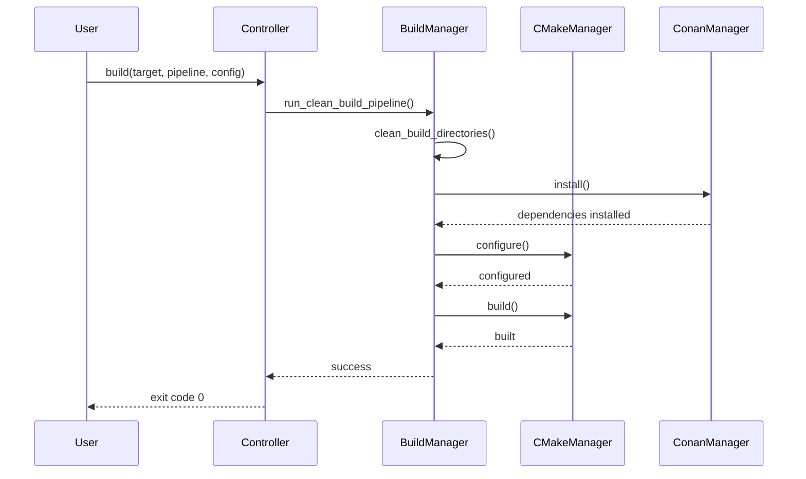

# Build Questions

Questions and solutions related to the build system, compilation, and dependencies.

## Table of Contents

- [Build System Overview](#build-system-overview)
- [Compiler Issues](#compiler-issues)
- [CMake Configuration](#cmake-configuration)
- [Dependency Issues](#dependency-issues)
- [Build Performance](#build-performance)
- [Cross-Compilation](#cross-compilation)

## Build System Overview

### How does the build system work?

**TL;DR:** The build system uses [`OmniCppController.py`](../OmniCppController.py:1) to orchestrate CMake, Conan, and build operations.

**The Deep Dive:**



**The Analogy:**
Think of the build system like a construction project manager:
- **Controller** = Project manager (coordinates everything)
- **BuildManager** = Site supervisor (manages the workflow)
- **CMakeManager** = Architect (creates the blueprint)
- **ConanManager** = Materials supplier (delivers dependencies)

**Key Classes:**
- [`OmniCppController`](../OmniCppController.py:131) - Main entry point
- [`BuildManager`](../omni_scripts/build.py:179) - Build orchestration
- [`CMakeManager`](../omni_scripts/cmake.py:109) - CMake operations
- [`ConanManager`](../omni_scripts/conan.py:101) - Dependency management

### What are the available build targets?

**TL;DR:** The project supports `engine`, `game`, `standalone`, and `all` targets.

**The Deep Dive:**

| Target | Description | Output |
|--------|-------------|---------|
| **engine** | Game engine library | `libomnicpp_engine.dll/.so` |
| **game** | Game executable | `omnicpp_game.exe/omnicpp_game` |
| **standalone** | Combined engine+game | `omnicpp.exe/omnicpp` |
| **all** | Build all targets | All of the above |

**Usage:**
```bash
# Build engine library only
python OmniCppController.py build engine "Clean Build Pipeline" default release

# Build game executable
python OmniCppController.py build game "Clean Build Pipeline" default release

# Build standalone (engine + game)
python OmniCppController.py build standalone "Clean Build Pipeline" default release

# Build everything
python OmniCppController.py build all "Clean Build Pipeline" default release
```

**Reference:** [`omni_scripts/build.py:561-643`](../omni_scripts/build.py:561-643)

## Compiler Issues

### Why does my build fail with "compiler not found"?

**TL;DR:** The specified compiler is not installed or not in the system PATH.

**The Deep Dive:**

The build system uses [`detect_compiler()`](../omni_scripts/compilers/detector.py:1) to find available compilers. If detection fails:

1. **Verify compiler installation:**
```bash
# Windows - MSVC
cl --version

# Windows - MinGW
gcc --version
clang --version

# Linux
gcc --version
clang --version
```

2. **Check PATH:**
```bash
# Windows
echo %PATH%

# Linux/macOS
echo $PATH
```

3. **Specify compiler explicitly:**
```bash
python OmniCppController.py build standalone "Build Project" default release --compiler msvc
```

**Supported Compilers:**
- `msvc` - Microsoft Visual C++
- `clang-msvc` - Clang with MSVC toolchain
- `mingw-gcc` - MinGW with GCC
- `mingw-clang` - MinGW with Clang
- `gcc` - GCC (Linux)
- `clang` - Clang (Linux)

**Reference:** [`omni_scripts/compilers/detector.py`](../omni_scripts/compilers/detector.py:1)

### How do I switch between MSVC and MinGW?

**TL;DR:** Use the `--compiler` flag: `--compiler msvc` or `--compiler mingw-gcc`.

**The Deep Dive:**

**MSVC (Visual Studio):**
```bash
# Requires Visual Studio 2019+ with C++ workload
python OmniCppController.py build standalone "Build Project" default release --compiler msvc
```

**MinGW (MSYS2):**
```bash
# Requires MSYS2 with UCRT64 environment
python OmniCppController.py build standalone "Build Project" default release --compiler mingw-gcc
```

**Key Differences:**

| Aspect | MSVC | MinGW |
|--------|--------|--------|
| **Runtime** | MSVCRT | UCRT/MSVCRT |
| **Debugging** | Visual Studio Debugger | GDB/LLDB |
| **Standard Library** | MSVC STL | libstdc++ |
| **Performance** | Optimized for Windows | Portable |

**Note:** The build system automatically detects the best available compiler if `--compiler` is not specified.

**Reference:** [`OmniCppController.py:247-258`](../OmniCppController.py:247-258)

## CMake Configuration

### Why does CMake configuration fail?

**TL;DR:** Common causes include missing dependencies, incorrect CMake version, or invalid toolchain paths.

**The Deep Dive:**

**Common Issues and Solutions:**

1. **CMake Version Too Old:**
```bash
# Check version
cmake --version  # Should be 3.20+

# Update CMake
# Windows: Download from cmake.org
# Linux: sudo apt install cmake
# macOS: brew install cmake
```

2. **Missing Dependencies:**
```bash
# Clean and rebuild
python OmniCppController.py build standalone "Clean Build Pipeline" default release
```

3. **Invalid Toolchain:**
```bash
# Verify toolchain file exists
ls cmake/toolchains/

# Use default toolchain
python OmniCppController.py build standalone "Build Project" default release
```

**Debug CMake Configuration:**
```bash
# Enable verbose output
cmake -S . -B build/debug -DCMAKE_BUILD_TYPE=Debug --trace-expand

# Check CMake cache
cat build/debug/CMakeCache.txt | grep -i error
```

**Reference:** [`omni_scripts/cmake.py:141-286`](../omni_scripts/cmake.py:141-286)

### How do I change the CMake generator?

**TL;DR:** The generator is automatically selected based on the compiler, but can be overridden in [`CMakePresets.json`](../CMakePresets.json:1).

**The Deep Dive:**

**Default Generators:**
| Compiler | Generator |
|----------|-----------|
| MSVC | "Visual Studio 17 2022" |
| MSVC-Clang | "Visual Studio 17 2022" |
| MinGW | Ninja |
| GCC/Clang (Linux) | Unix Makefiles |

**Custom Generator:**
Edit [`CMakePresets.json`](../CMakePresets.json:1):
```json
{
  "version": 3,
  "configurePresets": [
    {
      "name": "default",
      "generator": "Ninja",
      "binaryDir": "${sourceDir}/build/${presetName}",
      "cacheVariables": {
        "CMAKE_BUILD_TYPE": "Debug"
      }
    }
  ]
}
```

**Reference:** [`omni_scripts/cmake.py:502-528`](../omni_scripts/cmake.py:502-528)

## Dependency Issues

### Why does Conan install fail?

**TL;DR:** Common causes include network issues, missing profiles, or package conflicts.

**The Deep Dive:**

**Common Issues and Solutions:**

1. **Network Issues:**
```bash
# Check remote
conan remote list

# Add default remote if missing
conan remote add conancenter https://center.conan.io
```

2. **Missing Profile:**
```bash
# Check available profiles
ls conan/profiles/

# Verify profile exists
cat conan/profiles/msvc-release
```

3. **Cache Issues:**
```bash
# Clear Conan cache
conan remove "*" -c
conan cache clean

# Reinstall
python OmniCppController.py build standalone "Clean Build Pipeline" default release
```

**Debug Conan Install:**
```bash
# Enable verbose output
conan install . --build=missing -v

# Check Conan logs
cat ~/.conan/logs/conan.log
```

**Reference:** [`omni_scripts/conan.py:130-271`](../omni_scripts/conan.py:130-271)

### How do I add a new Conan dependency?

**TL;DR:** Add to [`conan/conanfile.py`](../conan/conanfile.py:1) or [`conan/conanfile.txt`](../conan/conanfile.txt:1).

**The Deep Dive:**

**Using conanfile.py (for complex dependencies):**
```python
# conan/conanfile.py
from conan import ConanFile

class OmniCppConan(ConanFile):
    name = "omnicpp"
    version = "1.0.0"
    settings = "os", "compiler", "build_type", "arch"
    
    requirements = [
        "fmt/10.0.0",
        "spdlog/1.12.0",
        "glm/0.9.9.8",
    ]
    
    def requirements(self):
        self.requires("vulkan-headers/1.3.250")
```

**Using conanfile.txt (for simple dependencies):**
```ini
# conan/conanfile.txt
[requires]
fmt/10.0.0
spdlog/1.12.0
glm/0.9.9.8

[generators]
CMakeDeps
CMakeToolchain
```

**Reference:** [`omni_scripts/conan.py:172-194`](../omni_scripts/conan.py:172-194)

## Build Performance

### How can I speed up builds?

**TL;DR:** Use parallel builds, ccache, and incremental builds.

**The Deep Dive:**

**1. Parallel Builds:**
```bash
# Use all available cores
python OmniCppController.py build standalone "Build Project" default release --parallel 8
```

**2. Use ccache (Linux/macOS):**
```bash
# Install ccache
sudo apt install ccache  # Ubuntu/Debian
brew install ccache          # macOS

# Enable in CMake
cmake -S . -B build/release -DCMAKE_CXX_COMPILER_LAUNCHER=ccache
```

**3. Incremental Builds:**
```bash
# Don't use "Clean Build Pipeline" for development
python OmniCppController.py build standalone "Build Project" default release

# Only clean when necessary
python OmniCppController.py clean
```

**4. Use Ninja Generator:**
```bash
# Ninja is faster than Makefiles
# Automatically used with MinGW compilers
python OmniCppController.py build standalone "Build Project" default release --compiler mingw-gcc
```

**Build Time Comparison:**
| Configuration | Time (relative) |
|---------------|------------------|
| Debug, single-threaded | 100% (baseline) |
| Debug, 8 threads | ~30% |
| Release, 8 threads, ccache | ~15% |

### Why are rebuilds slow?

**TL;DR:** Rebuilds are slow when header files change frequently or when using inefficient generators.

**The Deep Dive:**

**Common Causes:**

1. **Header Changes:**
- Changing a header included by many files causes widespread recompilation
- Solution: Use forward declarations and PIMPL idiom

2. **Inefficient Generator:**
- Makefiles are slower than Ninja
- Solution: Use Ninja generator

3. **Missing ccache:**
- No compilation cache means full rebuilds
- Solution: Install and enable ccache

**Monitoring Build Performance:**
```bash
# Check build time
time python OmniCppController.py build standalone "Build Project" default release

# View CMake build graph
cmake --build build/release --graphviz=graph.dot
dot -Tpng graph.dot -o graph.png
```

## Cross-Compilation

### How do I cross-compile for ARM64 Linux?

**TL;DR:** Use the ARM64 toolchain: `python OmniCppController.py build standalone "Build Project" arm64-linux-gnu release`.

**The Deep Dive:**

**1. Install Cross-Compilation Toolchain:**
```bash
# Ubuntu/Debian
sudo apt install gcc-aarch64-linux-gnu g++-aarch64-linux-gnu

# Fedora/RHEL
sudo dnf install gcc-aarch64-linux-gnu gcc-c++-aarch64-linux-gnu
```

**2. Build for ARM64:**
```bash
python OmniCppController.py build standalone "Build Project" arm64-linux-gnu release
```

**3. Verify Output:**
```bash
file build/arm64-linux-gnu/release/bin/omnicpp
# Should show: ELF 64-bit LSB executable, ARM aarch64
```

**Key File:** [`cmake/toolchains/arm64-linux-gnu.cmake`](../cmake/toolchains/arm64-linux-gnu.cmake:1)

### How do I cross-compile for Windows from Linux?

**TL;DR:** Use MinGW-w64 cross-compiler: `python OmniCppController.py build standalone "Build Project" x86_64-w64-mingw32 release`.

**The Deep Dive:**

**1. Install MinGW-w64:**
```bash
# Ubuntu/Debian
sudo apt install mingw-w64

# Fedora/RHEL
sudo dnf install mingw64-gcc mingw64-c++
```

**2. Build for Windows:**
```bash
python OmniCppController.py build standalone "Build Project" x86_64-w64-mingw32 release
```

**3. Test on Windows:**
- Copy the executable to a Windows machine
- Run to verify it works

**Note:** Some Windows-specific features (like DirectX) may not work when cross-compiling.
