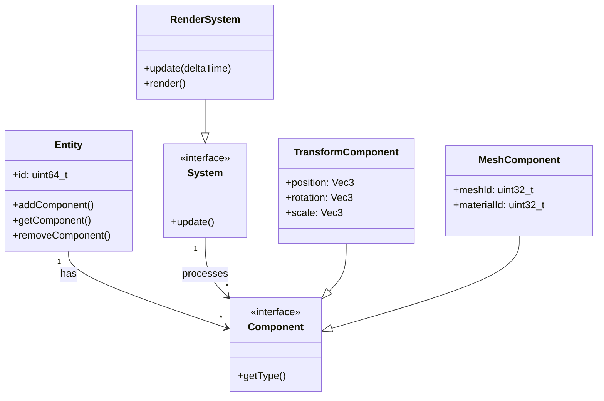

# Common Questions

General questions about the OmniCPP-template project.

## Table of Contents

- [Project Structure](#project-structure)
- [C++23 Features](#c23-features)
- [Game Engine Architecture](#game-engine-architecture)
- [Cross-Platform Support](#cross-platform-support)
- [Package Managers](#package-managers)
- [Code Quality Tools](#code-quality-tools)

## Project Structure

### What is the project directory layout?

**TL;DR:** The project follows a standard monorepo structure with separate directories for source, include, build, and configuration.

**The Deep Dive:**

```
OmniCPP-template/
├── src/                    # Source code
│   ├── engine/             # Game engine implementation
│   └── game/              # Game/example implementation
├── include/                # Public headers
│   ├── engine/             # Engine public API
│   └── game/              # Game public API
├── cmake/                  # CMake modules
├── omni_scripts/          # Python build scripts
├── conan/                  # Conan configuration
├── docs/                   # Documentation
├── examples/                # Example projects
├── tests/                  # Unit tests
└── CMakeLists.txt          # Root CMake configuration
```

**Key Directories:**
- [`src/engine/`](../src/engine/) - Core engine implementation (audio, graphics, physics, etc.)
- [`src/game/`](../src/game/) - Game-specific code using the engine
- [`omni_scripts/`](../omni_scripts/) - Python build automation scripts
- [`cmake/`](../cmake/) - Reusable CMake modules

### How do I add a new module to the engine?

**TL;DR:** Create header files in [`include/engine/`](../include/engine/) and implementation in [`src/engine/`](../src/engine/), then update CMakeLists.txt.

**The Deep Dive:**

1. **Create header file:**
```cpp
// include/engine/my_module.hpp
#pragma once
namespace omnicpp {
namespace engine {
class MyModule {
public:
    void initialize();
    void shutdown();
};
} // namespace engine
} // namespace omnicpp
```

2. **Create implementation:**
```cpp
// src/engine/my_module.cpp
#include <engine/my_module.hpp>

namespace omnicpp {
namespace engine {
void MyModule::initialize() {
    // Implementation
}

void MyModule::shutdown() {
    // Cleanup
}
} // namespace engine
} // namespace omnicpp
```

3. **Update CMakeLists.txt:**
```cmake
# In src/engine/CMakeLists.txt
target_sources(omnicpp_engine PRIVATE
    my_module.cpp
)
```

## C++23 Features

### What C++23 features are used?

**TL;DR:** The project uses C++23 modules, standard library improvements, and language enhancements.

**The Deep Dive:**

| Feature | Description | Usage |
|---------|-------------|--------|
| **Modules** | Import-based module system | [`include/engine/`](../include/engine/) |
| **Deducing This** | Explicit object parameter | ECS components |
| **Ranges** | Functional algorithms | Data processing |
| **Views** | Non-owning ranges | Resource management |
| **Format** | Type-safe formatting | Logging system |

**Example - C++23 Modules:**
```cpp
// engine/module.cppm
export module omnicpp.engine;

import std;

export namespace omnicpp {
namespace engine {
class Engine {
public:
    void run();
};
}
```

### Can I use an older C++ standard?

**TL;DR:** Yes, modify [`CMakeLists.txt`](../CMakeLists.txt:471) to set `CMAKE_CXX_STANDARD` to 17 or 20.

**The Deep Dive:**

In [`CMakeLists.txt`](../CMakeLists.txt:471), change:
```cmake
set(CMAKE_CXX_STANDARD 23)
```

To:
```cmake
set(CMAKE_CXX_STANDARD 20)  # or 17
```

**Note:** Some features may not be available with older standards. You'll need to adapt the code accordingly.

## Game Engine Architecture

### What is the ECS architecture?

**TL;DR:** ECS (Entity Component System) is a data-oriented design pattern that separates data (components) from behavior (systems).

**The Deep Dive:**



**The Analogy:**
Think of ECS like a warehouse:
- **Entities** are boxes (containers with IDs)
- **Components** are items inside boxes (data only)
- **Systems** are workers who process specific types of items (behavior only)

**Key Files:**
- [`include/engine/ecs/Entity.hpp`](../include/engine/ecs/Entity.hpp) - Entity management
- [`include/engine/ecs/Component.hpp`](../include/engine/ecs/Component.hpp) - Component base class
- [`include/engine/ecs/System.hpp`](../include/engine/ecs/System.hpp) - System base class

### How do I create a custom component?

**TL;DR:** Inherit from [`Component`](../include/engine/ecs/Component.hpp:1) and register it with the entity system.

**The Deep Dive:**

```cpp
// include/engine/ecs/HealthComponent.hpp
#pragma once
#include <engine/ecs/Component.hpp>

namespace omnicpp {
namespace engine {
namespace ecs {

class HealthComponent : public Component {
public:
    float currentHealth;
    float maxHealth;
    
    HealthComponent(float health = 100.0f)
        : currentHealth(health), maxHealth(health) {}
    
    bool isAlive() const {
        return currentHealth > 0.0f;
    }
    
    void takeDamage(float amount) {
        currentHealth = std::max(0.0f, currentHealth - amount);
    }
    
    void heal(float amount) {
        currentHealth = std::min(maxHealth, currentHealth + amount);
    }
};

} // namespace ecs
} // namespace engine
} // namespace omnicpp
```

## Cross-Platform Support

### Which platforms are supported?

**TL;DR:** Windows, Linux, and WebAssembly (WASM) are officially supported.

**The Deep Dive:**

| Platform | Compilers | Status |
|----------|-----------|--------|
| Windows | MSVC, MSVC-Clang, MinGW-GCC, MinGW-Clang | ✅ Full Support |
| Linux | GCC, Clang | ✅ Full Support |
| macOS | Clang | ⚠️ Experimental |
| WebAssembly | Emscripten | ✅ Full Support |

### How do I build for WebAssembly?

**TL;DR:** Use the Emscripten toolchain: `python OmniCppController.py build standalone "Build Project" emscripten release`.

**The Deep Dive:**

1. **Install Emscripten:**
```bash
git clone https://github.com/emscripten-core/emsdk.git
cd emsdk
./emsdk install latest
./emsdk activate latest
source ./emsdk_env.sh
```

2. **Build for WASM:**
```bash
python OmniCppController.py build standalone "Build Project" emscripten release
```

3. **Output Location:**
```
build/emscripten/release/bin/
├── index.html      # Web page
├── omnicpp.js      # JavaScript glue
└── omnicpp.wasm    # WebAssembly binary
```

**Key File:** [`cmake/toolchains/emscripten.cmake`](../cmake/toolchains/emscripten.cmake:1)

## Package Managers

### Which package managers are supported?

**TL;DR:** Conan, vcpkg, and CPM.cmake are supported, with CPM being the default.

**The Deep Dive:**

| Package Manager | Status | Use Case |
|----------------|----------|-----------|
| **CPM.cmake** | ✅ Default | Fetch-only, no installation required |
| **Conan** | ✅ Supported | Binary packages, cross-platform |
| **vcpkg** | ✅ Supported | Microsoft ecosystem, Windows-focused |

**Configuration in [`CMakeLists.txt`](../CMakeLists.txt:56-58):**
```cmake
option(OMNICPP_USE_CONAN "Use Conan package manager" OFF)
option(OMNICPP_USE_VCPKG "Use vcpkg package manager" OFF)
option(OMNICPP_USE_CPM "Use CPM.cmake package manager" ON)
```

### How do I add a dependency via CPM?

**TL;DR:** Add to [`dependencies.cmake`](../dependencies.cmake:1) using `CPMAddPackage`.

**The Deep Dive:**

```cmake
# dependencies.cmake
CPMAddPackage(
    NAME fmt
    VERSION 10.0.0
    GITHUB_REPOSITORY fmtlib/fmt
    OPTIONS "FMT_INSTALL OFF"
)

CPMAddPackage(
    NAME spdlog
    VERSION 1.12.0
    GITHUB_REPOSITORY gabime/spdlog
    OPTIONS "SPDLOG_BUILD_SHARED OFF"
)
```

**Key File:** [`cmake/CPM.cmake`](../cmake/CPM.cmake:1) - CPM implementation

## Code Quality Tools

### How do I format code?

**TL;DR:** Run `python OmniCppController.py format` to format C++ and Python code.

**The Deep Dive:**

The controller uses:
- **clang-format** for C++ files (`.cpp`, `.hpp`, `.h`)
- **black** for Python files (`.py`)

**Configuration Files:**
- [`.clang-format`](../.clang-format:1) - C++ formatting rules
- [`.pre-commit-config.yaml`](../.pre-commit-config.yaml:1) - Pre-commit hooks

**Usage:**
```bash
# Format all files
python OmniCppController.py format

# Format specific directory
python OmniCppController.py format --directories src/engine

# Check formatting without modifying
python OmniCppController.py format --check

# Format only C++ files
python OmniCppController.py format --cpp-only
```

**Reference:** [`OmniCppController.py:556-624`](../OmniCppController.py:556-624)

### How do I run static analysis?

**TL;DR:** Run `python OmniCppController.py lint` to run clang-tidy, pylint, and mypy.

**The Deep Dive:**

| Tool | Language | Purpose |
|------|----------|----------|
| **clang-tidy** | C++ | Static analysis, bug detection |
| **pylint** | Python | Code quality, style checking |
| **mypy** | Python | Type checking |

**Usage:**
```bash
# Lint all files
python OmniCppController.py lint

# Lint with auto-fix
python OmniCppController.py lint --fix

# Lint specific directory
python OmniCppController.py lint --directories src/engine

# Lint only C++ files
python OmniCppController.py lint --cpp-only
```

**Configuration Files:**
- [`.clang-tidy`](../.clang-tidy:1) - clang-tidy checks
- [`.pylintrc`](../.pylintrc:1) - pylint configuration

**Reference:** [`OmniCppController.py:626-701`](../OmniCppController.py:626-701)
